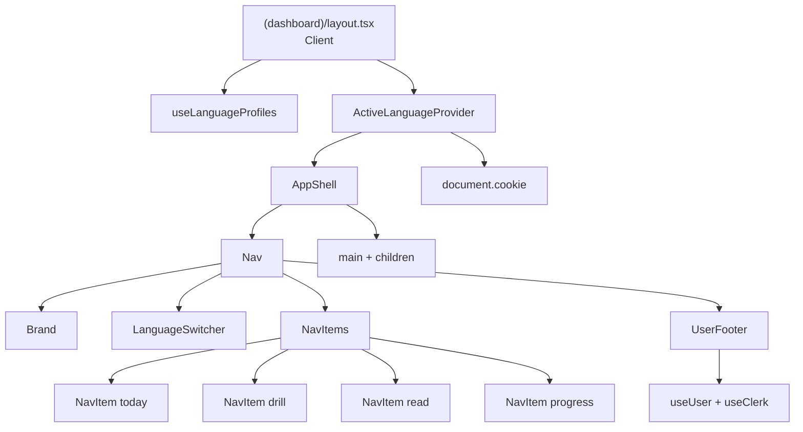
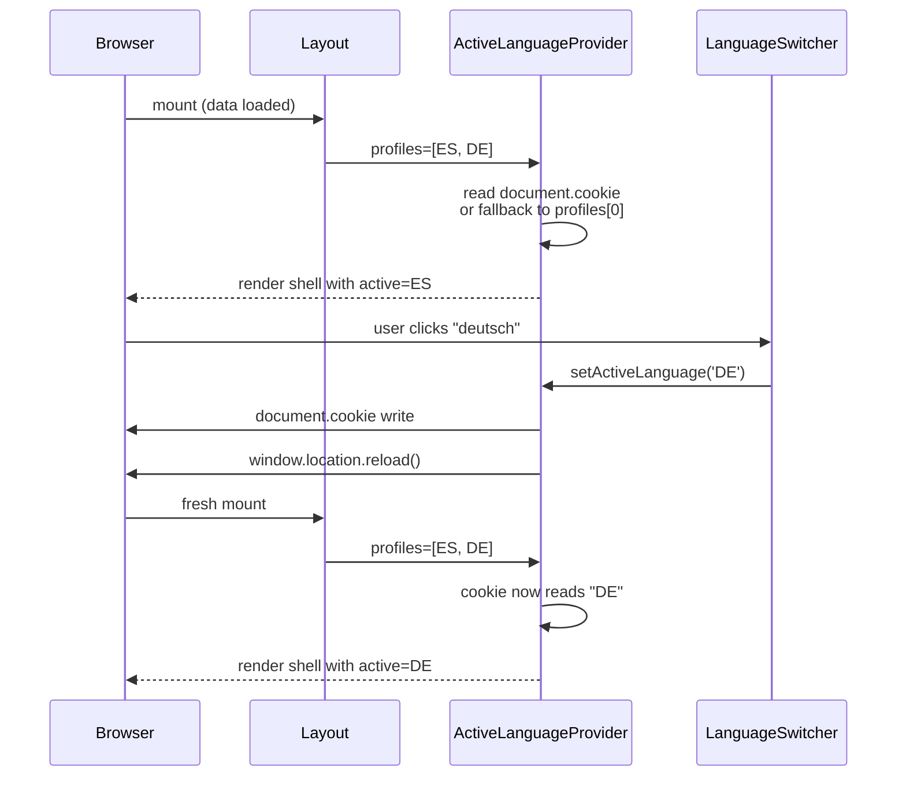

# App Shell — Technical Design

## Architecture Overview

The existing `(dashboard)/layout.tsx` is a **client component** that handles loading state, error state, and the no-profiles redirect to `/onboarding`. We preserve this behavior — the shell is composed from inside this client layout, with `ActiveLanguageProvider` reading the cookie via `document.cookie` on mount.

```
(dashboard)/layout.tsx (Client) — existing loading/error/redirect logic preserved
└── ActiveLanguageProvider (Client) — reads cookie, provides context
    └── AppShell (Client wrapper, mostly static markup)
        ├── Nav — 220px left rail
        │   ├── Brand — link to /
        │   ├── LanguageSwitcher — dropdown, cookie writes
        │   ├── NavItems — list of NavItem (uses usePathname)
        │   └── UserFooter — Clerk useUser + overflow menu
        └── <main> — children render here
```

**Why client-first:** The existing layout already has TanStack Query-driven loading/error/redirect logic that we shouldn't break. Keeping the entire shell client-side simplifies the data flow at the cost of a marginally larger JS bundle. The main content (page bodies) can still mix server and client components freely — the shell is just chrome.

**Cookie read strategy:** `ActiveLanguageProvider` reads `document.cookie` once on mount in a `useState` initializer. This avoids a hydration mismatch (since the server doesn't read it). The provider receives the user's profiles list as a prop and falls back to the first profile if the cookie is missing or invalid. There is a brief flash where the switcher renders before profiles load, but this is acceptable given the existing layout already shows a spinner during profile load.

---

## File Structure

```
apps/web/
├── app/
│   └── (dashboard)/
│       ├── layout.tsx              ← MODIFY: wrap children in ActiveLanguageProvider + AppShell
│       ├── page.tsx                ← unchanged (Phase D will redesign)
│       ├── drill/
│       │   ├── page.tsx            ← MOVE from /practice
│       │   └── page.test.tsx       ← MOVE from /practice (verify imports)
│       ├── practice/
│       │   └── page.tsx            ← REPLACE: redirect to /drill
│       ├── read/
│       │   └── page.tsx            ← CREATE: placeholder
│       ├── progress/
│       │   └── page.tsx            ← CREATE: placeholder
│       └── settings/
│           └── page.tsx            ← CREATE: placeholder
├── components/
│   └── shell/
│       ├── index.ts                ← barrel export
│       ├── app-shell.tsx           ← layout wrapper (220px nav + main)
│       ├── nav.tsx                 ← nav rail composition
│       ├── brand.tsx               ← brand mark + name
│       ├── language-switcher.tsx   ← dropdown with keyboard nav
│       ├── flagdot.tsx             ← 24px colored circle
│       ├── nav-items.tsx           ← static list of nav items
│       ├── nav-item.tsx            ← single item, uses usePathname
│       ├── nav-icons.tsx           ← 4 SVG icon components
│       ├── user-footer.tsx         ← Clerk user + overflow menu
│       ├── active-language-provider.tsx  ← React context + cookie I/O
│       └── __tests__/
│           ├── language-switcher.test.tsx
│           ├── nav-item.test.tsx
│           ├── flagdot.test.tsx
│           └── user-footer.test.tsx
└── lib/
    └── active-language.ts          ← cookie name + Language validation helpers (shared client/server)
```

All shell components are client components — the dashboard layout that wraps them is already client-side, so there's no benefit to mixing in server components for static parts.

---

## Design Token Compliance

All styling uses the design system from Phase A. Verified against `apps/web/app/globals.css`:

| Category | Tokens used | Source |
|----------|-------------|--------|
| Colors | `paper`, `paper-2`, `card`, `ink`, `ink-soft`, `ink-mute`, `rule`, `accent`, `accent-2`, `accent-soft` | `--color-*` in @theme |
| Spacing | `s-2` (8px), `s-3` (12px), `s-4` (16px), `s-6` (24px) | `--spacing-s-*` |
| Radii | `r-sm` (6px), `r-md` (10px), `r-lg` (16px), `r-pill` | `--radius-r-*` |
| Shadows | `shadow-1`, `shadow-2` | `--shadow-1`, `--shadow-2` |
| Fonts | `display` (Fraunces), `mono` (JetBrains Mono) | `--font-*` |
| Layout | `max-w-max-content` (1100px) | `--width-max-content` |
| Type scale | `t-display-l`, `t-display-s`, `t-small` | utility classes in globals.css |

Two arbitrary values are used for design fidelity (no token covers them exactly): `[24px]` for flagdot diameter (between s-5 and s-6), `[28px]` for brand mark, `[30px]` for avatar, `[10px]`/`[13px]`/`[18px]`/`[36px]`/`[48px]` for matching the prototype's exact paddings/font-sizes from the handoff.

Focus rings use `focus-visible:shadow-[0_0_0_3px_rgba(26,22,18,0.08)]` matching the design system pattern from Phase A's Input component.

No new tokens needed.

---

## Layer 1: Active Language State

### lib/active-language.ts (shared)

The `Language` enum from `@language-drill/shared` includes `EN` (used as the source language for translation exercises), but users only *learn* ES, DE, or TR. The switcher must filter EN out. We expose a typed subset:

```typescript
import { Language } from '@language-drill/shared';

export type LearningLanguage = Exclude<Language, Language.EN>;

const COOKIE_NAME = 'active_language';

const VALID_LEARNING_LANGUAGES = new Set<string>([
  Language.ES,
  Language.DE,
  Language.TR,
]);

export function isLearningLanguage(value: unknown): value is LearningLanguage {
  return typeof value === 'string' && VALID_LEARNING_LANGUAGES.has(value);
}

export function readActiveLanguageCookie(): LearningLanguage | null {
  if (typeof document === 'undefined') return null;
  const match = document.cookie.match(/(?:^|;\s*)active_language=([^;]+)/);
  if (!match) return null;
  const raw = decodeURIComponent(match[1]);
  return isLearningLanguage(raw) ? raw : null;
}

export function writeActiveLanguageCookie(lang: LearningLanguage): void {
  document.cookie = `${COOKIE_NAME}=${lang}; path=/; SameSite=Lax; max-age=31536000`;
}
```

### components/shell/active-language-provider.tsx

```typescript
'use client';
import { createContext, useContext, useState } from 'react';
import type { LanguageProfile } from '@language-drill/shared';
import {
  type LearningLanguage,
  readActiveLanguageCookie,
  writeActiveLanguageCookie,
} from '../../lib/active-language';

interface ActiveLanguageContextValue {
  activeLanguage: LearningLanguage;
  setActiveLanguage: (lang: LearningLanguage) => void;
}

const Ctx = createContext<ActiveLanguageContextValue | null>(null);

function resolveInitial(profiles: LanguageProfile[]): LearningLanguage {
  // Filter to learning languages only — EN is a source language, not selectable
  const learning = profiles
    .map((p) => p.language)
    .filter((l): l is LearningLanguage => l !== 'EN');

  const cookie = readActiveLanguageCookie();
  if (cookie && learning.includes(cookie)) return cookie;
  return learning[0] ?? 'ES';
}

export function ActiveLanguageProvider({
  profiles,
  children,
}: {
  profiles: LanguageProfile[];
  children: React.ReactNode;
}) {
  // Read cookie once on mount via lazy initializer to avoid hydration mismatch
  const [activeLanguage, setActiveLanguageState] = useState<LearningLanguage>(() =>
    resolveInitial(profiles)
  );

  function setActiveLanguage(lang: LearningLanguage) {
    writeActiveLanguageCookie(lang);
    setActiveLanguageState(lang);
    // Reload so any server-fetched data refetches with the new language
    window.location.reload();
  }

  return <Ctx.Provider value={{ activeLanguage, setActiveLanguage }}>{children}</Ctx.Provider>;
}

export function useActiveLanguage(): ActiveLanguageContextValue {
  const ctx = useContext(Ctx);
  if (!ctx) throw new Error('useActiveLanguage must be used within ActiveLanguageProvider');
  return ctx;
}
```

**Rationale for `window.location.reload()`:** The shell uses `useLanguageProfiles` (TanStack Query) but the active language isn't currently a query key for any other data. Reload is the simplest correct way to ensure subsequent SSR passes (e.g., for the upcoming dashboard that fetches today's plan in the active language) see the updated cookie. Once a Phase D dashboard loads language-specific data, we can switch to `router.refresh()` + targeted query invalidation if reload feels heavy.

### Layout integration

The existing client layout's loading/error/redirect logic is preserved verbatim. We only add the provider and shell wrapper around the children when profiles are loaded:

```typescript
// app/(dashboard)/layout.tsx (Client Component — unchanged "use client")
"use client";

import { useMemo } from "react";
import { useRouter } from "next/navigation";
import { useAuth } from "@clerk/nextjs";
import {
  useLanguageProfiles,
  createAuthenticatedFetch,
} from "@language-drill/api-client";
import { ActiveLanguageProvider } from "../../components/shell/active-language-provider";
import { AppShell } from "../../components/shell";

export default function DashboardLayout({
  children,
}: {
  children: React.ReactNode;
}) {
  const router = useRouter();
  const { getToken } = useAuth();
  const fetchFn = useMemo(() => createAuthenticatedFetch(getToken), [getToken]);
  const { data, isLoading, error, refetch } = useLanguageProfiles({ fetchFn });

  // Existing loading state — restyled to use design tokens
  if (isLoading) {
    return (
      <div className="flex min-h-screen items-center justify-center bg-paper">
        <div className="h-8 w-8 animate-spin rounded-full border-4 border-paper-2 border-t-ink" />
      </div>
    );
  }

  // Existing error state — restyled to use design tokens
  if (error) {
    return (
      <div className="flex min-h-screen items-center justify-center bg-paper">
        <div className="max-w-md rounded-r-lg border border-rule bg-card p-s-6 text-center shadow-1">
          <p className="t-display-s">failed to load your profile</p>
          <p className="t-small mt-s-2">{error.message}</p>
          <button
            onClick={() => refetch()}
            className="mt-s-4 rounded-r-md bg-ink text-paper px-s-4 py-s-2 text-[13px] font-medium transition-all duration-150 hover:bg-accent-2"
          >
            retry
          </button>
        </div>
      </div>
    );
  }

  // Existing redirect when no profiles
  if (data && data.profiles.length === 0) {
    router.push("/onboarding");
    return (
      <div className="flex min-h-screen items-center justify-center bg-paper">
        <div className="h-8 w-8 animate-spin rounded-full border-4 border-paper-2 border-t-ink" />
      </div>
    );
  }

  // NEW: wrap children in shell when profiles are loaded
  return (
    <ActiveLanguageProvider profiles={data?.profiles ?? []}>
      <AppShell>{children}</AppShell>
    </ActiveLanguageProvider>
  );
}
```

The existing tailwind classes (`text-red-700`, `bg-blue-600`, etc.) are replaced with design system tokens. This is a small in-scope improvement — the layout's loading/error UI was placeholder styling that now should match the design language.

---

## Layer 2: Shell Components

### AppShell

Receives profiles from the parent layout and passes them through to `Nav`.

```typescript
'use client';
import type { LanguageProfile } from '@language-drill/shared';
import { Nav } from './nav';

interface AppShellProps {
  profiles: LanguageProfile[];
  children: React.ReactNode;
}

export function AppShell({ profiles, children }: AppShellProps) {
  return (
    <div className="flex h-screen bg-paper">
      <Nav profiles={profiles} />
      <main className="flex-1 min-w-0 min-h-0 overflow-y-auto bg-paper">
        <div className="max-w-max-content mx-auto w-full py-[36px] px-[48px]">
          {children}
        </div>
      </main>
    </div>
  );
}
```

The dashboard layout updates accordingly:
```typescript
return (
  <ActiveLanguageProvider profiles={data?.profiles ?? []}>
    <AppShell profiles={data?.profiles ?? []}>{children}</AppShell>
  </ActiveLanguageProvider>
);
```

### Nav

```typescript
'use client';
import type { LanguageProfile } from '@language-drill/shared';
import { Brand } from './brand';
import { LanguageSwitcher } from './language-switcher';
import { NavItems } from './nav-items';
import { UserFooter } from './user-footer';

export function Nav({ profiles }: { profiles: LanguageProfile[] }) {
  return (
    <nav
      aria-label="primary"
      className="w-[220px] flex-shrink-0 flex flex-col gap-1 border-r border-rule bg-paper px-s-4 py-[22px]"
    >
      <Brand />
      <LanguageSwitcher profiles={profiles} />
      <NavItems />
      <UserFooter />
    </nav>
  );
}
```

### Brand

```typescript
import Link from 'next/link';

export function Brand() {
  return (
    <Link
      href="/"
      className="flex items-center gap-s-2 px-s-2 pb-[18px] focus-visible:outline-none focus-visible:shadow-[0_0_0_3px_rgba(26,22,18,0.08)] rounded-r-sm"
    >
      <span className="w-[28px] h-[28px] rounded-[7px] bg-ink text-paper flex items-center justify-center font-display font-semibold">
        d
      </span>
      <span className="font-display text-[20px] font-semibold tracking-[-0.4px] text-ink">
        drill
      </span>
    </Link>
  );
}
```

### Flagdot

```typescript
import type { LearningLanguage } from '../../lib/active-language';
import { cn } from '../../lib/cn';

const COLORS: Record<LearningLanguage, string> = {
  ES: 'bg-accent',
  DE: 'bg-[#4b4138]',
  TR: 'bg-[#c01818]',
};

export function Flagdot({
  language,
  className,
}: {
  language: LearningLanguage;
  className?: string;
}) {
  return (
    <span
      aria-hidden="true"
      className={cn(
        'inline-flex items-center justify-center w-[24px] h-[24px] rounded-full font-mono text-[10px] font-semibold text-white flex-shrink-0',
        COLORS[language],
        className
      )}
    >
      {language.toLowerCase()}
    </span>
  );
}
```

The `LearningLanguage` type is `Exclude<Language, Language.EN>`, so the `Record` is exhaustive over ES/DE/TR.

### LanguageSwitcher

Receives the profiles list as a prop (so the parent owns the data fetch via `useLanguageProfiles`). Filters to learning languages, supports keyboard navigation per NFR-2.

```typescript
'use client';
import { useState, useRef, useEffect, useMemo } from 'react';
import Link from 'next/link';
import type { LanguageProfile } from '@language-drill/shared';
import { LANGUAGE_NAMES } from '@language-drill/shared';
import {
  type LearningLanguage,
  isLearningLanguage,
} from '../../lib/active-language';
import { useActiveLanguage } from './active-language-provider';
import { Flagdot } from './flagdot';

interface LanguageSwitcherProps {
  profiles: LanguageProfile[];
}

const focusRing =
  'focus-visible:outline-none focus-visible:shadow-[0_0_0_3px_rgba(26,22,18,0.08)]';

export function LanguageSwitcher({ profiles }: LanguageSwitcherProps) {
  const { activeLanguage, setActiveLanguage } = useActiveLanguage();

  // Only learning languages (ES/DE/TR) are selectable
  const learningProfiles = useMemo(
    () => profiles.filter((p) => isLearningLanguage(p.language)) as
      Array<LanguageProfile & { language: LearningLanguage }>,
    [profiles]
  );
  const activeProfile = learningProfiles.find((p) => p.language === activeLanguage);

  const [open, setOpen] = useState(false);
  const [focusedIdx, setFocusedIdx] = useState(0);
  const ref = useRef<HTMLDivElement>(null);

  useEffect(() => {
    if (!open) return;
    function onClick(e: MouseEvent) {
      if (ref.current && !ref.current.contains(e.target as Node)) setOpen(false);
    }
    function onKey(e: KeyboardEvent) {
      if (e.key === 'Escape') setOpen(false);
    }
    document.addEventListener('mousedown', onClick);
    document.addEventListener('keydown', onKey);
    return () => {
      document.removeEventListener('mousedown', onClick);
      document.removeEventListener('keydown', onKey);
    };
  }, [open]);

  if (learningProfiles.length === 0) return null;

  const single = learningProfiles.length === 1;

  function handleListboxKey(e: React.KeyboardEvent) {
    if (e.key === 'ArrowDown') {
      e.preventDefault();
      setFocusedIdx((i) => (i + 1) % learningProfiles.length);
    } else if (e.key === 'ArrowUp') {
      e.preventDefault();
      setFocusedIdx((i) => (i - 1 + learningProfiles.length) % learningProfiles.length);
    } else if (e.key === 'Enter' || e.key === ' ') {
      e.preventDefault();
      const target = learningProfiles[focusedIdx];
      if (target) {
        setOpen(false);
        if (target.language !== activeLanguage) setActiveLanguage(target.language);
      }
    }
  }

  return (
    <div ref={ref} className="relative mb-s-3">
      <button
        type="button"
        onClick={single ? undefined : () => setOpen((o) => !o)}
        aria-haspopup={single ? undefined : 'listbox'}
        aria-expanded={single ? undefined : open}
        disabled={single}
        className={cn(
          'w-full flex items-center justify-between gap-s-2 px-s-3 py-[10px] border border-rule rounded-r-md transition-colors duration-150 enabled:hover:bg-paper-2 disabled:cursor-default',
          focusRing
        )}
      >
        <span className="flex items-center gap-s-2 min-w-0">
          <Flagdot language={activeLanguage} />
          <span className="text-[13px] font-medium text-ink truncate">
            {LANGUAGE_NAMES[activeLanguage].toLowerCase()}
          </span>
        </span>
        {activeProfile && (
          <span className="font-mono text-[10px] text-ink-mute">
            {activeProfile.proficiencyLevel}
          </span>
        )}
      </button>

      {open && (
        <div
          role="listbox"
          tabIndex={-1}
          onKeyDown={handleListboxKey}
          className="absolute left-0 right-0 top-[calc(100%+4px)] z-10 bg-card border border-rule rounded-r-md shadow-2 py-1"
        >
          {learningProfiles.map((p, idx) => (
            <button
              key={p.language}
              role="option"
              aria-selected={p.language === activeLanguage}
              data-focused={idx === focusedIdx}
              onClick={() => {
                setOpen(false);
                if (p.language !== activeLanguage) setActiveLanguage(p.language);
              }}
              className={cn(
                'w-full flex items-center gap-s-2 px-s-3 py-s-2 hover:bg-paper-2 transition-colors duration-150',
                idx === focusedIdx && 'bg-paper-2',
                focusRing
              )}
            >
              <Flagdot language={p.language} />
              <span className="flex-1 text-left text-[13px] text-ink">
                {LANGUAGE_NAMES[p.language].toLowerCase()}
              </span>
              <span className="font-mono text-[10px] text-ink-mute">{p.proficiencyLevel}</span>
              {p.language === activeLanguage && (
                <span className="w-2 h-2 rounded-full bg-accent" aria-hidden="true" />
              )}
            </button>
          ))}
          <Link
            href="/onboarding?edit=1"
            className={cn(
              'block px-s-3 py-s-2 mt-1 border-t border-rule text-[12px] text-ink-soft hover:bg-paper-2 transition-colors duration-150',
              focusRing
            )}
            onClick={() => setOpen(false)}
          >
            manage languages →
          </Link>
        </div>
      )}
    </div>
  );
}
```

`Nav` passes `profiles` down to `LanguageSwitcher`. `Nav` becomes a client component receiving profiles as a prop from `(dashboard)/layout.tsx` (where `useLanguageProfiles` already runs).

### NavItems (server) + NavItem (client)

`NavItems` is a static list (server component); `NavItem` needs `usePathname()` for active state, so it's a client component.

```typescript
// nav-items.tsx (server)
import { NavItem } from './nav-item';
import { TodayIcon, DrillIcon, ReadIcon, ProgressIcon } from './nav-icons';

export function NavItems() {
  return (
    <ul className="flex flex-col gap-1 list-none p-0 m-0">
      <NavItem href="/" label="today" icon={<TodayIcon />} />
      <NavItem href="/drill" label="drill" icon={<DrillIcon />} />
      <NavItem href="/read" label="read" icon={<ReadIcon />} />
      <NavItem href="/progress" label="progress" icon={<ProgressIcon />} />
    </ul>
  );
}
```

```typescript
// nav-item.tsx (client)
'use client';
import Link from 'next/link';
import { usePathname } from 'next/navigation';
import { cn } from '../../lib/cn';

interface NavItemProps {
  href: string;
  label: string;
  icon: React.ReactNode;
}

function isActive(pathname: string, href: string): boolean {
  if (href === '/') return pathname === '/';
  return pathname === href || pathname.startsWith(`${href}/`);
}

export function NavItem({ href, label, icon }: NavItemProps) {
  const pathname = usePathname();
  const active = isActive(pathname, href);

  return (
    <li>
      <Link
        href={href}
        aria-current={active ? 'page' : undefined}
        className={cn(
          'flex items-center gap-s-3 px-s-3 py-s-2 rounded-r-sm text-[13px] transition-colors duration-150 focus-visible:outline-none focus-visible:shadow-[0_0_0_3px_rgba(26,22,18,0.08)]',
          active
            ? 'bg-ink text-paper'
            : 'text-ink-soft hover:bg-paper-2 hover:text-ink'
        )}
      >
        <span className="flex-shrink-0 w-4 h-4">{icon}</span>
        <span>{label}</span>
      </Link>
    </li>
  );
}
```

### NavIcons (server)

Hand-rolled outline SVG icons — 16×16, `stroke="currentColor"`, `strokeWidth={1.7}`, no fill. Each is a small named export:
- `TodayIcon` — sun rays (sun-with-rays glyph)
- `DrillIcon` — play triangle in circle outline
- `ReadIcon` — open book
- `ProgressIcon` — bar chart (3 ascending bars)

This keeps icon weight at ~1KB total without a dependency.

### UserFooter (client)

```typescript
'use client';
import { useState, useRef, useEffect } from 'react';
import Link from 'next/link';
import { useUser, useClerk } from '@clerk/nextjs';
import { cn } from '../../lib/cn';

function getInitials(firstName?: string | null, lastName?: string | null): string {
  // Per FR-5.2: prefer firstName[0]+lastName[0], fall back to firstName[0], else "?"
  const f = firstName?.[0];
  const l = lastName?.[0];
  if (f && l) return (f + l).toUpperCase();
  if (f) return f.toUpperCase();
  return '?';
}

export function UserFooter() {
  const { user, isLoaded } = useUser();
  const { signOut } = useClerk();
  const [open, setOpen] = useState(false);
  const ref = useRef<HTMLDivElement>(null);

  useEffect(() => {
    if (!open) return;
    function onClick(e: MouseEvent) {
      if (ref.current && !ref.current.contains(e.target as Node)) setOpen(false);
    }
    function onKey(e: KeyboardEvent) {
      if (e.key === 'Escape') setOpen(false);
    }
    document.addEventListener('mousedown', onClick);
    document.addEventListener('keydown', onKey);
    return () => {
      document.removeEventListener('mousedown', onClick);
      document.removeEventListener('keydown', onKey);
    };
  }, [open]);

  if (!isLoaded) {
    return (
      <div className="mt-auto flex items-center gap-s-3 px-s-3 pt-[18px] border-t border-rule">
        <div className="w-[30px] h-[30px] rounded-full bg-paper-2 animate-pulse" />
        <div className="flex-1 h-3 bg-paper-2 rounded animate-pulse" />
      </div>
    );
  }

  const initials = getInitials(user?.firstName, user?.lastName);
  const name = user?.firstName ?? 'you';

  return (
    <div ref={ref} className="relative mt-auto pt-[18px] border-t border-rule">
      <button
        type="button"
        onClick={() => setOpen((o) => !o)}
        aria-haspopup="menu"
        aria-expanded={open}
        className="w-full flex items-center gap-s-3 px-s-3 py-s-2 rounded-r-sm hover:bg-paper-2 transition-colors duration-150 focus-visible:outline-none focus-visible:shadow-[0_0_0_3px_rgba(26,22,18,0.08)]"
      >
        <span className="w-[30px] h-[30px] rounded-full bg-accent-soft text-accent-2 font-display text-[14px] font-semibold flex items-center justify-center flex-shrink-0">
          {initials}
        </span>
        <span className="flex-1 text-left text-[13px] text-ink truncate">{name.toLowerCase()}</span>
        <span className="text-ink-mute" aria-hidden="true">⋯</span>
      </button>

      {open && (
        <div
          role="menu"
          className="absolute bottom-full left-0 right-0 mb-1 z-10 bg-card border border-rule rounded-r-md shadow-2 py-1"
        >
          <Link
            href="/settings"
            role="menuitem"
            onClick={() => setOpen(false)}
            className="block px-s-3 py-s-2 text-[13px] text-ink hover:bg-paper-2 transition-colors duration-150"
          >
            settings
          </Link>
          <button
            role="menuitem"
            onClick={() => signOut({ redirectUrl: '/sign-in' })}
            className="w-full text-left px-s-3 py-s-2 text-[13px] text-ink hover:bg-paper-2 transition-colors duration-150"
          >
            sign out
          </button>
        </div>
      )}
    </div>
  );
}
```

---

## Layer 3: Routes & Placeholder Pages

### Drill route migration

The existing `/practice` page logic moves to `/drill`. The old path becomes a thin redirect:

```typescript
// app/(dashboard)/practice/page.tsx
import { redirect } from 'next/navigation';
export default function PracticeRedirect() {
  redirect('/drill');
}
```

Move:
- `apps/web/app/(dashboard)/practice/page.tsx` → `apps/web/app/(dashboard)/drill/page.tsx`
- `apps/web/app/(dashboard)/practice/page.test.tsx` → `apps/web/app/(dashboard)/drill/page.test.tsx`

**Migration verification:** The test file uses relative imports for the page component (`./page`); after the move these still resolve correctly. Any tests that assert on the URL (e.g., mocked router behavior) need updating from `/practice` to `/drill`. Run `pnpm test --filter=@language-drill/web` after the move to confirm no regressions.

### Placeholder page template

All three placeholders use a shared structure (heading + subtitle + Card):

```typescript
// app/(dashboard)/read/page.tsx
import { Card } from '@/components/ui';

export default function ReadPlaceholder() {
  return (
    <div>
      <h1 className="t-display-l mb-s-4">read & collect</h1>
      <Card padding="lg">
        <p className="t-body-l">
          coming soon — paste anything you're reading and i'll flag words above your level.
        </p>
      </Card>
    </div>
  );
}
```

Same pattern for `/progress` and `/settings`, with appropriate copy.

---

## Integration Points

### Existing files modified

| File | Change |
|------|--------|
| `apps/web/app/(dashboard)/layout.tsx` | Wrap children in `ActiveLanguageProvider` + `AppShell`; read cookie server-side |
| `apps/web/app/(dashboard)/practice/page.tsx` | Replace with `redirect('/drill')` |
| `apps/web/app/(dashboard)/practice/page.test.tsx` | Move to `drill/page.test.tsx` |

### Existing patterns leveraged

- **`useLanguageProfiles` hook** (from `@language-drill/api-client`) — used in LanguageSwitcher to populate dropdown
- **`createAuthenticatedFetch`** — same auth pattern as the practice page
- **`Language` enum + `LANGUAGE_NAMES`** (from `@language-drill/shared`) — for type-safe language values and display names
- **Design system primitives** — Button, Card from Phase A
- **`cn()` helper** — for conditional class merging
- **Clerk `useUser` / `useClerk`** — already available, this is the first place we render Clerk user data

### TanStack Query

The shell uses `useLanguageProfiles` for the switcher. Since `Providers` (with `QueryClientProvider`) wraps the entire app at the root, no setup is needed.

---

## Data Models

The shell introduces no database models. The only persistent state is a single browser cookie:

| Field | Value |
|-------|-------|
| Cookie name | `active_language` |
| Allowed values | `ES` \| `DE` \| `TR` (the `LearningLanguage` type — `EN` excluded since users don't learn English) |
| Path | `/` |
| `SameSite` | `Lax` |
| `HttpOnly` | false (must be readable via `document.cookie` for client-side reads) |
| `Secure` | inherited from connection (Next.js handles in production) |
| `max-age` | `31536000` (1 year) |
| Validation | `isLearningLanguage()` checks against the allowed set on every read; invalid values fall back to first profile |

A React context (`ActiveLanguageContext`) holds the same value in memory:

```typescript
interface ActiveLanguageContextValue {
  activeLanguage: LearningLanguage;
  setActiveLanguage: (lang: LearningLanguage) => void;
}
```

---

## Mermaid: Component Tree



## Mermaid: Active Language Flow



---

## Decisions & Tradeoffs

| Decision | Rationale | Alternative considered |
|----------|-----------|----------------------|
| Cookie for active language (not URL param) | Active language is a persistent user preference, not a per-page state. URL params make every link prefixed and pollute analytics. | URL search param `?lang=ES` (rejected — pollutes every link) |
| `window.location.reload()` on language change | Forces a fresh SSR pass so any cookie-aware server component picks up the new value reliably. Heavier than `router.refresh()` but simpler. | `router.refresh()` (works, but client state may not always invalidate cleanly) |
| Hand-rolled SVG icons (no library) | Only 4 icons needed; saves ~30KB vs. lucide-react and matches the design's "1.6–1.9px stroke" requirement directly. | `lucide-react` (heavier; harder to control stroke weight per design) |
| Shell entirely client-side, layout stays as existing `"use client"` | The existing dashboard layout uses `useLanguageProfiles` (TanStack Query) for the loading/error/redirect logic. Splitting into a server outer + client inner layout adds complexity for marginal SSR benefit at this stage. The shell ships ~5KB extra JS — acceptable. Can revisit when the dashboard's data flow is more mature. | Mixed server/client (rejected — would require duplicating profile fetching logic on the server via Clerk's auth() + a server fetch wrapper) |
| Move `/practice` → `/drill` (not just alias) | Cleaner URL, matches design copy. Backwards compat via redirect handles old links. | Keep `/practice` as canonical (rejected — design says "drill") |
| Single-profile users see disabled switcher | Avoids a misleading dropdown with one option. | Hide switcher entirely (rejected — user still sees what language they're in) |
| No streak / XP in footer | Matches docs philosophy (`exercise-strategy.md`: "no gamification") and the design handoff voice rules. | Show streak from prototype (rejected — contradicts product positioning) |

---

## Error Handling

| Scenario | Behavior |
|----------|----------|
| Profiles loading | Existing layout-level full-page spinner renders; shell does NOT render yet |
| Profiles fetch error | Existing layout-level error card with "retry" button renders; shell does NOT render yet |
| User has no language profiles | Existing layout-level redirect to `/onboarding` fires; shell does NOT render |
| Invalid `active_language` cookie value | `isLearningLanguage()` rejects it; provider falls back to `profiles[0]` (filtered to learning languages) |
| Cookie not present | Provider initializes with first learning-language profile |
| Clerk user data still loading | Skeleton (paper-2 pulsing block) in UserFooter |
| `useLanguageProfiles` returns only EN profiles (edge case) | LanguageSwitcher renders `null`; user has no learning languages selected and should be redirected by onboarding logic |
| `document.cookie` write fails (e.g., disabled cookies) | Silent fail — language change won't persist; user can re-select. Acceptable for v1. |
| User clicks switcher but only one learning profile exists | Button rendered as `disabled`; no dropdown opens |

---

## Testing Strategy

### Unit tests (Vitest + RTL)

- **Flagdot:** renders correct color class per language; renders 2-letter code in mono
- **NavItem:** renders Link with href; applies active state when pathname matches; applies hover state otherwise; emits `aria-current="page"` when active
- **LanguageSwitcher:** renders active language; opens/closes dropdown on click; closes on Escape; closes on outside click; renders disabled when single profile; renders disabled when only EN profile present; calls `setActiveLanguage` on option click; renders "manage languages" link; arrow keys move focus between options; Enter selects focused option; filters EN out of dropdown
- **UserFooter:** renders skeleton when not loaded; renders initials from firstName/lastName; falls back to "?" when missing; toggles overflow menu; calls `signOut` on click
- **active-language helpers:** `isLearningLanguage()` accepts ES/DE/TR, rejects EN/garbage/undefined; `readActiveLanguageCookie()` returns parsed value for valid cookie, returns null otherwise; `writeActiveLanguageCookie()` produces a cookie string with correct attributes

### Integration

The full shell composition is implicitly tested by existing page tests — the dashboard pages render inside the shell and existing `practice/page.test.tsx` (now `drill/page.test.tsx`) continues to pass. We don't add a new "shell renders correctly with all pieces" integration test; the visual smoke test happens via `pnpm dev:web`.

### E2E

Out of scope. No E2E test infra is set up in the project yet.
