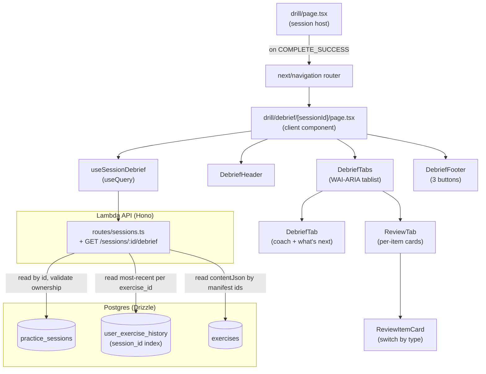

# Design Document

## Overview

Phase G adds a dedicated post-session debrief screen at `/drill/debrief/[sessionId]`. It replaces the in-page `SessionSummary` card from Phase E with a routed page, fed by a new `GET /sessions/:id/debrief` endpoint that returns one JSON payload (session metadata + per-item review data, in manifest order).

The design is deliberately additive on the backend (one new GET route in the existing `routes/sessions.ts` module — no new tables, no new migrations) and additive-then-subtractive on the web (new `/drill/debrief/[sessionId]` page + components, then deletion of the obsolete `SessionSummary` and the reducer's `summary` state).

The endpoint runs no Claude calls, writes no rows, and uses `userExerciseHistory.responseJson` (already populated at submit time) as the per-item evaluation source. Skill deltas are deferred — the response shape leaves room to add them later without a versioned breaking change.

## Steering Document Alignment

### Technical Standards (`tech.md`)

- **Hono + Zod + Drizzle** for the new `GET /sessions/:id/debrief` route — same pattern as the existing `POST /sessions` and `POST /sessions/:id/complete` handlers in `routes/sessions.ts`.
- **No new migrations.** Phase E's `0003_*.sql` already added `practice_sessions` and `user_exercise_history.session_id`. The new endpoint reads via the existing `(session_id)` index introduced there.
- **TanStack Query** — debrief is a read, so we use `useQuery` (not `useMutation`). Hook lives at `packages/api-client/src/hooks/useDebrief.ts`, alongside `useSession.ts`.
- **Zod schemas in `packages/api-client/src/schemas/`**, shared with the API via `packages/shared`.
- **Lambda monolith stays single-route-tree** — the new GET route is added to the existing `sessions` Hono router; no new module.
- **No streak / XP / day-counter** anywhere in the data model, API, or UI (CLAUDE.md hard rule).
- **Prompt caching N/A** — no Claude calls.
- **Anthropic Claude API knowledge cutoff:** N/A — no AI calls in this feature.

### Project Structure

- **Backend route module:** `infra/lambda/src/routes/sessions.ts` (extend in place).
- **API client:** `packages/api-client/src/schemas/debrief.ts`, `packages/api-client/src/hooks/useDebrief.ts`, exports added to `packages/api-client/src/index.ts`.
- **Web route:** `apps/web/app/(dashboard)/drill/debrief/[sessionId]/page.tsx` — a client component (uses TanStack Query) inside the `(dashboard)` group so it inherits the existing Clerk auth gate.
- **Web route-private code:** `apps/web/app/(dashboard)/drill/debrief/_components/` — co-located with the route. Subcomponents: `debrief-header.tsx`, `debrief-tabs.tsx`, `debrief-tab.tsx`, `review-tab.tsx`, `review-item-card.tsx`, `debrief-footer.tsx`, `debrief-not-found.tsx`.
- **Web helpers:** `apps/web/lib/drill/accuracy-tier.ts` (the three-bucket tier function reused by header + narrative + what's-next router), `apps/web/lib/drill/debrief-narrative.ts` (templated coach copy by tier × language).
- **Drill page:** `apps/web/app/(dashboard)/drill/page.tsx` — modify completion handler to `router.push('/drill/debrief/${sessionId}')` and remove the inline `SessionSummary` render path.
- **Reducer:** `apps/web/app/(dashboard)/drill/_components/session-reducer.ts` — drop `summary` state branch and `COMPLETE_SUCCEEDED` action; the `completing` state stays in place until the page unmounts.
- **Files to delete:** `apps/web/app/(dashboard)/drill/_components/session-summary.tsx` + its test.

## Code Reuse Analysis

### Existing Components to Leverage

- **`practice_sessions` + `user_exercise_history` tables** (`packages/db/src/schema/sessions.ts`, `progress.ts`) — schema already carries everything we need: `(session_id)` index for fast per-session history lookup, `(user_id, started_at)` index for ownership predicate, `responseJson` for the user answer + Claude evaluation result.
- **`exercises` table** — looked up by ID for `contentJson` (immutable per the seed-pipeline invariant; see Req 2.6).
- **`authMiddleware`** (`infra/lambda/src/middleware/auth.ts`) — already applied to `/sessions/*` in `sessions.ts:31`.
- **`db` client** (`infra/lambda/src/db.ts`) — single Drizzle client; no changes.
- **`createAuthenticatedFetch`** — used unchanged by the new debrief hook.
- **`@language-drill/shared` types** — `Language`, `CefrLevel`, `ExerciseType`, `ExerciseContent`, `EvaluationResult`, `CORRECT_THRESHOLD`. All referenced; none modified.
- **`ExerciseResponseSchema`** (`packages/api-client/src/schemas/exercise.ts`) — reused for the `contentJson` shape inside debrief items.
- **`EvaluationResultSchema`** (same file) — reused for the per-item `evaluation` field.
- **`coachMessage({ kind: 'sessionComplete', accuracy })`** (`apps/web/lib/drill/coach-messages.ts`) — repurposed: was used by `SessionSummary`, now used inside the **DebriefTab coach speech bubble** (NOT the header). Existing four-bucket logic (null / ≥0.9 / ≥0.7 / <0.7) stays as-is. The header tier is independently computed by `accuracyTier` (three buckets, lowercase invariant per Req 3.7); the speech-bubble copy in this helper retains its existing title-case sentences ("Strong session — that one stuck.") since it renders as quoted speech inside the coach card, where mixed case is acceptable per the prototype `prototypes/web/hifi/feedback.jsx`.
- **`Card`, `Button`, `Chip`, `Bar`** (`apps/web/components/ui/`) — reused throughout the new components.
- **`splitClozeSentence`** (`apps/web/lib/drill/cloze-blank.ts`) — reused inside the cloze review card to render the sentence with the user's fill substituted into the blank.
- **`ProgressTabs`** (`apps/web/app/(dashboard)/progress/_components/progress-tabs.tsx`) — reference implementation of the WAI-ARIA tablist pattern. The new `DebriefTabs` mirrors its semantics (role=tablist, arrow keys cycle, Home/End jump, focus follows selection) but is a separate component because the active-tab type differs (`'debrief' | 'review'` vs `'shape' | 'heatmap' | 'history'`) and we don't want to over-generalize a tablist primitive on this pass.
- **`AppShell`** — wraps the `(dashboard)` route group; no change needed.

### Integration Points

- **`/drill` → `/drill/debrief/[sessionId]`** — the `/drill` page replaces its `dispatch({ type: 'COMPLETE_SUCCEEDED', summary })` with `router.push('/drill/debrief/${sessionId}')` after `useCompleteSession` resolves. The reducer's `completing` state remains until the route changes; the unmount disposes it.
- **`POST /sessions/:id/complete` (Phase E)** is unchanged. It still computes `correctCount` and writes `completedAt` atomically. The new debrief endpoint reads the resulting row.
- **`useCompleteSession`** signature is unchanged. The `/drill` page wraps its `onSuccess` to call `router.push` instead of dispatching to the reducer.
- **`session-reducer.ts`** loses two pieces: the `summary` state branch and the `COMPLETE_SUCCEEDED` action. The `COMPLETE_FAILED` action stays (returns to `inSession` so the user can retry). The `completing` state stays. `selectProgressFraction` still returns 1 in `completing` (for the brief moment before navigation).

## Architecture



### Server query strategy

Two SQL trips total:

1. **Session row + ownership check.** One `SELECT` against `practice_sessions` keyed by `id`, `user_id`, and `completed_at IS NOT NULL`. If zero rows, return 404 (Req 2.5). The row carries `language`, `difficulty`, `exercise_count`, `correct_count`, `started_at`, `completed_at`, `exercise_ids`.

2. **Items query** — joins `exercises` to the most-recent `user_exercise_history` row per `(session_id, exercise_id)` for this session.
   - Uses Postgres `DISTINCT ON` for the most-recent-per-group projection. The inner subquery uses the existing `(session_id)` index to filter, then sorts by `(exercise_id, evaluated_at DESC NULLS LAST)` over the small per-session row set (typically ≤ N×retries rows; N=5 for the default session length). This is a single SQL trip with a small in-memory sort — not a pure index scan, but cheap at our row counts:
     ```sql
     SELECT e.id, e.type, e.content_json,
            h.score, h.response_json
     FROM exercises e
     LEFT JOIN (
       SELECT DISTINCT ON (exercise_id)
              exercise_id, score, response_json, evaluated_at
       FROM user_exercise_history
       WHERE session_id = $1
       ORDER BY exercise_id, evaluated_at DESC NULLS LAST
     ) h ON h.exercise_id = e.id
     WHERE e.id = ANY($2)
     ```
   - `NULLS LAST` is defensive: `evaluated_at` is nullable in the schema (`progress.ts:16`), so a row with NULL would otherwise sort highest under DESC.
   - `LEFT JOIN` is required so manifest exercises with no history rows (skipped items) are still returned (Req 2.3).
   - Result rows are unordered relative to the manifest, so the route reorders in memory by iterating `exercise_ids` and looking up by id (O(N) with a `Map`). This preserves manifest order (Req 2.1).

3. **`attemptedCount` derivation matches Phase E** (Req 2.9). Compute `attemptedCount` as the count of items whose joined history row exists (`h.score IS NOT NULL` in the SQL result, equivalently the count where `responseJson IS NOT NULL`). This is mathematically the same as the Phase E `count(distinct exercise_id) FROM user_exercise_history WHERE session_id = $1` because each `(session_id, exercise_id)` pair collapses to one row in the DISTINCT ON output. **Crucially, a malformed `responseJson` (Error Handling §7) does NOT decrement `attemptedCount`** — the row still exists, the item is reported with a present `userAnswer`/`evaluation` set to null but `status: 'incorrect'` (we conservatively treat it as a low-score attempt rather than as skipped, which keeps `attemptedCount` aligned with `practice_sessions.correct_count` semantics from Phase E). Then `skippedCount = exerciseCount - attemptedCount`.

The route then maps each row into the response item shape (status / userAnswer / score / evaluation / contentJson) and computes derived fields (`durationSeconds`, `attemptedCount`, `skippedCount`).

### Client data flow

- The page uses `useQuery({ queryKey: ['session-debrief', sessionId], queryFn, staleTime: Infinity })`. `staleTime: Infinity` is safe because the underlying data is immutable once `completedAt` is set (NFR Reliability).
- Tab state is local React state (`useState<'debrief' | 'review'>('debrief')`) — no URL sync (Req 7.2). This is a deliberate departure from `/progress`'s URL-state pattern; debrief is a one-time view per session, and bookmarking a tab is not a use case.
- Item-card expand state is local per card (`useState<boolean>(initialExpanded)`) — initial value derived from `status` (Req 5.9).

## Components and Interfaces

### Backend

#### `infra/lambda/src/routes/sessions.ts` (modify — add GET handler)

- **Purpose:** Add `GET /sessions/:id/debrief` to the existing sessions router.
- **New interfaces:**
  - Path param: `id: string` (UUID).
  - Response: `DebriefResponse` (shape under Data Models § Wire models).
- **Behavior:**
  1. Read session row by `(id, user_id, completed_at IS NOT NULL)` — one SQL trip.
  2. If zero rows → HTTP 404 `{ error: 'Session not found', code: 'SESSION_NOT_FOUND' }` (Req 2.5).
  3. Issue items query (above) with `exercise_ids` array.
  4. Reorder items by manifest, derive per-item `status` from `score >= CORRECT_THRESHOLD`, the presence of a history row, and shape the `evaluation`/`userAnswer` from `responseJson` (which Phase E's submit handler stores as `{ userAnswer, evaluation: result }`).
  5. Compute `durationSeconds = floor((completedAt - startedAt) / 1000)`, `attemptedCount = count(items where joined history row exists)`, `skippedCount = exerciseCount - attemptedCount`. (See §"Server query strategy" step 3 for the alignment with Phase E semantics.)
  6. On the 200 path only, set `Cache-Control: private, max-age=300` per NFR Performance. On any 4xx/5xx path, set `Cache-Control: no-store` (or omit and rely on Hono's default 4xx behavior) so a transient 404 (e.g., a not-yet-completed session) does not get cached past the moment it becomes valid.
- **Reuses:** `authMiddleware` (already applied at `sessions.use('/sessions/*', ...)`), `db`, `practiceSessions`, `userExerciseHistory`, `exercisesTable`, `CORRECT_THRESHOLD`.
- **Error handling:** validation of `id` is delegated to Zod (`z.string().uuid()`); any malformed UUID returns 400 `VALIDATION_ERROR` (existing pattern).

#### `infra/lambda/src/routes/sessions.test.ts` (extend)

- New test cases: happy path debrief on a completed session; 404 for unowned session; 404 for unknown id; 404 for completed_at IS NULL; correct/incorrect/skipped item statuses; retry-row collapse to most-recent; empty `user_exercise_history` (graceful — all skipped); multiple users' sessions don't bleed.

### API client

#### `packages/api-client/src/schemas/debrief.ts` (new)

```ts
import { z } from 'zod';
import { Language, CefrLevel, ExerciseType } from '@language-drill/shared';
import { EvaluationResultSchema } from './exercise';

export const DebriefItemStatusSchema = z.enum(['correct', 'incorrect', 'skipped']);
export type DebriefItemStatus = z.infer<typeof DebriefItemStatusSchema>;

export const DebriefItemSchema = z.object({
  exerciseId: z.string().uuid(),
  type: z.nativeEnum(ExerciseType),
  contentJson: z.unknown(), // Discriminated by `type`; consumers narrow via @language-drill/shared type guards.
  status: DebriefItemStatusSchema,
  userAnswer: z.string().nullable(),
  score: z.number().min(0).max(1).nullable(),
  evaluation: EvaluationResultSchema.nullable(),
});
export type DebriefItem = z.infer<typeof DebriefItemSchema>;

export const DebriefResponseSchema = z.object({
  id: z.string().uuid(),
  language: z.nativeEnum(Language),
  difficulty: z.nativeEnum(CefrLevel),
  startedAt: z.string().datetime(),
  completedAt: z.string().datetime(),
  durationSeconds: z.number().int().nonnegative(),
  exerciseCount: z.number().int().nonnegative(),
  correctCount: z.number().int().nonnegative(),
  attemptedCount: z.number().int().nonnegative(),
  skippedCount: z.number().int().nonnegative(),
  items: z.array(DebriefItemSchema),
});
export type DebriefResponse = z.infer<typeof DebriefResponseSchema>;
```

#### `packages/api-client/src/hooks/useDebrief.ts` (new)

```ts
export type UseSessionDebriefOptions = {
  sessionId: string;
  fetchFn: AuthenticatedFetch;
  enabled?: boolean;
};

export function useSessionDebrief({ sessionId, fetchFn, enabled = true }: UseSessionDebriefOptions) {
  return useQuery<DebriefResponse, Error>({
    queryKey: ['session-debrief', sessionId],
    queryFn: async () => {
      const response = await fetchFn(`/sessions/${sessionId}/debrief`);
      const json: unknown = await response.json();
      return DebriefResponseSchema.parse(json);
    },
    enabled,
    staleTime: Infinity, // Immutable once completedAt is set (NFR Reliability)
  });
}
```

Exports added to `packages/api-client/src/index.ts`.

### Web

#### `apps/web/lib/drill/accuracy-tier.ts` (new)

```ts
export type AccuracyTier = 'high' | 'mid' | 'low';

export function accuracyTier(correctCount: number, attemptedCount: number): AccuracyTier {
  if (attemptedCount === 0) return 'low';
  const ratio = correctCount / attemptedCount;
  if (ratio >= 0.8) return 'high';
  if (ratio >= 0.5) return 'mid';
  return 'low';
}

export const TIER_TITLE: Record<AccuracyTier, string> = {
  high: 'nice work.',
  mid: 'good attempt.',
  low: 'back next time?',
};
```

Used by `DebriefHeader`, `DebriefTab` (narrative + what's-next router), and tested in isolation.

#### `apps/web/lib/drill/debrief-narrative.ts` (new)

```ts
import { Language, LANGUAGE_NAMES } from '@language-drill/shared';
import type { AccuracyTier } from './accuracy-tier';

interface NarrativeInput {
  tier: AccuracyTier;
  language: Language;
  exerciseCount: number;
  correctCount: number;
  attemptedCount: number;
  skippedCount: number;
}

export interface Narrative {
  paragraphs: [string] | [string, string]; // 1 or 2 short paragraphs
  whatsNextHref: '/drill' | '/progress';
  whatsNextLabel: string;
}

export function debriefNarrative(input: NarrativeInput): Narrative;
```

Templates (no Claude call) are tier-keyed and reference `LANGUAGE_NAMES[language].toLowerCase()`. Example for `tier: 'high'`:

> "solid {language} run — {correct} of {attempted} stuck. that pattern is landing."

What's-next routing:
- `tier === 'high'` → `/progress`, label "see what moved →"
- `tier !== 'high'` (or all-skipped) → `/drill`, label "another short session →"

#### `apps/web/app/(dashboard)/drill/debrief/[sessionId]/page.tsx` (new, client component)

- **Purpose:** Orchestrate the debrief view: fetch data, render header / tabs / footer, handle loading + 404 + error states.
- **State:** `tab: 'debrief' | 'review'` (local).
- **Effects:** none beyond the TanStack Query (no manual subscriptions).
- **Props (Next.js 15):** typed as `{ params: Promise<{ sessionId: string }> }`. Read via `import { use } from 'react'` and `const { sessionId } = use(params)` at the top of the component body.
- **Behavior:**
  1. Read `sessionId` from the Promise-typed `params` prop (see above).
  2. Build `fetchFn = createAuthenticatedFetch(getToken)` (same pattern as `/drill`).
  3. Call `useSessionDebrief({ sessionId, fetchFn })`.
  4. While `isPending`: render a small skeleton (header chrome + 3 placeholder cards).
  5. On 404 or other error: render `<DebriefNotFound />`.
  6. On success: render `<DebriefHeader>`, `<DebriefTabs>` containing `<DebriefTab>` and `<ReviewTab>` panels, `<DebriefFooter>`.
- **Reuses:** `Card`, `Button`, `useAuth` from Clerk, `useRouter` from `next/navigation`, `coachMessage`.

#### `apps/web/app/(dashboard)/drill/debrief/_components/debrief-header.tsx` (new)

- **Props:** `{ debrief: DebriefResponse }`.
- **Renders:** eyebrow `session done · {mm:ss}`, title from `TIER_TITLE[tier]`, body line `you got X of Y · accuracy Z%[ · N skipped]`.
- **Tier source:** computes `tier = accuracyTier(correctCount, attemptedCount)` once; same value reused by tab content via the parent.
- **Reuses:** existing typography utility classes (`t-display-xl`, `t-body-l`, `t-micro`).
- **Pure rendering** — no internal state.

#### `apps/web/app/(dashboard)/drill/debrief/_components/debrief-tabs.tsx` (new)

- **Purpose:** WAI-ARIA tablist for two tabs (`debrief` / `review`).
- **Props:** `{ active: 'debrief' | 'review', onChange: (tab) => void, children: ReactNode }`.
- **Behavior:** mirrors `progress-tabs.tsx` — `role="tablist"`, ArrowLeft/ArrowRight cycle, Home/End jump, focus follows selection. `role="tab"` buttons set `aria-selected` and `aria-controls`. Single `role="tabpanel"` wraps children (the parent renders the active panel).
- **Reuses:** the kbd-handling pattern from `progress-tabs.tsx` (port the function, do NOT abstract a primitive yet — see Code Reuse note).

#### `apps/web/app/(dashboard)/drill/debrief/_components/debrief-tab.tsx` (new)

- **Purpose:** the "Debrief" tab content (default).
- **Props:** `{ debrief: DebriefResponse }`.
- **Renders:** coach card (avatar + speech bubble) with `narrative.paragraphs` from `debriefNarrative(...)`; below, a "what's next" callout: a single short suggestion + a `<Link>` (Next.js) to `narrative.whatsNextHref` with `narrative.whatsNextLabel`.
- **No skill-delta section in v1** (Req 4.5).
- **Reuses:** `Card`, `Button` (or anchor styled like one).

#### `apps/web/app/(dashboard)/drill/debrief/_components/review-tab.tsx` (new)

- **Purpose:** the "Review" tab content.
- **Props:** `{ items: DebriefItem[] }`.
- **Renders:** `items.map(item => <ReviewItemCard ... />)` with manifest-order keys `(item.exerciseId)`.

#### `apps/web/app/(dashboard)/drill/debrief/_components/review-item-card.tsx` (new)

- **Purpose:** Render one item card with type-specific layout, status chip, and expand/collapse.
- **Props:** `{ index: number, item: DebriefItem }`.
- **State:** `expanded: boolean` (local; initial `item.status !== 'correct'` per Req 5.9).
- **Renders (collapsed):** index `#N` + topic chip + status chip + click handler to expand.
- **Renders (expanded):** the collapsed header + a type-specific body:
  - **Cloze** (`status !== 'skipped'`): two cells via `splitClozeSentence(content.sentence)` — "your answer" with the user's fill in a tinted token, "corrected" / "why it works" with the reference fill in a green-bordered token. `evaluation.feedback` below.
  - **Translation:** two cells side by side — "your translation" (user text) / "reference" (`content.referenceTranslation`). `evaluation.feedback` below.
  - **Vocab recall:** italic prompt definition above two cells — "you typed" (user text) / "target word" (`content.expectedWord` + `content.exampleSentence`).
  - **Skipped (any type):** prompt only + caption "skipped — no submission".
- **Type narrowing:** uses `isClozeContent` / `isTranslationContent` / `isVocabRecallContent` from `@language-drill/shared`. The schema's `contentJson: z.unknown()` is narrowed inside the card via these guards.
- **Theory trigger:** NOT rendered (Req 5.8).
- **Reuses:** `Card`, `Chip`, `splitClozeSentence`.

#### `apps/web/app/(dashboard)/drill/debrief/_components/debrief-footer.tsx` (new)

- **Props:** `{ tier: AccuracyTier }`.
- **Renders:** sticky / pinned footer with three buttons — primary "another session" → `/drill`, ghost "see your progress →" → `/progress`, ghost "done" → `/`.
- **Reuses:** `Button`, `useRouter`.

#### `apps/web/app/(dashboard)/drill/debrief/_components/debrief-not-found.tsx` (new)

- **Props:** none.
- **Renders:** centered card with title "session not found", body "this session may not exist or may not be yours yet — start a new one from drill.", and a primary button "back to drill" → `/drill`.

#### `apps/web/app/(dashboard)/drill/page.tsx` (modify)

- Replace the existing completion handler so that on `useCompleteSession.mutate({ sessionId }, { onSuccess })`:
  - **Old:** `onSuccess: (summary) => dispatch({ type: 'COMPLETE_SUCCEEDED', summary })`.
  - **New:** `onSuccess: () => router.push(\`/drill/debrief/${sessionId}\`)`.
- Remove the `state.kind === 'summary'` render branch (it's now unreachable).
- Remove the `import { SessionSummary } ...` line.
- The `state.kind === 'completing'` skeleton stays (briefly visible until the route changes).
- Selectors (language/difficulty) handlers are unchanged.

#### `apps/web/app/(dashboard)/drill/_components/session-reducer.ts` (modify)

- Drop the `summary` state from the `SessionState` discriminated union.
- Drop the `COMPLETE_SUCCEEDED` action type and reducer case.
- Update `selectProgressFraction` to return `1` only for `completing` (the `summary` branch is gone).
- Tests are updated accordingly: the "create → submit → evaluate → next → ... → last → complete → summary → reset → idle" path becomes "... → complete → completing" (with the assertion that `completing` is the terminal state in-reducer).

#### `apps/web/app/(dashboard)/drill/_components/session-summary.tsx` (delete)

- Delete the file and its test (`__tests__/session-summary.test.tsx`).

## Data Models

### Existing tables — no changes

- `practice_sessions` (Phase E): id, user_id, language, difficulty, exercise_count, correct_count, exercise_ids (jsonb string[]), started_at, completed_at, indexes on `(user_id, started_at)`. **Invariant:** `exercise_ids` is order-significant — the manifest order at session creation. Phase E's `routes/sessions.ts:87` writes `rows.map((r) => r.id)` and returns the same order to the client; the debrief endpoint preserves it on read.
- `user_exercise_history` (Phase E): id, user_id, exercise_id, **session_id** (with index), score, response_json, evaluated_at.
- `exercises` (existing): id, type, language, difficulty, content_json.

### Wire models (TypeScript types from Zod schemas)

```
DebriefItem = {
  exerciseId: string,
  type: ExerciseType,
  contentJson: unknown,                      // narrowed via shared type guards
  status: 'correct' | 'incorrect' | 'skipped',
  userAnswer: string | null,                 // null when skipped
  score: number | null,                      // null when skipped
  evaluation: EvaluationResult | null,       // null when skipped
}

DebriefResponse = {
  id: string,
  language: Language,
  difficulty: CefrLevel,
  startedAt: string (ISO),
  completedAt: string (ISO),
  durationSeconds: number,
  exerciseCount: number,
  correctCount: number,
  attemptedCount: number,
  skippedCount: number,
  items: DebriefItem[],                      // manifest-ordered
}
```

### `responseJson` shape (existing, read by debrief)

The Phase E submit handler writes `responseJson: { userAnswer: string, evaluation: EvaluationResult }`. The new endpoint reads both fields. If `responseJson` is null/missing for a row (defensive), the endpoint treats the item as skipped — see Error Handling §6.

## Error Handling

### Error Scenarios

1. **Session does not exist** — `GET /sessions/:id/debrief` with unknown UUID.
   - **Detection:** zero rows from the session query.
   - **Handling:** HTTP 404 `{ error: 'Session not found', code: 'SESSION_NOT_FOUND' }`.
   - **User Impact:** page renders `<DebriefNotFound />`.

2. **Cross-user request** — caller's `userId` ≠ `practice_sessions.user_id`.
   - **Detection:** ownership predicate is part of the same `WHERE` clause; no row returned.
   - **Handling:** identical to #1 — 404, not 403, to avoid leaking session existence (NFR Security).
   - **User Impact:** identical to #1.

3. **Session not yet completed** — `completed_at IS NULL`.
   - **Detection:** completion predicate in the same `WHERE` clause; no row returned.
   - **Handling:** identical to #1.
   - **User Impact:** identical to #1. The user can navigate back to `/drill` to finish their open session.

4. **Malformed UUID in path** — Zod fails on the path param.
   - **Detection:** `z.string().uuid().safeParse(id)` fails.
   - **Handling:** HTTP 400 `VALIDATION_ERROR` (matches the existing pattern in `routes/sessions.ts:42`).
   - **User Impact:** treated as a fetch failure → `<DebriefNotFound />`. (The UI doesn't normally produce malformed UUIDs since they come from the manifest.)

5. **Network failure / 5xx fetch** — Lambda returns 502, network drops.
   - **Detection:** `useQuery.error` is set.
   - **Handling:** page renders an error card with a "retry" button (calls `query.refetch`).
   - **User Impact:** non-fatal; user can retry without losing context.

6. **Empty `user_exercise_history` for the session** — possible for a session completed before the Phase E `0003_*.sql` migration (dev-only edge case) or for any future session where every item was skipped.
   - **Detection:** items query returns zero history rows; `attemptedCount === 0`.
   - **Handling:** all items get `status: 'skipped'`, accuracy displays "—", title is "back next time?", narrative is the "all-skipped" template, what's-next links to `/drill`.
   - **User Impact:** review tab shows skipped chips throughout; debrief tab encourages another attempt. No crash.

7. **`responseJson` malformed or missing on a history row** — defensive: if a history row exists but `responseJson` cannot be parsed as `{ userAnswer, evaluation }`.
   - **Detection:** server-side schema check on `responseJson`.
   - **Handling:** the item is reported with `userAnswer: null`, `evaluation: null`, and `status` derived from the row's `score` against `CORRECT_THRESHOLD` (`'correct'` if score ≥ threshold, else `'incorrect'`). The history row is real — the user did submit and Claude did evaluate — so the row counts toward `attemptedCount`. (This keeps debrief's `attemptedCount` in lockstep with Phase E's complete endpoint per Req 2.9.) A server-side log warning records the parse failure for triage.
   - **User Impact:** rare; review card shows the item as attempted (correct or incorrect) without the diff cells, with a small caption "evaluation details unavailable" inline.

8. **`useCompleteSession` succeeds but `router.push` is intercepted (e.g., user navigates away mid-flight)** — race.
   - **Detection:** N/A — the navigation is fire-and-forget; React unmounts the drill page when the URL changes.
   - **Handling:** none needed. The reducer's `completing` state is destroyed with the page; the new `/drill/debrief/[sessionId]` page fetches fresh data.
   - **User Impact:** none.

## Testing Strategy

### Unit Testing

- **`accuracy-tier.ts`** — `accuracyTier(correct, attempted)` for boundaries (0/0 → 'low'; 8/10 → 'high'; 7/10 → 'mid'; 4/10 → 'low'; 4/8 → 'mid'; ratios just above/below 0.8 and 0.5).
- **`debrief-narrative.ts`** — narrative output for each tier × language combination; `whatsNextHref` matches tier; `paragraphs` length is 1 or 2; copy contains the language name.
- **`schemas/debrief.ts`** — happy/sad parse tests; reject negative counts; reject missing `items`; reject `userAnswer: undefined` (only `null` is valid for skipped); reject `status: 'foo'`.
- **`useSessionDebrief`** — mocked-fetch tests asserting URL, method, parsed response, error rejection, query key shape, `staleTime: Infinity` propagation.
- **`DebriefHeader`** — title varies by tier; body line includes/omits skipped suffix; lowercase invariant holds; mm:ss formatting for 0/59/60/3601.
- **`DebriefTabs`** — keyboard handling parity with `progress-tabs.tsx` (left/right cycle, home/end jump, aria-selected updates).
- **`DebriefTab`** — coach card renders narrative paragraphs; what's-next links to `/progress` for high-tier, `/drill` otherwise.
- **`ReviewTab`** — renders one card per item; preserves manifest order.
- **`ReviewItemCard`** — correct items collapse, incorrect/skipped expand by default; type-specific layouts (cloze/translation/vocab); skipped layout; expand/collapse toggle works; theory trigger is NOT rendered.
- **`DebriefFooter`** — three buttons; clicking each pushes the right route.
- **`DebriefNotFound`** — renders title + button → `/drill`.
- **`session-reducer.ts`** (modified) — re-run existing tests with the `summary` branch removed; the TS-level guard that `COMPLETE_SUCCEEDED` is no longer a valid action is enforced via a `// @ts-expect-error` line in the test file (a runtime assertion isn't possible since the action type itself is gone).

### Integration Testing

- **Server route (`sessions.test.ts`)** — extend with debrief-specific cases:
  - Happy: completed session with mixed correct/incorrect/skipped items returns a payload that matches the schema and preserves manifest order.
  - Most-recent retry submission: when `(session_id, exercise_id)` has two history rows, the response uses the later row's score.
  - 404 on cross-user, unknown id, completed_at IS NULL.
  - `attemptedCount === 0` empty-history case.
  - Cache header set: `Cache-Control: private, max-age=300`.
- **Drill page (`drill/page.test.tsx`)** — modify the Phase E completion tests:
  - "Click see results" → asserts `router.push` was called with `/drill/debrief/${sessionId}`. The summary card is no longer asserted.
  - "Click end session early" → same navigation.
  - The "another session" flow is now triggered from the debrief footer, not from `SessionSummary`; the drill page test no longer asserts `useCreateSession` is called from a summary screen.
- **Debrief page (`debrief/[sessionId]/page.test.tsx`, new)** — page-level integration:
  - Mount with a successful `useSessionDebrief` mock → header + tabs + footer render; default tab is debrief.
  - Switch to review tab → cards render in manifest order.
  - 404 mock → `<DebriefNotFound />` renders.
  - Network error mock → error card with retry; clicking retry refetches.
  - Click footer "another session" → `router.push('/drill')`.

### End-to-End Testing

Out of scope (no E2E framework wired up). Page-level integration + unit + route tests cover v1.
