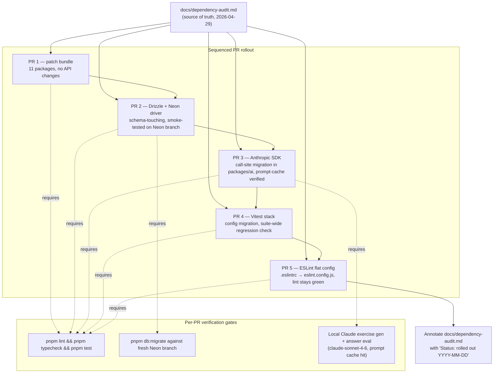

# Design Document

## Overview

This spec is an internal dependency rollout, not a product feature. The "system" being designed is the **sequence of five PRs** that move the workspace off drifted versions, the **verification harness** that gates each PR, and the **`pnpm.overrides` policy** that prevents transitive surprises. No application code is added. The deliverable is a green `main` after PR 5, with `docs/dependency-audit.md` annotated as rolled out.

The design is structured around a single principle: **one upgrade group per PR, each fully verifiable in isolation**. Every PR has the same shape — a version bump, a delta in call sites or config (when forced by upstream), and a fixed verification recipe.

## Steering Document Alignment

### Technical Standards (tech.md)

Every package this rollout touches is already named in `tech.md` §2 as a stack pillar. The upgrades hold the documented stack constant; only versions move.

| Group | Package(s) | tech.md anchor |
|---|---|---|
| PR 1 (patch bundle) | `prettier`, `tailwindcss`, `hono`, `@clerk/nextjs`, `@tanstack/react-query`, `aws-cdk*`, `svix`, `jsdom`, `esbuild` | §2 Frontend, Backend API, IaC |
| PR 2 (data layer) | `drizzle-orm`, `drizzle-kit`, `@neondatabase/serverless` | §2 Database |
| PR 3 (AI) | `@anthropic-ai/sdk` | §2 AI / GenAI, §7 prompt caching |
| PR 4 (test gate) | `vitest`, `@vitejs/plugin-react` | implied by §5 CI/CD test gate |
| PR 5 (lint gate) | `eslint`, `@typescript-eslint/*` | implied by §5 CI/CD lint gate |

The `@types/node` ^22 pin (Lambda LTS) is preserved verbatim — `tech.md` §2 names AWS Lambda Node.js as the runtime.

`CLAUDE.md` "Package Management" rules govern this work: latest stable, no deprecated transitives, document any pin reason in a `package.json` comment.

### Project Structure (structure.md)

No `structure.md` exists. The rollout respects the monorepo layout already in place (apps / packages / infra / .claude/specs). No file moves, no new packages.

## Code Reuse Analysis

This rollout leverages mechanisms that already exist in the repo — it does not introduce new ones.

### Existing Components to Leverage

- **Repo-root `pnpm.overrides`** in `package.json` — already pins `@types/node` to `^22.0.0`. Used as the single source of truth for any forced transitive holdback.
- **Pre-push gate** in `CLAUDE.md` — `pnpm lint && pnpm typecheck && pnpm test` is the existing acceptance contract; every PR in this spec ends with this exact triple.
- **Drizzle migration journal** at `packages/db/migrations/meta/_journal.json` — used to detect spurious migrations from `drizzle-kit` version changes.
- **Local dev harness** at `infra/lambda/src/dev.ts` (auto-injects `DEV_USER_ID=dev_user_001`, auto-upserts the user row) — used for the smoke tests that PR 2 and PR 3 require beyond version-bump verification.
- **CI workflow** in `.github/workflows/` — runs lint/typecheck/test + Neon branch + Vercel preview on every PR. Re-used unchanged; no workflow edits in this spec.
- **`pnpm outdated -r`** — the data-collection command behind `docs/dependency-audit.md`. Re-run at the end of each PR to confirm the target group is fully cleared.

### Integration Points

- **Drizzle ↔ Neon driver** — bumped together in PR 2. The driver's WebSocket transport is what `drizzle-orm`'s `neon-http`/`neon-serverless` adapter sits on top of.
- **Anthropic SDK ↔ `packages/ai` ↔ `infra/lambda`** — PR 3's call-site migrations stay inside `packages/ai`. The lambda only imports the `@language-drill/ai` package, so the surface change shouldn't reach `infra/lambda` unless the AI package re-exports SDK types directly.
- **Vitest ↔ React Testing Library + jsdom** — PR 4 is the one place where two devDeps move together. `@vitejs/plugin-react` 6 needs vitest 2+; jsdom stays at 29 (already in PR 1).
- **ESLint ↔ `next lint` ↔ `@typescript-eslint`** — PR 5 affects every workspace's `lint` script. Next 15's `next lint` already supports flat config; the migration converts `apps/web/.eslintrc*` (if any) and the root config in lockstep.

## Architecture



**Sequencing rationale:** order is risk-ascending where possible. PR 1 establishes a known-good baseline. PR 2 and PR 3 land before PR 4 because they need the existing test runner; if vitest 4 forces test rewrites, doing it after the data and AI layers stabilize means fewer concurrent unknowns. PR 5 is last because flat-config migration is independent of any other group and the ESLint 9 upgrade is the most invasive in terms of config-file diff.

**Branch hygiene (per R7.2):** every PR is rebased onto `main` immediately before opening, so the diff reflects only that group's changes. Stacking branches off the previous group's PR is forbidden — wait for it to merge first.

**PR title convention (per Maintainability NFR):** every PR title takes the form `chore(deps): <group>` — e.g. `chore(deps): patch bundle`, `chore(deps): drizzle + neon driver`, `chore(deps): anthropic sdk`, `chore(deps): vitest stack`, `chore(deps): eslint flat config`. This makes the rollout greppable in `git log`.

## Components and Interfaces

Each "component" below is one PR. Interfaces are the verification commands and the produced diff.

### PR 1 — Patch/minor bundle

- **Purpose:** Clear all 11 safe drift items in one review pass.
- **Scope:** `package.json` files across the workspace, plus the resulting `pnpm-lock.yaml` delta. No source-code changes expected.
- **Verification:**
  1. `pnpm install && pnpm lint && pnpm typecheck && pnpm test` from repo root.
  2. `pnpm outdated -r` confirms only PR 2–5 packages remain on the drift list.
  3. PR description flags any non-trivial deprecation warning surfaced at install or build time, with a link to the upstream changelog (R1.3).
- **Reuses:** existing CI workflow, existing scripts.
- **Risk:** very low — all bumps are within the same major.

### PR 2 — Drizzle + Neon driver

- **Purpose:** Move the data layer from `drizzle-orm` 0.30 → 0.45+, `drizzle-kit` 0.21 → 0.31+, `@neondatabase/serverless` 0.9 → 1.x.
- **Scope:** `packages/db/package.json`, `infra/lambda/package.json`, lockfile, plus any call-site adjustments in `packages/db/src/**` and `infra/lambda/src/routes/**` if Drizzle's query-builder API changed.
- **Verification:**
  1. `pnpm db:generate` produces an empty diff against `migrations/meta/_journal.json` (no spurious migrations from version bumps).
  2. A fresh Neon branch (manual or CI ephemeral) runs `pnpm db:migrate` cleanly.
  3. `pnpm test` in `packages/db` and `infra/lambda` is green.
  4. Smoke: `pnpm dev:api` boots, `GET /exercises` returns rows.
- **Reuses:** `packages/db/migrations/meta/_journal.json`, `pnpm db:migrate`, local dev harness.
- **Risk:** medium. Drizzle 0.30 → 0.45 spans 15 minor releases; query-builder ergonomics likely shifted. Check the changelog for any `pgTable`, relations, and `select`/`insert` API rename.

### PR 3 — Anthropic SDK

- **Purpose:** Move `@anthropic-ai/sdk` from 0.36 to 0.91+.
- **Scope:** `packages/ai/package.json`, lockfile, and every call site under `packages/ai/src/**` that uses SDK types or methods. The wrapper is the only consumer per `tech.md` §7 — keep migration confined here.
- **Verification:**
  1. `pnpm test` green in `packages/ai`, `infra/lambda`, `packages/api-client`.
  2. With `ANTHROPIC_API_KEY` set, run a local exercise generation against `claude-sonnet-4-6` — first call populates the prompt cache, second call within the cache TTL reports a cache hit via the SDK's usage telemetry (whatever field name 0.91 surfaces).
  3. Local `POST /exercises/:id/submit` returns the same JSON shape as before — no contract leak to `packages/api-client`.
- **Reuses:** `infra/lambda/src/dev.ts` auth bypass, the existing prompt-cache strategy from `tech.md` §7.
- **Risk:** medium-high. 50+ minor releases. Streaming, tool-use, and message-create APIs have all changed. The wrapper is the bulkhead — keep migration inside `packages/ai`.

### PR 4 — Vitest stack

- **Purpose:** Move `vitest` from 1 to 4 and `@vitejs/plugin-react` from 4 to 6.
- **Scope:** every workspace's `package.json` that lists vitest as a devDep, plus `vitest.config.*` shape changes (v2 changed workspaces; v3 tightened types; v4 changed the runner).
- **Verification:**
  1. `pnpm test` green at repo root, every workspace executes its suite.
  2. No vitest deprecation warnings in stdout (suite-internal warnings only — RTL/jsdom warnings are out of scope).
  3. Wall-clock time within +25% of `main` baseline (Performance NFR).
- **Reuses:** existing test files; only configs change.
- **Risk:** medium. Three majors of config drift. Expect to touch `apps/web/vitest.config.*`, `packages/api-client/vitest.config.*`, `infra/lambda/vitest.config.*` — wherever they exist.

### PR 5 — ESLint flat config

- **Purpose:** Move `eslint` off the EOL 8 line to 9+, `@typescript-eslint/*` to 8+, migrate every legacy `.eslintrc*` to `eslint.config.js`/`.mjs`.
- **Scope:** root `package.json`, root and per-workspace ESLint config files, possibly `.eslintignore` → `ignores: []` inside the flat config.
- **Verification:**
  1. `pnpm lint` green at repo root; same set of files linted (count via `--debug` or compare warning/error counts to `main`).
  2. Every rule from the legacy config has a flat-config equivalent or is documented in the PR description as deferred (`R5.4`).
- **Reuses:** existing rules; nothing new is enabled.
- **Risk:** medium. `next lint` integration in `apps/web` is the trickiest piece — verify against Next 15 docs.

## Data Models

The "models" in this rollout are config files and lockfile state, not application data.

### Upgrade matrix (post-rollout target)

```
PR 1 — bundled patches
  prettier                      3.8.3+
  tailwindcss / @tailwindcss/postcss 4.2.4+
  hono                          4.12.15+
  @clerk/nextjs                 7.2.8+
  @tanstack/react-query         5.100.6+
  aws-cdk / aws-cdk-lib         2.1120.0 / 2.251.0+
  svix                          1.92.2+
  jsdom                         29.1.0+
  esbuild                       0.28.0+

PR 2 — data layer
  drizzle-orm                   0.45.x
  drizzle-kit                   0.31.x
  @neondatabase/serverless      1.x

PR 3 — AI
  @anthropic-ai/sdk             0.91.x

PR 4 — test gate
  vitest                        4.x
  @vitejs/plugin-react          6.x

PR 5 — lint gate
  eslint                        9.x or 10.x
  @typescript-eslint/*          8.x

Held back (R6)
  @types/node                   ^22.0.0   (Lambda LTS)
  next                          15.x       (defer to Next 16 spec)
  zod                           3.x        (defer to zod 4 spec)
  typescript                    5.x        (let TS 6 ecosystem settle)
  @hono/node-server             1.x        (local-dev only, low ROI)
```

### `pnpm.overrides` policy

```
- The existing override for @types/node ^22.0.0 stays.
- A new override is added ONLY when a transitive resolution would force a held-back package past its pinned line.
- Every override has a sibling code comment in package.json explaining why and pointing to the audit doc.
- The PR that introduces an override notes it in the description.
```

## Error Handling

### Scenario 1 — A bumped major breaks `pnpm test`
- **Handling:** Fix forward inside the same PR if the surface is small (call-site rename, type-only). If the migration is larger than the time-box budget, revert that one package from the PR, document it in the audit doc as a follow-up, ship the rest of the group.
- **User impact:** None — these PRs land before any user touches them. CI is the only "user."

### Scenario 2 — Spurious Drizzle migration in `_journal.json`
- **Handling:** Compare schema output to `main`. If schema is byte-identical and only metadata changed, regenerate from scratch (`drizzle-kit drop` of the noise migration) before merging. Never let a no-op migration land in the journal.
- **User impact:** Future migrations would diverge from prod state.

### Scenario 3 — Anthropic SDK changes the prompt-cache telemetry shape
- **Handling:** Update the verification step (R3.3) wording, not the contract. Cache hit is still observable; only the field name moved. Document the new field in the PR description.
- **User impact:** None at runtime; cost telemetry stays accurate.

### Scenario 4 — Transitive forces a held-back package up
- **Handling:** Add a `pnpm.overrides` entry per the override policy above. If pnpm refuses to resolve with the override, escalate: split the offending package into its own follow-up PR.
- **User impact:** Lockfile churn only.

### Scenario 5 — `next lint` (PR 5) refuses flat config in Next 15
- **Handling:** Per Next 15 docs, set `eslint.useFlatConfig` or migrate to `eslint.config.mjs` at the workspace root. If still blocked, document the gap and ship the rest of the workspaces' flat config; revisit when bumping to Next 16.
- **User impact:** None at runtime; lint coverage for `apps/web` only.

### Scenario 6 — `pnpm audit` regresses on a bumped package
- **Handling:** Per the Security NFR, the PR cannot ship. Pin to the last known-good version inside the bump, document in the PR, open an upstream issue if needed.
- **User impact:** Security posture unchanged or improved by the rollout.

## Testing Strategy

### Unit Testing
- The existing test suites are themselves the unit-test gate. Every PR runs `pnpm test` from the repo root and per-workspace where relevant. No new tests are added by this spec — the goal is no regressions, not net-new coverage.
- For PR 4 (vitest itself), `pnpm test` is also the validator of the upgrade. Spot-check at least one test from each workspace runs and reports a pass.

### Integration Testing
- **PR 2:** `pnpm db:migrate` against a fresh Neon branch (CI ephemeral or manual `neon branches create`). This is the only PR that performs a true integration test against external infra.
- **PR 3:** Local exercise generation + answer eval against the real Anthropic API with `claude-sonnet-4-6`. Verifies the SDK migration end-to-end including prompt caching.

### End-to-End Testing
- Not applicable. No user-facing flow changes. The audit explicitly defers `next` 16 (which is the only upgrade that would warrant E2E coverage of cache-component changes).

### Manual Smoke Recipe (per the Reliability NFR)
- For PR 2 and PR 3 only:
  1. `pnpm dev` (API + web).
  2. Sign in locally (auth bypass auto-injects `dev_user_001`).
  3. PR 2: open a screen that lists exercises — confirm rows render.
  4. PR 3: submit one answer to a cloze exercise — confirm a Claude-evaluated response renders, then submit a second answer immediately and check the SDK telemetry for a cache hit.
- For PR 1, PR 4, PR 5: CI alone is sufficient.

### Rollback Plan
- Each PR is one commit on `main` after merge. Rollback = `git revert <merge-commit>`. The R7 isolation rule guarantees that reverting one PR does not break any subsequent PR's diff.
