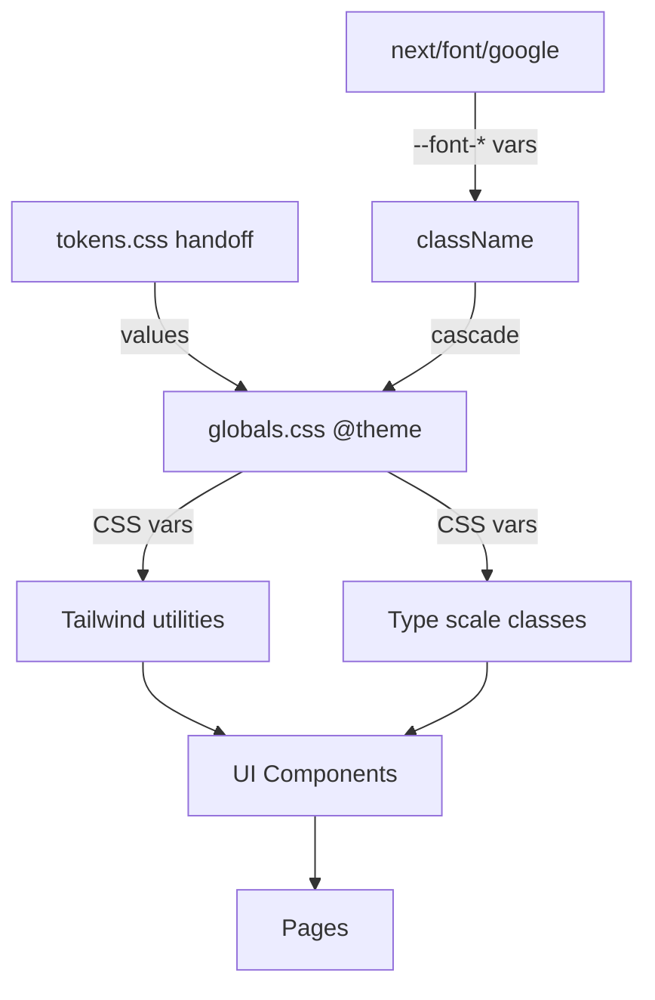
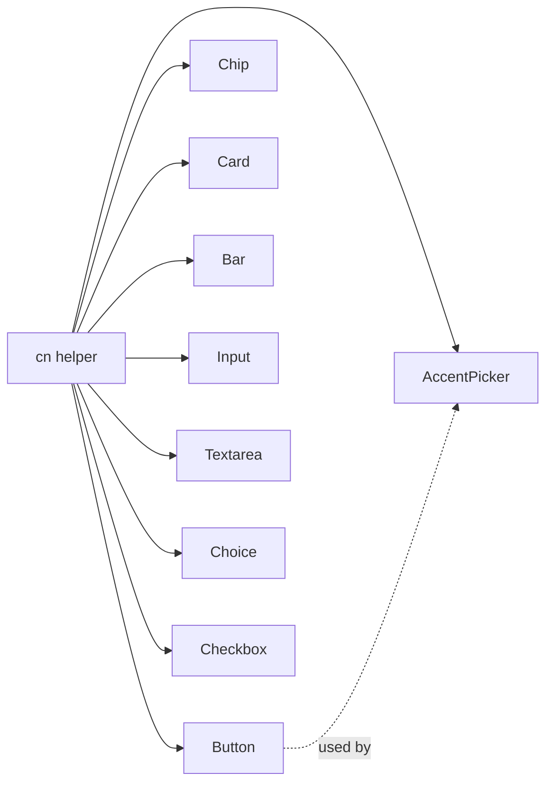

# Design System Foundation — Technical Design

## Architecture Overview

The design system has three layers, each building on the previous:

```
Layer 1: Design Tokens (globals.css @theme)
   ↓ consumed by
Layer 2: Base Styles (globals.css @layer base + utility classes)
   ↓ consumed by
Layer 3: UI Components (apps/web/components/ui/*.tsx)
```

All tokens flow through Tailwind v4's `@theme` directive, meaning they're usable both as CSS variables (`var(--color-paper)`) and as Tailwind utilities (`bg-paper`, `text-ink`). Components are built with Tailwind classes — no CSS modules, no styled-components.

---

## File Structure

```
apps/web/
├── app/
│   ├── globals.css          ← tokens (@theme) + base styles + type scale utilities
│   ├── layout.tsx           ← font loading (next/font/google) + CSS var injection
│   └── fonts.ts             ← font configuration extracted for cleanliness
├── components/
│   └── ui/
│       ├── index.ts         ← barrel export
│       ├── button.tsx
│       ├── chip.tsx
│       ├── card.tsx
│       ├── bar.tsx
│       ├── input.tsx
│       ├── textarea.tsx
│       ├── choice.tsx
│       ├── checkbox.tsx
│       ├── accent-picker.tsx
│       └── __tests__/
│           ├── button.test.tsx
│           ├── chip.test.tsx
│           ├── card.test.tsx
│           ├── bar.test.tsx
│           ├── input.test.tsx
│           ├── textarea.test.tsx
│           ├── choice.test.tsx
│           ├── checkbox.test.tsx
│           └── accent-picker.test.tsx
```

---

## Layer 1: Design Tokens

### globals.css — Token Definitions

Tailwind v4 uses `@theme` to extend the design system. Custom colors, spacing, radii, shadows, and font families are declared here. Tailwind generates corresponding utility classes automatically (e.g., `--color-paper` → `bg-paper`, `text-paper`).

```css
@import "tailwindcss";

@theme {
  /* ─── Colors ─── */
  --color-paper: #faf7f1;
  --color-paper-2: #f2ede2;
  --color-paper-3: #e8e1d2;
  --color-card: #ffffff;

  --color-ink: #1a1612;
  --color-ink-2: #3d362e;
  --color-ink-soft: #5a5148;
  --color-ink-mute: #8a8074;

  --color-rule: #d8d0bf;
  --color-rule-strong: #c9bfac;

  --color-accent: #c96442;
  --color-accent-2: #b15535;
  --color-accent-soft: #f7e2d3;

  --color-hilite: #f4d35e;
  --color-hilite-soft: #fbeeb6;

  --color-ok: #5b8a5a;
  --color-ok-soft: #d8e6d3;

  /* ─── Font families (bound to next/font CSS vars) ─── */
  --font-display: var(--font-fraunces), 'Iowan Old Style', Georgia, serif;
  --font-ui: var(--font-inter), system-ui, -apple-system, sans-serif;
  --font-mono: var(--font-jetbrains-mono), ui-monospace, Menlo, monospace;
  --font-hand: var(--font-caveat), cursive;

  /* ─── Spacing ─── */
  --spacing-s-1: 4px;
  --spacing-s-2: 8px;
  --spacing-s-3: 12px;
  --spacing-s-4: 16px;
  --spacing-s-5: 20px;
  --spacing-s-6: 24px;
  --spacing-s-7: 32px;
  --spacing-s-8: 40px;

  /* ─── Border radius ─── */
  --radius-r-sm: 6px;
  --radius-r-md: 10px;
  --radius-r-lg: 16px;
  --radius-r-xl: 24px;
  --radius-r-pill: 999px;

  /* ─── Line heights ─── */
  --leading-display-tight: 1.05;
  --leading-display: 1.1;
  --leading-display-medium: 1.2;
  --leading-body: 1.55;
  --leading-ui: 1.4;

  /* ─── Shadows ─── */
  --shadow-1: 0 1px 2px rgba(26,22,18,0.05), 0 1px 3px rgba(26,22,18,0.06);
  --shadow-2: 0 2px 4px rgba(26,22,18,0.06), 0 8px 24px rgba(26,22,18,0.08);
  --shadow-3: 0 4px 12px rgba(26,22,18,0.10), 0 24px 60px rgba(26,22,18,0.14);

  /* ─── Layout ─── */
  --width-max-content: 1100px;
}
```

**Usage examples:**
- `bg-paper` → warm off-white background
- `text-ink-2` → body text color
- `border-rule` → default border
- `rounded-r-md` → 10px radius
- `shadow-1` → subtle card shadow
- `p-s-4` → 16px padding
- `font-display` → Fraunces serif
- `leading-body` → 1.55 line-height
- `max-w-max-content` → 1100px max-width

### Font Family Resolution

The `--font-display`, `--font-ui`, etc. reference CSS variables set by `next/font` on the `<html>` element. This means:
- At build time, `next/font` generates optimized font files and assigns them to `--font-fraunces`, `--font-inter`, etc.
- The `@theme` font families reference those variables with fallback stacks
- If fonts fail to load, the fallback stack takes over seamlessly

---

## Layer 2: Font Loading & Base Styles

### fonts.ts — Font Configuration

Extracted to keep `layout.tsx` clean. Each font exposes a CSS variable.

```typescript
import { Fraunces, Inter, JetBrains_Mono, Caveat } from 'next/font/google';

export const fraunces = Fraunces({
  subsets: ['latin'],
  display: 'swap',
  variable: '--font-fraunces',
  axes: ['opsz', 'SOFT'],
});

export const inter = Inter({
  subsets: ['latin', 'latin-ext'],
  display: 'swap',
  variable: '--font-inter',
  weight: ['400', '500', '600', '700'],
});

export const jetbrainsMono = JetBrains_Mono({
  subsets: ['latin'],
  display: 'swap',
  variable: '--font-jetbrains-mono',
  weight: ['400', '500'],
});

export const caveat = Caveat({
  subsets: ['latin'],
  display: 'swap',
  variable: '--font-caveat',
  weight: '600',
});
```

### layout.tsx — Font Injection

The CSS variables are applied to `<html>` via className:

```typescript
import { fraunces, inter, jetbrainsMono, caveat } from './fonts';

export default function RootLayout({ children }: { children: React.ReactNode }) {
  return (
    <ClerkProvider>
      <html
        lang="en"
        className={`${fraunces.variable} ${inter.variable} ${jetbrainsMono.variable} ${caveat.variable}`}
      >
        <body>
          <Providers>{children}</Providers>
        </body>
      </html>
    </ClerkProvider>
  );
}
```

### globals.css — Base Styles & Type Scale

After the `@theme` block, base styles and the type scale are defined:

```css
@layer base {
  body {
    background-color: var(--color-paper);
    color: var(--color-ink-2);
    font-family: var(--font-ui);
    -webkit-font-smoothing: antialiased;
    -moz-osx-font-smoothing: grayscale;
  }
}

/* ─── Type scale (utility classes) ─── */
.t-display-xl {
  font-family: var(--font-display);
  font-weight: 500;
  font-size: 56px;
  line-height: 1.05;
  letter-spacing: -1.5px;
  font-variation-settings: "SOFT" 50, "opsz" 144;
  color: var(--color-ink);
}
.t-display-l {
  font-family: var(--font-display);
  font-weight: 500;
  font-size: 40px;
  line-height: 1.1;
  letter-spacing: -1px;
  font-variation-settings: "SOFT" 50, "opsz" 144;
  color: var(--color-ink);
}
.t-display-m {
  font-family: var(--font-display);
  font-weight: 500;
  font-size: 28px;
  line-height: 1.2;
  letter-spacing: -0.4px;
  color: var(--color-ink);
}
.t-display-s {
  font-family: var(--font-display);
  font-weight: 500;
  font-size: 22px;
  line-height: 1.25;
  letter-spacing: -0.2px;
  color: var(--color-ink);
}
.t-body-l {
  font-size: 17px;
  line-height: 1.55;
  color: var(--color-ink-2);
}
.t-body {
  font-size: 14px;
  line-height: 1.55;
  color: var(--color-ink-2);
}
.t-small {
  font-size: 12px;
  line-height: 1.45;
  color: var(--color-ink-soft);
}
.t-micro {
  font-size: 11px;
  line-height: 1.4;
  color: var(--color-ink-mute);
  text-transform: uppercase;
  letter-spacing: 1.2px;
  font-weight: 500;
}
.t-hand {
  font-family: var(--font-hand);
  font-weight: 600;
}
.t-mono {
  font-family: var(--font-mono);
  font-feature-settings: "tnum";
}

/* ─── Shared utilities ─── */
.fade-in {
  animation: fade 0.35s ease both;
}
@keyframes fade {
  from { opacity: 0; transform: translateY(4px); }
  to { opacity: 1; transform: none; }
}
```

---

## Layer 3: UI Components

### Component Design Principles

1. **Tailwind-only styling** — no inline `style` props except for dynamic values (e.g., Bar fill width)
2. **Forwardable refs** — all components use `forwardRef` for parent access
3. **Composable** — components accept `className` for extension, merged via a simple `cn()` helper
4. **Minimal API** — props match the requirement variants exactly, no premature flexibility

### cn() Helper

A tiny utility to merge class names (no external dependency needed):

```typescript
// apps/web/lib/cn.ts
export function cn(...classes: (string | false | null | undefined)[]): string {
  return classes.filter(Boolean).join(' ');
}
```

### Component Specifications

#### Button

```typescript
// apps/web/components/ui/button.tsx

type ButtonVariant = 'default' | 'primary' | 'ghost' | 'accent';
type ButtonSize = 'sm' | 'md' | 'lg';

interface ButtonProps extends React.ButtonHTMLAttributes<HTMLButtonElement> {
  variant?: ButtonVariant;
  size?: ButtonSize;
  loading?: boolean;
  href?: string;
}
```

**Class mapping by variant:**

| Variant | Base | Hover |
|---------|------|-------|
| `default` | `border border-ink bg-transparent text-ink` | `hover:bg-ink hover:text-paper` |
| `primary` | `border border-ink bg-ink text-paper` | `hover:bg-accent-2 hover:border-accent-2` |
| `ghost` | `border border-transparent text-ink-soft` | `hover:bg-paper-2 hover:text-ink` |
| `accent` | `border border-accent bg-accent text-white` | `hover:bg-accent-2 hover:border-accent-2` |

**Size mapping:**

| Size | Classes |
|------|---------|
| `sm` | `px-s-3 py-[6px] text-[12px] rounded-r-sm` |
| `md` | `px-[18px] py-[10px] text-[13px] rounded-r-md` |
| `lg` | `px-s-6 py-[14px] text-[15px] rounded-r-md` |

**Shared:** `inline-flex items-center justify-center gap-[6px] font-medium whitespace-nowrap transition-all duration-150`

**Disabled state:** `disabled:opacity-50 disabled:cursor-not-allowed disabled:pointer-events-none`. Also sets `aria-disabled="true"`.

**Loading state:** When `loading={true}`, children are replaced with a spinner SVG (16px, `animate-spin`), and `aria-busy="true"` + `pointer-events-none` are applied.

**Link rendering:** When `href` is provided, renders as `<a>` with the same visual styles. Uses Next.js `Link` if the href is internal.

**Minimum tap target:** The `sm` size computes to ~24px height from padding + font. To meet the 32px minimum, `sm` buttons get `min-h-[32px]`.

#### Chip

```typescript
type ChipVariant = 'default' | 'solid' | 'accent' | 'ok';

interface ChipProps {
  variant?: ChipVariant;
  children: React.ReactNode;
  className?: string;
}
```

Renders a `<span>`. No interactive behavior.

**Variant classes:**

| Variant | Classes |
|---------|---------|
| `default` | `border border-rule bg-paper text-ink-soft` |
| `solid` | `border border-ink bg-ink text-paper` |
| `accent` | `border border-accent-soft bg-accent-soft text-accent-2` |
| `ok` | `border border-ok-soft bg-ok-soft text-ok` |

**Shared:** `inline-flex items-center gap-1 px-[9px] py-[3px] rounded-r-pill text-[11px] font-medium`

#### Card

```typescript
interface CardProps {
  padding?: 'none' | 'sm' | 'md' | 'lg';
  children: React.ReactNode;
  className?: string;
}
```

Padding maps: `none` → `p-0`, `sm` → `p-s-3`, `md` → `p-s-4` (default), `lg` → `p-s-6`.

**Classes:** `bg-card border border-rule rounded-r-lg shadow-1`

#### Bar

```typescript
type BarColor = 'ink' | 'accent' | 'ok';

interface BarProps {
  value: number;
  max?: number;
  color?: BarColor;
  className?: string;
}
```

Renders a track `<div>` with an absolutely-positioned fill `<div>`. Fill width is calculated as `Math.min(100, (value / max) * 100)%` and set via inline `style={{ width }}`.

**Track:** `h-[6px] bg-paper-3 rounded-r-pill relative overflow-hidden`
**Fill:** `absolute inset-y-0 left-0 rounded-r-pill transition-[width] duration-300` + color class (`bg-ink` / `bg-accent` / `bg-ok`)

Includes `role="meter"`, `aria-valuenow`, `aria-valuemin="0"`, `aria-valuemax`.

#### Input

```typescript
interface InputProps extends React.InputHTMLAttributes<HTMLInputElement> {
  className?: string;
}
```

Uses `forwardRef`. Merges className with base classes.

**Classes:** `w-full px-[14px] py-[12px] border border-rule rounded-r-md bg-card font-ui text-[14px] text-ink outline-none transition-[border-color,box-shadow] duration-150 focus:border-ink focus:shadow-[0_0_0_3px_rgba(26,22,18,0.08)]`

#### Textarea

```typescript
interface TextareaProps extends React.TextareaHTMLAttributes<HTMLTextAreaElement> {
  className?: string;
}
```

Same styling as Input except uniform padding: `p-[14px]`. Also adds `resize-none` and `leading-[1.6]`. Default rows: 4. Uses `forwardRef`.

#### Choice

```typescript
interface ChoiceProps {
  selected: boolean;
  onSelect: () => void;
  mode?: 'radio' | 'checkbox';
  children: React.ReactNode;
  className?: string;
}
```

Renders a `<button>` with `role="radio"` or `role="checkbox"` and `aria-checked`.

**Indicator:** A 16px circle (radio) or 16px rounded square (checkbox) rendered as a `<span>` before children. When selected: radio gets an inner dot (`bg-ink`), checkbox gets a checkmark.

**State classes:**
- Default: `border border-rule bg-card`
- Hover: `hover:border-ink hover:bg-paper-2`
- Selected: `border-ink bg-hilite-soft`

**Shared:** `flex items-center gap-[10px] px-s-4 py-s-3 rounded-r-md cursor-pointer transition-all duration-150 text-left w-full`

#### Checkbox

```typescript
interface CheckboxProps {
  checked: boolean;
  onChange: (checked: boolean) => void;
  className?: string;
}
```

Renders a `<button>` with `role="checkbox"`, `aria-checked`. Visual: 18px inner square, 4px radius. The button itself is `min-w-[32px] min-h-[32px]` with the 18px visual centered inside (transparent padding for tap target).

- Unchecked: `border-[1.5px] border-ink bg-transparent`
- Checked: `bg-ink` with white ✓ (12px, bold)

Transition: `transition-colors duration-150`.

#### AccentPicker

```typescript
interface AccentPickerProps {
  language: 'ES' | 'DE' | 'TR';
  targetRef: React.RefObject<HTMLInputElement | HTMLTextAreaElement>;
  className?: string;
}
```

**Character maps:**
```typescript
const ACCENT_CHARS: Record<string, string[]> = {
  ES: ['á', 'é', 'í', 'ó', 'ú', 'ñ', '¿', '¡'],
  DE: ['ä', 'ö', 'ü', 'ß'],
  TR: ['ç', 'ğ', 'ı', 'ö', 'ş', 'ü'],
};
```

**Unsupported languages:** If `language` is not in `ACCENT_CHARS` (e.g., EN), the component returns `null`.

**Insert logic:**
1. Read `selectionStart` / `selectionEnd` from `targetRef.current`
2. Build new value: `before + char + after`
3. Set `targetRef.current.value = newValue`
4. Dispatch `InputEvent` with `{ bubbles: true }` to trigger React's onChange
5. Restore cursor position to `selectionStart + 1`
6. Re-focus the target element

**Rendering:** A `<div>` with `flex flex-wrap gap-1`. Each character is a `<button>` styled as ghost/sm button variant with mono font. Disabled when `targetRef.current` is null.

**Layout:** `flex flex-wrap gap-s-1`

---

## Integration Points

### Files Modified (not new)

- `apps/web/app/globals.css` — currently just `@import "tailwindcss"`, will be expanded with `@theme` block, base styles, and type scale
- `apps/web/app/layout.tsx` — currently has `ClerkProvider` + `Providers` wrapper, will add font variable class names to `<html>`

### Files Created (new)

- `apps/web/app/fonts.ts` — font configuration
- `apps/web/lib/cn.ts` — class name helper
- `apps/web/components/ui/*.tsx` — 9 component files
- `apps/web/components/ui/index.ts` — barrel export
- `apps/web/components/ui/__tests__/*.test.tsx` — 9 test files

### Existing Pages

The design system does **not** refactor existing pages in this phase. The practice page, onboarding page, and dashboard page will continue using their current inline Tailwind classes. Migration to the new design system happens in subsequent phases (B, C, D, F) when those pages are redesigned.

However, the base styles (Layer 2) will immediately affect all pages:
- Body background changes from white to `#faf7f1` (warm paper)
- Body text color changes from system default to `#3d362e` (ink-2)
- Font changes from system default to Inter

These are intentional improvements but could cause visual changes to existing pages. This is acceptable — the current pages are placeholder UI that will be fully redesigned.

### Test Configuration

Tests need CSS variable mocking since jsdom doesn't load CSS. Components that reference CSS variables via inline styles (Bar fill width) work fine. Components using only Tailwind classes need no special setup — we test behavior, not visual rendering.

The existing Vitest + jsdom + React Testing Library setup is sufficient. No new test dependencies needed.

---

## Mermaid Diagrams

### Token Flow



### Component Dependency



---

## Decisions & Tradeoffs

| Decision | Rationale | Alternative considered |
|----------|-----------|----------------------|
| CSS utility classes for type scale (not Tailwind plugin) | Simpler, no build config; the handoff defines exactly 8+2 classes | Tailwind plugin with `@apply` |
| `cn()` helper (not `clsx` or `tailwind-merge`) | Zero dependencies; we don't need conditional object syntax or class deduplication | `clsx` (adds a dependency for minimal gain) |
| `forwardRef` on all input-like components | Required for AccentPicker's `targetRef` pattern and future form integrations | Callback refs (more verbose) |
| No Storybook | The component set is small (9 components); tests + the actual pages provide sufficient visual verification | Storybook (adds config overhead for 9 components) |
| Font config in separate `fonts.ts` | Keeps `layout.tsx` focused on structure; font config is ~30 lines | Inline in layout.tsx (cluttered) |
| AccentPicker dispatches native InputEvent | React 19 synthetic events don't trigger controlled input updates when setting `.value` directly. **Known risk:** the InputEvent approach may not reliably trigger React's onChange in all cases — implementation must verify this and fall back to the `nativeInputValueSetter` approach if needed. | Using `Object.getOwnPropertyDescriptor` nativeInputValueSetter (fragile, React-internal but proven) |
| `cn()` simple join (not `tailwind-merge`) | No class deduplication — if a consumer passes `className="p-4"` to a Card with `p-s-4`, both classes apply and the last one in the stylesheet wins. Acceptable for now since consumers shouldn't override base padding. Revisit if class conflicts become a pattern. | `tailwind-merge` (adds 3KB dependency for edge-case correctness) |
| No shadcn/ui | The design handoff has a specific "warm paper" visual language that doesn't match shadcn/ui's aesthetic. The component set is small (9 components) and purpose-built. | shadcn/ui (pre-built but wrong aesthetic, heavy customization needed) |
