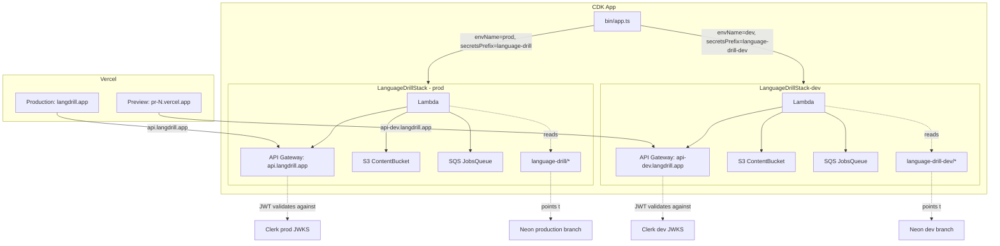

# Design Document

## Overview

Introduce a **second long-lived environment** ("dev") alongside production by instantiating the existing `LanguageDrillStack` twice with different props. The two stacks share zero runtime resources (separate Lambda, API Gateway, S3, SQS, secrets, Upstash, Anthropic key) but share the entire CDK class hierarchy — any future infra change lands on both with one code path.

The Vercel `Preview` channel is repointed to the new dev API (`api-dev.langdrill.app`), backed by the already-created Neon `dev` branch and the existing Clerk dev instance. The Vercel `Production` channel and the existing prod stack are left untouched.

## Steering Document Alignment

### Technical Standards (`tech.md`, `CLAUDE.md`)

- **All infra via CDK, no console click-ops** — kept. The dev stack is a second instantiation in `infra/bin/app.ts`, not a hand-rolled environment. AWS Secrets Manager values, ACM cert, API Gateway custom domain, and IAM grants all flow from CDK.
- **CDK-managed certs with Cloudflare DNS validation** — kept. The existing `api-gateway.ts` already uses `acm.CertificateValidation.fromDns()` and emits the API Gateway target as a `CfnOutput` for the operator to wire into Cloudflare. The dev stack reuses this pattern verbatim — no second cert-management strategy.
- **Neon branching as the database isolation strategy** — kept. Production stays on the `production` branch; dev points at the `dev` branch (host `ep-holy-union-anhivmbh-pooler.c-6.us-east-1.aws.neon.tech`). Per-PR ephemeral branches in CI are re-parented from `production` to `dev`.
- **Per-route JWT authorizer; OPTIONS + webhook unauthenticated; CORS in Hono** — preserved. The dev API's authorizer points at the dev Clerk JWKS instead of prod's, but the route topology and middleware ordering are identical.
- **Forward-only Drizzle migrations** — preserved. A new pre-deploy step applies the same migration files against both branches in sequence (dev first, prod second) so schemas can never drift mid-deploy.

### Project Structure (existing repo conventions)

- Constructs continue to live in `infra/lib/constructs/`, one resource family per file.
- `infra/lib/stack.ts` keeps a thin orchestrator role; the props interface grows but the file does not gain new responsibilities.
- `infra/bin/app.ts` becomes the **only** place that knows about prod vs. dev — env-var fan-out happens there, not inside the stack or constructs.
- Lambda runtime config (`infra/lambda/src/`) gains awareness of `ALLOWED_ORIGINS` and `ENV_NAME` env vars but does not branch on them in a way that would create different code paths per env (only data differs, not control flow).

## Code Reuse Analysis

### Existing Components to Leverage

- **`infra/lib/stack.ts`** — already wires `LambdaConstruct → ApiGatewayConstruct → StorageConstruct → QueueConstruct`. Becomes the single class instantiated twice; gets a `LanguageDrillStackProps` interface for the new params.
- **`infra/lib/constructs/lambda.ts`** — currently hardcodes the six `language-drill/*` secret names. Refactored to accept `secretsPrefix` and build secret names from it. IAM grants already use `secret.grantRead(handler)` so changing the secret name automatically scopes the IAM policy correctly.
- **`infra/lib/constructs/api-gateway.ts`** — already accepts `clerkIssuerUrl`, `clerkAudience`, `apiDomainName` as props (no refactor needed). Only adjustment: the `apiName` literal `"language-drill-api"` becomes a prop so the dev stack can use `"language-drill-api-dev"`.
- **`infra/lib/constructs/storage.ts`** — unchanged. Construct ID `ContentBucket` is auto-scoped under the stack, so two stacks → two buckets, no collision.
- **`infra/lib/constructs/queue.ts`** — unchanged. Same auto-scoping logic.
- **`infra/lambda/src/index.ts`** — Hono CORS middleware. Replace the hardcoded origin list with one parsed from `ALLOWED_ORIGINS` env var (comma-separated). Defaults preserve existing behavior if the env var is unset (avoids breaking local `pnpm dev:api`).
- **`infra/lambda/src/dev.ts`** — local-dev bypass. Unchanged. The `DEV_USER_ID` injection only fires when `process.env.AWS_LAMBDA_FUNCTION_NAME` is unset (i.e., in local Node), so cloud Lambdas of either env are untouched.
- **`.github/workflows/deploy.yml`** — extended to run migrations and deploy both stacks, with explicit stack-name arguments.
- **`.github/workflows/ci.yml`** — one-line change: `--parent dev` on `neonctl branches create`.

### Integration Points

- **AWS Secrets Manager** — two parallel namespaces. The dev Lambda's IAM role grants only `language-drill-dev/*`; the prod Lambda's role grants only `language-drill/*`. CDK's `secret.grantRead()` on a `Secret.fromSecretNameV2(...)` reference produces a scoped IAM policy automatically — we don't write the policy by hand.
- **Cloudflare DNS + ACM cert** — first dev deploy creates the ACM certificate; CDK does not block on validation, so the deploy completes but the API Gateway custom domain is not yet usable. Operator runbook (added to `infra/README.md`):
  1. After `cdk-deploy-dev` succeeds, run `aws acm describe-certificate --certificate-arn <arn>` (the ARN is in CloudFormation outputs) to fetch the DNS validation `CNAME` record name + value.
  2. Add the validation CNAME to Cloudflare (DNS-only / grey cloud). ACM polls every 60s and switches to `ISSUED` typically within 5–30 min.
  3. Add the operational `api-dev` CNAME → API Gateway target (the value printed by the `ApiDomainTarget` `CfnOutput`).
- **Clerk dev instance** — already exists (Vercel Preview already uses `pk_test_` / `sk_test_`). One-time setup in Clerk dashboard: (a) create a JWT template named `api` with `{ "aud": "language-drill", "sub": "{{user.id}}" }`; (b) create a webhook endpoint at `https://api-dev.langdrill.app/webhooks/clerk` subscribed to `user.created`, copy the signing secret into `language-drill-dev/CLERK_WEBHOOK_SECRET`.
- **Vercel** — `Preview` env vars are reconfigured (one variable change: `NEXT_PUBLIC_API_URL=https://api-dev.langdrill.app`). `Production` env vars unchanged. **Rollback plan:** if Preview env is accidentally applied to Production scope, the existing prod Vercel deploy keeps using the previously-built bundle until the next prod deploy; revert via Vercel dashboard (Settings → Environment Variables → edit scope) before triggering a new prod build.
- **Anthropic** — operator provisions a separate API key with a $10/month budget cap configured in the Anthropic console; key value goes into `language-drill-dev/ANTHROPIC_API_KEY`.
- **Upstash** — operator provisions a second free-tier Redis DB; URL + token go into `language-drill-dev/UPSTASH_REDIS_REST_URL` + `language-drill-dev/UPSTASH_REDIS_REST_TOKEN`.
- **Neon `dev` branch hygiene** — before the first preview deploy is shared with anyone outside the operator, run `neonctl branches reset dev --parent production` to re-fork from `production` so any in-progress local test data does not leak. Recommended cadence afterward: quarterly, or whenever schema drift between dev and prod becomes hard to migrate forward.

## Architecture



## Components and Interfaces

### `LanguageDrillStackProps` (new interface)

- **Purpose:** Single source of truth for what differs between prod and dev.
- **Interface:**
  ```ts
  interface LanguageDrillStackProps extends StackProps {
    envName: 'prod' | 'dev';
    secretsPrefix: string;          // 'language-drill' | 'language-drill-dev'
    apiName: string;                // 'language-drill-api' | 'language-drill-api-dev'
    apiDomainName: string;          // 'api.langdrill.app' | 'api-dev.langdrill.app'
    clerkIssuerUrl: string;
    clerkAudience: string[];
    allowedOrigins: string[];       // CORS allowlist for the Lambda runtime
    enableScheduledJobs: boolean;   // gate for Phase 1+ EventBridge schedulers
  }
  ```
- **Dependencies:** None — pure shape.
- **Reuses:** Extends `aws-cdk-lib.StackProps`.

### `LanguageDrillStack` (modified)

- **Purpose:** Orchestrate per-env construct wiring; apply env tag.
- **Interfaces:**
  - Accepts `LanguageDrillStackProps`.
  - Passes `secretsPrefix` and `additionalEnv` (containing `ALLOWED_ORIGINS`, `ENV_NAME`) to `LambdaConstruct`.
  - Passes `apiName`, `apiDomainName`, `clerkIssuerUrl`, `clerkAudience` to `ApiGatewayConstruct`.
  - Calls `Tags.of(this).add('env', props.envName)`.
  - When `enableScheduledJobs === false`, no EventBridge resources are created (currently moot — none exist yet — but the prop is wired in so Phase 1 cron work can gate on it).
- **Dependencies:** `LambdaConstruct`, `ApiGatewayConstruct`, `StorageConstruct`, `QueueConstruct`.
- **Reuses:** `infra/lib/stack.ts` (existing structure preserved).

### `LambdaConstruct` (modified)

- **Purpose:** Build the Hono Lambda + grant secrets/storage/queue access.
- **Interfaces:**
  ```ts
  interface LambdaConstructProps {
    secretsPrefix: string;
    additionalEnv?: Record<string, string>;  // ALLOWED_ORIGINS, ENV_NAME
  }
  ```
- **Behavior change:** Secret names built via `${secretsPrefix}/DATABASE_URL` etc. The six `Secret.fromSecretNameV2` calls keep their construct IDs (`DatabaseUrl`, `ClerkSecretKey`, …). For the prod stack, `secretsPrefix === 'language-drill'` resolves to the same secret-name strings used today, so the IAM policy resources, the Lambda environment-variable mapping, and the `NodejsFunction` itself produce identical CFN templates — no replacement.
- **Pre-existing pattern preserved (not improved):** secret values continue to be baked into `lambda.Function.environment` via `secretValue.unsafeUnwrap()` at synth time. This means the deployed CFN template contains plaintext secret values. IAM scoping (the dev role grants only `language-drill-dev/*`, the prod role grants only `language-drill/*`) is the **only** runtime separation — anyone with `cloudformation:GetTemplate` on a stack reads its secrets. This is a known limitation of the current `unsafeUnwrap` approach and is out of scope for this spec.
- **Reuses:** Existing `secret.grantRead(handler)` calls.

### `ApiGatewayConstruct` (minor change)

- **Purpose:** HTTP API + JWT authorizer + custom domain + cert.
- **Behavior change:** `apiName` becomes a prop (was hardcoded `"language-drill-api"`). All other props were already in place. The `CfnOutput` `ApiDomainTarget` keeps its logical ID; only its description string is templated so the operator sees the right CNAME instruction per env.
- **No-replacement audit:** the prod stack will pass `apiName: 'language-drill-api'` (unchanged value). CloudFormation treats `AWS::ApiGatewayV2::Api.Name` as an in-place update, not a replacement, so even a value change would not recreate the resource. Logical IDs (`HttpApi`, `DefaultStage`, `ClerkJwtAuthorizer`, the route resources, `ApiCertificate`, `ApiDomain`, `ApiMapping`) are unchanged because their construct IDs are unchanged.
- **Risk:** The `HttpJwtAuthorizer` constructor takes an `id` arg (`"ClerkJwtAuthorizer"`). It only becomes a CDK construct when bound to a route via `addRoutes({ authorizer })`, at which point it's scoped under the route. Two stacks each instantiating an authorizer with the same string is fine — no collision.

### Hono CORS middleware (modified)

- **Purpose:** Restrict cross-origin access at the runtime layer.
- **Behavior change:**
  ```ts
  const FALLBACK_ORIGINS = ['https://*.vercel.app', 'https://langdrill.app', 'https://www.langdrill.app'];
  const allowedOrigins = (process.env.ALLOWED_ORIGINS ?? '')
    .split(',').map(s => s.trim()).filter(Boolean);
  const origins = allowedOrigins.length ? allowedOrigins : FALLBACK_ORIGINS;
  // matcher: exact equality OR wildcard suffix for patterns starting with `*.`
  ```
  The fallback exists only for local `pnpm dev:api` where no env var is injected. CDK is the source of truth in deployed environments.
- **Reuses:** `hono/cors` middleware.

### `bin/app.ts` (modified)

- **Purpose:** Instantiate both stacks unconditionally; read env config; fail fast on missing config.
- **Interface:**
  ```ts
  const app = new App();
  const env = {
    account: process.env.CDK_DEFAULT_ACCOUNT,
    region: process.env.CDK_DEFAULT_REGION,
  };

  function requireEnv(key: string): string {
    const v = process.env[key];
    if (!v) throw new Error(`Missing required env var: ${key}`);
    return v;
  }

  new LanguageDrillStack(app, 'LanguageDrillStack', {
    env,
    envName: 'prod',
    secretsPrefix: 'language-drill',
    apiName: 'language-drill-api',
    apiDomainName: requireEnv('API_DOMAIN_NAME'),
    clerkIssuerUrl: requireEnv('CLERK_ISSUER_URL'),
    clerkAudience: (process.env.CLERK_AUDIENCE || 'language-drill').split(',').filter(Boolean),
    allowedOrigins: ['https://*.vercel.app', 'https://langdrill.app', 'https://www.langdrill.app'],
    enableScheduledJobs: true,
  });

  new LanguageDrillStack(app, 'LanguageDrillStack-dev', {
    env,
    envName: 'dev',
    secretsPrefix: 'language-drill-dev',
    apiName: 'language-drill-api-dev',
    apiDomainName: requireEnv('API_DOMAIN_NAME_DEV'),
    clerkIssuerUrl: requireEnv('CLERK_ISSUER_URL_DEV'),
    clerkAudience: (process.env.CLERK_AUDIENCE_DEV || 'language-drill').split(',').filter(Boolean),
    allowedOrigins: ['https://*.vercel.app', 'http://localhost:3000'],
    enableScheduledJobs: false,
  });
  ```
- **Behavior:** Both stacks are always instantiated (Requirement 3.1). Missing required env vars produce a synth-time error naming the variable (Requirement 3.5).
- **Per-stack synth/deploy:** local users who only want to operate on prod can still run `pnpm cdk deploy LanguageDrillStack` after setting only the prod env vars — but `cdk synth` (no args) will fail if dev vars are missing. The repo's pnpm scripts (`infra/package.json`) gain `synth:prod`, `synth:dev`, `deploy:prod`, `deploy:dev` that pass `--exclusively LanguageDrillStack` / `--exclusively LanguageDrillStack-dev` for one-stack workflows.

### `.github/workflows/deploy.yml` (modified)

- **Purpose:** Deploy on push to `main`.
- **Starting point on main:** the `prod-migrate → cdk-deploy → vercel-prod` chain already exists (added in commit `0ea72b7`). The prod migration step uses GitHub secret `DATABASE_URL`. We extend rather than rewrite.
- **Job graph after this spec (serial — prod precedes dev to satisfy Requirement 2.3):**
  ```
  prod-migrate ──► cdk-deploy-prod ──► vercel-prod
                                     ╲
                                      ──► dev-migrate ──► cdk-deploy-dev
  ```
- **Concrete edits:**
  1. Rename the existing `cdk-deploy` job to `cdk-deploy-prod` and switch its run command from `pnpm cdk deploy --require-approval never` to `pnpm cdk deploy LanguageDrillStack --exclusively --require-approval never`. Without `--exclusively`, CDK would also synth/deploy the new dev stack in this job — defeating the failure-isolation goal.
  2. Add a `dev-migrate` job that mirrors `prod-migrate` but uses `DATABASE_URL: ${{ secrets.DEV_DATABASE_URL }}`. It declares `needs: [cdk-deploy-prod]` so the dev chain only runs after prod has succeeded.
  3. Add a `cdk-deploy-dev` job that depends on `dev-migrate`. It runs `pnpm cdk deploy LanguageDrillStack-dev --exclusively --require-approval never` with `CLERK_ISSUER_URL_DEV` and `API_DOMAIN_NAME_DEV` env vars. It does NOT block `vercel-prod` (which still depends only on `cdk-deploy-prod`).
- **Failure isolation:** `cdk-deploy-prod` does NOT depend on anything dev-related. A future failure in `dev-migrate` or `cdk-deploy-dev` never rolls back or aborts the prod deploy (Requirement 2.3 second clause). Conversely, if `cdk-deploy-prod` fails, the entire dev chain is skipped — correct because both envs apply the same migrations and a prod-blocking issue would also block dev.
- **New required GitHub secrets** (existing `DATABASE_URL` is already wired up, no rename):
  - `DEV_DATABASE_URL` — Neon `dev` branch pooled connection string.
  - `CLERK_ISSUER_URL_DEV` — dev Clerk frontend API URL.
  - `API_DOMAIN_NAME_DEV` — `api-dev.langdrill.app`.
  - `CLERK_AUDIENCE_DEV` (optional, defaults to `language-drill`).

  Documented in `infra/README.md` and `CLAUDE.md`.

### `.github/workflows/ci.yml` (modified)

- **Purpose:** Per-PR validation.
- **Behavior change:** The `neonctl branches create` call gains `--parent dev`. One line. No other change.

### Documentation updates (Requirement 7)

- **`CLAUDE.md`** — under the existing `## CI/CD` section, add a `### Environment matrix` subsection containing one table with columns `Service | Production | Dev`. Rows: API domain, Lambda stack name, Neon branch, Clerk instance, Secrets prefix, Upstash DB, Anthropic key, Vercel env scope. This makes the prod-vs-dev split discoverable in the same file every contributor already reads.
- **`infra/README.md`** — three concrete edits:
  1. Update the existing "Secrets Manager Entries" table to include all six prod secrets correctly (the current table is stale — it lists 5 secrets but the code expects 6, missing the `UPSTASH_REDIS_REST_URL` / `UPSTASH_REDIS_REST_TOKEN` split).
  2. Add a parallel "Dev Secrets Manager Entries" table listing the six `language-drill-dev/*` secrets with the same source-of-value column.
  3. Add a "First-time dev environment setup" runbook section covering: ACM validation (steps from Integration Points above), Cloudflare CNAME for `api-dev`, Clerk dev JWT template + webhook, Vercel Preview env-var update, and the `neonctl branches reset` pre-share step.
- **`docs/dev-environment-plan.md`** — once the spec is delivered, the plan doc is moved to `docs/archived/dev-environment-plan.md` and gains a one-line header: `> **Implemented:** see spec at .claude/specs/dev-neon-env/`. This satisfies Requirement 7.3 and prevents the plan from being mistaken for outstanding work in future repo scans.

## Data Models

No new data models. The dev environment uses **the same Drizzle schema** as production — that's the point. Schema migrations apply to both branches.

The Neon `dev` branch was already created with copy-on-write from `production` and currently shares its 12 tables. Future schema diffs are produced from `packages/db/migrations/*.sql` and applied to both branches by `deploy.yml`.

## Error Handling

### Error Scenarios

1. **Dev stack synth runs but `CLERK_ISSUER_URL_DEV` (or any other required dev env var) is missing.**
   - **Handling:** `requireEnv()` in `bin/app.ts` throws `Error: Missing required env var: CLERK_ISSUER_URL_DEV` before any construct is instantiated, failing synth fast.
   - **Operator impact:** Clear error message names the missing variable. For local single-stack workflows, the operator uses `pnpm cdk deploy LanguageDrillStack --exclusively` which still requires the prod env vars — the dev env vars only matter when the dev stack is actually targeted.

2. **Dev secret value missing in AWS Secrets Manager at deploy time.**
   - **Handling:** CloudFormation deploy fails on the secret reference (`secretsmanager:GetSecretValue` returns `ResourceNotFoundException`). Stack rolls back automatically; prod stack is unaffected because it's a separate CFN stack.
   - **Operator impact:** Clear CFN failure message naming the missing secret. Operator creates the secret and re-runs.

3. **Cloudflare CNAME for `api-dev` not yet added when dev stack first deploys.**
   - **Handling:** Dev stack deploys successfully (CDK doesn't depend on DNS); first request to `api-dev.langdrill.app` fails with NXDOMAIN until the CNAME propagates. The `CfnOutput` printed by `ApiGatewayConstruct` tells the operator the exact target value.
   - **Operator impact:** Adds the CNAME post-deploy. ACM cert validation happens in parallel and may add 5–30min before TLS works.

4. **CI ephemeral branch tries to fork from `dev` but `dev` doesn't exist yet.**
   - **Handling:** `neonctl branches create --parent dev` returns a 404. CI fails the `neon-migrate` job. The spec's task ordering guarantees `dev` exists before the CI workflow change is merged, but this is a defense-in-depth check.
   - **Operator impact:** None if tasks merge in the documented order.

5. **CORS env var unset on the deployed Lambda (regression).**
   - **Handling:** Fallback list applies — wrong for dev (would allow prod origins) but does not block all requests. Detected at smoke-test time when a request from `localhost:3000` is rejected (not in the fallback).
   - **Mitigation:** CDK always sets `ALLOWED_ORIGINS`. The CDK unit tests assert this env var is present on both Lambdas with the correct values.

6. **Drizzle migration fails on dev branch (e.g., data conflict from accumulated test rows).**
   - **Handling:** `migrate-dev` job fails, blocking only `cdk-deploy-dev`. `cdk-deploy-prod` proceeds normally (independent dependency chain).
   - **Operator impact:** Investigate the migration; in the worst case, `neonctl branches reset dev --parent production` re-forks the dev branch from prod's current state, then re-run.

7. **Cross-env JWT (dev token sent to prod, or vice versa).**
   - **Handling:** API Gateway JWT authorizer rejects the request with HTTP 401 because the token's `iss` claim doesn't match the configured issuer. No code path in the Lambda is reached.
   - **Operator impact:** None (this is the intended security boundary).

## Testing Strategy

### Unit Testing

- **CDK construct tests** — add a Vitest suite in `infra/test/` (currently empty) that synthesizes both stacks and asserts:
  - Prod stack synthesizes with the same logical IDs and CFN resource shapes as before (snapshot-tested at the CFN-template level for the secret references, S3, SQS, and Lambda function — proves no resource replacement).
  - Dev stack contains exactly six `Secret` references with names prefixed `language-drill-dev/` and zero references to `language-drill/*`.
  - Dev stack's API Gateway has `Name === 'language-drill-api-dev'`.
  - Dev stack tags include `env=dev`; prod stack tags include `env=prod`.
  - Dev Lambda environment includes `ENV_NAME=dev` and `ALLOWED_ORIGINS=https://*.vercel.app,http://localhost:3000`; prod Lambda includes `ENV_NAME=prod` and `ALLOWED_ORIGINS=https://*.vercel.app,https://langdrill.app,https://www.langdrill.app`.
- **Hono CORS unit test** — extend Lambda route tests to cover the env-var-driven origin function: with `ALLOWED_ORIGINS='https://*.vercel.app,http://localhost:3000'`, accept Vercel preview + localhost; reject `https://langdrill.app`. With the env var unset, fallback list applies.

### Integration Testing

- **Local-against-cloud smoke** — local `.env`'s `DATABASE_URL` already points at the dev Neon branch; run `pnpm db:migrate && pnpm db:seed:exercises`; confirm 12 tables and ≥36 seeded exercise rows via Drizzle Studio.
- **Migration parity** — push the migrate-jobs change and observe a no-op CI run: `migrate-dev` and `migrate-prod` both apply zero migrations cleanly and complete in <30s each.

### End-to-End Testing

- **Vercel preview smoke** — open a no-op PR; once the preview is live, run the signed-in flow: sign up via dev Clerk → home → start an exercise → submit (real Claude call) → reload, confirm the answer is recorded. Verify writes land in Neon `dev` (Drizzle Studio) and **not** in `production`.
- **Negative auth check** — extract a JWT from the prod Clerk instance; call a protected route on `api-dev.langdrill.app` with that token; confirm 401 (issuer mismatch). Run the inverse to confirm dev tokens are rejected by prod.
- **Cron-not-on-dev assertion** — when Phase 1 introduces scheduled jobs, the CDK unit test asserting zero `aws-events.Rule` resources on the dev stack catches any accidental enabling.
