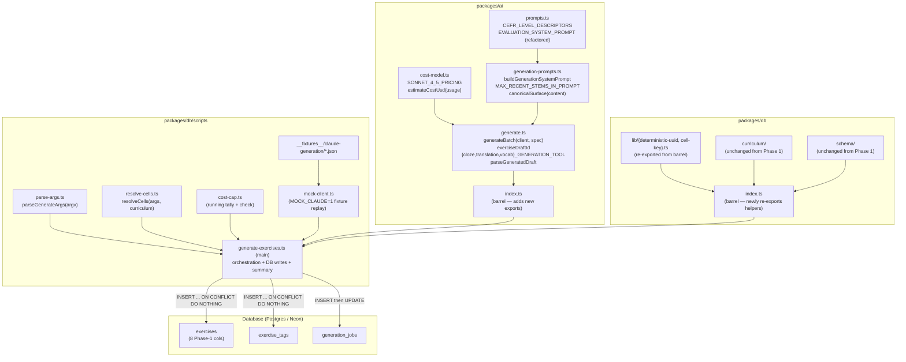
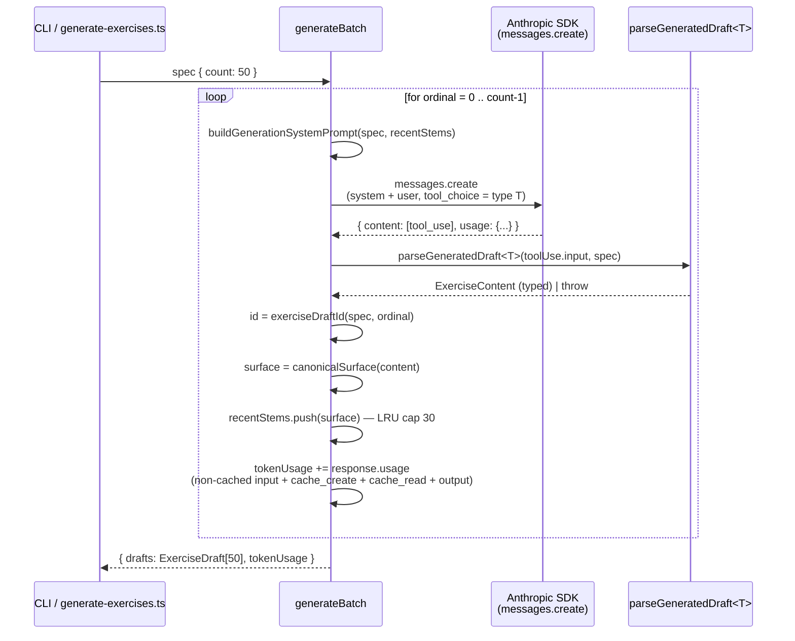

# Design Document

## Overview

This design implements **Phase 2 — Generator core + CLI** from `docs/exercise-generation-plan.md` against the requirements in `requirements.md`. The phase produces three sets of artifacts:

1. A **generator core** in `packages/ai`: `generate.ts` + `generation-prompts.ts` + `cost-model.ts`. Surface mirrors `evaluate.ts` + `prompts.ts`: one tool schema per supported `ExerciseType`, one builder for the cached system prompt, one `generateBatch(client, spec)` entry point. Generation calls run at temperature 0.7 and use Claude tool use to force structured output, the same trick the evaluator uses.
2. A **CLI driver** at `packages/db/scripts/generate-exercises.ts`. Accepts a single cell or a whole `(language, level)` slice, opens a `generation_jobs` audit row per cell, calls `generateBatch`, inserts drafts via `INSERT … ON CONFLICT DO NOTHING`, inserts the matching `exercise_tags` rows, and closes the audit row. The CLI is the only Phase 2 trigger; Phase 4 wraps the same core in a Lambda without core changes.
3. **Test coverage**: unit tests for the generator (mocked SDK), unit tests for prompt determinism, an integration test for the CLI's planning + DB-write paths under `MOCK_CLAUDE=1`, and a small JSON fixture set so the integration test runs offline.

What this phase deliberately does **not** ship: the validator pass (Phase 3), across-batch dedup index (Phase 3), Lambda + SQS + EventBridge (Phase 4), the Messages Batches API path (Phase 4.2), pool-depth API (Phase 5), and any new exercise type beyond the three already implemented (Phase 6). The architecture is shaped to absorb each later phase without disturbing the core: the generator is trigger-agnostic, the validator slots between `generateBatch` and the CLI's insert, and the dedup index is a UNIQUE partial index added in a future migration.

## Steering Document Alignment

### Technical Standards (tech.md)

- **Anthropic Claude API + tool use + `cache_control: ephemeral`** (`tech.md` §"AI / GenAI"). Generation reuses the exact pattern `evaluate.ts` already proves out — one cached system block, structured output via tool use, no free-text parsing. The `cost-model.ts` constants account for cache-write (125% of base) and cache-read (10% of base) tiers per Anthropic's published pricing model.
- **Cost-controlled pre-generation** (`tech.md` §7). Every CLI run leaves one `generation_jobs` row per cell with token totals and a USD estimate; the `--max-cost-usd` cap aborts runs that exceed budget. The 50-draft-per-cell target from `docs/exercise-strategy.md` §"Pre-generated pool" anchors the default `--count`.
- **Drizzle + `INSERT … ON CONFLICT DO NOTHING`** (`tech.md` §"Database"). The CLI uses Drizzle's `.onConflictDoNothing()` keyed on the deterministic `exercises.id`, identical to how `seed-exercises.ts` already inserts the 36 hand-authored seeds. Re-running the CLI is a database no-op.
- **Shared types via `packages/shared`** (`tech.md` §"Monorepo Structure"). `ExerciseContent`, `ExerciseType`, `Language`, `CefrLevel`, `LearningLanguage` are imported from `@language-drill/shared`. The new `GenerationSpec` and `ExerciseDraft` types live in `packages/ai` and are re-exported from its barrel.
- **Forward-only migrations** (`tech.md` §5). Phase 2 adds **no** new migrations — Phase 1's columns and indexes already accommodate every column the generator writes.

### Project Structure (no `structure.md`, but conventions verified)

- **Package boundaries.** `packages/ai` owns the generator and the cost model (it's the place all Claude-facing knowledge lives). `packages/db/scripts/` owns the CLI (matches the existing `seed-exercises.ts` location). The CLI imports from both `@language-drill/ai` and `@language-drill/db`. No bidirectional dependency: `packages/ai` does not depend on `packages/db`.
- **Tests next to the module.** `generate.test.ts` and `generation-prompts.test.ts` in `packages/ai/src/`; `generate-exercises.test.ts` in `packages/db/scripts/`. No orphan `tests/` directory. Mirrors `evaluate.test.ts` next to `evaluate.ts`.
- **Fixture location.** Claude response fixtures for the CLI integration test live at `packages/db/scripts/__fixtures__/claude-generation/{cloze,translation,vocab_recall}.json` — co-located with the test that loads them.

## Code Reuse Analysis

### Existing components to leverage

- **`packages/ai/src/evaluate.ts` end-to-end pattern** (lines 22–272). The generator copies the structure beat-for-beat: typed `Tool` definition, separate `parse<X>Result` validator that throws on shape errors, an exported tool name constant, an `async` function that calls `client.messages.create` with `tool_choice: { type: 'tool', name: <name> }` and one cached system block, then extracts the single `tool_use` block from `response.content` and runs it through the parser. Every behavior the generator wants is already proven out in this file; the new code is structurally a fork.
- **`EVALUATION_SYSTEM_PROMPT` cache pattern** (`evaluate.ts:231–237`). Exactly the same `system: [{ type: 'text', text: ..., cache_control: { type: 'ephemeral' } }]` shape is reused; nothing new about how caching is requested. The system prompt's first call in a cell is the cache-write; subsequent calls in the same 5-minute window are cache reads.
- **CEFR descriptors in `EVALUATION_SYSTEM_PROMPT`** (`prompts.ts:36–43`). Currently inlined as a markdown bulleted list. Phase 2 extracts these into a single `CEFR_LEVEL_DESCRIPTORS: Record<CefrLevel, string>` constant in `prompts.ts` and refactors `EVALUATION_SYSTEM_PROMPT` to interpolate it. The generator's system prompt builder imports the same constant — exactly one source of truth (Requirement 2.2).
- **`deterministicUuid` helper** (`packages/db/src/lib/deterministic-uuid.ts`). FNV-style 128-bit hash, RFC-4122-shaped output. Phase 2 re-exports it from `@language-drill/db`'s package barrel (`packages/db/src/index.ts`) — Phase 1 left it internal-only — so the generator in `packages/ai` can derive `exerciseDraftId` without re-implementing the hash.
- **`assertValidCellKey` helper** (`packages/db/src/lib/cell-key.ts`). Phase 1's stub validator. Phase 2 is its first caller. Re-exported from `@language-drill/db`'s package barrel for the CLI.
- **`SEED_EXERCISES` mapping pattern** (`seed-exercises.ts:585–626`). The hand-curated `Record<seedKey, grammarPointKey>` map is the model the CLI's pure planning layer follows: pure functions transforming spec → list of cells → list of drafts → list of inserts, no DB I/O until the writer functions consume them.
- **`onConflictDoNothing()` Drizzle pattern** already used in `seed-exercises.ts:861`. The CLI's batch insert uses identical syntax.
- **Mocked SDK test pattern** (`evaluate.test.ts:283–337`). A `vi.fn()`-backed `mockCreate` substituted for `client.messages.create` is exactly how `generate.test.ts` will mock Claude. The same structural setup (mock returns a `tool_use` block; assertions on the call arguments and the parsed result) is reused.
- **`createClaudeClient(apiKey)`** (`packages/ai/src/index.ts:22–24`). Already constructs an Anthropic client. The CLI calls it with `process.env.ANTHROPIC_API_KEY` (or substitutes a mock client when `MOCK_CLAUDE=1`).
- **`createDb(connectionString)`** (`packages/db/src/client.ts:15`). Already returns a Drizzle client over Neon WS. The CLI uses the same factory the seed script uses; no new connection logic.
- **Direct-script entry shape** (`seed-exercises.ts:901–907`). The `isDirectRun` guard via `fileURLToPath(import.meta.url)` lets a script be both an importable module and a `pnpm` entry point. The CLI uses the identical guard so its `main()` can be invoked from tests without re-execing the process.
- **`dotenv-cli` + `pnpm` script wrapping** (root `package.json:11–13`). The root `package.json` already wraps `pnpm db:seed:exercises` with `dotenv -e .env -- pnpm --filter @language-drill/db seed:exercises`. Phase 2 adds a `generate:exercises` line with the same wrapping pattern, so `pnpm generate:exercises` works without an explicit dotenv prefix.

### Integration points

- **`exercises` table** — column shape from Phase 1 already accommodates every column the CLI writes. Inserts set `id`, `type`, `language`, `difficulty`, `contentJson`, `grammarPointKey`, `topicDomain` (or NULL), `generationSource = 'claude-realtime'`, `modelId`, `reviewStatus = 'auto-approved'` (default), `generatedAt = now()`. `qualityScore`, `flaggedReasons`, `audioS3Key` are left NULL.
- **`exercise_tags` table** — joins each new exercise to a `skill_topics` row. The skill-topic ID is `deterministicUuid('skill-topic:' + spec.grammarPoint.key)` — the exact derivation Phase 1's seed script uses (`seed-exercises.ts:801`). Re-running the CLI hits the existing `(exerciseId, skillTopicId)` PK and is a no-op.
- **`generation_jobs` table** — Phase 1's audit table is the CLI's first writer. The cell key is built and validated via `assertValidCellKey`; the row is opened in `'running'` state and updated to `'succeeded'` or `'failed'` when the cell finishes.
- **Existing read paths** (`infra/lambda/src/routes/exercises.ts`, `sessions.ts`) — already filter on `review_status IN ('auto-approved', 'manual-approved')` (Phase 1, Requirement 3.6). Generated drafts are visible to `GET /exercises` and eligible for `POST /sessions` immediately on insert with no API change.
- **`@language-drill/db` package barrel** — extended in this phase to re-export `deterministicUuid` and `assertValidCellKey`. These are the only two helpers crossing the package boundary; the rest of the new code stays inside `packages/ai` and `packages/db/scripts/`.

### Why the CLI lives in `packages/db/scripts`, not `packages/ai`

Two competing places for the CLI: `packages/ai/scripts/` (the generator's "owner" package) or `packages/db/scripts/` (where `seed-exercises.ts` already lives). The design picks the latter because:

1. The CLI is fundamentally a **DB writer**. It opens audit rows, inserts exercises, inserts tags, hits `onConflictDoNothing` against deterministic IDs, validates cell keys. The Claude calls are an input source; the DB writes are the output side. Co-locating with `seed-exercises.ts` matches the dominant concern.
2. `packages/db` already depends on `@language-drill/shared`. Importing `@language-drill/ai` from `packages/db/scripts/*` is a plain workspace dependency. The reverse — `@language-drill/ai` importing `@language-drill/db` — would couple the AI package to schema, which is the wrong direction (the AI package needs to be reusable from a future Lambda that doesn't import the DB schema unless it's writing rows).
3. The existing `pnpm db:seed:exercises` wrapping pattern (`dotenv -e .env -- pnpm --filter @language-drill/db seed:exercises`) is the script-runner the CLI wants too. Adding `generate:exercises` to the same package's `scripts` keeps the DX symmetric.

## Architecture



The dependency graph has exactly one cross-package edge: `packages/db/scripts` → `packages/ai`. `packages/ai` does not import `packages/db` (the only DB-package symbols it needs — `deterministicUuid` — are imported through the new barrel re-export, but nothing in `packages/ai`'s actual generation code reaches into schema).

### Per-draft sequencing inside `generateBatch`



Sequential per-draft within a cell. Cell-level concurrency lives in the CLI (Requirement 4.8), not in `generateBatch` — the generator stays a simple loop that any future trigger can wrap.

## Components and Interfaces

### Component 1 — `cost-model.ts`

**Purpose:** Hold Sonnet 4.5 list-price constants and a single `estimateCostUsd(usage)` function so cost arithmetic appears in exactly one place.

**File:** `packages/ai/src/cost-model.ts` (new)

**Interface:**

```ts
/**
 * Sonnet 4.5 list pricing (USD per token), copied 2026-05-05 from
 * https://docs.anthropic.com/en/docs/about-claude/pricing
 *
 * Update path: when the evaluator's GENERATION_MODEL constant moves to a new
 * model, bump these constants in the same PR. The corresponding Generation
 * Lambda change is gated by the same PR — these prices are the authoritative
 * source for the cost-cap CLI flag and the generation_jobs.cost_usd_estimate
 * column.
 */
export const SONNET_4_5_PRICING = Object.freeze({
  inputUsdPerToken:           3.00 / 1_000_000,    // base
  cacheWriteUsdPerToken:      3.75 / 1_000_000,    // 125% of base
  cacheReadUsdPerToken:       0.30 / 1_000_000,    //  10% of base
  outputUsdPerToken:         15.00 / 1_000_000,
});

export type ClaudeUsageBreakdown = {
  inputTokens: number;                  // non-cached, billed at base
  cacheCreationInputTokens: number;     // billed at cache-write
  cacheReadInputTokens: number;         // billed at cache-read
  outputTokens: number;
};

/** Pure: returns USD cost rounded to 4 decimal places. */
export function estimateCostUsd(usage: ClaudeUsageBreakdown): number;

/** Pure: sums two breakdowns. Used to fold a draft's usage into a cell total. */
export function addUsage(a: ClaudeUsageBreakdown, b: ClaudeUsageBreakdown): ClaudeUsageBreakdown;

export const ZERO_USAGE: ClaudeUsageBreakdown;
```

**Dependencies:** None.

**Reuses:** Nothing — greenfield. The `Object.freeze` pattern matches `LANGUAGE_NAMES` in `packages/shared/src/index.ts:35`.

### Component 2 — `prompts.ts` refactor (extract CEFR descriptors)

**Purpose:** One source of truth for the CEFR level descriptors, consumed by both the evaluator's system prompt and the generator's.

**File:** `packages/ai/src/prompts.ts` (modified)

**Change:**

```ts
export const CEFR_LEVEL_DESCRIPTORS: Record<CefrLevel, string> = Object.freeze({
  A1: "Can use very basic phrases and simple sentences. Vocabulary limited to high-frequency everyday words.",
  A2: "Can handle short, simple sentences on familiar topics. Basic connectors (and, but, because). Present and past tenses.",
  B1: "Can produce connected text on familiar topics. Reasonable range of vocabulary. Most common tenses used accurately.",
  B2: "Can produce clear, detailed text on a wide range of subjects. Good grammatical control; occasional slips do not cause misunderstanding. Varied vocabulary with some idiomatic expressions.",
  C1: "Can produce well-structured, detailed text on complex subjects. Consistent grammatical accuracy. Wide vocabulary including less common words and collocations.",
  C2: "Can produce sophisticated, nuanced text. Near-native grammatical control. Extensive vocabulary with precise word choice and natural idiomatic usage.",
});

export const EVALUATION_SYSTEM_PROMPT = `…
## CEFR Level Descriptors

${(Object.entries(CEFR_LEVEL_DESCRIPTORS) as [CefrLevel, string][])
  .map(([level, descriptor]) => `- **${level}**: ${descriptor}`)
  .join('\n')}

…`;
```

**Test impact:** the existing `EVALUATION_SYSTEM_PROMPT` test at `evaluate.test.ts:138–141` (asserts the prompt contains "A1" and "C2") still passes — the constant is interpolated, not removed. New assertion in `generation-prompts.test.ts` checks the same descriptor for one level appears in both prompts (the easiest way to lock the DRY invariant).

**Dependencies:** `@language-drill/shared` (`CefrLevel`).

**Reuses:** Existing prompt text verbatim; no rewording of descriptors.

### Component 3 — `generation-prompts.ts`

**Purpose:** Build the cached system prompt the generator passes to Claude. Pure functions — no I/O.

**File:** `packages/ai/src/generation-prompts.ts` (new)

**Interface:**

```ts
import type { CefrLevel, ExerciseType, Language } from '@language-drill/shared';
import type { GrammarPoint } from '@language-drill/db';
import { CEFR_LEVEL_DESCRIPTORS } from './prompts.js';

export const MAX_RECENT_STEMS_IN_PROMPT = 30;

/** Tail-truncating LRU helper used by both the generator and the prompt builder. */
export function tailRecentStems(stems: readonly string[]): string[] {
  return stems.slice(-MAX_RECENT_STEMS_IN_PROMPT);
}

export type GenerationPromptInputs = {
  language: Exclude<Language, Language.EN>;
  cefrLevel: CefrLevel;
  exerciseType: ExerciseType;
  grammarPoint: GrammarPoint;
};

/**
 * Pure: builds the system prompt. Two calls with the same (inputs, recentStems)
 * return identical strings — required so prompt caching actually hits.
 */
export function buildGenerationSystemPrompt(
  inputs: GenerationPromptInputs,
  recentStems: readonly string[],
): string;

/**
 * Pure: builds the per-draft user message. Includes the ordinal, the topic-
 * domain hint (or "mixed" when none), and the type-specific phrasing telling
 * Claude to call the matching tool. A single user message per draft means the
 * generator produces drafts one at a time — the system prompt is what's cached.
 */
export function buildGenerationUserPrompt(
  inputs: GenerationPromptInputs,
  ordinal: number,
  topicDomain: string | null,
): string;

/**
 * Pure: returns the canonical surface used both for `recentStems` accumulation
 * and (in Phase 3) for across-batch dedup. Lowercase + NFKD + diacritic-strip.
 */
export function canonicalSurface(content: ExerciseContent): string;
```

**System prompt template (rendered):**

```
You are an expert language exercise author for {{language}} learners at CEFR
{{cefrLevel}}. Your job is to produce one exercise of type {{exerciseType}}
that targets exactly one grammar point: {{grammarPoint.name}}.

## Grammar point context
{{grammarPoint.description}}

## Positive examples
{{grammarPoint.examplesPositive — one per line}}

## Negative examples (incorrect production — for awareness only, do not include in the exercise)
{{grammarPoint.examplesNegative — one per line}}

## Common learner errors
{{grammarPoint.commonErrors — one per line}}

## CEFR level descriptors
- **A1**: …                                    ← from CEFR_LEVEL_DESCRIPTORS
- **A2**: …
…

## Hard constraints
- The correct answer must be uniquely correct given the surrounding context.
- Vocabulary outside CEFR {{cefrLevel}} is forbidden unless the exercise
  explicitly tests it.
- Do not produce an exercise that resembles any of these existing stems:
  {{recentStems as bullet list — or "(none yet)" if empty}}
- One exercise per tool call. Do not batch multiple inside one tool call.
- You MUST use the provided tool. Do not return plain text.

## Output
Use the {{tool_name_for_type}} tool with all required fields populated.
```

**Dependencies:** `@language-drill/shared` (types), `@language-drill/db` (`GrammarPoint`), `prompts.ts` (descriptors).

**Reuses:** Descriptors from `prompts.ts`; nothing else.

### Component 4 — `generate.ts` (the generator core)

**Purpose:** The single function `generateBatch(client, spec)` plus the per-type tool schemas, parsers, and deterministic ID derivation. Mirrors `evaluate.ts` structurally.

**File:** `packages/ai/src/generate.ts` (new)

**Interface:**

```ts
import Anthropic from '@anthropic-ai/sdk';
import type {
  CefrLevel,
  ExerciseContent,
  ExerciseType,
  Language,
} from '@language-drill/shared';
import type { GrammarPoint } from '@language-drill/db';
import { deterministicUuid } from '@language-drill/db';
import { ClaudeUsageBreakdown, ZERO_USAGE, addUsage } from './cost-model.js';
import {
  buildGenerationSystemPrompt,
  buildGenerationUserPrompt,
  canonicalSurface,
  tailRecentStems,
  MAX_RECENT_STEMS_IN_PROMPT,
} from './generation-prompts.js';

/** Authoritative model id for the generator. Asserted equal to evaluate.ts's
 *  model in tests so they cannot drift unintentionally. */
export const GENERATION_MODEL = 'claude-sonnet-4-5' as const;

const GENERATION_MAX_TOKENS = 1024;
const GENERATION_TEMPERATURE = 0.7;

export const TOOL_NAME_BY_TYPE: Readonly<Record<ExerciseType, string>> = Object.freeze({
  cloze:        'submit_cloze_exercise',
  translation:  'submit_translation_exercise',
  vocab_recall: 'submit_vocab_recall_exercise',
});

export const CLOZE_GENERATION_TOOL: Anthropic.Tool;          // mirrors ClozeContent
export const TRANSLATION_GENERATION_TOOL: Anthropic.Tool;    // mirrors TranslationContent
export const VOCAB_RECALL_GENERATION_TOOL: Anthropic.Tool;   // mirrors VocabRecallContent

export const GENERATION_TOOL_BY_TYPE: Readonly<Record<ExerciseType, Anthropic.Tool>>;

export type GenerationSpec = {
  language: Exclude<Language, Language.EN>;
  cefrLevel: CefrLevel;
  exerciseType: ExerciseType;
  grammarPoint: GrammarPoint;
  topicDomain: string | null;        // CLI passthrough; prompts ignore it
  count: number;                     // 1..200
  batchSeed: string;                 // default 'phase-2-default'
};

export type ExerciseDraft = {
  id: string;                        // deterministic UUID (see exerciseDraftId)
  contentJson: ExerciseContent;      // discriminated-union element
  metadata: {
    grammarPointKey: string;
    topicDomain: string | null;
    modelId: string;                 // === GENERATION_MODEL
    inputTokens: number;             // non-cached + cache_create + cache_read
    outputTokens: number;
    cacheCreationInputTokens: number;
    cacheReadInputTokens: number;
    inBatchDuplicate: boolean;
  };
};

export type GenerateBatchResult = {
  drafts: ExerciseDraft[];
  tokenUsage: ClaudeUsageBreakdown;
};

export function exerciseDraftId(spec: GenerationSpec, ordinal: number): string {
  return deterministicUuid(
    [
      spec.language,
      spec.cefrLevel,
      spec.exerciseType,
      spec.grammarPoint.key,
      spec.batchSeed,
      String(ordinal),
    ].join('|'),
  );
}

export async function generateBatch(
  client: Anthropic,
  spec: GenerationSpec,
): Promise<GenerateBatchResult>;

/**
 * Per-type parser. Each one validates the tool input against the corresponding
 * `ExerciseContent` shape and throws a field-level error on mismatch. The
 * returned shape is statically typed — Phase 3's validator and Phase 4's Lambda
 * both consume `ExerciseDraft.contentJson` as a discriminated union.
 */
export function parseGeneratedClozeDraft(input: unknown, spec: GenerationSpec): ClozeContent;
export function parseGeneratedTranslationDraft(input: unknown, spec: GenerationSpec): TranslationContent;
export function parseGeneratedVocabRecallDraft(input: unknown, spec: GenerationSpec): VocabRecallContent;
```

**Tool schema shape (sketch — full schema in implementation):**

```ts
export const CLOZE_GENERATION_TOOL: Anthropic.Tool = {
  name: TOOL_NAME_BY_TYPE.cloze,
  description: 'Submit a single cloze (fill-in-the-blank) exercise targeting the configured grammar point.',
  input_schema: {
    type: 'object' as const,
    properties: {
      instructions:  { type: 'string', description: '…' },
      sentence:      { type: 'string', description: 'Sentence with one blank as ___' },
      correctAnswer: { type: 'string', description: 'The single correct fill for the blank' },
      options:       { type: 'array', items: { type: 'string' }, description: 'Optional ≥3 distractors' },
      context:       { type: 'string', description: 'Optional clarifying context' },
      topicHint:     { type: 'string', description: 'Optional topic theme (e.g. travel, work)' },
    },
    required: ['instructions', 'sentence', 'correctAnswer'],
  },
};
```

The schemas mirror `ClozeContent`, `TranslationContent`, `VocabRecallContent` from `@language-drill/shared` field-for-field. Tests in `generate.test.ts` assert this by reading the type at compile time and the schema at runtime.

**Per-type invariant enforcement (in parsers):**

| Type           | Beyond schema validation                                                                          |
| -------------- | ------------------------------------------------------------------------------------------------- |
| `cloze`        | `correctAnswer.trim().length > 0`; `sentence.includes('___')`                                     |
| `translation`  | `sourceText.length > 0`; `referenceTranslation.length > 0`; `sourceLanguage='EN'`; `targetLanguage=spec.language` |
| `vocab_recall` | `expectedWord.split(/\s+/).length === 1`                                                          |

If a parser throws, `generateBatch` re-throws with the message prefixed by `Draft ordinal=N malformed: ` (Requirement 1.6).

**EN guard (Requirement 1.8):** at the top of `generateBatch`, before any prompt construction or API call, throw if `spec.language === Language.EN`. Same shape as `assertValidCellKey`.

**Within-batch dedup loop (Requirement 6):**

```ts
const recentStems: string[] = [];
const seenStems = new Set<string>();

for (let ordinal = 0; ordinal < spec.count; ordinal++) {
  const systemPrompt = buildGenerationSystemPrompt(promptInputs, tailRecentStems(recentStems));
  // … call client.messages.create, parse, build draft …

  const surface = canonicalSurface(draft.contentJson);
  draft.metadata.inBatchDuplicate = seenStems.has(surface);
  seenStems.add(surface);
  recentStems.push(surface);
}
```

`recentStems` grows every iteration; the prompt builder tail-truncates to `MAX_RECENT_STEMS_IN_PROMPT = 30`. `seenStems` carries the full set for the duplicate flag — the LRU cap is for prompt size, not detection.

**Token-usage extraction:**

```ts
function readUsage(response: Anthropic.Message): ClaudeUsageBreakdown {
  const u = response.usage;
  return {
    inputTokens:               u.input_tokens                ?? 0,
    cacheCreationInputTokens:  u.cache_creation_input_tokens ?? 0,
    cacheReadInputTokens:      u.cache_read_input_tokens     ?? 0,
    outputTokens:              u.output_tokens               ?? 0,
  };
}
```

Per-draft usage is summed into a cell-level `ClaudeUsageBreakdown` via `addUsage`. The `ExerciseDraft.metadata.inputTokens` field stores the **sum** `inputTokens + cacheCreationInputTokens + cacheReadInputTokens` so the existing single-number column on `generation_jobs` is faithful to total volume; the cache split is preserved on `tokenUsage` for the CLI's cost calculation and stdout summary (Requirements NFR Performance, 5.2, 5.6).

**Dependencies:** `@anthropic-ai/sdk`, `@language-drill/shared`, `@language-drill/db` (only for `GrammarPoint` and `deterministicUuid`).

**Reuses:** Cache pattern, tool-use parsing flow, parser-throws-on-invalid pattern — all from `evaluate.ts`.

### Component 5 — Updated package barrels

**Files:**
- `packages/ai/src/index.ts` (modified)
- `packages/db/src/index.ts` (modified)

**`packages/ai/src/index.ts` — add:**

```ts
export {
  GENERATION_MODEL,
  TOOL_NAME_BY_TYPE,
  GENERATION_TOOL_BY_TYPE,
  CLOZE_GENERATION_TOOL,
  TRANSLATION_GENERATION_TOOL,
  VOCAB_RECALL_GENERATION_TOOL,
  generateBatch,
  exerciseDraftId,
  parseGeneratedClozeDraft,
  parseGeneratedTranslationDraft,
  parseGeneratedVocabRecallDraft,
} from './generate.js';
export type { GenerationSpec, ExerciseDraft, GenerateBatchResult } from './generate.js';
export {
  buildGenerationSystemPrompt,
  buildGenerationUserPrompt,
  canonicalSurface,
  MAX_RECENT_STEMS_IN_PROMPT,
} from './generation-prompts.js';
export {
  SONNET_4_5_PRICING,
  estimateCostUsd,
  addUsage,
  ZERO_USAGE,
} from './cost-model.js';
export type { ClaudeUsageBreakdown } from './cost-model.js';
export { CEFR_LEVEL_DESCRIPTORS } from './prompts.js';
```

**`packages/db/src/index.ts` — add:**

```ts
export { deterministicUuid } from './lib/deterministic-uuid';
export { assertValidCellKey } from './lib/cell-key';
```

These are the two helpers the CLI and the generator need; nothing else from `lib/` is exposed.

### Component 6 — CLI driver

**Purpose:** A single `pnpm generate:exercises` command that resolves cells, opens audit rows, runs the generator, inserts drafts, and prints a summary.

**Files:**

- `packages/db/scripts/generate-exercises.ts` (new — `main()` orchestration + DB writes)
- `packages/db/scripts/generate-exercises-parse-args.ts` (new — pure)
- `packages/db/scripts/generate-exercises-resolve-cells.ts` (new — pure)
- `packages/db/scripts/generate-exercises-mock-client.ts` (new — fixture replay)

The pure helpers are split into separate files **only** so the integration test can import them without re-running `main()`. They are deliberately *not* re-exported from any package barrel — they're script-local.

**`parseGenerateArgs(argv: string[]): ParsedArgs` (pure):**

```ts
export type ParsedArgs = {
  lang: Exclude<Language, Language.EN>;
  level: CurriculumCefrLevel;
  type: ExerciseType | 'all';
  grammarPoint: string | null;
  count: number;                              // 1..200
  topicDomain: string | null;
  batchSeed: string;                          // default 'phase-2-default'
  maxCostUsd: number;                         // default 5
  concurrency: number;                        // default 1, max 5
  dryRun: boolean;
  allowProd: boolean;
};

/** Throws on invalid input; returns help text + exits 0 on `--help`. */
export function parseGenerateArgs(argv: readonly string[]): ParsedArgs;
```

Validation rules in the parser:

- `--lang en` → throws naming the EN exclusion (Requirement 4.2).
- `--count` outside `[1, 200]` → throws.
- `--concurrency` outside `[1, 5]` → throws; warns to stderr when > 1 (NFR Performance).
- `--type` not in the union or `'all'` → throws.
- `--grammar-point` set without `--type` → throws ("you must scope the type when generating against a single point").
- `--max-cost-usd` ≤ 0 → throws.
- `--allow-prod` without `NODE_ENV=production` → parser accepts but emits a one-line stderr warning ("`--allow-prod` ignored: not running in production"). Silent acceptance would hide a typo where an operator thinks they're guarded.

**`resolveCells(args: ParsedArgs, curriculum: readonly GrammarPoint[]): Cell[]` (pure):**

```ts
export type Cell = {
  language: Exclude<Language, Language.EN>;
  cefrLevel: CurriculumCefrLevel;
  exerciseType: ExerciseType;
  grammarPoint: GrammarPoint;
  cellKey: string;                              // matches assertValidCellKey
};
```

When `--grammar-point` and `--type` are set, returns one cell. When only `--type` is set, returns one cell per curriculum entry matching `(lang, level)` (typically ~5–6). When `--type` is omitted (or `--type all`), returns the full Cartesian product of curriculum entries × the three types — typically ~15–18 cells per `(lang, level)`. Curriculum entries with `kind: 'vocab'` are paired only with `vocab_recall`; `kind: 'grammar'` entries are paired only with `cloze` and `translation` (this prevents a vocab umbrella from generating a grammar-cloze that doesn't make sense, and prevents a grammar point from being asked to produce a vocab-recall card with no target word).

**`generate-exercises.mock-client.ts`:**

```ts
import type Anthropic from '@anthropic-ai/sdk';

/**
 * When MOCK_CLAUDE=1 is set, the CLI substitutes this client. Returns canned
 * tool-use blocks parameterized by (type, ordinal % 3). Fixtures live alongside
 * this file under __fixtures__/claude-generation/.
 */
export function createMockAnthropicClient(): Anthropic;
```

The mock's `messages.create` reads the requested `tool_choice.name`, infers the type from the name, looks up the next fixture by ordinal-modulo-3 (ordinal recovered from a per-type counter scoped to the mock client instance), and returns a `Message`-shaped object whose `usage` reports a small fixed token count so cost arithmetic is exercised end-to-end.

**`generate-exercises.ts main() flow:**

```ts
async function main(argv = process.argv.slice(2)) {
  const args = parseGenerateArgs(argv);

  if (process.env.NODE_ENV === 'production' && !args.allowProd) {
    fail('Refusing to run in production. Pass --allow-prod or use the Phase 4 Lambda path.');
  }

  const cells = resolveCells(args, ALL_CURRICULA);
  if (args.dryRun) {
    printDryRunSummary(cells, args);
    return;
  }

  const client = process.env.MOCK_CLAUDE === '1'
    ? createMockAnthropicClient()
    : createClaudeClient(requireEnv('ANTHROPIC_API_KEY'));
  const db = createDb(requireEnv('DATABASE_URL'));

  const limiter = pLimit(args.concurrency);  // tiny inline implementation
  const cellResults: CellResult[] = [];
  let totalCostUsd = 0;

  await Promise.all(cells.map(cell => limiter(async () => {
    if (totalCostUsd >= args.maxCostUsd) { cellResults.push({ cell, status: 'skipped-cost-cap' }); return; }
    const result = await runOneCell(db, client, cell, args);
    cellResults.push(result);
    totalCostUsd += result.costUsd ?? 0;
  })));

  printSummary(cellResults, totalCostUsd);
  if (cellResults.some(r => r.status === 'failed') || totalCostUsd > args.maxCostUsd) {
    process.exitCode = 1;
  }
}
```

**`runOneCell(db, client, cell, args)` flow:**

1. `assertValidCellKey(cell.cellKey)` — failure is a programmer error; should never throw because `resolveCells` constructs the key.
2. `INSERT` a fresh `generation_jobs` row with a freshly-generated UUID (`crypto.randomUUID()`), `status='running'`, `requested_count=args.count`, `trigger='cli'`. Returns `jobId`.
3. `try { drafts = await generateBatch(client, spec) } catch (err) { update job to 'failed' with error_message; return cellResult }` — the cell-level try/catch is the only error handler; it does not retry.
4. Bulk-insert drafts:

   ```ts
   const insertedRows = await db.insert(exercises).values(
     drafts.map(d => ({
       id: d.id,
       type: cell.exerciseType,
       language: cell.language,
       difficulty: cell.cefrLevel,
       contentJson: d.contentJson,
       grammarPointKey: cell.grammarPoint.key,
       topicDomain: args.topicDomain,
       generationSource: 'claude-realtime',
       modelId: GENERATION_MODEL,
       reviewStatus: 'auto-approved',           // Phase 3 will tighten
       generatedAt: new Date(),
     }))
   ).onConflictDoNothing().returning({ id: exercises.id });

   const insertedIds = new Set(insertedRows.map(r => r.id));
   ```
5. Insert `exercise_tags` rows. Since `(exerciseId, skillTopicId)` is the PK, `onConflictDoNothing()` covers re-runs:

   ```ts
   const skillTopicId = deterministicUuid(`skill-topic:${cell.grammarPoint.key}`);
   await db.insert(exerciseTags).values(
     drafts.map(d => ({ exerciseId: d.id, skillTopicId }))
   ).onConflictDoNothing();
   ```

   Before the insert, assert the `skill_topics` row exists (Requirement 8.4): `SELECT 1 FROM skill_topics WHERE id = ?`. If missing, throw with the suggested fix `pnpm db:seed:exercises`.
6. Compute `costUsd = estimateCostUsd(tokenUsage)` and `UPDATE` the audit row to `status='succeeded'`, `finished_at=now()`, `produced_count=drafts.length`, `approved_count=drafts.length`, `flagged_count=0`, `rejected_count=0`, `input_tokens_used = tokenUsage.inputTokens + tokenUsage.cacheCreationInputTokens + tokenUsage.cacheReadInputTokens`, `output_tokens_used = tokenUsage.outputTokens`, `cost_usd_estimate = costUsd`.
7. Return `{ cell, jobId, status: 'succeeded', insertedCount: insertedIds.size, skippedCount: drafts.length - insertedIds.size, tokenUsage, costUsd }`.

**Summary print format:**

```
[ES B1 cloze es-b1-present-subjunctive] 50 drafts → 50 inserted, 0 skipped — 73,420 input (54,200 cached) / 19,840 output tokens — $0.27 — 2m41s — succeeded
[ES B1 cloze es-b1-llevar-time-expressions] 50 drafts → 50 inserted, 0 skipped — 71,118 input (54,200 cached) / 18,224 output tokens — $0.26 — 2m37s — succeeded
…

═══ Total ═══
Cells: 18 (17 succeeded, 1 failed)
Drafts inserted: 850
Total input tokens: 1,300,560 (cached: 970,200)
Total output tokens: 358,840
Estimated cost: $4.71
Total runtime: 47m12s
```

**Dependencies:** `@language-drill/ai` (generator), `@language-drill/db` (curriculum, schema, helpers), `@language-drill/shared` (enums), `@anthropic-ai/sdk` (transitively). No third-party CLI library — `parseGenerateArgs` is a small handwritten parser (~60 LOC).

**Reuses:** `seed-exercises.ts` script shape (`isDirectRun` guard, `process.env['DATABASE_URL']` startup check, `Db` type from `client.ts`).

### Component 7 — `package.json` scripts

**Files:**

- `packages/db/package.json` (modified): add `"generate:exercises": "npx tsx scripts/generate-exercises.ts"`.
- root `package.json` (modified): add `"generate:exercises": "dotenv -e .env -- pnpm --filter @language-drill/db generate:exercises"`.

This mirrors the existing `seed:exercises` / `db:seed:exercises` pair exactly (root `package.json:13`).

### Component 8 — Tests

**`packages/ai/src/generate.test.ts` (new) — covers Requirement 7.1:**

Mocked-SDK pattern from `evaluate.test.ts:283–337`. Per type, one happy-path test asserting `parseGenerated*Draft` succeeds and the type guard returns true. Plus:

- (b) `exerciseDraftId(spec, ordinal)` returns the same UUID for two calls with the same `(spec, ordinal)`; different `ordinal` produces different UUIDs; bumping `batchSeed` produces different UUIDs.
- (c) `generateBatch({ language: Language.EN, … })` throws before `mockCreate` is called (asserted via `expect(mockCreate).not.toHaveBeenCalled()`).
- (d) Three malformed-response cases (`evaluate.test.ts:339–401` is the template): no tool block → throws with "Draft ordinal=0 malformed"; wrong tool name → throws; tool input fails the parser → throws.
- (e) `recentStems` accumulation: two-draft happy path; assert the second `mockCreate` call's system prompt contains the canonical surface of the first draft's content.
- (f) LRU cap: assert that with 32 drafts, the 32nd call's system prompt contains exactly `MAX_RECENT_STEMS_IN_PROMPT = 30` stems and not 31.
- Cross-package model invariant: `expect(GENERATION_MODEL).toBe('claude-sonnet-4-5')` and `expect(callArgs.model).toBe(GENERATION_MODEL)`. Combined with `evaluate.test.ts:320`'s assertion against the literal `'claude-sonnet-4-5'`, the two tests together pin both files to the same model. (Phase 4 can introduce a single shared `MODEL` constant if drift becomes a real risk; for now, two tests at one truth source is enough.)

**`packages/ai/src/generation-prompts.test.ts` (new) — covers Requirement 7.2:**

- Two calls with identical `(inputs, recentStems)` → identical strings.
- Empty `recentStems` → prompt contains `(none yet)`.
- Non-empty `recentStems` → prompt contains a bullet for each stem.
- For one chosen grammar point, the prompt contains its `name`, `description`, every `examplesPositive`, every `commonErrors`.
- The descriptor for `B1` from `CEFR_LEVEL_DESCRIPTORS` appears verbatim in both `EVALUATION_SYSTEM_PROMPT` and the rendered generator prompt — locks the DRY invariant from Requirement 2.2.
- `canonicalSurface` lowercases and strips diacritics: `canonicalSurface({ type: 'cloze', sentence: 'Yo HABLO españól.', ... }) === 'yo hablo espanol.'`.

**`packages/db/scripts/generate-exercises.test.ts` (new) — covers Requirement 7.3:**

- **Pure planning tests (always run):**
  - `parseGenerateArgs(['--lang','en',...])` throws naming EN.
  - `parseGenerateArgs(['--count','201',...])` throws.
  - `parseGenerateArgs(['--lang','es','--level','B1'])` returns `{ type: 'all', batchSeed: 'phase-2-default', maxCostUsd: 5, concurrency: 1, ... }`.
  - `resolveCells({ lang:'es', level:'B1', type:'cloze', grammarPoint:'es-b1-present-subjunctive', ... }, ALL_CURRICULA)` returns one cell.
  - `resolveCells` with `type: 'all'` and no grammar point pairs `kind:'grammar'` curriculum entries with `cloze` + `translation` only, never with `vocab_recall`.
- **DB-touching tests (`describe.skipIf(!process.env.TEST_DATABASE_URL)`):**
  - With `MOCK_CLAUDE=1`, run `main()` for `--lang es --level B1 --type cloze --grammar-point es-b1-present-subjunctive --count 6`. Assert:
    - 6 rows in `exercises` with `generation_source='claude-realtime'`, `model_id=GENERATION_MODEL`, `review_status='auto-approved'`, `grammar_point_key='es-b1-present-subjunctive'`.
    - 6 rows in `exercise_tags` linking to the deterministic skill-topic id.
    - 1 row in `generation_jobs` with `status='succeeded'`, `produced_count=6`, `approved_count=6`.
  - Re-run the same command. Assert:
    - 0 new rows in `exercises` (deterministic IDs collide).
    - 0 new rows in `exercise_tags`.
    - 1 *new* row in `generation_jobs` with `produced_count=6` and `approved_count=6` — append-only audit (Requirement 3.4).
  - With `MOCK_CLAUDE=1` and a malformed fixture loaded for ordinal 2, run `main()` with count 6. Assert:
    - 0 rows inserted into `exercises` (cell-level try/catch — partial drafts are not committed).
    - The `generation_jobs` row is updated to `status='failed'` with a non-null `error_message` mentioning ordinal 2.
- **Fixture requirement:** the test loads the same fixture set the CLI loads at runtime (`__fixtures__/claude-generation/{cloze,translation,vocab_recall}.json`). The fixtures are the source of truth for expected `contentJson` shapes.

**Mocked-DB note:** the DB-touching tests do **not** stand up an in-process Postgres. They depend on `TEST_DATABASE_URL` being set to a Neon dev branch (or any Postgres reachable to the test process). When unset, the suite still runs the planning tests. This matches the convention from Phase 1's `seed-exercises.test.ts:115–129`.

## Data Models

No new data models. Phase 1 already provisioned every column the CLI writes:

- `exercises.{id,type,language,difficulty,contentJson,grammarPointKey,topicDomain,generationSource,modelId,reviewStatus,generatedAt}` — written by `runOneCell`.
- `exercises.{qualityScore,flaggedReasons,audioS3Key}` — left NULL.
- `exercise_tags.{exerciseId,skillTopicId}` — written by `runOneCell`.
- `generation_jobs.{id,cellKey,requestedCount,producedCount,approvedCount,flaggedCount,rejectedCount,status,startedAt,finishedAt,inputTokensUsed,outputTokensUsed,costUsdEstimate,trigger,errorMessage}` — written by `runOneCell` (insert + update).

The new in-memory types (`GenerationSpec`, `ExerciseDraft`, `ClaudeUsageBreakdown`, `Cell`, `ParsedArgs`, `CellResult`) are documented in §Components above.

## Error Handling

### Error scenarios

1. **EN supplied to the CLI or to `generateBatch` directly.**
   - **Handling:** `parseGenerateArgs` throws at the CLI boundary; `generateBatch` re-checks at its top and throws if a caller bypassed the CLI. Process exits 1 with a clear message.
   - **User impact:** Developer sees `--lang en is not a learning language for generation (resolved decision #4 in docs/exercise-generation-plan.md). Use es | de | tr.`

2. **`ANTHROPIC_API_KEY` or `DATABASE_URL` unset.**
   - **Handling:** `requireEnv` at startup throws naming the missing var, before any cells are processed. Exit 1.
   - **User impact:** Single-line error.

3. **`generateBatch` throws midway through a cell.**
   - **Handling:** Cell's `try/catch` updates the audit row to `'failed'`, captures `error_message` (truncated 1000 chars), continues to the next cell. No partial drafts are inserted because the cell's bulk insert happens only after `generateBatch` resolves successfully.
   - **User impact:** Summary line for the failed cell shows `failed (<head of error message>)`; subsequent cells continue.

4. **A draft's tool-use response is malformed.**
   - **Handling:** Per-type parser throws with the offending field; `generateBatch` re-throws with `Draft ordinal=N malformed: <inner>`. Becomes scenario 3 from the cell's perspective.
   - **User impact:** Same as scenario 3.

5. **`assertValidCellKey` throws because the constructed `cellKey` doesn't match the round-1 alternation.**
   - **Handling:** Programmer error — should be unreachable given `resolveCells` constructs the key from typed inputs. The throw at run time produces a clear stack trace; the test suite covers each constructor input.
   - **User impact:** Fail-fast crash before any DB write.

6. **Skill-topic row missing for a generated draft's `grammar_point_key`.**
   - **Handling:** Pre-insert `SELECT 1 FROM skill_topics WHERE id = ?` returns empty. The cell throws `Skill-topic row missing for <key>. Run pnpm db:seed:exercises before generating.`. Becomes scenario 3.
   - **User impact:** Same as scenario 3, but the message includes the suggested fix.

7. **Cost-cap exceeded mid-run.**
   - **Handling:** After each cell's update, `totalCostUsd` is compared to `args.maxCostUsd`. Cells dispatched but not yet started are dropped from the queue (the `pLimit` wrapper checks the running tally before each cell starts). Already-succeeded cells stay in the DB; their audit rows are `'succeeded'`. The CLI exits 1.
   - **User impact:** Summary table includes a `skipped-cost-cap` row for each unprocessed cell.

8. **Ctrl+C / SIGINT during a cell.**
   - **Handling:** `process.on('SIGINT')` sets a module-level `aborted = true` flag and awaits any in-flight `client.messages.create` to resolve (the SDK retries internally for transient errors). The per-draft loop checks `aborted` between drafts and exits early. The cell-level handler then catches the abort, updates the running audit row to `status='failed'`, `error_message='Aborted by user (SIGINT)'`, and `process.exit(1)`. If SIGINT arrives **between** drafts (no inflight call), the next loop iteration aborts before the next API call — same audit-row outcome. If SIGINT arrives **between cells** (limiter idle), the outer `Promise.all` resolves with no in-flight cell, so no audit row needs updating; the summary print is skipped and the process exits 1.
   - **User impact:** At most one failed cell row in the audit table; partial drafts never visible because drafts are committed only after `generateBatch` resolves successfully.

9. **Re-run of an already-succeeded cell.**
   - **Handling:** Drafts produced are assigned IDs deterministic across runs; `INSERT … ON CONFLICT DO NOTHING` returns 0 rows. The audit row is fresh — append-only — with `produced_count=count`, `approved_count=count`. The summary's per-cell line reads `... 0 inserted, N skipped ...`.
   - **User impact:** No behavioral surprise; the operator sees the skipped count and knows the cell is already filled.

10. **Production-environment guard.**
    - **Handling:** When `NODE_ENV=production` and `--allow-prod` not set, fail at startup with the message from Requirement NFR Security.
    - **User impact:** Immediate exit; no Claude calls, no DB writes.

## Testing Strategy

### Unit testing

- **`generate.test.ts`** mocks the Anthropic SDK (`vi.fn()`-backed `messages.create`) per `evaluate.test.ts`'s pattern. Covers happy paths per type, parser error paths, EN guard, deterministic IDs, `recentStems` LRU, model-constant invariant.
- **`generation-prompts.test.ts`** covers prompt determinism, the `(none yet)` fallback, the descriptor DRY invariant, and `canonicalSurface`.
- **`cost-model.test.ts`** (new — included with Component 1) covers `estimateCostUsd` per pricing tier, `addUsage` totals, and the constant values.

### Integration testing

- **CLI under `MOCK_CLAUDE=1`** end-to-end: run `main()` with a small count (≤ 6) against a Neon dev branch (`TEST_DATABASE_URL`). Asserts the full row set in `exercises`, `exercise_tags`, `generation_jobs` matches the spec. Re-run asserts append-only audit + idempotent exercise rows.
- **Failure path:** load a malformed fixture for one ordinal; assert no exercises insert and the audit row goes to `'failed'`.
- **Pure planning tests** (always run): `parseGenerateArgs`, `resolveCells`, `estimateCostUsd`, `addUsage`. These run in CI without any DB and without any Claude credential.

### Manual verification

After all unit/integration tests pass, the implementer SHALL run the CLI against a Neon dev branch with a real `ANTHROPIC_API_KEY` once for one cell (e.g. `--lang es --level B1 --type cloze --grammar-point es-b1-present-subjunctive --count 3`) to confirm:

- The Claude call returns valid drafts in <2 min for 3 drafts.
- The cache-creation tokens on the first draft are non-zero; cache-read tokens on draft 2 are non-zero (proving the cache hit works in practice).
- The `generation_jobs` row's `cost_usd_estimate` is plausible (~$0.01–0.02 for 3 drafts).
- `GET /exercises?language=ES&difficulty=B1` from the local API returns one of the inserted exercises.

This is a 5-minute step recorded in tasks.md but not automated. Phase 4's CI environment will automate the equivalent.

### End-to-end testing

Out of scope for Phase 2. Phase 3's validator pass and Phase 4's Lambda introduce the trigger for end-to-end coverage. Phase 2's exit criteria are:

- `pnpm lint && pnpm typecheck && pnpm test` pass from the repo root.
- The integration test passes against a Neon dev branch with `MOCK_CLAUDE=1` and `TEST_DATABASE_URL` set.
- The manual verification above succeeds with one real Claude call.
