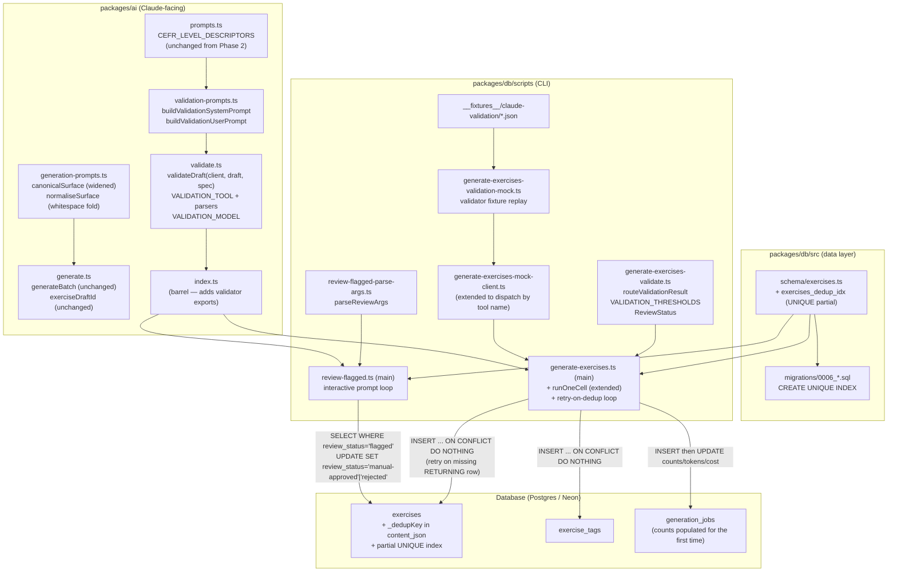
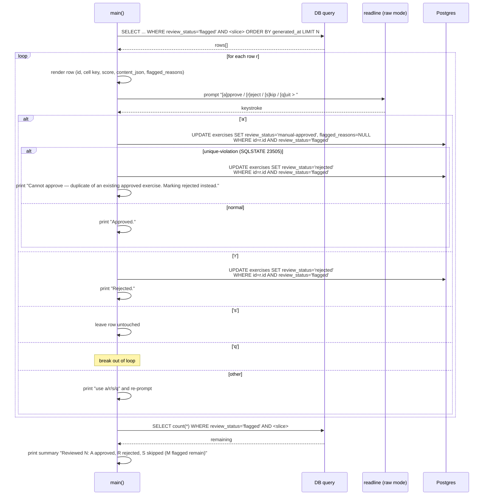

# Design Document

## Overview

This design implements **Phase 3 — Validation, dedup, review queue** from `docs/exercise-generation-plan.md` against the requirements in `requirements.md`. Phase 3 closes the trustworthiness gap left open by Phase 2: every Claude-generated draft now passes through a second-pass quality gate before insertion, surface duplicates are blocked at the storage layer, and a small interactive CLI lets a human triage the small percentage of drafts that the gate flags.

Phase 3 produces five sets of artifacts:

1. A **validator core** in `packages/ai`: `validate.ts` + `validation-prompts.ts`. Surface mirrors `evaluate.ts` + `prompts.ts`: one tool schema, one cached system block, one `validateDraft(client, draft, spec)` entry point. Validator calls run at temperature 0 (strict review) and use Claude tool use to force structured output.
2. A **routing helper** in `packages/db/scripts/`: `generate-exercises-validate.ts`. Pure function `routeValidationResult(result)` maps a `ValidationResult` to a `{ reviewStatus, flaggedReasons }` pair using the frozen thresholds from plan §3.1. Lives next to the CLI it serves.
3. A **schema migration** at `packages/db/migrations/0006_*.sql`: a `UNIQUE` partial index on `exercises (language, type, difficulty, grammar_point_key, (content_json->>'_dedupKey'))` filtered to the rows that should be unique within a cell. The Phase 2 `canonicalSurface` helper (`packages/ai/src/generation-prompts.ts:151-166`) is widened to also fold whitespace.
4. **CLI extensions** in `packages/db/scripts/generate-exercises.ts`: the existing `runOneCell` absorbs validation + routing + dedup-retry without any new flags. A new `review-flagged.ts` CLI lets a reviewer walk flagged exercises with one-keystroke approve / reject / skip / quit.
5. **Test coverage**: per-module unit tests for the validator and routing helper, an extended integration test for the CLI under `MOCK_CLAUDE=1`, and a fixture set for validator responses. One short manual smoke against real Claude.

What this phase deliberately does **not** ship: the Lambda + SQS + EventBridge wrapping (Phase 4), the Anthropic Messages Batches API path (Phase 4.2), pool-depth API (Phase 5), the Clerk-gated web admin review surface (Phase 5.3), embedding-based semantic dedup, and validators for any new exercise types (Phase 6). The validator and dedup index slot in cleanly so each later phase wraps them rather than touching them.

## Steering Document Alignment

### Technical Standards (tech.md)

- **Anthropic Claude API + tool use + `cache_control: ephemeral`** (`tech.md` §"AI / GenAI"). The validator reuses the exact pattern `evaluate.ts` and `generate.ts` already prove out — one cached system block, structured output via tool use, no free-text parsing. The cache-write/cache-read split that Phase 2 verified empirically pays off again here: the validator's system prompt is `spec`-derived (not draft-derived), so every validator call within a cell shares the same system block and gets a cache hit after the first call.
- **Cost-controlled pre-generation** (`tech.md` §7). The validator's call usage feeds through the same `addUsage` / `estimateCostUsd` pipeline from `packages/ai/src/cost-model.ts` that Phase 2 introduced. The `generation_jobs.input_tokens_used` / `output_tokens_used` / `cost_usd_estimate` columns now reflect generator + validator + retries combined; no new columns are added. The `--max-cost-usd` cap from Phase 2 is now the runtime guardrail for the combined budget.
- **Drizzle + `INSERT … ON CONFLICT DO NOTHING`** (`tech.md` §"Database"). The dedup retry path keeps the Phase 2 idempotency: the partial UNIQUE index causes the silent skip, the writer detects the missing `RETURNING { id }` row, and a regenerated draft with a bumped `batchSeed` produces a different deterministic UUID for the next attempt.
- **Forward-only migrations** (`tech.md` §5). Phase 3 adds exactly one migration: `0006_*.sql` creates the partial UNIQUE index. No columns are added; no columns are altered. The migration succeeds against the 36 hand-authored seed rows because the `WHERE` clause on the partial index ignores rows with no `_dedupKey`.
- **Shared types via `packages/shared`** (`tech.md` §"Monorepo Structure"). `ValidationResult`, `ValidateDraftResult`, and `ReviewStatus` are new types defined in `packages/ai` (validator types) and `packages/db/scripts/` (routing/CLI types). No additions to `@language-drill/shared` — the discriminated-union `ExerciseContent` stays byte-identical, and the underscore-prefixed `_dedupKey` is writer metadata, not part of the type.
- **Package boundaries.** `packages/ai` continues to own all Claude-facing knowledge (validator + validation prompts). `packages/db/scripts/` owns the routing helper and the two CLIs. The single cross-package edge from Phase 2 (`packages/db/scripts/` → `@language-drill/ai`) is the only one Phase 3 needs.

### Project Structure (no `structure.md`, but conventions verified)

- **Tests next to the module.** `validate.test.ts` and `validation-prompts.test.ts` ship in `packages/ai/src/`; `generate-exercises-validate.test.ts` and `review-flagged.test.ts` ship in `packages/db/scripts/`. No orphan `tests/` directory. Mirrors `evaluate.test.ts` next to `evaluate.ts` and Phase 2's mirror in `generate.test.ts`.
- **Fixture location.** Validator response fixtures live at `packages/db/scripts/__fixtures__/claude-validation/{cloze,translation,vocab_recall}-{approved,flagged,rejected}.json` — co-located with the integration test that loads them, alongside Phase 2's `__fixtures__/claude-generation/`.
- **CLI helpers split into single-purpose files.** Following Phase 2's split (`generate-exercises-parse-args.ts`, `generate-exercises-resolve-cells.ts`, `generate-exercises-mock-client.ts`), Phase 3 adds `generate-exercises-validate.ts` (pure routing), `generate-exercises-validation-mock.ts` (validator mock client), and the new `review-flagged.ts` + `review-flagged-parse-args.ts`. Each helper is a single concern, importable from tests without re-running `main()`.

## Code Reuse Analysis

### Existing components to leverage

- **`packages/ai/src/evaluate.ts` end-to-end pattern** (`evaluate.ts:22-272`). The validator copies this pattern beat-for-beat: typed `Anthropic.Tool` definition, separate `parse<X>Result` validator that throws on shape errors, an exported `*_TOOL_NAME` constant, an `async` function that calls `client.messages.create` with `tool_choice: { type: 'tool', name: <name> }` and one cached `system` block, then extracts the single `tool_use` block from `response.content` and runs it through the parser. Every behavior the validator wants is already proven; the new code is structurally a fork.
- **`generate.ts` cache pattern** (`packages/ai/src/generate.ts:551-566`). Same `system: [{ type: 'text', text: ..., cache_control: { type: 'ephemeral' } }]` shape — the validator's first call in a cell is a cache-write; subsequent calls in the same 5-minute window are cache-reads. The system prompt is built from `spec` only (not from draft content), so it stays byte-identical across the cell — a hard requirement for cache hits.
- **`CEFR_LEVEL_DESCRIPTORS`** (`packages/ai/src/prompts.ts:23-30`). One source of truth for level descriptors, already shared by the evaluator and generator. The validator imports the same constant — no new descriptor copy.
- **`ClaudeUsageBreakdown`, `ZERO_USAGE`, `addUsage`, `estimateCostUsd`** (`packages/ai/src/cost-model.ts:21-78`). Phase 2's cost arithmetic. The validator's per-call `tokenUsage` folds into the cell's running breakdown via `addUsage`; the cell-level `cost_usd_estimate` is recomputed by `estimateCostUsd` against the combined breakdown.
- **`canonicalSurface(content)`** (`packages/ai/src/generation-prompts.ts:151-166`). Phase 2's surface-canonicalization for `recentStems`. Phase 3 widens the underlying `normaliseSurface` helper to also fold whitespace, then reuses the same function to derive the `_dedupKey` written into `content_json` before insert. One canonical form, two purposes (in-batch dedup + across-batch dedup).
- **`generateBatch(client, spec)`** (`packages/ai/src/generate.ts:509-618`). Used unchanged for the dedup-retry path: a per-ordinal retry constructs a fresh `GenerationSpec` with `count: 1` and `batchSeed: '<seed>::retry-N'`, calls `generateBatch`, and feeds the single resulting draft back through validation + insert.
- **`exerciseDraftId(spec, ordinal)`** (`packages/ai/src/generate.ts:476-487`). The deterministic-UUID derivation already accommodates a different `batchSeed` → a different `id`. No code changes; the retry path just calls it with the bumped seed.
- **`runOneCell` skeleton** (`packages/db/scripts/generate-exercises.ts:158-336`). The Phase 2 cell-isolated try/catch + audit-row open/close + bulk insert + `failClosed` helper stay. Phase 3 inserts the validator-and-route step between `generateBatch` and the bulk INSERT, replaces the bulk INSERT with a per-draft insert + retry-on-dedup loop, and updates the audit-row UPDATE to populate the count columns that Phase 2 left at 0 / equal-to-produced.
- **`parseGenerateArgs` shape** (`packages/db/scripts/generate-exercises-parse-args.ts`). The hand-rolled `--flag value` parser pattern is reused for `review-flagged.ts`'s args via a shared `collectRawFlags` helper extracted into `parse-args-common.ts`. No third-party CLI library.
- **`createMockAnthropicClient`** (`packages/db/scripts/generate-exercises-mock-client.ts:64-163`). The fixture-replay client pattern is extended to a sibling `generate-exercises-validation-mock.ts` that returns canned `submit_validation_result` tool-use blocks. The two mocks coexist behind one `MOCK_CLAUDE=1` switch — the dispatch chooses the right canned response based on `args.tool_choice.name`.
- **`onConflictDoNothing()` Drizzle pattern** (`packages/db/scripts/generate-exercises.ts:255`). The dedup retry is built on top of this: the partial UNIQUE index causes the conflict; `RETURNING { id }` reports the silent drop; the writer counts the missing row and dispatches a retry.
- **`failClosed` helper** (`packages/db/scripts/generate-exercises.ts:304-336`). Phase 2's "the audit row exists or doesn't, update accordingly" helper is reused as-is for validator failures and dedup-retry exhaustion.
- **`dotenv-cli` + `pnpm` script wrapping** (root `package.json:11-13`). Phase 3 adds one new line for `review:flagged` with the same wrapping pattern Phase 2 used for `generate:exercises`.

### Integration points

- **`exercises` table** — schema unchanged. Phase 1's eight metadata columns + the existing `quality_score`, `flagged_reasons`, `review_status` columns are populated for the first time on auto-approved / flagged inserts.
- **`generation_jobs` table** — schema unchanged. Phase 1's count columns (`approved_count`, `flagged_count`, `rejected_count`) start being populated by `runOneCell`. The existing `input_tokens_used` / `output_tokens_used` / `cost_usd_estimate` columns now reflect generator + validator + retries combined.
- **Application read paths** — unchanged. `infra/lambda/src/lib/exercise-filters.ts:21` defines `APPROVED_STATUSES = ['auto-approved', 'manual-approved']`; `infra/lambda/src/routes/exercises.ts` and `sessions.ts` already filter on this constant. `flagged` and `rejected` rows stay invisible to learners by virtue of these filters; no API change needed.
- **The `_dedupKey` field in `content_json`** — writer-only metadata. The Lambda routes that hydrate exercises for learners select `content_json` as a JSONB blob and pass it through to the client; the underscore-prefixed field rides along harmlessly. Type guards in `@language-drill/shared` discriminate on `type`, not on the presence of unrelated fields.
- **`@language-drill/ai` package barrel** — extended in this phase to re-export `validateDraft`, `parseValidationResult`, `VALIDATION_TOOL`, `VALIDATION_TOOL_NAME`, `VALIDATION_MODEL`, `VALIDATION_MAX_TOKENS`, `VALIDATION_TEMPERATURE`, `buildValidationSystemPrompt`, `buildValidationUserPrompt`, and the types `ValidationResult`, `ValidateDraftResult`. No removals.
- **`@language-drill/db` package barrel** — unchanged. The `ReviewStatus` type and `routeValidationResult` helper live inside `packages/db/scripts/`, not inside `packages/db/src/`, so they aren't re-exported.

### Why the routing helper lives in `packages/db/scripts`, not `packages/ai`

Two competing places for `routeValidationResult`: `packages/ai/src/` (alongside the validator's `ValidationResult` type) or `packages/db/scripts/` (alongside the CLI that consumes the routed status). The design picks the latter because:

1. **The threshold values (`approveQualityFloor: 0.7`, `flagQualityFloor: 0.5`) are operational policy, not model behavior.** They get tuned based on observed approval rates, not based on Claude prompt changes. Operational policy lives next to the operator-facing CLI.
2. **The `ReviewStatus` union (`'auto-approved' | 'flagged' | 'rejected' | 'manual-approved'`) is a write-side concept.** `'manual-approved'` is set by the review CLI, never by Claude. Co-locating the union with the writers (the generator CLI + the review CLI) keeps the contract owned by the side that produces the values.
3. **Phase 4's Lambda will live in `infra/lambda/src/`, not in `packages/ai/`.** When the Lambda wraps `validateDraft` + `routeValidationResult`, it imports the validator from `@language-drill/ai` and copies the routing helper into `infra/lambda/src/lib/` (or imports it via a small new barrel from `packages/shared/src/` — that's a Phase 4 design decision). Either way, the helper is a thin pure function that doesn't need to live in the AI package.

## Architecture



The dependency graph still has exactly one cross-package edge (`packages/db/scripts` → `packages/ai`); `packages/ai` does not import from `packages/db`'s schema or scripts. The schema migration is data-only (no TypeScript dependency on either CLI).

### Per-cell sequencing inside `runOneCell` (extended)

```mermaid
sequenceDiagram
    participant CLI as main()
    participant Run as runOneCell
    participant GB as generateBatch
    participant V as validateDraft
    participant Route as routeValidationResult
    participant DB as Postgres

    CLI->>Run: spec { count: N }
    Run->>DB: INSERT generation_jobs (status='running')
    Run->>GB: generateBatch(client, spec)
    GB-->>Run: drafts[N], tokenUsage_gen
    Note over Run: combinedUsage += tokenUsage_gen
    loop for each draft d in drafts (serial)
      Run->>V: validateDraft(client, d, spec)
      V-->>Run: { result, tokenUsage_val }
      Note over Run: combinedUsage += tokenUsage_val (always — every validator call counts)
      Run->>Route: routeValidationResult(result)
      Route-->>Run: { reviewStatus, flaggedReasons }
      alt reviewStatus === 'rejected'
        Run->>Run: rejectedCount++ (terminal, no retry)
      else 'flagged' or 'auto-approved'
        Run->>Run: dedupKey = canonicalSurface(d.contentJson)
        Run->>DB: INSERT exercises (..., _dedupKey, reviewStatus, qualityScore, flaggedReasons)<br/>ON CONFLICT DO NOTHING<br/>RETURNING id
        alt RETURNING returned a row
          Run->>DB: INSERT exercise_tags (exerciseId, skillTopicId)<br/>ON CONFLICT DO NOTHING
          Run->>Run: approvedCount++ or flaggedCount++ (per reviewStatus)
        else RETURNING was empty (dedup index hit)
          loop retry attempts K = 1..3
            Run->>GB: generateBatch(client, retrySpec) where count=1, batchSeed='<seed>::retry-K'
            GB-->>Run: drafts'[1], tokenUsage_gen_retry
            Note over Run: combinedUsage += tokenUsage_gen_retry
            Run->>V: validateDraft(client, drafts'[0], spec)
            V-->>Run: { result', tokenUsage_val_retry }
            Note over Run: combinedUsage += tokenUsage_val_retry
            Run->>Route: routeValidationResult(result')
            alt result' rejected
              Note over Run: rejectedCount++; continue to next K (retry filling the slot)
            else result' flagged or auto-approved → INSERT
              alt INSERT succeeds
                Note over Run: approvedCount++ or flaggedCount++ (per result'); break retry loop
              else INSERT collides again
                Note over Run: continue to next K
              end
            end
          end
          alt all 3 retries exhausted with no successful INSERT
            Run->>Run: rejectedCount++; dedupGivenUpCount++
          end
        end
      end
    end
    Run->>DB: UPDATE generation_jobs SET status='succeeded',<br/>produced_count, approved_count, flagged_count, rejected_count,<br/>input_tokens_used, output_tokens_used, cost_usd_estimate
    Run-->>CLI: CellResult
```

Sequential per-draft within a cell. Cell-level concurrency lives unchanged in `main()` from Phase 2 (`pLimit(args.concurrency)`); the validator does not introduce a new concurrency knob.

### Per-row sequencing inside `review-flagged.ts`



## Components and Interfaces

### Component 1 — `validate.ts` (validator core)

**Purpose:** Single function `validateDraft(client, draft, spec)` plus the tool schema, parser, and model constants. Mirrors `evaluate.ts` structurally.

**File:** `packages/ai/src/validate.ts` (new)

**Interface:**

```ts
import Anthropic from '@anthropic-ai/sdk';
import type { ExerciseDraft, GenerationSpec } from './generate.js';
import type { ClaudeUsageBreakdown } from './cost-model.js';

/** Authoritative model id for the validator. Asserted equal to GENERATION_MODEL
 *  in tests so all three Claude paths (evaluator + generator + validator) move
 *  together. */
export const VALIDATION_MODEL = 'claude-sonnet-4-5' as const;

export const VALIDATION_MAX_TOKENS = 1024;

/** Strict reviewer: zero diversity, deterministic output. */
export const VALIDATION_TEMPERATURE = 0.0;

export const VALIDATION_TOOL_NAME = 'submit_validation_result';

export const VALIDATION_TOOL: Anthropic.Tool;  // shape detailed below

export type ValidationResult = {
  qualityScore: number;          // 0..1 inclusive
  ambiguous: boolean;             // multiple equally-correct answers?
  levelMatch: boolean;            // does the difficulty match the spec?
  grammarPointMatch: boolean;     // does the exercise actually test the target?
  culturalIssues: string[];       // sensitive content, stereotyping; non-empty → reject
  flaggedReasons: string[];       // free-text reasons (denormalized into exercises.flagged_reasons)
};

export type ValidateDraftResult = {
  result: ValidationResult;
  tokenUsage: ClaudeUsageBreakdown;
};

/**
 * Validates one draft via a single Claude call. Pure with respect to inputs —
 * does not mutate `draft` or `spec`. Throws on malformed Claude output (no
 * tool-use block, wrong tool name, schema-invalid input). Throws if the
 * draft's exerciseType is outside the supported set (cloze | translation |
 * vocab_recall) before any Claude request is sent.
 */
export async function validateDraft(
  client: Anthropic,
  draft: ExerciseDraft,
  spec: GenerationSpec,
): Promise<ValidateDraftResult>;

/**
 * Validates and coerces a raw tool-use input into a ValidationResult.
 * Throws field-level errors on shape mismatch.
 */
export function parseValidationResult(input: unknown): ValidationResult;
```

**Tool schema:**

```ts
export const VALIDATION_TOOL: Anthropic.Tool = {
  name: VALIDATION_TOOL_NAME,
  description:
    'Submit the structured validation result for a generated language exercise.',
  input_schema: {
    type: 'object' as const,
    properties: {
      qualityScore: {
        type: 'number',
        description:
          'Overall quality from 0.0 to 1.0. Below 0.5 will reject the draft; 0.5–0.7 will flag it for human review; >= 0.7 (with no other failures) auto-approves.',
      },
      ambiguous: {
        type: 'boolean',
        description:
          'True if more than one substantively different answer would be equally correct given the surrounding context. Cloze/vocab require exactly one correct answer; translation allows surface variation but must have one canonical meaning.',
      },
      levelMatch: {
        type: 'boolean',
        description:
          'True if the exercise sits at the requested CEFR level. False if vocabulary or grammar drifts above or below the target level.',
      },
      grammarPointMatch: {
        type: 'boolean',
        description:
          'True if the exercise actually tests the target grammar point. False if the targeting is incidental or absent.',
      },
      culturalIssues: {
        type: 'array',
        items: { type: 'string' },
        description:
          'Free-text descriptions of cultural concerns: stereotyping, sensitive content, exclusion. A single non-empty entry routes the draft to "rejected" regardless of qualityScore — this is intentional. Use sparingly.',
      },
      flaggedReasons: {
        type: 'array',
        items: { type: 'string' },
        description:
          'Free-text reasons that go into exercises.flagged_reasons when the draft routes to "flagged". Add anything that future-you would want to see when reviewing manually.',
      },
    },
    required: [
      'qualityScore',
      'ambiguous',
      'levelMatch',
      'grammarPointMatch',
      'culturalIssues',
      'flaggedReasons',
    ],
  },
};
```

**`validateDraft` body sketch:**

```ts
export async function validateDraft(
  client: Anthropic,
  draft: ExerciseDraft,
  spec: GenerationSpec,
): Promise<ValidateDraftResult> {
  // Requirement 1.8 keys off draft.contentJson.type (not spec.exerciseType).
  // In a well-formed call the two are always equal, but the requirement makes
  // the validator's guard independent of the caller's spec field — defense
  // against a spec/draft mismatch sneaking past the generator.
  if (!(draft.contentJson.type in TOOL_NAME_BY_TYPE)) {
    throw new Error(
      `Unsupported draft.contentJson.type: ${draft.contentJson.type}`,
    );
  }

  const systemText = buildValidationSystemPrompt(spec);
  const userText = buildValidationUserPrompt(draft);

  const response = await client.messages.create({
    model: VALIDATION_MODEL,
    max_tokens: VALIDATION_MAX_TOKENS,
    system: [
      {
        type: 'text' as const,
        text: systemText,
        cache_control: { type: 'ephemeral' as const },
      },
    ],
    messages: [{ role: 'user' as const, content: userText }],
    tools: [VALIDATION_TOOL],
    tool_choice: { type: 'tool' as const, name: VALIDATION_TOOL_NAME },
    temperature: VALIDATION_TEMPERATURE,
  });

  const toolUseBlock = response.content.find(
    (block): block is Anthropic.ToolUseBlock => block.type === 'tool_use',
  );
  if (!toolUseBlock) {
    throw new Error(
      `Validator did not return a tool use block. Stop reason: ${response.stop_reason}. ` +
      `Content types: ${response.content.map((b) => b.type).join(', ')}`,
    );
  }
  if (toolUseBlock.name !== VALIDATION_TOOL_NAME) {
    throw new Error(
      `Unexpected tool name: expected "${VALIDATION_TOOL_NAME}", got "${toolUseBlock.name}"`,
    );
  }

  const result = parseValidationResult(toolUseBlock.input);
  const tokenUsage = readUsage(response);  // same readUsage as generate.ts:494-502
  return { result, tokenUsage };
}
```

**`parseValidationResult` validation rules:**

- `qualityScore`: must be `typeof 'number'` AND `>= 0` AND `<= 1`.
- `ambiguous`, `levelMatch`, `grammarPointMatch`: must be `typeof 'boolean'`.
- `culturalIssues`, `flaggedReasons`: must be arrays where every element is `typeof 'string'`.
- Field-level error messages mirror `parseEvaluationResult` (`evaluate.ts:128-200`): `Invalid <field>: must be <expected>, got <JSON.stringify(value)>`.

**Dependencies:** `@anthropic-ai/sdk`, `./cost-model.js`, `./generate.js` (for `ExerciseDraft`, `GenerationSpec`, `TOOL_NAME_BY_TYPE`), `./validation-prompts.js`.

**Reuses:** Cache pattern, tool-use parsing flow, parser-throws-on-invalid pattern, `readUsage` shape — all from `evaluate.ts` / `generate.ts`.

### Component 2 — `validation-prompts.ts`

**Purpose:** Build the cached system prompt and the per-type user message for the validator. Pure functions — no I/O.

**File:** `packages/ai/src/validation-prompts.ts` (new)

**Interface:**

```ts
import {
  type CefrLevel,
  type ExerciseContent,
  ExerciseType,
  type Language,
} from '@language-drill/shared';
import type { GrammarPoint } from '@language-drill/db';
import type { ExerciseDraft, GenerationSpec } from './generate.js';
import { CEFR_LEVEL_DESCRIPTORS } from './prompts.js';

export const VALIDATION_SYSTEM_PROMPT_TEMPLATE: string;  // raw template constant for tests

/** Pure: builds the system prompt. Two calls with the same `spec` return
 *  byte-identical strings — required so prompt caching actually hits. */
export function buildValidationSystemPrompt(spec: GenerationSpec): string;

/** Pure: builds the per-draft user message. Branches on draft.contentJson.type. */
export function buildValidationUserPrompt(draft: ExerciseDraft): string;
```

**System prompt template (rendered):**

```
You are a strict reviewer of language exercises for {{language}} learners at
CEFR {{cefrLevel}}. Your job is to validate one already-generated exercise
that targets the grammar point: {{grammarPoint.name}}.

Be conservative. Reject anything ambiguous, anything mis-leveled, anything
that fails to target the configured grammar point, and anything with
cultural issues. Score on the high side only when the exercise is genuinely
unambiguous, well-leveled, and on-point.

## Routing implication of your scores

Your output is routed by these rules:
- qualityScore < 0.5  OR  any cultural issue  → REJECTED (dropped, not stored)
- qualityScore in [0.5, 0.7)                  → FLAGGED (waits for human review)
- qualityScore >= 0.7 AND not ambiguous AND levelMatch AND grammarPointMatch
                                              → AUTO-APPROVED (visible to learners)
- otherwise                                    → FLAGGED

Score conservatively — a flagged draft costs a human ~30 seconds of review;
an auto-approved bad draft corrupts the learner's progress model.

## Grammar point context

{{grammarPoint.description}}

## Positive examples

{{grammarPoint.examplesPositive — one per line}}

## Common learner errors (the exercise should expose these, not propagate them)

{{grammarPoint.commonErrors — one per line}}

## CEFR level descriptors

- **A1**: …                                    ← from CEFR_LEVEL_DESCRIPTORS
- **A2**: …
…

## Dimensions to score (one-to-one with the tool's required fields)

1. **qualityScore** (0.0–1.0): overall fitness.
2. **ambiguous** (boolean): is there more than one substantively-correct answer?
3. **levelMatch** (boolean): does the difficulty match {{cefrLevel}}?
4. **grammarPointMatch** (boolean): does this actually test {{grammarPoint.name}}?
5. **culturalIssues** (array of strings): stereotyping, sensitive content, exclusion. Empty array when none.
6. **flaggedReasons** (array of strings): anything else a reviewer should know.

## Output

You MUST use the submit_validation_result tool. Do not return plain text.
```

**Per-type user prompt (rendered):**

For `cloze`:
```
## Validate this Cloze exercise

**Spec:** language={{language}}, cefrLevel={{cefrLevel}}, grammar point={{grammarPoint.key}}
**Instructions:** {{instructions}}
**Sentence:** {{sentence}}
**Correct Answer:** {{correctAnswer}}
{{Options: ...   (when present)}}
{{Context: ...   (when present)}}

Score the dimensions in the system prompt and submit via the tool.
```

For `translation`:
```
## Validate this Translation exercise

**Spec:** language={{language}}, cefrLevel={{cefrLevel}}, grammar point={{grammarPoint.key}}
**Instructions:** {{instructions}}
**Source Text ({{sourceLanguage}}):** {{sourceText}}
**Target Language:** {{targetLanguage}}
**Reference Translation:** {{referenceTranslation}}

Score the dimensions in the system prompt and submit via the tool.
```

For `vocab_recall`:
```
## Validate this Vocabulary Recall exercise

**Spec:** language={{language}}, cefrLevel={{cefrLevel}}, grammar point={{grammarPoint.key}}
**Instructions:** {{instructions}}
**Prompt:** {{prompt}}
**Expected Word:** {{expectedWord}}
**Hints:** {{hints joined by '; '}}
**Example Sentence:** {{exampleSentence}}

Score the dimensions in the system prompt and submit via the tool.
```

The "Spec:" preamble in the user prompt is what gives the validator the independent context to judge `levelMatch` and `grammarPointMatch` — the system prompt establishes the target, the user prompt repeats the target alongside the draft so the validator can compare them in one pass.

**Dependencies:** `@language-drill/shared` (types, `ExerciseType`), `@language-drill/db` (`GrammarPoint` via `GenerationSpec`), `./prompts.js` (`CEFR_LEVEL_DESCRIPTORS`), `./generate.js` (types).

**Reuses:** `CEFR_LEVEL_DESCRIPTORS` (one source of truth across all three Claude paths). Per-type rendering shape mirrors `prompts.ts:93-153`'s evaluator user prompts.

### Component 3 — `generate-exercises-validate.ts` (routing helper)

**Purpose:** Pure function mapping a `ValidationResult` to a `(reviewStatus, flaggedReasons)` pair using the frozen Phase 3 thresholds. The single source of truth for the routing rule from plan §3.1.

**File:** `packages/db/scripts/generate-exercises-validate.ts` (new)

**Interface:**

```ts
import type { ValidationResult } from '@language-drill/ai';

export const VALIDATION_THRESHOLDS = Object.freeze({
  approveQualityFloor: 0.7,
  flagQualityFloor: 0.5,
});

export type ReviewStatus = 'auto-approved' | 'flagged' | 'rejected' | 'manual-approved';

export type RoutingDecision = {
  reviewStatus: ReviewStatus;
  flaggedReasons: string[];   // matches exercises.flagged_reasons JSONB shape
};

/**
 * Pure: routes a ValidationResult to the (reviewStatus, flaggedReasons) pair
 * the writer applies to the draft. Implements plan §3.1 exactly.
 *
 * Reasons are returned in deterministic order so test assertions are stable.
 *
 * For the REJECTED branch (qualityScore < 0.5 OR culturalIssues non-empty):
 *   1. 'low quality score (<0.5)' (only when qualityScore < 0.5)
 *   2. ...result.culturalIssues (in original order)
 *   (ambiguous / levelMatch / grammarPointMatch / result.flaggedReasons are
 *    NOT included on the rejected branch — they only matter for flagging.)
 *
 * For the FLAGGED branch (auto-approve conditions not all met, but not rejected):
 *   1. 'low quality score (<0.7)' (only when 0.5 <= qualityScore < 0.7)
 *   2. 'ambiguous' (only when result.ambiguous)
 *   3. 'level mismatch' (only when !result.levelMatch)
 *   4. 'grammar point mismatch' (only when !result.grammarPointMatch)
 *   5. ...result.flaggedReasons (in original order)
 *
 * For the AUTO-APPROVED branch: flaggedReasons is always [].
 */
export function routeValidationResult(result: ValidationResult): RoutingDecision;
```

**Implementation:**

```ts
export function routeValidationResult(result: ValidationResult): RoutingDecision {
  const reasons: string[] = [];

  // Reject branch: hard veto.
  if (result.qualityScore < VALIDATION_THRESHOLDS.flagQualityFloor) {
    reasons.push('low quality score (<0.5)');
  }
  for (const issue of result.culturalIssues) {
    reasons.push(issue);
  }
  if (reasons.length > 0) {
    return { reviewStatus: 'rejected', flaggedReasons: reasons };
  }

  // Auto-approve branch: every condition must hold.
  const approves =
    result.qualityScore >= VALIDATION_THRESHOLDS.approveQualityFloor &&
    !result.ambiguous &&
    result.levelMatch &&
    result.grammarPointMatch &&
    result.culturalIssues.length === 0;

  if (approves) {
    return { reviewStatus: 'auto-approved', flaggedReasons: [] };
  }

  // Flag branch: collect every failed condition in deterministic order.
  if (result.qualityScore < VALIDATION_THRESHOLDS.approveQualityFloor) {
    reasons.push('low quality score (<0.7)');
  }
  if (result.ambiguous) reasons.push('ambiguous');
  if (!result.levelMatch) reasons.push('level mismatch');
  if (!result.grammarPointMatch) reasons.push('grammar point mismatch');
  for (const r of result.flaggedReasons) {
    reasons.push(r);
  }
  return { reviewStatus: 'flagged', flaggedReasons: reasons };
}
```

`'manual-approved'` is intentionally not produced by `routeValidationResult` — that value comes only from the review CLI in Component 6.

**Dependencies:** `@language-drill/ai` (the `ValidationResult` type only; the helper does not import `Anthropic`).

**Reuses:** Frozen-constants pattern from `cost-model.ts:21` and `generate.ts:56-62`.

### Component 4 — Schema migration + `canonicalSurface` widening

**Purpose:** Enforce across-batch surface dedup at the database layer; widen the canonicalization to fold whitespace so trivial differences don't defeat the index.

**Files:**

- `packages/db/src/schema/exercises.ts` (modified)
- `packages/db/migrations/0006_*.sql` (new — name generated by Drizzle)
- `packages/ai/src/generation-prompts.ts` (modified — `normaliseSurface` widening only)

**Schema change in `packages/db/src/schema/exercises.ts`:**

```ts
import { uniqueIndex } from 'drizzle-orm/pg-core';

export const exercises = pgTable(
  'exercises',
  {
    /* ... existing columns unchanged ... */
  },
  (table) => ({
    poolLookupIdx: index('exercises_pool_lookup_idx')
      .on(table.language, table.difficulty, table.type, table.grammarPointKey)
      .where(sql`${table.reviewStatus} IN ('auto-approved', 'manual-approved')`),
    // New in Phase 3:
    dedupIdx: uniqueIndex('exercises_dedup_idx')
      .on(
        table.language,
        table.type,
        table.difficulty,
        table.grammarPointKey,
        sql`(content_json->>'_dedupKey')`,
      )
      .where(
        sql`${table.reviewStatus} IN ('auto-approved', 'manual-approved', 'flagged') AND content_json ? '_dedupKey'`,
      ),
  }),
);
```

The `content_json ? '_dedupKey'` clause excludes the 36 hand-authored seed rows (which have no `_dedupKey`) from the uniqueness constraint, so the migration applies cleanly without a data fix. New auto-approved / flagged inserts always set `_dedupKey`, so they participate in the constraint.

**Generated migration (`packages/db/migrations/0006_*.sql`):**

```sql
CREATE UNIQUE INDEX "exercises_dedup_idx"
  ON "exercises" USING btree (
    "language",
    "type",
    "difficulty",
    "grammar_point_key",
    (content_json->>'_dedupKey')
  )
  WHERE "exercises"."review_status" IN ('auto-approved', 'manual-approved', 'flagged')
    AND content_json ? '_dedupKey';
```

`CREATE UNIQUE INDEX CONCURRENTLY` is preferred but Drizzle's migration generator does not currently emit `CONCURRENTLY` for `uniqueIndex`. The non-concurrent form is acceptable for the dev branch (low row count); for the production branch the operator must manually edit the migration file to add `CONCURRENTLY` before applying. The implementer SHALL leave a one-line `-- TODO(prod): change to CREATE UNIQUE INDEX CONCURRENTLY when running on the production branch.` comment at the top of `packages/db/migrations/0006_*.sql`, AND SHALL add this manual step to the Phase 3 tasks.md as an explicit checklist item so the next operator running migrations against production knows to perform it.

**`normaliseSurface` widening in `packages/ai/src/generation-prompts.ts`:**

Phase 2 implementation (lines 144-149):
```ts
function normaliseSurface(text: string): string {
  return text
    .toLowerCase()
    .normalize('NFKD')
    .replace(/\p{Diacritic}+/gu, '');
}
```

Phase 3 widening:
```ts
function normaliseSurface(text: string): string {
  return text
    .toLowerCase()
    .normalize('NFKD')
    .replace(/\p{Diacritic}+/gu, '')
    .replace(/\s+/gu, ' ')   // collapse whitespace runs
    .trim();                  // strip leading/trailing whitespace
}
```

`canonicalSurface` (the public function at lines 151-166) is unchanged — it just delegates to `normaliseSurface`. Every existing caller (`recentStems` accumulation in `generate.ts:593-596`, the `inBatchDuplicate` marker logic) inherits the widened behavior.

**Why include `'flagged'` in the partial-index `WHERE` clause:**

The partial index covers `'auto-approved' | 'manual-approved' | 'flagged'`. This is intentional and load-bearing for Requirement 6.10:

- Including `'flagged'` means a flagged duplicate of an already-approved row is *blocked at insert time* — the Phase 3 generator will skip it via the dedup-retry path before it ever appears in the review queue.
- Including `'flagged'` also means flipping a flagged row to `manual-approved` cannot collide with itself (it stays inside the `WHERE` clause), but **can** collide with a separate `auto-approved` row already in the cell — exactly the case Requirement 6.10's catch-and-demote handles.
- Including `'manual-approved'` means a row entering the constraint set via the review CLI's UPDATE path is checked against the index just like a writer-driven INSERT. The `runOneCell` writer never inserts `'manual-approved'` directly (it only writes `'auto-approved'` or `'flagged'`); `'manual-approved'` enters the index exclusively through `tryApprove`'s UPDATE in Component 6, which is the path Requirement 6.10's `23505` catch wraps.
- Excluding `'rejected'` means rejected rows can pile up freely without triggering false uniqueness conflicts. The audit value of keeping rejected rows around (per Requirement 6.5) is preserved.

**Dependencies:** Drizzle `uniqueIndex` import; no new runtime dependency.

**Reuses:** Existing `index()` declaration pattern from `exercises.ts:27`; the `WHERE` clause idiom from `exercises_pool_lookup_idx`.

### Component 5 — `runOneCell` extension

**Purpose:** Wire the validator + routing + dedup-retry into the existing Phase 2 cell-runner without changing the function's outer contract (cell-isolated try/catch, audit-row open/close, summary printing). New behavior is internal to the function body.

**File:** `packages/db/scripts/generate-exercises.ts` (modified)

**Changed `CellResult` type:**

```ts
export type CellResult = {
  cell: Cell;
  jobId: string;
  status: 'succeeded' | 'failed' | 'skipped-cost-cap';
  insertedCount: number;          // rows that survived dedup AND validation (was: every successful generateBatch result)
  skippedCount: number;           // dedup-collisions on the FIRST attempt only (per-ordinal granularity preserved)
  tokenUsage: ClaudeUsageBreakdown;  // generator + validator + retries combined
  costUsd: number;                // estimateCostUsd(tokenUsage)
  errorMessage?: string;
  durationMs: number;
  inBatchDuplicateCount: number;  // unchanged from Phase 2
  // New in Phase 3:
  validatedCount: number;         // every draft that hit the validator (incl. retries)
  flaggedCount: number;           // 'flagged' rows inserted
  rejectedCount: number;          // every routed-rejected + every retry-given-up
  dedupGivenUpCount: number;      // ordinals where all 3 retries collided or all rejected
};
```

**`runOneCell` body — new flow:**

```ts
export async function runOneCell(
  db: Db,
  client: Anthropic,
  cell: Cell,
  args: ParsedArgs,
): Promise<CellResult> {
  const startedAt = Date.now();
  const jobId = randomUUID();
  assertValidCellKey(cell.cellKey);

  // -- Skill-topic precheck (unchanged from Phase 2) ----------------------
  const skillTopicId = deterministicUuid(`skill-topic:${cell.grammarPoint.key}`);
  const skillTopicRows = await db.select(...).where(eq(skillTopics.id, skillTopicId)).limit(1);
  if (skillTopicRows.length === 0) {
    return failClosed({ /* ... existing fail-fast path ... */ });
  }

  // -- Open audit row -----------------------------------------------------
  await db.insert(generationJobs).values({
    id: jobId, cellKey: cell.cellKey, requestedCount: args.count,
    status: 'running', trigger: 'cli',
  });

  const spec: GenerationSpec = { /* ... derive from cell + args ... */ };
  let combinedUsage: ClaudeUsageBreakdown = ZERO_USAGE;
  let producedCount = 0, approvedCount = 0, flaggedCount = 0, rejectedCount = 0;
  let validatedCount = 0, dedupGivenUpCount = 0;
  let insertedCount = 0, firstAttemptSkippedCount = 0, inBatchDuplicateCount = 0;
  const generatedAt = new Date();

  try {
    // 1. Generate the initial batch.
    const batch = await generateBatch(client, spec);
    if (aborted) throw new Error('Aborted by user (SIGINT)');
    combinedUsage = addUsage(combinedUsage, batch.tokenUsage);
    producedCount += batch.drafts.length;
    inBatchDuplicateCount = batch.drafts.filter((d) => d.metadata.inBatchDuplicate).length;

    // 2. For each draft, validate → route → insert (with retry on dedup hit).
    for (let ordinal = 0; ordinal < batch.drafts.length; ordinal++) {
      const draft = batch.drafts[ordinal];
      if (aborted) throw new Error('Aborted by user (SIGINT)');

      const outcome = await validateAndInsertWithRetry({
        db, client, spec, draft, ordinal, cell, args, generatedAt,
      });

      combinedUsage = addUsage(combinedUsage, outcome.extraUsage);
      producedCount += outcome.extraProduced;
      validatedCount += outcome.validatedCount;
      switch (outcome.terminalStatus) {
        case 'inserted-approved': approvedCount++; insertedCount++; break;
        case 'inserted-flagged':  flaggedCount++; insertedCount++; break;
        case 'rejected':           rejectedCount++; break;
        case 'dedup-given-up':     dedupGivenUpCount++; rejectedCount++;
                                   firstAttemptSkippedCount++; break;
        case 'first-attempt-dedup-then-success':
                                   firstAttemptSkippedCount++;
                                   if (outcome.terminalReviewStatus === 'auto-approved') {
                                     approvedCount++; insertedCount++;
                                   } else { flaggedCount++; insertedCount++; }
                                   break;
      }
    }
  } catch (err) {
    // Cell-level failure: close audit row, return failed CellResult.
    return failClosed({ /* same as Phase 2, plus pass combinedUsage */ });
  }

  // 3. Close audit row with the new counts.
  const costUsd = estimateCostUsd(combinedUsage);
  const totalInputTokens = combinedUsage.inputTokens
    + combinedUsage.cacheCreationInputTokens
    + combinedUsage.cacheReadInputTokens;

  await db.update(generationJobs)
    .set({
      status: 'succeeded',
      finishedAt: new Date(),
      producedCount, approvedCount, flaggedCount, rejectedCount,
      inputTokensUsed: totalInputTokens,
      outputTokensUsed: combinedUsage.outputTokens,
      costUsdEstimate: costUsd.toFixed(4),
    })
    .where(eq(generationJobs.id, jobId));

  return {
    cell, jobId, status: 'succeeded',
    insertedCount, skippedCount: firstAttemptSkippedCount,
    tokenUsage: combinedUsage, costUsd,
    durationMs: Date.now() - startedAt,
    inBatchDuplicateCount,
    validatedCount, flaggedCount, rejectedCount, dedupGivenUpCount,
  };
}
```

**`validateAndInsertWithRetry` (new helper inside `generate-exercises.ts`):**

```ts
type DraftOutcome = {
  terminalStatus:
    | 'inserted-approved'
    | 'inserted-flagged'
    | 'rejected'
    | 'first-attempt-dedup-then-success'
    | 'dedup-given-up';
  terminalReviewStatus?: 'auto-approved' | 'flagged';
  extraUsage: ClaudeUsageBreakdown;        // generator + validator usage from retries (not the original)
  extraProduced: number;                    // additional drafts Claude produced via retries
  validatedCount: number;                   // 1 (original) + N (retry attempts that ran the validator)
};

async function validateAndInsertWithRetry(opts: {
  db: Db; client: Anthropic; spec: GenerationSpec;
  draft: ExerciseDraft; ordinal: number; cell: Cell;
  args: ParsedArgs; generatedAt: Date;
}): Promise<DraftOutcome> {
  const MAX_RETRIES = 3;
  let extraUsage = ZERO_USAGE;
  let extraProduced = 0;
  let validatedCount = 0;

  // Attempt 0 = original draft from generateBatch.
  let currentDraft = opts.draft;
  let firstAttemptDeduped = false;

  for (let attempt = 0; attempt <= MAX_RETRIES; attempt++) {
    if (aborted) throw new Error('Aborted by user (SIGINT)');

    // Validate. ALL validator usage (including attempt 0) is folded into
    // extraUsage — the caller only folds the *generator*'s batch.tokenUsage,
    // never the validator's. Dropping this addUsage call would silently lose
    // every first-attempt validator call's tokens (~50 calls × 1K input + 200
    // output for a typical 50-draft cell).
    const { result, tokenUsage: valUsage } = await validateDraft(
      opts.client, currentDraft, opts.spec,
    );
    extraUsage = addUsage(extraUsage, valUsage);
    validatedCount++;

    const decision = routeValidationResult(result);
    if (decision.reviewStatus === 'rejected') {
      // Retry only when we're trying to fill a dedup slot; otherwise the rejection is terminal.
      if (firstAttemptDeduped && attempt < MAX_RETRIES) {
        const retryResult = await runRetryGeneration(opts, attempt + 1);
        currentDraft = retryResult.draft;
        extraUsage = addUsage(extraUsage, retryResult.usage);
        extraProduced += 1;
        continue;
      }
      return firstAttemptDeduped
        ? { terminalStatus: 'dedup-given-up', extraUsage, extraProduced, validatedCount }
        : { terminalStatus: 'rejected', extraUsage, extraProduced, validatedCount };
    }

    // 'auto-approved' or 'flagged' → attempt INSERT.
    const dedupKey = canonicalSurface(currentDraft.contentJson);
    const contentWithKey = { ...currentDraft.contentJson, _dedupKey: dedupKey };
    const inserted = await opts.db.insert(exercises).values({
      id: currentDraft.id,
      type: opts.cell.exerciseType,
      language: opts.cell.language,
      difficulty: opts.cell.cefrLevel,
      contentJson: contentWithKey,
      grammarPointKey: opts.cell.grammarPoint.key,
      topicDomain: opts.args.topicDomain,
      generationSource: 'claude-realtime' as const,
      modelId: GENERATION_MODEL,
      reviewStatus: decision.reviewStatus,
      qualityScore: result.qualityScore,
      flaggedReasons: decision.flaggedReasons.length > 0 ? decision.flaggedReasons : null,
      generatedAt: opts.generatedAt,
    }).onConflictDoNothing().returning({ id: exercises.id });

    if (inserted.length > 0) {
      // Tag insert (PK covers re-runs).
      const skillTopicId = deterministicUuid(`skill-topic:${opts.cell.grammarPoint.key}`);
      await opts.db.insert(exerciseTags)
        .values({ exerciseId: currentDraft.id, skillTopicId })
        .onConflictDoNothing();

      const terminalStatus = firstAttemptDeduped
        ? ('first-attempt-dedup-then-success' as const)
        : (decision.reviewStatus === 'auto-approved'
            ? ('inserted-approved' as const)
            : ('inserted-flagged' as const));
      return {
        terminalStatus,
        terminalReviewStatus: decision.reviewStatus,
        extraUsage, extraProduced, validatedCount,
      };
    }

    // INSERT was a no-op: dedup-index conflict.
    firstAttemptDeduped = true;
    if (attempt < MAX_RETRIES) {
      const retryResult = await runRetryGeneration(opts, attempt + 1);
      currentDraft = retryResult.draft;
      extraUsage = addUsage(extraUsage, retryResult.usage);
      extraProduced += 1;
    }
  }

  // All MAX_RETRIES attempts collided.
  return { terminalStatus: 'dedup-given-up', extraUsage, extraProduced, validatedCount };
}

async function runRetryGeneration(
  opts: { client: Anthropic; spec: GenerationSpec },
  retryN: number,
): Promise<{ draft: ExerciseDraft; usage: ClaudeUsageBreakdown }> {
  const retrySpec: GenerationSpec = {
    ...opts.spec,
    count: 1,
    batchSeed: `${opts.spec.batchSeed}::retry-${retryN}`,
  };
  const result = await generateBatch(opts.client, retrySpec);
  return { draft: result.drafts[0], usage: result.tokenUsage };
}
```

**Summary print extension (`printSummary` in `generate-exercises.ts`):**

The per-cell line gains four new fields after the existing token / cost / duration:

```
[ES B1 cloze es-b1-present-subjunctive] 50 drafts → 47 inserted (44 approved, 3 flagged, 2 rejected, 1 dedup-given-up) — 73,420 input (54,200 cached) / 19,840 output tokens — $0.27 — 2m41s — succeeded
```

Total summary gains a "Validation outcomes" block:

```
═══ Total ═══
Cells: 18 (17 succeeded, 1 failed)
Drafts inserted: 850 (812 approved, 38 flagged)
Validation outcomes: 18 rejected, 6 dedup-given-up
Total input tokens: ...  (unchanged shape)
...
```

**Dependencies:** All new helper functions are private to `generate-exercises.ts`. Imports added: `validateDraft`, `ValidateDraftResult`, `ValidationResult` from `@language-drill/ai`; `routeValidationResult`, `ReviewStatus` from `./generate-exercises-validate.js`; `canonicalSurface` from `@language-drill/ai`.

**Reuses:** Phase 2's `failClosed` (`generate-exercises.ts:304-336`), `aborted` flag (`generate-exercises.ts:90-91`), `pLimit` (`generate-exercises.ts:344-369`), audit-row INSERT/UPDATE pattern.

### Component 6 — `review-flagged.ts` (review CLI)

**Purpose:** Walk the flagged-exercise queue interactively. Single-keystroke approve / reject / skip / quit.

**Files:**

- `packages/db/scripts/review-flagged.ts` (new — `main()` orchestration + DB writes + interactive prompt)
- `packages/db/scripts/review-flagged-parse-args.ts` (new — pure)
- `packages/db/scripts/review-flagged.test.ts` (new — co-located tests)

**`parseReviewArgs(argv: string[]): ReviewArgs` (pure):**

```ts
import type { ExerciseType, LearningLanguage } from '@language-drill/shared';
import type { CurriculumCefrLevel } from '../src/curriculum';

export type ReviewArgs = {
  lang: LearningLanguage;                    // required, one of ES|DE|TR
  level: CurriculumCefrLevel | null;         // optional
  type: ExerciseType | null;                 // optional
  grammarPoint: string | null;               // optional
  limit: number;                             // default 20, range [1, 200]
  allowProd: boolean;
};

/** Throws on invalid input; returns help text + exits 0 on `--help`. */
export function parseReviewArgs(argv: readonly string[]): ReviewArgs;
```

The parser reuses the `collectRawFlags` helper extracted from Phase 2's `generate-exercises-parse-args.ts`. To avoid duplicating it, Phase 3 lifts `collectRawFlags`, `requireString`, and the `BOOLEAN_FLAGS` set into a new `parse-args-common.ts` shared by both arg-parser files. (This is a small refactor; Phase 2's existing tests for `parseGenerateArgs` continue to pass unchanged because the public surface of `parseGenerateArgs` doesn't change.)

**`main()` flow:**

```ts
async function main(
  argv: readonly string[] = process.argv.slice(2),
  stdinSource: ReadableStream | NodeJS.ReadStream = process.stdin,
): Promise<void> {
  const args = parseReviewArgs(argv);

  if (process.env['NODE_ENV'] === 'production' && !args.allowProd) {
    fail('Refusing to run in production. Pass --allow-prod or use the Phase 5 admin UI.');
  }

  const db = createDb(requireEnv('DATABASE_URL'));

  // 1. Pull the flagged slice.
  const rows = await selectFlaggedRows(db, args);
  if (rows.length === 0) {
    process.stdout.write('No flagged exercises in this slice.\n');
    return;
  }

  // 2. Walk them interactively.
  const counts = { approved: 0, rejected: 0, skipped: 0 };
  const reader = createKeystrokeReader(stdinSource);

  outer: for (const row of rows) {
    renderRow(row);
    while (true) {
      process.stdout.write('[a]pprove / [r]eject / [s]kip / [q]uit > ');
      const key = await reader.next();
      if (key === 'a') {
        const ok = await tryApprove(db, row);
        if (ok === 'approved') {
          process.stdout.write('Approved.\n');
          counts.approved++;
        } else {
          process.stdout.write(
            'Cannot approve — duplicate of an existing approved exercise in this cell. Marking rejected instead.\n',
          );
          counts.rejected++;
        }
        break;
      } else if (key === 'r') {
        await rejectRow(db, row);
        process.stdout.write('Rejected.\n');
        counts.rejected++;
        break;
      } else if (key === 's') {
        counts.skipped++;
        break;
      } else if (key === 'q') {
        break outer;
      } else {
        process.stdout.write('use a/r/s/q\n');
      }
    }
  }

  // 3. Print final summary + remaining count.
  const remaining = await countFlagged(db, args);
  printReviewSummary(counts, rows.length, remaining);
}
```

**`tryApprove(db, row)` (handles Requirement 6.10):**

```ts
async function tryApprove(db: Db, row: FlaggedRow): Promise<'approved' | 'demoted'> {
  try {
    await db.update(exercises)
      .set({ reviewStatus: 'manual-approved', flaggedReasons: null })
      .where(and(eq(exercises.id, row.id), eq(exercises.reviewStatus, 'flagged')));
    return 'approved';
  } catch (err) {
    if (isUniqueViolation(err)) {
      await db.update(exercises)
        .set({ reviewStatus: 'rejected' })
        .where(and(eq(exercises.id, row.id), eq(exercises.reviewStatus, 'flagged')));
      return 'demoted';
    }
    throw err;
  }
}

function isUniqueViolation(err: unknown): boolean {
  if (err instanceof Error && 'code' in err) {
    return (err as { code: string }).code === '23505';
  }
  return false;
}
```

**`createKeystrokeReader(source)`:** thin wrapper over Node's `readline` in raw mode. In production, `source = process.stdin` and `readline.emitKeypressEvents(stdin); stdin.setRawMode(true)`. In tests, `source` is an injected `Readable` whose `data` events are pushed by the test (see Component 8).

**`renderRow(row)`:**

```
─── 41a8c2e0-... ───  ES B1 cloze es-b1-present-subjunctive  qualityScore=0.62
{
  "type": "cloze",
  "instructions": "Fill in the blank with the correct subjunctive form.",
  "sentence": "Espero que ___ a tiempo.",
  "correctAnswer": "llegues"
}
Flagged reasons:
  - low quality score (<0.7)
  - level mismatch
```

`_dedupKey` is excluded from the rendered JSON (it's writer metadata; reviewers shouldn't see it).

**`selectFlaggedRows(db, args)`:** Drizzle query over `exercises` with the slice filters built from `args`. Uses `eq()` / `and()` / `inArray()` — no raw SQL. ORDER BY `generated_at ASC`, LIMIT `args.limit`.

**Dependencies:** `@language-drill/db` (schema, client, deterministic-uuid not needed here), `drizzle-orm` (`and`, `eq`), `node:readline`. No third-party CLI library.

**Reuses:** `createDb` (`packages/db/src/client.ts:15`), `requireEnv` (extracted to a tiny shared util — same shape as `generate-exercises.ts:113-119`), `failClosed` patterns, `dotenv-cli` script wrapping pattern.

### Component 7 — Mock client for validator + fixture set

**Purpose:** Let integration tests run the full Phase 3 pipeline (generator → validator → router → DB) without contacting Claude.

**Files:**

- `packages/db/scripts/generate-exercises-validation-mock.ts` (new — fixture replay for the validator)
- `packages/db/scripts/generate-exercises-mock-client.ts` (modified — dispatch by `tool_choice.name`)
- `packages/db/scripts/__fixtures__/claude-validation/{cloze,translation,vocab_recall}-{approved,flagged,rejected}.json` (new — 9 fixture files)

**Dispatch logic in `generate-exercises-mock-client.ts`:**

The Phase 2 mock client (lines 86-158) reverse-looks-up `ExerciseType` from `args.tool_choice.name`. Phase 3 widens this to also recognize `VALIDATION_TOOL_NAME = 'submit_validation_result'` and route to the validator-fixture loader.

```ts
// Pseudo-diff:
const create = async (args) => {
  const toolChoice = args.tool_choice;
  // ... existing validation ...

  if (toolChoice.name === VALIDATION_TOOL_NAME) {
    return mockValidationResponse(args);  // delegates to validation mock
  }

  // ... existing generator-tool branch ...
};
```

**Fixture file shape (e.g. `cloze-approved.json`):**

```json
{
  "qualityScore": 0.85,
  "ambiguous": false,
  "levelMatch": true,
  "grammarPointMatch": true,
  "culturalIssues": [],
  "flaggedReasons": []
}
```

**Validator fixture rotation:**

The integration test scripts the desired routing outcome by setting an env var per-call. The simplest mechanism: the mock validator inspects the user-message body it just received, extracts the draft's content's `_dedupKey`-stripped surface, and looks up which fixture to return from a `MOCK_VALIDATION_OUTCOMES` env var (a JSON object mapping ordinal → outcome name). For example:

```
MOCK_VALIDATION_OUTCOMES='{"0":"approved","1":"flagged","2":"rejected"}' MOCK_CLAUDE=1 ...
```

This is the same general pattern Phase 2's mock uses (per-type counter cycling); the validator mock adds env-var-driven outcome selection so a single test can drive all three routing branches without per-fixture juggling.

**Dependencies:** `@language-drill/ai` (for `VALIDATION_TOOL_NAME`); same Anthropic SDK shape as the Phase 2 mock.

**Reuses:** Token-usage shape from Phase 2 mock (`generate-exercises-mock-client.ts:115-135`) — first call is a cache-write, subsequent are cache-reads. Validator's first call in a cell is itself a cache-write (separate from generator's), so the mock returns cache-write usage for the first validator call AND for the first generator call independently.

### Component 8 — Updated package barrel + scripts

**Files:**

- `packages/ai/src/index.ts` (modified)
- `packages/db/package.json` (modified)
- root `package.json` (modified)

**`packages/ai/src/index.ts` — add:**

```ts
export {
  validateDraft,
  parseValidationResult,
  VALIDATION_TOOL,
  VALIDATION_TOOL_NAME,
  VALIDATION_MODEL,
  VALIDATION_MAX_TOKENS,
  VALIDATION_TEMPERATURE,
} from './validate.js';
export type { ValidationResult, ValidateDraftResult } from './validate.js';
export {
  buildValidationSystemPrompt,
  buildValidationUserPrompt,
  VALIDATION_SYSTEM_PROMPT_TEMPLATE,
} from './validation-prompts.js';
```

**`packages/db/package.json` — add:**

```json
"scripts": {
  "review:flagged": "npx tsx scripts/review-flagged.ts"
}
```

**Root `package.json` — add:**

```json
"scripts": {
  "review:flagged": "dotenv -e .env -- pnpm --filter @language-drill/db review:flagged"
}
```

This mirrors the existing `generate:exercises` / `db:generate:exercises` pair from Phase 2.

### Component 9 — Tests

**`packages/ai/src/validate.test.ts` (new) — covers Requirement 7.1:**

Mocked-SDK pattern from `evaluate.test.ts:283-337`. Per case:

- (a) Happy path: a successful tool-use response produces a parsed `ValidationResult`; the call args contain the validator's `model`, `temperature`, `max_tokens`, `tool_choice`, and the cached `system` block.
- (b) `validateDraft` with `draft.contentJson.type` set to something not in `TOOL_NAME_BY_TYPE` (constructed by spreading a real `ClozeContent` and setting `type` to e.g. `'unknown'` cast through `as ExerciseType`) throws before `mockCreate` is called. Asserts the guard keys off `draft.contentJson.type`, not `spec.exerciseType`.
- (c) Three malformed-response cases (mirror of `evaluate.test.ts:339-401`): no tool-use block → throws with `stop_reason` in message; wrong tool name → throws with the unexpected name in message; tool input fails the parser (e.g. `qualityScore = 1.5`) → throws.
- (d) `parseValidationResult` rejects: non-object input; `qualityScore` `'not a number'`, `-0.1`, `1.1`; non-array `culturalIssues`; non-string array element; missing required fields.
- (e) Cross-file model invariant (Requirement 8.5): `expect(VALIDATION_MODEL).toBe(GENERATION_MODEL)` AND `expect(VALIDATION_MODEL).toBe('claude-sonnet-4-5')`.
- (f) `validateDraft` does not mutate `draft` or `spec` (deep-equal before/after).
- (g) Token usage extraction: `tokenUsage` reflects the SDK's usage breakdown with all four tiers populated.

**`packages/ai/src/validation-prompts.test.ts` (new) — covers Requirement 7.2:**

- Two calls with the same `spec` produce byte-identical strings (cache-friendly).
- The system prompt contains the chosen grammar point's `name`, `description`, every `examplesPositive` entry, every `commonErrors` entry verbatim.
- The system prompt contains the B1 descriptor verbatim from `CEFR_LEVEL_DESCRIPTORS` (DRY invariant — the same assertion shape Phase 2 uses for the generator prompt).
- Per-type user prompt includes every documented field for cloze, translation, vocab_recall.
- The system prompt contains the routing-implication block (the rules from plan §3.1) verbatim — this is what gives Claude the calibration context.

**`packages/db/scripts/generate-exercises-validate.test.ts` (new) — covers Requirement 7.3:**

- `qualityScore = 0.4` → `rejected` with `'low quality score (<0.5)'` reason.
- `qualityScore = 0.9, culturalIssues = ['stereotyping']` → `rejected` with `['low quality score (<0.5)']` excluded (score is fine), `['stereotyping']` included as the reason.
- `qualityScore = 0.85` AND all booleans true AND empty `culturalIssues` → `auto-approved` with empty reasons.
- `qualityScore = 0.6` AND all booleans true → `flagged` with `['low quality score (<0.7)']`.
- `qualityScore = 0.8, ambiguous = true` → `flagged` with `['ambiguous']`.
- `qualityScore = 0.8, levelMatch = false` → `flagged` with `['level mismatch']`.
- `qualityScore = 0.8, grammarPointMatch = false` → `flagged` with `['grammar point mismatch']`.
- Multiple failures combine deterministically: `qualityScore = 0.6, ambiguous = true, levelMatch = false` → `flagged` with `['low quality score (<0.7)', 'ambiguous', 'level mismatch']` in exact order.
- `flaggedReasons` from the `ValidationResult` is appended to the routed reasons in original order.

**`packages/db/scripts/generate-exercises.test.ts` (extended) — covers Requirement 7.4:**

The existing Phase 2 tests stay unchanged. New tests added at the end of the file:

- **Pure planning tests (always run):** `validateAndInsertWithRetry` happy path with a stubbed-out `validateDraft` and `generateBatch` (no DB) returning `'auto-approved'` → returns `terminalStatus: 'inserted-approved'`. (Note: this test stubs the DB-write methods on a `Db`-shaped mock; pure in the sense that no Postgres is reached.)
- **DB-touching tests (`describe.skipIf(!process.env.TEST_DATABASE_URL)`):**
  - With `MOCK_CLAUDE=1` and `MOCK_VALIDATION_OUTCOMES='{"0":"approved","1":"flagged","2":"rejected"}'`, run `main()` for `--lang es --level B1 --type cloze --grammar-point es-b1-present-subjunctive --count 3`. Assert:
    - 2 rows in `exercises`: one with `review_status='auto-approved'`, `quality_score` set, `flagged_reasons=NULL`; one with `review_status='flagged'`, `quality_score` set, `flagged_reasons` non-null.
    - 0 rows in `exercises` for the rejected ordinal.
    - The `generation_jobs` row's `produced_count=3`, `approved_count=1`, `flagged_count=1`, `rejected_count=1`.
    - `cost_usd_estimate` reflects 3 generator calls + 3 validator calls.
    - **Token-totals assertion (regression guard):** `output_tokens_used === expectedGeneratorOutput + 3 * expectedValidatorOutput`. The Phase 2 mock client returns deterministic per-call token counts (`generate-exercises-mock-client.ts:115-135`); the validator mock should mirror the same shape. This assertion would catch the class of bug where attempt-0 validator usage is silently dropped from `combinedUsage`.
  - **Dedup-retry path:** seed the dev DB with one approved row whose `_dedupKey` matches the canonical surface of `cloze-approved.json` ordinal 0. With a fixture that produces a *different* surface on retry attempt 1 (e.g. `cloze-approved-retry-1.json`), assert that ordinal 0 first hits the dedup index, then succeeds on attempt 1, and the audit row reports `produced_count=4` (3 originals + 1 retry), `approved_count=3`, `firstAttemptSkippedCount` reflected in the summary.
  - **Dedup-given-up path:** seed three approved rows whose `_dedupKey`s match three retry fixtures. Assert ordinal 0's `dedup-given-up` outcome: 0 rows inserted for that ordinal, `produced_count=6` (3 originals + 3 retries), `rejected_count=1`, `dedupGivenUpCount=1` in the `CellResult`.
- **Validator-failure path:** with a mock that throws on the first validator call, assert `runOneCell` returns `status: 'failed'`, the audit row's `error_message` mentions the validator failure, and 0 rows are inserted into `exercises` for the cell.

**`packages/db/scripts/review-flagged.test.ts` (new) — covers Requirement 7.5:**

Test infrastructure: a small `createTestStdin()` helper that returns a `Readable` plus a `push(key)` method so tests can drive the prompt loop synchronously.

- **DB-touching tests (`describe.skipIf(!process.env.TEST_DATABASE_URL)`):**
  - Seed three flagged rows. Drive stdin with `a r s` (and let the loop end). Assert:
    - row 0: `review_status='manual-approved'`, `flagged_reasons=NULL`.
    - row 1: `review_status='rejected'`, `flagged_reasons` preserved.
    - row 2: `review_status='flagged'` (untouched).
    - `counts = { approved: 1, rejected: 1, skipped: 1 }`.
  - Drive stdin with `q` immediately. Assert no row was modified; summary shows `Reviewed 0 (0 approved, 0 rejected, 0 skipped) (3 flagged remain in this slice — re-run to continue)`.
  - Drive stdin with `x a` (unknown key, then approve). Assert the unknown-key branch re-prompts, then approve fires correctly.
  - Drive stdin with `a` against a flagged row whose canonical surface duplicates an approved row in the same cell. Assert the unique-violation is caught, the row is demoted to `rejected`, and the user-facing message is printed.
  - Production guard: with `NODE_ENV=production` and no `--allow-prod`, the script exits non-zero before touching the DB.
- **Pure planning tests (always run):**
  - `parseReviewArgs(['--lang','es','--limit','10'])` returns the expected object.
  - `parseReviewArgs(['--lang','en'])` throws (EN is rejected — same posture as the generator CLI).
  - `parseReviewArgs([])` throws naming `--lang` as required.

**`packages/ai/src/generation-prompts.test.ts` (extended) — covers Requirement 7.8:**

Existing Phase 2 tests stay. New tests added:

- `canonicalSurface({ type: 'cloze', sentence: 'Yo  HABLO   españól.', correctAnswer: 'x', instructions: 'x' })` → `'yo hablo espanol.'` (multiple internal spaces fold to one).
- `canonicalSurface({ type: 'cloze', sentence: '  espero que llegues a tiempo.  ', correctAnswer: 'llegues', instructions: 'x' })` → `'espero que llegues a tiempo.'` (leading/trailing whitespace trimmed).
- `canonicalSurface({ type: 'translation', sourceText: 'I\thope\nyou arrive on time.', sourceLanguage: 'EN', targetLanguage: 'ES', referenceTranslation: 'x', instructions: 'x' })` → `'i hope you arrive on time.'` (tabs/newlines treated as whitespace).
- The Phase 2 diacritic-strip + lowercase + NFKD assertions still pass unchanged with the widened normaliser.

**`packages/ai/src/generate.test.ts` (re-verified, no expected behavior change):**

The `inBatchDuplicate`-marker tests already use distinct surfaces; the whitespace folding doesn't change which drafts are flagged as duplicates in those fixtures. The test file is re-run as part of pre-push to confirm.

## Data Models

No new tables. One schema addition: a unique partial index on `exercises`.

**`exercises` (modified):**

| Existing column | Used in Phase 3 |
|---|---|
| `id` | Phase 2 deterministic UUID — unchanged |
| `type`, `language`, `difficulty`, `content_json`, `audio_s3_key`, `created_at` | unchanged |
| `grammar_point_key`, `topic_domain`, `generation_source`, `model_id`, `generated_at` | unchanged |
| `quality_score` | **populated for the first time** by `runOneCell` (was: always NULL after Phase 2) |
| `review_status` | **populated as `'auto-approved' | 'flagged'`** by `runOneCell`; **`'manual-approved' | 'rejected'`** by `review-flagged.ts` |
| `flagged_reasons` | **populated for the first time** on flagged inserts; nulled on manual-approve |

**`content_json` shape change:** writer adds an underscore-prefixed `_dedupKey: string` field at insert time. The runtime types (`ClozeContent`, `TranslationContent`, `VocabRecallContent` in `@language-drill/shared`) are not modified — `_dedupKey` is treated as opaque writer metadata that the partial index reads via `content_json->>'_dedupKey'`. **Implementation note:** when modifying `packages/db/src/schema/exercises.ts` to add the new `dedupIdx`, leave a one-line comment on the `contentJson` column declaration noting that the JSONB blob carries an underscore-prefixed `_dedupKey` writer field beyond the discriminated-union shape — the next reader needs that hint to understand the partial-index expression.

**`exercises_dedup_idx` (new — UNIQUE partial):**

```sql
CREATE UNIQUE INDEX exercises_dedup_idx
  ON exercises (language, type, difficulty, grammar_point_key, (content_json->>'_dedupKey'))
  WHERE review_status IN ('auto-approved', 'manual-approved', 'flagged')
    AND content_json ? '_dedupKey';
```

**`generation_jobs` (unchanged):** Phase 1's columns finally start being populated. `produced_count`, `approved_count`, `flagged_count`, `rejected_count`, `input_tokens_used`, `output_tokens_used`, `cost_usd_estimate` are now meaningful.

**New in-memory types:**

| Type | File | Purpose |
|---|---|---|
| `ValidationResult` | `packages/ai/src/validate.ts` | Validator's structured verdict |
| `ValidateDraftResult` | `packages/ai/src/validate.ts` | `{ result, tokenUsage }` returned by `validateDraft` |
| `ReviewStatus` | `packages/db/scripts/generate-exercises-validate.ts` | Union of the four `review_status` values |
| `RoutingDecision` | `packages/db/scripts/generate-exercises-validate.ts` | Output of `routeValidationResult` |
| `DraftOutcome` | `packages/db/scripts/generate-exercises.ts` (private) | Per-draft terminal state from `validateAndInsertWithRetry` |
| `ReviewArgs` | `packages/db/scripts/review-flagged-parse-args.ts` | Parsed CLI flags for `review-flagged.ts` |
| `FlaggedRow` | `packages/db/scripts/review-flagged.ts` (private) | Subset of `exercises` columns the review CLI reads |

## Error Handling

### Error scenarios

1. **Validator returns malformed response (no tool-use, wrong tool name, schema-invalid input).**
   - **Handling:** `validateDraft` throws with a clear message naming the failure mode. Caught by `runOneCell`'s outer try/catch (Requirement 5.9), which closes the audit row with `status='failed'` and `error_message=<truncated>`. No drafts from that cell land.
   - **User impact:** Cell's summary line shows `failed (validator: ...)` and the next cell continues.

2. **Validator quality score below `flagQualityFloor` (0.5) or non-empty cultural issues.**
   - **Handling:** `routeValidationResult` returns `{ reviewStatus: 'rejected' }`. Writer skips INSERT, increments `rejectedCount`, moves to next ordinal. No retry (rejection is terminal for non-dedup paths).
   - **User impact:** Audit row's `rejected_count` increments. The reviewer never sees the draft.

3. **First-attempt INSERT silently dropped by the dedup index.**
   - **Handling:** `validateAndInsertWithRetry` detects empty `RETURNING { id }`, sets `firstAttemptDeduped = true`, calls `runRetryGeneration` (which calls `generateBatch` with `count: 1, batchSeed: '<seed>::retry-1'`), validates the new draft, and re-attempts INSERT. Up to 3 retries.
   - **User impact:** Audit row's `produced_count` exceeds `requested_count` (visible signal of retry activity); the cell summary line shows the dedup-given-up count when retries are exhausted.

4. **Retry's regenerated draft is itself rejected by the validator.**
   - **Handling:** Counted in `rejectedCount` and the retry loop continues to the next attempt (still aiming to fill the dedup-collided slot).
   - **User impact:** Same as scenario 3 from the audit-row perspective.

5. **All 3 retries collide with the dedup index.**
   - **Handling:** `validateAndInsertWithRetry` returns `terminalStatus: 'dedup-given-up'`. Counted as both `rejectedCount++` and `dedupGivenUpCount++`. Cell continues with the next ordinal.
   - **User impact:** Cell summary line shows `[N dedup-given-up]`; the operator can decide whether the cell is genuinely full (in which case the dedup-given-up is informational) or whether `canonicalSurface` is too aggressive (in which case the rate is a signal to investigate).

6. **SIGINT during validation (Requirement 5.10).**
   - **Handling:** The Phase 2 `aborted` flag is checked at the top of the per-draft loop AND inside `validateAndInsertWithRetry`. When set, the inner loop throws `Aborted by user (SIGINT)`, which the cell-level catch (Phase 2 path) turns into `status='failed'`, `error_message='Aborted by user (SIGINT)'`, no drafts from this cell committed (every per-draft transaction is atomic — INSERT exercises + INSERT exercise_tags happen inside the per-ordinal block, and incomplete cells leave their rows behind as the audit-row reports).
   - **User impact:** Same as Phase 2 — the failed cell row carries the SIGINT message; subsequent cells exit via the per-cell SIGINT short-circuit.

7. **Production-environment guard on `review-flagged.ts`.**
   - **Handling:** When `NODE_ENV=production` and `--allow-prod` not set, `main()` exits non-zero before reading from the DB. Same shape as Phase 2's generator-CLI guard.
   - **User impact:** Single-line error; no DB reads or writes.

8. **Concurrent state change on a flagged row mid-review.**
   - **Handling:** Every UPDATE in `review-flagged.ts` carries `AND review_status = 'flagged'` in its WHERE clause. If the row's status changed (e.g. by another reviewer or a Phase 4 Lambda), the UPDATE affects 0 rows; the script prints a one-line warning and moves on.
   - **User impact:** Stale prompt rendered, but state is not corrupted.

9. **Reviewer approves a flagged row whose canonical surface duplicates an approved row.**
   - **Handling:** Requirement 6.10. The partial UNIQUE index causes the UPDATE to throw a `23505` Postgres error; `tryApprove` catches it, demotes the row to `'rejected'`, and prints the explanation message. (The conflict is with the *other* approved row, not with the flagged row itself — the flagged row is already inside the index's `WHERE` clause, so flipping its status to `manual-approved` keeps it inside.)
   - **User impact:** "Cannot approve — duplicate of an existing approved exercise in this cell. Marking rejected instead." The reviewer sees the explanation and continues.

10. **Validator timeout / Anthropic API 429 / network failure.**
    - **Handling:** Anthropic SDK retries internally with exponential backoff (matches the evaluator's Phase 1 behavior). On final failure, `validateDraft` throws; the cell-level catch fails the whole cell. The `--max-cost-usd` cap continues to act as a runtime guardrail because `runOneCell` increments the running cost only after the cell completes successfully.
    - **User impact:** Cell summary line shows `failed (validator: 429 Too Many Requests after 5 retries)`.

## Testing Strategy

### Unit testing

- **`validate.test.ts`** mocks the Anthropic SDK (`vi.fn()`-backed `messages.create`) per `evaluate.test.ts`'s pattern. Covers happy path, parser error paths, EN/unsupported-type guard, model-constant invariant, immutability of inputs.
- **`validation-prompts.test.ts`** covers prompt determinism, the descriptor DRY invariant, the routing-implication block presence, and per-type user prompt rendering.
- **`generate-exercises-validate.test.ts`** covers every routing branch and the deterministic reason ordering.
- **`generation-prompts.test.ts`** (extended) covers the new whitespace-folding cases.

### Integration testing

- **CLI under `MOCK_CLAUDE=1` + `MOCK_VALIDATION_OUTCOMES`** end-to-end: run `main()` for a 3-draft batch with one of each routing outcome (approved / flagged / rejected). Asserts the full row set in `exercises`, `exercise_tags`, `generation_jobs` matches the spec.
- **Dedup retry happy path:** seed an approved row, run a fresh batch whose ordinal 0 collides, assert the retry path produces a different draft, validates it, inserts it, and the audit row counts reflect the retry.
- **Dedup-given-up path:** seed three colliding rows, assert ordinal 0 lands as `dedup-given-up` after exhausting retries.
- **Validator-failure path:** make the mock throw on the first validator call, assert cell-level isolation works (audit row updated to `'failed'`, no drafts committed).
- **`review-flagged.ts` end-to-end:** seed flagged rows, drive stdin via `createTestStdin`, assert the right UPDATE statements fired and the summary is correct.

### Manual verification

After all unit/integration tests pass, the implementer SHALL:

1. Run the generator CLI against a Neon dev branch with a real `ANTHROPIC_API_KEY` for one cell at `--count 3`. Verify the `generation_jobs` row reports `produced_count=3` (no retries triggered for such a small count), `approved_count` ≈ 2-3, `flagged_count` ≈ 0-1, `cost_usd_estimate` plausible (~$0.02-0.05 for 3 drafts × 2 Claude calls each).
2. Manually flip one auto-approved row to `'flagged'` via SQL (`UPDATE exercises SET review_status='flagged', flagged_reasons='["test"]'::jsonb WHERE id=...`). Run `pnpm review:flagged --lang es --level B1 --limit 1`. Drive the prompt with `s` (skip), then re-run with `a` (approve). Verify the row's `review_status` flips to `manual-approved` and `flagged_reasons` is nulled.
3. Run a one-shot validator smoke (Requirement 7.7) — a small `pnpm tsx scripts/smoke-validator.ts` (or equivalent inline) that pulls one cloze, one translation, and one vocab-recall draft from the dev DB and prints the `ValidationResult` + routing verdict + token usage for each.

This is a 5–10 minute step recorded in tasks.md but not automated. Phase 4's CI environment will automate the equivalent.

### End-to-end testing

Out of scope for Phase 3. Phase 4's Lambda introduces the trigger for end-to-end coverage. Phase 3's exit criteria are:

- `pnpm lint && pnpm typecheck && pnpm test` pass from the repo root.
- The integration tests pass against a Neon dev branch with `MOCK_CLAUDE=1` and `TEST_DATABASE_URL` set.
- The manual verification above succeeds.
