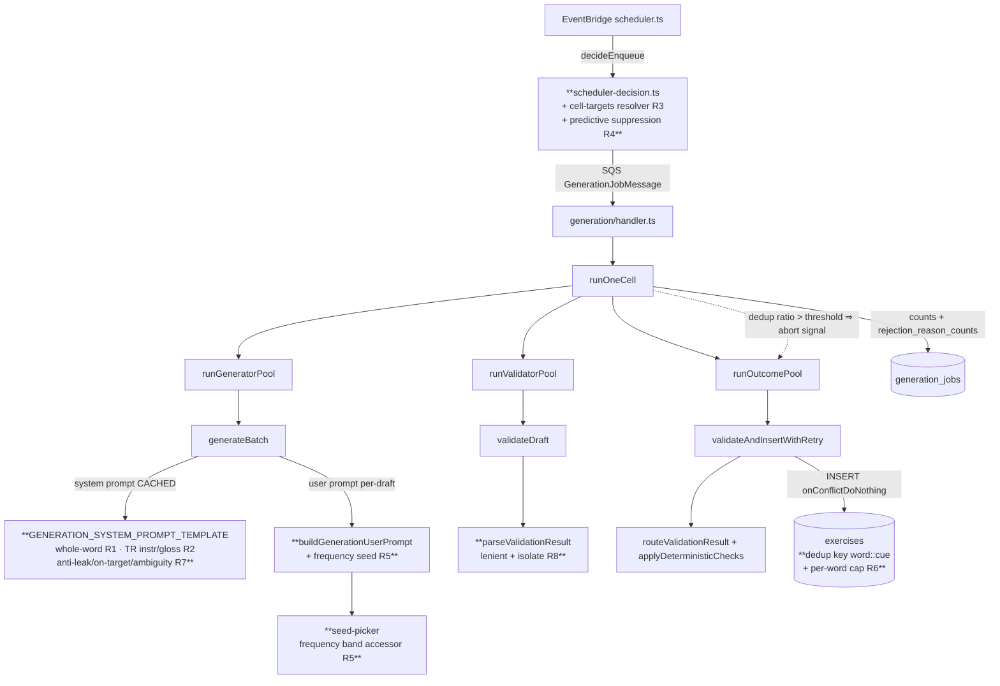

# Design Document

## Overview

This feature is a follow-up to `generation-quality-fixes` (R1–R8, merged as `81fb20d`). The
2026-05-24 production run — already running with that spec live — still wastes ~70% of generated
drafts: 202 dedup-given-up + 176 quality vetoes out of 378 rejections, dominated by
`context spoils answer` (168 validator calls) and `low quality (<0.5)` (175), with `ambiguous`
(220) and `grammarPointMatch=false` (174) as top flag-drivers, concentrated in Turkish cloze.

The design makes five changes, each landing in an existing seam of the generation pipeline so the
blast radius stays small and every change is independently measurable against
`generation_jobs.rejection_reason_counts`:

1. **Whole-word cloze blanks (universal)** — a generation-prompt rule; the blank is the entire
   inflected word in every language. Changes Turkish (the outlier); locks in ES/DE.
2. **Turkish case: generic instructions + context-forced selection + level-gated L1 gloss** — a
   prompt rule plus one optional `ClozeContent` field and a tiny UI slot.
3. **Per-cell generation targets** — a pure target resolver replacing the global
   `TARGET_PER_CELL = 50`, consumed by the scheduler's `decideEnqueue`.
4. **Predictive saturation suppression + within-run early-bail** — a `decideEnqueue` branch plus a
   circuit-breaker in `runOneCell`'s outcome loop.
5. **Frequency-seeded generation** — a rank-band accessor on the frequency module + a deterministic
   seed picker, injected in the per-draft user prompt (caching preserved).
6. **`vocab_recall` ≤N-per-word** — a dedup-key change (`word::cue`) + an insert-time count cap +
   a supporting index.
7. **Generator anti-leak / stay-on-target / anti-ambiguity prompt rules** — prompt template.
8. **Validator-response parse hardening** — lenient coercion + per-draft isolation in the validator
   pool.

## Steering Document Alignment

### Technical Standards (tech.md)
- **Prompt caching (§7):** all per-draft data (frequency seed, gloss decision) goes in the
  *user* prompt; the cached system prompt stays byte-identical across a batch (~80% prompt-token
  saving preserved).
- **Pre-generated content / cost control (§1, §7):** per-cell targets + predictive suppression end
  the dedup death-spiral that burns Claude spend; seeding raises distinct-surface yield per dollar.
- **Drizzle + Neon, forward-only migrations (§5):** the `vocab_recall` index change is an additive,
  forward-only migration that does not orphan existing rows.
- **Claude structured output (§7):** R8 hardens tool-call parsing; the validator tool schema is
  unchanged (no new fields), only the parser's strictness and failure isolation change.
- **Observability:** prompt edits bump `*_PROMPT_VERSION` and are pushed to Langfuse
  (`pnpm push-prompts`); the frequency seed is emitted as named trace metadata.

### Project Structure
No `structure.md` exists in steering; file organization follows the monorepo layout in `tech.md`
§4: prompt/AI logic in `packages/ai`, generation orchestration + schema in `packages/db`, scheduler
in `infra/lambda/src/generation`, shared types in `packages/shared`, web rendering in `apps/web`.
Each change is placed in the package that already owns its concern.

## Code Reuse Analysis

### Existing Components to Leverage
- **`GENERATION_SYSTEM_PROMPT_TEMPLATE` + `GENERATION_PROMPT_VERSION`** (`packages/ai/src/generation-prompts.ts`): host for the whole-word rule (R1), TR instruction/gloss rules (R2), and anti-leak/stay-on-target/anti-ambiguity rules (R7). Version bump + `push-prompts` per CLAUDE.md.
- **`buildGenerationUserPrompt(inputs, ordinal, topicDomain)`** (`generation-prompts.ts:246`): the per-draft, non-cached message — the injection point for the frequency seed (R5).
- **`loadFrequency` / `FrequencyFile` / stopword lists** (`packages/ai/src/frequency/`): extended with a rank-band accessor for seed candidates (R5).
- **`deterministicUuid`** (`packages/db/src/lib/deterministic-uuid.ts`): pattern for deterministic, reproducible per-ordinal seed selection (R5).
- **`scheduler-decision.ts` `decideEnqueue` + `VALIDATION_THRESHOLDS`-style frozen constants**: extended with a target resolver (R3) and a predictive-suppression branch (R4).
- **`runOutcomePool` / `runOneCell` accumulator loop** (`packages/db/src/generation/`): host for the early-bail circuit breaker (R4), reusing the existing `signal: AbortSignal` cooperative-cancellation seam.
- **`canonicalSurface`** (`generation-prompts.ts:274`) + **`exercises_dedup_idx`** + **`validateAndInsertWithRetry`** dedup-retry loop: the `vocab_recall` ≤N-per-word change reuses the existing `onConflictDoNothing` + retry machinery (R6).
- **`parseValidationResult` / `requireStringArray`** (`packages/ai/src/validate.ts`) + **`runValidatorPool`** (`packages/db/src/generation/validator-pool.ts`): the R8 hardening site; reuses the existing `parserFailedCount` precedent in `CellResult`.
- **`splitClozeSentence`** (`apps/web/lib/drill/cloze-blank.ts`) + **`cloze-exercise.tsx`** `content.context` render slot: already handle whole-word blanks and an above-sentence framing line; the L1 gloss reuses this slot (R2).

### Integration Points
- **Anthropic Messages API:** seed text appended to the user message only; `system` block (with `cache_control`) untouched.
- **Langfuse:** new `seedWord`/`seedRank` trace metadata on `generate` observations (mirrors the `exerciseId` rigor from the predecessor spec); `rejection_reason_counts` (PR #187) is the measurement surface.
- **Neon / Drizzle:** one forward-only migration adds a partial index supporting the `vocab_recall` per-word count cap; the `exercises.content_json` JSONB gains an optional `glossEn` field (no DDL — JSONB).
- **EventBridge scheduler:** consumes the new target resolver; enumeration query stays a single index-only aggregate (no new per-cell round-trips).

## Architecture

The pipeline is unchanged in shape; each change is a localized insertion. Bold nodes are new or
modified.



## Components and Interfaces

### Component A — Whole-word cloze blanks (R1)
- **Purpose:** make the `___` blank the entire inflected word in every language; remove the
  Turkish suffix-only convention and the buffer-consonant band-aid rule.
- **Interfaces:** prose edits to `GENERATION_SYSTEM_PROMPT_TEMPLATE` (new "Blank granularity" rule
  with per-language mutation examples: TR `kahve→kahveyi`/`kitap→kitabı`; ES `volver→vuelven`/
  `buscar→busqué`; DE `fahren→fährt`); delete the "Buffer-consonant ambiguity" bullet
  (`generation-prompts.ts:176`). No tool-schema or `ClozeContent` change for R1.
- **Dependencies:** `GENERATION_PROMPT_VERSION` bump + `push-prompts`.
- **Reuses:** existing template/version machinery; `checkTurkishCloze` now receives a full surface
  (it already reconstructs the surface, so this is a simplification, not a checker rewrite — verify
  no regression).

### Component B — Turkish case instructions + L1 gloss (R2)
- **Purpose:** generic instruction ("the correct form of the word in parentheses") for TR case
  clozes; optional level-gated English gloss as a disambiguation device.
- **Interfaces:**
  - `ClozeContent` gains `glossEn?: string` (optional; ignored by existing consumers — type guards
    discriminate on `type`).
  - Generation-side: `CLOZE_GENERATION_TOOL.input_schema` (`generate.ts:74`) adds optional
    `glossEn`, and `parseGeneratedClozeDraft` (`generate.ts:366`) parses it via `optionalString`,
    mirroring how `context`/`topicHint` are handled at `generate.ts:380-405`. (Cloze content is
    built generation-side in `generate.ts`, not in `validate.ts`.)
  - Prompt rule: TR case cells use generic instructions; include `glossEn` for A1–A2, omit B1+; the
    gloss must satisfy the existing "Spoiled blank" rule (no rule-outcome leak).
  - UI: `cloze-exercise.tsx` renders `content.glossEn` in the existing above-sentence slot
    (alongside/below `content.context`), visually muted.
- **Dependencies:** Component A (same prompt edit/version bump).
- **Reuses:** the `content.context` render path (`cloze-exercise.tsx:97`); no new UI primitive.

### Component C — Per-cell target resolver (R3)
- **Purpose:** replace the single `TARGET_PER_CELL = 50` with a per-cell resolved target.
- **Interfaces:** new pure function in `infra/lambda/src/generation/cell-targets.ts`:
  ```
  resolveCellTarget(cell: Cell): number
  ```
  Resolution order: (1) `cell.grammarPoint.targetOverride` if set; (2) a default table keyed by
  `(exerciseType, cefrLevel)`; (3) fallback `TARGET_PER_CELL`. `decideEnqueue` takes the resolved
  target as a parameter (kept pure — the resolver is called in `scheduler.ts` and passed in, or the
  resolver is itself pure and imported).
- **Dependencies:** `GrammarPoint` optional `targetOverride` field (`packages/shared/src/curriculum-types.ts`).
- **Reuses:** existing `decideEnqueue` `need = target - approvedInPool` arithmetic and
  `skip-target-reached` branch (now compares against the resolved target).

### Component D — Predictive suppression + within-run early-bail (R4)
- **Purpose:** stop wasting a full run on a near-saturated cell; bail mid-run when dedup dominates.
- **Interfaces:**
  - `decideEnqueue`: predictive branch — suppress (or cap `need`) when `approvedInPool` is within a
    small margin of the resolved target AND the most-recent job's dedup ratio was high, *without*
    requiring that job to have been a full wasteful run. (With realistic per-cell targets from C,
    `skip-target-reached` already absorbs most of this; the predictive branch covers the
    "approaching ceiling, last run dedup-heavy" case on the same tick.)
  - Circuit breaker lives **inside `runOutcomePool`** (`outcome-pool.ts`), NOT in `runOneCell`:
    `runOneCell` awaits the pool to completion via `Promise.all` *before* its accumulator loop runs
    (`run-one-cell.ts:392-449`), so there is no incremental loop there to observe partial outcomes.
    The pool maintains a running counter as workers populate the shared `results` Map; after the
    first `EARLY_BAIL_PROBE_COUNT` outcomes resolve, if `dedupGivenUp / resolved >= EARLY_BAIL_RATIO`
    it trips a derived `AbortController` linked to the parent `signal`. Workers already check
    `signal.aborted` between dispatches (`outcome-pool.ts:77`), so remaining ordinals are skipped.
    The pool surfaces `earlyBailed` to `runOneCell`, which records it on `CellResult` and in the
    structured log; the audit row still closes `succeeded` with accurate counts.
- **Dependencies:** Component C (resolved target); existing `signal` plumbing in `runOutcomePool`.
- **Reuses:** existing `SATURATED_DEDUP_*` constants and `curriculum-version-clears-suppression`
  precedence; the `signal: AbortSignal` seam.

### Component E — Frequency seed picker (R5)
- **Purpose:** anchor each cloze/translation draft on a distinct content word so the generator
  spreads across lexical space instead of mode-collapsing.
- **Interfaces:**
  - `packages/ai/src/frequency/index.ts` adds:
    ```
    frequencyBand(language, rankMin, rankMax): readonly string[]   // lemmas, rank-sorted, stopword-excluded, deduped
    cefrRankWindow(cefrLevel): { rankMin: number; rankMax: number } // single coarse mapping (A1≈1–1000, …), design-tunable
    ```
    The frequency files are keyed by *surface form* and are NOT pre-sorted by rank (many surfaces
    share one lemma+rank). `frequencyBand` therefore scans the file once, filters by rank window,
    dedupes by lemma, sorts by rank, and **caches the per-(language, band) result** — mirroring the
    existing `LOOKUP_CACHE` in `frequency/index.ts:96`.
  - new `packages/db/src/generation/seed-picker.ts` (or in `packages/ai`):
    ```
    pickSeeds(opts: { language; cefrLevel; batchSeed; count; exclude: ReadonlySet<string> }): (string | null)[]
    ```
    Deterministic: index into the band by a hash of `(batchSeed, ordinal)`; skip `exclude` (live
    pool surfaces) and already-chosen seeds; return `null` for an ordinal when the band is
    exhausted (→ unseeded fallback).
  - `GenerationSpec` gains optional `seedWords?: readonly (string | null)[]` (one per ordinal,
    frozen for the batch); `buildGenerationUserPrompt` appends a loose seed instruction when the
    ordinal's seed is non-null.
  - **Seed persistence (resolves R5.3 data source):** the stored cloze `sentence` / translation
    `sourceText` does NOT record which frequency seed produced it, so the cross-run "already used"
    set cannot be derived from existing columns. The chosen seed is therefore persisted as a
    **writer-only `seedWord` field inside `content_json`** (same pattern as `_dedupKey` —
    invisible to runtime consumers, which discriminate on `type`). A new
    `fetchPriorSeeds(cell)` reads `content_json->>'seedWord'` filtered to the cell (covered by the
    existing `exercises_pool_lookup_idx`), giving `pickSeeds` a **cross-run** `exclude` set so the
    pool spreads seeds across many scheduled runs, not just within one batch. `runOneCell` computes
    `exclude` via `fetchPriorSeeds` and calls `pickSeeds` for cloze/translation cells.
  - Trace metadata: `seedWord`, `seedRank` are *also* emitted on the per-ordinal `generate` trace
    context (named keys, for A/B comparison) — independent of the `content_json` persistence above.
- **Dependencies:** frequency module; `deterministicUuid`/hash helper.
- **Reuses:** `buildGenerationUserPrompt`, frequency/stopword data, the per-ordinal `withLlmTrace`
  scope from `validate-and-insert.ts`.

### Component F — `vocab_recall` ≤N-per-word (R6, "Option A")
- **Purpose:** allow up to N exercises per target word, differing on the retrieval cue.
- **Interfaces:**
  - `canonicalSurface` for `VOCAB_RECALL` changes from `normalize(expectedWord)` to
    `normalize(expectedWord) + '::' + normalize(prompt)` — so identical (word, cue) pairs still
    collide, but the same word with a different cue is allowed.
  - `validateAndInsertWithRetry`: for `vocab_recall`, before INSERT, count existing
    approved/flagged rows for `(cell, expectedWord)`; if `>= VOCAB_MAX_PER_WORD` (config, ≈3–4),
    treat as a cap-reached collision routed through the existing dedup-retry path (so the generator
    is asked to pick a different word).
  - `fetchPriorVocabRecallSurfaces`: returns words **at the cap** as the avoid-set; under-cap words
    may be re-proposed with a new cue.
  - `resolveCellTarget` (Component C) for `vocab_recall` accounts for `N × distinctWords`.
- **Dependencies:** forward-only migration adding partial index
  `exercises_vocab_word_idx (language, difficulty, type, grammar_point_key, (content_json->>'expectedWord'))`
  `WHERE review_status IN ('auto-approved','manual-approved','flagged')` to keep the count cheap.
- **Reuses:** `exercises_dedup_idx` (unchanged DDL — it keys on the computed `_dedupKey` string),
  `onConflictDoNothing`, the dedup-retry loop, `MAX_DEDUP_RETRIES`.

### Component G — Generator anti-leak / stay-on-target / anti-ambiguity rules (R7)
- **Purpose:** reduce *production* of spoiled/off-target/ambiguous drafts (vs the validator's
  *catch*).
- **Interfaces:** new `GENERATION_SYSTEM_PROMPT_TEMPLATE` bullets — anti-answer-leak (negative
  examples of the lemma/cue appearing in the visible sentence), stay-on-target (the blank must
  require the cell's declared grammar point), and single-correct-fill (tighten the existing
  `acceptableAnswers` rule). Validator template unchanged (stays the safety net).
- **Dependencies:** shares the Component A/B prompt edit + single version bump.
- **Reuses:** existing prompt structure and the validator's `contextSpoilsAnswer`/`ambiguous`/
  `grammarPointMatch` checks (unchanged).

### Component H — Validator-response parse hardening (R8)
- **Purpose:** one malformed validator tool-call costs at most one draft, never a whole cell.
- **Interfaces:**
  - `parseValidationResult`: `flaggedReasons` and `culturalIssues` become **lenient** — a missing
    or non-array value coerces to `[]` (these are non-load-bearing reason annotations; routing only
    consumes them when present). This alone fixes the exact 2026-05-24 failure.
  - For genuinely load-bearing field failures (missing `qualityScore`/booleans), introduce a typed
    `ValidationParseError`; `runValidatorPool` catches it **per worker** and records a
    parse-failed sentinel in its result `Map` (instead of the first throw rejecting the whole pool).
    Transport/abort errors (429, network, SIGINT) still propagate → `failClosed` (retrying the cell
    is the right response there).
  - `validateAndInsertWithRetry`/`runOneCell`: a parse-failed first-validation routes the ordinal
    to `rejected` and bumps a new `validatorParseFailedCount` on `CellResult` (mirrors the existing
    `parserFailedCount` for generator drafts), surfaced in the structured log.
- **Dependencies:** none beyond the validator pool/parse path.
- **Reuses:** `parserFailedCount` precedent; `ValidateDraftResult` map value (extended with a
  discriminated parse-failed variant).

## Data Models

### ClozeContent (extended — `packages/shared/src/index.ts`)
```
ClozeContent {
  type: 'cloze'
  instructions: string         // R2: generic for TR case cells ("...form of the word in parentheses")
  sentence: string             // R1: '___' marks the WHOLE inflected word
  correctAnswer: string        // R1: the complete surface form (e.g. 'kahveyi', 'vuelven')
  acceptableAnswers?: string[]
  options?: string[]
  context?: string
  glossEn?: string             // R2 (NEW, optional): L1 disambiguation gloss; A1–A2 only; non-spoiling
  topicHint?: string
}
```

### GrammarPoint (extended — `packages/shared/src/curriculum-types.ts`)
```
GrammarPoint {
  ...existing...
  targetOverride?: number      // R3 (NEW, optional): per-cell distinct-exercise ceiling override
}
```

### Cell-target defaults (new — `infra/lambda/src/generation/cell-targets.ts`)
```
CELL_TARGET_DEFAULTS: Record<ExerciseType, Partial<Record<CurriculumCefrLevel, number>>>
// e.g. narrow A1/A2 grammar cloze/translation ≈ 15–20; vocab_recall ≈ N × expected distinct words.
// resolveCellTarget(cell) = grammarPoint.targetOverride ?? table[type][cefr] ?? TARGET_PER_CELL
```

### Frequency band accessor (new — `packages/ai/src/frequency/index.ts`)
```
frequencyBand(language, rankMin, rankMax): readonly string[]
cefrRankWindow(cefr): { rankMin, rankMax }   // A1≈1–1000, A2≈1000–2500, B1≈2500–5000, B2≈5000–10000 (tunable)
```

### GenerationSpec (extended — `packages/ai/src/generate.ts`)
```
GenerationSpec { ...existing...; seedWords?: readonly (string | null)[] }  // R5, one per ordinal, batch-frozen
```

### content_json writer-only field (behavioral — cloze/translation, R5)
```
content_json._dedupKey: string   // existing writer-only
content_json.seedWord?: string   // NEW writer-only: the frequency seed used (cloze/translation);
                                 // read back by fetchPriorSeeds for the cross-run exclude set.
                                 // JSONB — no DDL; invisible to runtime consumers (type guards
                                 // discriminate on `type`).
```

### Dedup key (behavioral change — `canonicalSurface`, `generation-prompts.ts`)
```
VOCAB_RECALL: _dedupKey = normalize(expectedWord) + '::' + normalize(prompt)   // was: normalize(expectedWord)
CLOZE / TRANSLATION: unchanged (sentence / sourceText)
```

### ValidateDraftResult map value (extended — validator pool, R8)
```
Map<number, ValidateDraftResult | { kind: 'parse-failed'; message: string }>
```

### Migration (forward-only)
```
00NN_vocab_word_index.sql:
  CREATE INDEX exercises_vocab_word_idx ON exercises
    (language, difficulty, type, grammar_point_key, (content_json->>'expectedWord'))
    WHERE review_status IN ('auto-approved','manual-approved','flagged');
```
No data backfill; existing rows keep their `_dedupKey`. New `vocab_recall` rows compute the
`word::cue` key going forward (old single-word keys remain valid and non-colliding).

## Error Handling

### Error Scenarios
1. **Validator returns malformed tool input (missing `flaggedReasons`).**
   - **Handling:** lenient coercion to `[]` (R8); draft proceeds through routing normally.
   - **User Impact:** none; the draft is validated as if `flaggedReasons: []`.
2. **Validator returns a genuinely broken result (missing `qualityScore`).**
   - **Handling:** `ValidationParseError` caught per-worker; that ordinal → `rejected`,
     `validatorParseFailedCount++`; other ordinals unaffected.
   - **User Impact:** none; at most one draft lost instead of the whole cell.
3. **Transport failure (429 / network / SIGINT) during validation.**
   - **Handling:** propagates (not a parse error) → `failClosed`; audit row closes `failed` with
     the message. Same as today.
   - **User Impact:** cell retried on the next scheduled tick (idempotent jobId).
4. **Frequency band exhausted for an ordinal (R5).**
   - **Handling:** `pickSeeds` returns `null`; that ordinal generates unseeded (current behavior).
   - **User Impact:** none.
5. **`vocab_recall` word already at cap (R6).**
   - **Handling:** routed through the existing dedup-retry loop (regenerate with a different word);
     if all retries hit the cap, the ordinal becomes `dedup-given-up` (existing accounting).
   - **User Impact:** none; pool fills toward `N × distinctWords`.
6. **Early-bail trips on a cell with a transient dedup spike (R4).**
   - **Handling:** probe window (`EARLY_BAIL_PROBE_COUNT`) + ratio threshold tuned conservatively;
     audit row still `succeeded` with accurate counts; next tick re-evaluates via predictive
     suppression. A false early-bail costs at most one tick's deferral, not data.

## Testing Strategy

### Unit Testing
- **Prompt edits (A, B, G):** extend `generation-prompts.test.ts` — byte-parity guard on the
  template, presence of the whole-word rule + per-language examples, absence of the deleted
  buffer-consonant bullet, presence of anti-leak/stay-on-target bullets, `GENERATION_PROMPT_VERSION`
  format.
- **Target resolver (C):** new `cell-targets.test.ts` — override > table > fallback precedence;
  narrow A1/A2 resolves below 50; vocab accounts for N.
- **Scheduler (C, D):** extend `scheduler-decision.test.ts` — `decideEnqueue` against resolved
  targets; predictive-suppression branch; suppression still cleared by curriculum-version mismatch.
- **Early-bail (D):** extend `run-one-cell.test.ts` — outcomes dominated by dedup trip the breaker;
  `earlyBailed`/counts correct; `succeeded` status preserved; no bail under the threshold.
- **Seed picker (E):** new `seed-picker.test.ts` — determinism (same inputs → same seeds), distinct
  seeds per ordinal, `exclude`/stopword filtering, rank-band restriction, `null` on exhaustion;
  `frequencyBand`/`cefrRankWindow` unit tests in the frequency package.
- **Seed wiring (E):** extend `generation-prompts.test.ts` — `buildGenerationUserPrompt` includes
  the loose seed line iff the ordinal seed is non-null; system prompt unchanged (cache-prefix
  guard).
- **Dedup + cap (F):** extend `validate-and-insert.test.ts` — `word::cue` key allows same word with
  a new cue, blocks identical (word,cue); cap-reached routes to dedup-retry then `dedup-given-up`;
  `canonicalSurface` unit test for the new vocab key.
- **Parse hardening (H):** extend `validate.test.ts` — missing/non-array `flaggedReasons`/
  `culturalIssues` coerce to `[]`; missing `qualityScore` raises `ValidationParseError`. Extend
  `validator-pool` tests — a per-worker `ValidationParseError` isolates to one ordinal; a transport
  error still rejects the pool.

### Integration Testing
- **Whole-word + harmony (A):** generate a small TR batch through `runOneCell` (mocked Claude
  returning whole-word answers) → assert `checkTurkishCloze`/`applyDeterministicChecks` produce no
  new false verdicts and rows store full-surface `correctAnswer`.
- **Malformed-validator isolation (H):** `runOneCell` with one mocked validator response missing
  `flaggedReasons` and one missing `qualityScore` → cell still inserts the good ordinals;
  `validatorParseFailedCount = 1`; status `succeeded`.
- **Seeded diversity (E):** two ordinals with different seeds produce different `_dedupKey`s (mocked
  Claude echoing the seed into the sentence) → no dedup collision.

### End-to-End Testing
- No new Playwright flows required; the cloze renderer already handles whole-word blanks and the
  `context` slot. Add one component test (`cloze-exercise.test.tsx`) asserting `glossEn` renders in
  the above-sentence slot and is absent when unset.
- **Measurement (manual, post-deploy):** compare `generation_jobs.rejection_reason_counts` across
  pre/post scheduled runs per the requirements success metric (directional, multi-run).
