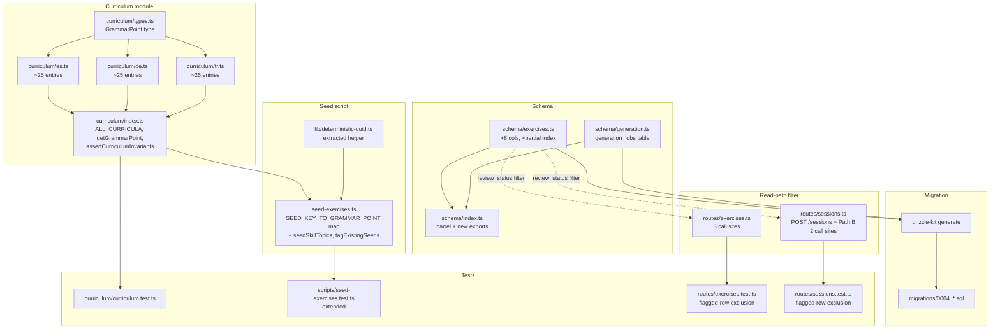

# Design Document

## Overview

This design implements **Phase 1 — Curriculum & schema** from `docs/exercise-generation-plan.md` against the requirements in `requirements.md`. The phase delivers four artifacts:

1. A **curriculum module** at `packages/db/src/curriculum/` — typed `GrammarPoint` entries for ES/DE/TR (no EN), spanning A1–B2, with self-validating runtime invariants.
2. A **Drizzle schema diff + migration** (`0004_*.sql`) that adds eight metadata columns to `exercises`, a new `generation_jobs` audit table, and one partial index used by future pool-depth lookups.
3. A **seed-script extension** that upserts `skill_topics` from the curriculum and tags the 27 existing non-EN seed exercises (the 9 EN seeds remain untagged by design).
4. **Read-path filtering** of flagged/rejected rows in two route files, plus the test coverage required by Requirement 6.

No Claude calls, no Lambda, no API surface beyond the existing routes. The phase produces *the data foundation* the Phase 2 generator will write into.

## Steering Document Alignment

### Technical Standards (tech.md)

- **Drizzle ORM + Neon** (`tech.md` §"Database"). All schema changes are authored as Drizzle table definitions in `packages/db/src/schema/`; the migration SQL is **generated** via `pnpm db:generate`, not hand-written, so it stays in lockstep with the TS schema.
- **Forward-only migrations** (`tech.md` §5). Migration `0004_*.sql` is forward-only; no `down` function. Existing migrations (`0000`–`0003`) follow the same convention.
- **Shared types via `packages/shared`** (`tech.md` §"Monorepo Structure"). `GrammarPoint` reuses the existing `Language` and `CefrLevel` enums from `packages/shared/src/index.ts` rather than redefining them.
- **No CHECK constraints for enum-like values.** The existing schema (`skills.name`, `exercises.type`, `userPreferences.primaryLanguage`) consistently models enum-valued columns as plain `text` and enforces values in TypeScript. Phase 1 follows that convention for the six new enum-valued columns (`generation_source`, `review_status`, `topic_domain`, `status`, `trigger`, `model_id`). This is what Requirement 3.2 and 4.1 specify.
- **Cost-controlled pre-generation** (`tech.md` §7). The partial index `exercises_pool_lookup_idx` is the lookup the future scheduler (Phase 4.3) reads against to detect undersized cells; this phase puts it in place but doesn't yet exercise it.

### Project Structure (no `structure.md`, but conventions verified)

- **Per-table schema files in `packages/db/src/schema/`** with a barrel `index.ts`. New file: `generation.ts` for `generationJobs` (separate from `exercises.ts` because the table has no FK to `exercises` and is operationally distinct — see `sessions.ts` vs `progress.ts` for the same separation pattern).
- **Migrations in `packages/db/migrations/`** with the existing `<NNNN>_<adjective>_<noun>.sql` naming (Drizzle generates this).
- **Seed scripts in `packages/db/scripts/`** with co-located `*.test.ts`. The existing `seed-exercises.ts` + `seed-exercises.test.ts` pair is the model — extend, don't split (consistent with the user-facing requirement and resolved decision in the plan).
- **Tests next to the module** — `curriculum.test.ts` lives in `packages/db/src/curriculum/`, not in a top-level `tests/` directory.

## Code Reuse Analysis

### Existing components to leverage

- **`deterministicUuid()`** in `packages/db/scripts/seed-exercises.ts` (lines 25–50). FNV-style hash that produces stable UUIDs from a string key. Reused for `skill_topics` IDs (`'skill-topic:' + grammarPoint.key`) and remains the seed exercises' ID source. Lifted from the seed script into a shared helper at `packages/db/src/lib/deterministic-uuid.ts` so both the seed script and the curriculum tests can import it without copy-paste (the test currently re-implements it inline at lines 22–45 of `seed-exercises.test.ts` — that duplication is removed).
- **`Language`, `CefrLevel`, `ExerciseType`, `LearningLanguage`** from `packages/shared/src/index.ts`. Reused verbatim. `LearningLanguage = Exclude<Language, 'EN'>` (already exported and used by `userPreferences.primaryLanguage`) is the type for `GrammarPoint.language`, satisfying Requirement 1.1 without introducing a new type.
- **Existing seed exercise inventory** in `seed-exercises.ts:64–608`. The 27 non-EN seeds (`SEED_EXERCISES.filter(s => s.language !== 'EN')`) are tagged via a hand-curated `Record<string, string>` map at the top of the script. Each seed's existing `key` → curriculum `key` mapping is straightforward (e.g. `es-cloze-b1-1` → `es-b1-present-subjunctive`).
- **`onConflictDoNothing()` Drizzle pattern** already used in `seed-exercises.ts:640`. Reused for `skills`, `skill_topics`, and `exercise_tags` upserts so re-running the script is idempotent (Requirement 5.4).
- **Drizzle `index().on(...).where(sql\`...\`)` partial-index syntax**. Already supported by Drizzle 0.45+; emits the exact `CREATE INDEX … WHERE …` SQL Requirement 3.4 specifies.

### Integration points

- **Session creation pool sample** (`infra/lambda/src/routes/sessions.ts:78–88`, `POST /sessions`) — the `WHERE language = ? AND difficulty = ?` clause is extended to also filter `review_status IN ('auto-approved', 'manual-approved')`. Same predicate is added to the UNION-ALL pool sample at `sessions.ts:374–383` (Path B of `GET /sessions/today`). Path A of `GET /sessions/today` (`sessions.ts:262–280`) reads exercises by their stored manifest IDs and is intentionally **not** filtered — once an exercise is in a session, it stays in that session even if it's later flagged.
- **Single-exercise random fetch** (`infra/lambda/src/routes/exercises.ts:67–88`, `GET /exercises`) — pool-discovery endpoint, also gets the predicate.
- **Single-exercise direct lookup** (`infra/lambda/src/routes/exercises.ts:93–114`, `GET /exercises/:id`, and `infra/lambda/src/routes/exercises.ts:131–141`, `POST /exercises/:id/submit`) — direct-ID fetches **also** filter so a flagged exercise can't be retrieved by URL even if its UUID leaks. The submission path already gates session-bound submissions via the manifest check at `exercises.ts:147–167`; the new predicate is a belt-and-braces pool guard, not a session breaker.
- **`packages/db/src/schema/index.ts` barrel** — append the new `generationJobs` and any newly exported types to the barrel so consumers (the future Phase 2 CLI, Phase 4 Lambda) get them with a single `@language-drill/db` import.

### Why no changes to today-plan.ts

`infra/lambda/src/lib/today-plan.ts` is pure plan composition (constants, slot taxonomy, date math). The actual SQL for both Path A and Path B lives in `infra/lambda/src/routes/sessions.ts`, not the lib. Requirement 3.6 names `today-plan.ts` because of how the original plan doc was scoped, but the SQL site is `sessions.ts`. The design therefore touches `sessions.ts`, not `today-plan.ts`. This is called out in the design as a deliberate clarification, not a deviation from the requirement.

## Architecture



The dotted edges show the read-path filter is a runtime predicate, not a structural dependency.

## Components and Interfaces

### Component 1 — Curriculum types and module shape

**Purpose:** Provide a typed, self-validating per-language grammar curriculum that the Phase 2 generator imports as plain data.

**Files:**

- `packages/db/src/curriculum/types.ts` — `GrammarPoint` type definition.
- `packages/db/src/curriculum/{es,de,tr}.ts` — per-language `GrammarPoint[]` arrays.
- `packages/db/src/curriculum/index.ts` — barrel + invariant assertion + lookup helpers.

**Interfaces (typed):**

```ts
// types.ts
import type { CefrLevel, LearningLanguage } from '@language-drill/shared';

export type CurriculumCefrLevel = Extract<CefrLevel, 'A1' | 'A2' | 'B1' | 'B2'>;

export type GrammarPoint = Readonly<{
  /** Stable identifier; format: `<lang>-<level>-<slug>`, e.g. 'es-b1-present-subjunctive'. */
  key: string;
  /**
   * Discriminator for the Phase 2 generator's prompt branching:
   *   - 'grammar' — a real grammar point; prompts inject description + examples
   *     verbatim (the strategy doc's intent).
   *   - 'vocab'   — a frequency-band umbrella entry covering vocab-recall cells
   *     for a given (language, level). Phase 2's vocab path will replace these
   *     with finer-grained frequency-band rows; until then, the umbrellas keep
   *     Req 5.3 honest by ensuring every non-EN seed has a non-null
   *     grammar_point_key. The discriminator (not a string-suffix sniff) is
   *     what Phase 2 will key off.
   */
  kind: 'grammar' | 'vocab';
  name: string;
  /** ≤ 200 chars; English; injected verbatim into Phase 2 prompts. */
  description: string;
  cefrLevel: CurriculumCefrLevel;
  language: LearningLanguage;
  /** ≥ 2 items; canonical correct production examples. */
  examplesPositive: readonly string[];
  /** ≥ 1 item; incorrect production marked with leading `*`. */
  examplesNegative: readonly string[];
  /** ≥ 1 item; common L2 errors learners make on this point. */
  commonErrors: readonly string[];
  /** Same-language curriculum keys this point depends on. May be empty. */
  prerequisiteKeys?: readonly string[];
}>;
```

```ts
// index.ts
export const ALL_CURRICULA: readonly GrammarPoint[] = Object.freeze([
  ...esCurriculum,
  ...deCurriculum,
  ...trCurriculum,
]);

export function getGrammarPoint(key: string): GrammarPoint | undefined { /* O(1) Map lookup */ }

/**
 * Throws if any invariant from Requirements 1.3, 1.5, 2.2, 2.5 is violated.
 * Called from curriculum.test.ts at module load. Intentionally NOT called from
 * production code — production imports trust the invariants because they're
 * test-enforced.
 */
export function assertCurriculumInvariants(): void { /* see Component 5 */ }
```

**Dependencies:** `@language-drill/shared` (`CefrLevel`, `LearningLanguage`).

**Reuses:** Nothing — this is greenfield. The `Object.freeze` pattern matches `LANGUAGE_NAMES` in `packages/shared/src/index.ts:30`.

### Component 2 — Schema extension + new table

**Purpose:** Add the columns the generator will write per draft, and the audit table every batch leaves a row in.

**Files:**

- `packages/db/src/schema/exercises.ts` — extended in place (Requirement 3).
- `packages/db/src/schema/generation.ts` — new file (Requirement 4).
- `packages/db/src/schema/index.ts` — barrel updated.

**Interfaces (Drizzle table shapes):**

```ts
// schema/exercises.ts (extended)
import { index, jsonb, pgTable, primaryKey, real, text, timestamp, uuid } from 'drizzle-orm/pg-core';
import type { InferSelectModel } from 'drizzle-orm';
import { skillTopics } from './skills';

export const exercises = pgTable(
  'exercises',
  {
    id: uuid('id').primaryKey().defaultRandom(),
    type: text('type'),
    language: text('language'),
    difficulty: text('difficulty'),
    contentJson: jsonb('content_json'),
    audioS3Key: text('audio_s3_key'),
    createdAt: timestamp('created_at').defaultNow(),
    // New in Phase 1 — order matches Requirement 3.5:
    grammarPointKey: text('grammar_point_key'),
    topicDomain: text('topic_domain'),
    generationSource: text('generation_source').notNull().default('manual'),
    modelId: text('model_id'),
    qualityScore: real('quality_score'),
    reviewStatus: text('review_status').notNull().default('auto-approved'),
    flaggedReasons: jsonb('flagged_reasons'),
    generatedAt: timestamp('generated_at', { withTimezone: true }),
  },
  (table) => ({
    poolLookupIdx: index('exercises_pool_lookup_idx')
      .on(table.language, table.difficulty, table.type, table.grammarPointKey)
      .where(sql`${table.reviewStatus} IN ('auto-approved', 'manual-approved')`),
  }),
);

export type Exercise = InferSelectModel<typeof exercises>;
// `exerciseTags` unchanged — same definition, same place.
```

```ts
// schema/generation.ts (new)
import { index, integer, numeric, pgTable, text, timestamp, uuid } from 'drizzle-orm/pg-core';
import type { InferInsertModel, InferSelectModel } from 'drizzle-orm';

export const generationJobs = pgTable(
  'generation_jobs',
  {
    id: uuid('id').primaryKey(),                                   // caller-supplied (mirrors generation_jobs.id ↔ SQS dedup id, plan §4.1)
    cellKey: text('cell_key').notNull(),                           // <lang>:<level>:<type>:<grammar_point_key>
    requestedCount: integer('requested_count').notNull(),
    producedCount: integer('produced_count').notNull().default(0),
    approvedCount: integer('approved_count').notNull().default(0),
    flaggedCount: integer('flagged_count').notNull().default(0),
    rejectedCount: integer('rejected_count').notNull().default(0),
    status: text('status').notNull(),                              // queued | running | succeeded | failed
    startedAt: timestamp('started_at', { withTimezone: true }).notNull().defaultNow(),
    finishedAt: timestamp('finished_at', { withTimezone: true }),
    inputTokensUsed: integer('input_tokens_used'),
    outputTokensUsed: integer('output_tokens_used'),
    costUsdEstimate: numeric('cost_usd_estimate', { precision: 10, scale: 4 }),
    trigger: text('trigger').notNull(),                            // cli | scheduled | admin
    errorMessage: text('error_message'),
  },
  (table) => ({
    cellIdx: index('generation_jobs_cell_idx').on(table.cellKey, table.startedAt.desc()),
  }),
);

export type GenerationJob = InferSelectModel<typeof generationJobs>;
export type NewGenerationJob = InferInsertModel<typeof generationJobs>;
```

**Dependencies:** Drizzle ORM 0.45, Postgres ≥14 (for partial-index syntax — Neon is on 15+).

**Reuses:** Existing `pgTable`/`index` patterns. The `timestamp('…', { withTimezone: true }).notNull().defaultNow()` shape is taken from `userPreferences.updatedAt` (`schema/users.ts:35`) and `practiceSessions.startedAt` (`migrations/0003_*.sql:9`).

### Component 3 — Migration

**Purpose:** The forward-only `0004_*.sql` migration that applies the schema diff to Neon.

**Generation:**

- Drizzle generates the migration via `pnpm db:generate` (from `packages/db`). The developer runs this after editing `schema/exercises.ts` and creating `schema/generation.ts`. The output filename is auto-named (e.g. `0004_lonely_red_skull.sql`).
- The generated SQL is committed alongside the schema TS. CI (`pnpm db:migrate`) applies it on the dev branch first per the existing PR pipeline (`tech.md` §5).

**Expected SQL shape (verifiable post-generation):**

```sql
ALTER TABLE "exercises"
  ADD COLUMN "grammar_point_key" text,
  ADD COLUMN "topic_domain" text,
  ADD COLUMN "generation_source" text DEFAULT 'manual' NOT NULL,
  ADD COLUMN "model_id" text,
  ADD COLUMN "quality_score" real,
  ADD COLUMN "review_status" text DEFAULT 'auto-approved' NOT NULL,
  ADD COLUMN "flagged_reasons" jsonb,
  ADD COLUMN "generated_at" timestamp with time zone;
--> statement-breakpoint
CREATE INDEX "exercises_pool_lookup_idx" ON "exercises"
  USING btree ("language","difficulty","type","grammar_point_key")
  WHERE "review_status" IN ('auto-approved', 'manual-approved');
--> statement-breakpoint
CREATE TABLE "generation_jobs" (
  "id" uuid PRIMARY KEY NOT NULL,
  "cell_key" text NOT NULL,
  "requested_count" integer NOT NULL,
  "produced_count" integer DEFAULT 0 NOT NULL,
  "approved_count" integer DEFAULT 0 NOT NULL,
  "flagged_count" integer DEFAULT 0 NOT NULL,
  "rejected_count" integer DEFAULT 0 NOT NULL,
  "status" text NOT NULL,
  "started_at" timestamp with time zone DEFAULT now() NOT NULL,
  "finished_at" timestamp with time zone,
  "input_tokens_used" integer,
  "output_tokens_used" integer,
  "cost_usd_estimate" numeric(10,4),
  "trigger" text NOT NULL,
  "error_message" text
);
--> statement-breakpoint
CREATE INDEX "generation_jobs_cell_idx" ON "generation_jobs"
  USING btree ("cell_key","started_at" DESC);
```

**Verification step in tasks.md:** apply against a local Neon dev branch and run `EXPLAIN` on the canonical pool-lookup query (`SELECT id FROM exercises WHERE language = 'ES' AND difficulty = 'B1' AND type = 'cloze' AND grammar_point_key = 'es-b1-present-subjunctive' AND review_status IN ('auto-approved', 'manual-approved')`); confirm `Index Scan using exercises_pool_lookup_idx`.

**Reuses:** The standard `pnpm db:generate` workflow — the same path used to author `migrations/0001`, `0002`, `0003`. No bespoke migration tooling.

### Component 4 — Seed-script extension

**Purpose:** Populate `skill_topics` from the curriculum and tag the 27 non-EN seed exercises so they participate in the new partial index from day one.

**Files:**

- `packages/db/scripts/seed-exercises.ts` — extended in place, three new functions added.
- `packages/db/src/lib/deterministic-uuid.ts` — new file holding the previously-inlined helper.

**New helper module:**

```ts
// packages/db/src/lib/deterministic-uuid.ts
/** FNV-style 128-bit hash → UUID v5-shaped string. Stable across runs. */
export function deterministicUuid(key: string): string { /* moved from seed script */ }
```

The helper is imported by `seed-exercises.ts` and `seed-exercises.test.ts` via relative paths within `packages/db`. It is **not** re-exported from the package barrel (`packages/db/src/index.ts`) because no consumer outside `packages/db` needs it in Phase 1. If Phase 2 wants it (e.g. for the generator's deterministic ID derivation), the export gets added at that point — not pre-emptively here.

**Three new functions in `seed-exercises.ts`:**

```ts
// 1. Skill upsert — ensures (language, 'grammar') skills row exists for each learning language.
async function upsertGrammarSkills(db: Db): Promise<{ inserted: number; skipped: number }> { … }

// 2. Skill-topics seed — one row per curriculum entry; deterministic ID via 'skill-topic:'+key.
async function seedSkillTopics(db: Db): Promise<{ inserted: number; skipped: number }> { … }

// 3. Backfill — UPDATE exercises.grammar_point_key + INSERT exercise_tags.
//    Uses the SEED_KEY_TO_GRAMMAR_POINT map (Component 5 below).
async function tagExistingSeeds(db: Db): Promise<{
  tagged: number;
  alreadyTagged: number;
  untaggedEnSeeds: number;
}> { … }
```

**Pure planning helpers (the unit-testable part):**

```ts
// packages/db/scripts/seed-exercises.ts — module-scope pure functions, exported for tests
export type SkillTopicPlan = {
  id: string;
  skillKey: { language: LearningLanguage; name: 'grammar' };
  name: string;
  cefrLevel: string;
  language: LearningLanguage;
};

/** Pure: given the curriculum, returns the rows that would be inserted into skill_topics. */
export function planSkillTopics(curriculum: readonly GrammarPoint[]): SkillTopicPlan[];

/**
 * Pure: validates that every non-EN seed exercise has a curriculum mapping.
 * Throws (Requirement 5.6) with a descriptive message naming the unmapped seed key.
 */
export function planSeedTags(
  seeds: readonly SeedExercise[],
  mapping: Readonly<Record<string, string>>,
  curriculum: readonly GrammarPoint[],
): { tags: Array<{ seedKey: string; grammarPointKey: string }>; untaggedEnSeeds: number };
```

**Mapping table (hand-curated, lives at the top of the seed script):**

```ts
// 27 entries — one per non-EN seed. Verified at module load by planSeedTags.
const SEED_KEY_TO_GRAMMAR_POINT: Readonly<Record<string, string>> = {
  // Spanish
  'es-cloze-a2-1':       'es-a2-preterite-irregular',     // "fui" — ir/ser preterite
  'es-cloze-b1-1':       'es-b1-present-subjunctive',     // "estés" after "Espero que"
  'es-cloze-b2-1':       'es-b2-conditional-perfect',     // "habría actuado"
  'es-translation-a2-1': 'es-a2-gustar-type-verbs',
  'es-translation-b1-1': 'es-b1-llevar-time-expressions',
  'es-translation-b2-1': 'es-b2-past-subjunctive',
  'es-vocab-a2-1':       'es-a2-everyday-vocab',          // (vocab cells map to 'vocab' grammar points — see note below)
  'es-vocab-b1-1':       'es-b1-environment-vocab',
  'es-vocab-b2-1':       'es-b2-abstract-noun-vocab',
  // German
  'de-cloze-a2-1':       'de-a2-perfekt-with-sein',
  'de-cloze-b1-1':       'de-b1-relative-pronouns',
  'de-cloze-b2-1':       'de-b2-konjunktiv-ii',
  'de-translation-a2-1': 'de-a2-akkusativ-prepositions',
  'de-translation-b1-1': 'de-b1-dass-clause-perfekt',
  'de-translation-b2-1': 'de-b2-genitive-prepositions',
  'de-vocab-a2-1':       'de-a2-housing-vocab',
  'de-vocab-b1-1':       'de-b1-environment-vocab',
  'de-vocab-b2-1':       'de-b2-academic-noun-vocab',
  // Turkish
  'tr-cloze-a2-1':       'tr-a2-dili-past',
  'tr-cloze-b1-1':       'tr-b1-causal-conjunctions',
  'tr-cloze-b2-1':       'tr-b2-passive-with-nominalization',
  'tr-translation-a2-1': 'tr-a2-question-formation',
  'tr-translation-b1-1': 'tr-b1-keske-optative',
  'tr-translation-b2-1': 'tr-b2-relative-clause-participles',
  'tr-vocab-a2-1':       'tr-a2-everyday-vocab',
  'tr-vocab-b1-1':       'tr-b1-abstract-noun-vocab',
  'tr-vocab-b2-1':       'tr-b2-academic-noun-vocab',
};
```

**Note on vocab-cell mapping:** the curriculum is a *grammar* curriculum, but the existing seed has 9 vocab-recall exercises. To keep Requirement 5.3 honest (every non-EN seed gets a `grammar_point_key`), the curriculum admits one "vocab umbrella" entry per `(language, level)` cell — 9 entries total — keyed `<lang>-<level>-<topic>-vocab` and discriminated via `kind: 'vocab'` (see `GrammarPoint` definition in Component 1). These entries describe the vocab cell rather than a grammar rule, with `commonErrors` listing typical L2 confusions for that frequency band. This is a small, documented stretch of the curriculum schema and lets us tag every non-EN seed without polluting `exercise_tags` with NULLs. The Phase 2 generator's vocab path will eventually replace these umbrella entries with frequency-band rows; until then, the `kind` discriminator is what Phase 2 will key off — *not* a string match against the `-vocab` suffix.

**Phase 1 effect on `exercise_tags`:** the 9 vocab umbrella `skill_topics` rows are inserted in this phase, and the 9 vocab-recall seed exercises are tagged to them via `exercise_tags`. So the 27 inserted `exercise_tags` rows break down as: 18 grammar-cloze/translation seeds → grammar curriculum entries; 9 vocab-recall seeds → vocab umbrella entries. All 27 land in Phase 1.

**Idempotency strategy:**

- Skills: `INSERT … ON CONFLICT DO NOTHING` keyed by deterministic UUID derived from `'skill:' + language + ':grammar'`.
- Skill topics: `INSERT … ON CONFLICT DO NOTHING` keyed by deterministic UUID derived from `'skill-topic:' + grammarPoint.key`.
- Exercise tags: `INSERT … ON CONFLICT DO NOTHING` against the existing `(exerciseId, skillTopicId)` PK.
- `grammar_point_key` UPDATE: `WHERE id = ? AND (grammar_point_key IS NULL OR grammar_point_key = ?)`. The second branch makes the update idempotent under repeated runs and **safe** if a future operator manually overrides a tag — the script will refuse to clobber a different existing value.

**Summary output:**

```
Seeding 36 exercises...

Summary by language:
  EN: 9 exercise(s) inserted
  ES: 9 exercise(s) inserted
  DE: 9 exercise(s) inserted
  TR: 9 exercise(s) inserted

Skill topics:
  inserted: N           # = ALL_CURRICULA.length + 9 vocab umbrellas
  skipped (already present): 0

Exercise tags:
  inserted: 27
  skipped (already present): 0
  untagged EN seeds: 9 (EN is source-only)

Done. 36 exercise(s) created, 27 tagged.
```

The exact value of `N` is determined by the curriculum content authored in Task 2 — it is not a load-bearing number. The test asserts `output.length === ALL_CURRICULA.length + 9` against the symbol, not against a literal.

**Dependencies:** `@language-drill/db/curriculum`, `@language-drill/db` schema, Drizzle client.

**Reuses:** `deterministicUuid()` (extracted), `onConflictDoNothing()` pattern, the existing `SEED_EXERCISES` array, the existing `main()` orchestration shape.

### Component 5 — Read-path filtering

**Purpose:** Ensure exercises with `review_status` of `'flagged'` or `'rejected'` cannot be served to users via any pool-discovery or direct-fetch endpoint.

**Files modified:**

- `infra/lambda/src/routes/exercises.ts` — three call sites (lines 71, 98, 135).
- `infra/lambda/src/routes/sessions.ts` — two call sites (line 80 in `POST /sessions`; the UNION-ALL at lines 374–383 in `GET /sessions/today` Path B).

**Filter predicate (added in all five places):**

```ts
import { inArray } from 'drizzle-orm';

const APPROVED_STATUSES = ['auto-approved', 'manual-approved'] as const;

// Drizzle:
.where(
  and(
    eq(exercisesTable.language, language),
    eq(exercisesTable.difficulty, difficulty),
    inArray(exercisesTable.reviewStatus, APPROVED_STATUSES),
  ),
)

// Raw SQL (UNION-ALL in sessions.ts:374-383):
WHERE language = ${language}
  AND difficulty = ${difficulty}
  AND type = ${slot.type}
  AND review_status IN ('auto-approved', 'manual-approved')
```

The `APPROVED_STATUSES` constant is exported from a shared location (`infra/lambda/src/lib/exercise-filters.ts`, new file) so a future change to allowable statuses (e.g. adding `'beta'`) flips one line.

**Sites that are intentionally NOT filtered:**

- `sessions.ts:262–280` — Path A of `GET /sessions/today` reads exercises by their stored manifest IDs. A flagged exercise that was already in a session manifest stays in that session; the page would otherwise display a phantom missing slot. Documented in a code comment.
- `sessions.ts` `GET /sessions/:id/debrief` — same hydration semantics as Path A: reads `exercises` by IDs already committed to a `practice_sessions` manifest. Filtering would drop exercises from a completed session's debrief view, which is the wrong UX. Documented in the same code comment.
- `seed-exercises.ts` writes — the seed inserts use the column default (`'auto-approved'`) so existing seeds remain visible.

**Dependencies:** `drizzle-orm` (existing).

**Reuses:** The existing route handler shape, middleware, and error responses.

### Component 6 — Curriculum invariants helper

**Purpose:** A single function that validates every cross-cutting constraint in Requirements 1.3, 1.5, 2.2, and 2.5 — called from the test suite to fail fast if the curriculum modules drift.

**File:** `packages/db/src/curriculum/index.ts`

**Interface:**

```ts
export function assertCurriculumInvariants(): void {
  // 1. Every key matches /^(es|de|tr)-(a1|a2|b1|b2)-[a-z0-9-]+$/
  // 2. Keys are globally unique
  // 3. language matches key prefix
  // 4. cefrLevel matches key infix
  // 5. examplesPositive.length >= 2
  // 6. examplesNegative.length >= 1, each starts with '*'
  // 7. commonErrors.length >= 1
  // 8. description.length <= 200
  // 9. prerequisiteKeys (if present) all resolve in same language
  // 10. per-language counts: A1 >= 4, A2 >= 5, B1 >= 6, B2 >= 5
}
```

Implementation throws `Error` with a message naming the offending entry on first violation. The function is *not* called from the seed script or from any production code path — production trusts the invariants because they're enforced by `curriculum.test.ts`. This avoids paying the validation cost on every Lambda cold start.

## Data Models

The two data models below are the new shapes; they coexist with the unchanged `exercises`/`exercise_tags` definitions and the rest of the schema barrel.

### Model 1 — `GrammarPoint` (TypeScript)

```
GrammarPoint (frozen, in-memory)
- key: string                           # "<lang>-<level>-<slug>", globally unique
- name: string                          # human-readable, English
- description: string                   # ≤ 200 chars, English, prompt-injected
- cefrLevel: 'A1' | 'A2' | 'B1' | 'B2'
- language: 'ES' | 'DE' | 'TR'
- examplesPositive: string[]            # ≥ 2
- examplesNegative: string[]            # ≥ 1, each starts with '*'
- commonErrors: string[]                # ≥ 1
- prerequisiteKeys?: string[]           # 0..N, same-language only
```

### Model 2 — `generation_jobs` table

```
generation_jobs
- id: uuid, primary key, caller-supplied  # = SQS message dedup id (Phase 4)
- cell_key: text, not null                # "<lang>:<level>:<type>:<grammar_point_key>"
- requested_count: int, not null
- produced_count: int, not null, default 0
- approved_count: int, not null, default 0
- flagged_count: int, not null, default 0
- rejected_count: int, not null, default 0
- status: text, not null                  # 'queued' | 'running' | 'succeeded' | 'failed'
- started_at: timestamptz, not null, default now()
- finished_at: timestamptz, nullable
- input_tokens_used: int, nullable
- output_tokens_used: int, nullable
- cost_usd_estimate: numeric(10,4), nullable
- trigger: text, not null                 # 'cli' | 'scheduled' | 'admin'
- error_message: text, nullable

indexes:
- generation_jobs_cell_idx (cell_key, started_at DESC)
```

### Model 3 — `exercises` (8 added columns)

```
exercises (existing columns + new)
- … existing 7 columns unchanged …
- grammar_point_key: text, nullable        # FK-by-string to curriculum modules (no DB FK — modules aren't a table)
- topic_domain: text, nullable             # everyday | academic | professional | travel — written by future phases
- generation_source: text, not null, default 'manual'  # manual | claude-batch | claude-realtime
- model_id: text, nullable                 # e.g. 'claude-sonnet-4-5' — written by Phase 2
- quality_score: real, nullable            # [0,1] — written by Phase 3 validator
- review_status: text, not null, default 'auto-approved'  # auto-approved | flagged | rejected | manual-approved
- flagged_reasons: jsonb, nullable         # {reasons: string[]} — written by Phase 3
- generated_at: timestamptz, nullable      # written by Phase 2 (manual seeds keep NULL)

indexes (added):
- exercises_pool_lookup_idx (language, difficulty, type, grammar_point_key)
  WHERE review_status IN ('auto-approved', 'manual-approved')
```

## Error Handling

### Error scenarios

1. **Duplicate or malformed curriculum key.**
   - **Handling:** `assertCurriculumInvariants()` throws at test time with a message naming the offending key (e.g. `"Curriculum invariant violated: duplicate key 'es-b1-present-subjunctive'"`). The test fails CI; production never loads a bad module because the test gate blocks the merge.
   - **User impact:** None at runtime — caught in CI before deploy.

2. **Cross-language prerequisite key.**
   - **Handling:** Same — `assertCurriculumInvariants()` throws at test time with the offending pair. The constraint is in Requirement 2.5.
   - **User impact:** None at runtime.

3. **Seed script encounters an unmapped non-EN seed.**
   - **Handling:** `planSeedTags()` throws `Error('Seed exercise <key> has no curriculum mapping. Add it to SEED_KEY_TO_GRAMMAR_POINT or remove the seed.')`. The seed script aborts before any DB write, so partial state cannot be left behind.
   - **User impact:** Developer running `pnpm db:seed:exercises` sees the error and either adds the curriculum entry + mapping, or removes the orphan seed. Required by Requirement 5.6.

4. **Migration applied to an already-migrated DB.**
   - **Handling:** Drizzle's migration runner is idempotent at the migration-name level (tracks applied migrations in `__drizzle_migrations`). Running `pnpm db:migrate` twice is a no-op.
   - **User impact:** None.

5. **Read-path query against `exercises` returns zero rows because all candidates are flagged/rejected.**
   - **Handling:** Same as the existing "no exercises in the pool" path. `GET /exercises` returns `{ error: 'No exercises found', code: 'NO_EXERCISES' }` (404) — `routes/exercises.ts:77`. `POST /sessions` returns `{ code: 'INSUFFICIENT_EXERCISES' }` (422) — `sessions.ts:91`. `GET /sessions/today` Path B returns `{ code: 'INSUFFICIENT_POOL', items: [] }` — `sessions.ts:341`. No new error codes are introduced; the new filter narrows what counts as "available" but reuses the same not-enough responses.
   - **User impact:** Same UI as a genuinely-empty pool. The dashboard renders the "your pool isn't seeded yet" empty state (`apps/web/app/(dashboard)/_components/state-cards.tsx`).

6. **Migration runs against a Neon dev branch with seed data already present.**
   - **Handling:** The new NOT-NULL columns get their defaults applied via `ADD COLUMN … DEFAULT … NOT NULL` in a single statement — Postgres backfills atomically. Existing rows receive `generation_source='manual'`, `review_status='auto-approved'`. No data migration script needed (Requirement 3.3).
   - **User impact:** None — existing 36 seeds remain queryable and become visible to the new partial index.

## Testing Strategy

### Unit testing

**`packages/db/src/curriculum/curriculum.test.ts` (new):**

- `assertCurriculumInvariants()` returns without throwing for the shipped curriculum.
- Mutation tests: clone `ALL_CURRICULA`, mutate one entry to break each invariant in turn, assert the helper throws with the expected message. Covers: duplicate key, malformed key, mismatched `language`, mismatched `cefrLevel` infix, undersized examples arrays, oversized description, dangling/cross-language prerequisite, undersized per-language counts (A1 < 4, etc.).
- `getGrammarPoint(key)` returns the matching entry for a known key and `undefined` for `'unknown-key'`.
- Per-language counts ≥ minimums (Requirement 2.2).

**`packages/db/scripts/seed-exercises.test.ts` (extended in place):**

- Drop the inlined `deterministicUuid` (now imported from `lib/deterministic-uuid.ts`).
- Add tests for `planSkillTopics(ALL_CURRICULA)`:
  - Output length equals `ALL_CURRICULA.length + 9` (curriculum + 9 vocab umbrella entries).
  - Each output row's `id` equals `deterministicUuid('skill-topic:' + key)`.
  - Output is deterministic across calls.
- Add tests for `planSeedTags(SEED_EXERCISES, SEED_KEY_TO_GRAMMAR_POINT, ALL_CURRICULA)`:
  - 27 tags returned, 9 EN seeds reported in `untaggedEnSeeds`.
  - Throws when `SEED_KEY_TO_GRAMMAR_POINT` is missing a non-EN seed (mutation: delete one entry).
  - Throws when a mapped grammar point is not in `ALL_CURRICULA` (mutation: change one mapping value).

**`infra/lambda/src/routes/exercises.test.ts` (extended):**

- New fixture: insert one exercise with `reviewStatus='flagged'` and one with `reviewStatus='rejected'` for the test language.
- `GET /exercises?language=…&difficulty=…` over 100 random draws never returns the flagged or rejected fixtures.
- `GET /exercises/:id` returns 404 for a flagged or rejected exercise's UUID.
- Existing tests continue to pass with the new column defaults.

**`infra/lambda/src/routes/sessions.test.ts` (extended):**

- New fixture: insert flagged exercises in the cell `POST /sessions` is asked about.
- `POST /sessions` over 100 calls never returns the flagged fixture in the manifest.
- `GET /sessions/today` Path B (no existing session today) over 100 calls never includes flagged fixtures.
- Path A test: a session manifest already containing a flagged exercise still hydrates that exercise (regression guard for the deliberate non-filter at `sessions.ts:262–280`).

### Integration testing

The CI pipeline (`tech.md` §5) already applies Drizzle migrations against an ephemeral Neon branch on every PR, so the migration *will* run automatically — what's not automated is verifying that the partial index is actually used by the canonical pool-lookup query. Phase 1 closes this gap with a **mandatory manual step** in tasks.md, not automated coverage. The honest framing: this is a deliberate scope cut; Phase 2's CI test database lights up the automated path.

- **Migration smoke test (mandatory manual step in tasks.md, not automated in this phase):** apply `0004_*.sql` against a fresh Neon dev branch, run `EXPLAIN` on the canonical pool-lookup query (`SELECT id FROM exercises WHERE language='ES' AND difficulty='B1' AND type='cloze' AND grammar_point_key='es-b1-present-subjunctive' AND review_status IN ('auto-approved', 'manual-approved')`), confirm the plan contains `Index Scan using exercises_pool_lookup_idx`. **The PR description MUST include the EXPLAIN output as an artifact** — reviewers reject the PR if it's missing.
- **Seed re-run idempotency:** apply migration, run seed, run seed again, assert `skill_topics` count and `exercise_tags` count are unchanged on the second run. Verified manually via `pnpm db:studio` for this phase; automated when Phase 2 introduces a real CI test database.

### End-to-end testing

Out of scope for Phase 1. The Phase 2 spec will add E2E for the generator → DB → API path. Phase 1's exit criterion is that `pnpm lint && pnpm typecheck && pnpm test` pass and the migration applies cleanly on the dev branch.
