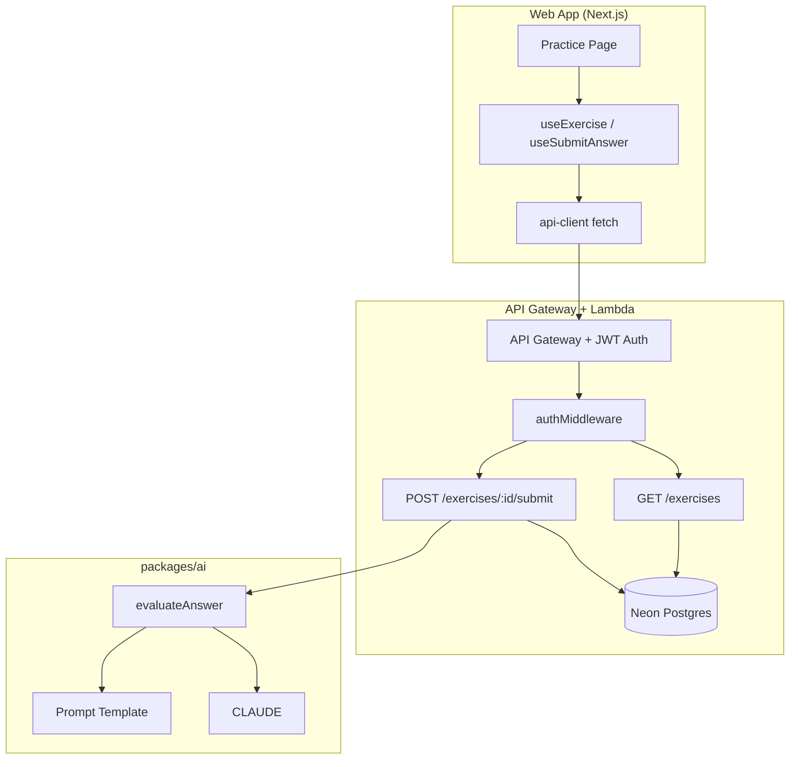
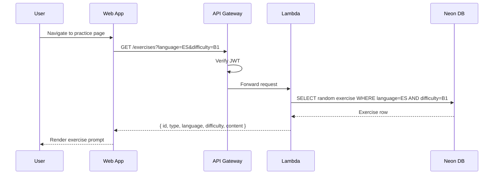
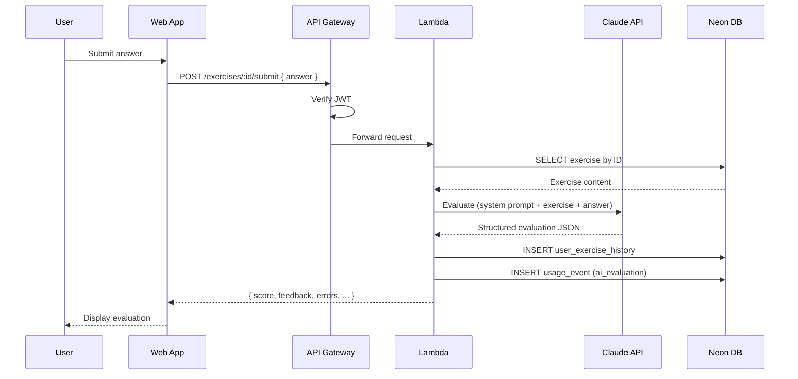

# Design Document — Exercise Retrieval & Evaluation

## Overview

This feature adds the core exercise practice loop to Language Drill: fetching exercises from the pre-generated pool, submitting free-form answers, and receiving structured AI evaluation via Claude. It spans four layers: the `packages/ai` Claude client, Lambda API routes, `packages/api-client` React Query hooks, and the Next.js exercise UI.

## Steering Document Alignment

### Technical Standards (CLAUDE.md)
- **Hono on Lambda** for API routes, following the existing pattern in `infra/lambda/src/routes/`
- **Drizzle ORM** for all database queries, using the existing schema in `packages/db`
- **Anthropic Claude API** (`claude-sonnet-4-6`) with prompt caching via `@anthropic-ai/sdk`
- **Zod** for API response validation in the api-client package
- **TanStack React Query** for data fetching hooks

### Project Structure (CLAUDE.md monorepo layout)
- `packages/ai` — Claude client + prompt templates (new implementation, replacing stub)
- `packages/api-client` — React Query hooks + Zod schemas (extending existing)
- `packages/shared` — Shared types for exercise content and evaluation (extending existing)
- `infra/lambda/src/routes/` — New exercise routes (following health.ts / webhooks pattern)
- `apps/web/app/(dashboard)/practice/` — New practice page

## Code Reuse Analysis

### Existing Components to Leverage
- **`infra/lambda/src/middleware/auth.ts`**: `authMiddleware` extracts `userId` from JWT — used on all exercise routes
- **`infra/lambda/src/db.ts`**: Shared database client instance — used in route handlers
- **`packages/db/src/schema/*`**: All tables already exist (`exercises`, `exerciseTags`, `userExerciseHistory`, `usageEvents`)
- **`packages/api-client/src/hooks/useHealth.ts`**: Pattern for React Query hooks with Zod validation
- **`packages/api-client/src/schemas/health.ts`**: Pattern for Zod response schemas
- **`apps/web/lib/api-server.ts`**: `apiFetch()` for server-side API calls (not used directly in the practice page — the page is client-side interactive and uses api-client hooks instead)
- **`packages/shared/src/index.ts`**: `Language` and `CefrLevel` enums

### Integration Points
- **Clerk JWT Authorizer**: Already configured on API Gateway — exercise routes are automatically protected
- **Database**: Exercise retrieval queries `exercises` table; submission writes to `userExerciseHistory` and `usageEvents`
- **Dashboard layout**: Practice page lives under `(dashboard)` route group (inherits auth guard)

## Architecture



### Request Flow — Exercise Retrieval



### Request Flow — Answer Submission



## Components and Interfaces

### Component 1 — Claude Evaluation Client (`packages/ai`)

- **Purpose:** Wraps the Anthropic SDK to evaluate exercise answers with structured output
- **Interfaces:**
  ```typescript
  // Main evaluation function
  function evaluateAnswer(params: {
    exercise: ExerciseContent;
    userAnswer: string;
    language: Language;
    difficulty: CefrLevel;
  }): Promise<EvaluationResult>;

  // Client factory
  function createClaudeClient(apiKey: string): ClaudeClient;
  ```
- **Dependencies:** `@anthropic-ai/sdk`, `@language-drill/shared` (types)
- **Reuses:** Replaces the existing stub in `packages/ai/src/index.ts`
- **Prompt caching:** System prompt (evaluation rubric + language context) uses `cache_control: { type: "ephemeral" }` for Anthropic prompt caching. The user-specific part (exercise + answer) is not cached.

### Component 2 — Exercise API Routes (`infra/lambda/src/routes/exercises.ts`)

- **Purpose:** HTTP endpoints for exercise retrieval and answer submission
- **Interfaces:**
  ```
  GET  /exercises?language={Language}&difficulty={CefrLevel}&type={ExerciseType?}
  GET  /exercises/:id
  POST /exercises/:id/submit  { answer: string }
  ```
- **Dependencies:** `authMiddleware`, `db`, `@language-drill/ai`, `@language-drill/db`
- **Reuses:** Same Hono route pattern as `health.ts` and `webhooks/clerk.ts`

### Component 3 — API Client Hooks (`packages/api-client`)

- **Purpose:** Typed React Query hooks for exercise endpoints
- **Interfaces:**
  ```typescript
  function useExercise(params: {
    language: Language;
    difficulty: CefrLevel;
    type?: ExerciseType;
  }): UseQueryResult<Exercise>;

  function useSubmitAnswer(): UseMutationResult<EvaluationResult, Error, {
    exerciseId: string;
    answer: string;
  }>;
  ```
- **Dependencies:** `@tanstack/react-query`, `zod`, `@language-drill/shared`
- **Reuses:** Same pattern as `useHealth` hook — Zod schema validation on response
- **Auth token:** Hooks will use `useAuth()` from `@clerk/nextjs` to obtain a session token and attach it as a `Bearer` header. A shared `authenticatedFetch` wrapper will be created in `packages/api-client/src/fetchClient.ts` for reuse across all authenticated hooks.

### Component 4 — Practice Page (`apps/web/app/(dashboard)/practice/page.tsx`)

- **Purpose:** Full exercise practice UI — prompt display, answer input, evaluation feedback
- **Interfaces:** Next.js page component with client-side interactivity
- **Dependencies:** `@language-drill/api-client`, `@language-drill/shared`
- **Reuses:** Dashboard layout (auth guard), Tailwind styling

### Component 5 — Shared Types (`packages/shared`)

- **Purpose:** Exercise content schemas, evaluation result types, exercise type enum
- **Interfaces:**
  ```typescript
  enum ExerciseType { CLOZE = "cloze", TRANSLATION = "translation", VOCAB_RECALL = "vocab_recall" }

  type ClozeContent = {
    instructions: string;
    sentence: string;
    correctAnswer: string;
    options?: string[];
    context?: string;
  };

  type TranslationContent = {
    instructions: string;
    sourceText: string;
    sourceLanguage: Language;
    targetLanguage: Language;
    referenceTranslation: string;
  };

  type VocabRecallContent = {
    instructions: string;
    prompt: string;
    expectedWord: string;
    hints: string[];
    exampleSentence: string;
  };

  type ExerciseContent = ClozeContent | TranslationContent | VocabRecallContent;

  type EvaluationError = {
    type: "grammar" | "vocabulary" | "spelling" | "pragmatics";
    severity: "minor" | "major";
    text: string;
    correction: string;
    explanation: string;
  };

  type EvaluationResult = {
    score: number;           // 0.0–1.0
    grammarAccuracy: number; // 0.0–1.0
    vocabularyRange: string; // CEFR level
    taskAchievement: number; // 0.0–1.0
    feedback: string;        // natural language
    errors: EvaluationError[];
    estimatedCefrEvidence: string; // CEFR level
  };
  ```
- **Reuses:** Extends existing `Language`, `CefrLevel` enums

### Component 6 — Exercise Seed Script (`packages/db/src/seed-exercises.ts`)

- **Purpose:** Populates the exercise pool with sample exercises for development
- **Interfaces:** CLI script (`pnpm --filter @language-drill/db seed:exercises`)
- **Dependencies:** `drizzle-orm`, exercise schema
- **Reuses:** Same pattern as existing invite seed script in `packages/db`

## Data Models

### Existing Tables Used (no schema changes needed)

```
exercises
  - id: uuid (PK)
  - type: text ("cloze" | "translation" | "vocab_recall")
  - language: text ("EN" | "ES" | "DE" | "TR")
  - difficulty: text ("A1" | "A2" | "B1" | "B2" | "C1" | "C2")
  - contentJson: jsonb (ClozeContent | TranslationContent | VocabRecallContent)
  - audioS3Key: text (nullable, unused in this feature)
  - createdAt: timestamp

userExerciseHistory
  - id: uuid (PK)
  - userId: text (FK → users.id)
  - exerciseId: uuid (FK → exercises.id)
  - score: real (0.0–1.0, from evaluation)
  - responseJson: jsonb ({ userAnswer: string, evaluation: EvaluationResult })
  - evaluatedAt: timestamp

usageEvents
  - id: uuid (PK)
  - userId: text (FK → users.id)
  - eventType: text ("ai_evaluation")
  - metadata: jsonb ({ exerciseId, language, difficulty })
  - createdAt: timestamp
```

No new tables or migrations required — the existing schema supports the full feature.

## Error Handling

### Error Scenarios

1. **No exercises match filters**
   - **Handling:** Return `404 { error: "No exercises found", code: "NO_EXERCISES" }`
   - **User Impact:** UI shows "No exercises available for this combination. Try a different level or language."

2. **Exercise not found by ID (submission)**
   - **Handling:** Return `404 { error: "Exercise not found", code: "EXERCISE_NOT_FOUND" }`
   - **User Impact:** UI shows error message; should not happen in normal flow

3. **Claude API failure (timeout, rate limit, error)**
   - **Handling:** Return `502 { error: "Evaluation temporarily unavailable", code: "AI_UNAVAILABLE" }`; do NOT write to `userExerciseHistory`
   - **User Impact:** UI shows "We couldn't evaluate your answer right now. Please try again."

4. **Claude returns malformed evaluation**
   - **Handling:** Parse with Zod on the server; if validation fails, return `502` with same message as above
   - **User Impact:** Same as Claude API failure — transparent to user

5. **Unauthenticated request**
   - **Handling:** Existing `authMiddleware` returns `401`
   - **User Impact:** Redirected to sign-in (handled by Clerk on the web app side)

6. **Rate limit exceeded (deferred enforcement)**
   - **Handling:** This spec logs `usageEvents` for tracking. Full enforcement via Upstash Redis counters is a separate concern. As a lightweight interim measure, the submission handler queries `SELECT COUNT(*) FROM usage_events WHERE userId = ? AND eventType = 'ai_evaluation' AND createdAt > NOW() - INTERVAL '1 day'` and returns `429 { error: "Daily evaluation limit reached", code: "RATE_LIMIT_EXCEEDED" }` if the count exceeds a configurable threshold (default: 50/day).
   - **User Impact:** UI shows "You've reached your daily practice limit. Come back tomorrow!"

7. **Invalid request parameters**
   - **Handling:** Query params and request body are validated with Zod on the Lambda side. Return `400 { error: "Invalid parameters", code: "VALIDATION_ERROR", details: [...] }`.
   - **User Impact:** Should not occur in normal UI flow; protects against malformed API calls.

## Claude Prompt Design

### System Prompt (cached)

The system prompt establishes the evaluation rubric and is reused across all evaluations within a session. It includes:

- Role: expert language evaluator
- Scoring dimensions and their definitions
- Output JSON schema (enforced via tool use)
- CEFR level descriptors for reference
- Language-specific evaluation notes (e.g., Turkish vowel harmony, German cases, subjuntivo in Spanish)

### User Prompt (per-request)

Contains only the exercise-specific content:
- Exercise type and instructions
- Exercise content (sentence, source text, etc.)
- Target language and difficulty level
- User's answer

### Structured Output

Claude's response is extracted via **tool use** (function calling) to guarantee JSON structure. The tool definition mirrors the `EvaluationResult` type. This avoids brittle JSON parsing of free-text responses.

## Testing Strategy

### Unit Testing
- **`packages/ai`**: Test prompt construction (correct template for each exercise type), test evaluation result parsing (valid and malformed Claude responses), mock the Anthropic SDK
- **`packages/shared`**: Test type guards for exercise content discrimination (isClozeContent, isTranslationContent, etc.)
- **`packages/api-client`**: Test Zod schema validation for exercise and evaluation responses

### Integration Testing
- **`infra/lambda/src/routes/exercises.test.ts`**: Test route handlers with mocked DB and AI client
  - GET /exercises returns filtered exercises
  - GET /exercises/:id returns specific exercise
  - POST /exercises/:id/submit calls AI evaluation and persists result
  - Error cases: no exercises found, exercise not found, Claude failure, rate limit

### End-to-End Testing
- Manual browser testing of the practice page:
  - Load exercise → display prompt → type answer → submit → see evaluation → next exercise
  - Verify on both desktop and mobile viewports
  - Test with exercises in all four languages (character rendering)
