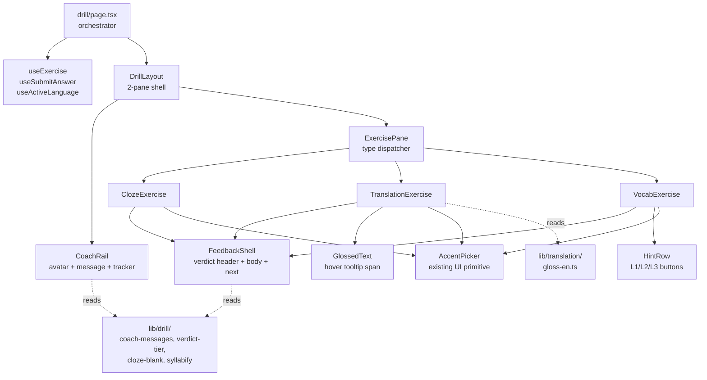

# Design Document

## Overview

Phase F replaces the monolithic 560-line `apps/web/app/(dashboard)/drill/page.tsx` with a coach-rail-plus-main-area layout, decomposes the three exercise renderers into dedicated client components, and ships a shared verdict-tier feedback shell. Coach messages and verdict tiers are pure functions of `EvaluationResult.score` + `errors` + `ExerciseContent`, so no API changes are required. Gloss tooltips for translation read from a static word list shipped in this phase. Hint usage and MC scaffolding are local React state that surface on the verdict UI but are not yet plumbed to the API.

The page-level orchestrator keeps the existing TanStack Query wiring (`useExercise`, `useSubmitAnswer`, `useLanguageProfiles`) unchanged. Decomposition is purely structural: the new components are co-located under `apps/web/app/(dashboard)/drill/_components/` (Next.js App Router convention for route-private modules), and a small set of pure helpers move to `apps/web/lib/drill/`.

## Steering Document Alignment

### Technical Standards (tech.md)
- **Next.js App Router + TypeScript**: All new files are TSX with explicit `'use client'` directives where they touch local state, hover behavior, or refs (everything inside `_components/` and the page itself).
- **Tailwind v4 design tokens**: Components consume CSS variables (`--color-paper-2`, `--color-accent-soft`, `--color-ok-soft`, `--color-hilite-soft`, `--spacing-s-3`…`s-7`, `--radius-r-lg`) from `apps/web/app/globals.css` via Tailwind utility classes. No new CSS files.
- **TanStack Query**: The page continues to use `useExercise` / `useSubmitAnswer`. Per-exercise local state is `useState`/`useReducer`; query state remains in the cache. No new hooks are added for server state in this phase. The vocabulary tracker referenced by Req 5 AC #6 is hidden in v1 because no `GET /history` endpoint exists in `infra/lambda/src/routes/`; the tracker slot is kept in the layout so a future phase can drop in a count without rework.
- **Zod**: No new schemas — we reuse `ExerciseResponse`, `EvaluationResultResponse`, and the `ExerciseContent` discriminated union from `@language-drill/shared`.
- **`packages/shared` for cross-cutting types**: All new derived types (verdict tiers, coach message keys, gloss entries) live in `apps/web/lib/drill/` because they are web-only display concerns. They do not belong in `packages/shared` until/unless mobile reuses them.

### Project Structure (structure.md)
- Route-private code lives under `apps/web/app/(dashboard)/drill/_components/`. The leading underscore opts the directory out of routing per Next.js conventions and signals "owned by the drill route".
- Pure helpers (verdict tier mapping, coach message picker, gloss lookup, syllable formatter) live under `apps/web/lib/drill/` so they are import-cheap, testable in isolation, and don't bloat the route bundle.
- The static gloss list lives at `apps/web/lib/translation/gloss-en.ts` (named `lib/translation/` rather than `lib/drill/` because it will be reused by Phase J's Read & Collect annotated reader).
- New tests sit next to the components they cover (`page.test.tsx` next to `page.tsx`; per-component tests in `_components/__tests__/`). Existing UI primitive tests in `apps/web/components/ui/__tests__/` are untouched.

## Code Reuse Analysis

### Existing Components to Leverage
- **`Button`, `Card`, `Chip`, `Choice`, `Input`, `Textarea`, `AccentPicker`** (from `apps/web/components/ui/`): the redesign uses these as-is — no new variants, no API changes. `Choice` already supports the pill rendering needed for cloze MC mode.
- **`useExercise`, `useSubmitAnswer`, `useLanguageProfiles`** (from `@language-drill/api-client`): the new `page.tsx` keeps the exact same hook calls and query keys. Invalidation behavior on submit success is preserved.
- **`useActiveLanguage` hook** (exported from `apps/web/components/shell/active-language-provider.tsx`; the cookie helpers in `apps/web/lib/active-language.ts` are read by the provider, not the components directly): the page reads this hook to drive `AccentPicker.language` and gloss lookup keys.
- **`Bar`** (from `apps/web/components/ui/bar.tsx`): the 3px progress strip in `DrillLayout` reuses the `Bar` primitive at `size="thin"` rather than a hand-rolled `<div>` (assuming `Bar` exposes a thin variant; if it doesn't, the design ships a 3px wrapper that still composes `Bar` so design-system updates propagate).
- **`isClozeContent`, `isTranslationContent`, `isVocabRecallContent`** (from `@language-drill/shared`): preserved as the dispatch mechanism in `ExercisePane`.
- **`cn`** (from `apps/web/lib/cn.ts`): used for all conditional class composition.

### Integration Points
- **`GET /exercises?language=…&difficulty=…`** — unchanged. Same `ExerciseResponse` shape.
- **`POST /exercises/:id/submit`** — unchanged. Same `EvaluationResultResponse` shape. The `usedMc`/`hintLevel` fields are deliberately *not* sent in v1; a follow-up phase will add them once the progress signal model is finalized.
- **Clerk auth**: Submission flow already runs through `useAuthenticatedFetch`; nothing changes.
- **Active language context**: `ActiveLanguageProvider` already wraps `(dashboard)/`. The redesigned components read from this rather than threading props through the page.
- **`(dashboard)` layout**: `app-shell.tsx` provides the 220px nav rail (Phase B). The new 280px coach rail sits inside the dashboard's main slot, *to the right of* the nav. Total left chrome at desktop = 220 + 280 = 500px; on viewport widths between 900–1200px we keep both rails (the prototypes show this is acceptable). Below 900px, the coach rail collapses above the main area as defined in Req 1 AC #3.

## Architecture

The redesigned `/drill` page splits into three layers: the page-level orchestrator, the layout shell, and the per-type exercise renderers. A small set of pure helpers turns `EvaluationResult` and `ExerciseContent` into UI-ready view models (verdict tier, coach message, hint state).



**State ownership**:
- The **page** owns: language, difficulty, the `useExercise` query result, the `useSubmitAnswer` mutation, and the `submission` discriminated union (idle / submitting / evaluated / error).
- Each **exercise component** owns *all* of its own transient state — the draft answer, `usedMc` (cloze), `hintLevel` (vocab), `hintCount` (translation). The page does NOT own the draft.
- The page renders each exercise component with `key={exercise.id}`. When the exercise id changes, React unmounts the old component and mounts a fresh one with default state — answer, hints, and mode are all reset.

**Why `key={exercise.id}` instead of effects**: it eliminates the entire class of "stale state from previous exercise" bugs (current code has a similar pattern with `useEffect` resetting `answer` and `evaluation`; key-based reset is simpler and crash-proof). It also keeps draft ownership cleanly inside the renderer — no two-place state coordination between the page and the component.

**Auto-focus rule (applies to all three components)**: each exercise component focuses its primary text input on mount. Because the renderer is keyed on `exercise.id`, this means a new exercise always lands focus in the input, satisfying the Usability NFR.

## Components and Interfaces

All new components are client components (`'use client'`).

### `DrillLayout`
- **File**: `apps/web/app/(dashboard)/drill/_components/drill-layout.tsx`
- **Purpose:** Renders the 280px coach rail + main area shell with the 3px progress bar. Handles the < 900px collapse and the loading skeleton frame.
- **Props:** `{ rail: ReactNode, main: ReactNode, progressFraction?: number, isLoading?: boolean }` — `progressFraction` ∈ [0, 1]; defaults to 0. `isLoading` swaps the main slot for a `LoadingSkeleton` block; the rail still renders so the page frame is stable across loading → loaded transitions (Req 1 AC #5).
- **Reuses:** `Bar` primitive for the 3px strip; Tailwind tokens otherwise.
- **Notes:** Uses CSS Grid with `grid-template-columns: 280px 1fr` at ≥ 900px and a single-column flow below. The progress bar is pinned to the top of the *main* area, not the page (the dashboard nav rail extends full height).
- **v1 progress note:** `progressFraction` defaults to 0. Phase E (Session Flow) wires real session progress into the page; until then, the page passes 0 and the bar shows only the unfilled track. (Earlier draft suggested a 0.5 visual stub; rejected because a fixed bar with no semantics is misleading.)

### `CoachRail`
- **File**: `apps/web/app/(dashboard)/drill/_components/coach-rail.tsx`
- **Purpose:** The persona block: avatar + label + dynamic coach message + optional vocabulary tracker.
- **Props:** `{ message: string, exerciseType: ExerciseType, vocabActiveCount?: number }`
- **Reuses:** `Card` (for the message bubble).
- **Behavior:** When `message` changes, the inner card re-keys (`key={message}`) so React triggers the 150ms fade-in via a CSS keyframe `coach-fade-in`. The keyframe is added to `globals.css` in this phase.
- **Vocabulary tracker:** Only renders when `vocabActiveCount` is a non-null number AND `exerciseType === 'vocab_recall'`. Otherwise the slot is empty (no placeholder).

### `ExercisePane`
- **File**: `apps/web/app/(dashboard)/drill/_components/exercise-pane.tsx`
- **Purpose:** Dispatches `ExerciseContent` to the right type-specific renderer via `isClozeContent` / `isTranslationContent` / `isVocabRecallContent` type guards.
- **Props:**
  ```
  {
    exercise: ExerciseResponse
    language: LearningLanguage
    submission: { kind: 'idle' | 'submitting' | 'evaluated' | 'error', evaluation?: EvaluationResult, error?: Error }
    onSubmit: (answer: string, meta: SubmissionMeta) => void
    onNext: () => void
  }
  ```
  where `SubmissionMeta = { usedMc?: boolean, hintLevel?: 0 | 1 | 2 | 3, hintCount?: number }`. Meta is recorded for v1 display only; not forwarded to the API.

**Post-submission read-only invariant (Req 6 AC #5)**: every type-specific renderer keeps its input area visible after a submission. When `submission.kind === 'submitting' | 'evaluated'`, the input control is `readOnly` (or `disabled` for `Choice` pills) with `opacity: 0.6`. The verdict shell renders below — never instead of — the input. This is enforced by the type-specific components themselves so the rule is local and testable per renderer.

**Accent picker disabled state (Req 7 AC #4)**: each exercise component passes a `disabled` prop down to its accent-chip row whenever the input is read-only. The existing `AccentPicker` already disables its chips when its `targetRef.current` is null/disabled, so threading `disabled={submission.kind !== 'idle'}` is sufficient.

### `ClozeExercise`
- **File**: `apps/web/app/(dashboard)/drill/_components/cloze-exercise.tsx`
- **Purpose:** Renders the cloze prompt + type-it input + optional MC toggle.
- **Props:** `{ content: ClozeContent, language: LearningLanguage, submission: SubmissionState, onSubmit, onNext }`
- **Reuses:** `Input`, `AccentPicker`, `Choice`, `Button`, `FeedbackShell`, `cloze-blank` helper, `coach-messages` helper.
- **Local state:** `mode: 'type' | 'mc'`, `answer: string`, `selectedOption: string | null`. `usedMc` is derived as `mode === 'mc' || hasEverBeenMc`.

### `TranslationExercise`
- **File**: `apps/web/app/(dashboard)/drill/_components/translation-exercise.tsx`
- **Purpose:** Renders the eyebrow, glossed source text, textarea, hint button, and feedback (with diff rendering).
- **Props:** Same shape as `ClozeExercise`, with `content: TranslationContent`.
- **Reuses:** `Textarea`, `AccentPicker`, `Button`, `Chip`, `GlossedText`, `FeedbackShell`, `gloss-en` lookup.
- **Local state:** `answer: string`, `hintCount: 0 | 1 | 2 | 3`.
- **Hint reveal pipeline** (per Req 4 AC #3, computed from `content.sourceText` + `content.referenceTranslation` only — no other content fields are required):
  - **Counter 1**: surface the first token in the source text that has a `gloss-en.ts` entry, rendered as `{lemma} — {gloss}`. If no token in the source has a gloss entry, skip directly to the counter-2 reveal but still increment to 1.
  - **Counter 2**: surface the first ~half of `content.referenceTranslation`, sliced at the nearest whitespace boundary to `Math.ceil(text.length / 2)`, suffixed with "…".
  - **Counter 3**: surface the full `content.referenceTranslation`.
  - The hint button hides when `hintCount === 3`.

### `VocabExercise`
- **File**: `apps/web/app/(dashboard)/drill/_components/vocab-exercise.tsx`
- **Purpose:** Renders the definition card, input, accent picker, hint row, and feedback (with confusions list).
- **Props:** Same shape as `ClozeExercise`, with `content: VocabRecallContent`.
- **Reuses:** `Input`, `AccentPicker`, `Card`, `Button`, `HintRow`, `FeedbackShell`, `syllabify` helper, `parse-confusions` helper.
- **Local state:** `answer: string`, `hintLevel: 0 | 1 | 2 | 3`. The component auto-focuses its input on mount.

### `FeedbackShell`
- **File**: `apps/web/app/(dashboard)/drill/_components/feedback-shell.tsx`
- **Purpose:** Shared verdict container — header (tier name + score chip + optional `scaffolded`/`hint level N` chips), body (slot for type-specific content), footer (single "next" button).
- **Props:**
  ```
  {
    tier: VerdictTier
    label: string         // e.g. "spot on", "right word · wrong inflection"
    scoreChipText: string // e.g. "94%"
    scaffolded?: boolean
    hintLevel?: 0 | 1 | 2 | 3
    children: ReactNode   // the body
    onNext: () => void
  }
  ```
- **Reuses:** `Chip`, `Button`, `Card`. Background is one of three soft tokens chosen by `tier`.

### `GlossedText`
- **File**: `apps/web/app/(dashboard)/drill/_components/glossed-text.tsx`
- **Purpose:** Renders source text with hoverable gloss tooltips on words present in the static gloss list.
- **Props:** `{ text: string }`
- **Reuses:** `lib/translation/gloss-en.ts` for the lookup.
- **Implementation:** Splits text on whitespace, looks up each token (lowercased, punctuation stripped), wraps glossed tokens in a `<span>` with `border-bottom: 1px dotted` and a child `<span class="tooltip">` shown via CSS `:hover`/`:focus-within` — no JS hover handler. The tooltip is positioned absolutely with `bottom: 100%` and is screen-reader-readable as the trailing span text.

### `HintRow`
- **File**: `apps/web/app/(dashboard)/drill/_components/hint-row.tsx`
- **Purpose:** Three sequential hint buttons for vocab. Disabled in document order.
- **Props:**
  ```
  {
    expectedWord: string
    exampleSentence?: string  // hides L3 if empty
    level: 0 | 1 | 2 | 3
    onAdvance: () => void  // increments level by 1
  }
  ```
- **Reuses:** `Button`, `syllabify` helper.

### `lib/drill/verdict-tier.ts`
Pure helpers, no React:
```
type VerdictTier = 'sage' | 'yellow' | 'terracotta'

type VerdictResult = { tier: VerdictTier; label: string }

function clozeVerdict(score: number): VerdictResult
// score >= 0.95 → { sage, "spot on" }
// 0.7 <= score < 0.95 → { yellow, "close" }
// 0.4 <= score < 0.7 → { yellow, "off — see why" }
// score < 0.4 → { terracotta, "wrong" }

function translationVerdict(score: number): VerdictResult
// score >= 0.95 → { sage, "spot on" }
// 0.7..0.95 → { yellow, "meaning is right · small issues" }
// 0.4..0.7 → { yellow, "gist is there · grammar drifted" }
// < 0.4 → { terracotta, "not quite" }

function vocabVerdict(score: number, errors: EvaluationError[]): VerdictResult
// Conditional precedence (evaluate top-to-bottom; first match wins):
//   1. score === 1.0                                              → { sage, "exact" }
//   2. 0.7 <= score < 1.0  AND any grammar error                  → { yellow, "right word · wrong inflection" }
//   3. 0.6 <= score < 1.0  AND any spelling error AND no grammar  → { yellow, "spelling slipped" }
//   4. 0.6 <= score < 1.0  (fallback inside band)                 → { yellow, "close" }
//   5. score < 0.6                                                → { terracotta, "wrong" }
```

### `lib/drill/coach-messages.ts`
Pure helpers:
```
type CoachContext =
  | { kind: 'idle'; type: ExerciseType }
  | { kind: 'evaluated'; type: ExerciseType; score: number }

function coachMessage(ctx: CoachContext): string
// per-type idle messages from Req 2 AC #2
// score-tier messages from Req 2 AC #3 (4 tiers, 1 string per tier per type)
```

The strings are hard-coded in this module (no i18n yet — UI copy is in English). Tests assert that all 12 (3 types × 4 tiers) evaluated messages are non-empty and distinct within a type.

### `lib/drill/cloze-blank.ts`
```
function splitClozeSentence(sentence: string): { before: string; after: string; hasBlank: boolean }
// Splits on the first occurrence of "___" or "____" (existing data convention).
// The component renders <span>before</span><span class="blank">?</span><span>after</span>.
// If no blank marker is found, returns { before: sentence, after: '', hasBlank: false }
// and the component skips the blank span.
```

### `lib/drill/syllabify.ts`
```
function letterCountLabel(word: string): string
// returns `${word.length} letters`. Per Req 5 AC #2 we deliberately ship
// letter count instead of syllable count for v1.
```

### `lib/drill/parse-confusions.ts`
```
function parseConfusions(feedback: string): Array<{ a: string; b: string }>
// Uses /([\p{L}]+)\s+(?:vs\.?|\/|or)\s+([\p{L}]+)/gu, returns deduped pairs.
// Caps at 3 results so the UI doesn't get noisy.
```

### `lib/translation/gloss-en.ts`
The static word list:
```
type GlossEntry = { pos: 'noun' | 'verb' | 'adj' | 'adv' | 'phrase'; gloss: string }
export const ENGLISH_GLOSS: Record<string /* lowercased lemma */, GlossEntry>
```
Initial seed: ≥ 60 entries hand-picked for the existing pre-generated translation exercises (verbs and idioms most likely to confuse intermediate ES/DE/TR learners — e.g., "afford", "nevertheless", "barely", "outgrow"). The list is curated, not exhaustive — words not present render as plain text. Tests assert the floor at ≥ 60.

## Data Models

No database changes. Web-only types:

### `VerdictTier`
```
type VerdictTier = 'sage' | 'yellow' | 'terracotta'

const TIER_BG: Record<VerdictTier, string> = {
  sage: 'bg-[var(--color-ok-soft)]',
  yellow: 'bg-[var(--color-hilite-soft)]',
  terracotta: 'bg-[var(--color-accent-soft)]',
}

const TIER_INK: Record<VerdictTier, string> = {
  sage: 'text-[var(--color-ok)]',
  yellow: 'text-[var(--color-ink)]',
  terracotta: 'text-[var(--color-accent-2)]',
}
```

### `SubmissionMeta`
```
type SubmissionMeta = {
  usedMc?: boolean       // cloze
  hintLevel?: 0 | 1 | 2 | 3  // vocab
  hintCount?: number     // translation
}
```
Recorded in component-local state only. The on-submit callback receives this for display purposes; it is not serialized into the API call body.

### `GlossEntry`
```
type GlossEntry = {
  pos: 'noun' | 'verb' | 'adj' | 'adv' | 'phrase'
  gloss: string  // a short English-paraphrase definition, ≤ 60 chars
}
```

### `CoachMessageKey`
Implicit in `coach-messages.ts` — three exercise types × four tiers + three idle messages = 15 hard-coded strings.

## Page-level orchestrator: `drill/page.tsx`

The new `page.tsx` is ≤ 200 lines. Responsibilities:

1. Read active language from context, persist last-selected difficulty in component state (default B1).
2. Call `useExercise` and `useSubmitAnswer` (unchanged).
3. Track local submission UI state via a simple discriminated union:
   ```
   type SubmissionState =
     | { kind: 'idle' }
     | { kind: 'submitting' }
     | { kind: 'evaluated'; result: EvaluationResult; meta: SubmissionMeta }
     | { kind: 'error'; error: Error }
   ```
4. Render `<DrillLayout rail={<CoachRail …/>} main={<ExercisePane …/>} progressFraction={…} />`.
5. Provide `onSubmit(answer, meta)` (calls the mutation, transitions state) and `onNext()` (resets state, invalidates query — same behavior as today).
6. Pre-language-selection state (no language picked): render selectors directly in main, hide the rail (Req 1 AC #4).

`progressFraction` for v1 is a stub fixed at 0.5 (visual only; full session-progress wiring belongs to Phase E — Session Flow). Documented as such in a one-line comment.

## Error Handling

### Error Scenarios
1. **`useExercise` returns 404 (no matching exercises)**
   - **Handling:** `ExercisePane` renders the existing `NoExercisesMessage` styled with new tokens.
   - **User Impact:** Sees "no exercises available for {language}/{difficulty}" with a hint to try a different difficulty. Coach rail still shows the idle message.

2. **`useSubmitAnswer` returns 429 (rate limit)**
   - **Handling:** `submission.state === 'error'` with the rate-limit message preserved verbatim from the existing implementation. `FeedbackShell` is not rendered; the error is rendered in place.
   - **User Impact:** Sees "you've hit today's evaluation limit — try again tomorrow" with no "next" button.

3. **`useSubmitAnswer` returns 502 (Claude unavailable)**
   - **Handling:** Same path as 429 with a different message.
   - **User Impact:** Sees "the coach is offline right now — your answer didn't count, try again in a moment". Submit button re-enables so the user can retry.

4. **`EvaluationResult.errors` row missing fields (defensive)**
   - **Handling:** Diff renderer skips rows where `text`, `correction`, or `severity` is missing. No throw.
   - **User Impact:** Verdict still renders; one or more diff rows are silently absent. Console warning in dev only.

5. **`contentJson.options` undefined for cloze**
   - **Handling:** MC toggle hidden (Req 3 AC #2 logic short-circuits).
   - **User Impact:** Type-it is the only mode; user is unaware of an absent toggle.

6. **`contentJson.exampleSentence` empty for vocab**
   - **Handling:** L3 hint button hidden (Req 5 NFR — Reliability).
   - **User Impact:** Only L1 and L2 hints available.

7. **Active language cookie missing or invalid** (already handled by Phase B's provider)
   - **Handling:** Page redirects via `redirect()` to onboarding or shows the language selector. No new logic required here.

## Testing Strategy

### Unit Testing
- `lib/drill/verdict-tier.ts`: table-driven tests covering every score band for all three types, including edge values (0.0, 0.4, 0.6, 0.7, 0.95, 1.0). Validates label and tier independently.
- `lib/drill/coach-messages.ts`: asserts 15 strings exist, all non-empty, no duplicates within a type, one assertion per (type, tier).
- `lib/drill/cloze-blank.ts`: tests for "no blank", "blank at start", "blank at end", "blank in middle", "double blank" (only first split).
- `lib/drill/syllabify.ts`: trivial test that `letterCountLabel('aprovechar')` returns `'10 letters'`.
- `lib/drill/parse-confusions.ts`: tests for "vs" / "/" / "or" patterns, dedupe, 3-result cap, no-match returns `[]`.
- `lib/translation/gloss-en.ts`: type-level test ensuring shape; runtime test asserting ≥ 60 entries and no empty glosses.

### Integration Testing
For each exercise component (`ClozeExercise`, `TranslationExercise`, `VocabExercise`):
- Render-with-default-props happy path.
- Render-with-each-variant-prop (e.g., cloze with vs without options; vocab with vs without `exampleSentence`).
- One user interaction (cloze: toggle MC and pick a pill; translation: hover gloss and assert tooltip text in DOM; vocab: click L1 hint and assert first-letter reveal).
- Parameterized snapshot across `ES`, `DE`, `TR` — assert the right `AccentPicker` chips render.
- Submission flow: stub `onSubmit`, fill input, click submit, assert `onSubmit` called with `(answer, expectedMeta)`.
- Evaluated state: pass a `submission` prop with `state: 'evaluated'` and assert the verdict tier label, score chip text, and (for translation) at least one diff row from `EvaluationResult.errors`.

For `FeedbackShell`:
- Tier → background mapping for all three tiers.
- Renders `scaffolded` chip when `scaffolded` is true; doesn't render it when false/undefined.
- Renders `hint level N` chip when `hintLevel > 0`; doesn't render when 0/undefined.
- "Next" button calls `onNext` once.

For `CoachRail`:
- Idle state for each exercise type renders the matching idle message.
- Evaluated state — table test across (type, tier) pairs.
- Vocabulary tracker hidden when `vocabActiveCount` is undefined.
- Vocabulary tracker rendered with `{N} active words` when the count is provided.

For `DrillLayout`:
- Renders both slots when both are provided.
- Progress bar at 0% renders only the unfilled track; at 50% renders 50% accent; at 100% renders fully filled.
- (Layout collapse below 900px is CSS-only; tested by snapshot, not by media-query simulation.)

For `GlossedText`:
- Words present in `ENGLISH_GLOSS` get the dotted-underline class; words absent do not.
- The tooltip text is in the DOM (not display:none JS-mounted) so it is screen-reader-accessible.

For `page.tsx` (the orchestrator):
- Replaces the existing 555-line `page.test.tsx` with a slimmer suite that focuses on integration: page renders, language/difficulty selectors work, hooks are called with the right args, submission round-trips, error-state UI shows for 429/502, "next" clears state. Per-type rendering details are covered by the per-component tests above; this file no longer asserts those.
- Test count target per Req 8 AC #1: ≥ 5 rendering, ≥ 4 per-type rendering (parameterized by content fixture), ≥ 4 submission, ≥ 2 error, ≥ 4 evaluation display, ≥ 3 score-styling. Score-styling assertions move to the verdict-tier unit test where they belong, and the page test asserts that the FeedbackShell receives the right tier prop (one assertion per band).

### End-to-End Testing
Out of scope for this phase. The current repo has no Playwright/Cypress harness; adding one is a separate decision. All interactions are covered by component-level RTL tests against jsdom.
