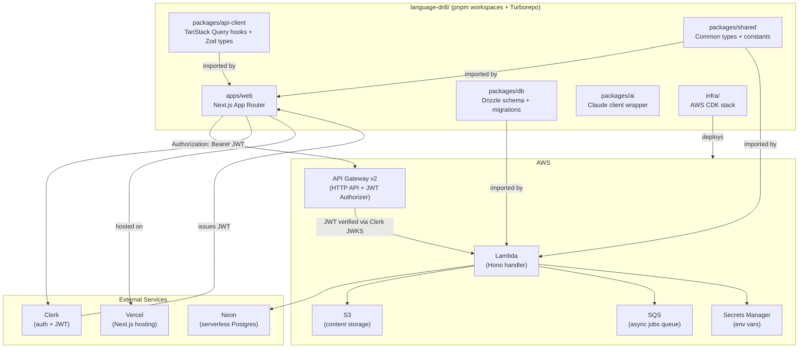
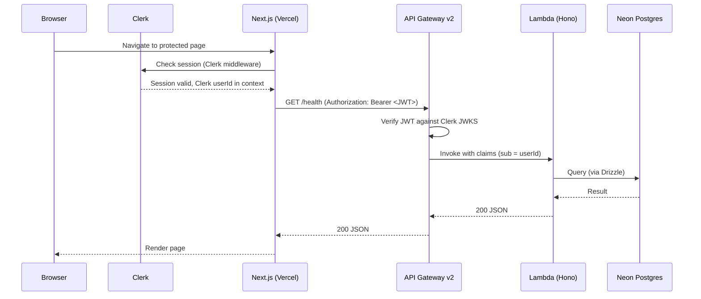
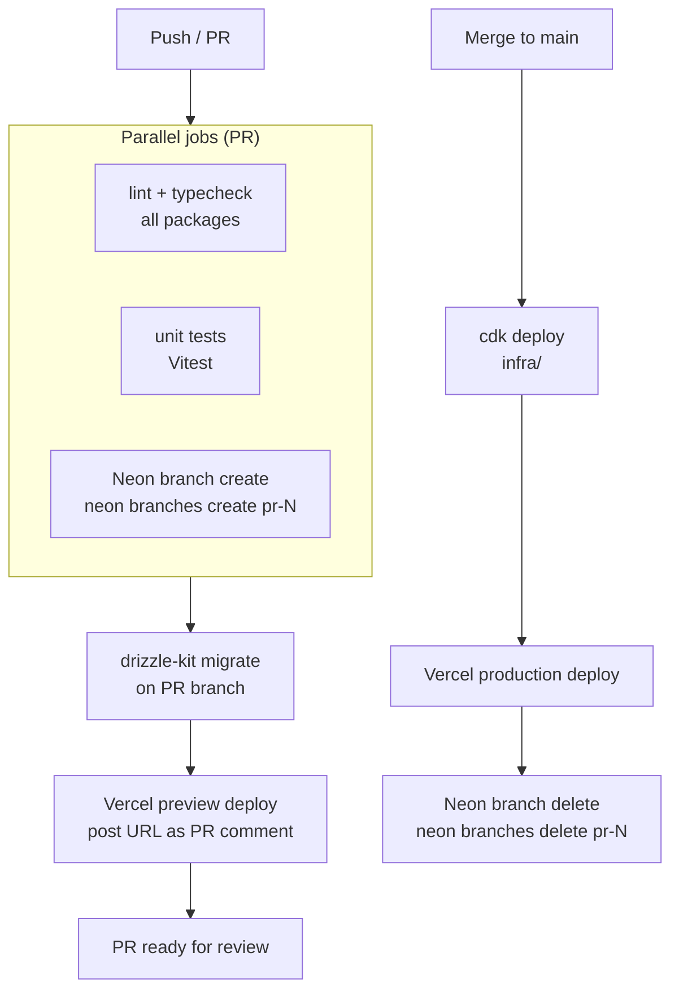

# Design Document

## Overview

The Foundation phase builds the complete scaffolding for Language Drill: a pnpm + Turborepo monorepo containing a Next.js web app, shared packages, an AWS Lambda backend (Hono), a Neon Postgres database (Drizzle ORM), Clerk authentication, and a GitHub Actions CI/CD pipeline with per-PR Neon branches and Vercel preview deploys. Nothing is user-facing beyond the Clerk sign-in flow and an invite-code gate. Every piece of infrastructure in this phase exists to support phases 1–4 without re-architecting.

## Steering Document Alignment

### Technical Standards (tech.md)

| Decision | Design choice | Source |
|---|---|---|
| Monorepo tooling | pnpm workspaces + Turborepo | tech.md §2, §4 |
| Backend runtime | AWS Lambda + Hono + API Gateway v2 | tech.md §2 |
| IaC | AWS CDK (TypeScript) | tech.md §2 |
| Database | Neon + Drizzle ORM | tech.md §2 |
| Auth | Clerk (JWT forwarded to API Gateway JWT Authorizer) | tech.md §2, §4 |
| Frontend hosting | Vercel (Next.js App Router) | tech.md §2 |
| Secrets | AWS Secrets Manager (Lambda) + GitHub Actions Secrets (CI) | tech.md §12 |

The Lambda backend is kept separate from Next.js API routes intentionally — the mobile app (Phase 4) needs the same API from day one, and rate-limiting is easier at the Lambda level.

### Project Structure (structure.md)

No `structure.md` exists yet — this spec defines the canonical layout. All future packages and apps follow this structure and the conventions established here.

## Code Reuse Analysis

This is a greenfield project. There is no existing application code to reuse. The design leverages:

### External packages to leverage
- **`hono`** — Lightweight Lambda-native HTTP framework; replaces Express with zero overhead
- **`drizzle-orm` + `drizzle-kit`** — Schema-as-code ORM; migrations generated from TypeScript definitions
- **`@clerk/nextjs`** — Clerk React SDK for App Router middleware and server components
- **`@neondatabase/serverless`** — Neon's WebSocket-based Postgres driver optimised for Lambda environments
- **`aws-cdk-lib`** — CDK constructs for Lambda, API Gateway v2, S3, SQS
- **`zod`** — Shared schema validation between packages

### Integration Points
- **Clerk → API Gateway**: Clerk public JWKS endpoint is registered as the API Gateway JWT Authorizer. No custom auth Lambda required.
- **Lambda → Neon**: Lambda connects via `@neondatabase/serverless` using `DATABASE_URL` from Secrets Manager.
- **CI → Neon**: GitHub Actions uses the Neon API to branch/delete ephemeral databases per PR.
- **CI → Vercel**: Vercel CLI / GitHub integration triggers preview and production deploys.
- **CI → CDK**: `cdk deploy` runs from GitHub Actions with AWS credentials from Secrets Manager.

## Architecture



### Request flow (authenticated API call)



## Components and Interfaces

### Component 1 — Monorepo Root (`/`)

- **Purpose:** Workspace root — declares pnpm workspaces, Turborepo pipeline, shared dev tooling (ESLint, TypeScript, Prettier configs)
- **Key files:** `package.json`, `pnpm-workspace.yaml`, `turbo.json`, `tsconfig.base.json`, `.eslintrc.base.js`
- **Turborepo pipeline tasks:** `build`, `dev`, `lint`, `typecheck`, `test`; each with correct `dependsOn` and `outputs` so caching works
- **Dependencies:** None (root config only)
- **Reuses:** N/A (greenfield — this component defines the conventions all others follow)

### Component 2 — `packages/shared`

- **Purpose:** Common TypeScript types, constants, and utility functions shared across web, Lambda, and future mobile
- **Key exports:** `Language` enum (`EN | ES | DE | TR`), `CefrLevel` enum (`A1…C2`), `ApiError` type, `InviteCode` type
- **Dependencies:** None (zero runtime deps — pure types and constants)
- **Reuses:** Nothing (foundational package)

### Component 3 — `packages/db`

- **Purpose:** Drizzle schema definitions, migration files, and a database client factory used by the Lambda
- **Key exports:** All Drizzle table definitions, `db` client (created with `@neondatabase/serverless` + Drizzle), `schema` object for type inference
- **Interfaces:**
  ```ts
  // packages/db/src/client.ts
  export function createDb(connectionString: string): DrizzleDb
  export type Db = ReturnType<typeof createDb>
  ```
- **Dependencies:** `drizzle-orm`, `@neondatabase/serverless`, `drizzle-kit` (dev)
- **Migration strategy:** `drizzle-kit generate` produces SQL in `packages/db/migrations/`; `drizzle-kit migrate` applies them. Migration files are committed and forward-only.

### Component 4 — `packages/ai`

- **Purpose:** Thin Claude API client wrapper and prompt template registry. Empty in Phase 0; structure established so Phase 1 can add evaluation prompts without touching Lambda code.
- **Key exports:** `createClaudeClient(apiKey: string)`, `PromptTemplate` type (stub)
- **Dependencies:** `@anthropic-ai/sdk`

### Component 5 — `packages/api-client`

- **Purpose:** TanStack Query hooks and Zod request/response schemas shared between web and mobile
- **Key exports:** Zod schemas for all API request/response shapes; TanStack Query hooks (Phase 1 will populate; Phase 0 establishes structure + health-check hook)
- **Dependencies:** `@tanstack/react-query`, `zod`, `packages/shared`

### Component 6 — `apps/web` (Next.js)

- **Purpose:** Web frontend — App Router, Clerk middleware, initial authenticated shell (no exercise UI yet)
- **Key files:**
  - `middleware.ts` — Clerk `authMiddleware` protecting all routes except `/sign-in`
  - `app/layout.tsx` — `ClerkProvider` wrapping the entire app
  - `app/sign-in/[[...sign-in]]/page.tsx` — Clerk `<SignIn>` component
  - `app/(dashboard)/page.tsx` — Placeholder authenticated home page
  - `lib/api.ts` — Base API fetch helper that reads Clerk JWT and sets `Authorization` header
- **Dependencies:** `@clerk/nextjs`, `packages/api-client`, `packages/shared`

### Component 7 — Lambda Handler (`infra/lambda/src/`)

- **Purpose:** Hono HTTP app deployed as a Lambda function; routes registered per feature area
- **Key files:**
  - `infra/lambda/src/index.ts` — Hono app + `handle(app)` Lambda adapter
  - `infra/lambda/src/routes/health.ts` — `GET /health` → `{ status: "ok", ts: <unix> }`
  - `infra/lambda/src/middleware/auth.ts` — Reads `sub` from JWT claims, attaches `userId` to Hono context
  - `infra/lambda/src/middleware/invite.ts` — Checks `invitations` table; returns 403 if no valid record
  - `infra/lambda/src/db.ts` — Creates `Db` instance from `DATABASE_URL` env var (singleton per Lambda instance)
- **Dependencies:** `hono`, `packages/db`, `packages/shared`

### Component 8 — CDK Stack (`infra/lib/`)

- **Purpose:** Defines all AWS resources as CDK constructs; single stack for Phase 0
- **Key constructs:**
  - `LambdaStack` — `NodejsFunction` (esbuild bundler, handler in `infra/lambda/src/index.ts`); bundling options: `minify: true`, `sourceMap: true`, `externalModules: []` — all deps bundled for cold-start minimisation. `@neondatabase/serverless` uses HTTP/WebSocket (no native binaries), so it bundles cleanly.
  - `ApiGatewayStack` — `HttpApi` with `HttpJwtAuthorizer` pointing at Clerk JWKS URL (`https://<clerk-domain>/.well-known/jwks.json`). CORS: `allowOrigins: ['https://*.vercel.app', 'https://<production-domain>']`, `allowMethods: [CorsHttpMethod.GET, CorsHttpMethod.POST, CorsHttpMethod.PUT, CorsHttpMethod.DELETE]`, `allowHeaders: ['Authorization', 'Content-Type']`.
  - `StorageStack` — `Bucket` (private, versioned, lifecycle rules, `blockPublicAccess: BlockPublicAccess.BLOCK_ALL`)
  - `QueueStack` — `Queue` (standard; DLQ attached; visibility timeout 6× Lambda timeout per AWS recommendation)
- **Secrets:** `DATABASE_URL`, `CLERK_SECRET_KEY`, `ANTHROPIC_API_KEY` (placeholder), `UPSTASH_REDIS_URL` (placeholder) all read from Secrets Manager at synth time and injected as Lambda env vars
- **Dependencies:** `aws-cdk-lib`, `constructs`

### Component 9 — CI/CD Pipeline (`.github/workflows/`)

- **Purpose:** Automated quality gates and deploys via GitHub Actions
- **Key files:**
  - `.github/workflows/ci.yml` — PR workflow: lint + typecheck + unit tests + Neon branch + Vercel preview
  - `.github/workflows/deploy.yml` — Main branch workflow: CDK deploy + Vercel production deploy + Neon cleanup
- **Neon connection string propagation:** The "Neon branch create" step uses `neonctl branches create --name pr-${{ github.event.number }}` and captures the connection string via `--output json` piped through `jq`. The value is set as a masked step output (`echo "DATABASE_URL=..." >> $GITHUB_OUTPUT`) and consumed by the subsequent `drizzle-kit migrate` step via `env: DATABASE_URL: ${{ steps.neon-create.outputs.DATABASE_URL }}`.
- **Turborepo remote caching:** `TURBO_TOKEN` and `TURBO_TEAM` are stored as GitHub Actions Secrets and consumed automatically by Turborepo. This activates Vercel Remote Cache for the monorepo, reducing CI build times on cache hits.

### Component 10 — Invite Gate (Clerk Allowlist + Lambda middleware)

- **Purpose:** Validates that every authenticated user has a consumed invite record before any API call succeeds
- **Two layers (both required):**
  1. **Clerk Allowlist / Invitations (signup gate):** Use Clerk's built-in Invitations feature (dashboard → User & Authentication → Invitations). The app owner creates invite codes in the Clerk dashboard or via Clerk's Management API; Clerk blocks account creation if no valid invitation is present. This satisfies R6.1 and R6.3 — Clerk itself blocks the account, no custom webhook needed.
  2. **Lambda `invite` middleware (API gate, defense-in-depth):** On every authenticated request, query `invitations WHERE used_by = $userId AND used_at IS NOT NULL`; return 403 if none found. When a user first successfully signs up via Clerk, a `user.created` Clerk webhook triggers a Lambda that marks the corresponding `invitations` row (`usedBy`, `usedAt`) and inserts a row into `users`. This is the only required webhook; it is not optional.
- **Webhook handler:** `infra/lambda/src/routes/webhooks/clerk.ts` — verifies Clerk webhook signature (`svix`), handles `user.created` event: upserts `users` row, marks `invitations` row as used.
- **Seed script:** `packages/db/scripts/seed-invites.ts` — inserts rows into `invitations` with configurable codes, expiry, and batch size (for use in development; production codes created via Clerk dashboard)

## Data Models

### Core Schema (Drizzle, `packages/db/src/schema/`)

```ts
// users
users {
  id: text (primary key — Clerk user ID, e.g. "user_2abc...")
  email: text (not null, unique)
  createdAt: timestamp (default now())
  updatedAt: timestamp
}

// user_language_profiles
user_language_profiles {
  id: uuid (primary key)
  userId: text (FK → users.id)
  language: text (EN | ES | DE | TR)
  proficiencyLevel: text (A1 | A2 | B1 | B2 | C1 | C2)
  assessedAt: timestamp
}

// skills
// Design decision: skills are language-scoped (4 languages × 4 macro-skills = 16 seed rows).
// This allows language-specific skill_topic trees and simplifies query joins at the cost of
// 16 seed rows instead of 4. Language-agnostic skills would require a join through
// user_language_profiles to filter; language-scoped is simpler for Phase 0-1 query patterns.
skills {
  id: uuid (primary key)
  name: text (listening | reading | writing | speaking)
  language: text (EN | ES | DE | TR)
}

// skill_topics
skill_topics {
  id: uuid (primary key)
  skillId: uuid (FK → skills.id)
  name: text (e.g. "past_subjunctive_es")
  cefrLevel: text
  language: text
}

// exercises (pre-generated content pool)
exercises {
  id: uuid (primary key)
  type: text (cloze | translation | vocab_recall | listening | speaking | ...)
  language: text
  difficulty: text (cefrLevel)
  contentJson: jsonb (exercise body, options, expected answer shape)
  audioS3Key: text (nullable)
  createdAt: timestamp
}

// exercise_tags (many-to-many: exercise ↔ skill_topic)
exercise_tags {
  exerciseId: uuid (FK → exercises.id)
  skillTopicId: uuid (FK → skill_topics.id)
  primary key: (exerciseId, skillTopicId)
}

// user_exercise_history
user_exercise_history {
  id: uuid (primary key)
  userId: text (FK → users.id)
  exerciseId: uuid (FK → exercises.id)
  score: real (0.0–1.0)
  responseJson: jsonb (user's answer + Claude evaluation output)
  evaluatedAt: timestamp
}

// spaced_repetition_cards (SM-2)
spaced_repetition_cards {
  id: uuid (primary key)
  userId: text (FK → users.id)
  itemType: text (grammar_point | vocabulary_item)
  itemId: text
  dueAt: timestamp
  interval: integer (days)
  easeFactor: real (default 2.5)
  repetitions: integer (default 0)
}

// playlists
playlists {
  id: uuid (primary key)
  userId: text (nullable — null = system playlist)
  name: text
  language: text
  createdAt: timestamp
}

// playlist_items
playlist_items {
  id: uuid (primary key)
  playlistId: uuid (FK → playlists.id)
  exerciseId: uuid (FK → exercises.id)
  position: integer
}

// invitations
invitations {
  id: uuid (primary key)
  code: text (unique, not null)
  usedBy: text (nullable — Clerk user ID)
  usedAt: timestamp (nullable)
  expiresAt: timestamp (nullable)
  createdAt: timestamp (default now())
}

// usage_events (AI feature metering)
usage_events {
  id: uuid (primary key)
  userId: text (FK → users.id)
  eventType: text (e.g. "ai_evaluation", "custom_exercise")
  metadata: jsonb
  createdAt: timestamp
}
```

### Indexes (Phase 0 — minimum viable)
- `user_exercise_history(userId, evaluatedAt DESC)` — for progress queries
- `spaced_repetition_cards(userId, dueAt)` — for SM-2 scheduling
- `invitations(code)` — for invite lookup at signup
- `invitations(usedBy)` — for API invite check middleware

## Error Handling

### Error Scenarios

1. **Lambda cold-start timeout**
   - **Handling:** CDK sets Lambda timeout to 15s; health-check route is lightweight. Provisioned concurrency is out of scope for Phase 0.
   - **User Impact:** Occasional first-request delay. Acceptable for early-stage invite-only users.

2. **Neon connection exhausted**
   - **Handling:** `@neondatabase/serverless` uses HTTP-based connections (no persistent TCP); connection exhaustion is far less likely than with traditional Postgres drivers. Lambda re-uses the module-level `db` singleton across warm invocations.
   - **User Impact:** 500 error if all Neon connections are held; mitigated by Neon's built-in connection pooler (`?pgbouncer=true` appended to `DATABASE_URL`).

3. **Invalid or expired invite code at signup**
   - **Handling:** Clerk custom flow blocks account creation; error message shown on sign-up form.
   - **User Impact:** User sees "Invalid invite code" and cannot proceed.

4. **No invite record at API level (403)**
   - **Handling:** Lambda invite middleware returns `{ error: "Forbidden", code: "NO_INVITE" }` with HTTP 403.
   - **User Impact:** Web app shows an error page directing the user to contact the owner.

5. **CDK deploy failure in CI**
   - **Handling:** GitHub Actions step fails, PR is blocked from merging, Slack notification (optional).
   - **User Impact:** No production change deployed; rollback is not needed (deploy didn't complete).

6. **Drizzle migration conflict in CI**
   - **Handling:** `drizzle-kit migrate` exits non-zero; CI step fails before merge.
   - **User Impact:** Developer sees migration error in CI logs and must resolve before re-pushing.

## Testing Strategy

### Unit Testing

- **Framework:** Vitest (fast, TypeScript-native, compatible with pnpm workspaces)
- **Scope for Phase 0:**
  - `packages/shared`: enum value assertions, `ApiError` shape
  - `packages/db`: Drizzle schema column type assertions (no DB connection needed)
  - Lambda `invite` middleware: mock Drizzle `db`, test 200 vs 403 branching logic
  - Lambda `health` route: mock Hono context, assert response shape
- **Location:** `*.test.ts` co-located with source files; Vitest config at package root

### Integration Testing

Deferred to Phase 1. Phase 0 has no business logic routes to integration-test meaningfully. The CI pipeline skeleton includes a placeholder `integration-test` step that exits 0 until Phase 1 populates it.

### End-to-End Testing

Deferred to Phase 1. The Vercel preview deploy in CI is the closest to E2E validation for Phase 0 — a human reviewer confirms the sign-in flow and invite gate work on the preview URL before merging.

## CI/CD Pipeline Design



### GitHub Actions secrets required

| Secret | Used by |
|---|---|
| `AWS_ACCESS_KEY_ID` / `AWS_SECRET_ACCESS_KEY` | CDK deploy |
| `NEON_API_KEY` + `NEON_PROJECT_ID` | Neon branch create/delete |
| `VERCEL_TOKEN` + `VERCEL_ORG_ID` + `VERCEL_PROJECT_ID` | Vercel deploys |
| `CLERK_SECRET_KEY` | Lambda env (injected via Secrets Manager) |
| `DATABASE_URL` (production) | Lambda env (injected via Secrets Manager) |
