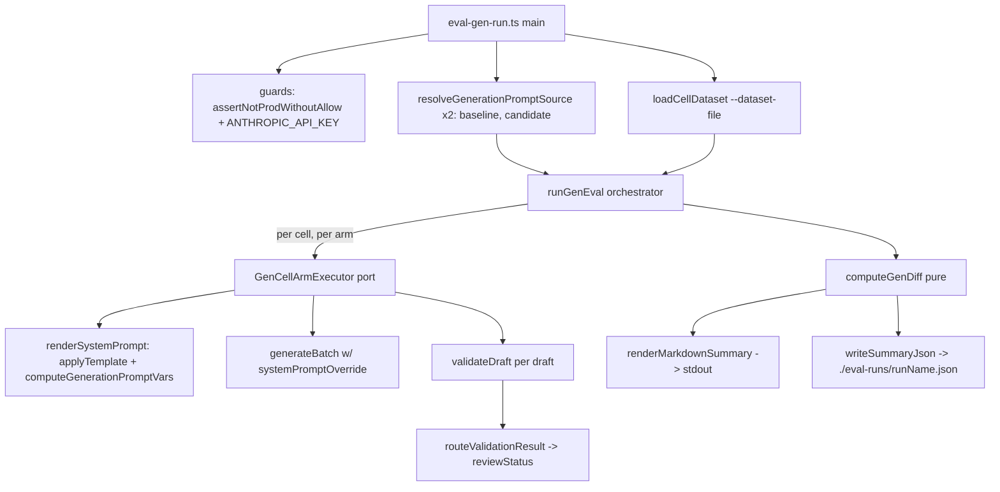

# Design Document

## Overview

`pnpm eval:gen` is a generation-quality eval harness that compares two generation-prompt versions (baseline vs. candidate) over a dataset of *cells* (`language, cefrLevel, exerciseType, grammarPointKey`). For each cell it renders each prompt source into a concrete system prompt, generates N drafts under each via `generateBatch`, validates every draft with the existing `validateDraft`, routes each verdict through `routeValidationResult`, and reports the **approval-rate, rejection-reason, and flag-tag distribution deltas** between the two arms — writing a markdown summary to stdout and a full JSON summary to `./eval-runs/<runName>.json`.

It is the generation-side analogue of `eval-run.ts` (which only covers the answer-evaluation prompt) and mirrors its structure: port-style dependency injection for testability, a production guard, `file:`/`langfuse:` source resolution, a pure diff layer, and JSON + markdown output. It adds one small additive seam to the generator (`systemPromptOverride` on `GenerationSpec`) and a hard `--max-cost-usd` cost cap. Closes the `docs/tech-debt.md` item "No generation-quality eval harness (`pnpm eval` only covers the evaluation prompt)".

## Steering Document Alignment

### Technical Standards (tech.md)
- **Cost-controlled, AI-heavy (§1, §7):** the pre-generated pool is produced by Claude and gated by an LLM validator; a bad generation prompt re-sweeps the pool at real cost (~$30.80 for the #227 baseline run). This harness gives generation-prompt PRs a pre-merge, budget-bounded quality signal, with `--max-cost-usd` enforcing the "enforce usage limits" constraint.
- **No new runtime dependency:** the harness composes existing package exports only (`generateBatch`, `validateDraft`, `routeValidationResult`, `estimateCostUsd`, `applyTemplate`, …).

### Project Structure (structure.md)
- The harness lives in `packages/ai/scripts/` next to `eval-run.ts`. `packages/ai` already declares `@language-drill/db` as a workspace dependency (consumed by `eval-export.ts`), so importing `routeValidationResult` and `getGrammarPoint` from `@language-drill/db` is in-bounds and needs no new dependency edge.
- Prompt versioning rules (CLAUDE.md "Prompt Editing") are untouched: the harness never writes prompts; it only reads template bodies.

## Code Reuse Analysis

### Existing Components to Leverage
- **`eval-run.ts` generic helpers** (`assertNotProdWithoutAllow`, `deriveRunName`, `writeSummaryJson`, `EVAL_RUNS_DIR`): imported from `./eval-run.js` so `eval-run.ts` is **not modified** and its test suite is unaffected. The `isMain` guard (`eval-run.ts:1009`) means importing these does **not** auto-run its `main()`. Reuse its `LangfusePromptFetcher` port type (`eval-run.ts:175`) for the resolver rather than re-deriving it.
- **`@language-drill/ai` (barrel)**: `generateBatch`, `validateDraft`, `GENERATION_SYSTEM_PROMPT_TEMPLATE`, `applyTemplate`, `sha8`, `getLangfuse`, `createClaudeClient`, `estimateCostUsd`, `addUsage`, `ZERO_USAGE`; types `GenerationSpec`, `ExerciseDraft`, `GenerateBatchResult`, `ValidationResult`, `ClaudeUsageBreakdown`, `GenerationPromptInputs`.
- **`@language-drill/ai` via relative import**: `computeGenerationPromptVars` is **not** in the barrel (`index.ts` exports only the `GenerationPromptInputs` type + the template). The harness imports it from `../src/generation-prompts.js` — the same deep-relative pattern `eval-run.ts:48` already uses for `sha8`. (Alternatively add it to the barrel; relative import is the lower-churn default.)
- **`@language-drill/db` (barrel)**: `getGrammarPoint`, `buildCellKey`, `createDb`, `generationJobs` — all confirmed in the barrel. **`routeValidationResult` is NOT in the barrel** (the generation `index.ts` deliberately keeps `routing.ts` internal). See "Required export additions" below.
- **`@language-drill/shared`**: `Language`, `CefrLevel`, `ExerciseType`, `GrammarPoint`.

### Required export additions (new public surface)
- **`packages/db` barrel** — add `export { routeValidationResult, type ReviewStatus, type RoutingDecision } from './generation/routing'` (in `packages/db/src/generation/index.ts`, then surfaced through `packages/db/src/index.ts`). This is the one genuinely new export edge; `@language-drill/db` is already a dependency of `packages/ai` (`package.json:21`), so no new dependency edge — only a re-export. _Tracked as its own task._
- **`computeGenerationPromptVars`** — no barrel change required; consumed via `../src/generation-prompts.js` relative import (above).

### Integration Points
- **Generator (`packages/ai/src/generate.ts`)**: one additive field, `systemPromptOverride?: string` on `GenerationSpec`, consumed in `generateOneDraft`. When set, the override body is used verbatim as the cached `system` text (keeping `cache_control: { type: 'ephemeral' }`) and `buildGenerationSystemPrompt` is skipped. The no-override path is byte-for-byte unchanged.
- **DB (read-only)**: curriculum lookup at runtime; `generation_jobs` sampling for export. The harness performs **no writes** to `exercises` or any production table; it writes only to `./eval-runs/`.

## Architecture

The harness is a four-stage pipeline (resolve → load → run → diff/emit), each stage a pure or injectable unit so the orchestrator is unit-testable without live SDKs.



Per cell the runner executes **both arms** (baseline, then candidate). The `--max-cost-usd` cap is evaluated at the **cell boundary** (after both arms finish) so a partial summary never contains a half-compared cell.

## Components and Interfaces

### Component 1 — Injection seam: `GenerationSpec.systemPromptOverride`
- **Purpose:** let a caller drive `generateBatch` with an explicit system-prompt body, bypassing the Langfuse fetch.
- **Interfaces:** add `systemPromptOverride?: string` to `GenerationSpec`. In `generateOneDraft`: `const systemText = spec.systemPromptOverride ?? await buildGenerationSystemPrompt(promptInputs, []);`
- **Dependencies:** none new.
- **Reuses:** existing `generateOneDraft` request shape (cache_control preserved). _Req 2.1, 2.2._

### Component 2 — Prompt-source resolver
- **Purpose:** turn a `--baseline`/`--candidate` argv into a generation **template body**.
- **Interfaces:** `resolveGenerationPromptSource(source, langfuse): Promise<{ templateBody: string; source: string; sha: string }>` — `file:<path>`, `langfuse:<name>@<label>` (label default `candidate`), `repo` (→ `GENERATION_SYSTEM_PROMPT_TEMPLATE`); throws on unsupported prefix / empty name. `renderSystemPrompt(templateBody, inputs): string` → `applyTemplate(body, computeGenerationPromptVars(inputs, []))`, throws if `missingVars.length > 0`.
- **Reuses:** `getPrompt` (Langfuse), `GENERATION_SYSTEM_PROMPT_TEMPLATE`, `applyTemplate`, `computeGenerationPromptVars`, `sha8`. _Req 1.1–1.5, 2.3, 2.4._

### Component 3 — Cell dataset loader
- **Purpose:** load + validate cell descriptors and resolve them to full grammar points.
- **Interfaces:** `loadCellDataset(raw): CellDescriptor[]`; `resolveCell(descriptor): { cell, grammarPoint } | { cellKey, error }` via `getGrammarPoint`. Records a per-cell error for: malformed shape, unknown `grammarPointKey`, OR `language === EN` (EN is not a generation language).
- **Reuses:** `getGrammarPoint`, `buildCellKey`. _Req 3.1, 3.2._

### Component 4 — Runner / orchestrator
- **Purpose:** drive both arms per cell with per-cell error isolation and cell-boundary cost capping.
- **Interfaces:** port `GenCellArmExecutor = (params) => Promise<ArmResult>`; `makeRealArmExecutor(client): GenCellArmExecutor` builds the `GenerationSpec` (`count = draftsPerCell`, `systemPromptOverride`, `topicDomain`, `batchSeed`), calls `generateBatch`, then for each draft calls `validateDraft` (which returns `{ result, tokenUsage }` — classify on `result` via `routeValidationResult`, fold `tokenUsage` via `addUsage`), classifies into buckets, and folds malformed-draft usage from `GenerateBatchResult.tokenUsage` too. `runGenEval(opts): Promise<GenEvalRunResult>` loops cells × arms, accumulates, checks the cap at each cell boundary, try/catch per cell.
- **EN guard:** `GenerationSpec.language` is `Exclude<Language, Language.EN>` and `generateBatch` throws on EN. Reject EN cells at **load time** (Component 3) so an EN descriptor surfaces as a per-cell error, not an opaque mid-run throw.
- **Reuses:** `generateBatch`, `validateDraft`, `routeValidationResult`, `addUsage`, `ZERO_USAGE`, `estimateCostUsd`. _Req 4.1–4.6, 6.2._

### Component 5 — Diff layer (pure)
- **Purpose:** roll per-cell arm outcomes into a decision-grade summary.
- **Interfaces:** `computeGenDiff(run): GenEvalSummary`. Per arm: bucket totals, `approvalRate = autoApproved / totalDrafts`, `rejectionReasonCounts` + `flagTagCounts` (keyed by routed reason strings; `parser-failure` its own key), `costUsd`. Deltas: `approvalRateDelta`, per-key reason/flag `{baseline, candidate}`, `costUsd {baseline, candidate}`.
- **Reuses:** `estimateCostUsd`. _Req 5.1–5.4._

### Component 6 — Output
- **Purpose:** human-readable stdout + machine-readable JSON.
- **Interfaces:** `renderMarkdownSummary(summary): string` (no per-cell dump); `writeSummaryJson(summary, EVAL_RUNS_DIR)` (reused from `eval-run.ts`, includes `perCell`).
- **Reuses:** `writeSummaryJson`, `EVAL_RUNS_DIR`. _Req 5.5, 5.6._

### Component 7 — CLI + guards
- **Purpose:** argv parse, safety rails, exit codes.
- **Interfaces:** flags `--baseline --candidate --dataset-file --drafts-per-cell(=5,1..200) --limit --run-name --allow-prod --max-cost-usd --help`; `assertNotProdWithoutAllow`; `ANTHROPIC_API_KEY` check; `deriveRunName(candidate.sha, …)`. Exit 1 when `summary.errors.length > 0` OR `costCapped`.
- **Reuses:** `assertNotProdWithoutAllow`, `deriveRunName`, `createClaudeClient`, `getLangfuse`. _Req 6.1, 6.3, 6.5._

### Component 8 — Export (lower priority)
- **Purpose:** generate a cell-dataset JSON by over-sampling failure-prone cells.
- **Interfaces:** `eval-gen-export.ts` queries `generationJobs` grouped by `cellKey`, derives an approval rate, ascending sort, takes `--sample`, writes descriptors. Exact ranking columns confirmed against the `generationJobs` Drizzle schema at implementation time (requirements open question). The runner does not depend on this — `fixtures/cells-smoke.json` unblocks it. _Req 3.3._

### Component 9 — Documentation & wiring
- Add the `packages/db` barrel re-export of `routeValidationResult` (+ `ReviewStatus`, `RoutingDecision`) — see "Required export additions".
- Add `packages/ai/package.json` scripts `eval:gen` / `eval:gen:export` (and root passthrough if the repo has one), alongside `eval` / `eval:export`.
- Update `generation-quality-improvements` `{design,requirements,tasks}.md` (`pnpm eval` → `pnpm eval:gen` as the generation gate), the CLAUDE.md command table, and the tech-debt entry (→ resolved). _Req 6.4, 7.1–7.3._

## Data Models

```ts
type CellDescriptor = {
  language: Language; cefrLevel: CefrLevel; exerciseType: ExerciseType; grammarPointKey: string;
};

type DraftBucket = "auto-approved" | "flagged" | "rejected" | "parser-failure";
type DraftOutcome = { bucket: DraftBucket; reasons: string[] }; // routed reasons; ["parser-failure"] for malformed
type ArmResult = { outcomes: DraftOutcome[]; usage: ClaudeUsageBreakdown; error?: string };

type ArmStats = {
  totalDrafts: number; autoApproved: number; flagged: number; rejected: number; parserFailure: number;
  approvalRate: number;
  rejectionReasonCounts: Record<string, number>;
  flagTagCounts: Record<string, number>;
  costUsd: number;
};

type GenEvalSummary = {
  runName: string;
  baseline: { source: string; sha: string }; candidate: { source: string; sha: string };
  datasetName: string; startedAt: string;
  cellCount: number; draftsPerCell: number; costCapped: boolean;
  baselineStats: ArmStats; candidateStats: ArmStats;
  approvalRateDelta: number; // candidate - baseline
  reasonDeltas: Record<string, { baseline: number; candidate: number }>;
  flagDeltas: Record<string, { baseline: number; candidate: number }>;
  costUsd: { baseline: number; candidate: number };
  errors: Array<{ cellKey: string; error: string }>;
  perCell?: Array<{ cellKey: string; baseline: ArmStats; candidate: ArmStats }>;
};
```

## Error Handling

### Error Scenarios
1. **Malformed cell descriptor / unknown `grammarPointKey`** — Handling: record per-cell error, skip cell, continue; appears in `summary.errors`; CLI exits 1. User impact: clear per-cell error line, rest of run unaffected.
2. **Candidate template missing a `{{var}}`** — Handling: `applyTemplate` returns `missingVars`; `renderSystemPrompt` throws *before* any Claude call. User impact: fail fast, no spend.
3. **`generateBatch` / `validateDraft` throws for a cell** — Handling: per-cell try/catch records error, continue (Req 4.6). User impact: that cell omitted from comparison, surfaced in errors.
4. **Parser-failure drafts** — Handling: counted in the `parser-failure` bucket (non-approved), usage still folded into cost (Req 4.4). User impact: visible as a distinct distribution key.
5. **`LANGFUSE_ENV=prod` without `--allow-prod`** — Handling: `assertNotProdWithoutAllow` throws before run. User impact: explicit opt-in required.
6. **Cost cap reached** — Handling: stop at the cell boundary, set `costCapped=true`, emit partial summary, exit 1. User impact: bounded spend, partial-but-coherent results.
7. **No `ANTHROPIC_API_KEY`** — Handling: CLI exits with a clear message before processing. User impact: no silent no-op.

## Testing Strategy

### Unit Testing
`eval-gen-run.test.ts` mirrors `eval-run.test.ts` (port DI; no live Anthropic/Langfuse/DB):
- **Resolver:** `file:`/`langfuse:`/`repo`; default label; unsupported prefix + empty name throw; `renderSystemPrompt` throws on missing var.
- **Runner** (stub `GenCellArmExecutor`): both arms per cell; one cell throws → others still run; cost cap stops at cell boundary with a coherent partial summary (no half-compared cell).
- **Classification** (`vi.mock('@language-drill/ai')` for `generateBatch`/`validateDraft`): drafts route to auto-approved/flagged/rejected via real `routeValidationResult`; malformed → `parser-failure`; usage folded.
- **`computeGenDiff`** (pure): `approvalRateDelta`, reason/flag deltas, cost — asserted exactly.
- **`renderMarkdownSummary`:** required headers/rows, errors section, costCapped note.
- **Seam:** `generate.test.ts` gains a case asserting `systemPromptOverride` is used verbatim (no Langfuse fetch) and absence is unchanged.

### Integration Testing
- `pnpm --filter @language-drill/ai test` — new suite plus the unchanged `eval-run` and `generate` suites stay green (proves the seam is non-breaking).

### End-to-End Testing
- Manual smoke (spends real budget, gated): `pnpm eval:gen --baseline repo --candidate file:./candidate.txt --dataset-file packages/ai/scripts/fixtures/cells-smoke.json --drafts-per-cell 3 --max-cost-usd 1`; confirm `./eval-runs/<runName>.json` is written with approval-rate + reason/flag deltas and the markdown table prints.
