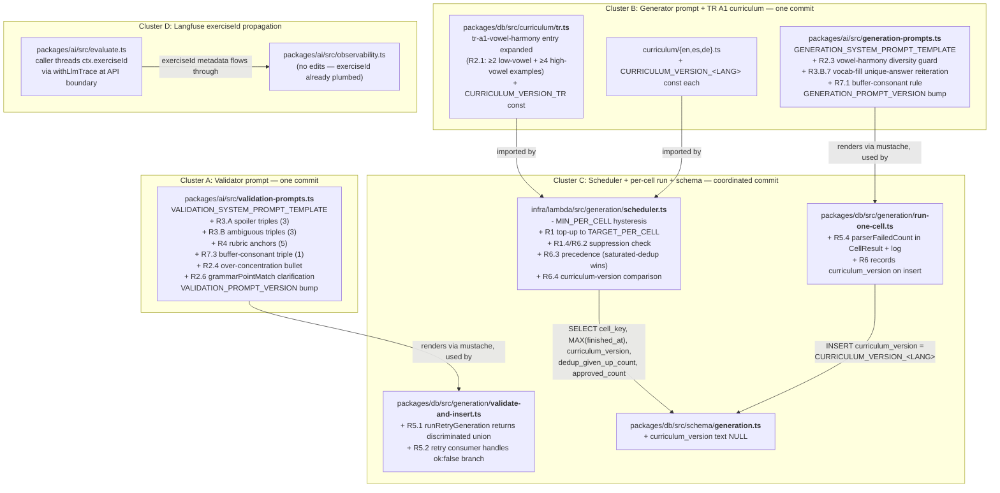

# Design Document

## Overview

Eight defects in the exercise-generation pipeline, all addressable as incremental edits to existing modules. Three concentrated edit surfaces — one validator prompt, one generator prompt, one scheduler — plus one schema migration (a single nullable column) and a small wiring fix in the per-ordinal retry loop. No new services, queues, indexes, or Lambda functions.

The shape of the design is "tighten what is already there." Most of the requirements (R3, R4, R5, R7, R8) are about defects in already-existing checks or already-existing data paths that have been silently no-op'ing or crashing. The two structurally new pieces are R6's `CURRICULUM_VERSION_<LANG>` mechanism (new constants + one schema column) and R1's scheduler refactor (removing the hysteresis floor and adding per-cell suppression).

## Steering Document Alignment

### Technical Standards (tech.md)
- **No new technology choices.** Every change lives inside the existing Hono/Lambda/Neon/Drizzle/Claude/Langfuse stack.
- **Prompt-cache parity.** The validator and generator prompt edits keep `*_SYSTEM_PROMPT_TEMPLATE` mustache placeholders flat-string-only, so Anthropic prompt-cache hits remain byte-identical across consecutive calls in a batch (per the existing parity convention in `validation-prompts.ts` and `generation-prompts.ts`).
- **Pre-generation Lambda + Langfuse.** R8's observability change is metadata-only — no LLM input or output bytes change. Routes through the existing `withLlmTrace` ALS-scoped helper in `packages/ai/src/observability.ts`.
- **Forward-only migrations.** R6 adds one nullable column to `generation_jobs`. No backfill; legacy rows continue to carry `NULL`.

### Project Structure (structure.md)
There is no `structure.md` in `.claude/steering/`. The repo's organization is described in the root `CLAUDE.md` under "Monorepo Layout" and in `tech.md` §4. Design preserves the existing layout:

- `packages/ai/src/` — generator + validator prompts and clients
- `packages/db/src/curriculum/` — per-language grammar-point arrays
- `packages/db/src/schema/` — Drizzle schema (one column added)
- `packages/db/src/generation/` — per-cell run loop + routing
- `packages/db/scripts/` — CLI surface (revalidator reused as-is)
- `infra/lambda/src/generation/` — scheduler + per-cell handler

## Code Reuse Analysis

### Existing Components to Leverage
- **`withLlmTrace` + `LlmTraceContext`** (`packages/ai/src/observability.ts:63, 160-169`): `exerciseId?: string` field already exists in the context type and `buildTraceMetadata` already inserts it into the Langfuse trace metadata (`observability.ts:445-472`). R8 reuses this without API changes.
- **`generateBatch` + `GenerateBatchResult.malformedDrafts`** (`packages/ai/src/generate.ts:277-289, 702-738`): The batch generator already collects per-ordinal parse failures into a side-channel array instead of throwing. R5 reuses this; the fix is downstream in consumers that assume the draft for ordinal N is always present in `batch.drafts`.
- **`routeValidationResult`** (`packages/db/src/generation/routing.ts:55-103`): Existing routing thresholds stay frozen at 0.5/0.7. R3, R4, R7 change the *inputs* to this function (validator's boolean veto outputs) but not the routing logic itself.
- **`validateAndInsertWithRetry`** (`packages/db/src/generation/validate-and-insert.ts`): Already implements the retry-on-dedup loop with `MAX_DEDUP_RETRIES + 1` per-ordinal bound and per-validator-call usage folding. R5 adds one branch ("attempt 0 had no draft → treat as rejected, fold call usage, retry") to this same loop.
- **`revalidate-cloze-pool.ts`** (`packages/db/scripts/revalidate-cloze-pool.ts:100-168, 388-402, 551`): Existing `--apply` path runs `validateDraft` + `routeValidationResult` over the stored pool and applies the new routing decision via `applyDemotion`. R3.C.8 reuses this as the demotion vehicle — no new CLI surface.
- **`generation_jobs` + `generation_jobs_cell_idx`** (`packages/db/src/schema/generation.ts`): R6's "most recent succeeded job per cell" lookup uses the existing index. One column added; no new indexes.
- **`deterministicUuid(spec | batchSeed | ordinal)`** (`packages/db/src/lib/deterministic-uuid.ts`): Already the exercise ID for the writer pipeline. R8 reuses it as the join key in Langfuse trace metadata.

### Integration Points
- **Scheduler ↔ generation_jobs.** R1 + R6 add a second SQL aggregate to the scheduler over `generation_jobs` (one read; bounded by `generation_jobs_cell_idx`). The existing aggregate over `exercises` stays unchanged.
- **Curriculum modules ↔ scheduler.** R6.4 adds `CURRICULUM_VERSION_<LANG>` constants exported from each `curriculum/<lang>.ts`. Imported eagerly by the scheduler at cold-start through the existing `ALL_CURRICULA` barrel.
- **Revalidator ↔ validator prompt change.** R3, R4, R7 all flow into one bumped `VALIDATION_PROMPT_VERSION` constant; the existing `revalidate:cloze --apply` invocation picks up the new validator judgments through the existing Langfuse-or-fallback prompt fetch.
- **Lambda handler ↔ Langfuse.** R8 wires `exerciseId` into the `withLlmTrace` context at three call sites (generator, validator, evaluator) — the trace pipeline reads it through the existing ALS scope.

## Architecture

The fix touches six modules organized into three change-clusters. Coloured boxes are unchanged structural pieces; bold boxes are edited or new.



## Components and Interfaces

### Component 1 — Validator prompt expansion (R2.4, R2.6, R3, R4, R7.2-3)

- **Purpose:** Make the validator's hard-veto checks (`contextSpoilsAnswer`, `ambiguous`, `grammarPointMatch`) actually fire on the patterns the prompt already nominally forbids, anchor `qualityScore` to a rubric so it stops collapsing on 0.85, and surface cell-level over-concentration as a soft flag.
- **Interface:** No code-level interface change. `VALIDATION_SYSTEM_PROMPT_TEMPLATE` (string) grows by ~270 tokens (within the +15 % NFR). `VALIDATION_PROMPT_VERSION` bumps to `validate@<YYYY-MM-DD>`. All `{{flatVar}}` placeholders unchanged (prompt-cache parity preserved).
- **Dependencies:** None new. Existing Langfuse `validate-system-prompt` registration in production is updated via `pnpm bootstrap-prompts` post-commit (existing workflow).
- **Reuses:** `buildValidationSystemPrompt` async fetch + fallback path; `routeValidationResult` thresholds stay frozen.
- **Token-budget enforcement:** Triple count capped at ≤8 across R3.A + R3.B + R7.3; rubric anchors capped at 5. The build-time prompt-length test in `validation-prompts.test.ts` already pins byte parity with the template; we'll add a length assertion to that file as part of the implementation.

### Component 2 — Generator prompt expansion + curriculum enrichment (R2, R3.B.7, R7.1)

- **Purpose:** Teach the generator that the `tr-a1-vowel-harmony` cell must drill both 2-way and 4-way harmony across a batch, that cloze blanks tested by buffer-consonant suffixes must either embed the buffer or list both forms in `acceptableAnswers`, and that any cloze sentence admitting multiple lexemes for the rule must enumerate them in `acceptableAnswers`.
- **Interface:** Two text edits — `GENERATION_SYSTEM_PROMPT_TEMPLATE` in `generation-prompts.ts`, and `tr-a1-vowel-harmony`'s `description`/`examplesPositive`/`commonErrors` in `tr.ts`. `GENERATION_PROMPT_VERSION` bumps once.
- **Dependencies:** `tr.ts` keeps its `GrammarPoint` shape — only the field contents change. No type-system impact.
- **Reuses:** `buildGenerationSystemPrompt`, `computeGenerationPromptVars`, the mustache template engine — all unchanged.
- **R2.1 example budget:** TR A1 vowel-harmony entry will list ≥2 low-vowel and ≥4 high-vowel `examplesPositive`. The `examplesNegative` and `commonErrors` arrays grow by 1-2 lines each so Claude sees concrete failure modes.

### Component 3 — Scheduler refactor (R1, R6)

- **Purpose:** Top-up cells until they hit `TARGET_PER_CELL`, but suppress cells whose most recent succeeded job either produced almost nothing (R1.4 "low-yield") or hit the dedup wall (R6.1-2 "saturated-dedup"). Suppression clears when the curriculum version recorded on that job differs from the on-disk constant.
- **Module layout:** Splits the new logic out so it's unit-testable without booting the AWS SDK or environment:
  - `infra/lambda/src/generation/scheduler-decision.ts` — **new file**. Exports the pure `decideEnqueue` function and the new threshold constants. No imports from `@aws-sdk/*`, no Drizzle, no env reads. Pure inputs → pure output.
  - `infra/lambda/src/generation/scheduler.ts` — existing handler, edited. Imports `decideEnqueue` from the new file. Keeps the SQS/DB/env-touching code.
- **Interface (handler):** `handler()` in `scheduler.ts` still returns `Promise<void>` and reads no inputs. Internal helpers it adds:
  - `loadMostRecentSucceededJobPerCell(db): Promise<Map<cellKey, RecentJob>>` — one SQL query over `generation_jobs` using `generation_jobs_cell_idx`. Returns `{ approvedCount, dedupGivenUpCount, requestedCount, curriculumVersion, finishedAt }` per cell.
- **Interface (pure decision in `scheduler-decision.ts`):**
  ```ts
  export type EnqueueDecision =
    | { kind: 'enqueue'; need: number }
    | { kind: 'skip-target-reached' }
    | { kind: 'skip-low-yield' }
    | { kind: 'skip-saturated-dedup' }
    | { kind: 'skip-c2' };

  export function decideEnqueue(
    cell: Cell,
    approvedInPool: number,
    recentJob: RecentJob | null,
    curriculumVersionOnDisk: string | undefined,
  ): EnqueueDecision;
  ```
  Precedence per R6.3: if both low-yield AND saturated-dedup would suppress the same cell, return `skip-saturated-dedup` (carries strictly more diagnostic information).
- **Constants removed:** `MIN_PER_CELL` deleted. `TARGET_PER_CELL = 50` kept. New constants exported from `scheduler-decision.ts`: `LOW_YIELD_THRESHOLD = 3` (R1.4), `SATURATED_DEDUP_REQ_FRACTION = 0.5`, `SATURATED_DEDUP_APPROVED_FRACTION = 0.3` (R6.1).
- **Log shape change:** Existing structured log per-tick gets a new `suppressed: { lowYield: number, saturatedDedup: number, targetReached: number }` summary field. Per-skip records emit a one-line `{ cellKey, reason, ... }` for grep-in-CloudWatch.
- **Reuses:** `enumerateCurriculumCells`, `ROUND_1_CEFR_LEVELS`, `chunk`, `deterministicUuid`, `SendMessageBatchCommand` — all unchanged.

### Component 4 — Per-ordinal malformed-draft handling (R5)

- **Crash locus (precise):** Not in `generateBatch` (which already collects malformed ordinals into `result.malformedDrafts` rather than throwing) and not in the top-level ordinal loop of `run-one-cell.ts` (which iterates by `batch.drafts.length` — a packed array of successful drafts only). The actual crash site is `runRetryGeneration` in `packages/db/src/generation/validate-and-insert.ts:93-107`. When the dedup-retry path re-issues a single-draft generation, the regenerated draft can itself land in `result.malformedDrafts` (zero successful drafts). The line `return { draft: result.drafts[0], usage: result.tokenUsage }` then returns `{ draft: undefined, usage }`, and the caller's `currentDraft.contentJson` deref crashes with `Cannot read properties of undefined (reading 'contentJson')`.
- **Purpose:** Make the retry path tolerate a malformed regenerated draft by surfacing it as an outcome the caller switches on, not as a crash.
- **Interface change in `validate-and-insert.ts`:**
  ```ts
  // BEFORE (line 93-107):
  async function runRetryGeneration(...): Promise<{ draft: ExerciseDraft; usage: ClaudeUsageBreakdown }> {
    ...
    const result = await generateBatch(client, retrySpec);
    return { draft: result.drafts[0], usage: result.tokenUsage };  // CRASH SOURCE
  }

  // AFTER:
  type RetryOutcome =
    | { ok: true;  draft: ExerciseDraft;       usage: ClaudeUsageBreakdown }
    | { ok: false; malformed: MalformedDraft;  usage: ClaudeUsageBreakdown };

  async function runRetryGeneration(...): Promise<RetryOutcome> {
    ...
    const result = await generateBatch(client, retrySpec);
    if (result.drafts.length === 0) {
      return { ok: false, malformed: result.malformedDrafts[0], usage: result.tokenUsage };
    }
    return { ok: true, draft: result.drafts[0], usage: result.tokenUsage };
  }
  ```
- **Consumer change in `validateAndInsertWithRetry` (same file):** Each `await runRetryGeneration(...)` call site is wrapped with a discriminator check:
  ```ts
  const retry = await runRetryGeneration(...);
  extraUsage = addUsage(extraUsage, retry.usage);          // always fold usage
  if (!retry.ok) {
    // Treat as the rejected branch of this attempt: increment parser-failed counter,
    // continue the loop. If we've exhausted retries, return terminalStatus='rejected'
    // with parserFailedThisOrdinal=true so the caller bumps CellResult.parserFailedCount.
    if (attempt >= MAX_DEDUP_RETRIES) {
      return { terminalStatus: 'rejected', parserFailedAtFinal: true, extraUsage, ... };
    }
    continue;
  }
  currentDraft = retry.draft;
  extraProduced += 1;
  ```
- **`run-one-cell.ts` accounting:** `CellResult` gains a `parserFailedCount: number` field. The per-ordinal walk increments it by 1 whenever `validateAndInsertWithRetry` returns the new `parserFailedAtFinal: true` flag. The field is written to the `generation_jobs` row alongside existing counters and logged at job completion.
- **Per-ordinal usage attribution:** Each `generateOneDraft` call inside `generateBatch` has its own Claude API call with its own `usage` (verified at `generate.ts:620-673`). The aggregated `result.tokenUsage` returned by `generateBatch(retrySpec)` (with `count=1`) is therefore exactly that one ordinal's usage. `extraUsage = addUsage(extraUsage, retry.usage)` is the correct attribution; no batch-level vs per-ordinal split is involved.
- **Dependencies:** None new. No exports added or removed (both `runRetryGeneration` consumers are inside the same file).
- **Reuses:** Existing `MAX_DEDUP_RETRIES + 1` budget per ordinal; existing `addUsage` accumulator; existing `MalformedDraft` shape from `@language-drill/ai`.

### Component 5 — `CURRICULUM_VERSION_<LANG>` (R6.4)

- **Purpose:** Give the scheduler a clearable invariant: a suppressed cell becomes eligible again iff its language's curriculum has been edited since the suppressing job ran.
- **Interface:** Each `curriculum/<lang>.ts` adds one named export:
  ```ts
  export const CURRICULUM_VERSION_TR = '2026-05-23';
  ```
  Bumped manually in the same commit as any edit to that file's grammar entries. Convention matches the existing `*_PROMPT_VERSION` rule documented in CLAUDE.md.
- **Aggregated lookup:** `packages/db/src/curriculum/index.ts` exports `CURRICULUM_VERSION_BY_LANGUAGE: Readonly<Record<Language, string>>` so the scheduler can resolve a cell's expected version by language without per-module imports.
- **Recording on the job:** `run-one-cell.ts` looks up `CURRICULUM_VERSION_BY_LANGUAGE[cell.language]` when inserting the `generation_jobs` row and writes it to the new column.
- **Reuses:** Existing `Language` enum from `@language-drill/shared`; existing `ALL_CURRICULA` barrel.

### Component 6 — `generation_jobs.curriculum_version` schema (R6.4)

- **Purpose:** Persist the curriculum version a job ran against so the scheduler can compare it to the on-disk constant.
- **Interface:** One additive nullable column on `generation_jobs` via a forward-only Drizzle migration. Existing rows keep `NULL`; the scheduler treats `NULL` as "older than any known version" → never suppresses based on it.
- **Dependencies:** Drizzle migration generated via `pnpm db:generate` then committed. Applied in CI per the existing deploy pipeline (`deploy.yml` runs `pnpm db:migrate` before CDK + Vercel deploy — `CLAUDE.md` §CI/CD).
- **Reuses:** Existing `generation_jobs_cell_idx` covers the lookup; no new index needed.

### Component 7 — Langfuse `exerciseId` propagation (R8)

- **Purpose:** Make every Langfuse trace tagged with `exerciseId` so generation, validation, and evaluation calls for one exercise share a join key.
- **Interface (3 wiring fixes):**
  1. `run-one-cell.ts` (and/or `validate-and-insert.ts`): wrap each per-ordinal walk in `withLlmTrace({ ...currentCtx, exerciseId })` where `exerciseId = deterministicUuid(spec | batchSeed | ordinal)`. Today, the cell-level `withLlmTrace` is already in place; this just narrows the scope to per-ordinal so generator + validator + retry calls all carry the same `exerciseId`.
  2. `apps/web` (or `infra/lambda` route handler for `/exercises/:id/submit`): the API receives `exerciseId` in the path. Wrap the `evaluateAnswer` call in `withLlmTrace({ feature: 'evaluate', exerciseId })`. This is one line at the route handler.
  3. The annotate-stream Lambda (`infra/lambda/src/annotate-stream/`): not in scope — annotate is for reader UX, not exercise generation/evaluation. The annotate stream is a separate Langfuse feature and does not consume `exerciseId`.
- **Dependencies:** None new. `LlmTraceContext.exerciseId` and `buildTraceMetadata`'s insertion (`observability.ts:460`) already do the rest.
- **Reuses:** `withLlmTrace`, `LlmTraceContext`, `buildTraceMetadata`.
- **R8.5 constraint:** No prompt version bumps. R8 is observability metadata only.

## Data Models

### Schema change (one nullable column)

```sql
ALTER TABLE generation_jobs
  ADD COLUMN curriculum_version text;
-- NULL on all existing rows; populated on new INSERTs in run-one-cell.ts.
```

In `packages/db/src/schema/generation.ts`:

```ts
curriculumVersion: text('curriculum_version'),  // nullable text
```

No index — the scheduler reads `curriculum_version` from rows it already selected via `generation_jobs_cell_idx` (cell_key, finished_at desc); this is a row-level read, not a predicate.

### `CellResult` (existing type extended)

```ts
// packages/db/src/generation/run-one-cell.ts
export type CellResult = {
  status: 'succeeded' | 'failed';
  errorMessage?: string;
  producedCount: number;
  approvedCount: number;
  flaggedCount: number;
  rejectedCount: number;
  validatedCount: number;
  inBatchDuplicateCount: number;
  malformedDraftCount: number;       // existing — count of batch.malformedDrafts
  dedupGivenUpCount: number;
+ parserFailedCount: number;         // new — ordinals that consumed all retries on parser failure
};
```

`malformedDraftCount` and `parserFailedCount` are distinct: the former counts initial parse failures (signals generator-prompt-malforming Claude responses); the latter counts ordinals where even all retries produced parser failures (signals a stuck failure mode worth alarming on). Both are logged.

### `RecentJob` (scheduler-internal)

```ts
// infra/lambda/src/generation/scheduler.ts (new internal type)
type RecentJob = {
  approvedCount: number;
  requestedCount: number;
  dedupGivenUpCount: number;
  curriculumVersion: string | null;
  finishedAt: Date;
};
```

Populated from one `SELECT DISTINCT ON (cell_key) ... ORDER BY cell_key, started_at DESC` over `generation_jobs WHERE status = 'succeeded'`. Postgres-specific `DISTINCT ON` is already used elsewhere in the codebase per existing conventions; uses the `generation_jobs_cell_idx`.

### Validator prompt shape (text growth)

Token budget — current `VALIDATION_SYSTEM_PROMPT_TEMPLATE` is 3,805 bytes (~950 tokens for English prose at the rough 4-bytes-per-token heuristic):

| Addition | Approx tokens | Sub-cap |
|---|---|---|
| 3 R3.A spoiler triples | ~90 | ≤8 combined |
| 3 R3.B ambiguous triples | ~120 | ≤8 combined |
| 1 R7.3 buffer triple | ~40 | ≤8 combined |
| 5-anchor R4 rubric | ~110 | ≤5 anchors |
| R2.4 over-concentration bullet | ~25 | one bullet |
| R2.6 grammarPointMatch refinement bullet | ~30 | one bullet |
| **Total added** | **~415** | |
| **Raw growth** | **~44 %** | |
| **Steady-state billed-cost growth (with ≥0.8 cache hit rate)** | **~9 %** | within 15 % NFR |

The NFR caps **billed** token cost, not raw prompt size. Anthropic prompt caching charges ~10 % of input price on cache hits; with the existing ≥0.8 hit rate, billed input grows by `0.44 × (1 − 0.8) = 0.088`. The first call after each deploy pays the full miss cost (one-time, ~3-5 c). The validator's `validate-system-prompt` is fetched from Langfuse and cached in-process for 5 minutes per `getPromptWithVarsOrFallback`, so warm Lambdas see consistent cache hits across consecutive calls within a batch.

## Error Handling

### Error Scenarios

1. **Retry path returns a malformed draft** (R5 — current crash).
   - **Handling:** `runRetryGeneration` returns a discriminated union (see Component 4). When `ok: false`, the consumer in `validateAndInsertWithRetry` folds the usage, increments parser-failed accounting for that ordinal, and continues the retry loop (or terminates the ordinal with `terminalStatus = 'rejected'` + `parserFailedAtFinal: true` after exhausting retries). The cell walk in `run-one-cell.ts` then bumps `CellResult.parserFailedCount` by 1 per such ordinal. Loop continues to next ordinal.
   - **User impact:** None — these failures are pre-pool. A worst-case batch yields fewer exercises than requested, surfaced in the CLI breakdown line. CloudWatch alarm-worthy if `parserFailedCount / count > 0.2` over multiple jobs (signals generator-prompt malformation worth investigating).

2. **Curriculum-version constant on disk vs. recorded on job** (R6.4 mismatch handling).
   - **Handling:** If the on-disk `CURRICULUM_VERSION_<LANG>` is unknown (e.g. the constant was deleted by mistake, or a new language was added but the version constant missed), `CURRICULUM_VERSION_BY_LANGUAGE[lang]` returns `undefined`. Scheduler treats this as "always re-enqueue" (safe-by-default — never permanently disable a cell). One-line warn log on cold-start: `{ language, message: 'CURRICULUM_VERSION_<LANG> missing' }`.
   - **User impact:** None — cells stay schedulable.

3. **Null `curriculum_version` on a recent job** (legacy rows pre-migration).
   - **Handling:** Scheduler treats `NULL` as "older than any known version" → suppression considered cleared. The next succeeded job records the live version, and from then on, normal logic applies.
   - **User impact:** None — first post-deploy tick may schedule cells that the post-migration check would have suppressed. Acceptable one-time cost.

4. **Validator prompt-cache miss** (NFR ≥0.8 cache-hit-rate invariant).
   - **Handling:** The prompt-cache mechanism is byte-identical-only, controlled at the Anthropic client layer (`packages/ai/src/observability.ts:775-859`). Because every new text in the validator prompt is static (no new placeholders), cache parity is preserved across consecutive calls in a batch. The first call after deploy is a one-off miss — same as any version bump today.
   - **User impact:** ~3-5 c one-off cost on the first batch post-deploy. Steady-state cost change ≤+15 % per the NFR.

5. **Langfuse trace fails to record `exerciseId`** (R8 unhappy path).
   - **Handling:** `withLlmTrace` is best-effort; Langfuse errors are caught and logged but never block the LLM call (existing convention in `observability.ts`). If the trace fails to record, the `exerciseId` is lost for that call — the maintainer's join-by-`exerciseId` search returns the partial set. Generation/validation/evaluation itself proceeds normally.
   - **User impact:** None — the trace metadata is debugging-only.

6. **Saturated cell that *should* still run** (operator override).
   - **Handling:** The CLI `pnpm --filter @language-drill/db generate:exercises --cell <key>` already issues a job with `trigger='cli'`. R6's suppression only consults the *most recent succeeded job's* metadata; a CLI re-run produces a new succeeded job, which becomes the new most-recent and clears suppression on subsequent ticks. No special-case bypass needed.
   - **User impact:** Documented operational path in the runbook.

## Testing Strategy

### Unit Testing

- **`scheduler-decision.ts`** (new pure module). New test file `scheduler-decision.test.ts`. Table-test every `(approvedInPool, recentJob, curriculumVersionOnDisk)` combination across the five outcomes. Pin: target-reached, low-yield with curriculum mismatch (→ enqueue), low-yield with curriculum match (→ skip-low-yield), saturated-dedup beats low-yield in precedence, C2 always skipped, NULL `recentJob.curriculumVersion` clears suppression. ~12 cases. The pure-module split keeps the test free of AWS SDK / env imports.
- **`generation-prompts.test.ts`** — extend the existing template snapshot test to assert the new R2.3 / R3.B.7 / R7.1 bullets are present in the rendered system prompt. Bump the snapshot.
- **`validation-prompts.test.ts`** — extend the existing byte-parity test; add a length assertion that the rendered prompt is ≤ `currentLength * 1.15` so the NFR is enforced at build time.
- **`validate-and-insert.test.ts`** — new test: given a `generateBatch` mock that returns `{ drafts: [], malformedDrafts: [{ ordinal: 0, errorMessage: '...' }], tokenUsage: {...} }` on the dedup-retry call (after the original draft was validator-rejected), `validateAndInsertWithRetry` consumes the new `RetryOutcome.ok=false` branch, folds usage into `extraUsage`, and either retries (if budget remains) or returns `{ terminalStatus: 'rejected', parserFailedAtFinal: true }`. No throw, no `undefined.contentJson` access.
- **`run-one-cell.test.ts`** — extend: given a `CellResult` where one ordinal returned `parserFailedAtFinal: true`, the final result row has `parserFailedCount: 1` and the structured log line includes that field.
- **`routing.test.ts`** — existing tests stay green; add three new cases asserting `ambiguous: true` flows to `flagged` per R3.B.6, `contextSpoilsAnswer: true` to `rejected` per R3.A.3, and `grammarPointMatch: false` to `flagged` per R2.6.
- **Curriculum-version constants** — `curriculum.test.ts` (existing) extended to assert every language module exports a `CURRICULUM_VERSION_<LANG>` constant that matches `^\d{4}-\d{2}-\d{2}$`.

### Integration Testing

- **`revalidate-cloze-pool` dry-run** against a stubbed validator returning the new judgment shape. Existing test file covers the demote loop; extend to assert `qualityScore`, `flaggedReasons`, and `reviewStatus` columns get the expected updates when `--apply` is passed. ~3 new test cases (spoiled-context demote, ambiguous-fill demote, buffer-consonant-ambiguous demote).
- **Scheduler integration test** — already exists at `scheduler.test.ts`. Extend with one scenario: seed `exercises` with 30 approved + `generation_jobs` with one recent saturated-dedup job → scheduler enqueues 0 cells (suppressed) → bump the language's `CURRICULUM_VERSION` constant → scheduler enqueues 1 cell (suppression cleared).

### End-to-End Testing

Out of scope for this spec. R8's `exerciseId` propagation is observability-only — verification is "search Langfuse for `exerciseId=<uuid>` and find generation + validation traces side-by-side," which is a manual one-shot check post-deploy, not an automated test.

Manual verification checklist post-deploy:
1. Trigger one scheduled tick (`aws lambda invoke ... GenerationSchedulerLambda`). Confirm structured log emits `suppressed: { lowYield: N, saturatedDedup: M, targetReached: K }`.
2. Run `pnpm revalidate:cloze --language TR --cefr A1 --dry-run --limit 50` and confirm at least 3 distinct `qualityScore` values appear in the output. (R4.2 non-binding sanity check.)
3. Run the same with `--apply` and confirm spoiled-context + ambiguous-fill rows demote.
4. In Langfuse UI, search by an `exerciseId` from `exercises.id` and confirm generation + validation traces appear.
5. Confirm `tr:a1:cloze:tr-a1-vowel-harmony` next scheduled run produces drafts with high-vowel suffixes (data check via the analysis query in the prior conversation turn).

These five checks together cover all eight requirements at the system level.
