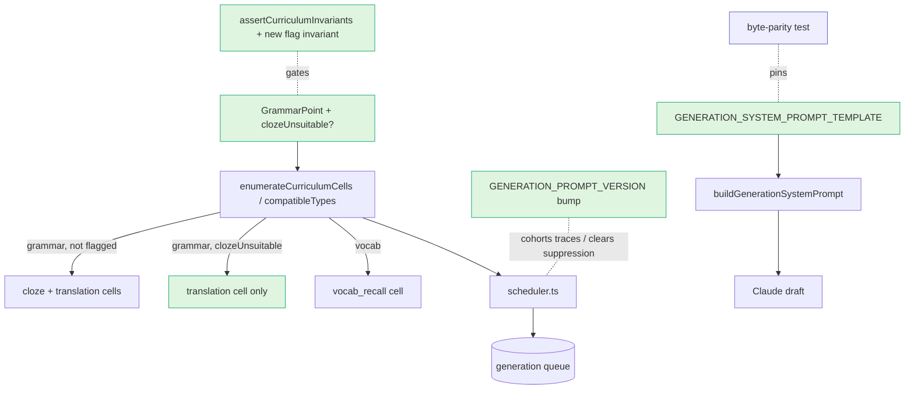

# Design Document

## Overview

Four coupled, low-risk changes to the **generation path** that raise first-pass approval and cut wasted Claude spend, with **no schema migration, no curriculum-text change, and no new runtime interfaces**:

- **R1 — cell-type re-allocation:** add one optional boolean to the `GrammarPoint` model (`clozeUnsuitable`), have the canonical cell enumerator drop the `cloze` cell (keep `translation`) for flagged points, and flag the four Turkish A2 clause-linking points.
- **R2/R3/R4 — generation system-prompt guardrails:** add static text to `GENERATION_SYSTEM_PROMPT_TEMPLATE` for a CEFR vocabulary band, a content-safety/topic guard, and stronger answer-disambiguation (in-sentence definiteness forcing + `acceptableAnswers` enumeration), then bump `GENERATION_PROMPT_VERSION` once.

All four are **additive**: existing un-flagged points and the prompt's existing rules behave unchanged; the prompt edits introduce no new `{{var}}`, so the byte-parity contract and the Anthropic prompt-cache prefix are preserved automatically. Validation is via `pnpm eval` pre-merge and `pnpm push-prompts` Langfuse sync post-merge.

## Steering Document Alignment

### Technical Standards (tech.md)
- **§7 Content & AI Strategy / prompt caching:** the guardrails are static text in the cached *system* prompt prefix (not the per-draft user prompt), preserving the ~80% prompt-cache cost reduction. Higher first-pass approval directly serves "pre-generate reusable content … reduces Claude API cost dramatically."
- **§1 cost-controlled, AI-heavy:** fewer generate→reject cycles per usable exercise.
- **Schema-as-code / TypeScript-first:** `clozeUnsuitable` is an optional field on the existing `Readonly<GrammarPoint>` contract — same shape extension as the existing `targetOverride`.
- **Prompt-editing convention (CLAUDE.md):** any `*_SYSTEM_PROMPT` body change requires a same-commit `*_PROMPT_VERSION` bump and a post-merge Langfuse sync (the in-repo constant is the fallback).

### Project Structure (structure.md)
No `structure.md` exists in `.claude/steering/`. The change follows observed conventions: shared types in `packages/shared/src/curriculum-types.ts`; curriculum data + cell enumeration in `packages/db/src/`; prompt builders + version constants in `packages/ai/src/`; the scheduler's target resolver in `infra/lambda/src/generation/`.

## Code Reuse Analysis

### Existing Components to Leverage
- **`GrammarPoint` (`packages/shared/src/curriculum-types.ts`)** — extend with one optional field, mirroring `targetOverride?: number` (lines 57–65). No consumer that spreads/clones the type needs changing.
- **`enumerateCurriculumCells` / `compatibleTypes` (`packages/db/src/generation/cells.ts`)** — the *single* canonical cell-universe builder used by both the scheduler Lambda and the CLI's `resolveCells`. Threading the flag here re-allocates types in both trigger paths from one edit.
- **`assertCurriculumInvariants` (`packages/db/src/curriculum/index.ts:99`)** — add one invariant (flag valid only on `kind: 'grammar'`); the existing `curriculum.test.ts` gate exercises it.
- **`GENERATION_SYSTEM_PROMPT_TEMPLATE` + `GENERATION_PROMPT_VERSION` + `computeGenerationPromptVars` (`packages/ai/src/generation-prompts.ts`)** — the prompt body is one template constant fetched live from Langfuse with this constant as fallback; edits are localized to the hard-constraints block.
- **Byte-parity test (`packages/ai/src/generation-prompts.test.ts:341` "GENERATION_SYSTEM_PROMPT_TEMPLATE byte parity")** — pins `applyTemplate(TEMPLATE, computeVars(...)).text === buildGenerationSystemPrompt(...)` and `missingVars === []`. Static edits with no new `{{var}}` pass it unchanged.
- **`frequency` module + per-draft `seedWord` injection (`buildGenerationUserPrompt`)** — R2's vocabulary-band wording reinforces the existing seeding rather than replacing it.

### Integration Points
- **Generation scheduler (`infra/lambda/src/generation/scheduler.ts`)** consumes `enumerateCurriculumCells` → automatically stops enumerating the suppressed `cloze` cells; the `GENERATION_PROMPT_VERSION` bump clears prompt-version suppression so cells regenerate against the new prompt.
- **`resolveCellTarget` (`infra/lambda/src/generation/cell-targets.ts`)** — unchanged; `resolveCellTarget` only ever runs on cells the enumerator produces, so suppressed cloze cells resolve no target. The `CELL_TARGET_DEFAULTS[CLOZE]` entries stay (still used by every un-flagged point); they are merely unused for the four flagged points.
- **Admin pool-status route (`infra/lambda/src/routes/admin.ts:148, :360`)** — a **third** consumer of `enumerateCurriculumCells` (besides the scheduler and the CLI). After this change its enumeration no longer lists the four points' cloze cells, while their already-approved cloze rows persist in the DB (Error Scenario 4). Net effect: those rows are still served to learners but no longer appear as a cell in pool-status — a harmless, expected counts shift, flagged here so the implementer isn't surprised.
- **Langfuse** — runtime fetches `generate-system-prompt`; post-merge `push-prompts` makes the live body match the edited fallback.
- **Existing pool rows** — cloze exercises already persisted for the four points (e.g. the handful approved/flagged on 2026-05-30) are **left served**; this change only stops *future* enumeration/top-up of those cloze cells.

## Architecture



## Components and Interfaces

### Component 1 — `GrammarPoint.clozeUnsuitable` (data model extension)
- **Purpose:** mark a grammar point whose construction is structurally unsuited to cloze (the blank's answer is leaked by the other half of the construction, or near-synonym alternants both fit).
- **Interfaces:** new optional field `clozeUnsuitable?: boolean` on the `Readonly<GrammarPoint>` type in `packages/shared/src/curriculum-types.ts`, with a doc comment. Absent/`false` ⇒ today's behavior.
- **Dependencies:** none.
- **Reuses:** the existing optional-field pattern (`targetOverride`).

### Component 2 — `compatibleTypes` / `enumerateCurriculumCells` (cell enumeration)
- **Purpose:** exclude `cloze` from a flagged grammar point's cell set.
- **Interfaces:** change `compatibleTypes(kind)` → `compatibleTypes(entry: GrammarPoint)`; for `kind: 'grammar'` return `[CLOZE, TRANSLATION]` unless `entry.clozeUnsuitable === true`, then `[TRANSLATION]`; `vocab` unchanged → `[VOCAB_RECALL]`. `enumerateCurriculumCells` passes the whole `entry`.
- **Dependencies:** `ExerciseType`, `GrammarPoint`.
- **Reuses:** `buildCellKey` / `assertValidCellKey`; pure, freshly-allocated output (unchanged contract otherwise).

### Component 3 — Curriculum data (`packages/db/src/curriculum/tr.ts`)
- **Purpose:** opt the four points in.
- **Interfaces:** add `clozeUnsuitable: true` to `tr-a2-converbs`, `tr-a2-correlative-conjunctions`, `tr-a2-nominalization`, `tr-a2-relative-an`. **No text edits** (descriptions/examples/commonErrors untouched, per PR #220).
- **Dependencies:** Component 1.

### Component 4 — Curriculum invariant (`packages/db/src/curriculum/index.ts`)
- **Purpose:** guard against flagging a `vocab` umbrella (which has no cloze cell — a meaningless flag).
- **Interfaces:** add an invariant: `IF entry.clozeUnsuitable THEN entry.kind === 'grammar'`, else throw `Curriculum invariant violated: '<key>' is clozeUnsuitable but not kind 'grammar'`.
- **Reuses:** the existing invariant loop; the `curriculum.test.ts` gate.

### Component 5 — Generation system prompt guardrails (`packages/ai/src/generation-prompts.ts`)
- **Purpose:** R2/R3/R4 behavioral guardrails.
- **Interfaces (edits to `GENERATION_SYSTEM_PROMPT_TEMPLATE` hard-constraints block):**
  - **R2 vocabulary band:** strengthen the existing line *"Vocabulary outside CEFR {{cefrLevel}} is forbidden unless the exercise explicitly tests it"* into an explicit rule: every content word must be high-frequency everyday vocabulary at/below `{{cefrLevel}}`; the **target grammatical form/construction is the only element that may be challenging**; any *non-target* word or structure a learner at this level would not know is forbidden (incl. above-level subordination when it is not the target). The new wording MUST preserve the existing carve-out — the **target construction itself is exempt** (critical for the four translation-only TR-A2 points, whose target *is* a clause-linking structure): R2 constrains incidental vocabulary, never the grammar point under test.
  - **R3 content safety:** add a hard-constraint bullet — avoid weapons/explosives (e.g. `bomba`), alcohol, violence, and culturally-sensitive/stereotyping topics; prefer neutral everyday contexts (home, food, daily routine, travel, weather, study/work).
  - **R4a accusative forcing:** in the existing "Turkish case clozes" bullet (line 181), reorder the accusative disambiguation device to **prefer in-sentence structural forcing** (prior mention / uniquely-identifiable referent / possessive) and demote `glossEn` to an explicit *fallback*; add the worked example `"Denizde büyük bir dalga vardı. Çocuklar ___ gördü. (dalga)" → dalgayı`; keep the existing constraint that the forcing lives in the sentence/context, never in `instructions` (anti-spoil), and that any forcing clause obeys R2.
  - **R4b acceptableAnswers:** reinforce the existing "One correct fill, or enumerate them" (line 185) and "Ambiguous blank" (line 174) rules so translation drafts with multiple natural renderings and alternant-bearing clozes (e.g. `koşa koşa`/`koşarak`, `gezmek`/`gezme`) **must** populate `acceptableAnswers`.
  - **Version:** bump `GENERATION_PROMPT_VERSION` → `generate@2026-05-30` (single bump covering R2–R4).
- **Dependencies:** none new. **No change to `computeGenerationPromptVars`** — all added text is static or reuses `{{cefrLevel}}` (already a var), so `missingVars` stays empty and byte parity holds.
- **Reuses:** the single-template fallback path; Langfuse live fetch.

## Data Models

### `GrammarPoint` (extended — `packages/shared/src/curriculum-types.ts`)
```
key, kind, name, description, cefrLevel, language,
examplesPositive, examplesNegative, commonErrors,
prerequisiteKeys?,
targetOverride?: number,
clozeUnsuitable?: boolean   // NEW — grammar-only; when true, enumerateCurriculumCells emits no cloze cell
```

### Cell enumeration (behavioral, `Cell[]` shape unchanged)
```
grammar point, not flagged   -> [cloze, translation]   (unchanged)
grammar point, clozeUnsuitable-> [translation]          (NEW)
vocab umbrella                -> [vocab_recall]          (unchanged)
```

## Error Handling

### Error Scenarios
1. **A `vocab` umbrella is mistakenly flagged `clozeUnsuitable`.**
   - **Handling:** new invariant (Component 4) throws in `curriculum.test.ts`; build fails.
   - **User Impact:** none (caught pre-merge).
2. **A new `{{var}}` accidentally introduced in a prompt edit.**
   - **Handling:** byte-parity test fails (`missingVars` non-empty / text mismatch).
   - **User Impact:** none (caught pre-merge).
3. **Prompt edited but `GENERATION_PROMPT_VERSION` not bumped, or Langfuse not synced.**
   - **Handling:** CLAUDE.md convention + PR review; `bootstrap-prompts --check` reports drift; runtime keeps serving the old Langfuse body until `push-prompts` runs (fallback only used on outage).
   - **User Impact:** delayed rollout, not incorrect output.
4. **Stale cloze rows remain for a re-allocated point.**
   - **Handling:** intentionally left served (they already passed validation); future top-up of those cloze cells simply stops. No migration/cleanup in scope (a later demotion pass could remove them if desired).
   - **User Impact:** none negative; the point keeps its existing approved cloze items plus new translation items.
5. **Seed-exercise mapping references a suppressed cloze cell.**
   - **Handling:** verified none of the four points are seeded with a cloze row (TR seeds are dili-past cloze, questions translation, everyday-vocab); `seed-exercises.test.ts` would catch a regression.
   - **User Impact:** none.

## Testing Strategy

### Unit Testing
- **`cells.test.ts`** (new/extended): a `clozeUnsuitable: true` grammar point yields only a `translation` cell; an unflagged one yields `cloze` + `translation`; a `vocab` umbrella is unchanged; full-curriculum enumeration count drops by exactly the number of flagged points.
- **`curriculum.test.ts`**: `assertCurriculumInvariants()` still passes on the shipped curriculum; the new invariant throws for a synthetic `vocab` entry with `clozeUnsuitable: true`; the four TR-A2 keys are present and flagged.
- **`generation-prompts.test.ts`**: the **byte-parity** block still passes (no new vars); add an assertion that the template contains the R2/R3 guardrail phrases and the R4 accusative worked example, and that `GENERATION_PROMPT_VERSION === 'generate@2026-05-30'`.

### Integration Testing
- Root `pnpm lint` + `pnpm typecheck` + `pnpm test` green (curriculum gate, cells, cell-targets, prompt parity, seed-exercises).
- **`pnpm eval`** (manual, pre-merge): run the new generation prompt against a Langfuse dataset of representative TR cloze/translation items; confirm no regression in quality/approval and a qualitative drop in level-mismatch / ambiguity / safety reasons. This is the gate for the model-judgment guardrails (R2/R3 and the R4 forcing), which are not unit-testable.

### End-to-End Testing
- None required (no UI/API surface change). **Post-merge** verification (out of band): `push-prompts` sync + `bootstrap-prompts --check` clean; on the next scheduled run, the four points show `translation`-only generation and the run's `rejection_reason_counts` / flagged-tag distribution improve versus the 2026-05-30 baseline.
