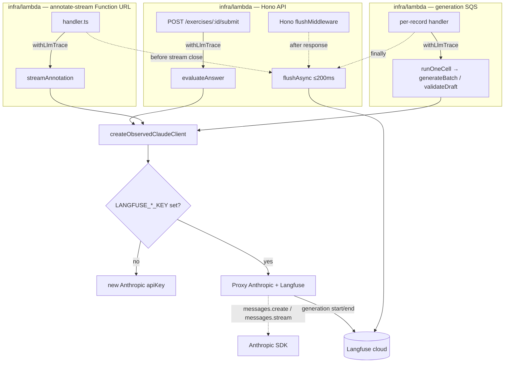
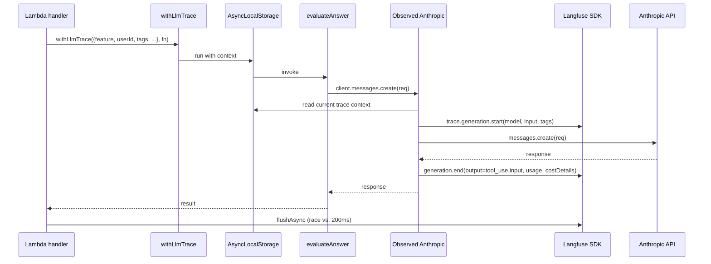
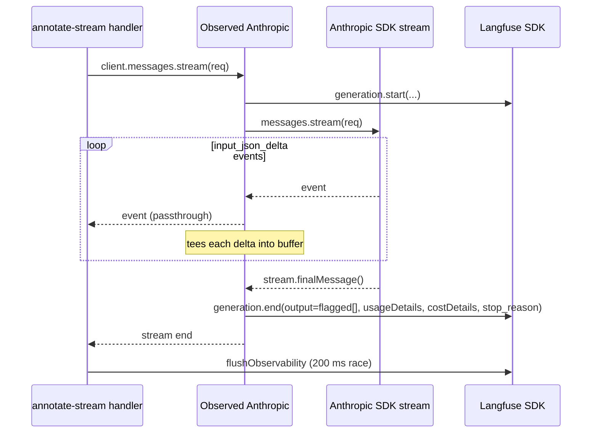

# Design Document

## Overview

Phase 1 adds **read-only LLM tracing via Langfuse cloud** as a strictly
additive layer over the existing Claude integration. The design has one
thesis: **trace by wrapping the Anthropic client itself, with all per-call
metadata flowing in via `AsyncLocalStorage`**. The six AI surface functions
in `packages/ai` (`evaluateAnswer`, `streamAnnotation`, `generateBatch`,
`validateDraft`, `generateTheoryTopic`, `validateTheoryDraft`) keep their
current signatures (they take `Anthropic` and use `client.messages.create` /
`messages.stream` as today); only three Lambda call sites change to
construct the client via a new wrapper and to push trace metadata into the
ALS scope before invoking the surface function.

Reversibility (NFR-5): rolling Phase 1 back deletes
`packages/ai/src/observability.ts`, swaps `createObservedClaudeClient` →
`createClaudeClient` at three call sites, removes one Hono middleware, two
manual flush hooks, and two secret bindings in CDK. No schema migration,
no caller signature change, no test rewrites.

## Steering Document Alignment

### Technical Standards (tech.md)

| Steering rule | How this design honors it |
|---|---|
| TypeScript everywhere, latest stable deps | `langfuse` npm package (Node SDK v3+), no LangChain |
| Serverless-first, near-zero idle cost | Lazy client construction; SDK init is a no-op when keys absent |
| Pre-generated content + metered AI | Tracing is added on top, not in place of, the existing `usage_events` + cost-model |
| Prompt caching reduces cost | Cache buckets (`cacheReadInputTokens`, `cacheCreationInputTokens`) preserved and surfaced in dashboards (Req 4) |
| Secrets in AWS Secrets Manager, injected via CDK | Two new secrets `LANGFUSE_PUBLIC_KEY`, `LANGFUSE_SECRET_KEY` follow the existing `${secretsPrefix}/...` pattern in `infra/lib/constructs/lambda.ts` |
| Forward-only Drizzle migrations | **No schema change in Phase 1.** `userExerciseHistory.id` is already `uuid().defaultRandom()` — we mint the UUID client-side instead, so the row id and the Langfuse trace id are 1:1 from creation. |
| Hono on Lambda | Trace flush is a Hono `app.use('*', flushMiddleware)` in `infra/lambda/src/index.ts` |
| Tests must pass before merging | `LANGFUSE_PUBLIC_KEY` unset in vitest ⇒ wrapper returns vanilla Anthropic ⇒ no test changes required (Req 7 AC 4) |

### Project Structure (structure.md / CLAUDE.md monorepo layout)

| Layer | New / changed files |
|---|---|
| `packages/ai/src/` | **NEW** `observability.ts` (wrapper + ALS context). Add `*_SYSTEM_PROMPT_VERSION` exports to `prompts.ts`, `annotate.ts`, `generation-prompts.ts`, `validation-prompts.ts`, `theory-prompts.ts`, `theory-validation-prompts.ts`. Re-export everything from `index.ts`. |
| `infra/lambda/src/` | `index.ts` → add `flushMiddleware`. `routes/exercises.ts` → swap client + `withLlmTrace`. `generation/handler.ts` → swap client, wrap per-record. `annotate-stream/handler.ts` → swap client + `withLlmTrace` + per-handler flush. |
| `infra/lib/constructs/` | `lambda.ts`, `generation-lambda.ts`, `annotate-stream-lambda.ts` → add the two new secrets. |
| `.env.example` | New `LANGFUSE_PUBLIC_KEY`, `LANGFUSE_SECRET_KEY`, optional `LANGFUSE_BASE_URL`, optional `LANGFUSE_SAMPLE_RATE`. |
| CLAUDE.md | Add `LANGFUSE_PUBLIC_KEY` / `LANGFUSE_SECRET_KEY` rows to the AWS Secrets Manager table; add `*_SYSTEM_PROMPT_VERSION` reminder to the prompt-edit checklist. |

`packages/db` is untouched. `apps/web` is untouched. `apps/mobile` is
untouched.

## Code Reuse Analysis

### Existing Components to Leverage

- **`packages/ai/src/cost-model.ts`** — `ClaudeUsageBreakdown` and
  `estimateCostUsd` produce the four-bucket numbers Langfuse expects.
  The wrapper computes cost via `estimateCostUsd` and passes it as
  Langfuse generation `costDetails` so dashboard cost == DB cost
  (Req 4 AC 3).
- **`packages/ai/src/index.ts`** — already re-exports every public symbol;
  we add the new wrapper + version constants here.
- **`infra/lib/constructs/lambda.ts` (etc.)** — `Secret.fromSecretNameV2`
  + `grantRead` + `environment: { KEY: secret.secretValue.unsafeUnwrap() }`
  is the boilerplate-free pattern for new secrets.
- **`infra/lambda/src/middleware/auth.ts`** — the model for a Hono
  middleware that reads from the Lambda event context. The flush
  middleware follows the same shape.
- **`infra/lambda/src/annotate-stream/handler.ts` step structure** — the
  numbered-step body already has well-defined "after the stream completes"
  and "after metering writes" points; trace finalize + flush hook in
  naturally between them.
- **`infra/lambda/src/generation/handler.ts` per-record try/catch** — each
  SQS record already has an isolated `try`; flush goes in the matching
  `finally`.

### Integration Points

- **Existing usage-event writes (`usage_events` rows)**: unchanged. The
  trace's `submissionId` / `jobId` tags are written *alongside* the
  current accounting, not in place of it.
- **AWS Secrets Manager**: two new secrets per environment (`language-drill/`
  + `language-drill-dev/`). Read at deploy time via existing
  `Secret.fromSecretNameV2` pattern.
- **Vercel envs**: not touched. Tracing happens entirely in Lambda; the
  Next.js web app does not call Anthropic directly.
- **Clerk**: unchanged. `userId` comes from the Hono `Variables` (set by
  `authMiddleware`) or, in the streaming Lambda, from `verifyClerkJwt`'s
  return value — neither flow changes.

## Architecture

### Component diagram



Three runtime contexts (Hono API, streaming Function URL, generation SQS)
all share **the same `createObservedClaudeClient` + `withLlmTrace`
primitives**. Only the flush wiring differs.

### Tracing model



ALS gives every Claude call deep inside a surface function automatic
access to the metadata the call site already knows, without changing the
surface signature. Tags + cost + tool-use output are extracted in the
Proxy, where the request/response are both in scope.

**ALS leakage discipline.** All three call sites `await` the
`withLlmTrace` promise before their handler returns. No work is queued
to `setImmediate`, `process.nextTick`, or any other escape hatch from
inside an ALS scope. This is invariant for the design: any future code
path that needs to detach work from the request should explicitly capture
the relevant `LlmTraceContext` and re-establish a fresh `withLlmTrace`
on the detached side, never rely on ALS bleed-through. The Proxy reads
ALS synchronously at the start of `messages.create` / `messages.stream`,
so all subsequent SDK work is fine even if the outer scope ends.

### Streaming-specific tracing (annotate)



The Proxy NEVER blocks per-event passthrough on Langfuse work — the
generation is finalized only after `finalMessage()`. TTFF (Req 6
Performance: "first `flag` event no later than today") is preserved.

## Components and Interfaces

### Component 1 — `packages/ai/src/observability.ts` (NEW)

- **Purpose:** Single integration point. Exposes `createObservedClaudeClient`,
  `withLlmTrace`, and the trace-metadata types.
- **Public exports:**
  - `createObservedClaudeClient(apiKey: string): Anthropic` — Req 1 ACs 1–3.
  - `withLlmTrace<T>(metadata: LlmTraceContext, fn: () => Promise<T> | T): Promise<T>` — Req 2.
  - `type LlmTraceContext` — see Data Models §1.
  - `flushObservability(timeoutMs?: number): Promise<void>` — Req 6 ACs 1–3.
  - `LANGFUSE_FLUSH_TIMEOUT_MS = 200` — exported so handler tests can
    override it.
  - `__resetForTests(): void` — test-only: discards the module-singleton
    `langfuse` client and clears its `console.warn` once-flag. Used by
    `observability.test.ts` to toggle `LANGFUSE_PUBLIC_KEY` across cases
    without process-restart overhead.
  - `TOOL_NAME_TO_FEATURE: ReadonlyMap<string, LlmFeature>` — exported,
    exhaustive map used by the Proxy to assign `feature` per call (see
    Component 1 internals). Entries:
    `submit_evaluation → 'evaluate'`,
    `submit_annotated_words → 'annotate'`,
    `submit_cloze_draft / submit_translation_draft /
    submit_vocab_recall_draft → 'generate'`,
    `submit_validation_result → 'validate'`,
    `submit_theory_topic → 'generate-theory'`,
    `submit_theory_validation_result → 'validate-theory'`.
- **Dependencies:** `@anthropic-ai/sdk`, `langfuse` (new npm dep, Node SDK
  v3+), `node:async_hooks` (built-in).
- **Reuses:** `ClaudeUsageBreakdown` and `estimateCostUsd` from
  `cost-model.ts`. The Proxy reads `response.usage` and converts it to
  the `ClaudeUsageBreakdown` shape using the same fields that
  `cost-model.ts` already defines.

**Internal structure (illustrative — names/shapes are normative):**

```ts
const als = new AsyncLocalStorage<LlmTraceContext>();
let langfuse: Langfuse | null = null;  // module-singleton, lazily built

function getLangfuse(): Langfuse | null {
  if (langfuse) return langfuse;
  if (!process.env.LANGFUSE_PUBLIC_KEY) return null;
  try {
    langfuse = new Langfuse({
      publicKey: process.env.LANGFUSE_PUBLIC_KEY,
      secretKey: process.env.LANGFUSE_SECRET_KEY!,
      baseUrl: process.env.LANGFUSE_BASE_URL,
      sampleRate: parseSampleRate(process.env.LANGFUSE_SAMPLE_RATE),
      // Use SDK defaults for flushAt / flushInterval. We do NOT lower them:
      // doing so makes each `generation()` call attempt a synchronous-ish
      // network POST and inflates the 25 ms p95 budget (Req 6 AC 4). The
      // per-handler `flushObservability()` is the single drain point.
    });
    return langfuse;
  } catch (err) {
    console.warn('[observability] Langfuse init failed; tracing disabled', err);
    return null;
  }
}

export function createObservedClaudeClient(apiKey: string): Anthropic {
  const inner = new Anthropic({ apiKey });
  const lf = getLangfuse();
  if (!lf) return inner;
  return wrapAnthropic(inner, lf, als);  // returns a Proxy
}

export function withLlmTrace<T>(
  ctx: LlmTraceContext, fn: () => Promise<T> | T,
): Promise<T> {
  return Promise.resolve(als.run(ctx, fn));
}

export async function flushObservability(
  timeoutMs = LANGFUSE_FLUSH_TIMEOUT_MS,
): Promise<void> {
  const lf = langfuse;
  if (!lf) return;
  try {
    await Promise.race([
      lf.flushAsync(),
      new Promise<void>((resolve) => setTimeout(resolve, timeoutMs)),
    ]);
  } catch (err) {
    console.warn('[observability] flush failed', err);
  }
}
```

**The Anthropic Proxy** (`wrapAnthropic`):

- Intercepts the `messages` getter and returns a sub-proxy that wraps
  `create` and `stream`.
- For `create`: starts a generation before the call, ends it after with
  `output = response.content.find(b => b.type === 'tool_use')?.input ??
  response.content`, `usageDetails = mapUsageDetails(response.usage)`,
  `costDetails = buildCostDetails(response.usage)` (Req 4 AC 3, Req 5 AC 1).
  **Important**: use the Langfuse Node SDK v3 fields `usageDetails` (token
  bucket map) and `costDetails` (USD bucket map) — NOT the legacy
  `usage: { input, output, total }` shape. Passing the legacy shape causes
  the SDK to recompute via its built-in Anthropic price book and overrides
  `costDetails` in some dashboard views.
- The Proxy reads `request.tools[0]?.name` and uses
  `TOOL_NAME_TO_FEATURE.get(toolName)` to pick the per-call `feature` tag.
  If the tool name is missing from the map (unrecognized future tool),
  fall back to ALS `feature` and log a one-shot warn — never silently
  mis-tag.
- For `stream`: starts a generation, wraps the returned async iterable
  with a generator that yields every event through unchanged, but tees
  each `content_block_delta` with `input_json_delta` into a buffer that
  also tracks `WordFlag` items, and on `stream.finalMessage()` resolves
  generation with the collected items + `stop_reason` (Req 5 AC 2). The
  upstream `AbortSignal` is not touched — Proxy forwards args verbatim.
- On thrown error: ends generation with `status_message = err.message` /
  `level = 'ERROR'` and re-throws so callers see the original failure
  (Req 5 AC 3, Req 7 AC 2).
- All Langfuse SDK calls inside the Proxy are wrapped in try/catch (Req 7
  ACs 1–2). A single warn is logged per failure, with `feature` from ALS
  if available.

### Component 2 — Call-site integrations

#### 2a. `infra/lambda/src/routes/exercises.ts` (CHANGED)

- **Purpose:** Mint the `submissionId` UUID before the Claude call so it
  becomes both the `userExerciseHistory.id` and the Langfuse trace tag
  (Req 2 AC 7 + AC 1).
- **Interface change:** none — the route handler signature is unchanged.
- **Internal change:**

```ts
import { randomUUID } from 'node:crypto';
import {
  createObservedClaudeClient,
  withLlmTrace,
  evaluateAnswer,
  EVALUATION_SYSTEM_PROMPT_VERSION,
} from '@language-drill/ai';

// inside POST /exercises/:id/submit, after limit checks pass:
const submissionId = randomUUID();
const requestId = (c.env?.event as { requestContext?: { requestId?: string } })
  ?.requestContext?.requestId ?? 'local';

try {
  const client = createObservedClaudeClient(ANTHROPIC_API_KEY);
  const result = await withLlmTrace(
    {
      feature: 'evaluate',
      userId,
      submissionId,
      requestId,
      language: exercise.language,
      cefrLevel: exercise.difficulty,
      exerciseType: exercise.type,
      promptVersion: EVALUATION_SYSTEM_PROMPT_VERSION,
      env: (process.env.LANGFUSE_ENV ?? 'dev') as 'prod' | 'dev',
    },
    () => evaluateAnswer(client, { /* unchanged */ }),
  );

  await db.insert(userExerciseHistory).values({
    id: submissionId,   // <-- explicit, not defaultRandom
    userId, exerciseId: id, sessionId,
    score: result.score,
    responseJson: { userAnswer, evaluation: result },
    evaluatedAt: new Date(),
  });
  // ... usage_events insert unchanged ...
  return c.json(result);
}
```

- **Reuses:** existing rate-limit check (unchanged), existing
  `usage_events` insert (unchanged), Hono `c.env.event` access pattern
  from `middleware/auth.ts`.

#### 2b. `infra/lambda/src/annotate-stream/handler.ts` (CHANGED)

- **Purpose:** Wrap `streamAnnotation` in `withLlmTrace`, flush on exit.
- **Internal change:** between Step 9 (`AbortController`) and Step 10
  (`for await ...`), the call becomes:

```ts
await withLlmTrace(
  {
    feature: 'annotate',
    userId,
    requestId: event.requestContext?.requestId ?? 'local',
    language: learningLanguage,
    cefrLevel: calibration.cefr,
    promptVersion: ANNOTATE_SYSTEM_PROMPT_VERSION,
    candidateCount: candidates.length,
    env: (process.env.LANGFUSE_ENV ?? 'dev') as 'prod' | 'dev',
  },
  async () => {
    const client = createObservedClaudeClient(ANTHROPIC_API_KEY);
    for await (const ev of streamAnnotation(client, { /* unchanged */ })) {
      if (ev.kind === 'flag') {
        writer.writeEvent('flag', ev.flag);
        flaggedCount++;
      }
    }
  },
);
```

After the terminal `done` write (or any terminal `error` write), a single
`await flushObservability()` runs before the `streamifyResponse` callback
returns (Req 6 AC 2). The `terminated` SSE-writer flag already exists;
flush goes in the `finally` of an outer `try { ... }` around the entire
handler body so it runs on success, error, and abort paths.

#### 2c. `infra/lambda/src/generation/handler.ts` (CHANGED)

- **Purpose:** Wrap each SQS record's `runOneCell` call (which calls
  `generateBatch` + `validateDraft` internally) in a `withLlmTrace` scope
  carrying shared context (`jobId`, `cellKey`, language/cefr/type).
- **Why a single outer scope, not nested:** `runOneCell` lives in
  `packages/db` and we keep `run-one-cell.ts` itself observability-free.
  Instead, the Proxy disambiguates `generate` vs `validate` from the
  **in-flight tool name** via the exported `TOOL_NAME_TO_FEATURE` map
  (Component 1). ALS only carries the shared fields; the per-call
  `feature` tag is set by the Proxy.
- **Cardinality.** One SQS record → one `runOneCell` invocation → exactly
  one `generateBatch` call (which itself makes N `messages.create` calls,
  one per ordinal) → **1..M `validateDraft` calls** (initial validation
  per draft + up to `MAX_VALIDATION_RETRIES` retries per failing draft).
  So a single cell typically emits **N generate-tagged traces + 1..M
  validate-tagged traces**, all sharing `jobId` and `cellKey`. The Req 9
  AC 4 dashboard ("validation-rejection rate per cell") groups by tag
  and computes the rate from the trace count — this matches the
  cardinality.
- **Cold-start vs per-record client.** The observed client is constructed
  **once at module scope** (replacing the existing
  `infra/lambda/src/generation/handler.ts:45` cold-start line), not
  per-record. The Proxy reads ALS at call-time, so trace metadata is
  per-record correct even though the client is shared.
- **Concretely:**

```ts
// Module scope — replaces line 45:
const client = createObservedClaudeClient(requireEnv('ANTHROPIC_API_KEY'));

// Inside per-record try{}:
await withLlmTrace(
  {
    feature: 'generate',          // shared default; Proxy overrides for validate
    requestId: record.messageId,
    jobId: parsed.jobId,
    cellKey: buildCellKey(parsed.spec),
    language: parsed.spec.language,
    cefrLevel: parsed.spec.cefrLevel,
    exerciseType: parsed.spec.exerciseType,
    promptVersion: GENERATION_PROMPT_VERSION,
    env: (process.env.LANGFUSE_ENV ?? 'dev') as 'prod' | 'dev',
  },
  () => runOneCell({ client, /* unchanged */ }),
);
```

The Proxy reads `tools[0].name` of each `messages.create` and looks it
up in `TOOL_NAME_TO_FEATURE`. This handles every existing tool
exhaustively. Theory generation is reached only via the out-of-scope CLI
script in Phase 1; the map entries for theory are still populated so the
day theory generation moves into the Lambda flow no code change is
required.

**Per-record flush** lives in `finally`:

```ts
} finally {
  await flushObservability();
}
```

Within the per-record try/catch, not the per-batch one — so each
record's buffered traces flush regardless of outcome.

#### 2d. `infra/lambda/src/index.ts` (CHANGED)

Add a Hono middleware that flushes after every API response:

```ts
import { flushObservability } from '@language-drill/ai';

app.use('*', async (_c, next) => {
  try { await next(); } finally { await flushObservability(); }
});
```

Mounted **before** the route registrations so it wraps the full request
lifecycle.

### Component 3 — CDK secrets wiring (CHANGED)

**Three files**, each with the same three-line addition pattern:

```ts
// e.g. infra/lib/constructs/lambda.ts
const langfusePublicKey = secretsmanager.Secret.fromSecretNameV2(
  this, 'LangfusePublicKey', `${props.secretsPrefix}/LANGFUSE_PUBLIC_KEY`,
);
const langfuseSecretKey = secretsmanager.Secret.fromSecretNameV2(
  this, 'LangfuseSecretKey', `${props.secretsPrefix}/LANGFUSE_SECRET_KEY`,
);
// inside environment: { ... }
LANGFUSE_PUBLIC_KEY: langfusePublicKey.secretValue.unsafeUnwrap(),
LANGFUSE_SECRET_KEY: langfuseSecretKey.secretValue.unsafeUnwrap(),
LANGFUSE_ENV: props.secretsPrefix === 'language-drill' ? 'prod' : 'dev',
// after .handler construction:
langfusePublicKey.grantRead(this.handler);
langfuseSecretKey.grantRead(this.handler);
```

`LANGFUSE_ENV` is a non-secret env var derived from `secretsPrefix` —
single source of truth for "are we prod or dev?" without scattering
`if (stack.name === 'LanguageDrillStack')` checks across handlers.

`fromSecretNameV2 + unsafeUnwrap` produces a CloudFormation token that
is resolved at Lambda invocation time, not at deploy time — so CDK does
NOT fail the deploy if the secret is missing. The failure mode is:
Lambda boots, finds `LANGFUSE_PUBLIC_KEY` unset, and gracefully no-ops
via Req 1 AC 2. Operationally, the two Secrets Manager entries MUST be
created before merge (manual one-time `aws secretsmanager create-secret`
per env). The runbook line goes into CLAUDE.md alongside the other six
secret rows.

### Component 4 — Prompt-version exports (CHANGED in 6 files)

Each file currently exporting a system prompt also exports a new
`*_VERSION` constant. Format: `<surface>@<YYYY-MM-DD>` (the day the prompt
was last semantically edited).

```ts
// packages/ai/src/prompts.ts
export const EVALUATION_SYSTEM_PROMPT_VERSION = 'evaluate@2026-05-12';

// packages/ai/src/annotate.ts
export const ANNOTATE_SYSTEM_PROMPT_VERSION = 'annotate@2026-05-12';

// packages/ai/src/generation-prompts.ts
export const GENERATION_PROMPT_VERSION = 'generate@2026-05-12';

// packages/ai/src/validation-prompts.ts
export const VALIDATION_PROMPT_VERSION = 'validate@2026-05-12';

// packages/ai/src/theory-prompts.ts
export const THEORY_GENERATION_PROMPT_VERSION = 'theory-generate@2026-05-12';

// packages/ai/src/theory-validation-prompts.ts
export const THEORY_VALIDATION_PROMPT_VERSION = 'theory-validate@2026-05-12';
```

Re-export each from `packages/ai/src/index.ts` (Req 10 AC 1).

**Process touch (Req 10 AC 4):** add a single line to CLAUDE.md's
"Package Management" section (or a new "Prompt Editing" subsection):

> When editing any `*_SYSTEM_PROMPT` constant in `packages/ai/src/`, bump
> the matching `*_PROMPT_VERSION` constant to today's date in the same
> commit. Failure to bump means dashboards cannot tell old and new traces
> apart.

Editing `.github/pull_request_template.md` is the alternative; we pick
CLAUDE.md because there is no existing PR template in this repo, and
adding one is out of scope for Phase 1.

## Data Models

### Model 1 — `LlmTraceContext` (in `observability.ts`)

```
type LlmFeature =
  | 'evaluate' | 'annotate'
  | 'generate' | 'validate'
  | 'generate-theory' | 'validate-theory';

type LlmEnv = 'prod' | 'dev';

interface LlmTraceContext {
  feature: LlmFeature;                       // Req 2.1–2.6 — Proxy may override per-call
  env: LlmEnv;                                // Req 2.9, Req 3.1 (env tag)
  promptVersion: string;                      // e.g. 'evaluate@2026-05-12'
  // identity (Req 2 AC 8)
  userId?: string;                            // omitted for background features
  // cross-references (Req 2 AC 7, AC 1, AC 3, AC 4)
  submissionId?: string;                      // evaluate only — UUID == userExerciseHistory.id
  jobId?: string;                             // generate/validate — generation_jobs id
  cellKey?: string;                           // generate/validate — language|cefr|type|grammar
  exerciseId?: string;                        // validate — the draft id under validation
  // dashboard pivots (Req 3.1 tag schema)
  language?: 'en' | 'es' | 'de' | 'tr';
  cefrLevel?: 'A1' | 'A2' | 'B1' | 'B2' | 'C1' | 'C2';
  exerciseType?: 'cloze' | 'translation' | 'vocab_recall' | 'reading' | 'theory' | null;
  // operational
  requestId: string;                          // Lambda request id (Req 2 AC 1 and 2)
  // optional surface-specific
  candidateCount?: number;                    // annotate only (Req 2 AC 2)
}
```

### Model 2 — Token usage mapping (Langfuse Node SDK v3)

```ts
// Computed inside the Proxy after each `messages.create` response.
function mapUsageDetails(u: Anthropic.Usage): Record<string, number> {
  // Langfuse Node SDK v3 expects a flat `usageDetails` map keyed by
  // arbitrary token-bucket names. We keep the names aligned with
  // ClaudeUsageBreakdown so downstream filters are intuitive.
  return {
    input: u.input_tokens ?? 0,
    cache_creation_input: u.cache_creation_input_tokens ?? 0,
    cache_read_input: u.cache_read_input_tokens ?? 0,
    output: u.output_tokens ?? 0,
  };
}

function buildCostDetails(u: Anthropic.Usage): Record<string, number> {
  // Per-bucket USD, computed the same way as cost-model.ts but split.
  return {
    input: (u.input_tokens ?? 0) * SONNET_4_5_PRICING.inputUsdPerToken,
    cache_creation_input:
      (u.cache_creation_input_tokens ?? 0) * SONNET_4_5_PRICING.cacheWriteUsdPerToken,
    cache_read_input:
      (u.cache_read_input_tokens ?? 0) * SONNET_4_5_PRICING.cacheReadUsdPerToken,
    output: (u.output_tokens ?? 0) * SONNET_4_5_PRICING.outputUsdPerToken,
  };
}
```

Passed to Langfuse as `usageDetails` (token counts) **and** `costDetails`
(USD per bucket). We deliberately do NOT pass the legacy `usage: {input,
output, total}` shape — that triggers Langfuse to re-derive cost via its
built-in price book and can clobber `costDetails` in dashboards.

For invariance verification: a `cost-model.test.ts` round-trip asserts
`sum(buildCostDetails(u))` equals `estimateCostUsd(mapUsage(u))` to
within $0.0001 (Req 4 AC 3), where `mapUsage` is the
`ClaudeUsageBreakdown` builder kept for backward use by today's CLI
scripts.

### Model 3 — Tag emission

Tag values for a single trace are the concatenation of:

1. Always-present: `feature`, `env`, `model` (taken from `request.model`).
2. From `LlmTraceContext` if defined: `language`, `cefrLevel`,
   `exerciseType`.
3. **Not** tags: `userId` (Langfuse first-class user field, Req 3 AC 2),
   `jobId` / `cellKey` / `exerciseId` (these go into `trace.metadata`
   for filter-search). `submissionId` is *both* `trace.metadata` and a
   tag so the most common pivot in Req 9 AC 2 stays one-click in
   Langfuse's tag-filter UI.

## Error Handling

### Scenario 1 — Langfuse SDK throws during client construction

- **Handling:** `getLangfuse()` catches synchronously, logs at warn level
  (one log line per cold start), returns `null`. `createObservedClaudeClient`
  returns vanilla Anthropic.
- **User Impact:** none. Tracing silently disabled until next cold start.
  Req 7 AC 1.

### Scenario 2 — Langfuse SDK throws during a per-call trace (start/end)

- **Handling:** Each per-trace SDK invocation in the Proxy is wrapped in
  try/catch. A single `console.warn` per Lambda invocation (gated by a
  module-level flag reset per cold start) — never per event.
- **User Impact:** none. The Claude call still resolves on its own merits.
  Req 7 AC 2.

### Scenario 3 — `flushAsync` times out (>200 ms)

- **Handling:** `Promise.race` resolves with the timeout. A `console.warn`
  logs `feature`, `requestId`, and `traces buffered` (read from a
  module-level counter the Proxy increments). The Lambda response is
  returned without further delay.
- **User Impact:** the user sees a normal response. Affected traces are
  dropped at the next freeze. Req 6 AC 5.

### Scenario 4 — `messages.stream` is aborted (client disconnect)

- **Handling:** The existing `AbortController` in
  `annotate-stream/handler.ts` cancels the upstream Anthropic stream. The
  Proxy's stream wrapper detects abort via the iterator's thrown
  `DOMException: aborted` (or the Anthropic SDK's equivalent) and
  finalizes the Langfuse generation with `level = 'WARNING'`,
  `statusMessage = 'client_disconnect'`, and the partial flag list
  collected so far.
- **User Impact:** none (the client already disconnected). The trace is
  marked partial in dashboards.

### Scenario 5 — Tool-use parse error after a successful Claude call

- **Handling:** The Proxy still sees a successful Anthropic response, so
  the generation is closed with the tool-use input as `output` (which IS
  the malformed thing). The surface function throws
  `parseEvaluationResult`, which the route handler maps to 502
  `AI_UNAVAILABLE` as today (`exercises.ts:218`). Future-you debugging
  that 502 sees the bad tool payload in Langfuse + the parse error in
  CloudWatch.
- **User Impact:** unchanged — same 502 they got pre-Langfuse.

## Testing Strategy

### Unit Testing

**New file:** `packages/ai/src/observability.test.ts`. Coverage:

- `createObservedClaudeClient` returns vanilla Anthropic when
  `LANGFUSE_PUBLIC_KEY` is unset (Req 1 AC 2). Verified by asserting the
  returned client's `messages.create` is the same identity as
  `new Anthropic({apiKey}).messages.create`.
- When env vars are set, returns a Proxy that still passes a basic
  `messages.create` round-trip with a mocked Anthropic SDK (the test
  injects a mock Anthropic via the SDK's `fetch` option or via test-only
  module mocking). The Proxy must forward arguments untouched and return
  the response unchanged.
- `withLlmTrace` propagates context to a `messages.create` callback
  through a real-ish chain (mock Anthropic, mock Langfuse client). The
  test asserts the Langfuse `generation.create` call received the
  expected `metadata.feature`, `tags`, `userId`, `prompt`, and
  `output = tool_use.input`.
- Streaming path: feed a `messages.stream` mock that yields three
  `input_json_delta` events; assert the Proxy yields the same three
  events upstream AND the Langfuse generation is finalized with three
  items + `stop_reason: 'end_turn'`.
- Error path: Anthropic mock throws; assert the Langfuse generation is
  finalized with `level: 'ERROR'` and the error re-throws.
- Truncation path: stream mock yields `stop_reason: 'max_tokens'`; assert
  the Langfuse generation is finalized with `level: 'WARNING'` and
  `flaggedCount`.
- Langfuse failure path: Langfuse mock throws on `flushAsync`; assert no
  unhandled rejection and `flushObservability` resolves within timeout.
- Feature override path: a `messages.create` whose `tools[].name`
  matches `VALIDATION_TOOL_NAME` while ALS feature is `'generate'`
  emits a Langfuse generation tagged `feature='validate'`.

- `__resetForTests()` between tests that toggle `LANGFUSE_PUBLIC_KEY`:
  the module-singleton `langfuse` is otherwise cached after first
  successful init and ignores subsequent env-var changes in-process.

**Existing tests stay green** because every existing test in `packages/ai`
and `infra/lambda` runs without `LANGFUSE_PUBLIC_KEY` and the wrapper
returns vanilla Anthropic. **Req 7 AC 4.**

**`packages/ai/src/cost-model.test.ts`** — add one round-trip test
asserting `estimateCostUsd` and the Proxy's `costDetails` computation
agree to within $0.0001 (Req 4 AC 3).

### Integration Testing

**`infra/lambda/src/routes/exercises.test.ts`** — add a `describe` block
that:

1. Sets `LANGFUSE_PUBLIC_KEY` to a sentinel, mocks the Langfuse SDK at the
   `packages/ai/observability` boundary.
2. Posts a submission with a stubbed Anthropic that returns a fixed
   evaluation.
3. Asserts: `userExerciseHistory.id == submissionId` minted in handler;
   one Langfuse generation was emitted with `metadata.submissionId == id`,
   `metadata.userId == 'dev_user_001'`, `tags` includes `'evaluate'`.
4. Asserts the response is byte-identical to the pre-observability test.

**`infra/lambda/src/annotate-stream/handler.test.ts`** — analogous test
asserting `flushObservability` is called once after `done` or `error`.

**`infra/lambda/src/generation/handler.test.ts`** — assert per-record
flush is called in both success and failure branches.

### End-to-End Testing

Manual, post-deploy, gated by Req 9 ACs:

- Submit one answer from `apps/web` against dev API; verify a trace
  appears in the `language-drill-dev` Langfuse project within 30 s with
  `submissionId` matching the new `userExerciseHistory.id`.
- Run one generation cell against dev (e.g. a `count: 3` job); verify
  the expected number of traces appear — `count` generate-tagged traces
  + `1..MAX_VALIDATION_RETRIES × count` validate-tagged traces — all
  sharing `jobId` and `cellKey`, with `validate` traces carrying the
  draft's `exerciseId`.
- Trigger one annotation against dev; verify a single trace with
  `flaggedCount` and the full WordFlag array as output.
- Pin five dashboards (Req 9 AC 1–5) in the dev Langfuse project; smoke
  them; promote definitions to prod project after merge.

No automated E2E (web → API → Langfuse) — the existing CI doesn't have a
browser harness and adding one is out of Phase 1's scope.

## Open Questions Resolved Here

| From requirements.md Open Questions | Resolution in this design |
|---|---|
| 1. `submissionId` shape | UUID minted client-side in `exercises.ts` via `randomUUID()`, used as both the Langfuse trace tag AND the `userExerciseHistory.id` on insert. No schema change. |
| 2. `generate` sampling | Plumbed via `LANGFUSE_SAMPLE_RATE` env var → `Langfuse({ sampleRate })`. Default 1.0; flip down per env without redeploy. Measurement-driven (defer until week of post-deploy data). |
| 3. Storing user answers verbatim | Accepted for Phase 1 (`responseJson` already stores it in Postgres). Same data flows to Langfuse via tool-use output. CLAUDE.md privacy note added. |
| 4. Retention | Free-tier 30 days accepted for Phase 1. Phase 2 will decide S3 export. |
| 5. Mobile flow | No code change needed in Phase 1 — confirm at Phase 4. |
