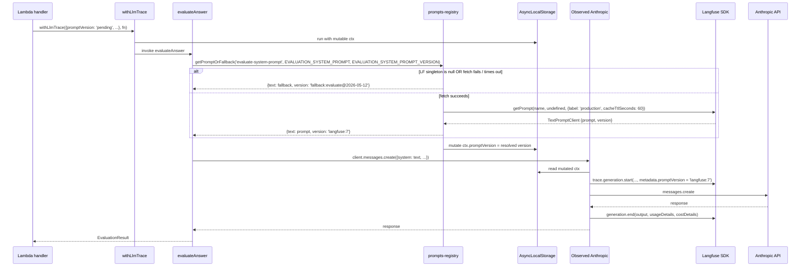
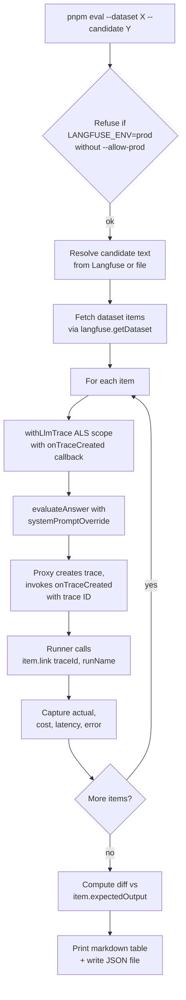
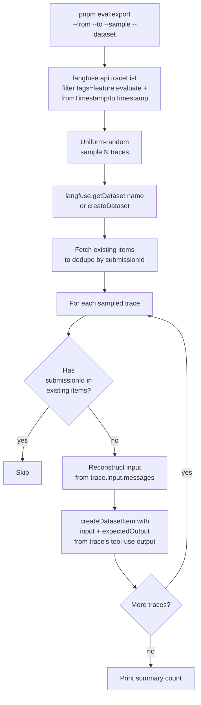
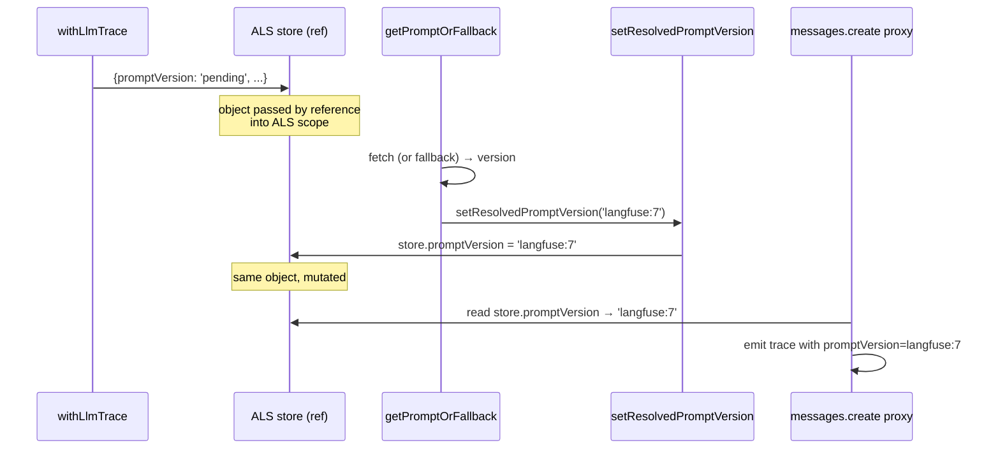

# Design Document

## Overview

Phase 2 layers two new capabilities on top of Phase-1 tracing:

1. **Runtime prompt registry.** Every Claude system prompt has a Langfuse
   "twin" registered at the same name. Surface functions in `packages/ai`
   fetch the live text via `getPromptOrFallback(name, fallback,
   fallbackVersion)` and substitute variables locally; on Langfuse outage,
   they fall back to the in-repo string with **zero** behavior change.
   The resolved version (e.g. `langfuse:7` or `fallback:evaluate@2026-05-12`)
   is recorded as the trace `promptVersion` so dashboards cohort old vs.
   new prompts the same way they already do.
2. **`pnpm eval:export` + `pnpm eval` CLIs.** Two Node scripts in
   `packages/ai/scripts/`. The exporter samples Phase-1 evaluation traces
   from a date / language / CEFR window into a Langfuse dataset. The
   runner takes a candidate prompt source (`langfuse:<name>@<label>` or
   `file:<path>`), runs `evaluateAnswer` against every dataset item with
   the candidate as a `systemPromptOverride`, links each result trace to
   a dataset run, and prints a quality / cost / latency diff vs. the
   baseline captured in `expectedOutput`.

The two pieces are independent in implementation but coupled in workflow:
the registry makes prompt edits an operator action; the eval runner makes
those edits safe to ship.

The design has three implementation theses:

- **Async, not lazy.** Surface functions become `async` for prompt fetch
  (they were already async for `messages.create`). No background prefetch,
  no module-init network call.
- **Fallback is the source of truth.** The in-repo `*_SYSTEM_PROMPT`
  string remains the canonical text. Langfuse is the *operational
  override*. A `bootstrap-prompts.ts` script keeps them in sync at
  registration time.
- **Mutate-ALS for resolved version.** Phase 1 creates `LlmTraceContext`
  at the call site with `promptVersion: <local-version>`. Phase 2 mutates
  that field in-place after the prompt fetch resolves, so the Phase-1
  Proxy emits the *resolved* version on the subsequent `messages.create`.
  ALS stores objects by reference; mutation is observed by downstream
  Proxy reads in the same async chain. This avoids changing the Phase-1
  Proxy plumbing.

Reversibility (Req 9): rolling Phase 2 back deletes one module
(`prompts-registry.ts`), three CLI scripts, and six call-site adapters in
`packages/ai/src/`. No DB schema migration, no CDK change, no Phase-1
file touched.

## Steering Document Alignment

### Technical Standards (tech.md)

| Steering rule | How this design honors it |
|---|---|
| TypeScript everywhere | Pure TS additions; no new runtime deps. Langfuse SDK v3.38.20 already installed for Phase 1 (`packages/ai/package.json`). |
| Serverless-first, near-zero idle cost | Prompt fetch is lazy (on first Claude call), in-process (Langfuse SDK uses HTTP + in-memory cache), and no-op when keys are absent. |
| Pre-generated content + metered AI | Phase 2 doesn't alter content generation cost; the eval runner runs against the **dev** Anthropic key (Req 8 AC 2) to keep prod metering untouched. |
| Prompt caching reduces cost | Builder-composed prompts (`generate`, `validate`, `theory-*`) produce byte-identical output for byte-identical inputs (`generation-prompts.ts:7-8` invariant). Phase 2 preserves this via SDK cache TTL ≥ longest cell duration. |
| Secrets in AWS Secrets Manager | No new secrets — Phase-1's `LANGFUSE_PUBLIC_KEY` / `LANGFUSE_SECRET_KEY` are reused. |
| Forward-only Drizzle migrations | **No schema change.** Dataset items live in Langfuse; eval-run summaries live on the local filesystem under `./eval-runs/` (git-ignored). |
| Hono on Lambda | No new Lambda routes. CLIs run from a developer laptop. |
| Tests gate task completion | Every new file is co-located with a `*.test.ts`. CI runs `pnpm test` with `LANGFUSE_PUBLIC_KEY` unset; mocks cover the Langfuse-on path. |
| Latest stable deps | No new deps. |

### Project Structure (CLAUDE.md monorepo layout)

| Layer | New / changed files |
|---|---|
| `packages/ai/src/` | **NEW** `prompts-registry.ts` (fetch + cache + fallback + template substitution + ALS mutator). **CHANGED**: `evaluate.ts`, `annotate.ts`, `generation-prompts.ts`, `validation-prompts.ts`, `theory-prompts.ts`, `theory-validation-prompts.ts` (async fetch + `systemPromptOverride`). **CHANGED**: `observability.ts` (add `onTraceCreated` callback to `LlmTraceContext` that receives the `LangfuseTraceClient`; Proxy invokes it). **CHANGED**: `index.ts` (re-export new symbols). |
| `packages/ai/scripts/` | **NEW** `bootstrap-prompts.ts`, `eval-export.ts`, `eval-run.ts`. (Lives in `packages/ai` — not `packages/db` — because the three scripts primarily import `evaluateAnswer`, `createObservedClaudeClient`, and the six `*_SYSTEM_PROMPT*` constants from `packages/ai`. `packages/ai` already declares `@language-drill/db` as a workspace dep — the single SELECT against `user_exercise_history` in `eval-export.ts` reuses that existing dep. Putting scripts under `packages/db` would invert the directionality.) |
| `packages/ai/package.json` | Add `bootstrap-prompts`, `eval`, `eval:export` scripts (each runs the matching `scripts/*.ts` via `tsx`). |
| Root `package.json` | Add `pnpm eval`, `pnpm eval:export`, `pnpm bootstrap-prompts` filter shortcuts (`pnpm --filter @language-drill/ai eval`). |
| `.env.example` | Add `LANGFUSE_PROMPT_CACHE_TTL_MS`, `LANGFUSE_PROMPT_FETCH_TIMEOUT_MS` optional knobs. |
| `docs/llm-observability.md` | Add "Phase 2 — Prompt registry" section. |
| `CLAUDE.md` | Add CLI commands to "Running locally" table; update "Prompt Editing" note. |
| `.gitignore` | Add `eval-runs/`. |

`apps/web`, `apps/mobile`, `infra/lambda`, `infra/lib`, `packages/db`,
`packages/api-client`, `packages/shared` — **none** change. Only
`packages/ai` does. `infra/*` is untouched; the Lambdas pick up the new
prompt-fetch behavior automatically because they already import the
surface functions from `@language-drill/ai`. The Phase-1 `streamAnnotation`
hot path is unaffected — it already `await`s its setup before opening the
SSE stream, so prepending one more `await` for prompt fetch costs
nothing on the time-to-first-event metric.

## Code Reuse Analysis

### Existing Components to Leverage

- **`packages/ai/src/observability.ts`** — `getLangfuse()` already returns
  the lazy Langfuse singleton with proper init guards (Req 7 AC 1). The
  registry reuses it directly. The `withLlmTrace` / ALS scope is already
  in place; Phase 2 adds an `onTraceCreated` callback to `LlmTraceContext`
  and mutates `ctx.promptVersion` after fetch.
- **`packages/ai/src/cost-model.ts`** — `estimateCostUsd` is reused
  verbatim in the eval runner for per-item cost aggregation. No change.
- **`*_SYSTEM_PROMPT_VERSION` constants** from Phase 1 — these become
  the `fallbackVersion` argument to `getPromptOrFallback`. Re-exported
  from `packages/ai/src/index.ts`; no new exports needed for the local
  versions.
- **`packages/ai/src/validation-prompts.ts`'s `VALIDATION_SYSTEM_PROMPT_
  TEMPLATE`** — currently a test-only constant. Phase 2 makes it the
  live fallback template by refactoring `buildValidationSystemPrompt`
  to use template substitution. Same applies to the generation/theory
  builders (we add `GENERATION_SYSTEM_PROMPT_TEMPLATE` etc.).
- **Drizzle CLI scripts pattern** — `packages/db/scripts/generate-
  exercises.ts` (CLI; uses `tsx`, parses argv, reads `DATABASE_URL`) is
  the template for the three new scripts.
- **Langfuse SDK v3 surface area**: `getPrompt(name, version?, options?)`,
  `createPrompt({...})`, `getDataset(name)`, `createDataset({...})`,
  `createDatasetItem({...})`, `datasetItem.link(trace, runName)`,
  `api.traceList(query)`, `trace.id` accessor. All in v3.38.20.

### Integration Points

- **Langfuse prompt fetch** integrates with the Phase-1 trace stream via
  ALS mutation: the registry mutates `ctx.promptVersion` after a fetch,
  so the next `messages.create` proxy reads the mutated value.
- **Dataset export** reads from the **Langfuse Trace API** (not the Neon
  `user_exercise_history` table). This is a one-way data flow: traces
  carry enough payload to reconstruct dataset inputs (Phase-1 Proxy stores
  `input.messages` and `input.system`).
- **Eval runner** writes to the **Langfuse Dataset API** and to the local
  filesystem (`./eval-runs/<runName>.json`). It reads from
  `ANTHROPIC_API_KEY` (dev key) and emits real Claude calls. Cost goes
  on the dev Anthropic budget.
- **No CDK / Lambda surface changes.** Lambdas auto-pick the new
  prompt-fetch behavior because `evaluateAnswer` and friends become
  `async` (they already are).

## Architecture

### Runtime flow — single Claude call with prompt registry



The registry is a thin layer between the surface and the Proxy. The Proxy
itself is unchanged from Phase 1 except for emitting a new optional
`onTraceCreated` event for the eval runner.

### Eval-runner data flow



### Eval-export data flow



### Phase-1 → Phase-2 ALS mutation pattern



ALS stores object references, not snapshots. Any code with access to the
store can mutate it; downstream reads in the same async chain see the
mutation. We expose **one** mutator (`setResolvedPromptVersion`) to keep
the mutation surface narrow.

## Components and Interfaces

### Component 1 — `packages/ai/src/prompts-registry.ts` (NEW)

- **Purpose:** Single integration point for prompt fetch + cache +
  fallback. All surfaces go through it.
- **Public exports:**
  - `getPromptOrFallback(name, fallback, fallbackVersion, label?): Promise<ResolvedPrompt>` — Req 2 AC 1–7.
  - `getPromptWithVarsOrFallback(name, fallbackTemplate, fallbackVersion, vars, label?): Promise<ResolvedPrompt>` — Req 3.
  - `applyTemplate(template, vars): { text: string; missingVars: string[] }` — fallback substituter; exported for tests.
  - `LANGFUSE_PROMPT_CACHE_TTL_MS = 300_000` (5 minutes; override via env).
    Chosen to **bracket Anthropic's 5-minute ephemeral prompt-cache TTL**:
    if the wrapper cache TTL is *shorter* than Anthropic's, a refetch
    that returns a new Langfuse version mid-Anthropic-cache-window
    breaks the in-progress cache lifecycle and forces a re-cache-write
    on the next call. Matching the two TTLs makes the worst-case cost
    impact of an operator prompt promotion a single cache miss per
    surface per Lambda. (See "Cache-window byte-identity" note below.)
  - `LANGFUSE_PROMPT_FETCH_TIMEOUT_MS = 250` (override via env).
  - `PROMPT_LABEL_PRODUCTION = 'production'` — single source of truth for the label string.
  - `__resetRegistryForTests(): void` — clears in-memory cache + warn-once flag.
- **Dependencies:** `langfuse` (transitively, via `observability.ts`'s
  `getLangfuse()`), `node:async_hooks` (via `observability.ts`).
- **Reuses:** `getLangfuse()`, `getCurrentLlmTraceContext()`, the
  Phase-1 module-scope warn-once helper (re-exported as
  `__warnOnce`).

**Public types:**

```ts
export interface ResolvedPrompt {
  /** The system prompt text to send to Claude. Either the live Langfuse
   *  body (template-substituted, if vars were passed) or the in-repo
   *  fallback. */
  text: string;
  /** The version tag for trace cohorting:
   *    - `langfuse:<N>` on a successful Langfuse fetch (N = SDK-reported version).
   *    - `fallback:<*_SYSTEM_PROMPT_VERSION>` on any fallback path. */
  version: string;
  /** True iff the fallback path was taken (LF outage, timeout, unset keys,
   *  or template-validation failure). Set on the trace as
   *  `promptFallback=true` metadata. */
  fromFallback: boolean;
}
```

**Internal structure (illustrative):**

```ts
import type { TextPromptClient } from 'langfuse';

// Single source of truth: the wrapper cache stores enough to serve every
// kind of consumer.
//
//   `promptClient`     — present on a successful Langfuse fetch; holds the
//                        TextPromptClient so `compile(vars)` can run on every
//                        builder call without a network trip. `null` for the
//                        fallback path and for `getPromptOrFallback` calls
//                        (static prompts, no vars).
//   `resolved`         — the simple { text, version, fromFallback } that
//                        static-prompt callers consume directly.
//   `fetchedAt`        — TTL anchor.
//
// We pass `cacheTtlSeconds: 0` to the SDK to disable its internal cache —
// this wrapper IS the single cache.
type CacheEntry = {
  resolved: ResolvedPrompt;
  promptClient: TextPromptClient | null;
  fetchedAt: number;
};
const cache = new Map<string, CacheEntry>();
const warnedNames = new Set<string>();  // one warn per surface per cold start

const TTL_MS = Number(process.env.LANGFUSE_PROMPT_CACHE_TTL_MS) || LANGFUSE_PROMPT_CACHE_TTL_MS;
const TIMEOUT_MS = Number(process.env.LANGFUSE_PROMPT_FETCH_TIMEOUT_MS) || LANGFUSE_PROMPT_FETCH_TIMEOUT_MS;

async function fetchOrFallback(
  name: string,
  fallback: string,
  fallbackVersion: string,
  label: string,
): Promise<CacheEntry> {
  const lf = getLangfuse();
  if (!lf) {
    return {
      resolved: { text: fallback, version: `fallback:${fallbackVersion}`, fromFallback: true },
      promptClient: null,
      fetchedAt: Date.now(),
    };
  }
  try {
    const fetched = await raceWithTimeout(
      lf.getPrompt(name, undefined, { label, cacheTtlSeconds: 0 }),
      TIMEOUT_MS,
      `prompt-fetch:${name}`,
    );
    return {
      resolved: { text: fetched.prompt, version: `langfuse:${fetched.version}`, fromFallback: false },
      promptClient: fetched,
      fetchedAt: Date.now(),
    };
  } catch (err) {
    if (!warnedNames.has(name)) {
      warnedNames.add(name);
      console.warn(`[prompts-registry] fetch failed for "${name}@${label}"; using fallback`, err);
    }
    return {
      resolved: { text: fallback, version: `fallback:${fallbackVersion}`, fromFallback: true },
      promptClient: null,
      fetchedAt: Date.now(),
    };
  }
}

export async function getPromptOrFallback(
  name: string,
  fallback: string,
  fallbackVersion: string,
  label: string = PROMPT_LABEL_PRODUCTION,
): Promise<ResolvedPrompt> {
  const cacheKey = `${name}@${label}`;
  let entry = cache.get(cacheKey);
  if (!entry || Date.now() - entry.fetchedAt >= TTL_MS) {
    entry = await fetchOrFallback(name, fallback, fallbackVersion, label);
    cache.set(cacheKey, entry);
  }
  setResolvedPromptVersion(entry.resolved.version, entry.resolved.fromFallback);
  return entry.resolved;
}
```

**Notes on the cache strategy:**

- One cache. The wrapper Map is the only cache; the Langfuse SDK's
  internal prompt cache is disabled via `cacheTtlSeconds: 0`. Two caches
  with different TTLs leads to "Langfuse SDK has v8, wrapper has v7"
  bugs — disable one.
- The cache stores the **whole `TextPromptClient`** (not just the text)
  so `compile(vars)` runs locally on every call after the initial fetch
  — no per-call network round-trip even for template prompts.
- A successful fetch and a fallback both populate the cache, so a
  Langfuse outage doesn't trigger a network retry on every Claude call
  during the TTL window.
- Cache entries are **never** evicted on success; they expire by TTL.
  Bounded to 6 entries × ~10 KB ≈ 60 KB. Well within Lambda 128 MB.

**Cache-window byte-identity for Anthropic prompt caching (NFR Performance):**

The Phase-1 builder invariant ("two calls with the same inputs MUST
return identical strings — `generation-prompts.ts:7-8`") interacts with
this cache in one boundary case: an SQS-driven generation cell that
takes longer than `TTL_MS` AND straddles a Langfuse prompt promotion.
Sequence: ordinal 1 fetches v7 at t=0 → caches → 5 minutes elapse →
ordinal N+1 starts at t=5min+1s, sees expired cache → refetches → v8 →
emits a different system prompt. Anthropic's ephemeral prompt cache
(also 5-minute TTL) is breaking at the same instant by coincidence —
so the worst case is a single re-cache-write per surface per Lambda
per 5-minute window.

Mitigations evaluated:

| Approach | Pro | Con | Picked? |
|---|---|---|---|
| Per-scope ALS freeze: first fetch in a `withLlmTrace` scope writes to both module cache AND the ALS frame; subsequent fetches in the same scope read the frame. | Bulletproof within-cell identity. | Adds an LRU to the ALS context; complicates Phase-1 surface. | Deferred — only adopt if monitoring shows the boundary causing measurable cache-miss spikes. |
| Cold-start-freeze (no TTL): cache is refreshed only on Lambda cold start. | Bulletproof. | Operator promotion delay is unbounded — a Lambda warm for hours never sees the new prompt. | Rejected — violates Req 1 AC 4 ("next Lambda cold start" implies bounded propagation). |
| **5-minute TTL aligned with Anthropic ephemeral cache (chosen)**. | Bounded propagation (≤ 5 min). Cache misses at the boundary coincide with Anthropic's cache rotation — no double penalty. | The rare straddling case above. | Yes. |

This trade-off is documented; if generation-cost dashboards show a
spike in cache-write tokens after a prompt promotion, the per-scope
ALS freeze becomes the next iteration (one PR, no schema change).

**Template substituter for the fallback path (and for Langfuse-disabled
local dev):**

```ts
const TEMPLATE_VAR_RE = /\{\{(\w+)\}\}/g;

export function applyTemplate(
  template: string,
  vars: Record<string, string>,
): { text: string; missingVars: string[] } {
  const missing: string[] = [];
  const text = template.replace(TEMPLATE_VAR_RE, (match, key: string) => {
    if (key in vars) return vars[key];
    missing.push(key);
    return match;  // leave the {{key}} in place so the bug is loud
  });
  return { text, missingVars: missing };
}
```

Langfuse's `prompt.compile(vars)` uses Mustache.js, which supports
`{{flatVar}}` identically to our regex above. Both code paths produce
byte-identical output for flat-string vars — required for Anthropic
prompt-caching parity (Req 3 AC 2 / NFR Performance).

**Template + vars wrapper:**

```ts
export async function getPromptWithVarsOrFallback(
  name: string,
  fallbackTemplate: string,
  fallbackVersion: string,
  vars: Record<string, string>,
  label: string = PROMPT_LABEL_PRODUCTION,
): Promise<ResolvedPrompt> {
  const cacheKey = `${name}@${label}`;
  let entry = cache.get(cacheKey);
  if (!entry || Date.now() - entry.fetchedAt >= TTL_MS) {
    entry = await fetchOrFallback(name, fallbackTemplate, fallbackVersion, label);
    cache.set(cacheKey, entry);
  }

  // Fallback path: substitute locally with applyTemplate.
  if (!entry.promptClient) {
    const { text } = applyTemplate(entry.resolved.text, vars);
    setResolvedPromptVersion(entry.resolved.version, true);
    return { ...entry.resolved, text };
  }

  // Langfuse path: compile() is Mustache, identical semantics for flat vars.
  let compiled: string;
  try {
    compiled = entry.promptClient.compile(vars);
  } catch (err) {
    // Mustache parse error on the fetched template — degrade.
    if (!warnedNames.has(name)) {
      warnedNames.add(name);
      console.warn(`[prompts-registry] compile failed for "${name}"; using fallback`, err);
    }
    const { text } = applyTemplate(fallbackTemplate, vars);
    setResolvedPromptVersion(`fallback:${fallbackVersion}`, true);
    return { text, version: `fallback:${fallbackVersion}`, fromFallback: true };
  }
  // Detect un-filled `{{var}}` — the Langfuse template added a placeholder
  // the builder doesn't know about. Fall back rather than ship a broken
  // prompt.
  const leftover = compiled.match(TEMPLATE_VAR_RE);
  if (leftover && leftover.length > 0) {
    if (!warnedNames.has(name)) {
      warnedNames.add(name);
      console.warn(`[prompts-registry] template "${name}" has unfilled vars ${leftover.join(', ')}; using fallback`);
    }
    const { text } = applyTemplate(fallbackTemplate, vars);
    setResolvedPromptVersion(`fallback:${fallbackVersion}`, true);
    return { text, version: `fallback:${fallbackVersion}`, fromFallback: true };
  }
  setResolvedPromptVersion(entry.resolved.version, false);
  return { text: compiled, version: entry.resolved.version, fromFallback: false };
}
```

**Note on cache for template prompts:** the wrapper cache stores the
fetched `TextPromptClient`. `compile(vars)` runs locally on every call
— no network. Caching the compiled output keyed by `(name, label,
vars-hash)` would explode for generation prompts (`recentStems` changes
each batch); cache the *raw template + compiler*, not the *output*.

### Component 2 — `packages/ai/src/observability.ts` (CHANGED)

**Three additions** to Phase 1 (all backward-compatible):

#### 2a. `setResolvedPromptVersion(version, fromFallback)` exported helper

```ts
export function setResolvedPromptVersion(
  version: string,
  fromFallback: boolean = false,
): void {
  const store = als.getStore();
  if (!store) return;  // no-op outside a trace scope
  store.promptVersion = version;
  store.promptFallback = fromFallback;
}
```

Mutates the current ALS frame. Has no effect outside a `withLlmTrace`
scope (e.g. tests, ad-hoc scripts) — which is fine because there's no
trace to update there.

#### 2b. Optional `onTraceCreated` callback in `LlmTraceContext`

```ts
import type { LangfuseTraceClient } from 'langfuse';

export interface LlmTraceContext {
  // ... existing fields unchanged
  /** Phase-2: invoked once per Claude call after the Langfuse trace
   *  object is created. Receives the live `LangfuseTraceClient` so the
   *  eval runner can call `datasetItem.link(trace, runName)` — the SDK's
   *  `LinkDatasetItem` accepts a `LangfuseObjectClient` (verified
   *  against `langfuse-core@3.38.20/lib/index.d.ts:LinkDatasetItem`),
   *  not a bare id. The Proxy invokes this synchronously inside the
   *  same Lambda invocation — no escape from the ALS scope. Errors
   *  thrown inside the callback are swallowed with a one-shot warn so
   *  observability code can't fail a user request. */
  onTraceCreated?: (trace: LangfuseTraceClient) => void;
  /** Phase-2: set by `setResolvedPromptVersion` when the registry took
   *  the fallback path. Recorded as trace metadata; surfaces dashboards
   *  for "% of traces using fallback prompt." */
  promptFallback?: boolean;
}
```

#### 2c. Proxy emits `onTraceCreated` and includes `promptFallback`

In `startLangfuseGeneration`, after `const trace = lf.trace(...)`:

```ts
if (ctx.onTraceCreated) {
  try { ctx.onTraceCreated(trace); }
  catch (cbErr) { warnOnce('onTraceCreated callback threw', cbErr); }
}
```

In `buildTraceMetadata`, append `promptFallback` when set:

```ts
if (ctx.promptFallback !== undefined) m.promptFallback = ctx.promptFallback;
```

These three changes total ~12 lines added to `observability.ts`. None
break existing Phase-1 behavior or tests.

**Retry constraint (documented invariant):** Today, no surface function
issues a second `messages.create` after the first within a single
`withLlmTrace` scope. If a future retry path is added (e.g. a transient
500 retry in `evaluateAnswer`), the surface MUST either (a) re-call
`getPromptOrFallback` before each attempt (so a TTL boundary doesn't
silently version-skew the second trace), or (b) document explicitly
that all retries share the first trace's resolved version. The
`setResolvedPromptVersion` mutator is idempotent — calling it twice in
the same scope just overwrites — so option (a) is the default and
recommended path. A comment in `observability.ts` next to
`setResolvedPromptVersion` pins this invariant.

### Component 3 — Call-site refactors in `packages/ai/src/`

#### 3a. `evaluate.ts` (CHANGED)

```ts
import { getPromptOrFallback } from "./prompts-registry.js";
import {
  EVALUATION_SYSTEM_PROMPT,
  EVALUATION_SYSTEM_PROMPT_VERSION,
  buildUserPrompt,
} from "./prompts.js";

export type EvaluateAnswerInput = {
  exercise: ExerciseContent;
  userAnswer: string;
  language: Language;
  difficulty: CefrLevel;
  /** Phase-2: bypass the Langfuse registry and use this verbatim as the
   *  system prompt. Used by `pnpm eval` to evaluate dataset items against
   *  a candidate prompt. */
  systemPromptOverride?: string;
};

export async function evaluateAnswer(client, input): Promise<EvaluationResult> {
  const { exercise, userAnswer, language, difficulty, systemPromptOverride } = input;
  const userPrompt = buildUserPrompt(exercise, userAnswer, language, difficulty);

  let systemPromptText: string;
  if (systemPromptOverride !== undefined) {
    systemPromptText = systemPromptOverride;
    setResolvedPromptVersion(`override:${sha8(systemPromptOverride)}`, false);
  } else {
    const resolved = await getPromptOrFallback(
      'evaluate-system-prompt',
      EVALUATION_SYSTEM_PROMPT,
      EVALUATION_SYSTEM_PROMPT_VERSION,
    );
    systemPromptText = resolved.text;
    // setResolvedPromptVersion called inside getPromptOrFallback
  }

  const response = await client.messages.create({
    // ... existing fields, but `system: [{ ..., text: systemPromptText, cache_control }]`
  });
  // ... rest unchanged
}
```

Added: one async call, one branch for the override. Behavior on the
fallback path is byte-identical to today (same `EVALUATION_SYSTEM_PROMPT`
string flows into the same `messages.create`).

#### 3b. `annotate.ts` (CHANGED)

Same shape as `evaluate.ts`, but for `streamAnnotation`. The override
path supports passing a custom system prompt for ad-hoc CLI experiments
(no eval runner for this surface in Phase 2, but the override field is
added uniformly for symmetry and future use).

#### 3c. `generation-prompts.ts` (CHANGED — signature change)

Today: `buildGenerationSystemPrompt(inputs, recentStems): string`
(synchronous).

Phase 2: `buildGenerationSystemPrompt(inputs, recentStems): Promise<string>`
(async).

```ts
// NEW: full template — registered in Langfuse, also kept in-repo as fallback.
export const GENERATION_SYSTEM_PROMPT_TEMPLATE = `You are an expert language exercise author for {{language}} learners at CEFR {{cefrLevel}}. Your job is to produce one exercise of type {{exerciseType}} that targets exactly one grammar point: {{grammarPointName}}.

## Grammar point context

{{grammarPointDescription}}

## Positive examples

{{positiveExamplesBullets}}

## Negative examples (incorrect production — for awareness only, do not include in the exercise)

{{negativeExamplesBullets}}

## Common learner errors

{{commonErrorsBullets}}

## CEFR level descriptors

{{cefrDescriptors}}

{{priorPoolSection}}## Hard constraints

- The correct answer must be uniquely correct given the surrounding context.
- Vocabulary outside CEFR {{cefrLevel}} is forbidden unless the exercise explicitly tests it.
- Do not produce an exercise that resembles any of these existing stems:
{{recentStemsBlock}}
- One exercise per tool call. Do not batch multiple inside one tool call.
- You MUST use the provided tool. Do not return plain text.

## Output

Use the {{toolName}} tool with all required fields populated.`;

export async function buildGenerationSystemPrompt(
  inputs: GenerationPromptInputs,
  recentStems: readonly string[],
): Promise<string> {
  const { language, cefrLevel, exerciseType, grammarPoint, priorPoolSurfaces } = inputs;
  const toolName = TOOL_NAME_BY_TYPE[exerciseType];

  const vars: Record<string, string> = {
    language,
    cefrLevel,
    exerciseType,
    grammarPointName: grammarPoint.name,
    grammarPointDescription: grammarPoint.description,
    positiveExamplesBullets: renderBulletList(grammarPoint.examplesPositive),
    negativeExamplesBullets: renderBulletList(grammarPoint.examplesNegative),
    commonErrorsBullets: renderBulletList(grammarPoint.commonErrors),
    cefrDescriptors: CEFR_DESCRIPTOR_BULLETS,
    priorPoolSection: renderPriorPoolSection(exerciseType, priorPoolSurfaces),
    recentStemsBlock: renderRecentStems(recentStems),
    toolName,
  };

  const resolved = await getPromptWithVarsOrFallback(
    'generate-system-prompt',
    GENERATION_SYSTEM_PROMPT_TEMPLATE,
    GENERATION_PROMPT_VERSION,
    vars,
  );
  return resolved.text;
}
```

**Byte-identity check for prompt caching (Req 3 AC 2 / NFR Performance):**
within the 5-minute TTL window, the wrapper cache returns the same
`TextPromptClient`, so `compile(vars)` with the same vars yields the
same string. Across the TTL boundary, if Langfuse has the same version,
we still get the same string. If the operator promotes a new version
mid-cell, the *next* ordinal in the cell sees a different system prompt
— the Anthropic cache breaks for that one call, and the cell finishes
normally. The 5-minute wrapper TTL is aligned with the Anthropic
ephemeral-cache TTL so this is bounded: see Component 1's
"Cache-window byte-identity" trade-off table.

Mitigation if this becomes measurable (cost-dashboard spike in
cache-write tokens after a promotion): extend the registry cache key
with a "freeze for this withLlmTrace scope" mechanism. Out of scope
for Phase 2 unless monitoring shows the boundary case biting.

#### 3d. `validation-prompts.ts`, `theory-prompts.ts`, `theory-validation-prompts.ts` (CHANGED)

Same pattern as 3c. Each gets a `*_SYSTEM_PROMPT_TEMPLATE` constant
exported and a builder that becomes `async`.

`validation-prompts.ts` already has `VALIDATION_SYSTEM_PROMPT_TEMPLATE`,
but its placeholders differ from the live builder's output (the
template uses raw `{{grammarPoint.examplesPositive}}` arrays; the
builder renders bullets). Phase 2 **rewrites** the template to match
the flat-string-var pattern used in 3c.

**This is a planned refactor**, not an accident: the template constant
in Phase 1 was added speculatively for Phase 2 and is currently used
only by `validation-prompts.test.ts` for structural assertions. The
test will be updated to compare against the new template + var set.

### Component 4 — `packages/ai/scripts/bootstrap-prompts.ts` (NEW)

- **Purpose:** Idempotent one-time registration of the six prompts in a
  given Langfuse project (Req 1 AC 5), plus an opt-in drift check
  (Phase-2 operator runbook addition).
- **Invocation:** `pnpm bootstrap-prompts [--dry-run] [--check]`
  (runs against whatever `LANGFUSE_PUBLIC_KEY` is in `.env`).
- **Interface:**
  - `--dry-run` — print what it would create, do not write to Langfuse.
  - `--check` — read-only mode. Fetches each prompt at label
    `production`, compares the live body byte-for-byte to the in-repo
    string (for static prompts) or in-repo template (for builder-
    composed prompts), and exits non-zero with a diff if any differ.
    No writes. This is the "is Langfuse drifted from `main`?" command
    operators run before a release.
- **Behavior (default mode):**
  1. Imports all six `*_SYSTEM_PROMPT` / `*_SYSTEM_PROMPT_TEMPLATE`
     constants and their `*_VERSION` constants from `@language-drill/ai`.
  2. For each, attempts
     `lf.getPrompt(name, undefined, {label: 'production', cacheTtlSeconds: 0})`.
     **404 detection** is broad: any thrown error whose `status === 404`
     OR whose `message` matches `/not\s*found/i` is treated as "prompt
     doesn't exist; create." Anything else is logged and the script
     exits non-zero on that prompt (refuses to silently create when
     the API is in an unknown state).
  3. On 404 → `lf.createPrompt({ name, prompt: <fallback-text>, labels:
     ['production'], config: { localVersion: <*_VERSION>, surface:
     <feature>, registeredAt: <iso> } })`.
  4. On hit → logs `"✓ <name> already exists at v<N> (label=production), skipping"`.
  5. Writes a manifest line per prompt to stdout (name, fetched /
     created, version, label).
- **`--check` mode behavior:**
  1. Fetches each prompt at label `production`.
  2. For static prompts: `live.prompt === inRepoString`?
  3. For builder-composed prompts: `live.prompt === inRepoTemplate`?
     (Both sides are the un-substituted template — vars come from the
     builder at runtime; the *template* must be identical between code
     and Langfuse.)
  4. If any mismatch, prints a unified diff per prompt and exits 1.
  5. If all match, prints `"✓ all 6 prompts match in-repo source"` and
     exits 0.
- **Reuses:** `getLangfuse()` from `packages/ai/src/observability.ts`
  (so the script honors `LANGFUSE_PUBLIC_KEY` / `LANGFUSE_SECRET_KEY` /
  `LANGFUSE_BASE_URL` env vars — same as Lambda).

### Component 5 — `packages/ai/scripts/eval-export.ts` (NEW)

- **Purpose:** Sample evaluation traces into a Langfuse dataset (Req 5).
- **Invocation:** `pnpm eval:export --from <iso> --to <iso> --sample <n>
  --dataset <name> [--language <code>] [--cefr <level>]`.
- **Interface (argv):**
  - `--from <iso-date>` (required) — inclusive lower bound on
    `trace.timestamp`.
  - `--to <iso-date>` (required) — exclusive upper bound.
  - `--sample <n>` (required) — desired item count; capped at trace
    count if fewer match.
  - `--dataset <name>` (required) — Langfuse dataset name (created if
    absent).
  - `--language <en|es|de|tr>` (optional) — adds tag filter
    `language:<code>`.
  - `--cefr <A1..C2>` (optional) — adds tag filter `cefrLevel:<level>`.
  - `--seed <int>` (optional) — seeds the PRNG so a re-run reproduces
    the same sample.
- **Behavior:**
  1. Fetches traces via
     `langfuse.api.traceList({ tags: ['feature:evaluate', ...], fromTimestamp, toTimestamp, limit: 1000 })`,
     paginating if needed. (Verified SDK method name against
     `langfuse@3.38.20/lib/index.d.ts:traceList(query, params?)`.)
     Filter tags use the Phase-1 v2 schema (`dimension:value` —
     `feature:evaluate`, `language:es`, `cefrLevel:B1`, …); the SDK
     does an AND across the array.
  2. Uniform-random sample to size `n` (with optional seed for
     reproducibility).
  3. Fetches existing dataset items via
     `langfuse.fetchDatasetItems({datasetName, limit: 10_000})`,
     dedupes by `metadata.submissionId`.
  4. For each new sample, calls
     `langfuse.createDatasetItem({datasetName, input, expectedOutput, metadata})`.
  5. Prints summary: total traces seen, sampled, skipped (dedupe),
     created.
- **Input reconstruction (no Phase-1 trace touch needed):**
  - **Identifiers** come directly from Phase-1 trace fields:
    `submissionId`, `language`, `cefrLevel`, `exerciseType` are already
    set both as tags AND in `trace.metadata` by
    `observability.ts:buildTraceMetadata` (Phase-1 lines 363–375). The
    exporter reads these from `metadata`. **No new field stamped on
    Phase-1 traces** — the original validator concern (`evaluateInput`
    metadata duplication) is eliminated: we just consume what's
    already there.
  - **Exercise content + user answer** are NOT in the trace's bytes
    (the trace stores the *compiled* user prompt, not the structured
    input). The exporter reads them from the linked
    `userExerciseHistory` row in Neon via one read-only `SELECT id,
    user_answer, exercise_content_json FROM user_exercise_history
    JOIN exercises ON … WHERE id = $submissionId`. `packages/ai`
    already declares `@language-drill/db` as a workspace dep
    (`packages/ai/package.json:18`); the script imports `db` and
    schema and runs the query. Uses the same `DATABASE_URL` as
    `pnpm db:studio` — developer-run, controlled env.
  - **Expected output** comes from the trace's recorded tool-use
    `output` field — Phase-1 already stores the parsed `EvaluationResult`
    as `generation.output` (`observability.ts:723`).

### Component 6 — `packages/ai/scripts/eval-run.ts` (NEW)

- **Purpose:** Run a candidate prompt against a Langfuse dataset; print
  + write a diff vs. the baseline (Req 6).
- **Invocation:** `pnpm eval --dataset <name> --candidate <langfuse:
  name@label | file:./path/to/prompt.txt> [--run-name <name>]
  [--allow-prod] [--limit <n>]`.
- **Interface (argv):**
  - `--dataset <name>` (required).
  - `--candidate <source>` (required) — either `langfuse:<name>@<label>`
    or `file:<path>` (default label is `candidate` when omitted from the
    Langfuse form).
  - `--run-name <name>` (optional) — defaults to
    `candidate-${sha8(promptText)}-${iso}`.
  - `--allow-prod` (optional) — required if `LANGFUSE_ENV=prod`.
  - `--limit <n>` (optional) — cap items processed (useful for
    iterating; defaults to all).
- **Behavior:**
  1. Refuse if `LANGFUSE_ENV === 'prod'` without `--allow-prod` (Req 8 AC 4).
  2. Resolve candidate text:
     - `file:<path>` → `readFileSync(path, 'utf8')`.
     - `langfuse:<name>@<label>` → `lf.getPrompt(name, undefined,
       {label})`.
  3. Compute `promptSha = sha256(candidateText).slice(0, 8)`.
  4. Resolve `runName = argv.runName ?? \`candidate-\${promptSha}-\${iso}\``.
  5. Fetch dataset via `lf.getDataset(datasetName)`; iterate items.
  6. For each item:
     - Allocate `let itemTrace: LangfuseTraceClient | undefined`.
     - Open a `withLlmTrace({feature: 'evaluate', env: 'dev', userId:
       'eval-runner', requestId: \`evalrun:\${item.id}\`, promptVersion:
       \`eval-run:\${promptSha}\`, onTraceCreated: trace => { itemTrace = trace },
       ...})` scope.
     - Call `evaluateAnswer(client, { ...item.input,
       systemPromptOverride: candidateText })`.
     - Record `latencyMs = performance.now() - start`, capture errors.
     - After the call: `if (itemTrace) await item.link(itemTrace,
       runName, { metadata: { promptSha, candidateSource: argv.candidate } })`.
       The SDK's `link()` signature is
       `(obj: LangfuseObjectClient, runName: string, runArgs?: {…}) => Promise<{ id: string }>`
       (verified against
       `langfuse-core@3.38.20/lib/index.d.ts:LinkDatasetItem`).
       Wrap in try/catch — a failed link is a soft failure (Scenario 4)
       so the eval result is still captured in the local summary file.
     - Push result into in-memory array.
  7. Compute diff (Req 6 AC 3) and print:
     - `score`, `grammarAccuracy`, `taskAchievement`: per-item
       `actual - expected`. Aggregate avg, p95-abs, sign-flip count
       around 0.5.
     - `errorCount`: avg + p95-abs of `actual.errors.length -
       expected.errors.length`.
     - `cefrEvidence`: agreement = exact-match rate; distance = avg
       integer CEFR-step distance over `A1..C2` (indices 0..5).
     - `costUsd`: sum of `estimateCostUsd(usage)` for candidate calls;
       sum of the same for baseline (read from each item's
       `metadata.localPromptVersion`-tagged source trace if present, else
       computed from `expectedOutput.usage` if it's stored — fallback
       to `null` if neither is available, logged as "baseline cost not
       captured").
     - `latencyMs`: p50 + p95 of `latencyMs`. Baseline p50/p95 come
       from the source trace's `latency` field if available, else
       `null`.
  8. Print one-page markdown table to stdout.
  9. Write `./eval-runs/<runName>.json` with the full summary +
     per-item rows.
- **Reuses:** `evaluateAnswer`, `createObservedClaudeClient`,
  `withLlmTrace`, `estimateCostUsd`.

#### Eval-runner type sketch

```ts
type ItemResult = {
  itemId: string;
  submissionId?: string;
  input: EvaluateAnswerInput;
  expected: EvaluationResult;
  actual?: EvaluationResult;
  error?: string;
  latencyMs: number;
  candidateCostUsd?: number;
  baselineCostUsd?: number | null;
  candidateTraceId?: string;
};

type DeltaStats = {
  avgDelta: number;
  p95AbsDelta: number;
  signFlips?: number;   // count of items where candidate flipped passing/failing
};

type EvalRunSummary = {
  runName: string;
  promptSha: string;
  candidateSource: string;       // e.g. 'file:./candidate.txt'
  datasetName: string;
  startedAt: string;
  itemCount: number;
  okCount: number;
  errorCount: number;
  score: DeltaStats;
  grammarAccuracy: DeltaStats;
  taskAchievement: DeltaStats;
  errorCountDelta: DeltaStats;
  cefr: {
    agreementRate: number;
    avgDistance: number;
  };
  costUsd: {
    candidate: number;
    baseline: number | null;
    deltaPct: number | null;
  };
  latencyMs: {
    candidate: { p50: number; p95: number };
    baseline: { p50: number | null; p95: number | null };
  };
  errors: Array<{ submissionId?: string; error: string }>;
  perItem?: ItemResult[];        // included in JSON; omitted from stdout table
};
```

### Component 7 — Documentation

- `docs/llm-observability.md` gets a **Phase 2** section after §7,
  documenting prompt names, label conventions, the cache + fallback
  contract, the bootstrap script, and the two new CLIs.
- `CLAUDE.md` "Running locally" table gains three rows: `pnpm
  bootstrap-prompts`, `pnpm eval:export`, `pnpm eval`. The "Prompt
  Editing" section gains one sentence: "Langfuse is now the live
  source; the in-repo `*_SYSTEM_PROMPT` constant is the fallback.
  Bumping `*_SYSTEM_PROMPT_VERSION` is still required (drives the
  fallback cohort tag and signals reviewers that the local fallback
  also changed)."
- `.env.example` gains two optional lines: `LANGFUSE_PROMPT_CACHE_TTL_MS`,
  `LANGFUSE_PROMPT_FETCH_TIMEOUT_MS`.
- `.gitignore` gains `eval-runs/`.

## Data Models

### Model 1 — Langfuse prompt object (registry-side)

A registered Langfuse prompt of type `text`. Fields used:

```
prompt.name         : 'evaluate-system-prompt' | ... | 'theory-validate-system-prompt'
prompt.prompt       : string                 — the template body (with {{vars}} for builder-composed)
prompt.version      : number                 — Langfuse-assigned, 1, 2, 3, …
prompt.labels       : string[]               — includes 'production' for the live version
prompt.config       : { localVersion: string, registeredAt: string, surface: string }
                                             — stamped by bootstrap-prompts.ts
prompt.compile(vars): (vars) => string       — Mustache-style substitution
```

### Model 2 — Langfuse dataset item shape (eval-export)

```
item.input              : { exercise: ExerciseContent; userAnswer: string; language: Language; difficulty: CefrLevel }
item.expectedOutput     : EvaluationResult   — the baseline (current-production) result
item.metadata.submissionId       : string    — UUID from userExerciseHistory.id (Phase 1 Req 2 AC 7)
item.metadata.language           : Language
item.metadata.cefrLevel          : CefrLevel
item.metadata.exerciseType       : ExerciseType
item.metadata.localPromptVersion : string    — e.g. 'evaluate@2026-05-12'
item.metadata.sourceTraceId      : string    — Langfuse trace id of the original evaluation
item.metadata.exportedAt         : string    — ISO timestamp of export run
```

### Model 3 — Eval-run summary JSON (eval-run output)

See `EvalRunSummary` in Component 6. Written to `./eval-runs/<runName>.json`
with `perItem` included; printed to stdout *without* `perItem`.

### Model 4 — Trace metadata additions (Phase-2 only — Phase-1 trace shape preserved)

Phase 2 adds **two** metadata fields to existing Phase-1 traces. Neither
requires a new schema — Langfuse metadata is free-form.

```
trace.metadata.promptVersion     : string    — values evolve under Phase-2:
                                               'langfuse:7'                      (live fetch)
                                               'fallback:evaluate@2026-05-12'    (any fallback path)
                                               'override:abc12345'               (systemPromptOverride at the surface)
                                               'eval-run:abc12345'               (eval runner explicit override via withLlmTrace ctx)
trace.metadata.promptFallback    : boolean   — true on any fallback path (registry timeout, error, or keys unset)
trace.tags                       : string[]  — Phase-1 v2 schema (dimension:value); promptVersion is already a tag
```

**No new Phase-1 trace fields are added.** The eval-export script gets
`submissionId`, `language`, `cefrLevel`, `exerciseType` from existing
Phase-1 `metadata.*` (`observability.ts:363–375`); the original draft's
`evaluateInput` stamping is dropped from the design as it would have
been a pure duplication of fields already present.

## Error Handling

### Scenario 1 — Langfuse prompt fetch fails / times out

- **Handling:** `getPromptOrFallback` (or its template variant) catches
  the rejection / timeout, sets `fromFallback: true`, calls
  `setResolvedPromptVersion('fallback:<localVersion>', true)`, returns
  the in-repo string. `console.warn` once per surface name per cold
  start (gated by `warnedNames` Set).
- **User impact:** none. The Claude call uses the in-repo prompt; the
  user's `POST /exercises/:id/submit` response is byte-identical to
  today's. The trace shows `promptFallback=true` and a
  `fallback:` cohort tag so dashboards can spot the period.

### Scenario 2 — Langfuse template has a variable the builder didn't compute

- **Handling:** `getPromptWithVarsOrFallback` detects unfilled
  `{{var}}` in `compile()`'s output (regex match), logs a warning
  (one-shot per surface), and falls back to the in-repo template.
- **User impact:** none — same as Scenario 1. The dashboard cohort
  reveals the broken Langfuse version, allowing the operator to revert.

### Scenario 3 — Eval runner: a dataset item's `evaluateAnswer` throws

- **Handling:** caught at the item loop level. Push `{itemId,
  submissionId, error: err.message}` into `summary.errors[]`. Continue
  with the next item.
- **User impact:** none (CLI). Non-zero exit code only when
  `summary.errors.length > 0` — surfaces hard failures in CI without
  blocking partial runs.

### Scenario 4 — Eval runner: `datasetItem.link` throws

- **Handling:** wrapped in `try/catch`; logs a warning. The trace and
  `actual`/`baseline` data are still recorded in the summary; only the
  Langfuse UI dataset-run page is missing the link for that item.

### Scenario 5 — Bootstrap script: prompt already exists

- **Handling:** `getPrompt({label: 'production', cacheTtlSeconds: 0})`
  returns the existing prompt → log "skipped" → continue. Re-running the
  script is a no-op (Req 1 AC 5).

### Scenario 6 — Bootstrap script: a fallback constant changes after registration

- **Handling:** the bootstrap script does NOT auto-update Langfuse. It
  is the operator's responsibility to (a) bump `*_SYSTEM_PROMPT_VERSION`
  in code and (b) create a new version in the Langfuse UI (or via a
  one-off `lf.createPrompt({name, prompt, labels: ['production']})`
  call). The script's role is "initialise a fresh project," not
  "sync ongoing drift."
- **Future improvement:** a `--sync` flag that creates a new Langfuse
  version when the in-repo string drifts from the production label.
  Out of scope for Phase 2; documented as a future task.

## Testing Strategy

### Unit Testing

**New file:** `packages/ai/src/prompts-registry.test.ts`:

- `getPromptOrFallback` with `LANGFUSE_PUBLIC_KEY` unset returns
  `{ text: fallback, version: 'fallback:<v>', fromFallback: true }`
  synchronously (microtask only; no SDK call).
- With env set and mocked Langfuse:
  - happy path: returns `{ text: <fetched>, version: 'langfuse:<N>',
    fromFallback: false }` and sets ALS `promptVersion`.
  - timeout path (SDK promise stays pending past 250 ms): returns
    fallback and warns once.
  - throw path: returns fallback and warns once.
- `applyTemplate` substitutes flat vars; returns `missingVars` for
  unfilled placeholders; does NOT touch `{{}}` with no body or with
  whitespace.
- `getPromptWithVarsOrFallback`:
  - happy path: `compile(vars)` output is returned.
  - vars missing from local template: warns, falls back.
  - Langfuse template has extra `{{newVar}}`: detected post-compile,
    falls back, warns.
- Cache TTL: first call hits SDK, second call within TTL doesn't,
  third call after TTL hits again.
- `setResolvedPromptVersion` mutates the current ALS frame and is a
  no-op outside one.

**Updated:** `packages/ai/src/evaluate.test.ts`:

- `systemPromptOverride` path: when provided, SDK is NOT called; the
  override appears in the messages.create system block.
- Default path (no override, no Langfuse): falls back to
  `EVALUATION_SYSTEM_PROMPT` (existing tests stay green unchanged).
- Default path (no override, mocked Langfuse): uses the mocked text.

**Updated:** `packages/ai/src/generate.test.ts`,
`packages/ai/src/generation-prompts.test.ts`:

- `buildGenerationSystemPrompt` is now `async`; existing callers must
  `await` it. Existing tests update to `await`. **Note:** the existing
  byte-identity test at `generation-prompts.test.ts:199-200` compares
  two synchronous string returns via `toBe`; it must be rewritten to
  await both calls before comparing (otherwise it trivially compares
  two distinct Promise references and silently passes).
- Output byte-identity test: two calls with the same `(inputs,
  recentStems)` produce the same string within the cache TTL — needed
  for Anthropic prompt-caching parity.
- **Snapshot test (acceptance criterion):** the new
  `GENERATION_SYSTEM_PROMPT_TEMPLATE` constant, when fed the same vars
  the builder computes today, MUST produce the same final string as
  today's `buildGenerationSystemPrompt` output. Pinned by a Vitest
  snapshot. Same AC repeated for `VALIDATION_SYSTEM_PROMPT_TEMPLATE`,
  `THEORY_SYSTEM_PROMPT_TEMPLATE`,
  `THEORY_VALIDATION_SYSTEM_PROMPT_TEMPLATE`. This is the
  byte-identity guard against the template-rewrite refactor (validator
  issue 7).

**Updated:** `packages/ai/src/validate.test.ts`,
`packages/ai/src/validation-prompts.test.ts`,
`packages/ai/src/theory-generate.test.ts`,
`packages/ai/src/theory-validate.test.ts`,
`packages/ai/src/theory-prompts.test.ts`,
`packages/ai/src/theory-validation-prompts.test.ts`:

- Same async + template-parity treatment as `generation-prompts`.

**Updated:** `packages/ai/src/observability.test.ts`:

- `setResolvedPromptVersion` mutates ALS; subsequent
  `getCurrentLlmTraceContext()` reflects the change.
- `onTraceCreated` callback is invoked with the trace ID; an error
  inside the callback is swallowed with a warn.
- `promptFallback` shows up in trace metadata when set.

### Integration Testing

**New file:** `packages/ai/scripts/eval-run.test.ts`:

- With a fixture dataset of 3 items and a stubbed Anthropic that returns
  a fixed evaluation, the runner: (a) writes one trace per item,
  (b) computes deltas correctly, (c) writes a JSON file matching the
  printed table.
- `--allow-prod` requirement enforced when `LANGFUSE_ENV=prod`.
- `--candidate file:./fixtures/candidate.txt` reads the file and uses
  its content as the override.

**New file:** `packages/ai/scripts/eval-export.test.ts`:

- Mocks `langfuse.api.traceList` to return 5 fixture traces. Asserts
  3 dataset items are created when `--sample 3`.
- Re-running with the same args: existing items are skipped (dedupe by
  submissionId).
- Read-only Neon query mocked at the Drizzle layer.

**New file:** `packages/ai/scripts/bootstrap-prompts.test.ts`:

- With mocked Langfuse, asserts six `createPrompt` calls in a fresh
  project; zero calls on a re-run.

### End-to-End Testing

Manual, post-deploy:

1. **Bootstrap.** Run `pnpm bootstrap-prompts` against the dev Langfuse
   project. Confirm six prompts appear in the UI, each labeled
   `production`.
2. **Live fetch.** Submit one answer from `apps/web` against the dev
   API. Confirm the resulting Langfuse trace shows
   `promptVersion=langfuse:1`.
3. **Promote a candidate.** In the Langfuse UI, create version 2 of
   `evaluate-system-prompt` with a one-word change and label it
   `production`. After ≤ 60s (or one Lambda cold start), confirm a
   new submission's trace shows `promptVersion=langfuse:2`.
4. **Fallback path.** Temporarily set `LANGFUSE_BASE_URL=https://bogus.
   example` in the dev Lambda; confirm subsequent traces show
   `promptVersion=fallback:evaluate@2026-05-12` and the response is
   unaffected. Revert.
5. **Export.** Run `pnpm eval:export --from 2026-05-15 --to 2026-05-17
   --sample 20 --dataset eval-smoke`. Confirm 20 items in the dataset.
6. **Eval.** Run `pnpm eval --dataset eval-smoke --candidate
   langfuse:evaluate-system-prompt@candidate`. Confirm: markdown table
   printed; JSON file in `./eval-runs/`; dataset-run page in Langfuse
   shows 20 linked traces.

No automated E2E; CI mocks all Langfuse calls (Req 7 AC 4).

## Open Questions Resolved Here

| From requirements.md Open Questions | Resolution in this design |
|---|---|
| 1. Production-label convention | Use Langfuse's literal `production` label (exposed as `PROMPT_LABEL_PRODUCTION = 'production'` constant). Candidate labels are free-form by convention; the runner accepts any. |
| 2. Where the cache lives | Module-scope `Map` in `prompts-registry.ts`, keyed by `${name}@${label}`, **TTL 5 minutes** (env-overridable, aligned with Anthropic ephemeral cache TTL). Stores the full `TextPromptClient` so `compile(vars)` runs locally on every call. Langfuse SDK's own cache disabled via `cacheTtlSeconds: 0` — one cache. |
| 3. Quality diff math | Specified in Component 6: per-scalar (`actual - expected`) avg + p95-abs + sign-flip; CEFR distance in integer A1..C2 steps; cost summed via `estimateCostUsd`; latency p50/p95 from in-process timing for candidate, from source trace for baseline. |
| 4. Dataset item provenance | The eval-export script reads existing Phase-1 trace metadata (`submissionId`, `language`, `cefrLevel`, `exerciseType` — all already set by Phase-1 `buildTraceMetadata`) plus a single read-only `SELECT` against `user_exercise_history JOIN exercises` for the user-answer text and exercise content. **No Phase-1 file touch.** Reuses the `DATABASE_URL` from `pnpm db:studio`. |
| 5. Sampling strategy | Uniform-random with optional `--seed` for reproducibility. Stratified sampling is out of scope; if needed, the operator runs the exporter once per stratum (e.g., `--language es --cefr B1 --sample 10`). |
| 6. Phase 2b scope | Builder-composed prompts (`generate`, `validate`, `theory-*`) get registry + fetch in Phase 2 but **no** offline eval runner. Adding eval workflows for those surfaces is deferred. |

## Performance Notes (cross-referenced from requirements NFR)

**Cold-start tax.** A Lambda's first request after a cold start incurs
one prompt-fetch round-trip per *surface used in that request*. For
`POST /exercises/:id/submit` that's one fetch (evaluate) ≤ 250 ms. For
the generation Lambda processing an SQS batch, the first record's
`runOneCell` triggers two fetches (generate + validate) on the first
ordinal; subsequent ordinals + subsequent records within the same warm
Lambda all hit the wrapper cache. So the cold-start tax is **bounded
to ≤ 250 ms × (number of surfaces in flight), once per Lambda
container**, NOT per request. Within the warm window (5 min default,
matching `LANGFUSE_PROMPT_CACHE_TTL_MS`), every request is cache-hit
and the per-request tax is the same as Phase 1's (negligible —
Phase-1's ≤ 25 ms p95 budget holds).

**Anthropic prompt caching.** Covered in "Cache-window byte-identity"
above. The chosen 5-minute wrapper TTL aligns with Anthropic's ephemeral
cache; the rare straddling case is documented and mitigation paths are
identified.
