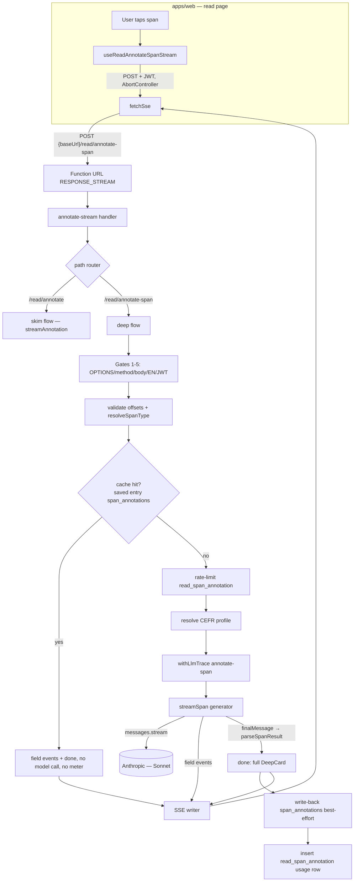

# Design Document

## Overview

This design implements three independent latency improvements plus one documentation deliverable, scoped to the two interactive LLM surfaces in the backend.

1. **Stream deep-annotation cards (Req 1, 2).** Today `POST /read/annotate-span` is a Hono route on **API Gateway**, which buffers the whole Lambda response — so streaming is impossible there. The skim pass already solved this exact problem by living on a dedicated **Lambda Function URL with `InvokeMode.RESPONSE_STREAM`**. We move the deep-card endpoint onto that **same Function URL Lambda** (`infra/lambda/src/annotate-stream/`), dispatching by request path, and add a `streamSpan` generator in `packages/ai/src/read-span.ts` that mirrors `streamAnnotation` — emitting each top-level card field as it completes, then a terminal `done` carrying the fully-validated `DeepCard`. The client gets a new streaming hook mirroring `useReadAnnotateStream`. This is the precedent already set when the old skim Hono route was deleted in favor of the Function URL.

2. **Swap evaluation to Haiku 4.5 (Req 3).** A one-constant change in `packages/ai/src/evaluate.ts`, gated by a `pnpm eval` run against a Langfuse dataset. No prompt-body edit, therefore no `EVALUATION_SYSTEM_PROMPT_VERSION` bump.

3. **SDK timeout/retry tuning (Req 4).** Extend `createObservedClaudeClient` to accept per-surface `{ timeout, maxRetries }`, applied at Anthropic-client construction so they take effect regardless of the Langfuse Proxy wrapper.

4. **Groq/Cerebras documentation (Req 5).** A new `docs/` markdown file; no runtime code touched.

## Steering Document Alignment

### Technical Standards (tech.md)
- **Serverless-first / API-first.** The deep-card stream stays on the existing Function URL Lambda — no new always-on infrastructure, no API surface duplication. Reuses the documented "separate Function URL for SSE because API Gateway buffers" decision verbatim.
- **AI-heavy, latency-sensitive, cost-controlled.** Streaming attacks perceived latency on the reading loop; the Haiku swap attacks evaluation latency *and* per-call cost (Haiku ≪ Sonnet), reinforcing the documented prompt-caching + cost-control posture. Ephemeral prompt caching, forced tool use, and `temperature: 0` are all preserved on every call.
- **Observability boundaries.** LLM traces stay in Langfuse via `withLlmTrace`; the deep stream keeps its `annotate-span` feature tag and `READ_SPAN_PROMPT_VERSION`. Flush-once-per-invocation is preserved.

### Project Structure (CLAUDE.md conventions; no `structure.md` present)
- `packages/ai` owns the Claude wrappers + prompt logic → `streamSpan`, the field extractor, model/timeout constants, and the model-swap all live there.
- `infra/lambda/src/annotate-stream/` owns the streaming runtime → the deep-card request flow, span-type/cache/rate-limit/write-back logic lands there.
- `packages/api-client` owns the shared hooks + Zod event schemas → the new streaming hook + deep-stream event schemas live there.
- `infra/lib/constructs/annotate-stream-lambda.ts` is the single CDK construct for the Function URL — unchanged except the output description wording (it already forwards all paths).
- **Prompt-version rule:** per CLAUDE.md, `*_PROMPT_VERSION` is bumped only on a prompt-*body* edit. The model swap and the streaming change touch neither `EVALUATION_SYSTEM_PROMPT` nor `READ_SPAN_SYSTEM_PROMPT`, so **no version constant is bumped** (Req 3.5). Documented explicitly so a reviewer doesn't flag it.

## Code Reuse Analysis

### Existing Components to Leverage
- **`streamAnnotation` (`packages/ai/src/annotate.ts`)**: the `client.messages.stream(...)` setup, the `input_json_delta` buffer accumulation loop, the `finalMessage()` + `stop_reason === "max_tokens"` truncation check, and the dedicated max-tokens error class — all directly mirrored by `streamSpan`.
- **`extractNewItems` (`annotate.ts`)**: its depth/string/escape-aware scan over a growing JSON buffer is the model for the new `extractCompletedFields` (object-property variant). Same "parse completed units out of a partial buffer; never throw; advance a cursor so a unit is never re-emitted" contract.
- **`annotateSpan` / `parseSpanResult` / `buildSpanUserPrompt` / `pickSpanTool` / `READ_SPAN_*` constants (`read-span.ts`)**: reused unchanged. `streamSpan` shares the prompt, tool selection, registry resolution, and final validation (`parseSpanResult` on the SDK-assembled `finalMessage` tool input — identical authoritative result to the non-streaming path).
- **`createSseWriter` (`annotate-stream/sse.ts`)**: reused for the deep flow; `SseEventType` extends to include `"field"`. The single-terminal invariant and the `close()`/flush discipline are inherited.
- **annotate-stream `handler.ts` gates 1–5 + the `try/finally` flush + the soft-deadline/abort scaffolding**: refactored into shared helpers and reused by the deep flow.
- **`buildCandidateList`'s profile-resolution pattern + the read.ts deep route's cache/rate-limit/write-back/metering SQL**: lifted from `infra/lambda/src/routes/read.ts` into the deep flow (same Drizzle queries, same `read_span_annotation` bucket, same `resolveSpanType`).
- **`resolveSpanType` (`infra/lambda/src/routes/read-span-utils.ts`)**: imported by the deep flow unchanged.
- **`fetchSse` + `useReadAnnotateStream` reducer pattern (`packages/api-client`)**: `fetchSse` reused as-is; the new `useReadAnnotateSpanStream` hook mirrors the reducer/`runStream`/`handleFrame` structure.
- **`createObservedClaudeClient` (`observability.ts`)**: extended (not replaced) to accept optional client options.

### Integration Points
- **Lambda Function URL** (`NEXT_PUBLIC_ANNOTATE_STREAM_URL`): the deep flow is reached at path `/read/annotate-span` on the *same* Function URL; no new CFN output, no new Vercel env var.
- **Neon / Drizzle**: `read_entries.span_annotations` write-back and `usage_events` (`read_span_annotation`) — identical to today.
- **Hono API (`infra/lambda/src/routes/read.ts`)**: the `POST /read/annotate-span` route is **removed** (mirrors the earlier deletion of the skim Hono route), along with its now-unused imports. The save/other read routes stay.
- **Frontend read page** (`apps/web/app/(dashboard)/read/page.tsx` + `_state/read-page-reducer.ts`): swap `useReadAnnotateSpan` (mutation) for `useReadAnnotateSpanStream`; add a `DEEP_CARD_FIELD` reducer action for progressive field merge; keep `DEEP_CARD_RESOLVED`/`DEEP_CARD_ERROR` for terminal states and the entry-cache write-through.

## Architecture

The deep-card request changes transport (API Gateway → Function URL/SSE) but keeps every server-authoritative step.



### Streaming-parse model (the one genuinely new algorithm)

A `DeepCard` is a single JSON object, so `extractNewItems` (which pulls completed elements out of an *array*) does not apply directly. `extractCompletedFields(buffer, alreadyEmitted)` is its object-property sibling:

- Scans the partial `input_json` buffer for **top-level** `"key": value` pairs that are fully closed (value is a complete string, number, boolean, object, or array — tracked with the same brace/bracket-depth + in-string/escape state machine as `extractNewItems`).
- Returns the newly-completed `{ key, value }` entries beyond `alreadyEmitted`, advancing a cursor so a key is never re-emitted. Never throws — a malformed fragment is skipped and retried on the next delta.
- Top-level granularity is sufficient for the perceived win: the model emits the required scalar fields first (`surface`, `lemma`, `pos`, `contextualSense`, `definition`, `definitionLabel`, `cefr`, `freq`), so they reach the client within the first deltas; the heavier optional objects (`morphology`, `synonyms`, `collocations`, `breakdown`) complete and stream afterward.
- **Authoritative result is still the final validation**: streamed fields are a *preview*; on `finalMessage()` the handler runs `parseSpanResult(toolUseBlock.input)` (identical to the non-streaming path) and emits that validated `DeepCard` in the `done` event. The client replaces its previewed fields with the `done` card, so no partial-parse inaccuracy can survive (Req 1.3).
- No third-party partial-JSON dependency is added (Req maintainability NFR); the extractor lives beside `extractNewItems` and is unit-tested with the same style of contract tests.

## Components and Interfaces

### Component 1 — `extractCompletedFields` (new, `packages/ai/src/annotate.ts` or a shared `streaming-json.ts`)
- **Purpose:** pull completed top-level object properties out of a growing partial-JSON buffer.
- **Interface:** `export function extractCompletedFields(buffer: string, alreadyEmitted: number): Array<{ key: string; value: unknown }>`
- **Dependencies:** none (pure).
- **Reuses:** the scanner design of `extractNewItems`. (Placed alongside it; if `extractNewItems` internals can be generalized cleanly they may share a tokenizer, but duplication is acceptable to avoid destabilizing the proven skim parser.)

### Component 2 — `streamSpan` (new, `packages/ai/src/read-span.ts`)
- **Purpose:** the streaming counterpart to `annotateSpan`.
- **Interface:**
  ```ts
  export type ReadSpanStreamEvent =
    | { kind: "field"; key: string; value: unknown }
    | { kind: "done"; card: DeepCard };
  export class ReadSpanStreamMaxTokensError extends Error { /* mirrors AnnotateStreamMaxTokensError */ }
  export async function* streamSpan(
    client: Anthropic,
    input: AnnotateSpanInput & { signal?: AbortSignal },
  ): AsyncIterable<ReadSpanStreamEvent>;
  ```
- **Behavior:** resolve system prompt via `getPromptOrFallback("read-span-system-prompt", …)` (same as `annotateSpan`); `client.messages.stream({ model: MODEL, max_tokens: MAX_TOKENS, system: [cached], messages, tools: [pickSpanTool(spanType)], tool_choice: forced, temperature: 0 }, { signal, maxRetries })`; accumulate `input_json_delta`; `yield {kind:"field"}` per `extractCompletedFields`; on `finalMessage()` throw `ReadSpanStreamMaxTokensError` if `stop_reason === "max_tokens"`, else `yield {kind:"done", card: parseSpanResult(finalToolInput)}`.
- **Dependencies:** Anthropic SDK, `extractCompletedFields`, `parseSpanResult`, `pickSpanTool`, registry.
- **Reuses:** `streamAnnotation`'s structure; all existing `read-span.ts` helpers. `annotateSpan` (non-streaming) is retained for tests/back-compat but the route no longer calls it.

### Component 3 — annotate-stream handler refactor (`infra/lambda/src/annotate-stream/handler.ts` + new `deep-flow.ts`)
- **Purpose:** route by path; run the deep flow.
- **Interface:** top-level handler inspects `event.requestContext.http.path`; if it ends with `/read/annotate-span` → `handleDeepSpan(...)`, else the existing skim flow. Gates 1–5 (OPTIONS/method/JSON/EN/JWT) and the `try/finally` flush wrap both; extracted into small shared helpers so neither flow duplicates them.
- **Deep flow steps:** parse `AnnotateSpanStreamRequest` (`{ text, language, start, end, entryId? }`); validate offsets (`start < end <= text.length`) → `VALIDATION_ERROR`; `resolveSpanType`; **cache hit** (saved entry holds `"start:end"`) → `openSse()`, emit one `field` per top-level key of the cached card + `done`, no model call/meter; else **dedicated rate-limit** (see below) → `RATE_LIMIT_EXCEEDED`; resolve CEFR profile (B1 fallback, see below); `openSse()`; soft-deadline + abort wiring (reused); `withLlmTrace({ feature: "annotate-span", promptVersion: READ_SPAN_PROMPT_VERSION, … }, run streamSpan loop → write `field`/collect `done`)`; on success write-back (best-effort) + meter **one `read_span_annotation` usage row** + terminal `done`; on throw/abort/deadline → terminal `error` (`AI_UNAVAILABLE`) iff not terminated.
- **Rate-limit bucket — distinct from the skim flow (Req 2.3).** The deep flow MUST NOT reuse the skim handler's gate-6 query, which counts the *shared* `["ai_evaluation","read_annotation"]` bucket against `DAILY_EVAL_LIMIT = 50`. It uses its **own** rolling-24h query keyed solely on `eventType = 'read_span_annotation'` capped at a named `READ_SPAN_DAILY_LIMIT = 150` constant (carried over from the removed Hono route, `read.ts`). Likewise the **meter** insert uses `eventType: 'read_span_annotation'` — not the skim path's `read_annotation`. The two flows share the gate helpers (OPTIONS/method/JSON/EN/JWT + flush) but each owns its rate-limit query, limit constant, and meter event type.
- **CEFR profile fallback.** Resolve `userLanguageProfiles.proficiencyLevel` for `(userId, language)`; when absent or not a valid CEFR band (`isCefrLevel` guard), fall back to `DEFAULT_PROFICIENCY_LEVEL` (B1) — identical to the removed route and to `pipeline.ts`.
- **Dependencies:** `streamSpan`, `resolveSpanType`, Drizzle (`readEntries`, `usageEvents`, `userLanguageProfiles`), `createObservedClaudeClient`, `withLlmTrace`.
- **Reuses:** `createSseWriter`, gates, soft-deadline/abort, flush — all from the existing handler.

### Component 4 — `createObservedClaudeClient` extension (`packages/ai/src/observability.ts`)
- **Purpose:** apply per-surface timeout/retries at client construction (robust against the Proxy wrapper, which may not forward per-request options).
- **Interface:** `createObservedClaudeClient(apiKey: string, opts?: { timeout?: number; maxRetries?: number }): Anthropic` → `new Anthropic({ apiKey, ...opts })` before wrapping.
- **Reuses:** existing wrap logic; default behavior unchanged when `opts` omitted.

### Component 5 — evaluate model swap + timeouts (`packages/ai/src/evaluate.ts`)
- `MODEL = "claude-haiku-4-5-20251001"` with a rationale comment mirroring the `STREAM_MODEL` precedent comment in `annotate.ts`.
- Timeout/retries applied via the client (the route constructs the client) or as a request option on `messages.create(params, { maxRetries: EVAL_MAX_RETRIES })`; named constants `EVAL_REQUEST_TIMEOUT_MS` (~15–20 s), `EVAL_MAX_RETRIES = 1`.

### Component 6 — `useReadAnnotateSpanStream` (new, `packages/api-client/src/hooks/useReadAnnotateSpanStream.ts`)
- **Purpose:** client streaming consumer for the deep card.
- **Interface:**
  ```ts
  type DeepCardStreamState =
    | { phase: "idle" }
    | { phase: "streaming"; partial: Partial<DeepCard>; span: Span }
    | { phase: "complete"; card: DeepCard; span: Span }
    | { phase: "error"; error: ErrorPayload; span: Span };
  useReadAnnotateSpanStream({ baseUrl, getToken, onResolved }): {
    state; start(input: AnnotateSpanRequest): void; abort(): void; reset(): void;
  };
  ```
- **Behavior:** mirrors `useReadAnnotateStream` (`useReducer` + `runStream` + `handleFrame`); POSTs to `${baseUrl.replace(/\/$/,'')}/read/annotate-span`; merges `field` events into `partial`; on `done` transitions to `complete` and fires `onResolved(card, span)`; abort is silent; stream-ends-without-terminal → `error` (`AI_UNAVAILABLE`).
- **Within-session repeat-tap short-circuit (Req 2.8) — where it now lives.** The old mutation hook wrote resolved cards into the `['readEntry', entryId]` TanStack query cache via `onSuccess`; the page's repeat-tap check read that cache. The reducer-based stream hook has no query-cache integration, so the short-circuit moves up to the **page**: before calling `start(span)`, the page checks the read-page reducer's `spanAnnotations` session map (already seeded from `entryQuery.data.spanAnnotations` by the existing `SET_SPAN_ANNOTATIONS` effect) and, on a hit, dispatches `DEEP_CARD_RESOLVED` directly with no stream. `onResolved` keeps the durable side in lockstep by (a) writing through into the `['readEntry', entryId]` query cache for saved entries — exactly as the old `onSuccess` did — and (b) the page also dispatches `DEEP_CARD_RESOLVED` so the reducer's session map gains the card immediately. Net: the repeat-tap path issues no new streamed request, preserving today's behavior; the mechanism is page-reducer-driven rather than query-cache-driven.
- **Reuses:** `fetchSse`, the reducer/terminal-dispatch pattern, `mapStatusToCode`; the page's existing `spanAnnotations` seeding effect and `DEEP_CARD_RESOLVED`/`DEEP_CARD_ERROR` actions.

### Component 7 — deep-stream event schemas (`packages/api-client/src/schemas/read.ts`)
- `AnnotateSpanFieldEventSchema = z.object({ key: z.string(), value: z.unknown() })`
- `AnnotateSpanDoneEventSchema = z.object({ card: DeepCardSchema })`
- Reuse `AnnotateErrorEventSchema` for the error frame. (The non-streaming `AnnotateSpanRequestSchema` stays; `AnnotateSpanResponseSchema`/`useReadAnnotateSpan` become unused and are removed with the route.)

### Component 8 — Groq/Cerebras doc (new, `docs/llm-fast-inference-exploration.md`)
- Descriptive only (Req 5); cross-referenced from this spec; no runtime import.

## Data Models

### Deep-card SSE wire protocol (new)
```
event: field   data: {"key":"contextualSense","value":"..."}   // 0..N, top-level keys in emit order
event: done    data: {"card": <full validated DeepCard>}        // terminal (success)
event: error   data: {"code":"AI_UNAVAILABLE","message":"..."}  // terminal (failure) — never with done
```
- Pre-stream HTTP errors (400/401/429) use the JSON-error branch (`writer.errorJson`) exactly as the skim flow, so the client's `fetchSse` throws with `.status`/`.body` and the hook maps to `VALIDATION_ERROR` / `MISSING_SUB` / `RATE_LIMIT_EXCEEDED`.

### `AnnotateSpanStreamRequest` (handler-side Zod, mirrors the removed route body)
```
- text: string (1..READ_TEXT_MAX_CHARS)
- language: Language enum (EN rejected → UNSUPPORTED_LANGUAGE)
- start: int >= 0
- end: int (cross-field: start < end <= text.length)
- entryId?: string().uuid() (optional; enables durable cache + write-back — preserve the route's UUID validation, not a bare string)
```

### `DeepCard` (unchanged — `packages/shared/src/read.ts`)
Discriminated union `word | phrase | sentence`; validated by `DeepCardSchema`. The `done` event payload and the persisted `span_annotations[key]` shape are unchanged.

## Error Handling

### Error Scenarios
1. **Upstream truncation (`max_tokens`)** — `streamSpan` throws `ReadSpanStreamMaxTokensError`; handler logs at warn, emits terminal `error` `AI_UNAVAILABLE`, no `done`, no write-back, no meter. *(Req 1.4)*
2. **Mid-stream upstream failure** (after some `field`s) — iterator throws; handler emits terminal `error`; client discards `partial` and shows inline error + retry; the partial is never promoted to `complete`. *(Req 1.5)*
3. **Client abort / different-span tap** — `responseStream.on("close")` aborts the upstream call; no terminal event; no meter (abort consumes no token). *(Req 1.6, 2.6)*
4. **Soft-deadline (25 s)** — reused timer aborts upstream and emits a deadline-specific `error` message before the 29 s hard kill. *(Req 1.7)*
5. **Invalid body / offsets / EN** — pre-stream `errorJson(400, …)` with `VALIDATION_ERROR` / `UNSUPPORTED_LANGUAGE`. *(Req 2.2)*
6. **Rate-limit exceeded** — pre-stream `errorJson(429, RATE_LIMIT_EXCEEDED)`. *(Req 2.3)*
7. **Write-back / metering failure** — logged and swallowed; the already-emitted `done` stands. *(Req 2.5, 2.6)*
8. **SDK timeout / exhausted retries (evaluate)** — surfaces as a throw → existing `502 AI_UNAVAILABLE` in the submit route; no contract change. *(Req 4.5)*
9. **Single-terminal invariant** — `writer.terminated` guards every terminal write on both flows. *(Req 1.8, 2.7)*

## Testing Strategy

### Unit Testing
- **`extractCompletedFields`** (`packages/ai`): contract tests mirroring `extractNewItems` — split a known card JSON at every byte boundary; assert each top-level key emitted exactly once, in order, never duplicated; nested objects/arrays only emitted when fully closed; malformed fragment skipped not thrown.
- **`streamSpan`** (`packages/ai`): mock the Anthropic stream to yield scripted `input_json_delta` chunks + a `finalMessage`; assert `field` events then a `done` whose card equals `parseSpanResult` of the full input; assert `ReadSpanStreamMaxTokensError` on `stop_reason: max_tokens`; assert abort via `signal`.
- **`createObservedClaudeClient` opts**: assert `timeout`/`maxRetries` reach the `Anthropic` constructor (Langfuse-disabled path) and that omitting opts is unchanged.
- **evaluate**: existing tests updated to assert the new `MODEL` constant and that `maxRetries`/timeout are passed; tool-use/schema behavior assertions unchanged.
- **`useReadAnnotateSpanStream`** (`packages/api-client`): drive `handleFrame` with `field`/`done`/`error` frames; assert progressive `partial`, terminal `complete` firing `onResolved`, error discard, abort silence — mirroring `useReadAnnotateStream.test`.
- **Deep-stream schemas**: parse/round-trip `field`/`done` payloads.

### Integration Testing
- **annotate-stream handler deep flow** (`infra/lambda` vitest, extend `read.test.ts` patterns into a handler test): path routing (skim vs deep); cache-hit emits `field`+`done` with no `streamSpan` call/meter; validation/rate-limit/EN gates; write-back SQL invoked for saved entries only; one usage row on real call; flush-once on every path; single-terminal invariant. `streamSpan` and DB are mocked as in existing tests.
- **CDK**: existing `annotate-stream-lambda.test.ts` still pins `RESPONSE_STREAM`/`AuthType: NONE`; no construct change beyond output-description wording (assert it still synths).
- **Hono route removal**: remove/relocate `read.test.ts`'s `POST /read/annotate-span` cases to the handler test; assert the Hono app no longer registers the route.

### End-to-End (Playwright)
- Update `apps/web/e2e/tests/authenticated/read.spec.ts`: the existing `**/read/annotate-span` mocks (currently a single JSON response) become an **SSE mock** emitting `field`→`done` frames against the Function URL path. Assert progressive render (a field visible before `done`), terminal card correctness, and the error/retry path. Keep at least one cache-hit/instant-render assertion.

### Eval-harness gate (Req 3 — process, not automated test)
- Run `pnpm eval:export` (sample Sonnet-baseline traces → dataset) then `pnpm eval` with the Haiku candidate; compare the `./eval-runs/*.json` quality/cost/latency summary to the Sonnet baseline against the Req 3.3 threshold. Requires `ANTHROPIC_API_KEY` + Langfuse creds + a populated dataset; documented as a gating step in tasks (run by the maintainer if creds aren't available to CI). Ship the swap only if the bar is met; revert the one constant otherwise.

## Key Design Decisions

1. **Extend the existing Function URL Lambda (path dispatch) rather than a new Function URL.** Maximises reuse (writer, gates, soft-deadline, flush, CORS, JWT, the single `NEXT_PUBLIC_ANNOTATE_STREAM_URL`/CFN output) and needs no new Vercel env wiring. *Alternative considered:* a dedicated deep Function URL — rejected as duplicative infra for the same SSE concern. *Alternative considered:* body-shape discriminator instead of path — rejected; path is explicit, testable, and matches REST semantics.
2. **Top-level-field streaming with final-validation authority.** Gives the perceived win without a fragile partial-object parser or a new dependency, and guarantees the delivered card is byte-identical to the non-streaming result.
3. **Timeout/retries at client construction.** Avoids depending on whether the Langfuse Proxy forwards per-request options; one obvious place per surface.
4. **No prompt-version bump for the model swap.** The model is recorded natively on the Langfuse generation; bumping `EVALUATION_SYSTEM_PROMPT_VERSION` for a non-prompt edit would corrupt the prompt cohort. (Req 3.5)
5. **Streams rely on the 25 s soft deadline for time-bounding, not a tight SDK request timeout.** Setting a short client `timeout` on a streaming call risks killing legitimate long generations; `maxRetries: 1` + the existing deadline/abort is the correct lever for streams. Concretely: both the read-span stream and the skim stream set `maxRetries: 1` and **intentionally omit a client `timeout`**, deferring the time bound to the 25 s soft deadline / 29 s Lambda ceiling. This is a deliberate, documented divergence from Req 4.2's literal "explicit timeout" wording — for a stream, the deadline *is* the timeout, and a competing SDK `timeout` would only risk severing a healthy long generation. The tight request `timeout` (`EVAL_REQUEST_TIMEOUT_MS`, ~15–20 s) applies only to the non-streaming evaluate call, which has no soft deadline of its own.
