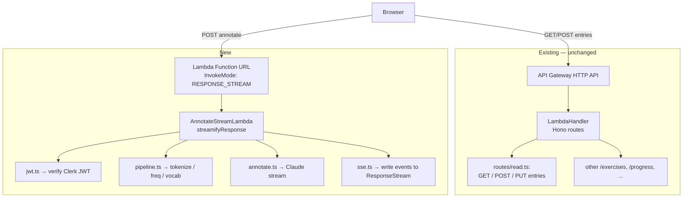

# Design Document

## Overview

The current `POST /read/annotate` (Phase J — `read-collect`) is a single, blocking JSON RPC: tokenize-and-select happens inside Claude's prompt, the response is one large tool-use payload, and the client waits ~8–15 s before showing anything. This design replaces it with a four-stage pipeline whose latency the user mostly does not see:

1. **Pre-filter** (server, ~50 ms): the passage is tokenized server-side, looked up in a per-language frequency dictionary bundled into `@language-drill/ai`. Words at or below the user's CEFR `topRank` are dropped here — the LLM never sees them.
2. **Post-filter** (server, ~30 ms): the candidate list is intersected against the user's `user_vocabulary` rows for the active language. Anything the user has already saved is removed.
3. **Streaming enrichment** (server → Claude, async): the survivor list is sent to Claude as an *enrichment task* (no more "select above-level words"). Claude streams back lemma / gloss / example / CEFR for each, one tool-use array item at a time.
4. **Streaming render** (server → client): each enriched item is forwarded as one SSE `flag` event. The client tints the matching span in the DOM the instant the event arrives. The passage itself is rendered before any network call returns.

The wire is **Server-Sent Events over a Lambda Function URL with response streaming enabled** — not API Gateway. API Gateway HTTP API buffers Lambda integrations and is the wrong primitive for this. The streaming endpoint is a separate Lambda with its own Function URL; every other `/read/*` route stays on the existing API Gateway + Hono path unchanged.

The design is intentionally narrow. Only the annotate path is touched. The persisted shape of `read_entries.flagged_words`, the `GET /read/entries/:id` JSON response, and the save flow are untouched.

## Steering Document Alignment

### Technical Standards (tech.md)

- **Lambda separate from Next.js** (§2.1): keeping annotate on AWS Lambda preserves the "same backend for web and mobile" property. Vercel API routes / Server Actions were considered and rejected for the same reason CLAUDE.md states.
- **Claude prompt caching** (§7): the streaming call keeps `cache_control: { type: 'ephemeral' }` on the system prompt. Cached prefix → faster TTFT, which is what the user sees as "time to first flag".
- **Zod everywhere** (§2.4): the new SSE event types (`AnnotateMetaEventSchema`, `AnnotateFlagEventSchema`, `AnnotateDoneEventSchema`, `AnnotateErrorEventSchema`) live in `packages/api-client/src/schemas/read.ts`. The client `parse()`s every event before merging it into the reducer.
- **Per-route rate limiting via `usage_events`** (§9): the streaming Lambda owns its own `read_annotation` usage rows, with `metadata.candidateCount` added. The daily cap query (`gte(usageEvents.createdAt, oneDayAgo)`) is identical to the one already in `routes/read.ts:118-128`.
- **Forward-only schema** (§2.5): no migrations. `user_vocabulary` already has the `lemma` and `word` columns the post-filter needs (`packages/db/src/schema/read.ts:42-71`).
- **Neon WebSocket pool** (`packages/db/src/client.ts:13`): the streaming Lambda reuses `createDb()` and `db.transaction(...)` semantics. Two DB reads (profile + user vocab) run in parallel via `Promise.all`, mirroring `routes/read.ts:118`.

### Project Structure (structure.md)

```
packages/
  ai/src/
    annotate.ts                                 ← rewrite: stream + enrichment-only prompt
    annotate-stream.test.ts                    ← new (unit tests for the iterator)
    frequency/
      index.ts                                  ← lookup API
      es.json                                   ← surface-form → { lemma, rank, cefr }
      de.json
      tr.json
      stopwords-es.json
      stopwords-de.json
      stopwords-tr.json
      frequency.test.ts
    index.ts                                    ← add exports
  api-client/src/
    schemas/read.ts                             ← swap AnnotateResponseSchema for event schemas
    hooks/useReadAnnotateStream.ts             ← new (replaces useReadAnnotate)
    hooks/useReadAnnotateStream.test.ts
    sse-client.ts                               ← new (POST-SSE fetch + parser)
    sse-client.test.ts
    index.ts

infra/lambda/src/
  annotate-stream/
    handler.ts                                  ← new entry point (NOT Hono — see §Components)
    handler.test.ts
    jwt.ts                                      ← Clerk JWKS verification
    sse.ts                                      ← streaming response writer
    pipeline.ts                                 ← pre-filter + post-filter + Claude orchestration

infra/lib/constructs/
  annotate-stream-lambda.ts                     ← new construct (Function URL + IAM)
  annotate-stream-lambda.test.ts
infra/lib/stack.ts                              ← wire the new construct

apps/web/app/(dashboard)/read/
  page.tsx                                      ← swap hook + render-on-paste UX
  page.test.tsx                                 ← update existing tests
  _state/read-page-reducer.ts                  ← add streaming actions
  _components/annotated-view.tsx                ← progress strip
  _components/calibration-strip.tsx             ← progress / done states

infra/lambda/src/routes/read.ts                 ← DELETE the old POST /read/annotate handler
infra/lambda/src/routes/read.test.ts            ← drop annotate tests, keep entry/bank tests
packages/api-client/src/hooks/useReadAnnotate.ts ← DELETE
```

The `annotate-stream/` directory pattern matches existing per-feature folders in `infra/lambda/src/routes/`. The new `_state/` and `_components/` files extend the read-collect spec's layout.

## Code Reuse Analysis

### Existing Components to Leverage

- **`@anthropic-ai/sdk` `client.messages.stream(...)`** — already a transitive dependency (used by current `annotateText` via `messages.create`). The streaming API is the same SDK; no version bump needed (0.91.1 supports `input_json_delta`).
- **`@language-drill/shared` `WordFlagSchema`, `FlaggedMapSchema`, `READ_TEXT_MAX_CHARS`, `READ_CEFR_TOP_RANK`** — the persisted shape and CEFR→rank mapping are reused unchanged. `WordFlagSchema` becomes the payload of `AnnotateFlagEventSchema`.
- **`packages/db` Drizzle schema** — `userLanguageProfiles`, `userVocabulary`, `usageEvents` all queried as today. No migrations.
- **`tokenize()`** (`apps/web/app/(dashboard)/read/_lib/tokenize.ts`) — the client-side tokenizer uses Unicode `\p{P}` punctuation classes. The server-side pre-filter needs the **same** tokenization rules so the surface forms emitted by Claude match the spans in the DOM. We will **extract this function** to `packages/shared/src/tokenize.ts` and import it from both sides. The web app keeps its current import path via re-export to avoid touching consumers.
- **`createClaudeClient(ANTHROPIC_API_KEY)`** (`packages/ai/src/index.ts`) — same factory, same prompt-cache pattern.
- **CDK `LambdaConstruct`** (`infra/lib/constructs/lambda.ts`) — the new `AnnotateStreamLambdaConstruct` mirrors its structure (secrets, env vars, esbuild bundling) but adds Function URL + `InvokeMode.RESPONSE_STREAM`.
- **`AnnotatedText` / `AnnotatedView`** (`apps/web/app/(dashboard)/read/_components/`) — the rendering layer already key-matches flagged spans by lowercased surface form. Streaming events just update the same `flaggedMap`; no rendering rewrite.

### New dependencies

- **`@clerk/backend`** (latest stable, currently ~v1.x) — pulled into `infra/lambda/package.json` for the streaming handler's JWT verification. ~70 KB bundled. Replaces the API Gateway authorizer for this one endpoint; uses `verifyToken(token, { secretKey, audience: 'language-drill', authorizedParties: [...] })` with internal JWKS caching. Per CLAUDE.md's package-management guidance: actively maintained by Clerk, recent releases within the last month, no known vulnerabilities.

No other new runtime dependencies. The Anthropic SDK, Drizzle, Zod, Hono, and CDK packages are all already in the lockfile.

### Integration Points

- **Clerk JWT verification** — moves from API Gateway authorizer into the Lambda. Verifies against Clerk's JWKS. The verified `sub` claim is the userId — same contract as today's API Gateway flow.
- **DNS / domain** — the streaming Lambda's Function URL is exposed at its raw `https://<hash>.lambda-url.<region>.on.aws/` address. No custom domain in v1 (Function URLs don't support custom domains without CloudFront, which is unnecessary infrastructure for one endpoint). The frontend reads a new `NEXT_PUBLIC_ANNOTATE_STREAM_URL` env var. CORS allow-list is identical to the main Lambda's (`https://*.vercel.app`, `https://langdrill.app`, etc.) and is implemented in the new handler.
- **Rate-limit table** — same `usage_events` table as today. The new handler inserts a row keyed by `eventType: 'read_annotation'` on the `done` path only.
- **Test infrastructure** — Vitest + same mocking patterns. The Claude stream is mocked via an async generator in unit tests; the Lambda handler is tested with a stubbed `responseStream` interface.

## Architecture

### Request flow

```mermaid
sequenceDiagram
    participant Browser
    participant Lambda as Annotate Stream Lambda<br/>(Function URL, RESPONSE_STREAM)
    participant Clerk as Clerk JWKS
    participant Neon as Neon Postgres
    participant Claude as Anthropic API

    Browser->>Browser: render passage<br/>(view = annotated, flaggedMap = {})
    Browser->>Lambda: POST /read/annotate<br/>Auth: Bearer <jwt>, body: { text, language }
    Lambda->>Clerk: GET /.well-known/jwks.json (cached)
    Lambda->>Lambda: verify JWT signature + claims
    Lambda->>Lambda: tokenize → freq lookup → candidates
    Lambda->>Neon: SELECT proficiency + user_vocabulary lemmas
    Note over Lambda: post-filter strips known lemmas
    Lambda-->>Browser: SSE event: meta<br/>{ calibration, candidateCount }
    Browser->>Browser: render progress strip
    Lambda->>Claude: messages.stream(...) with candidate list

    loop streaming tool-use deltas
        Claude-->>Lambda: input_json_delta chunks
        Lambda->>Lambda: parse partial JSON; emit when array item closes
        Lambda-->>Browser: SSE event: flag { matchedForm, lemma, gloss, ... }
        Browser->>Browser: reducer: merge flag → re-render that span only
    end

    Claude-->>Lambda: stream end (message_stop)
    Lambda->>Neon: INSERT usage_events
    Lambda-->>Browser: SSE event: done { flaggedCount }
    Browser->>Browser: enable save button
```

### Lambda layout



The two Lambdas share the same packaged secrets (`language-drill-dev/*`) and the same DB schema. They are separate functions in CDK because the streaming response mode requires a different handler signature.

## Components and Interfaces

### `@language-drill/ai/frequency` — frequency-dictionary lookup

**Purpose:** in-memory lookup of `(language, surfaceForm) → { lemma, rank, cefr? }`, used by the server-side pre-filter.

**Format:** JSON file per language, surface-form keyed:

```ts
type FrequencyEntry = { lemma: string; rank: number; cefr?: CefrLevel };
type FrequencyFile = Record<string /* lowercased surface form */, FrequencyEntry>;
```

**Sources (v1):**
- **ES**: OpenSubtitles-ES surface-form list, top 50k. Public domain.
- **DE**: Leipzig German Corpus, top 50k.
- **TR**: TR-Wikipedia corpus, top 50k.

Each source is converted offline (a one-off script in `packages/ai/scripts/build-frequency.ts`) into the JSON format above. The script is NOT run at build time — its outputs are checked into git. This keeps Lambda cold-start independent of the source corpora.

**Bundle size:** ~1.5–2 MB per language pre-gzip. esbuild minification + Lambda's zip compression brings the deployed size to ~3 MB total across all three languages. Acceptable.

**Interfaces:**

```ts
// packages/ai/src/frequency/index.ts
export type FrequencyLookup = {
  /** Returns the entry for a lowercased surface form, or `null` if unknown. */
  lookup(form: string): FrequencyEntry | null;
  /** Returns true iff the form is a closed-class stopword for the language. */
  isStopword(form: string): boolean;
};

export function loadFrequency(language: LearningLanguage): FrequencyLookup;
```

**Dependencies:** none beyond the JSON files. Loaded once at module init via top-level `import freqEs from './es.json'`. `loadFrequency()` is a pure dispatch.

**Reuses:** `LearningLanguage`, `CefrLevel` from `@language-drill/shared`.

### `@language-drill/shared/tokenize` — shared tokenizer

**Purpose:** turn a passage into `{ kind: 'word' | 'sep', raw, key }` spans. Used server-side (pre-filter input) and client-side (rendering). Both sides MUST produce the same `key` for the same input, or the streaming `flag.matchedForm` will not match any span.

**Interface:** structural move from `apps/web/app/(dashboard)/read/_lib/tokenize.ts` to `packages/shared/src/tokenize.ts`, with **one behavioral addition** to satisfy Requirement 1.3: numeral-only tokens (matching `/^[\d٠-٩۰-۹]+$/u`) and single-character tokens (`raw.length === 1`) are emitted with `kind: 'sep'` so they are not eligible candidates. The existing rendering path treats `sep` tokens as plain text, which preserves the visual appearance.

**Consumers updated:**
- `apps/web/app/(dashboard)/read/_components/annotated-text.tsx:19` — change import path.
- `apps/web/app/(dashboard)/read/_lib/tokenize.test.ts` — relocate to `packages/shared/src/tokenize.test.ts` and add fixtures for digit-only and single-character cases.
- No other importers exist in the workspace (verified by grep).

### `@language-drill/ai/annotate.ts` — streaming Claude caller

**Purpose:** call Claude with the *enrichment-only* tool-use prompt and yield one parsed `WordFlag` per completed tool-use array item.

**Interface:**

```ts
export type AnnotateCandidate = {
  /** Lowercased surface form as it appears in the passage (matches the tokenizer's `key`). */
  matchedForm: string;
  /** Best-guess lemma from the frequency dictionary, or `null` for unknown words. */
  lemma: string | null;
};

export type AnnotateStreamInput = {
  language: LearningLanguage;
  proficiencyLevel: CefrLevel;
  /** Full original passage, for Claude to derive example context. */
  passage: string;
  /** The pre-filtered + post-filtered candidate set. */
  candidates: AnnotateCandidate[];
  /** Optional AbortSignal — when fired, the Anthropic stream is cancelled. */
  signal?: AbortSignal;
};

export type AnnotateStreamEvent =
  | { kind: 'flag'; flag: WordFlag & { matchedForm: string } }
  | { kind: 'done'; flaggedCount: number };

export async function* streamAnnotation(
  client: Anthropic,
  input: AnnotateStreamInput,
): AsyncIterable<AnnotateStreamEvent>;
```

**Implementation sketch:**

```ts
const stream = client.messages.stream({
  model: 'claude-sonnet-4-5',
  max_tokens: 8192, // PR #49: A1 + Turkish empirically needs ~7k tokens for 40 entries
  system: [{ type: 'text', text: ENRICHMENT_SYSTEM_PROMPT, cache_control: { type: 'ephemeral' } }],
  messages: [{ role: 'user', content: buildUserPrompt(input) }],
  tools: [ANNOTATE_TOOL],
  tool_choice: { type: 'tool', name: ANNOTATE_TOOL_NAME },
  temperature: 0,
}, { signal: input.signal });

let buffer = '';        // accumulating tool-use JSON
let yielded = 0;
for await (const ev of stream) {
  if (ev.type === 'content_block_delta' && ev.delta.type === 'input_json_delta') {
    buffer += ev.delta.partial_json;
    // Try to extract any newly-completed array items from `buffer`.
    for (const item of extractNewItems(buffer, yielded)) {
      const parsed = parseFlag(item);  // schema validation, drops on failure
      if (parsed) {
        yielded++;
        yield { kind: 'flag', flag: parsed };
      }
    }
  }
}
yield { kind: 'done', flaggedCount: yielded };
```

`extractNewItems` is a small streaming-JSON-array reader that tracks brace depth and string state; it does **not** require a full JSON parser. Tested in isolation.

**Prompt change (`ENRICHMENT_SYSTEM_PROMPT`):**
- The "Selection Rule" section is replaced with: "You will receive a passage AND a list of words from that passage. For EACH word in the list, emit one tool-use entry with lemma / pos / gloss / example. Do not add words that are not in the list. Do not skip words that are in the list."
- The "Surface Form Requirement" and "Per-Language Guidance" sections remain (Turkish agglutination, German compounding still need morphological hints — but now as enrichment data, not selection criteria).
- The "Tool Use" section stays as-is.

**Dependencies:** Anthropic SDK, `WordFlagSchema`, `Language` enum.

**Reuses:** `ANNOTATE_TOOL` schema (unchanged), `createClaudeClient` factory.

### `infra/lambda/src/annotate-stream/handler.ts` — streaming Lambda entry

**Purpose:** the AWS Lambda entry point for the Function URL. Validates JWT, runs the pipeline, writes SSE events.

**Signature:** wrapped with `awslambda.streamifyResponse(handler)`. The handler receives `(event, responseStream, context)` instead of returning a Response.

**Cold-start positioning:** the three frequency-dictionary JSON files and the stopword files are imported at the **top** of `handler.ts`, so esbuild inlines them as JS object literals at bundle time and they materialize during the Lambda **init** phase (which is outside the 29 s timeout budget). No `JSON.parse` cost is paid per invocation.

**Wire-protocol invariant (Req 3.3):** the SSE writer (`createSseWriter`, below) tracks a single `terminated: boolean` flag. The methods `writeTerminal('done', ...)` and `writeTerminal('error', ...)` are the **only** ways to emit `done` or `error`; calling either when `terminated === true` throws synchronously (caught and logged — no event is written). This makes "at most one terminal event" hold by construction, not by handler convention.

```ts
export const handler = awslambda.streamifyResponse(async (event, responseStream, _ctx) => {
  const writer = createSseWriter(responseStream); // sets Content-Type, helpers

  // 1. Method + CORS preflight
  if (event.requestContext.http.method === 'OPTIONS') {
    return writer.cors200();
  }
  if (event.requestContext.http.method !== 'POST') {
    return writer.errorJson(405, 'Method Not Allowed');
  }

  // 2. Body parse + Zod validation
  const body = parseBody(event);
  if (!body.success) return writer.errorJson(400, body.error);

  // 3. JWT
  const userId = await verifyClerkJwt(event.headers.authorization);
  if (!userId) return writer.errorJson(401, 'Unauthorized');

  // 4. Rate limit (JSON 429 BEFORE stream opens — Req 7.1)
  if (await isOverDailyCap(userId)) {
    return writer.errorJson(429, 'Daily evaluation limit exceeded', 'RATE_LIMIT_EXCEEDED');
  }

  // 5. Open stream
  writer.openSse();

  // 6. Pre-filter + post-filter
  const { candidates, calibration } = await buildCandidateList(userId, body.data);
  writer.writeEvent('meta', { calibration, candidateCount: candidates.length });

  if (candidates.length === 0) {
    writer.writeEvent('done', { flaggedCount: 0 });
    return writer.close();
  }

  // 7. Stream from Claude
  const abort = new AbortController();
  responseStream.on('close', () => abort.abort()); // client disconnect → upstream abort
  let flaggedCount = 0;
  try {
    for await (const ev of streamAnnotation(claude, { ...body.data, candidates, signal: abort.signal })) {
      if (ev.kind === 'flag') { writer.writeEvent('flag', ev.flag); flaggedCount++; }
      else if (ev.kind === 'done') { /* loop will exit */ }
    }
  } catch (err) {
    writer.writeEvent('error', { code: 'AI_UNAVAILABLE', message: 'Evaluation temporarily unavailable' });
    return writer.close();
  }

  // 8. usage row (only on success)
  await db.insert(usageEvents).values({
    userId, eventType: 'read_annotation',
    metadata: { language: body.data.language, textLength: body.data.text.length, candidateCount: candidates.length, flaggedCount },
  });

  writer.writeEvent('done', { flaggedCount });
  writer.close();
});
```

**Cold start:** loading the JSON frequency files at module init is ~150–300 ms. The Lambda construct provisions 512 MB / 29 s timeout (same as the main API Lambda after PR #48).

**Reuses:** `db`, `usageEvents`, `userVocabulary`, `userLanguageProfiles` Drizzle schemas; `createClaudeClient`.

### `infra/lambda/src/annotate-stream/sse.ts` — SSE writer

**Purpose:** thin helper over Node's `ResponseStream` that handles headers, event framing, and the wire-protocol terminal invariant.

**Interface:**

```ts
export type SseWriter = {
  openSse(): void;                                   // sets headers, flushes preamble
  writeEvent<T>(type: 'meta' | 'flag', payload: T): void;   // non-terminal events
  writeTerminal<T>(type: 'done' | 'error', payload: T): void; // throws if already terminated
  errorJson(status: number, body: object): void;     // non-stream fallback (pre-stream errors)
  cors200(): void;                                   // OPTIONS preflight
  close(): void;
  readonly terminated: boolean;
};

export function createSseWriter(responseStream: ResponseStream): SseWriter;
```

**Response headers (Req 3.1):**

```
Content-Type: text/event-stream; charset=utf-8
Cache-Control: no-cache, no-transform
Connection: keep-alive
X-Accel-Buffering: no
```

`no-transform` prevents intermediaries (Cloudflare on grey-cloud is a no-op here, but the header is correct hygiene) from compressing/buffering. `X-Accel-Buffering: no` is the nginx-family hint and is harmless elsewhere.

**Flush behavior (Req 3.9):** each `writeEvent` / `writeTerminal` issues a single `responseStream.write(...)` followed by no buffering. AWS Lambda's response-streaming runtime forwards bytes within ~20 ms of `write()`; no explicit `flush()` API exists or is needed.

The helper uses `awslambda.HttpResponseStream.from(responseStream, { statusCode: 200, headers: {...} })` for the SSE branch and a plain `awslambda.HttpResponseStream.from(responseStream, { statusCode, headers: { 'content-type': 'application/json' } })` followed by a single `write(JSON.stringify(body))` for `errorJson` (used for the 400 / 401 / 405 / 429 pre-stream cases).

### `infra/lambda/src/annotate-stream/jwt.ts` — Clerk JWT verification

**Purpose:** verify Bearer tokens against Clerk's JWKS endpoint. Returns the user's Clerk ID or `null`.

**Implementation:** `@clerk/backend`'s `verifyToken(token, { jwksCacheTtlInMs: 600_000, secretKey: process.env.CLERK_SECRET_KEY, audience: 'language-drill', authorizedParties: [...] })`. The `audience` matches the existing API Gateway JWT-template claim.

**Caching:** `@clerk/backend` caches the JWKS internally. We hold a module-level instance across invocations.

### `apps/web/.../useReadAnnotateStream.ts` — client hook

**Purpose:** open the SSE stream, parse events, and expose a reducer-state-shaped object to the page.

**Interface:**

```ts
type AnnotateStreamState =
  | { phase: 'idle' }
  | { phase: 'streaming'; candidateCount: number; flaggedMap: FlaggedMap; flaggedCount: number; calibration: Calibration }
  | { phase: 'complete'; candidateCount: number; flaggedMap: FlaggedMap; flaggedCount: number; calibration: Calibration }
  | { phase: 'error';   candidateCount?: number; flaggedMap: FlaggedMap; flaggedCount: number; calibration?: Calibration; error: { code: string; message: string; status?: number } };

export type UseReadAnnotateStreamOptions = {
  /** Function URL base (from `NEXT_PUBLIC_ANNOTATE_STREAM_URL`). */
  baseUrl: string;
  getToken: () => Promise<string | null>;
};

export function useReadAnnotateStream(opts: UseReadAnnotateStreamOptions): {
  state: AnnotateStreamState;
  start: (input: { language: LearningLanguage; text: string }) => void;
  abort: () => void;
  reset: () => void;
};
```

**Internals:** uses `useReducer`; `start()` creates an `AbortController`, runs an async fetch+stream-read loop, dispatches `META | FLAG | DONE | ERROR | ABORTED` actions. JSON 429 / 400 responses (non-SSE) are caught from the response status and translated into a single `ERROR` action with `status` set so `PasteView` can show the rate-limit banner per Requirement 5 of read-collect.

**Why not TanStack Query:** TanStack Query is built for request/response semantics and a single `data` snapshot. Streamed state changes 30+ times per request and benefits from a reducer with explicit transitions.

**Dependencies:** `sse-client.ts` (a small POST-SSE fetch helper), event Zod schemas.

### `apps/web/.../sse-client.ts` — POST-SSE fetch helper

**Purpose:** the browser's native `EventSource` only does GET and doesn't support custom headers (no Authorization). We implement a minimal SSE parser over `fetch` + `ReadableStream`.

**Interface:**

```ts
export type SseEvent = { type: string; data: string };

export async function* fetchSse(input: RequestInfo, init: RequestInit): AsyncIterable<SseEvent>;
```

**Implementation:** runs `fetch`, validates `content-type: text/event-stream`, reads the body as a `ReadableStream<Uint8Array>`, decodes UTF-8 incrementally, splits on `\n\n` boundaries, parses `event:` / `data:` lines. Throws if the response is non-SSE (e.g. 429 JSON) — caller catches and surfaces the status.

**Tests:** an injectable `ReadableStream` of pre-encoded UTF-8 chunks; cases for split events across chunks, malformed events, abort mid-event.

### Reducer changes (`read-page-reducer.ts`)

Existing read-page reducer is preserved; one new view-state branch is added:

- `state.annotateStream` — a slice mirroring `AnnotateStreamState` above. Driven by the new hook's actions.
- `flaggedMap` in the annotated view derives from `state.annotateStream.flaggedMap` (when present) OR the persisted entry's `flaggedWords` (when viewing history). The reducer's existing `SET_FLAGGED` action becomes one of two sources of truth.

The other read-page actions (paste form, intensity, bank, save) are unchanged.

### CDK construct — `AnnotateStreamLambdaConstruct`

**Purpose:** provisions the new Lambda + Function URL.

**Inputs:** same secrets-prefix shape as `LambdaConstruct`. No API Gateway integration — the Function URL is the public entry.

**Outputs:** the Function URL string is exposed as `CfnOutput` named `AnnotateStreamUrl` on each stack (`LanguageDrillStack` and `LanguageDrillStack-dev`).

**CI/CD wiring for `NEXT_PUBLIC_ANNOTATE_STREAM_URL`:** the URL changes on every CDK redeploy that recreates the Function URL resource (rare, but possible), so it must be propagated to Vercel rather than hardcoded. The flow added to `.github/workflows/deploy.yml`, after the existing `cdk deploy` step and before the `vercel deploy` step:

```yaml
- name: Read Function URL from CFN outputs
  id: fn_url
  run: |
    URL=$(aws cloudformation describe-stacks \
      --stack-name "${{ matrix.stack }}" \
      --query "Stacks[0].Outputs[?OutputKey=='AnnotateStreamUrl'].OutputValue" \
      --output text)
    echo "url=$URL" >> "$GITHUB_OUTPUT"

- name: Sync env var to Vercel
  run: |
    vercel env rm NEXT_PUBLIC_ANNOTATE_STREAM_URL ${{ matrix.vercel_env }} --yes || true
    echo "${{ steps.fn_url.outputs.url }}" | vercel env add NEXT_PUBLIC_ANNOTATE_STREAM_URL ${{ matrix.vercel_env }}
  env:
    VERCEL_TOKEN: ${{ secrets.VERCEL_TOKEN }}
```

Per-environment values:
- Production stack `LanguageDrillStack` → Vercel scope `production`.
- Dev stack `LanguageDrillStack-dev` → Vercel scope `preview`.

The first run requires no special bootstrapping; subsequent runs `rm || true` first to avoid Vercel's "already exists" error.

### Local development

`pnpm dev:api` already runs the Hono Lambda handler in Node via `infra/lambda/src/dev.ts`. The streaming handler runs the same way, but via a **second** dev entry point `infra/lambda/src/annotate-stream/dev.ts` that:

- Mounts `streamifyResponse(handler)` behind a Node `http.createServer` on port `3002`.
- Maps `req.method + req.url + req.headers + body` to a synthetic `LambdaFunctionURLEvent`.
- Pipes the `responseStream` writes to `res.write` / `res.end`.
- Reuses `infra/lambda/src/dev.ts`'s `DEV_USER_ID` short-circuit so the local handler skips Clerk JWT verification when `DEV_USER_ID` is set.

`pnpm dev:web` is updated to inline `NEXT_PUBLIC_ANNOTATE_STREAM_URL=http://localhost:3002`. `pnpm dev` runs both dev servers (API + stream) in parallel via the existing concurrently-style script.

**Function URL config:**

**Function URL config:**

```ts
new lambda.FunctionUrl(this, 'Url', {
  function: this.handler,
  authType: lambda.FunctionUrlAuthType.NONE,           // JWT verified in-app
  invokeMode: lambda.InvokeMode.RESPONSE_STREAM,
  cors: {
    allowedOrigins: ['https://*.vercel.app', 'https://langdrill.app', 'https://www.langdrill.app', ...],
    allowedMethods: [HttpMethod.POST, HttpMethod.OPTIONS],
    allowedHeaders: ['Authorization', 'Content-Type'],
    maxAge: Duration.hours(1),
  },
});
```

The CORS allow-list duplicates `infra/lambda/src/index.ts:16-28` to keep behavior identical to the main Lambda.

## Data Models

### Frequency dictionary (JSON, per-language)

```ts
type FrequencyFile = Record<
  string /* lowercased surface form (lemma OR inflected, keys overlap) */,
  { lemma: string; rank: number; cefr?: CefrLevel }
>;
```

A single file contains both lemmas (`hablar`) and inflections (`hablo`, `hablamos`, `habló`) as separate keys, all pointing to the same lemma's `{ rank, cefr }`. This is the simplest design that handles Spanish/German/Turkish without a runtime lemmatizer — the morphology is precomputed offline.

For words **not** present in the file, the pre-filter treats them as candidates (rank → ∞). The downstream Claude call gets a chance to enrich them; if Claude can't, it's dropped silently.

### Stopword files (JSON, per-language)

```ts
type StopwordFile = string[]; // lowercased forms
```

Closed-class words (`la`, `el`, `und`, `der`, `ve`, `bir`, ...). Strict subset of the frequency file, materialized separately for fast `Set<string>` membership checks.

### SSE event payloads

```ts
type MetaEvent  = { type: 'meta';  data: { calibration: { cefr: CefrLevel; top: number }; candidateCount: number } };
type FlagEvent  = { type: 'flag';  data: WordFlag & { matchedForm: string } };
type DoneEvent  = { type: 'done';  data: { flaggedCount: number } };
type ErrorEvent = { type: 'error'; data: { code: 'AI_UNAVAILABLE' | 'VALIDATION_ERROR' | 'RATE_LIMIT_EXCEEDED' | 'UNSUPPORTED_LANGUAGE'; message: string } };
```

Each is wire-formatted as:

```
event: <type>
data: <JSON-stringified payload>

```

(blank line terminator). Client and server share Zod schemas defined in `packages/api-client/src/schemas/read.ts`.

### Pre-filter input → candidate list

```ts
type Pipeline = {
  // From client request
  text: string;
  language: LearningLanguage;
  // Derived
  proficiencyLevel: CefrLevel;        // from userLanguageProfiles, default per read-collect spec
  topRank: number;                     // READ_CEFR_TOP_RANK[proficiencyLevel] — reused from @language-drill/shared
  // Result
  candidates: Array<{ matchedForm: string; lemma: string | null }>;
};
```

Algorithm:

1. **Lookups in parallel** (Req 2.4): `Promise.all([selectProficiency(userId, language), selectVocabLemmasIfNeeded()])`. The second query is **lazy** — it is gated on the result of step 2 (Req 2.5). To avoid an extra await, the two queries are dispatched simultaneously and the vocab result is only consulted in step 3.
2. **Pre-filter** (Req 1):
   - `tokenize(text)` → spans, take `kind === 'word'` only (numerals and 1-char tokens are filtered upstream — see §`@language-drill/shared/tokenize`).
   - For each unique span (dedupe by `key`, keep first-seen order):
     - `stopwords.has(key)` → drop.
     - `freq.lookup(key)` → if `entry && entry.rank <= topRank` → drop.
     - Else → candidate (`lemma = entry?.lemma ?? null`).
3. **Post-filter** (Req 2): IF `candidates.length === 0` → return the empty list immediately (do not touch the resolved vocab promise — Req 2.5). ELSE: drop any candidate whose `lemma` OR `matchedForm` matches a row from `SELECT word, lemma FROM user_vocabulary WHERE user_id = $1 AND language = $2`.
4. **Sort + cap**:
   - Assign each candidate an `effectiveRank`: for known forms (`freq.lookup(key)` returned non-null), use the entry's `rank`. For unknown forms (Req 1.5), use `topRank + 1` — this **demotes** them behind any actually rare known word in the same passage, so the cap surfaces pedagogically high-signal candidates first rather than corpus blind-spots.
   - Sort candidates by `effectiveRank` descending (rarest first); ties broken by original first-seen order from step 2.
   - Take the first **40**. PR #49 chose 40 empirically as the point where Claude's response fits comfortably in `max_tokens: 8192` with realistic per-entry sizes (~150–200 tokens). Earlier drafts of this spec said 50; that was wrong (50 × 175 ≈ 8.7k tokens, hits the budget).
   - This step is the spec's replacement for PR #49's prompt-level "AT MOST 40 words" instruction — selection happens server-side with the actual corpus rank, not as an LLM judgment call.

### Turkish-specific scope (Req 1.9)

`tr.json` ships the top-50k surface forms from the TR-Wikipedia corpus. Inflections **outside** that set fall through to Claude as unknown candidates (per Req 1.5). A morphological analyzer (Zemberek or equivalent) is explicitly **out of scope for v1**; if Claude regularly misses tail inflections, v1.5 adds a Turkish lemmatizer behind the same `FrequencyLookup` interface.

## Error Handling

| Scenario | Detection | Server response | Client behavior |
|---|---|---|---|
| Missing/invalid JWT | `verifyClerkJwt` returns `null` | JSON `401 { code: 'MISSING_SUB' }` (non-SSE) | Page redirects to sign-in (existing Clerk behavior). |
| Validation error (empty text, text > 2000, language = EN) | Zod `safeParse` on body | JSON `400 { code: 'VALIDATION_ERROR' | 'UNSUPPORTED_LANGUAGE' }` (non-SSE) | `useReadAnnotateStream` dispatches `ERROR` → PasteView shows existing inline-error card. |
| Rate limit (≥ daily cap before stream) | `usage_events` count query | JSON `429 { code: 'RATE_LIMIT_EXCEEDED' }` (non-SSE) | PasteView shows rate-limit banner (matches Req 11.4 of read-collect). |
| Claude API failure mid-stream | `try/catch` around `streamAnnotation` iterator | SSE `error` event, then close | `AnnotatedError` rendered; already-streamed flags retained. |
| Claude stream closes without producing a final tool-use array | Stream completes but `buffer` is incomplete or empty | SSE `error` event, then close | Same as above. |
| Claude finishes with `stop_reason: 'max_tokens'` (response truncated) | `streamAnnotation` checks `final.stop_reason` after the SDK stream resolves | Already-emitted `flag` events are kept; SSE `error` event emitted with `code: 'AI_UNAVAILABLE', message: 'Annotation truncated by max_tokens — passage may need a smaller candidate set'`; `console.warn` logs the truncation. **Should not occur** given the server-side 40-candidate cap, but the observability is belt-and-braces for unknown failure modes (mirrors PR #49's truncation detection). | Same UX as any mid-stream error. |
| Individual tool-use item fails Zod validation | `parseFlag()` returns `null` | Item silently dropped, `console.warn` | No client event (gap in flagged set; user doesn't see anything is wrong). |
| Client disconnect mid-stream | `responseStream.on('close')` fires | `AbortController.abort()` → Anthropic SDK cancels; no usage row | N/A (client already gone). |
| Lambda hits 29 s timeout | Lambda kill (no API Gateway in this path) | TCP close, no `done` or `error` | Hook detects body closed without terminal event → dispatches `ERROR { code: 'AI_UNAVAILABLE' }`; retains partial flags. |
| `usage_events` insert fails after `done`-ready state | Drizzle throws after Claude succeeded | Caught around the insert; `error` written via `writeTerminal` if not yet terminated, else logged only | Same observable as Claude error; partial flags retained. The wire-protocol invariant is preserved by the SSE writer's `terminated` flag. |
| Frequency file load fails | Top-level `import` throws or is empty | Lambda init crash | Function URL returns 500; surfaces in browser as a generic error (rare, configuration bug). |
| User vocab query fails | Drizzle throws | Try/catch in `buildCandidateList` → log + fall through with empty vocab list | Annotation still streams; one user sees flags they've banked. Logged for alarm. |
| `meta` event JSON parse fails on client | Zod parse throws | N/A | Stream consumer treats as `ERROR` and disconnects. |

## Testing Strategy

### Unit testing

- **`packages/ai/src/frequency/frequency.test.ts`**: per-language smoke (sample words → expected entries), missing-form returns null, stopword set membership, file integrity (no duplicate keys, no malformed entries).
- **`packages/ai/src/annotate-stream.test.ts`**: mock the Anthropic SDK with an async generator yielding crafted `input_json_delta` chunks; verify (a) single-item completion across chunks, (b) **escaped quote inside `example` string mid-chunk** (the load-bearing edge case for `extractNewItems`), (c) malformed items dropped + warned, (d) `done` event emitted with correct count, (e) AbortSignal cancels mid-stream.
- **`infra/lambda/src/annotate-stream/handler.test.ts`**: in-process invocations with a stub `ResponseStream` collecting written bytes. Cases for each row in the error table above. JWT verification cases include (a) valid token, (b) expired token, (c) wrong audience, (d) missing Authorization header. The terminal-event invariant is exercised by attempting to call `writeTerminal` twice and asserting the second call throws.
- **CORS preflight test**: simulate an `OPTIONS` request from `https://my-feature-abc123.vercel.app` and assert `Access-Control-Allow-Origin` matches.
- **`packages/api-client/src/sse-client.test.ts`**: feed canned `ReadableStream` chunks (event split across chunks, blank-line frames, malformed lines), assert yielded events. Abort mid-stream propagates.
- **`packages/api-client/src/hooks/useReadAnnotateStream.test.ts`**: with a mocked `fetchSse`, drive state transitions through happy path, JSON 429, mid-stream error, abort, body-closed-no-terminal.
- **Reducer tests**: extend `read-page-reducer.test.ts` with the new streaming actions.

### Integration testing

- **`infra/lambda/src/annotate-stream/handler.integration.test.ts`** (optional, gated by `INTEGRATION=1`): real Neon dev branch, real Claude with a tiny passage, end-to-end. Asserts SSE bytes have correct event types and order. Not run in CI by default (cost).
- **`apps/web/app/(dashboard)/read/page.test.tsx`**: updated to mock `useReadAnnotateStream`. Asserts (a) passage renders immediately on `Annotate →` click, (b) flags appear as the mock fires actions, (c) save button gated on `done`, (d) error states surface correctly.

### End-to-end testing

- Manual checklist captured in tasks.md under "Manual verification": cold-start deploy to dev → paste a 1500-char Spanish passage → measure time-to-first-flag (target ≤ 6 s), time-to-done (target ≤ 18 s). Repeat warm. Repeat with a passage of only A1 words (expect `done` with zero flags and no Claude call in logs). Repeat with a passage where every word is already in `user_vocabulary` (same outcome).
