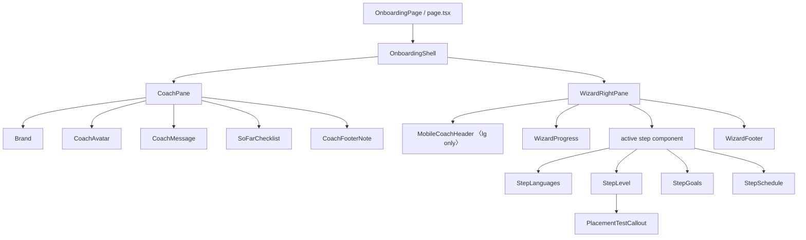
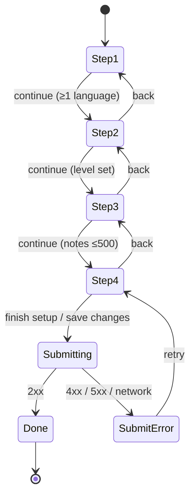
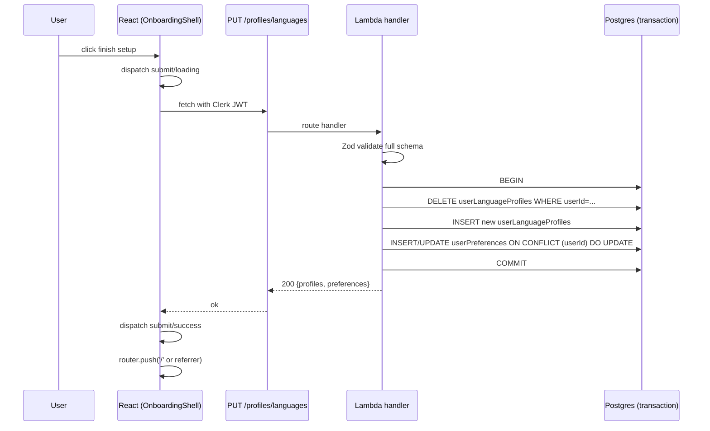

# Design Document

## Overview

A 4-step onboarding wizard at `/onboarding` (with `?edit=1` for re-entry from `/settings`) that collects languages, primary CEFR level, goals, notes, daily minutes, and a gentle-nudges preference. The right pane renders the active step inside a `<section>`; a 320px-wide left coach rail displays brand, avatar, contextual coach message, and a step-progress checklist.

State lives in a single typed reducer in the route's client component. There is no global cache for onboarding — the form holds its own state and submits once via the **rewritten** `PUT /profiles/languages` (now requires the full onboarding payload). A new `GET /profiles/preferences` endpoint hydrates the form in edit mode; the existing `GET /profiles/languages` provides language profile data.

A new `userPreferences` Postgres table (one row per user, FK to `users`) stores the new fields. The mutation transaction replaces `userLanguageProfiles` and upserts `userPreferences` atomically so a partial save is impossible.

**No backwards compatibility.** There is no production data yet, so the API contract is tightened in one move: ES/DE/TR only, max 3 profiles, EN rejected, all preference fields required. The existing PUT tests in `profiles.test.ts` are rewritten as part of this spec rather than preserved.

**State management choice — reducer + React context.** A typed reducer is preferred over `useState` because (a) several actions enforce cross-field invariants (e.g., `setLanguages` may need to clear an out-of-set `primaryLanguage`), (b) the same state is consumed by both the right-pane step components and the left coach pane without prop drilling, and (c) pure-function reducer + selector tests are dramatically simpler than asserting against `useState` callback chains.

**Performance budget.** The onboarding bundle target is ≤35KB gzipped (per requirements NFR.Performance). To hit this we deliberately avoid TanStack Query for the onboarding submit (a single `fetch` mutation suffices) and import only the two existing hooks needed for edit-mode hydration.

## Steering Document Alignment

### Technical Standards (tech.md)
- **Frontend stack**: Next.js App Router, React Server/Client Components, TypeScript strict mode — already in use across `apps/web`.
- **Forms**: React Hook Form + Zod is the documented standard. We will use `react-hook-form` with the resolver pointing at the same Zod schema used by the API client (DRY across boundaries).
- **API layer**: AWS Lambda + Hono framework with Zod request validation; existing pattern in `infra/lambda/src/routes/profiles.ts`.
- **DB**: Neon Postgres + Drizzle ORM with Zod-typed schemas; migrations are forward-only.
- **Auth**: Clerk JWT via API Gateway authorizer; client uses `createAuthenticatedFetch` from `@language-drill/api-client`. No new auth code is needed.
- **No streaks/XP**: enforced by the prototype copy and the absence of any progression UI in this spec.

### Project Structure (structure.md)
- New web route lives at `apps/web/app/onboarding/page.tsx` (already exists — to be rewritten).
- Step components and shared pieces live under `apps/web/components/onboarding/` (new directory) following the convention of `components/shell/` and `components/ui/` (kebab-case files, `__tests__/` co-located).
- Shared types and constants (goal IDs, language metadata) live in `packages/shared/src/onboarding.ts` so the API client and Lambda can both import them.
- Drizzle schema additions live alongside `userLanguageProfiles` in `packages/db/src/schema/users.ts`.
- Lambda route additions live in `infra/lambda/src/routes/profiles.ts`.
- Migration in `packages/db/migrations/<timestamp>_user_preferences.sql` (auto-generated by `drizzle-kit`).

## Code Reuse Analysis

### Existing Components to Leverage
- **`Button`** (`apps/web/components/ui/button.tsx`): primary CTA, ghost back link, ghost cancel link. Uses `loading` prop for the submitting state.
- **`Card`** (`apps/web/components/ui/card.tsx`): the gentle-nudges container on Step 4 and the coach message box on the left rail.
- **`Choice`** (`apps/web/components/ui/choice.tsx`): every selectable tile (languages, CEFR cards, goals, time tiles, primary chips). Supports both `radio` and `checkbox` modes.
- **`Checkbox`** (`apps/web/components/ui/checkbox.tsx`): the gentle-nudges toggle on Step 4.
- **`Textarea`** (`apps/web/components/ui/textarea.tsx`): the optional notes field on Step 3.
- **`Flagdot`** (`apps/web/components/shell/flagdot.tsx`): language icon on Step 1 tiles and the Step 2 primary-language radio tiles.
- **`Brand`** (`apps/web/components/shell/brand.tsx`): top of the coach pane.
- **`isLearningLanguage` / `LearningLanguage`** (`apps/web/lib/active-language.ts`): type guard and type for the EN-excluded language set.
- **Type utility classes** (`apps/web/app/globals.css`): `t-display-l`, `t-display-m`, `t-display-s`, `t-body-l`, `t-body`, `t-small`, `t-micro`, `t-hand`, `t-mono`.
- **Color/spacing/radius tokens**: `paper`, `paper-2`, `paper-3`, `card`, `ink`, `ink-2`, `ink-soft`, `ink-mute`, `rule`, `accent`, `accent-2`, `accent-soft`, `hilite`, `hilite-soft`, `ok`, `ok-soft` and `s-1`–`s-8`, `r-sm`–`r-xl`.

### Integration Points
- **`useLanguageProfiles`** (`packages/api-client/src/hooks/useLanguageProfiles.ts`): existing hook; reused in edit mode to hydrate Step 1.
- **`useSaveLanguageProfiles`** (same file): **deleted** as part of this spec — the only caller is the existing onboarding page, which is rewritten. Replaced by `useSavePreferences` that submits the new full payload.
- **`createAuthenticatedFetch`** (`packages/api-client/src/fetchClient.ts`): wraps `fetch` with Clerk JWT — used unchanged.
- **`(dashboard)/layout.tsx`**: already redirects to `/onboarding` when zero profiles exist; no changes needed there.
- **`PUT /profiles/languages`** (`infra/lambda/src/routes/profiles.ts`): rewritten to require the full onboarding payload (profiles + 5 preference fields).
- **Drizzle `users` table** (`packages/db/src/schema/users.ts`): unchanged; `userPreferences` references it via FK.

## Architecture

### Route & redirect logic

```mermaid
graph TD
    A[User hits /onboarding] --> B{hasProfiles?}
    B -- no --> C[Render wizard, mode=new]
    B -- yes --> D{?edit=1?}
    D -- no --> E[redirect to /]
    D -- yes --> F[Render wizard, mode=edit, hydrate from GET /profiles/languages + GET /profiles/preferences]
    C --> G[User completes Step 4]
    F --> G
    G --> H[PUT /profiles/languages with full payload]
    H -- 2xx, mode=new --> I[router.push&#40;'/'&#41;]
    H -- 2xx, mode=edit --> J[router.push&#40;document.referrer or /settings&#41;]
    H -- 4xx/5xx --> K[Show inline error, stay on Step 4]
```



The redirect logic runs on the **client** in `apps/web/app/onboarding/page.tsx`. The dashboard layout already calls `useLanguageProfiles`, so by the time the onboarding page mounts the user has typically come from a redirect when `profiles.length === 0`. We re-fetch profiles on mount with the same hook to handle direct navigation and to feed edit mode.

### Component hierarchy



The `OnboardingShell` owns the layout (`flex` row, viewport-min-height, coach pane on the left). The `WizardRightPane` owns the right-pane internal layout (progress, fade-in container, footer with back/counter/CTA).

State lives in `OnboardingShell` via `useOnboardingReducer`, passed down via React context (`OnboardingProvider`) so per-step components and the coach pane both read/write without prop drilling.

### Wizard state machine



Validation is encoded in `selectCanAdvance(state, step): boolean`, called by the reducer when a `goNext` action is dispatched. Invalid transitions become no-ops (the CTA is also visually disabled, so this is defence-in-depth).

### Submission flow



The handler always writes both tables — there is no legacy / partial / full classification. Validation rejects a request that's missing any of the six required body fields with a 400.

## Components and Interfaces

### `OnboardingPage` (server-friendly client wrapper)
- **Path:** `apps/web/app/onboarding/page.tsx`
- **Purpose:** Read `?edit=1` search param, render `OnboardingShell` with the right `mode`. Owns the redirect-to-`/` decision when `profiles.length>0 && !edit`. Owns the success redirect: in `new` mode, navigates to `/`; in `edit` mode, navigates to `document.referrer` only if `new URL(document.referrer).origin === window.location.origin`, else falls back to `/settings` (which exists as the placeholder route from app-shell task 22). The same-origin guard prevents an open-redirect via a crafted referrer header.
- **Interfaces:**
  ```ts
  export default function OnboardingPage(): JSX.Element
  ```
- **Dependencies:** `useLanguageProfiles`, `useSearchParams`, `useRouter`, `OnboardingShell`, `useGetPreferences`.
- **Reuses:** existing layout-level `useLanguageProfiles` pattern from `(dashboard)/layout.tsx`.

### `OnboardingShell`
- **Path:** `apps/web/components/onboarding/onboarding-shell.tsx`
- **Purpose:** Top-level 2-pane layout (320px coach + flex right pane). Owns reducer + provider. Renders `<CoachPane>` and `<WizardRightPane>`.
- **Interfaces:**
  ```ts
  type OnboardingShellProps = {
    mode: 'new' | 'edit';
    initialState: OnboardingState;       // hydrated from API in edit mode, defaults in new mode
    onComplete: (mode: 'new' | 'edit') => void;  // called after 2xx; resolves redirect target
  };
  export function OnboardingShell(props: OnboardingShellProps): JSX.Element;
  ```
- **Dependencies:** `useOnboardingReducer`, `OnboardingProvider`, `CoachPane`, `WizardRightPane`.

### `OnboardingProvider` + `useOnboarding`
- **Path:** `apps/web/components/onboarding/onboarding-context.tsx`
- **Purpose:** React context exposing `(state, dispatch)` to descendants.
- **Interfaces:**
  ```ts
  export type OnboardingState = {
    step: 1 | 2 | 3 | 4;
    mode: 'new' | 'edit';
    languages: LearningLanguage[];
    primaryLanguage: LearningLanguage | null;
    primaryLevel: CefrLevel | null;
    goals: GoalId[];
    notes: string;
    dailyMinutes: 5 | 10 | 20 | 30;        // always set; defaults to 10
    gentleNudges: boolean;
    submission:
      | { status: 'idle' }
      | { status: 'loading' }
      | { status: 'success' }                // brief — page is about to navigate
      | { status: 'error'; message: string; kind: '4xx' | '5xx' | 'network' };
  };

  export type OnboardingAction =
    | { type: 'goNext' }
    | { type: 'goBack' }
    | { type: 'setLanguages'; languages: LearningLanguage[] }
    | { type: 'setPrimary'; language: LearningLanguage }
    | { type: 'setLevel'; level: CefrLevel }
    | { type: 'toggleGoal'; goal: GoalId }
    | { type: 'setNotes'; notes: string }
    | { type: 'setDailyMinutes'; minutes: 5 | 10 | 20 | 30 }
    | { type: 'setGentleNudges'; on: boolean }
    | { type: 'submitStart' }
    | { type: 'submitSuccess' }
    | { type: 'submitError'; kind: '4xx' | '5xx' | 'network'; message: string };

  export function useOnboarding(): { state: OnboardingState; dispatch: React.Dispatch<OnboardingAction> };
  ```

### `useOnboardingReducer`
- **Path:** `apps/web/components/onboarding/use-onboarding-reducer.ts`
- **Purpose:** Pure reducer + helper selectors. Validates step transitions; ensures invariants (e.g., when `languages` shrinks to 1, `primaryLanguage` is forced to that single language; when `primaryLanguage` is removed from `languages`, it resets). `initialEditState` coalesces a `null` `dailyMinutes` from `GET /profiles/preferences` to the default `10`.
- **Interfaces:**
  ```ts
  export function reducer(state: OnboardingState, action: OnboardingAction): OnboardingState;
  export function initialNewUserState(): OnboardingState;
  export function initialEditState(profiles: LanguageProfile[], prefs: PreferencesResponse): OnboardingState;
  export function selectCanAdvance(state: OnboardingState): boolean;
  export function selectCoachMessage(state: OnboardingState): string;
  ```

### `CoachPane`
- **Path:** `apps/web/components/onboarding/coach-pane.tsx`
- **Purpose:** Left rail. Renders `Brand`, avatar, message box, "so far" checklist with placeholder-A1 disclosure when applicable, and footer note. Hidden below 900px (`hidden lg:flex` with the project's existing Tailwind breakpoint).
- **Interfaces:**
  ```ts
  type CoachPaneProps = { /* none — reads from context */ };
  export function CoachPane(): JSX.Element;
  ```
- **Reuses:** `Brand`, `Card`, `LANGUAGE_NAMES`, `t-display-s`, `t-small`, `t-micro`, `t-hand` utility classes.

### `MobileCoachHeader`
- **Path:** `apps/web/components/onboarding/mobile-coach-header.tsx`
- **Purpose:** The collapsed coach experience for `<lg` viewports — Brand + per-step coach message in a compact strip above `WizardProgress`. `aria-live="polite"` on the message so screen readers announce step transitions. Always rendered; CSS hides it at `lg` and above.
- **Interfaces:**
  ```ts
  export function MobileCoachHeader(): JSX.Element;
  ```
- **Reuses:** `Brand`, `selectCoachMessage` selector, `t-body` utility class.

### `SoFarChecklist`
- **Path:** `apps/web/components/onboarding/so-far-checklist.tsx`
- **Purpose:** The "so far" progress checklist inside `CoachPane`. Renders one row per step with `✓`/`●`/`○` glyph, label, and summary value (e.g., "primary + level: ES · B2"). Includes the placeholder-A1 sub-line on the "languages" row when non-primary languages are selected (R6.6). Pure presentational — reads from `OnboardingState` via context.
- **Interfaces:**
  ```ts
  export function SoFarChecklist(): JSX.Element;
  ```
- **Reuses:** `LANGUAGE_NAMES`, `t-small`, `t-micro` utility classes; `ok`, `accent`, `ink-mute`, `ink-soft` color tokens.

### `WizardProgress`
- **Path:** `apps/web/components/onboarding/wizard-progress.tsx`
- **Purpose:** 4-segment progress bar above the active step. Active segment renders 2× width per the prototype.
- **Interfaces:** reads `state.step` from context.

### `WizardFooter`
- **Path:** `apps/web/components/onboarding/wizard-footer.tsx`
- **Purpose:** Bottom row with `back` button (hidden on Step 1), step counter (`mono`, "X / 4"), primary CTA. Renders an inline error message above the row when `submission.status === 'error'`. In edit mode on Step 1, replaces the empty back slot with a `cancel` ghost link.

### Step components
- **Path:** `apps/web/components/onboarding/steps/{languages,level,goals,schedule}.tsx`
- All are pure presentational client components reading from and dispatching to context.

#### `StepLanguages`
- Renders eyebrow `step 1`, headline, body, and a 2-column grid of `Choice` tiles for ES/DE/TR.
- Uses `Flagdot` + lowercase native name from `LANGUAGE_NATIVE_NAMES` (a new const in `packages/shared/src/onboarding.ts`).
- In edit mode + 1 language remaining: prevents deselect with the inline message from Requirement 2.7.

#### `StepLevel`
- Renders eyebrow `step 2`, headline with `<span class="hilite">{primaryName}</span>`, body, an optional primary-language single-select row (only when ≥2 languages selected), the 6 CEFR cards, and `<PlacementTestCallout />`.
- The primary-language row uses `Choice` in `radio` mode (one tile per selected language with a `Flagdot` + uppercase code), wrapped in a `<div role="radiogroup" aria-label="primary language">` so keyboard arrow-key navigation works. We do NOT use the `Chip` primitive here — `Chip` from the design system is a non-interactive presentation badge. (If a future spec needs an interactive chip-group widget it can extract one; this spec doesn't introduce one.)
- Updates context on every selection.

#### `PlacementTestCallout`
- **Path:** `apps/web/components/onboarding/placement-test-callout.tsx`
- **Purpose:** Strictly non-interactive informational callout. Rendered as `<aside role="note">` with a hand-script "not sure?" prefix and the body copy. **No `onClick`, no `onKeyDown`, no `tabIndex`, no children that are buttons or links.** Tests in `__tests__/placement-test-callout.test.tsx` assert: it's not in the tab order; it has no `role="button"` and no event handlers; cursor is `default`; clicking it dispatches no action.

#### `StepGoals`
- Renders eyebrow `step 3`, headline, body, the 2-column × 3-row goal grid (collapses to 1 column at <600px), and the `Textarea` with character counter.
- Goal emojis are rendered inline with `aria-hidden="true"` so screen readers don't announce them.

#### `StepSchedule`
- Renders eyebrow `step 4`, headline, body, the 4-column time grid (collapses to 2×2 at <600px), the gentle-nudges Card, and the hand-script p.s. note.

### `useSavePreferences` hook
- **Path:** `packages/api-client/src/hooks/usePreferences.ts` (new file — follows the existing `use<Name>.ts` convention from `useLanguageProfiles.ts`, `useExercise.ts`, `useHealth.ts`)
- **Purpose:** Single mutation hook that calls `PUT /profiles/languages` with the full payload. **Owns the notes-field whitespace normalization (R4.6):** before validating against `SavePreferencesInputSchema`, the hook trims leading/trailing whitespace from `notes` and converts `\r\n` → `\n`. This keeps the rule in one well-tested place. **Also fills the non-primary A1 default (R3.8 / R7.1):** any selected language that isn't `primaryLanguage` is added to `profiles[]` with `proficiencyLevel: 'A1'` before the payload is validated.
- **Interfaces:**
  ```ts
  type SavePreferencesInput = {
    profiles: LanguageProfileInput[];
    primaryLanguage: Language;
    goals: GoalId[];
    dailyMinutes: 5 | 10 | 20 | 30;
    gentleNudges: boolean;
    notes: string;
  };
  type SavePreferencesResponse = {
    profiles: LanguageProfile[];
    preferences: PreferencesResponse;
  };
  export function useSavePreferences(opts: { fetchFn: AuthenticatedFetch }): UseMutationResult<SavePreferencesResponse, ApiError, SavePreferencesInput>;
  ```
- **Cache invalidation:** on success, the hook invalidates the `['languageProfiles']` and `['preferences']` TanStack query keys so any downstream consumer (dashboard, settings) reads the new values on next render.

### `useGetPreferences` hook
- **Path:** `packages/api-client/src/hooks/usePreferences.ts` (same file as above)
- **Purpose:** Calls `GET /profiles/preferences` for edit-mode hydration.
- **Interfaces:**
  ```ts
  export function useGetPreferences(opts: { fetchFn: AuthenticatedFetch; enabled: boolean }): UseQueryResult<PreferencesResponse, ApiError>;
  ```
- `enabled` lets the new-user flow skip the call entirely.

### Lambda routes
- **Path:** `infra/lambda/src/routes/profiles.ts`
- **Rewritten route:** `PUT /profiles/languages` now requires the full onboarding payload. The `UpdateProfilesSchema` enforces ES/DE/TR + max-3 + EN-rejection + primary-in-profiles. The handler runs delete-then-insert for `userLanguageProfiles` plus an `INSERT … ON CONFLICT (user_id) DO UPDATE` for `userPreferences` inside one Drizzle transaction. Response: `{ profiles, preferences }`.
- **New route:** `GET /profiles/preferences`. Reads `userPreferences` for the authenticated user; returns the documented defaults if the row is absent.

## Data Models

### Drizzle schema additions

```ts
// packages/db/src/schema/users.ts (additions only — `users` table already exists in this file)
import { pgTable, text, smallint, jsonb, boolean, timestamp } from 'drizzle-orm/pg-core';
import { InferInsertModel, InferSelectModel } from 'drizzle-orm';
// `users` is defined above in the same file — no import needed.

export const userPreferences = pgTable('user_preferences', {
  userId: text('user_id')
    .primaryKey()
    .references(() => users.id, { onDelete: 'cascade' }),
  primaryLanguage: text('primary_language').notNull(),       // Language enum value
  goals: jsonb('goals').$type<string[]>().notNull().default([]),
  dailyMinutes: smallint('daily_minutes').notNull(),
  gentleNudges: boolean('gentle_nudges').notNull().default(true),
  notes: text('notes').notNull().default(''),
  updatedAt: timestamp('updated_at', { withTimezone: true }).notNull().defaultNow(),
});

export type UserPreferences = InferSelectModel<typeof userPreferences>;
export type NewUserPreferences = InferInsertModel<typeof userPreferences>;
```

A Drizzle migration file `packages/db/migrations/<ts>_user_preferences.sql` is auto-generated by `pnpm drizzle-kit generate`. No backfill is needed (absent rows are handled by the GET fallback in Requirement 9.2).

> **Note on `primaryLanguage` nullability:** the column is `NOT NULL` in Postgres because every row that exists represents a completed onboarding submission. The only `null` path is "no `userPreferences` row exists" — handled by the GET fallback. No code path should ever attempt to `INSERT` or `UPDATE` `primaryLanguage = NULL`.

### Wire-format Zod schemas

```ts
// packages/shared/src/onboarding.ts (new)
export const GOAL_IDS = ['grammar', 'speaking', 'listening', 'writing', 'vocab', 'travel'] as const;
export type GoalId = typeof GOAL_IDS[number];

export const DAILY_MINUTES = [5, 10, 20, 30] as const;
export type DailyMinutes = typeof DAILY_MINUTES[number];

export const NOTES_MAX_LENGTH = 500;

export const LANGUAGE_NATIVE_NAMES: Record<LearningLanguage, string> = {
  ES: 'español',
  DE: 'deutsch',
  TR: 'türkçe',
};
```

```ts
// packages/api-client/src/schemas/preferences.ts (new)
export const PreferencesResponseSchema = z.object({
  primaryLanguage: z.nativeEnum(Language).nullable(),
  goals: z.array(z.enum(GOAL_IDS)),
  dailyMinutes: z.union([z.literal(5), z.literal(10), z.literal(20), z.literal(30)]).nullable(),
  gentleNudges: z.boolean(),
  notes: z.string().max(NOTES_MAX_LENGTH),
});
export type PreferencesResponse = z.infer<typeof PreferencesResponseSchema>;

// Canonical wire schema for PUT /profiles/languages. ES/DE/TR only,
// max 3 profiles, EN rejected, primary-in-profiles refinement.
// All preference fields are required.
const LearningLanguageEnum = z.enum([Language.ES, Language.DE, Language.TR]);
const LearningProfileSchema = z.object({
  language: LearningLanguageEnum,
  proficiencyLevel: z.nativeEnum(CefrLevel),
});
export const SavePreferencesInputSchema = z.object({
  profiles: z.array(LearningProfileSchema).min(1).max(3),
  primaryLanguage: LearningLanguageEnum,
  goals: z.array(z.enum(GOAL_IDS)),
  dailyMinutes: z.union([z.literal(5), z.literal(10), z.literal(20), z.literal(30)]),
  gentleNudges: z.boolean(),
  notes: z.string().max(NOTES_MAX_LENGTH),
}).refine(
  (input) => input.profiles.some((p) => p.language === input.primaryLanguage),
  { message: 'primaryLanguage must be one of the submitted profiles.languages' },
);
```

### Lambda-side Zod (rewritten — strict)

```ts
// infra/lambda/src/routes/profiles.ts
// The Lambda imports nothing from api-client (intentional: the two packages
// don't depend on each other today). The schema below mirrors
// SavePreferencesInputSchema from api-client, with one Lambda-only addition:
// a duplicate-language refinement (server-side defence; the wizard UI cannot
// produce duplicates, so api-client doesn't need it). Future drift between
// the two definitions is caught by the parallel api-client test suite plus
// the Lambda's own tests.
import { GOAL_IDS, NOTES_MAX_LENGTH } from '@language-drill/shared';
import { Language, CefrLevel } from '@language-drill/shared';

const LearningLanguageEnum = z.enum([Language.ES, Language.DE, Language.TR]);

const LearningProfileSchema = z.object({
  language: LearningLanguageEnum,
  proficiencyLevel: z.nativeEnum(CefrLevel),
});

const UpdateProfilesSchema = z.object({
  profiles: z.array(LearningProfileSchema).min(1).max(3),
  primaryLanguage: LearningLanguageEnum,
  goals: z.array(z.enum(GOAL_IDS)),
  dailyMinutes: z.union([z.literal(5), z.literal(10), z.literal(20), z.literal(30)]),
  gentleNudges: z.boolean(),
  notes: z.string().max(NOTES_MAX_LENGTH),
}).refine(
  (data) => new Set(data.profiles.map((p) => p.language)).size === data.profiles.length,
  { message: 'Duplicate languages are not allowed' },
).refine(
  (data) => data.profiles.some((p) => p.language === data.primaryLanguage),
  { message: 'primaryLanguage must match one of the submitted profiles.languages' },
);
```

The handler always performs the full write: replace `userLanguageProfiles` rows AND upsert `userPreferences` inside one Drizzle transaction. There is no legacy / partial / full classification; a request that's missing any required field is a 400 from Zod.

**On schema duplication.** The Lambda and api-client define matching schemas independently because the two packages don't share a Zod dependency boundary today (matching the pre-existing pattern of `LanguageProfileSchema` being defined twice). A future refactor could promote both into `@language-drill/shared`; that's not in scope here.

## Error Handling

### Error Scenarios

1. **Validation failure on submit (4xx)**
   - **Handling:** Lambda returns 400 with `{ error: { message } }`. The `useSavePreferences` hook rejects with an `ApiError` carrying the message; the reducer dispatches `submitError` with `kind: '4xx'`.
   - **User Impact:** Inline error appears at the bottom of the right pane above `WizardFooter`: `"<server message>"`. The user stays on Step 4 with all data intact.

2. **Server error / Lambda crash (5xx)**
   - **Handling:** Hook rejects with `kind: '5xx'`.
   - **User Impact:** Inline message: `"something went wrong — try again."` Primary CTA re-enables.

3. **Network error / timeout**
   - **Handling:** `fetch` rejects; `createAuthenticatedFetch` rethrows; hook surfaces it as `kind: 'network'`.
   - **User Impact:** Same message as 5xx ("something went wrong — try again.").

4. **Edit mode hydration failure (`GET /profiles/languages` or `GET /profiles/preferences` fails)**
   - **Handling:** `OnboardingPage` shows a paper-card error with a retry button (mirrors `(dashboard)/layout.tsx`'s pattern).
   - **User Impact:** "couldn't load your preferences" + retry. No partial wizard render.

5. **User attempts to deselect last language in edit mode**
   - **Handling:** Reducer's `setLanguages` action rejects the empty array when `mode === 'edit'`; component shows the inline guidance message.
   - **User Impact:** Tile remains selected; small `ink-mute` text explains the constraint.

6. **User pastes >500 chars into the notes field**
   - **Handling:** Reducer accepts the value but `selectCanAdvance` returns false; `WizardFooter` disables the CTA and shows the count `123 / 500` in `accent-2` once the limit is exceeded.
   - **User Impact:** CTA grays out; inline counter turns warning-colored.

7. **Reduced motion**
   - **Handling:** Step transitions use Tailwind's `motion-safe:animate-fade-in motion-reduce:animate-none` (or equivalent CSS variable approach). The default fade-in animation is defined in `globals.css` as a 250ms keyframe animation gated on `@media (prefers-reduced-motion: no-preference)`.
   - **User Impact:** Users with `prefers-reduced-motion: reduce` see instant step transitions.

## Testing Strategy

### Unit Testing
- **Reducer**: `apps/web/components/onboarding/__tests__/use-onboarding-reducer.test.ts`. Test every action, every guard (`selectCanAdvance` per step), invariants (e.g., `setLanguages([])` is rejected in edit mode; removing the current `primaryLanguage` from `languages` resets `primaryLanguage` to `null`; `setPrimary` to a language not in `languages` is a no-op).
- **`PlacementTestCallout`**: `__tests__/placement-test-callout.test.tsx`. Asserts the non-interactivity contract is regression-proof:
  - Render the callout. Walk the subtree with `container.querySelectorAll('button, a, [role="button"], [role="link"], [tabindex]')` and assert the result is empty.
  - Assert the root has class `cursor-default` (testable via `toHaveClass`; computed-style checks are unreliable in JSDOM).
  - Wrap in a context spy and assert that simulating `click` and `keydown` (Enter, Space) on the root dispatches zero actions and changes no state.
  - Assert that `aside.outerHTML` does not contain `onclick=`, `onmousedown=`, `onkeydown=`, or `href=`.
- **Each step component** (`step-languages`, `step-level`, `step-goals`, `step-schedule`): rendering, click behaviour, edge cases (last-language deselect prevention, >500-char notes, primary-language chip only renders when languages.length>1).
- **`CoachPane`**: shows the right message for each step; renders the placeholder-A1 disclosure only when non-primary languages were selected; checklist values are correctly formatted with `·` (U+00B7).
- **`useSavePreferences`**: unit-test the input-shape transform from reducer state to wire payload.

### Integration Testing
- **Wizard happy path**: `apps/web/app/onboarding/page.test.tsx`. Mock `useLanguageProfiles`/`useGetPreferences`/`useSavePreferences`; render the page; advance through 4 steps with realistic clicks; assert the `useSavePreferences.mutate` was called with the expected payload.
- **Edit-mode hydration**: same test file. Mock the GET responses, render with `?edit=1`, assert each step pre-fills correctly and the final CTA reads "save changes →".
- **Submission error paths** (4xx, 5xx, network): same file. Mock the hook to reject; assert inline error renders with appropriate copy and the user stays on Step 4.

### End-to-End Testing
Deferred — the project has no Playwright suite yet (`docs/web-implementation-plan.md` Phase B intentionally skipped E2E). The integration tests above provide the equivalent coverage for now.

### API Testing (Lambda)
- **Existing `PUT /profiles/languages` tests** in `infra/lambda/src/routes/profiles.test.ts` are **rewritten** to send the new full payload (no production data depends on the legacy shape). Cases:
  - PUT with valid full payload (single profile, ES B2) — creates profiles + creates `userPreferences` row.
  - PUT with valid full payload (multi-profile with primary in set) — creates all profiles + sets `assessedAt` + creates `userPreferences`.
  - PUT replaces atomically (delete old + insert new) on subsequent call; `userPreferences` upsert updates the row.
  - PUT rejects: empty `profiles[]`, duplicate languages, EN in `profiles[]`, max-3 violation (4 profiles), invalid `Language` enum, invalid `CefrLevel`, `primaryLanguage` not in `profiles[]`, `notes` >500 chars, invalid `goals[]` entry, `dailyMinutes` not in `{5,10,20,30}`, missing any required field.
  - PUT returns 401 when JWT is missing.
- **New tests for `GET /profiles/preferences`:**
  - Returns documented defaults when no row exists (including `gentleNudges: true`).
  - Returns stored values when a row exists.
  - Returns 401 when JWT missing.
