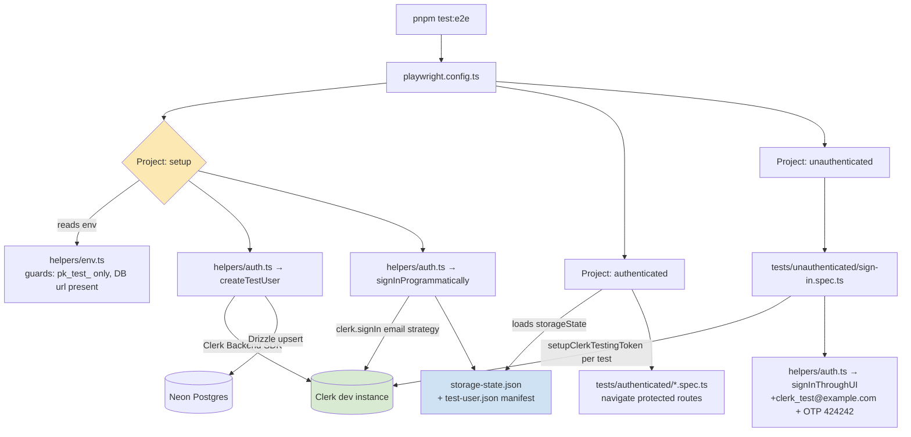

# Design Document

## Overview

Add Playwright E2E testing infrastructure to `apps/web` that lets developers
and AI agents drive the real authenticated app. Auth is gated by
`clerkMiddleware` (`apps/web/middleware.ts`) on every route except
`/sign-in`, `/sign-up`, and `/api/webhooks`, so any meaningful test needs to
get past Clerk first.

The design uses **Clerk's officially supported `@clerk/testing` Playwright
helpers** rather than rolling our own session-cookie injection:

- A **setup project** runs once per `pnpm test:e2e` invocation. It calls
  `clerkSetup()` (obtains the Testing Token tied to the dev publishable
  key), provisions the canonical test user via the Clerk Backend SDK +
  Postgres upsert, signs in once with `clerk.signIn({ page, emailAddress })`
  (the server-side token strategy bypasses verification, MFA, and bot
  protection), then writes browser `storageState` to disk.
- An **`authenticated` project** depends on the setup project and reuses
  that `storageState`, so every test starts already signed in.
- An **`unauthenticated` project** has no `storageState`. It contains the
  one smoke test that exercises Clerk's hosted sign-in UI using the
  reserved `+clerk_test@example.com` email pattern and the fixed `424242`
  OTP code, with `setupClerkTestingToken({ page })` per-test to defeat bot
  protection.

This matches Clerk's documented Playwright pattern exactly
(https://clerk.com/docs/testing/playwright/test-authenticated-flows) and
avoids any production code paths or HTTP bypass routes.

### Deviations from requirements

Two acceptance criteria are reinterpreted by this design. They are called
out here so the user can accept or push back before any code is written:

- **R3.AC6 — `dev_user_001` identifier match.** Clerk issues its own
  user ID (`user_2xxx…`); we cannot make it literally equal
  `dev_user_001`. The design preserves the *intent* of the AC — a single
  canonical, shared E2E identity across the web suite and the Lambda dev
  server — by writing the Clerk-issued ID to a manifest file
  (`apps/web/e2e/.auth/test-user.json`) and documenting a one-line shell
  recipe in `docs/testing.md`:
  `DEV_USER_ID=$(jq -r .userId apps/web/e2e/.auth/test-user.json) pnpm dev:api`.
  Sample authenticated tests do **not** depend on Lambda API responses,
  so the two sides only need to align when a developer explicitly
  exercises the cross-runtime path.
- **R1.AC7 — check-then-refresh storage state.** Implemented as a
  hybrid: `auth.setup.ts` checks the on-disk mtime against a
  configurable `E2E_STORAGE_STATE_TTL_MINUTES` (default 30, well under
  Clerk's default session lifetime). If the file is missing, malformed,
  or older than the TTL it re-signs; otherwise it reuses the existing
  state and skips the Clerk Backend SDK round-trip. This satisfies both
  the spec AC (expiry-aware refresh) and the NFR (no Clerk call on
  steady-state runs).

## Steering Document Alignment

### Technical Standards (tech.md)

- **TypeScript everywhere.** The Playwright config, helpers, and tests are
  all `.ts`, matching the rest of the monorepo.
- **pnpm workspaces + Turborepo.** All new commands run through
  `pnpm --filter @language-drill/web`, with a `test:e2e` script added to
  `apps/web/package.json` and a Turborepo task entry so it composes with
  the existing pipeline (caching disabled — E2E runs are side-effectful).
- **Vercel-native development loop.** A `PLAYWRIGHT_BASE_URL` override
  makes it trivial to point the suite at a preview deploy without
  changing config.
- **Serverless-first, no infra changes.** No new Lambdas, API routes,
  middleware branches, or CDK resources. The web `middleware.ts` is
  untouched — tests get past auth by carrying a real Clerk session, not
  by bypassing the gate.
- **Zod / typed contracts.** Helper APIs use plain TypeScript interfaces;
  no runtime validation needed because inputs come from our own code, not
  user input.

### Project Structure (structure.md)

The repo doesn't have an explicit `structure.md`, so the layout follows
conventions already used in `apps/web`:

- Production code lives under `apps/web/app`, `apps/web/components`,
  `apps/web/lib`. Unit tests live next to the file under test
  (`page.test.tsx`).
- E2E tests are a different concern (browser-driven, slow, separate
  runner), so they get their own root: `apps/web/e2e/`. This mirrors
  Playwright's defaults and keeps Vitest's `include` patterns unaffected.

```
apps/web/
├── e2e/
│   ├── .auth/                      # gitignored — storage state + test-user manifest
│   ├── .gitignore                  # ignores .auth/
│   ├── auth.setup.ts               # Playwright "setup" project entry
│   ├── helpers/
│   │   ├── auth.ts                 # createTestUser, signInThroughUI, signInProgrammatically
│   │   ├── env.ts                  # required-env validation + pk_live_ guard
│   │   └── test-user.ts            # default test-user constants & file IO
│   ├── tests/
│   │   ├── authenticated/
│   │   │   └── dashboard.spec.ts   # sample test using shared storage state
│   │   └── unauthenticated/
│   │       └── sign-in.spec.ts     # sample UI sign-in test
│   └── README.md                   # short orientation; links to docs/testing.md
├── playwright.config.ts            # config: projects, webServer, baseURL, trace policy
└── package.json                    # adds test:e2e, e2e:install, e2e:ui scripts
```

## Code Reuse Analysis

### Existing Components to Leverage

- **`@language-drill/db` barrel (`packages/db/src/index.ts`).** Already
  exports the `users` table and a Drizzle client. The setup script will
  use the same import shape that `infra/lambda/src/dev.ts` uses for
  upserting `dev_user_001`. No new DB code needed.
- **`infra/lambda/src/dev.ts` pattern.** Provides the precedent for
  "test/dev user provisioning": insert into `users` with
  `onConflictDoNothing()`, then upsert language profiles. The Playwright
  setup script mirrors this exactly so the local dev API and the E2E
  test land on identical schema rows.
- **`@clerk/backend` (^3.4.7).** Already a dependency in
  `infra/lambda/package.json`. The E2E setup needs Clerk Backend SDK for
  user provisioning; we add it as a `devDependency` of `apps/web`
  (separate copy is fine — both Clerk-version-compatible).
- **`@clerk/nextjs` types.** The middleware uses Clerk's matchers; we
  don't need to re-derive route lists — sample tests just assert against
  protected URLs directly.
- **`apps/web/.env.example`.** Existing pattern for documented env vars;
  we extend it rather than create a new file.

### Integration Points

- **Clerk dev instance.** All E2E runs target a `pk_test_` Clerk instance.
  The setup project hard-fails (`process.exit(1)`) if it detects
  `pk_live_`, mirroring the spec's security requirement.
- **Neon Postgres.** The setup script connects via `DATABASE_URL`, the
  same way Drizzle migrations do. For local runs that hits the dev Neon
  branch; in CI it will hit the per-PR ephemeral branch already created
  by `.github/workflows/ci.yml` → `neon-migrate`.
- **`infra/lambda/src/dev.ts` Lambda dev server.** Optional interop:
  after `auth.setup.ts` provisions the test user, it writes a manifest
  file (`apps/web/e2e/.auth/test-user.json`) containing the Clerk-issued
  user ID. A developer who wants the Lambda dev API to act as that same
  user starts it with `DEV_USER_ID=$(jq -r .userId apps/web/e2e/.auth/test-user.json)`
  — documented in `docs/testing.md`. The Lambda dev server is otherwise
  untouched.
- **Vercel preview deploys.** Setting `PLAYWRIGHT_BASE_URL` to the
  preview URL skips `webServer` auto-start; `globalSetup` still hits
  Clerk + Neon directly with the same env vars.
- **CI env-var wiring (GitHub Actions).** When the E2E suite is added to
  `.github/workflows/ci.yml` (separate task, may land in a follow-up
  PR), the `e2e` job will run after `neon-migrate` and consume:
  - `DATABASE_URL` — exported by the `neon-migrate` step via
    `$GITHUB_ENV` (already present in the file today; the e2e job needs
    `needs: [neon-migrate]` so the env is available).
  - `CLERK_SECRET_KEY` and `NEXT_PUBLIC_CLERK_PUBLISHABLE_KEY` — read
    from GitHub Actions secrets (the dev Clerk instance keys, already
    used for the Vercel preview Clerk wiring).
  - `E2E_CLERK_USER_EMAIL` / `E2E_CLERK_USER_PASSWORD` — repo-level
    GitHub Actions variables/secrets; the test password is a one-time
    random string committed only to GitHub secrets.
- **Test-user accumulation.** `createTestUser` is idempotent on email
  address, so the dev Clerk instance accumulates exactly one E2E user
  total regardless of how many CI runs execute. No cleanup workflow
  needed.

## Architecture

The design is a **layered helper / project / config** structure:



Two architectural rules keep the surface tight:

1. **All Clerk + DB I/O lives in `helpers/`.** Specs only call helpers and
   Playwright assertions — no direct `@clerk/backend` or Drizzle imports
   in `.spec.ts` files. This keeps tests focused on behavior, and makes
   the helpers the single point to change when Clerk's testing API
   evolves.
2. **`env.ts` is the single guardrail.** All env validation, the
   `pk_live_` refusal, and the missing-secret fast-fail go through one
   module that the setup project imports first. Tests never read raw
   `process.env`.

## Components and Interfaces

### Component 1 — `apps/web/playwright.config.ts`

- **Purpose:** Single Playwright config defining the three projects, the
  base URL resolution, the optional `webServer`, and global reporter /
  trace policy.
- **Interfaces:** Standard Playwright `defineConfig` export. No public
  TypeScript surface.
- **Dependencies:** `@playwright/test`, `helpers/env.ts` (for base URL
  computation), Node `path`.
- **Reuses:** Nothing existing — this file does not exist yet.

Key config decisions:

| Setting | Value | Reason |
|---|---|---|
| `testDir` | `./e2e/tests` | Keeps Vitest's `apps/web/**` unit-test discovery clean. |
| `fullyParallel` | `true` for authenticated, `false` for unauthenticated | UI sign-in test is single-shot; auth'd tests can parallelize. |
| `forbidOnly` | `!!process.env.CI` | Standard guard. |
| `retries` | `process.env.CI ? 2 : 0` | Local fast-fail; CI tolerates flake. |
| `reporter` | `[['html', { outputFolder: 'playwright-report', open: 'never' }]]` | Stable artifact path matches R6.AC3. |
| `use.baseURL` | `process.env.PLAYWRIGHT_BASE_URL ?? 'http://localhost:3000'` | R3.AC5. |
| `use.trace` | `'retain-on-failure'` | R6.AC3 explicit. |
| `use.screenshot` | `'only-on-failure'` | R6.AC3. |
| `webServer` | Only when `!process.env.PLAYWRIGHT_BASE_URL`: `{ command: 'pnpm --filter @language-drill/web dev', url: 'http://localhost:3000', reuseExistingServer: !process.env.CI }` | R3.AC4 / R3.AC5. |
| `projects` | `[ { name: 'setup', testMatch: /auth\.setup\.ts/ }, { name: 'authenticated', dependencies: ['setup'], use: { storageState: 'apps/web/e2e/.auth/storage-state.json' }, testDir: './e2e/tests/authenticated' }, { name: 'unauthenticated', testDir: './e2e/tests/unauthenticated' } ]` | Three-project pattern from Clerk docs. |

### Component 2 — `apps/web/e2e/auth.setup.ts`

- **Purpose:** Playwright "setup" entry. Runs `clerkSetup()`, validates
  env, provisions the test user, performs programmatic sign-in, persists
  `storageState`.
- **Interfaces:** Implicit Playwright `setup(...)` test functions; no
  exported API.
- **Dependencies:** `@clerk/testing/playwright`, `helpers/env.ts`,
  `helpers/auth.ts`, `helpers/test-user.ts`.
- **Reuses:** `helpers/auth.ts → createTestUser`,
  `helpers/auth.ts → signInProgrammatically`.

### Component 3 — `apps/web/e2e/helpers/env.ts`

- **Purpose:** Centralized env-var validation. Exported `assertE2EEnv()`
  returns a frozen object with `clerkSecretKey`, `clerkPublishableKey`,
  `databaseUrl`, `baseUrl`, `testUserEmail`, `testUserPassword?`. Throws
  with a precise `Missing env var: X` message if any required key is
  absent (R1.AC4, R4.AC3).
- **Interfaces:**
  ```ts
  export interface E2EEnv {
    clerkSecretKey: string;
    clerkPublishableKey: string;  // must start with 'pk_test_'
    databaseUrl: string;
    baseUrl: string;
    testUserEmail: string;
    // Consumed only by createTestUser when provisioning a new Clerk
    // identity. The email-only clerk.signIn strategy used at runtime
    // does not need it; we still require it so initial provisioning is
    // deterministic and re-runnable.
    testUserPassword: string;
    storageStateTtlMinutes: number;  // default 30
  }
  export function assertE2EEnv(): E2EEnv;
  ```
- **Dependencies:** Node `process.env` only. No runtime deps.
- **Reuses:** Nothing — minimal isolated module.

Refuse-on-prod logic (R1.AC5, R2.AC6, R4 NFR Security):
```ts
if (clerkPublishableKey.startsWith('pk_live_')) {
  throw new Error(
    'E2E refuses to run against a production Clerk instance. ' +
    'NEXT_PUBLIC_CLERK_PUBLISHABLE_KEY must start with pk_test_.'
  );
}
```

### Component 4 — `apps/web/e2e/helpers/auth.ts`

- **Purpose:** All Clerk + DB I/O for tests. Three exported functions.
- **Interfaces:**
  ```ts
  // Idempotent: create the canonical test user in Clerk + DB if missing,
  // otherwise return the existing identity. Returns the Clerk-issued user
  // ID, the email used, and a flag indicating whether it was newly created.
  export async function createTestUser(opts?: {
    email?: string;       // default: from env (E2E_CLERK_USER_EMAIL)
    password?: string;    // default: from env (E2E_CLERK_USER_PASSWORD)
    metadata?: Record<string, unknown>;
  }): Promise<{ userId: string; email: string; created: boolean }>;

  // Drives Clerk's hosted UI on /sign-in using +clerk_test pattern + 424242.
  // Used only by the unauthenticated project's smoke test.
  export async function signInThroughUI(
    page: Page,
    opts?: { email?: string; expectRedirectTo?: string },
  ): Promise<void>;

  // Calls @clerk/testing/playwright's clerk.signIn with the email-address
  // strategy. Used by auth.setup.ts only.
  export async function signInProgrammatically(
    page: Page,
    opts?: { email?: string },
  ): Promise<void>;
  ```
- **Dependencies:** `@clerk/backend`, `@clerk/testing/playwright`,
  `@language-drill/db`, `drizzle-orm`, `helpers/env.ts`,
  `helpers/test-user.ts`.
- **Reuses:** `users` schema and Drizzle client from `@language-drill/db`
  exactly as `infra/lambda/src/dev.ts` does
  (`db.insert(users).values({...}).onConflictDoNothing()`).

`createTestUser` behavior:

1. Call `clerkClient.users.getUserList({ emailAddress: [email] })`.
2. If empty, call `clerkClient.users.createUser({ emailAddress: [email], password, skipPasswordChecks: true, publicMetadata: { e2eTestUser: true, ...metadata } })`.
3. Upsert the Clerk-issued `user.id` into Postgres `users` table with
   `onConflictDoNothing()`.
4. Return the identity.

`signInProgrammatically` body is essentially the verbatim Clerk-docs
pattern:
```ts
await clerk.signIn({ page, emailAddress });
```

### Component 5 — `apps/web/e2e/helpers/test-user.ts`

- **Purpose:** Default constants and manifest IO. Keeps file paths in one
  place.
- **Interfaces:**
  ```ts
  export const DEFAULT_E2E_USER_EMAIL = 'e2e+clerk_test@example.com';
  export const STORAGE_STATE_PATH = 'apps/web/e2e/.auth/storage-state.json';
  export const TEST_USER_MANIFEST_PATH = 'apps/web/e2e/.auth/test-user.json';
  export interface TestUserManifest {
    userId: string;      // Clerk-issued user ID
    email: string;
    createdAt: string;   // ISO timestamp
  }
  export function writeTestUserManifest(m: TestUserManifest): Promise<void>;
  export function readTestUserManifest(): Promise<TestUserManifest | null>;
  ```
- **Dependencies:** Node `fs/promises`, `path`.
- **Reuses:** Nothing.

### Component 6 — `apps/web/e2e/tests/authenticated/dashboard.spec.ts`

Sample test (R6.AC1):
- **Purpose:** Prove the storage-state pattern works.
- **Behavior:** `page.goto('/')`, assert URL does not start with `/sign-in`,
  assert a known authenticated UI element is visible (selected from
  whatever exists in `apps/web/app/(dashboard)/page.tsx` — likely a
  heading or nav element).

### Component 7 — `apps/web/e2e/tests/unauthenticated/sign-in.spec.ts`

Sample test (R6.AC2):
- **Purpose:** Prove the UI sign-in path works.
- **Behavior:** Skip on `pk_live_`; call `setupClerkTestingToken({ page })`;
  `signInThroughUI(page)`; assert post-sign-in URL.

### Component 8 — `apps/web/package.json` scripts

Adds:
```json
{
  "test:e2e": "playwright test",
  "test:e2e:ui": "playwright test --ui",
  "test:e2e:install": "playwright install --with-deps chromium"
}
```

`turbo.json` gets a `@language-drill/web#test:e2e` entry with
`"cache": false` and `"persistent": false`, declared dependency on
`^build` for downstream package builds.

### Component 9 — `apps/web/.env.example` (modified)

Append:
```
# ------------------------------------------------------------
# Playwright E2E (apps/web/e2e/**) — required only when running test:e2e
# Documented in docs/testing.md.
# ------------------------------------------------------------
# Canonical E2E test user. Email MUST contain "+clerk_test" for Clerk's
# dev-instance test pattern (suppresses real email delivery).
E2E_CLERK_USER_EMAIL=e2e+clerk_test@example.com
# Password assigned to the test user (server-controlled, never delivered).
E2E_CLERK_USER_PASSWORD=replace-with-strong-random-string
# Optional: point the suite at a preview deploy instead of localhost:3000.
# PLAYWRIGHT_BASE_URL=https://your-preview-deploy.vercel.app
```

### Component 10 — `docs/testing.md` (new) + `CLAUDE.md` reference

The doc covers (R5):
- The default rule ("authenticated project for feature tests; unauthenticated only for sign-in regressions")
- The two helpers and their signatures
- The `dev_user_001` alignment recipe (`DEV_USER_ID=$(jq -r .userId apps/web/e2e/.auth/test-user.json) pnpm dev:api`)
- Reserved Clerk test email + fixed OTP
- Commands for local / preview-URL / "session expired, refresh"
- Link to `https://clerk.com/docs/testing/playwright/overview`

`CLAUDE.md` gets a new short section under "Testing":

> **End-to-end (Playwright):** the suite lives in `apps/web/e2e/`. Default
> is the `authenticated` project — tests start already signed in via the
> shared storage state produced by `auth.setup.ts`. Use the
> `unauthenticated` project only when the sign-in surface itself is under
> test. Full guide: `docs/testing.md`.

## Data Models

### TestUserManifest (on disk, gitignored)

```
{
  "userId": "user_2abcXYZ...",   // Clerk-issued — used by Lambda dev DEV_USER_ID override
  "email":  "e2e+clerk_test@example.com",
  "createdAt": "2026-05-23T09:00:00.000Z"
}
```

### storage-state.json (on disk, gitignored)

Playwright's native shape — cookies + origin storage; not designed/owned
by us. We treat it as opaque.

### Postgres `users` row (no schema change)

Reuses the existing `users` table from `@language-drill/db`. The setup
script writes one row with `id = <Clerk user ID>` and
`email = e2e+clerk_test@example.com`, matching how
`infra/lambda/src/dev.ts` writes its dev user.

## Error Handling

### Error Scenarios

1. **Missing required env var (`CLERK_SECRET_KEY`, `DATABASE_URL`,
   `NEXT_PUBLIC_CLERK_PUBLISHABLE_KEY`, `E2E_CLERK_USER_EMAIL`,
   `E2E_CLERK_USER_PASSWORD`).**
   - Handling: `assertE2EEnv()` throws `Error("E2E missing env: <NAME>")`
     before any browser/Clerk/DB call. Playwright's setup project surfaces
     it as a setup failure; no specs run.
   - User Impact: Terminal shows precise missing-var name in red. Exit
     code non-zero.

2. **Publishable key is `pk_live_`.**
   - Handling: `assertE2EEnv()` throws; the unauth sign-in spec also
     individually checks and `test.skip()`s as a belt-and-braces (R2.AC6).
   - User Impact: Same as above; explicit message naming the safety rule.

3. **Clerk Backend SDK call fails (network, rate limit, invalid key).**
   - Handling: `createTestUser` does not catch — error bubbles up to
     `auth.setup.ts`, Playwright marks setup project failed, dependent
     `authenticated` project doesn't run. Error message includes the
     failing step.
   - User Impact: Setup failure with Clerk error in the report.

4. **Postgres upsert fails (DB unreachable, schema drift).**
   - Handling: Same as #3 — bubble up; Playwright reports setup failed.
     Error mentions which SQL step failed (`db.insert(users)`).
   - User Impact: Clear DB error in setup report; the rest of the suite
     is skipped.

5. **Persisted storage state is expired or malformed.**
   - Handling: `auth.setup.ts` runs on every Playwright invocation (setup
     projects always run before their dependents). It first checks
     `storage-state.json` mtime against `E2E_STORAGE_STATE_TTL_MINUTES`
     (default 30) and validates that the file parses as JSON with the
     expected `cookies`/`origins` shape. If the file is missing,
     malformed, or older than the TTL, it re-signs via
     `signInProgrammatically` and overwrites; otherwise it short-circuits
     and re-uses the file. If re-sign fails, scenarios #3 / #4 cover the
     message.
   - User Impact: Steady-state runs add no Clerk round-trip. The first
     post-expiry (or first-ever) run pays a single sign-in cost.

6. **Sign-in UI changes break the smoke test selectors.**
   - Handling: `signInThroughUI` uses Clerk's documented selectors and
     `role`-based queries where possible. On failure, Playwright's
     trace + screenshot artifacts (R6.AC3) make the breakage immediately
     visible.
   - User Impact: One smoke test fails; authenticated tests still pass
     because they don't depend on the sign-in UI.

## Testing Strategy

### Unit Testing

The helpers (`env.ts`, `test-user.ts`) are exercised indirectly by the
E2E run itself — a unit test would essentially mock everything
interesting. **No unit tests are added** to keep the surface small; the
sample E2E tests in R6 are the proof.

If `env.ts` grows logic beyond the current shape (e.g., custom
overrides), at that point a small Vitest spec under
`apps/web/e2e/helpers/__tests__/` would be added. Out of scope now.

### Integration Testing

`auth.setup.ts` *is* the integration test for the setup pipeline (Clerk
Backend SDK + DB upsert + `clerk.signIn` + `storageState` write). A
green setup project run on each `pnpm test:e2e` invocation is the
verification.

### End-to-End Testing

The whole point of the spec. Two sample tests:

- **`authenticated/dashboard.spec.ts`** — navigates to `/`, asserts an
  authenticated-only element renders. Proves storage-state reuse works.
- **`unauthenticated/sign-in.spec.ts`** — signs in through the Clerk UI
  using the reserved test email + fixed OTP. Proves the UI path works
  and the test-token bypass disables bot protection.

Both share the standard Playwright artifact policy (trace on failure,
screenshot on failure) so failures are debuggable from the HTML report.
