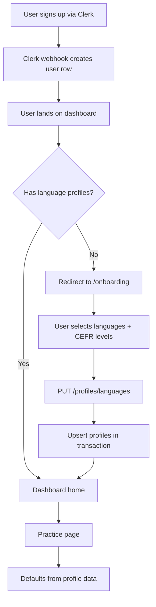
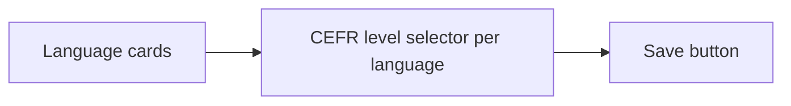

# Profile Onboarding — Design

## Architecture Overview

The feature spans four layers: database schema change, API endpoints, shared hooks/types, and frontend pages. The design reuses existing patterns throughout.



## Data Layer

### Schema Change

Add a unique constraint to `userLanguageProfiles` to prevent duplicate (userId, language) entries. No new tables needed — the existing schema has the right fields.

**File:** `packages/db/src/schema/users.ts`

```typescript
import { pgTable, text, timestamp, uuid, unique } from 'drizzle-orm/pg-core';

export const userLanguageProfiles = pgTable('user_language_profiles', {
  id: uuid('id').primaryKey().defaultRandom(),
  userId: text('user_id').references(() => users.id).notNull(),
  language: text('language').notNull(),
  proficiencyLevel: text('proficiency_level').notNull(),
  assessedAt: timestamp('assessed_at'),
}, (table) => [
  unique('uq_user_language').on(table.userId, table.language),
]);
```

**Changes from current schema:**
- `userId` becomes `.notNull()` (was nullable — a bug)
- `proficiencyLevel` becomes `.notNull()` (onboarding always sets this)
- Add unique constraint on `(userId, language)`

**Migration:** One Drizzle migration that adds the `NOT NULL` constraints and the unique index.

### Shared Types

**File:** `packages/shared/src/index.ts` — add:

```typescript
export type LanguageProfile = {
  language: Language;
  proficiencyLevel: CefrLevel;
};
```

This is the minimal type used in API requests/responses. The `id`, `userId`, and `assessedAt` are server-side concerns.

## API Layer

### Route: `infra/lambda/src/routes/profiles.ts`

New Hono route group, following the same pattern as `exercises.ts`.

#### `GET /profiles/languages`

Returns the current user's language profiles.

**Auth:** Required (via `authMiddleware`)

**Response 200:**
```json
{
  "profiles": [
    { "language": "ES", "proficiencyLevel": "B2" },
    { "language": "TR", "proficiencyLevel": "A1" }
  ]
}
```

**Response 200 (no profiles):**
```json
{
  "profiles": []
}
```

**Implementation:**
```typescript
const rows = await db
  .select({ language: userLanguageProfiles.language, proficiencyLevel: userLanguageProfiles.proficiencyLevel })
  .from(userLanguageProfiles)
  .where(eq(userLanguageProfiles.userId, userId))
  .orderBy(userLanguageProfiles.language);

return c.json({ profiles: rows });
```

#### `PUT /profiles/languages`

Replaces the user's entire set of language profiles atomically.

**Auth:** Required

**Request body:**
```json
{
  "profiles": [
    { "language": "ES", "proficiencyLevel": "B2" },
    { "language": "TR", "proficiencyLevel": "A1" }
  ]
}
```

**Validation schema:**
```typescript
const LanguageProfileSchema = z.object({
  language: z.nativeEnum(Language),
  proficiencyLevel: z.nativeEnum(CefrLevel),
});

const UpdateProfilesSchema = z.object({
  profiles: z.array(LanguageProfileSchema).min(1).max(4),
}).refine(
  (data) => new Set(data.profiles.map(p => p.language)).size === data.profiles.length,
  { message: 'Duplicate languages are not allowed' }
);
```

**Response 200:**
```json
{
  "profiles": [
    { "language": "ES", "proficiencyLevel": "B2" },
    { "language": "TR", "proficiencyLevel": "A1" }
  ]
}
```

**Response 400:**
```json
{
  "error": "Invalid request body",
  "code": "VALIDATION_ERROR",
  "details": { ... }
}
```

**Implementation — atomic replace in a transaction:**
```typescript
await db.transaction(async (tx) => {
  await tx.delete(userLanguageProfiles)
    .where(eq(userLanguageProfiles.userId, userId));

  await tx.insert(userLanguageProfiles)
    .values(profiles.map(p => ({
      userId,
      language: p.language,
      proficiencyLevel: p.proficiencyLevel,
      assessedAt: new Date(),
    })));
});
```

Delete-then-insert inside a transaction gives atomic replace semantics. Exercise history (in `userExerciseHistory`) references `exerciseId`, not profiles — so removing a language profile does not cascade-delete history (FR-5.2).

### Route Registration

**File:** `infra/lambda/src/index.ts` — add:
```typescript
import profiles from './routes/profiles';
app.route('/', profiles);
```

## Client Layer

### Zod Schemas

**File:** `packages/api-client/src/schemas/profile.ts`

```typescript
import { z } from 'zod';

export const LanguageProfileSchema = z.object({
  language: z.string(),
  proficiencyLevel: z.string(),
});

export const LanguageProfilesResponseSchema = z.object({
  profiles: z.array(LanguageProfileSchema),
});

export type LanguageProfileResponse = z.infer<typeof LanguageProfileSchema>;
export type LanguageProfilesResponse = z.infer<typeof LanguageProfilesResponseSchema>;
```

### React Query Hooks

**File:** `packages/api-client/src/hooks/useLanguageProfiles.ts`

```typescript
// useLanguageProfiles — GET /profiles/languages
export function useLanguageProfiles({ fetchFn, enabled = true }: UseLanguageProfilesParams) {
  return useQuery<LanguageProfilesResponse, Error>({
    queryKey: ['languageProfiles'],
    queryFn: async () => {
      const response = await fetchFn('/profiles/languages');
      const json: unknown = await response.json();
      return LanguageProfilesResponseSchema.parse(json);
    },
    enabled,
    staleTime: 5 * 60 * 1000, // profiles rarely change — 5min stale time
  });
}

// useSaveLanguageProfiles — PUT /profiles/languages
export function useSaveLanguageProfiles({ fetchFn }: UseSaveLanguageProfilesParams) {
  const queryClient = useQueryClient();

  return useMutation<LanguageProfilesResponse, Error, LanguageProfile[]>({
    mutationFn: async (profiles) => {
      const response = await fetchFn('/profiles/languages', {
        method: 'PUT',
        body: JSON.stringify({ profiles }),
      });
      const json: unknown = await response.json();
      return LanguageProfilesResponseSchema.parse(json);
    },
    onSuccess: (data) => {
      queryClient.setQueryData(['languageProfiles'], data);
    },
  });
}
```

### Exports

**File:** `packages/api-client/src/index.ts` — add exports for new schemas, types, and hooks.

## Frontend Layer

### Onboarding Gate

**Strategy:** Dashboard layout component fetches `GET /profiles/languages`. If `profiles` is empty, redirect to `/onboarding`. This runs on every dashboard page load but the query is cached (5min stale time), so it's a single request per session.

**File:** `apps/web/app/(dashboard)/layout.tsx` (new file)

```typescript
// Client component that wraps all (dashboard) routes
// 1. Fetch language profiles via useLanguageProfiles
// 2. While loading → show loading skeleton
// 3. If profiles.length === 0 → router.push('/onboarding')
// 4. Otherwise → render children
```

This handles FR-3.1 (new users) and FR-5.3 (existing users with no profiles) in one place.

### Onboarding Page

**File:** `apps/web/app/onboarding/page.tsx`

Single-page form (no multi-step wizard — the data is simple enough).



**UI Structure:**

1. **Header:** "Set up your languages" (new user) or "Edit your languages" (returning user)
2. **Language cards:** Grid of 4 language cards (EN, ES, DE, TR). Each shows:
   - Language name + flag emoji
   - Toggle: selected/unselected (visual toggle, not checkbox)
   - When selected: CEFR level dropdown appears below
3. **CEFR helper:** Expandable section with plain-language level descriptions:
   - A1: "I know basic words and phrases"
   - A2: "I can handle simple conversations"
   - B1: "I can discuss familiar topics"
   - B2: "I can speak fluently on most topics"
   - C1: "I can express myself precisely"
   - C2: "I understand virtually everything"
4. **Save button:** "Start practicing" (new user) or "Save changes" (returning user). Disabled until at least one language is selected.
5. **Error state:** Inline error banner above save button on failure, selections preserved.

**State management:** Local `useState` for selections. On mount, if `useLanguageProfiles` returns existing profiles, pre-populate the state (edit mode).

**On save:**
1. Call `useSaveLanguageProfiles` mutation
2. On success: `router.push('/')` (redirects to dashboard)
3. On error: show inline error, preserve selections (FR-5.1)

### Practice Page Changes

**File:** `apps/web/app/(dashboard)/practice/page.tsx`

Modify the existing practice page to use profile data:

1. Fetch `useLanguageProfiles` on mount
2. Set initial `language` state to `profiles[0].language` (instead of hardcoded `Language.EN`)
3. Set initial `difficulty` state to matching profile's `proficiencyLevel` (instead of hardcoded `CefrLevel.B1`)
4. Language `<select>` options: map from user's profiles + an "Add language" option at the bottom
5. When language changes: update difficulty to match that language's profile level
6. When "Add language" is selected: `router.push('/onboarding')`

### Route Configuration

The `/onboarding` page is **outside** the `(dashboard)` route group, so the dashboard layout's onboarding gate doesn't create a redirect loop. It is still an authenticated route (Clerk middleware protects all non-public routes).

**Route structure after changes:**
```
apps/web/app/
├── layout.tsx                    (root: ClerkProvider + Providers)
├── sign-in/[[...sign-in]]/       (public)
├── onboarding/page.tsx            (auth-required, no dashboard layout)
└── (dashboard)/
    ├── layout.tsx                 (NEW: onboarding gate check)
    ├── page.tsx                   (home)
    └── practice/page.tsx          (modified: profile defaults)
```

## CEFR Level Descriptions

Stored as a constant in `packages/shared/src/index.ts`:

```typescript
export const CEFR_DESCRIPTIONS: Record<CefrLevel, string> = {
  [CefrLevel.A1]: 'I know basic words and phrases',
  [CefrLevel.A2]: 'I can handle simple conversations',
  [CefrLevel.B1]: 'I can discuss familiar topics',
  [CefrLevel.B2]: 'I can speak fluently on most topics',
  [CefrLevel.C1]: 'I can express myself precisely',
  [CefrLevel.C2]: 'I understand virtually everything',
};
```

## Language Display Names

Also in shared, for consistent labeling across web and future mobile:

```typescript
export const LANGUAGE_NAMES: Record<Language, string> = {
  [Language.EN]: 'English',
  [Language.ES]: 'Spanish',
  [Language.DE]: 'German',
  [Language.TR]: 'Turkish',
};
```

## Local Dev Considerations

The dev server (`infra/lambda/src/dev.ts`) currently auto-upserts `dev_user_001` on startup. After this feature, that user will have no language profiles, triggering the onboarding redirect on every local session.

**Solution:** Add profile seeding to the dev server startup — insert default profiles (e.g., EN/B1, ES/A2) for the dev user if none exist. This keeps the local dev experience smooth while testing the onboarding flow remains possible by clearing profiles manually.

## Note on Content-Type Header

The `createAuthenticatedFetch` wrapper already sets `Content-Type: application/json` by default (see `fetchClient.ts:18-21`). No additional header configuration is needed in the mutation hooks.

## Error Handling

| Scenario | Behavior |
|----------|----------|
| Profile save fails (network/500) | Inline error banner, selections preserved, retry enabled |
| Profile fetch fails on dashboard layout | Show generic error with retry button (don't redirect to onboarding) |
| Profile fetch fails on practice page | Fall back to hardcoded EN/B1 defaults (current behavior) |
| Invalid PUT body (400) | Show validation error from API response |

## Testing Strategy

### API Tests (Vitest)
- `GET /profiles/languages` returns empty array for new user
- `GET /profiles/languages` returns saved profiles
- `PUT /profiles/languages` creates profiles for new user
- `PUT /profiles/languages` replaces existing profiles atomically
- `PUT /profiles/languages` rejects empty profiles array
- `PUT /profiles/languages` rejects duplicate languages
- `PUT /profiles/languages` rejects invalid language/level values
- `PUT /profiles/languages` requires authentication

### Hook Tests (Vitest)
- `useLanguageProfiles` fetches and parses response
- `useSaveLanguageProfiles` sends PUT and invalidates cache
- Error states propagate correctly

### Integration Tests (Browser)
- New user flow: signup → redirect to onboarding → select languages → save → dashboard
- Edit flow: navigate to /onboarding → existing selections pre-populated → modify → save
- Practice page: defaults match profile, language selector shows profile languages only

## Files Changed / Created

| File | Action | Purpose |
|------|--------|---------|
| `packages/db/src/schema/users.ts` | Modify | Add unique constraint, NOT NULL |
| `packages/db/migrations/XXXX_*.sql` | Create | Migration for schema changes |
| `packages/shared/src/index.ts` | Modify | Add LanguageProfile type, CEFR_DESCRIPTIONS, LANGUAGE_NAMES |
| `infra/lambda/src/routes/profiles.ts` | Create | GET/PUT /profiles/languages |
| `infra/lambda/src/index.ts` | Modify | Register profiles route |
| `packages/api-client/src/schemas/profile.ts` | Create | Zod schemas for profile responses |
| `packages/api-client/src/hooks/useLanguageProfiles.ts` | Create | React Query hooks |
| `packages/api-client/src/index.ts` | Modify | Export new hooks/schemas |
| `apps/web/app/onboarding/page.tsx` | Create | Onboarding page |
| `apps/web/app/(dashboard)/layout.tsx` | Create | Dashboard layout with onboarding gate |
| `apps/web/app/(dashboard)/practice/page.tsx` | Modify | Profile-aware defaults |
| `infra/lambda/src/routes/profiles.test.ts` | Create | API route tests |
| `packages/api-client/src/hooks/useLanguageProfiles.test.ts` | Create | Hook tests |
