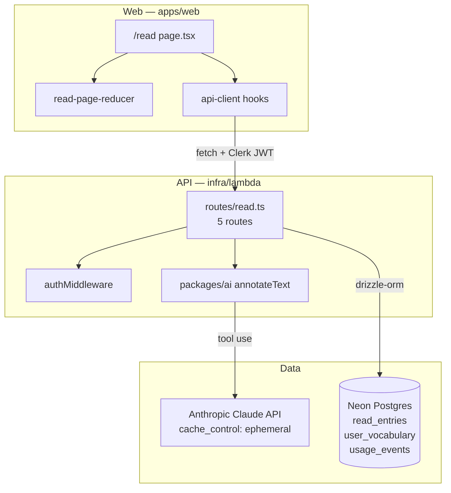
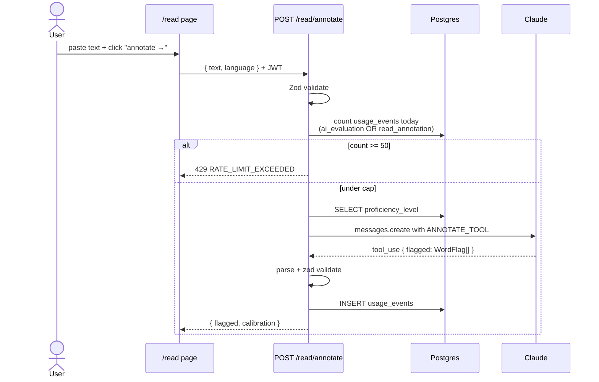
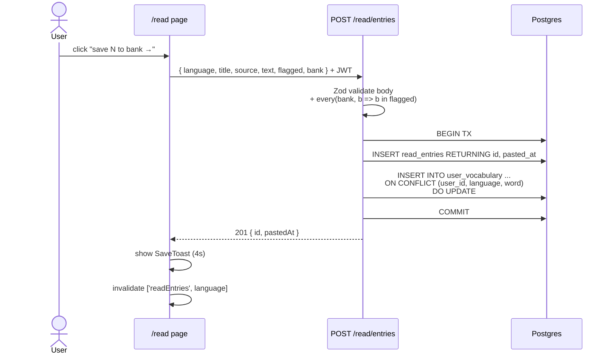
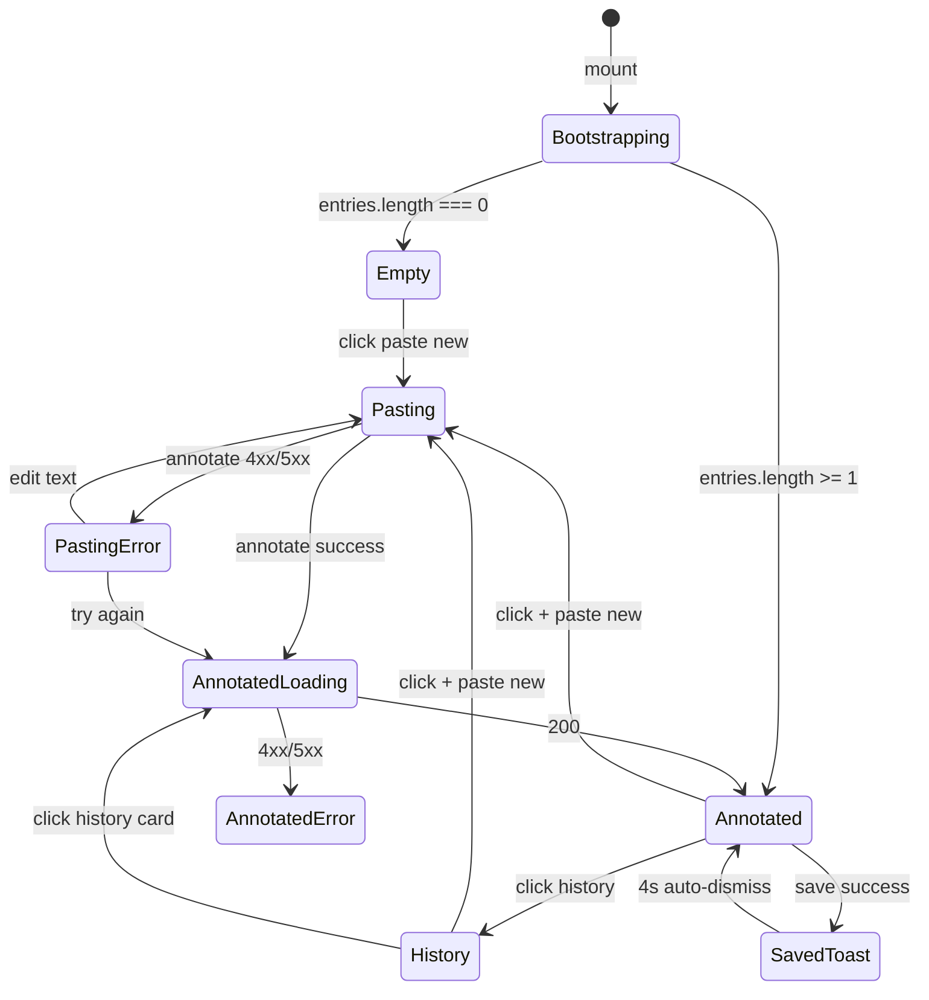

# Design Document

## Overview

Read & Collect is a self-contained vertical slice that touches every layer of the monorepo: a Postgres migration, two new tables in the Drizzle schema, a new Claude prompt and tool, a new Hono router with five routes, four new TanStack-Query hooks, and a new Next.js page that replaces the placeholder at `apps/web/app/(dashboard)/read/page.tsx`. The architecture mirrors the debrief / dashboard slices already in the repo so an engineer who has worked on Phase D / G / I can land changes here without learning new patterns.

The page itself is a single client component with a small reducer-driven state machine over four views (`empty` / `pasting` / `annotated` / `history`). Server-side, the read-routes file owns its own SQL, its own Zod validation, and its own usage-event accounting; it shares the Claude client and the rate-limit table with the existing exercises route. Persistence is split into two tables: `read_entries` (one row per pasted passage, with `flagged_words` and `bank` denormalized in JSONB for read efficiency) and `user_vocabulary` (one row per `(user, language, word)`, populated from saved bank words and ready for the future drill-weaving phase).

## Steering Document Alignment

### Technical Standards (tech.md)

- **Lambda + Hono** (§2.4): The new endpoints are added to a new `infra/lambda/src/routes/read.ts` router and mounted via `app.route('/', read)` in `index.ts`. They reuse the existing `authMiddleware`, `db` instance, and CORS config — no new infrastructure.
- **Drizzle + Neon** (§2.5): New tables are defined as Drizzle `pgTable`s in `packages/db/src/schema/read.ts` and re-exported from `index.ts`. The migration is generated via `drizzle-kit generate` (the same flow Phase E used for `0003_*.sql`); v1 is forward-only.
- **Claude prompt caching** (§7): The annotation system prompt is registered with `cache_control: { type: 'ephemeral' }`, mirroring the pattern in `packages/ai/src/evaluate.ts`. This caps the per-call cost at ~10% of the prompt token rate after the first warm call.
- **Zod validation everywhere** (§2.4): Request bodies are validated server-side with `safeParse`; responses are validated client-side with `parse` in the api-client hooks. The `WordFlag` schema and `READ_TEXT_MAX_CHARS` constant are exported from `packages/shared/src/read.ts` so client and server share one source of truth.
- **Per-route rate limiting via `usage_events`** (§9): Annotation calls insert one `usage_events` row each; the daily cap is enforced by a Drizzle `count()` query against `eventType IN ('ai_evaluation', 'read_annotation')` filtered by `gte(usageEvents.createdAt, oneDayAgo)` — a rolling 24-hour window, identical to the formula in `routes/exercises.ts:170,178`. Note: `usage_events.createdAt` is `timestamp(...)` without `withTimezone` (per `packages/db/src/schema/access.ts:28`); the comparison still works because both `Date.now() - 24h` and `now()` are wall-clock timestamps from the same database. The new tables in this spec use `withTimezone: true` (modern default) but do not require the existing `usage_events` schema to change.

- **Database driver supports transactions.** `infra/lambda/src/db.ts → packages/db/src/client.ts` instantiates Drizzle from `drizzle-orm/neon-serverless` over a WebSocket `Pool` from `@neondatabase/serverless` — the comment in `client.ts` notes "Pool opens a fresh WebSocket per query and supports transactions." All multi-statement writes in this design use `await db.transaction(async (tx) => { … })`.
- **No new npm dependencies**: Every dependency required by this design (Hono, Drizzle, `drizzle-orm`, `drizzle-kit`, Zod, Anthropic SDK, TanStack Query, Clerk, Next.js, Tailwind v4) is already in the lockfile.

### Project Structure (structure.md)

Phase J adds files in the same locations as Phase D (dashboard) and Phase G (debrief):

```
packages/
  shared/src/read.ts                             ← new constants + types
  db/src/schema/read.ts                          ← new tables
  db/src/schema/index.ts                         ← add re-exports
  db/migrations/0004_<adj>_<noun>.sql            ← new migration
  ai/src/annotate.ts                             ← new prompt + tool + caller
  ai/src/index.ts                                ← add exports
  api-client/src/schemas/read.ts                 ← new request/response schemas
  api-client/src/hooks/useReadAnnotate.ts        ← annotation mutation
  api-client/src/hooks/useReadEntries.ts         ← list + single-entry queries
  api-client/src/hooks/useReadEntryMutations.ts  ← save / update-bank mutations
  api-client/src/index.ts                        ← add exports

infra/lambda/src/
  routes/read.ts                                 ← new router (5 routes)
  routes/read.test.ts                            ← Vitest co-located
  index.ts                                       ← mount route

apps/web/app/(dashboard)/read/
  page.tsx                                       ← rewrite (was placeholder)
  _state/
    read-page-reducer.ts
    read-page-reducer.test.ts
  _components/
    read-top-bar.tsx
    empty-view.tsx
    paste-view.tsx
    annotated-view.tsx
    annotated-skeleton.tsx
    annotated-error.tsx
    history-view.tsx
    history-empty-state.tsx
    word-bank-rail.tsx
    word-popover.tsx
    intensity-toggle.tsx
    calibration-strip.tsx
    save-toast.tsx
    inline-error-toast.tsx
    annotated-text.tsx
    __tests__/...
  _lib/
    tokenize.ts
    tokenize.test.ts
    calibration-copy.ts
    calibration-copy.test.ts
```

The reducer module pattern matches `apps/web/app/(dashboard)/drill/_components/session-reducer.ts`. The `_lib/` and `_components/` folders match `apps/web/app/(dashboard)/_lib/` (dashboard) and `apps/web/app/(dashboard)/drill/debrief/_components/`. The page itself is a single client component because the reader requires interactive state (popover position, intensity toggle, local bank); SSR is unnecessary and would complicate the cookie-driven active-language story.

## Code Reuse Analysis

### Existing Components to Leverage

- **`Card`, `Button`, `Chip`, `Input`, `Textarea`** (`apps/web/components/ui/`): the entire screen is built from these — no new generic primitives. `Button` already supports `loading`, `href`, all four variants (`default | primary | ghost | accent`), and three sizes — covers every CTA in the prototype.
- **`useActiveLanguage`** (`apps/web/components/shell/active-language-provider.tsx`): the reader scopes every query to `activeLanguage`. No new context.
- **`createAuthenticatedFetch` + `useAuth().getToken({ template: 'api' })`** (`packages/api-client/src/fetchClient.ts`): every read mutation/query uses this exactly like the dashboard does. No new fetch wrapper.
- **`db` Drizzle client + `authMiddleware`** (`infra/lambda/src/db.ts`, `middleware/auth.ts`): mounted on the new `read` Hono sub-app the same way `sessions.ts` does it (`read.use('/read/*', authMiddleware)`).
- **`createClaudeClient(ANTHROPIC_API_KEY)`** (`packages/ai/src/index.ts`): the same Anthropic client factory used by `evaluateAnswer`. The annotation function reuses it instead of instantiating a parallel one.
- **`usage_events` table** (`packages/db/src/schema/access.ts`): annotation rate limiting reuses this. No new metering table.
- **`practice_sessions` JSONB pattern** (`packages/db/src/schema/sessions.ts`): `read_entries.flagged_words` and `read_entries.bank` use the same `jsonb('...').$type<…>()` pattern that `practice_sessions.exerciseIds` uses.
- **404-not-403 anti-leak pattern** (`infra/lambda/src/routes/sessions.ts:GET /sessions/:id/debrief`): every ownership check returns `{ error, code: 'ENTRY_NOT_FOUND' }` 404 — never 403 — to avoid leaking entry existence.
- **`ReadCollectCard` dashboard entry** (`apps/web/app/(dashboard)/_components/read-collect-card.tsx`): unchanged. Its `href="/read"` already points at this page.

### Integration Points

- **App shell nav** (`apps/web/components/shell/nav-items.tsx`): the "read" item is already defined and routes to `/read` (Phase B). No nav change needed; this spec replaces the page content the nav already routes to.
- **Lambda router** (`infra/lambda/src/index.ts`): one new line — `app.route('/', read)` — added next to the existing `app.route('/', sessions)` etc.
- **Drill page** (`apps/web/app/(dashboard)/drill/page.tsx`): unchanged. The save toast's "see next session" button calls `router.push('/drill')` and the drill page's existing auto-create effect handles the rest.
- **Today plan** (`infra/lambda/src/routes/sessions.ts`, `lib/today-plan.ts`): unchanged. Drill weaving from `user_vocabulary` is explicitly deferred (Requirement 13).
- **Onboarding** (`apps/web/app/onboarding/`): unchanged. New users reach `/read` through the same auth gate that already protects `/drill`.

## Architecture

The system is split into three planes that flow strictly one way (client → API → Claude / DB):



The reader page does not call Claude directly; it always goes through the Lambda. The Lambda is the only writer of `read_entries` and `user_vocabulary`. Claude is invoked from one place (the `annotateText` function in `packages/ai`), and the prompt is reusable.

### Annotation request flow



### Save flow (first persistence)



### Page-level state machine



The state machine is implemented with a `useReducer`-style discriminated union (see `read-page-reducer.ts` below).

## Components and Interfaces

### Shared constants and types — `packages/shared/src/read.ts`

- **Purpose:** Single source of truth for the constants the requirements name (`READ_TEXT_MAX_CHARS`, `READ_CEFR_TOP_RANK`) plus shared Zod schemas / TypeScript types for `WordFlag`, `ReadEntrySummary`, `ReadEntryFull`, `AnnotateResponse`, `SaveReadEntryRequest`, `UpdateBankRequest`. Re-exported from `packages/shared/src/index.ts`.
- **Interfaces:**
  ```ts
  export const READ_TEXT_MAX_CHARS = 2000;
  export const READ_TITLE_MAX_CHARS = 120;
  export const READ_SOURCE_MAX_CHARS = 200;
  export const READ_PREVIEW_CHARS = 120;
  export const READ_HISTORY_LIMIT = 50;

  export const READ_CEFR_TOP_RANK = {
    A1: 750, A2: 1500, B1: 3000, B2: 5000, C1: 8000, C2: 12000,
  } as const satisfies Record<CefrLevel, number>;

  export const WordFlagSchema = z.object({
    lemma:   z.string().min(1),
    pos:     z.string().min(1),
    gloss:   z.string().min(1),
    example: z.string().min(1),
    freq:    z.number().int().nonnegative(),
    cefr:    z.nativeEnum(CefrLevel),
  });
  export type WordFlag   = z.infer<typeof WordFlagSchema>;
  export const FlaggedMapSchema = z.record(z.string().min(1), WordFlagSchema);
  export type FlaggedMap = z.infer<typeof FlaggedMapSchema>;
  ```
- **Dependencies:** `zod`, `CefrLevel` from the existing shared module.
- **Reuses:** `CefrLevel` enum.

### Drizzle schema — `packages/db/src/schema/read.ts`

- **Purpose:** Define `read_entries` and `user_vocabulary` tables and their indexes.
- **Interfaces:**
  ```ts
  export const readEntries = pgTable('read_entries', {
    id:           uuid('id').primaryKey().defaultRandom(),
    userId:       text('user_id').references(() => users.id).notNull(),
    language:     text('language').$type<LearningLanguage>().notNull(),
    title:        text('title').notNull().default(''),
    source:       text('source').notNull().default(''),
    text:         text('text').notNull(),
    flaggedWords: jsonb('flagged_words').$type<Record<string, WordFlag>>().notNull(),
    bank:         jsonb('bank').$type<string[]>().notNull().default([]),
    pastedAt:     timestamp('pasted_at', { withTimezone: true }).notNull().defaultNow(),
  }, (t) => ({
    // Drizzle index DSL: pass `desc(...)` from drizzle-orm as a column expression
    // inside `.on(...)` so the resulting CREATE INDEX has `pasted_at DESC`.
    userLangPastedAtIdx: index('read_entries_user_lang_pasted_at_idx')
      .on(t.userId, t.language, desc(t.pastedAt)),
  }));

  export const userVocabulary = pgTable('user_vocabulary', {
    id:                uuid('id').primaryKey().defaultRandom(),
    userId:            text('user_id').references(() => users.id, { onDelete: 'cascade' }).notNull(),
    language:          text('language').$type<LearningLanguage>().notNull(),
    word:              text('word').notNull(),
    lemma:             text('lemma').notNull(),
    source:            text('source').notNull(),                          // 'reading' | 'exercise'
    sourceReadEntryId: uuid('source_read_entry_id')
      .references(() => readEntries.id, { onDelete: 'set null' }),
    pos:               text('pos').notNull(),
    gloss:             text('gloss').notNull(),
    exampleSentence:   text('example_sentence').notNull(),
    frequencyRank:     integer('frequency_rank'),
    cefrBand:          text('cefr_band').$type<CefrLevel>(),
    addedAt:           timestamp('added_at', { withTimezone: true }).notNull().defaultNow(),
  }, (t) => ({
    userLangWordUq: unique('user_vocabulary_user_lang_word_uq').on(t.userId, t.language, t.word),
    userLangIdx:    index('user_vocabulary_user_lang_idx').on(t.userId, t.language),
  }));
  ```
- **Dependencies:** `drizzle-orm/pg-core`, `desc` from `drizzle-orm`, `users` table.
- **Reuses:** the `practice_sessions` JSONB-typed pattern, the `users.id` text foreign key.

### Migration — `packages/db/migrations/0004_*.sql`

- **Purpose:** Apply the schema diff to the production / dev / Neon-PR database.
- **How it's generated:** Run `pnpm --filter @language-drill/db drizzle-kit generate`. The tool diffs the schema modules and writes a new SQL file plus a journal entry under `migrations/meta/`. Drizzle picks the migration number automatically (next is `0004_`); the random adjective+noun suffix is generated by drizzle-kit and is not chosen by hand.
- **Hand-verification checklist before commit:**
  1. The file contains exactly two `CREATE TABLE` statements (`read_entries`, `user_vocabulary`).
  2. The unique constraint on `(user_id, language, word)` is present.
  3. The descending index on `(user_id, language, pasted_at DESC)` is present.
  4. Both foreign keys to `users(id)` exist; only `user_vocabulary.user_id` is `ON DELETE CASCADE`.
  5. `user_vocabulary.source_read_entry_id` is `ON DELETE SET NULL`.
  6. No DDL touches existing tables.

### Claude prompt + tool — `packages/ai/src/annotate.ts`

- **Purpose:** Define the system prompt, tool schema, response parser, and `annotateText()` caller used by the Lambda annotation route. Mirrors the structure of `evaluate.ts`.
- **Interfaces:**
  ```ts
  export const ANNOTATE_TOOL_NAME = 'submit_annotated_words';
  export const ANNOTATE_TOOL: Anthropic.Tool;
  export const ANNOTATE_SYSTEM_PROMPT: string;      // includes per-language guidance for ES / DE / TR
  export type AnnotateInput = {
    text: string;
    language: 'ES' | 'DE' | 'TR';
    proficiencyLevel: CefrLevel;
    topRank: number;                                // from READ_CEFR_TOP_RANK
  };
  export type AnnotateOutput = { flagged: Record<string, WordFlag> };
  export async function annotateText(client: Anthropic, input: AnnotateInput): Promise<AnnotateOutput>;
  ```
- **Tool schema** (Anthropic-style):
  ```ts
  {
    name: 'submit_annotated_words',
    input_schema: {
      type: 'object',
      properties: {
        flagged: {
          type: 'array',
          items: {
            type: 'object',
            properties: {
              matchedForm: { type: 'string', description: 'lowercased exact surface form found in text' },
              lemma:       { type: 'string' },
              pos:         { type: 'string' },
              gloss:       { type: 'string' },
              example:     { type: 'string' },
              freq:        { type: 'integer' },
              cefr:        { type: 'string', enum: ['A1','A2','B1','B2','C1','C2'] },
            },
            required: ['matchedForm','lemma','pos','gloss','example','freq','cefr'],
          },
        },
      },
      required: ['flagged'],
    },
  }
  ```
- **System prompt** (cached): describes the rule "flag every word whose form OR lemma is rarer than `top_rank`, AND/OR whose CEFR band is strictly above the user's proficiency level"; bans common closed-class words (articles, copulas, conjunctions); explains the `matchedForm` requirement (must be the exact lowercased form as it appears in the text, not the lemma); includes a few-shot block per language showing the expected JSON shape. Same `cache_control: { type: 'ephemeral' }` annotation as `EVALUATION_SYSTEM_PROMPT`.
- **`annotateText()`** calls `client.messages.create` with `tool_choice: { type: 'tool', name: 'submit_annotated_words' }` and `temperature: 0`. After the call, the tool-use block input is parsed by `parseAnnotateResult()`:
  1. For each `item` in the tool-output `flagged` array, **destructure `matchedForm` out** and validate the remaining fields with `WordFlagSchema.parse(rest)` (so `WordFlagSchema` does not need a `matchedForm` field — that field is the map key, not a flag property).
  2. The `matchedForm` itself is validated separately with `z.string().min(1).max(120)`.
  3. The result is shaped into `Record<matchedForm, WordFlag>`. Duplicate matched forms keep the first-seen (subsequent occurrences are dropped silently).
  4. Any per-item parse failure throws — the route handler catches and returns 502 `AI_UNAVAILABLE` (Requirement 5.7).
- **Dependencies:** `@anthropic-ai/sdk`, `@language-drill/shared` (`WordFlagSchema`, `READ_CEFR_TOP_RANK`).
- **Reuses:** the prompt-caching, tool-use, and parser conventions from `evaluate.ts`.

### Lambda router — `infra/lambda/src/routes/read.ts`

- **Purpose:** Five Hono routes implementing every endpoint named in the requirements. All routes are auth-gated.
- **Skeleton:**
  ```ts
  const read = new Hono<{ Bindings: Bindings; Variables: Variables }>();
  read.use('/read/*', authMiddleware);

  read.post('/read/annotate', async (c) => { /* … */ });
  read.post('/read/entries',  async (c) => { /* … */ });
  read.get ('/read/entries',  async (c) => { /* … */ });
  read.get ('/read/entries/:id', async (c) => { /* … */ });
  read.put ('/read/entries/:id/bank', async (c) => { /* … */ });
  ```
- **`POST /read/annotate`** (Requirement 5):
  1. Zod-parse body `{ text, language }`. 400 on validation error or `EN`.
  2. Compute `oneDayAgo = new Date(Date.now() - 24 * 60 * 60 * 1000)` (matches `routes/exercises.ts:170`). Run in parallel via `Promise.all`:
     - `count()` of `usage_events` rows for the user where `eventType IN ('ai_evaluation', 'read_annotation') AND createdAt >= oneDayAgo`. 429 `RATE_LIMIT_EXCEEDED` if `>= DAILY_EVAL_LIMIT` (constant imported from `routes/exercises.ts`, currently 50).
     - `userLanguageProfiles` lookup for `(userId, language)`; missing row → fallback `CefrLevel.B1` (matches the `DEFAULT_PROFICIENCY_LEVEL` import in `routes/sessions.ts`).
  3. Call `annotateText()` with `topRank = READ_CEFR_TOP_RANK[proficiencyLevel]`. On any throw → 502 `AI_UNAVAILABLE` (and **no** usage row written).
  4. INSERT one `usage_events` row: `{ userId, eventType: 'read_annotation', metadata: { language, textLength: body.text.length, flaggedCount: Object.keys(flagged).length } }`. The metadata shape mirrors the existing `routes/exercises.ts` pattern (`{ exerciseId, language, difficulty }`) so future debugging tools handle both event types uniformly.
  5. Respond `{ flagged, calibration: { cefr: proficiencyLevel, top: topRank } }`.
- **`POST /read/entries`** (Requirement 8):
  1. Zod-parse `{ language, title, source, text, flagged, bank }`. 400 on validation error. Schema requires `bank.length >= 1` (an empty-bank save is rejected — Requirement 8.1 explicitly gates the save action on `bank.length >= 1`, and persisting a passage with no saved words has no v1 use case).
  2. Re-validate `text.length <= READ_TEXT_MAX_CHARS` and `every(bank, b => b in flagged)`. 400 `VALIDATION_ERROR` on either.
  3. `await db.transaction(async (tx) => { … })`:
     - INSERT `read_entries` RETURNING `id, pasted_at`.
     - For each `b` in `bank`, build a row from `flagged[b]`. Run **one** `tx.insert(userVocabulary).values(rows).onConflictDoUpdate({ target: [userVocabulary.userId, userVocabulary.language, userVocabulary.word], set: { lemma, source, sourceReadEntryId, pos, gloss, exampleSentence, frequencyRank, cefrBand, addedAt: sql\`now()\` } })` for the whole batch — single round-trip.
  4. Commit. 201 `{ id, pastedAt }`. Any error inside the callback rolls back both the entry insert and the vocab upserts.
- **`GET /read/entries`** (Requirement 10.1):
  1. Zod-parse `language` from query.
  2. Single SELECT projecting summary columns plus three Postgres expressions (Drizzle `sql\`...\`` templates, since Drizzle ships no helper for either):
     - `preview`: ``sql<string>`substring(${readEntries.text} from 1 for ${READ_PREVIEW_CHARS})` ``
     - `savedCount`: ``sql<number>`jsonb_array_length(${readEntries.bank})` ``
     - `flaggedCount`: ``sql<number>`(select count(*)::int from jsonb_each(${readEntries.flaggedWords}))` `` — `jsonb_each` is set-returning over `(key, value)` pairs and counts the same keys `jsonb_object_keys` would, with cleaner Drizzle interop.
  3. Order `pasted_at DESC, id DESC`. `LIMIT READ_HISTORY_LIMIT`.
  4. 200 `{ entries: ReadEntrySummary[] }`. The cap is hard — there is no pagination cursor in v1; users with > 50 entries see only the most recent 50.
- **`GET /read/entries/:id`** (Requirement 10.2):
  1. SELECT from `read_entries` WHERE `id = :id AND user_id = userId`.
  2. If no row → `c.header('Cache-Control', 'no-store')` and 404 `ENTRY_NOT_FOUND` (anti-leak parity with `routes/sessions.ts:477,503`).
  3. 200 `{ id, language, title, source, text, flaggedWords, bank, pastedAt }`.
- **`PUT /read/entries/:id/bank`** (Requirement 9):
  1. Zod-parse `{ bank: string[] }` (allows `bank.length === 0` — clear-bank flow per Requirement 8.8).
  2. SELECT `flagged_words, bank, language` from `read_entries` WHERE `id AND user_id`. If no row → `c.header('Cache-Control', 'no-store')` + 404 `ENTRY_NOT_FOUND`.
  3. Validate `every(newBank, b => b in flagged_words)`. 400 `UNKNOWN_FLAGGED_WORD` if not.
  4. Compute `addedWords = newBank \ oldBank` (set difference). Removed words SHALL NOT delete `user_vocabulary` rows (Requirement 9.3).
  5. `await db.transaction(async (tx) => { … })`:
     - UPDATE `read_entries SET bank = :newBank WHERE id = :id AND user_id = userId`.
     - If `addedWords.length > 0`, run one bulk `tx.insert(userVocabulary).values(rows).onConflictDoUpdate(...)` for the new entries.
  6. Commit. 200 `{ id, bank: newBank }`.
- **Dependencies:** `Hono`, `zod`, `drizzle-orm` (`eq`, `and`, `desc`, `sql`, `inArray`), `@language-drill/db`, `@language-drill/ai`, `@language-drill/shared`.
- **Reuses:** the `routes/sessions.ts` `LearningLanguageEnum` copy; the `routes/exercises.ts` rate-limit pattern; the `routes/sessions.ts` 404 anti-leak pattern; the `db` instance and `authMiddleware`.

### Shared schemas — `packages/api-client/src/schemas/read.ts`

- **Purpose:** Zod schemas for every request/response body, exported alongside their inferred TypeScript types. Used by hooks for response validation and by callers for request typing.
- **Interfaces:**
  ```ts
  export const AnnotateRequestSchema = z.object({
    text:     z.string().min(1).max(READ_TEXT_MAX_CHARS),
    language: LearningLanguageEnum,
  });
  export const AnnotateResponseSchema = z.object({
    flagged:     FlaggedMapSchema,
    calibration: z.object({
      cefr: z.nativeEnum(CefrLevel),
      top:  z.number().int().nonnegative(),
    }),
  });

  export const SaveReadEntryRequestSchema = z.object({
    language: LearningLanguageEnum,
    title:    z.string().max(READ_TITLE_MAX_CHARS),
    source:   z.string().max(READ_SOURCE_MAX_CHARS),
    text:     z.string().min(1).max(READ_TEXT_MAX_CHARS),
    flagged:  FlaggedMapSchema,
    bank:     z.array(z.string().min(1)),
  });
  export const SaveReadEntryResponseSchema = z.object({
    id:       z.string().uuid(),
    pastedAt: z.string().datetime(),
  });

  export const UpdateBankRequestSchema  = z.object({ bank: z.array(z.string().min(1)) });
  export const UpdateBankResponseSchema = z.object({ id: z.string().uuid(), bank: z.array(z.string()) });

  export const ReadEntrySummarySchema = z.object({
    id:           z.string().uuid(),
    title:        z.string(),
    source:       z.string(),
    preview:      z.string(),
    flaggedCount: z.number().int().nonnegative(),
    savedCount:   z.number().int().nonnegative(),
    pastedAt:     z.string().datetime(),
  });
  export const ReadEntriesResponseSchema = z.object({ entries: z.array(ReadEntrySummarySchema) });

  export const ReadEntryResponseSchema = z.object({
    id:           z.string().uuid(),
    language:     LearningLanguageEnum,
    title:        z.string(),
    source:       z.string(),
    text:         z.string(),
    flaggedWords: FlaggedMapSchema,
    bank:         z.array(z.string()),
    pastedAt:     z.string().datetime(),
  });
  ```
- **Dependencies:** `zod`, `@language-drill/shared`.
- **Reuses:** `LearningLanguageEnum` from `schemas/preferences.ts`, `FlaggedMapSchema` and constants from `@language-drill/shared/read`.

### Save-toast copy — aspirational claim is acknowledged

The save-toast secondary line reads "your next session will weave them in." Per Requirement 13, drill weaving is explicitly deferred — v1 persists saved words in `user_vocabulary` but no drill code yet reads them. The copy is preserved verbatim from the prototype because (a) the words *will* land in drills in the next phase, (b) the user's primary motivation for saving is precisely that future weaving, and (c) no existing CLAUDE.md rule bans aspirational copy. If the drill-weaving phase slips beyond 2026 Q3, soften the toast copy to "we'll weave them into upcoming sessions" via a one-line edit; this is tracked as a known-mismatch that is acceptable in v1.

### TanStack-Query hooks

#### `useReadAnnotate` — `packages/api-client/src/hooks/useReadAnnotate.ts`

- **Purpose:** `useMutation` POSTing to `/read/annotate`. Does not invalidate any cache (annotation is read-only with respect to entries).
- **Interfaces:** `useReadAnnotate({ fetchFn })` → `useMutation<AnnotateResponse, Error, AnnotateRequest>`.
- **Reuses:** `AuthenticatedFetch`, the `useExercise.ts` mutation pattern.

#### `useReadEntries` and `useReadEntry` — `packages/api-client/src/hooks/useReadEntries.ts`

- **`useReadEntries`:** `useQuery` GETting `/read/entries?language=…`. `staleTime: 60_000` (matches `useTodayPlan`); `queryKey: ['readEntries', language]`. Always enabled when `language` is set.
  - Used by: top-bar count badge, history view list, "current text" resolver (most-recent entry).
- **`useReadEntry`:** `useQuery` GETting `/read/entries/:id`. `staleTime: Infinity` (entry payload changes only via the bank-update mutation, which writes through this key). `queryKey: ['readEntry', id]`.
- **Reuses:** the `useTodayPlan` and `useSessionDebrief` patterns.

#### `useSaveReadEntry` and `useUpdateReadBank` — `packages/api-client/src/hooks/useReadEntryMutations.ts`

- **Purpose:** mutations for `POST /read/entries` and `PUT /read/entries/:id/bank`. `onSuccess` invalidates `['readEntries', language]` (and for the bank update, also writes through to `['readEntry', id]`).
- **`useUpdateReadBank`** uses `onMutate` + `onError` for optimistic updates: it updates the local `['readEntry', id]` cache immediately and rolls back on error. Matches Requirement 9.6.
- **Reuses:** `useMutation` + the cache-invalidation pattern from `useCompleteSession`.

### Page-level state machine — `apps/web/app/(dashboard)/read/_state/read-page-reducer.ts`

- **Purpose:** Coordinate the four views and the post-save state. The reducer is a pure function exported alongside selectors and dispatched action creators; the page's `useReducer` initializes it from props derived by the entries query.
- **State shape:**
  ```ts
  type View = 'empty' | 'pasting' | 'annotated' | 'history';

  type ReadPageState = {
    view: View;
    paste: { title: string; source: string; text: string };
    activeEntryId: string | null;        // null → most-recent (resolved from query)
    bank: string[];                      // local; diverges from saved entry between save events
    activeWord: { word: string; x: number; y: number } | null;
    intensity: 'subtle' | 'assertive';
    saveToast: { count: number } | null;
    inlineError: { kind: 'save' | 'bank' } | null;
  };

  type Action =
    | { type: 'SET_VIEW'; view: View }
    | { type: 'PASTE_FIELD'; field: 'title' | 'source' | 'text'; value: string }
    | { type: 'PASTE_RESET' }
    | { type: 'OPEN_POPOVER'; word: string; x: number; y: number }
    | { type: 'CLOSE_POPOVER' }
    | { type: 'SET_INTENSITY'; intensity: 'subtle' | 'assertive' }
    | { type: 'TOGGLE_BANK_WORD'; word: string }
    | { type: 'CLEAR_BANK_LOCAL' }
    | { type: 'SET_BANK_FROM_ENTRY'; bank: string[] }    // used for optimistic-update rollback
    | { type: 'SHOW_SAVE_TOAST'; count: number }
    | { type: 'DISMISS_SAVE_TOAST' }
    | { type: 'SHOW_INLINE_ERROR'; kind: 'save' | 'bank' }
    | { type: 'DISMISS_INLINE_ERROR' }
    | { type: 'LOAD_ENTRY'; entryId: string }
    | { type: 'ENTRY_PERSISTED'; entryId: string };       // post-`POST /read/entries` success
  ```
  - `LOAD_ENTRY` clears `activeWord`, `saveToast`, AND `inlineError` (a freshly-loaded entry should land in a clean state).
  - `ENTRY_PERSISTED` runs in `useSaveReadEntry`'s `onSuccess`: it sets `activeEntryId` to the new id (so subsequent bank toggles fire `PUT /read/entries/:id/bank` instead of re-firing `POST /read/entries`) and shows the save toast. The page also calls `queryClient.setQueryData(['readEntry', entryId], ephemeralEntry)` so the read-back is cached without a round-trip.
  - Optimistic-rollback flow for `useUpdateReadBank`: in `onMutate`, snapshot the current `state.bank` and dispatch the optimistic toggle; on `onError`, dispatch `SET_BANK_FROM_ENTRY` with the snapshot AND `SHOW_INLINE_ERROR` with `kind: 'bank'`. The reducer state is the source of truth for what the rail and popover render — the query cache is not consulted for `bank` in the active view.
- **Selectors:** `selectShouldShowEmpty(state, entriesCount)`, `selectShouldShowAnnotatedSkeleton(state, entryQuery)`, `selectActiveEntry(state, entries, mostRecent)` — all unit-testable without rendering React.
- **Reuses:** the discriminated-union reducer pattern from `apps/web/app/(dashboard)/drill/_components/session-reducer.ts`.

### Page component — `apps/web/app/(dashboard)/read/page.tsx`

- **Purpose:** Top-level client component. Composes the reducer, hooks, and view components.
- **Layout (top-to-bottom inside the existing dashboard layout):**
  1. `<ReadTopBar />` — eyebrow + title on the left, three buttons on the right; handles its own click → dispatch.
  2. The active view, decided by selectors:
     - `EmptyView` when `view === 'empty'` (auto-resolved if no entries).
     - `PasteView` when `view === 'pasting'` — receives `paste` state and `onCancel`/`onAnnotate` handlers; its own internal `loading` + `error` states bound to `useReadAnnotate`.
     - `AnnotatedView` when `view === 'annotated'` — wraps the rest of the layout; handles popover positioning by passing the active-word state down.
     - `HistoryView` when `view === 'history'` — uses `useReadEntries` directly; calls `onOpen(entryId)` to switch to annotated.
  3. `<SaveToast />` (fixed bottom-center, conditionally rendered).
  4. `<InlineErrorToast />` (fixed bottom-right, conditionally rendered for bank-update failures).
- **Effects:**
  - On mount and on `activeLanguage` change, the entries query runs automatically (TanStack key change). When it resolves, the page picks the most-recent entry id and dispatches `LOAD_ENTRY` (which kicks off `useReadEntry`).
  - The save-toast auto-dismiss is a `useEffect(() => setTimeout(dispatch DISMISS_SAVE_TOAST, 4000), [saveToast])`.
- **Interfaces:** No props — receives `activeLanguage` from context.
- **Dependencies:** all of the above hooks + reducer + view components, `useActiveLanguage`, `useAuth` from Clerk, `useRouter` from Next.
- **Reuses:** the page-shape pattern from `dashboard/page.tsx` (auth + active-language + multiple parallel queries).

### View components — `apps/web/app/(dashboard)/read/_components/`

#### `read-top-bar.tsx`

- **Purpose:** The header above every view; three view-switcher buttons + count badge + bottom border-rule.
- **Interfaces:** `<ReadTopBar view onChange={(view) => …} historyCount />`.
- **`historyCount` semantics:** equals `entries.length` from `useReadEntries`, capped at `READ_HISTORY_LIMIT` (50) since the server caps the response. A user with 100 saved entries sees "50" — accepted v1 behavior; documented in Requirement 10.6 and the Performance NFR. If/when pagination lands, the badge will switch to a real total via a separate `totalCount` field.
- **Reuses:** `Button` (sm size, primary/default variants).

#### `empty-view.tsx`

- **Purpose:** First-launch hero per Requirement 3.
- **Interfaces:** `<EmptyView onPaste={() => …} cefrToken={CefrLevel | null} />`. The `cefrToken` is the user's proficiency for the active language (`null` if no profile yet) — drives the `~B1+` token in the "how it works" list.
- **Reuses:** `Button` (primary, lg).

#### `paste-view.tsx`

- **Purpose:** Title input + textarea + char counter + cancel/annotate row + tip strip per Requirement 4.
- **Interfaces:** `<PasteView paste onChange onCancel onAnnotate isLoading errorBody />`.
- **State:** controlled by parent; submission is a callback. The `errorBody` is the parsed error from the failed annotation request, used to render the "couldn't annotate this" inline card per Requirement 11.2 / 11.3 / 11.4.
- **Client-side caps:** Title input enforces `READ_TITLE_MAX_CHARS` (120) via `maxLength`. Source input enforces `READ_SOURCE_MAX_CHARS` (200) via `maxLength`. The textarea does NOT use `maxLength` (we want the counter to flip to accent at 2,001 rather than silently clipping the input — matches the prototype).
- **Reuses:** `Input`, `Textarea`, `Button`. `Textarea` already supports the Fraunces+16px+1.6 line-height per the type-scale utilities; passed via `className`.

#### `annotated-view.tsx`

- **Purpose:** The two-column layout: reader pane + sticky word-bank rail. Composes `AnnotatedText`, `WordPopover`, `WordBankRail`, the calibration strip, and the footer summary row.
- **Interfaces:** `<AnnotatedView entry={ReadEntryFull | EphemeralEntry} bank intensity activeWord onIntensityChange onPopoverOpen onPopoverClose onBankToggle onClearBank onSave isSaving />`. An `EphemeralEntry` is the local representation of a freshly-annotated, not-yet-saved entry — same shape as `ReadEntryFull` but with `id: null` and `pastedAt: null`.
- **Reuses:** `Card` (rail), `Chip` (calibration, "from your reading"), `Button` (rail × buttons, footer actions), `intensity-toggle` component below.

#### `annotated-text.tsx`

- **Purpose:** Tokenize the passage into a stable React tree. Uses `tokenize.ts` to split; renders flagged matches as buttons with the `rd-word ${intensity} ${saved?} ${active?}` class set. Click handler reports back the bounding rect so the parent can compute the popover's anchor point.
- **Interfaces:** `<AnnotatedText text flaggedMap intensity bankSet activeWord onWordClick={(word, rect) => …} />`.
- **Reuses:** `_lib/tokenize.ts`. Pure render — no hooks except for the click-coordinate transform.

#### `intensity-toggle.tsx`

- **Purpose:** The 2-option pill toggle ("subtle / assertive"). Implemented as a WAI-ARIA radiogroup per Requirement 14.1.
- **Interfaces:** `<IntensityToggle value onChange />`.

#### `calibration-strip.tsx`

- **Purpose:** The chip + body + ghost "adjust" no-op button. Pure render.
- **Reuses:** `Chip`, `Button` (ghost sm).

#### `word-popover.tsx`

- **Purpose:** Click-anchored popover per Requirement 7.
- **Interfaces:** `<WordPopover entry word x y inBank onSave onSkip />`.
- **Behavior:** clamps `x` to keep the card on screen (matches prototype logic, but reads container width from a ref instead of hard-coding 1200); registers an outside-click handler on the parent `.rd-text` element (handled in `annotated-view`); stops propagation on its own clicks. Keyboard: when opened by `Enter` / `Space` on a `.rd-word`, the popover focuses its first button.
- **Reuses:** `Button`, `Chip`.

#### `word-bank-rail.tsx`

- **Purpose:** Sticky right column listing the local bank words per Requirement 6.3 / 8.
- **Interfaces:** `<WordBankRail bank flaggedMap onRemove />`.
- **Empty state:** "tap a highlighted word to see its meaning, then save it here." (dashed border).
- **Reuses:** `Card`, `Chip` ("from your reading"), `Button` (× as a tiny ghost).

#### `history-view.tsx` and `history-empty-state.tsx`

- **Purpose:** History list (Requirement 10.3). Empty state (Requirement 10.5) is its own small component for testability.
- **Interfaces:** `<HistoryView entries onOpen onPasteNew />`, `<HistoryEmptyState onPasteNew />`.
- **Reuses:** `Card`, `Chip` (`ok` variant for "N saved"), `Button`.

#### `annotated-skeleton.tsx`, `annotated-error.tsx`

- **Purpose:** Loading skeleton and error card per Requirement 11.
- **`annotated-skeleton`:** title + source row in their final positions; "annotating…" `Chip` near the title; text rendered with shimmer-tinted random-width spans (the random widths use a deterministic seed derived from a fixed string so SSR + client agree).
- **`annotated-error`:** paper-2 inline `Card` with a heading, server-error body, and two `Button`s (`edit text` ghost, `try again` ghost). The `try again` button is disabled when the prior failure was a 429.
- **Reuses:** `Card`, `Chip`, `Button`.

#### `save-toast.tsx`, `inline-error-toast.tsx`

- **Purpose:** The two fixed-position layers per Requirement 8.2 / 11.6.
- **Interfaces:** `<SaveToast count onSeeNextSession onDismiss />`, `<InlineErrorToast kind onDismiss />`.
- **Behavior:** both use `role="status"` + `aria-live="polite"`. Auto-dismiss timers are owned by the parent (page-level reducer), not the components themselves — keeps them pure.

### Page helpers — `apps/web/app/(dashboard)/read/_lib/`

#### `tokenize.ts`

- **Purpose:** Split a string into tokens for `AnnotatedText` rendering. Single regex shared with the matcher.
- **Interfaces:** `tokenize(text: string): TokenSpan[]` where `TokenSpan = { kind: 'word' | 'sep'; raw: string; key: string }`. The `key` for words is `raw.toLowerCase().replace(/[\p{P}]/gu, '')`; matched against `Object.keys(flaggedMap)`.
- **Tests:** at least 12 cases covering ES `¿` `¡`, em-dashes, DE `„ "`, TR `… ;`, mixed punctuation, unicode-letter words.

#### `calibration-copy.ts`

- **Purpose:** Map `(CefrLevel | null)` to the user-facing tokens used in the empty view step 2 and the calibration strip ("~B1+ calibration", "showing words rarer than top-3000").
- **Interfaces:** `calibrationCopy(level: CefrLevel | null): { eyebrow: string; explanation: string; topRank: number | null }`.

## Data Models

### `read_entries`

```
read_entries (
  id              uuid pk default gen_random_uuid()
  user_id         text fk users.id NOT NULL
  language        text NOT NULL                 -- 'ES' | 'DE' | 'TR'
  title           text NOT NULL DEFAULT ''
  source          text NOT NULL DEFAULT ''
  text            text NOT NULL
  flagged_words   jsonb NOT NULL                -- Record<MatchedForm, WordFlag>
  bank            jsonb NOT NULL DEFAULT '[]'   -- string[]
  pasted_at       timestamptz NOT NULL DEFAULT now()
)
INDEX read_entries_user_lang_pasted_at_idx (user_id, language, pasted_at DESC)
```

### `user_vocabulary`

```
user_vocabulary (
  id                   uuid pk default gen_random_uuid()
  user_id              text fk users.id ON DELETE CASCADE NOT NULL
  language             text NOT NULL
  word                 text NOT NULL                       -- matched form
  lemma                text NOT NULL
  source               text NOT NULL                       -- 'reading' | 'exercise' (only 'reading' in v1)
  source_read_entry_id uuid fk read_entries.id ON DELETE SET NULL
  pos                  text NOT NULL
  gloss                text NOT NULL
  example_sentence     text NOT NULL
  frequency_rank       integer
  cefr_band            text                                -- CEFR enum string
  added_at             timestamptz NOT NULL DEFAULT now()
)
UNIQUE  user_vocabulary_user_lang_word_uq (user_id, language, word)
INDEX   user_vocabulary_user_lang_idx     (user_id, language)
```

### Wire-level types

```ts
// POST /read/annotate
type AnnotateRequest  = { text: string; language: 'ES' | 'DE' | 'TR' };
type AnnotateResponse = {
  flagged: Record<string /* matchedForm */, WordFlag>;
  calibration: { cefr: CefrLevel; top: number };
};

// POST /read/entries
type SaveReadEntryRequest = {
  language: 'ES' | 'DE' | 'TR';
  title: string; source: string; text: string;
  flagged: Record<string, WordFlag>;
  bank: string[];
};
type SaveReadEntryResponse = { id: string; pastedAt: string };

// PUT /read/entries/:id/bank
type UpdateBankRequest  = { bank: string[] };
type UpdateBankResponse = { id: string; bank: string[] };

// GET /read/entries
type ReadEntrySummary = {
  id: string; title: string; source: string;
  preview: string; flaggedCount: number; savedCount: number;
  pastedAt: string;
};
type ReadEntriesResponse = { entries: ReadEntrySummary[] };

// GET /read/entries/:id
type ReadEntryFull = {
  id: string; language: 'ES' | 'DE' | 'TR';
  title: string; source: string; text: string;
  flaggedWords: Record<string, WordFlag>;
  bank: string[]; pastedAt: string;
};
```

## Error Handling

| # | Scenario | Detected | Handling | User Impact |
|---|----------|----------|----------|-------------|
| 1 | Pasted text > 2,000 chars | Client (counter) AND server (Zod) | Client disables `annotate →`; server returns 400 `VALIDATION_ERROR` if anyone bypasses | Counter flips to accent + " · too long"; CTA disabled |
| 2 | Empty / whitespace text | Client AND server | Client disables CTA; server returns 400 `VALIDATION_ERROR` | CTA disabled |
| 3 | `language === 'EN'` | Server | 400 `UNSUPPORTED_LANGUAGE` | Inline error card "couldn't annotate this — language not supported"; "edit text" only |
| 4 | Daily AI cap exceeded | Server | 429 `RATE_LIMIT_EXCEEDED` | Inline error card "you've hit today's evaluation limit"; "try again" disabled |
| 5 | Claude error (network, malformed tool use) | Server | 502 `AI_UNAVAILABLE`; usage event NOT inserted | Inline error card "evaluation temporarily unavailable"; "try again" enabled |
| 6 | Unknown matched form in `bank` on save | Server | 400 `UNKNOWN_FLAGGED_WORD`; no DB write | Inline error chip "couldn't save — try again"; local bank intact |
| 7 | DB error mid-transaction | Server | Transaction rolled back; 5xx returned | Same inline error chip; re-enabled CTA; no partial row |
| 8 | Cross-user / unknown / nonexistent entry id | Server | 404 `ENTRY_NOT_FOUND` | Page shows annotated-error card; offers "back" → empty/most-recent |
| 9 | Network failure on save | Client | Mutation `onError`; local bank state preserved | Inline error chip "couldn't save — try again" |
| 10 | Network failure on bank-update | Client | Optimistic update rolled back via `onError` | Inline error toast "couldn't update — try again" 3 s |
| 11 | History endpoint failure | Client | Query `error` branch | History view: error card + "retry"; top-bar count → "—" |
| 12 | Annotation succeeds but returns zero flagged words | Server | 200 with empty `flagged` map | Annotated view hides rail + shows sage strip "this passage is well within your level — nice." + "paste something harder?" CTA |

All 5xx and 4xx responses follow the existing `{ error: string, code: string, details?: unknown }` convention from `routes/sessions.ts` and `routes/exercises.ts`.

## Testing Strategy

### Unit Testing

- **`packages/shared/src/read.test.ts`:** assert `READ_TEXT_MAX_CHARS = 2000`, the `READ_CEFR_TOP_RANK` mapping is monotonic over A1→C2, and `WordFlagSchema` rejects malformed payloads.
- **`packages/db/src/schema/read.test.ts`:** import-only smoke test (Drizzle table objects exist, indexes named correctly, `userVocabulary.userId` is `ON DELETE CASCADE`).
- **`packages/ai/src/annotate.test.ts`:** mock the Anthropic client, assert (a) the system prompt is registered with `cache_control: { type: 'ephemeral' }`, (b) the tool name is `submit_annotated_words`, (c) `parseAnnotateResult` rejects flags missing required fields, (d) duplicate matched forms are deduped by first-seen.
- **`packages/api-client/src/schemas/read.test.ts`:** Zod parse round-trips for every schema; reject unknown fields.
- **`apps/web/app/(dashboard)/read/_state/read-page-reducer.test.ts`:** ≥ 20 cases covering every `Action`, including: SET_VIEW transitions, PASTE_FIELD updating the right slot, TOGGLE_BANK_WORD adding/removing, CLEAR_BANK_LOCAL, SET_BANK_FROM_ENTRY (rollback), SHOW_SAVE_TOAST + DISMISS, SHOW_INLINE_ERROR + DISMISS, LOAD_ENTRY clearing `activeWord` + `saveToast` + `inlineError`, ENTRY_PERSISTED setting `activeEntryId` and showing the save toast in one step.
- **`apps/web/app/(dashboard)/read/_lib/tokenize.test.ts`:** ≥ 12 cases per the file note; coverage of ES, DE, TR punctuation and Unicode letters.
- **`apps/web/app/(dashboard)/read/_lib/calibration-copy.test.ts`:** mapping cases for each CefrLevel + null fallback.

### Integration Testing

- **`infra/lambda/src/routes/read.test.ts`:** uses the existing test harness from `routes/sessions.test.ts`. Covers:
  - Annotate happy path (mock Claude → assert response shape, usage row inserted with `eventType: 'read_annotation'`).
  - Annotate rate limit (29 prior `ai_evaluation` rows + 21 prior `read_annotation` rows → 50 total → 429).
  - Annotate `EN` language → 400.
  - Annotate Claude failure → 502 + zero usage rows.
  - Save happy path (insert + bulk upsert; assert rows in both tables; assert language scoping).
  - Save with unknown bank word → 400.
  - Save with text > 2,000 → 400.
  - Bank update happy path (replace bank, upsert added words only, do NOT delete vocab rows on removal).
  - Bank update for non-owned entry → 404.
  - List endpoint orders by `pasted_at DESC, id DESC`, caps at 50, scopes by language.
  - List endpoint preview is exactly 120 chars (or shorter for short texts).
  - Single entry endpoint 404s for cross-user.

### End-to-End Testing

End-to-end is Vitest-based component tests against the rendered React tree (no Playwright in v1; matches the rest of the app's testing convention). Add:

- **`apps/web/app/(dashboard)/read/page.test.tsx`:** with `useReadEntries`, `useReadAnnotate`, `useSaveReadEntry`, `useUpdateReadBank` mocked at the hook level (the same pattern as `drill/page.test.tsx`):
  - Mount with `entries.length === 0` → `EmptyView` renders.
  - Mount with `entries.length === 3` → `AnnotatedView` for the most-recent entry.
  - Click "+ paste new" → `PasteView`; type 1,500 chars → counter ok, CTA enabled; type 2,001 → counter accent, CTA disabled.
  - Click "annotate →" → mutation called; resolved → annotated view with flagged words.
  - Click a flagged word → popover renders; click "+ save to bank" → bank state updates; click outside popover → popover dismisses.
  - Click "save N to bank →" → save mutation called; toast renders; auto-dismisses after 4 s (use fake timers).
  - Click "history" → `HistoryView`; click a card → `useReadEntry` fetches; annotated skeleton then full view.
  - Annotation 429 → error card with "try again" disabled; 502 → enabled.
  - Bank-update failure → optimistic rollback + inline error toast.

Tests reuse the `tests/helpers` infrastructure already in place for the dashboard / debrief pages.
