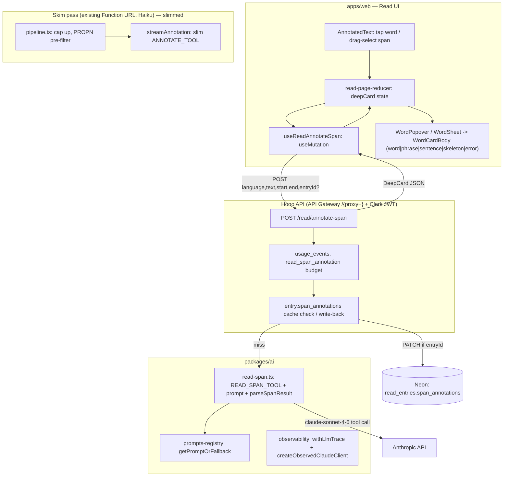

# Design Document

## Overview

Reading: Deep Annotation (Part 1) splits passage annotation into two tiers that share one card UI:

1. **Skim pass (existing streaming Lambda, Haiku):** slimmed so each highlighted word carries only highlight-level fields. Cheaper per word → higher candidate cap, proper nouns excluded.
2. **Deep annotation (new, on demand, Sonnet):** a new non-streaming `POST /read/annotate-span` route on the existing Hono API resolves a rich card for a tapped word, a selected phrase, or a selected sentence. Word/phrase cards are savable to vocabulary; resolved cards are persisted onto saved History entries so reopened texts stay annotated without re-calling Claude.

The work reuses the existing Read feature end-to-end: the annotate-stream pipeline, the AI package's prompt-registry + observed-client pattern, the Hono `/read/*` router and DB-backed metering, the web popover/bottom-sheet card chrome, the api-client fetch/hook conventions, and the Drizzle `read` schema.

## Steering Document Alignment

### Technical Standards (tech.md)

- **Separate Lambda API, Hono, Zod** — the deep endpoint is an app-code route on the existing Hono app behind the API Gateway `/{proxy+}` proxy; no CDK change. Request/response validated with shared Zod schemas (tech.md §"Validation", §12).
- **Cost-controlled AI (§7, §10)** — cheap shared-style work stays on Haiku (skim); the expensive Sonnet path is on-demand only, metered, and cached durably (DB) so it can't blow the budget. Prompt caching (`cache_control: ephemeral`) on the system prompt mirrors the evaluation path.
- **DB-backed metering** — there is **no Redis client in this repo**; rate limiting is implemented exactly like the existing annotate/evaluation paths: counting rows in `usage_events`. The deep path adds a dedicated `read_span_annotation` event type on its own daily budget.
- **Langfuse prompt versioning (CLAUDE.md)** — a new `READ_SPAN_PROMPT_VERSION` + `read-span-system-prompt` registry entry; `ANNOTATE_SYSTEM_PROMPT_VERSION` is bumped when the skim prompt/tool changes. Both synced via `bootstrap-prompts` / `push-prompts`.
- **Claude model IDs** — skim: `claude-haiku-4-5-20251001` (unchanged); deep: `claude-sonnet-4-6` (matches `evaluate.ts`).

### Project Structure

There is no `structure.md`; the design follows the established monorepo layout: shared types in `packages/shared/src`, prompts/tools/parsers in `packages/ai/src`, wire schemas + hooks in `packages/api-client/src`, routes in `infra/lambda/src/routes`, schema/migrations in `packages/db`, and the read UI under `apps/web/app/(dashboard)/read/_components`. New files mirror the naming of their neighbors (`annotate.ts` → `read-span.ts`, `useReadAnnotateStream.ts` → `useReadAnnotateSpan.ts`).

## Code Reuse Analysis

### Existing Components to Leverage

- **`packages/ai/src/annotate.ts`** — `ANNOTATE_TOOL`, `ANNOTATE_SYSTEM_PROMPT(_VERSION)`, `streamAnnotation`. Slimmed in place (drop `example` from the tool's `required`/schema; add PROPN exclusion to the prompt).
- **`packages/ai/src/evaluate.ts`** — the canonical non-streaming tool-call pattern (system prompt with `cache_control`, forced `tool_choice`, extract `tool_use`, Zod-parse). `read-span.ts` copies this shape with Sonnet.
- **`packages/ai/src/prompts-registry.ts`** — `getPromptOrFallback(name, fallback, version)` and `sha8` (note: `setResolvedPromptVersion/Client` live in `observability.ts`). Used verbatim for the new prompt.
- **`packages/ai/src/observability.ts`** — `createObservedClaudeClient`, `withLlmTrace`, `getCurrentLlmTraceContext`. The route wraps the Sonnet call in `withLlmTrace({ feature: "annotate-span", ... })`.
- **`infra/lambda/src/annotate-stream/pipeline.ts`** — `buildCandidateList`, `CANDIDATE_LIMIT`, `tokenize`, frequency/stopword utils. Raise the cap; add the proper-noun pre-filter here.
- **`infra/lambda/src/routes/read.ts`** — existing `/read/*` router, `read.use('/read/*', authMiddleware)`, `c.get('userId')`, Zod `safeParse`, `db.transaction`. The new routes and the `spanAnnotations` write-back live here. **Metering is net-new to read.ts** (it has none today) — the `usage_events` rate-limit + insert pattern is copied from `annotate-stream/handler.ts:146-164,300` and `routes/exercises.ts:183-249`.
- **`apps/web/.../read/_components`** — `WordPopover`, `WordSheet`, `WordCardBody`, `AnnotatedText`, `AnnotatedSkeleton`, `AnnotatedError`, `SaveToast`, `word-flag-styles.module.css`, and the `tokenize`/sentence utilities. Card chrome and styles are reused; card *body* gains word/phrase/sentence variants + skeleton/error.
- **`packages/api-client/src/fetchClient.ts`** (`createAuthenticatedFetch`) and **`useReadEntryMutations.ts`** (the `useMutation` pattern with cache write-through). `useReadAnnotateSpan` follows `useSaveReadEntry`.
- **`packages/shared/src/read.ts`** — `WordFlagSchema`, `FlaggedMapSchema`, `READ_*` constants, `READ_CEFR_TOP_RANK`. Extended with the deep-card union + helpers.

### Integration Points

- **API Gateway** — `POST /read/annotate-span` is matched by the existing `/{proxy+}` route + Clerk JWT authorizer; **no CDK edit**. (The skim stream stays on its separate Function URL.)
- **`usage_events`** — new `read_span_annotation` event type; `event_type` is free `text`, no migration needed for the type itself.
- **`read_entries` / `user_vocabulary`** — two new jsonb columns via Drizzle migration(s): `read_entries.span_annotations` and `user_vocabulary.card`.
- **Web data layer** — the deep endpoint goes through `NEXT_PUBLIC_API_URL` (main API), unlike the stream hook which uses `NEXT_PUBLIC_ANNOTATE_STREAM_URL`.

## Architecture



## Components and Interfaces

### Component 1 — `packages/shared/src/read.ts` (deep-card contract)

- **Purpose:** Authoritative Zod schemas + types for the deep-card union, shared by AI parser, API route, api-client, and DB `$type`.
- **Interfaces (new):**
  - `MorphologySchema` = `{ root, rootGloss, segments: {morph, function}[], whyThisForm }`
  - `InflectionSchema` = `{ forms: {label, value}[] }`
  - `DeepWordCardSchema` = `{ type:"word", surface, lemma, pos, contextualSense, definition, definitionLabel, cefr, freq, inflection?, morphology?, synonyms?: {word,note}[], collocations?: {phrase,gloss}[], register?, extraExample?: {tl,en} }`
  - `DeepPhraseCardSchema` = `{ type:"phrase", surface, citation?, literal, idiomaticMeaning, register, example?: {tl,en}, synonyms?: {phrase,note}[] }`
  - `DeepSentenceCardSchema` = `{ type:"sentence", surface, translation, breakdown: {chunk,role,note}[], grammarNotes: string[] }`
  - `DeepCardSchema` = discriminated union on `type`.
  - `SpanAnnotationsSchema` = `z.record(z.string(/* "start:end" */), DeepCardSchema)` for `read_entries.span_annotations`.
- **Change:** make `WordFlagSchema.example` **optional** (skim no longer guarantees it; deep card supplies examples). Backward-compatible with stored entries.
- **Dependencies:** `zod`, `CefrLevel`.
- **Reuses:** existing `CefrLevel`/`WordFlag` patterns in the same file.

### Component 2 — `packages/ai/src/read-span.ts` (deep annotation model call)

- **Purpose:** Build the Sonnet tool call that returns a `DeepCard` for a span in context, and parse it.
- **Interfaces:**
  - `READ_SPAN_SYSTEM_PROMPT`, `READ_SPAN_PROMPT_VERSION = "read-span@<YYYY-MM-DD>"`, `READ_SPAN_TOOL` (input schema = the deep-card union). The **caller passes the resolved span `type`**; the model is told which card to produce and emits the matching shape (with morphology for TR/DE). The model does **not** decide the span type.
  - `annotateSpan(client, { language, text, start, end, spanType, proficiencyLevel }): Promise<DeepCard>` — `spanType` (`"word"|"phrase"|"sentence"`) is decided by the caller (Component 4), not the model. Mirrors `evaluate.ts`: resolve prompt via `getPromptOrFallback("read-span-system-prompt", …, READ_SPAN_PROMPT_VERSION)`, `messages.create` with `model: "claude-sonnet-4-6"`, `tool_choice` forced, `temperature: 0`, system prompt `cache_control: ephemeral`; extract `tool_use`; `parseSpanResult` (Zod) → `DeepCard`.
  - `buildSpanUserPrompt(text, start, end, language, proficiencyLevel)` — sends the full passage plus the highlighted span (offsets), instructs CEFR-calibrated `definition`.
- **Dependencies:** `@anthropic-ai/sdk`, prompts-registry, shared deep-card schemas.
- **Reuses:** `evaluate.ts` call structure; `sha8`; `setResolvedPromptVersion/Client`. Re-export from `packages/ai/src/index.ts`.

### Component 3 — `infra/lambda/src/annotate-stream/` (slim skim pass)

- **Purpose:** Lighter highlight pass with broader coverage and no proper nouns.
- **Changes:**
  - `annotate.ts`: drop `example` from `ANNOTATE_TOOL` `required` + schema; edit `ANNOTATE_SYSTEM_PROMPT` to stop emitting examples and to never flag proper nouns; bump `ANNOTATE_SYSTEM_PROMPT_VERSION`. `streamAnnotation` validates each item against the slimmed flag schema; server drops any `pos`=proper-noun item.
  - `pipeline.ts`: raise `CANDIDATE_LIMIT` 20 → 50; add a proper-noun pre-filter — for ES/TR drop capitalized non-sentence-initial tokens before the model call (German excluded; rely on model POS + server drop).
- **Latency (addresses the PR #100 cap constraint):** `CANDIDATE_LIMIT` is bound by the Lambda 29s wall-clock, not `max_tokens` (`pipeline.ts:42-56`). The PR #100 timeout was a **40-entry Sonnet** call; the current 20-entry **Haiku** pass measures ~5s / ~3500 output tokens (20 × ~175). Slimming drops `example`, cutting per-entry output from ~175 → ~30 tokens, so **50 slim entries ≈ 1500 output tokens — fewer than today's 3500**. Since wall-clock is dominated by output-token streaming on Haiku, 50 slim entries should be *faster* than today's 20 full entries. The 25s soft-deadline stays as the backstop; the cap is validated empirically against `docs/perf/more-responsive-reading-2026-05-12.md` and lowered if time-to-done regresses.
- **Interfaces unchanged** at the SSE wire level except `flag` events may omit `example` (allowed by the now-optional field).
- **Reuses:** existing tokenizer, frequency/stopword utils, soft-deadline, `usage_events` write (`read_annotation`).

### Component 4 — `infra/lambda/src/routes/read.ts` (deep endpoint + write-back)

- **Purpose:** Serve deep annotations and persist them onto saved entries.
- **Span-type resolution (server-authoritative):** the server derives `spanType` from the offsets — single token → `word`; multi-token not matching a sentence range → `phrase`; offsets exactly matching a detected sentence range (boundaries via `.`/`!`/`?`) → `sentence`. The client may send a hint, but the server recomputes and is authoritative, because `spanType` drives the cache key, the save-rejection rule, and the card layout (Req 4.3, 5.1).
- **Interfaces:**
  - `POST /read/annotate-span` — body `{ language, text, start, end, entryId? }` (Zod). Flow:
    1. `userId = c.get('userId')`; derive `spanType` from offsets.
    2. **Cache hit (saved entries only):** if `entryId` is present AND owned AND `entry.span_annotations` has key `"start:end"` → return it. No model call, no metering. (Unsaved passages send no `entryId` → no server cache; within-session repeats rely on client state, Req 11.2.)
    3. **Rate-limit:** count `usage_events` with `event_type = 'read_span_annotation'` in the last 24h against `READ_SPAN_DAILY_LIMIT` (≈150) → 429 if exceeded. This is a **separate bucket** from the `ai_evaluation`/`read_annotation` 50/day count.
    4. `annotateSpan(client, { language, text, start, end, spanType, proficiencyLevel })` inside `withLlmTrace({ feature: "annotate-span", … })`.
    5. **Write-back (saved entries only):** if `entryId` owned → `UPDATE read_entries SET span_annotations = COALESCE(span_annotations, '{}'::jsonb) || jsonb_build_object($key, $card) WHERE id = $entryId AND user_id = $userId`. The `COALESCE` is required because the column is nullable (`NULL || jsonb` → `NULL`). Best-effort (Error #6).
    6. Insert one `read_span_annotation` usage row — only after a real model call (skipped on cache hit / failure).
    7. Return the `DeepCard`.
  - `POST /read/vocabulary` — **the deep-card → save seam** (the resolved `DeepCard` exists only transiently client-side, so the client posts it here). Body `{ language, card: DeepCard, sourceReadEntryId? }`; rejects `card.type === "sentence"` (400). Derives lexical columns from the card (`lemma`, `pos`, `gloss` ← `contextualSense`, `exampleSentence` ← `extraExample`/`example`, `frequencyRank` ← `freq`, `cefrBand` ← `cefr`) and upserts `user_vocabulary` with the full `card` jsonb snapshot, keyed by the existing `(user, language, word)` constraint (lemma-keying is Part 2). Returns `{ id }`.
  - `DELETE /read/vocabulary/:id` — removes the saved record for undo (Req 8.5).
- **Dependencies:** `@language-drill/ai` (`annotateSpan`, `createObservedClaudeClient`, `withLlmTrace`), `@language-drill/db`.
- **Reuses:** `authMiddleware`, Zod `safeParse` error shape (`VALIDATION_ERROR`), `db.transaction`, the existing usage-counting query.

### Component 5 — `packages/api-client` (schemas + hook)

- **Purpose:** Typed client contract + mutation hook for the deep endpoint.
- **Interfaces:**
  - `schemas/read.ts`: `AnnotateSpanRequestSchema` (`{ language, text, start, end, entryId? }`) and `AnnotateSpanResponseSchema` = `DeepCardSchema` (re-exported from shared).
  - `hooks/useReadAnnotateSpan.ts`: `useMutation<DeepCard, Error, AnnotateSpanRequest>` calling `fetchFn('/read/annotate-span', { method:'POST', body })`; on success, optionally write the card into the `['readEntry', entryId]` cache's `spanAnnotations` (so reopened/again-tapped spans render locally).
  - `hooks/useSaveVocabularyCard.ts` / `useDeleteVocabularyCard.ts`: `useMutation` wrappers over `POST` / `DELETE /read/vocabulary` for save + undo (mirrors `useSaveReadEntry`).
- **Reuses:** `createAuthenticatedFetch`, the `useSaveReadEntry` mutation shape.

### Component 6 — `apps/web/.../read` (selection + card rendering)

- **Purpose:** Tap-any-word + span selection, deep-card display with loading/error, persisted-annotation rendering.
- **Changes:**
  - `annotated-text.tsx`: make **every** word tappable (not just flagged); add mouse-drag span selection (mousedown → mouseenter → mouseup) and sentence-range detection (`.`/`!`/`?`), mapping a selection to word|phrase|sentence and reporting `{start,end,type}` + anchor rect.
  - `read-page-reducer.ts`: add `deepCard` state — `{ status: 'idle'|'loading'|'loaded'|'error', span, card?, error? }` keyed by active span; `spanAnnotations` carried from the loaded entry.
  - `word-card-body.tsx`: render three layouts (word/phrase/sentence) from `DeepCard` (using the server-provided `type`), plus a skeleton and an inline error+retry. Inflection inline in header; morphology as chips + "why this form"; synonyms/collocations/register/extra-example as collapsible rows; sentence card grammar chips (Theory deep-link when target resolves, else plain text); no save on sentence cards. The save action on word/phrase cards posts the resolved `DeepCard` to `POST /read/vocabulary`; undo calls `DELETE /read/vocabulary/:id`.
  - `annotated-view.tsx` / `page.tsx`: wire `useReadAnnotateSpan`; tapping a flagged word shows its skim gloss instantly then swaps to the deep card; persisted `spanAnnotations` from `useReadEntry` render instantly and bypass the endpoint.
- **Reuses:** `WordPopover`/`WordSheet` chrome, `word-flag-styles.module.css` (incl. `.active`, `.saved`), `SaveToast`, the existing reducer/discriminated-union conventions.

### Component 7 — `packages/db/src/schema/read.ts` (+ migrations)

- **Purpose:** Durable storage for deep cards.
- **Changes:** add `spanAnnotations: jsonb('span_annotations').$type<SpanAnnotations>()` (nullable) to `readEntries`; add `card: jsonb('card').$type<DeepCard>()` (nullable) to `userVocabulary`. Generate migration(s) `0014…` via `drizzle-kit generate`. No index/constraint changes (lemma-dedupe is Part 2).
- **Reuses:** the `flaggedWords`/`bank` jsonb-`$type` precedent.

## Data Models

### DeepCard (discriminated union, in `packages/shared/src/read.ts`)

```
DeepWordCard:
  type: "word"
  surface, lemma, pos: string
  contextualSense: string          // meaning HERE (UI language)
  definition: string               // target-language, CEFR-calibrated
  definitionLabel: string          // "Türkçe" | "Deutsch" | "Español"
  cefr: CefrLevel
  freq: integer
  inflection?:  { forms: { label, value }[] }
  morphology?:  { root, rootGloss, segments: { morph, function }[], whyThisForm }
  synonyms?:    { word, note }[]
  collocations?:{ phrase, gloss }[]
  register?:    string
  extraExample?:{ tl, en }

DeepPhraseCard:
  type: "phrase"
  surface, literal, idiomaticMeaning, register: string
  citation?: string
  example?: { tl, en }
  synonyms?: { phrase, note }[]

DeepSentenceCard:
  type: "sentence"
  surface, translation: string
  breakdown: { chunk, role, note }[]
  grammarNotes: string[]
```

### read_entries.span_annotations (new jsonb column)

```
Record<"start:end", DeepCard>   // e.g. { "12:21": { type:"word", ... } }
nullable; null/absent ⇒ no deep cards persisted yet
// write-back: COALESCE(span_annotations,'{}'::jsonb) || jsonb_build_object(key, card)  (column is nullable)
```

### user_vocabulary.card (new jsonb column)

```
DeepCard (word|phrase only)      // snapshot captured at save time
nullable; lexical columns (lemma, pos, gloss, example_sentence, freq, cefr) stay authoritative for queries
// Part 1 keeps the existing (user, language, word) unique key; lemma-keying + occurrences are Part 2
```

### WordFlag (existing, changed)

```
example: string  →  example?: string   // optional; skim omits it, deep card supplies examples
```

## Error Handling

### Error Scenarios

1. **Deep call fails / times out (Sonnet error, network, max_tokens).**
   - Handling: route returns `502 { code: "AI_UNAVAILABLE" }`; **no** `usage_events` row written for a call that produced nothing. Hook surfaces error; card shows inline error + retry (reusing `AnnotatedError` styling at card scope).
   - User impact: "couldn't look this up — try again"; retry re-issues the mutation.

2. **Rate limit exceeded (`read_span_annotation` budget).**
   - Handling: `429 { code: "RATE_LIMIT_EXCEEDED" }` before any model call. Card error state with retry disabled (mirrors `AnnotatedError kind:'rateLimit'`).
   - User impact: "daily lookup limit reached."

3. **Invalid input (offsets out of range, text too long, unsupported language).**
   - Handling: `400 { code: "VALIDATION_ERROR", details }` via Zod `safeParse` (same shape as `/read/entries`).
   - User impact: shouldn't occur via UI; defensive.

4. **Unauthenticated.**
   - Handling: API Gateway JWT authorizer rejects; `authMiddleware` guarantees `userId`. `401`.

5. **Save a sentence card / save when not word|phrase.**
   - Handling: server rejects with `400`; UI never shows a save action on sentence cards.

6. **Cache write-back fails (entry update).**
   - Handling: log + still return the resolved card (the lookup succeeded). Persistence is best-effort; the next reopen simply re-resolves. Does not fail the request.

7. **Model returns a proper noun in the skim pass despite the prompt.**
   - Handling: server drops `pos`=proper-noun flags before streaming (defense in depth).

## Testing Strategy

### Unit Testing

- **`packages/ai`** (vitest, node): `parseSpanResult` accepts each card type and rejects malformed/missing-`type`; `annotateSpan` builds a forced-tool Sonnet request and maps `tool_use` → `DeepCard` (mock SDK); prompt resolves via registry with fallback. Add cases to the slimmed `annotate.ts` parser confirming `example` is optional and proper-noun items are dropped.
- **`packages/db`**: extend `read.test.ts` (`getTableConfig`) to assert the new `span_annotations` and `card` columns exist; assert no constraint/index regressions.
- **`infra/lambda`** (vitest): `read.test.ts` — `POST /read/annotate-span` happy path (mock `annotateSpan`, capture usage insert + span_annotations write-back), cache-hit short-circuit (no model call, no metering), rate-limit 429, validation 400, sentence-save rejection. `pipeline.test.ts` — raised cap and proper-noun pre-filter for ES/TR vs German.

### Integration Testing

- Route-level: span type inferred correctly from offsets (word vs phrase vs sentence); `entryId` write-back composes into existing `span_annotations` (jsonb `||` merge) without clobbering prior spans; metering increments only on a real model call.
- Save flow: saving a deep word card writes the lexical columns **and** the `card` snapshot; idempotent upsert unchanged.

### End-to-End Testing (Playwright, `apps/web/e2e/tests/authenticated/read.spec.ts` — new)

- Tap an un-highlighted word → skeleton → word card resolves.
- Drag-select two words → phrase card; select a full sentence → sentence card (no save action).
- Save a word → "saved" style + toast; reopen the entry from History → previously looked-up spans render annotated with **no** network call to the deep endpoint.
- Mobile viewport (≤760px) → bottom sheet; desktop → anchored popover; error state shows retry.
