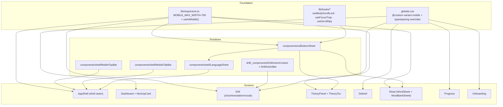

# Design Document

## Overview

This feature makes the existing `apps/web` Next.js app responsive at a single canonical **≤760px** breakpoint, reflowing the desktop SPA into a phone layout. The work is overwhelmingly **layout-only**: existing screen components keep their state, data fetching, copy, tokens, and interaction model. Two kinds of adaptation are needed:

1. **CSS-only reflows** (the majority): multi-column grids → single column, padding/type-scale shrink, sticky bars. These are driven by a single Tailwind v4 custom variant (`mobile:`) and a handful of `@media (max-width: 760px)` blocks in `globals.css`.
2. **Structural swaps** (a minority, where the DOM genuinely differs by viewport): a side panel becomes a bottom sheet (theory, word card, word bank), a left rail becomes a top app-bar + bottom tab-bar (shell), a dropdown becomes a sheet (language switcher), and inline drill CTAs migrate into a sticky action bar. These branch on a single shared `useIsMobile()` hook.

The guiding constraint from the brief: _"the same product at phone width, not a different product that happens to be smaller."_ Above 760px, the desktop experience is unchanged.

A secondary outcome is **breakpoint reconciliation**. The codebase currently has ad-hoc breakpoints scattered at 600/640(`sm`)/768(`md`)/900/1024(`lg`)px. This feature collapses the desktop↔mobile transition onto one value (760px) so screens stop diverging (Requirement 1.6). See "Deliberate Deviation" below for the tablet-band implication.

## Steering Document Alignment

### Technical Standards (tech.md)

- **Next.js App Router + TypeScript**, hosted on Vercel — unchanged. All new components are client components (`'use client'`), consistent with the existing shell/drill/read components that already branch on runtime state.
- **Styling: Tailwind (v4) + design tokens.** tech.md names "Tailwind CSS + shadcn/ui"; the actual implementation is Tailwind v4 (`@import "tailwindcss"` + `@theme` in `globals.css`) with bespoke `components/ui` primitives (not shadcn). This design follows the **actual** convention: tokens as CSS custom properties, type-scale utility classes (`.t-display-*`), and Tailwind utility classes with arbitrary values. No new styling dependency is introduced.
- **No runtime CSS-in-JS.** Matches the existing pattern (className + tokens + occasional inline style for one-offs).
- **State/data: TanStack Query** — untouched. No new queries, mutations, or API calls. The responsive layer never touches the data layer (satisfies the Security NFR).

### Project Structure (structure.md)

There is no `structure.md`; conventions are inferred from the codebase and honored:

- **Route-scoped components** live in `app/(dashboard)/<route>/_components/`. Responsive changes to a screen stay within that screen's `_components/` folder (e.g. the drill action bar lands in `app/(dashboard)/drill/_components/`).
- **Cross-cutting UI primitives** live in `components/ui/` (Button, Card, Choice, Chip, Bar, Input, Textarea). The new `BottomSheet` primitive lands here.
- **Shell components** live in `components/shell/`. New `MobileTopBar`, `MobileTabBar`, and `LanguageSheet` land here.
- **Shared hooks** live in `lib/hooks/`. The shared `useIsMobile` and the promoted sheet hooks (scroll-lock, focus-trap, scroll-spy) land here.
- **Co-located tests**: `__tests__/*.test.tsx` next to the component, run by Vitest. Every new component/hook ships a co-located test.

## Code Reuse Analysis

### Existing Components to Leverage

- **`components/theory/use-body-scroll-lock.ts`, `use-focus-trap.ts`, `use-scroll-spy.ts`**: Promote to `lib/hooks/` and generalize for reuse by every sheet. `useFocusTrap`'s focusable selector is widened to include `textarea, select, input` (the read word/paste sheets contain inputs; theory remains read-only and unaffected). `TheoryPanel` updates its imports to the new location.
- **`ActiveLanguageProvider` / `useActiveLanguage` (`components/shell/active-language-provider.tsx`)**: The `LanguageSheet` reads/sets the active language through this exact provider — no new state. The existing `LanguageSwitcher` dropdown is reused as-is on desktop.
- **`components/shell/nav-items.tsx`, `nav-icons.tsx`, `nav-item.tsx`, `brand.tsx`, `flagdot.tsx`, `user-footer.tsx`**: A new `NAV_DESTINATIONS` array is extracted from `NavItems` and consumed by both the desktop `NavItems` and the new `MobileTabBar` (single source of nav truth). Icons and the active-route logic (`usePathname`) are reused.
- **`components/ui/{Button,Card,Choice,Chip,Bar,Input,Textarea,AccentPicker}`**: All reused unchanged for content. `Choice` and `Button` get a documented minimum tap height at mobile (≥48px / ≥44px) via the `mobile:` variant — additive classes only.
- **Drill: `DrillLayout`, `CoachRail`, `ExercisePane`, `Cloze/Translation/VocabExercise`, `FeedbackShell`, `session-reducer`**: Reused. `DrillLayout` gains a mobile branch (no side rail, sticky action-bar slot). The exercise components and `FeedbackShell` publish their primary action to a new `DrillActionContext` on mobile instead of rendering it inline; on desktop they render inline exactly as today.
- **Theory: `TheoryPanel`, `TheoryToc`, `TheoryContent`, `useScrollSpy`**: Reused. The panel's chrome (overlay/panel/body/toc) is CSS-class-driven in `globals.css`; mobile reflow is achieved by `@media` overrides plus a `TheoryToc` layout branch (vertical sidebar → horizontal tab strip).
- **Read: `AnnotatedView`, `WordBankRail`, `WordPopover`, `IntensityToggle`, `read-page-reducer`, `AnnotatedFooter`, `CalibrationStrip`**: Reused. On mobile, `AnnotatedView` renders `WordSheet` (BottomSheet wrapping the word-card content) instead of the anchored popover, and a `WordBankSheet` (BottomSheet wrapping `WordBankRail` content) opened from a toolbar chip. The reducer's `activeWord`/`OPEN_POPOVER` state is reused verbatim — only the presentation differs.
- **Debrief: `DebriefHeader`, `DebriefTabs`, `DebriefTab`, `ReviewTab`, `DebriefFooter`, `review-item-card`**: Reused. Stat-card grid → mobile snap-scroll row; footer → sticky action bar; `review-item-card`'s `md:grid-cols-2` reconciled to the canonical breakpoint.
- **Progress: `progress` page, `shape-tab`, `heatmap-tab`, `radar-chart`, `heatmap-grid`, `shape-side-cards`, `progress-tabs`, `use-tab-url-state`**: Reused. Radar clamped to ≤320px, side cards stacked, heatmap cell sizing reduced — all CSS/prop-level.
- **Onboarding: `OnboardingShell`, `CoachPane`, `MobileCoachHeader`, step components, `WizardProgress`, `WizardFooter`**: Reused. The existing `lg`(1024) breakpoint on the coach pane is reconciled to the canonical 760; choice grids' `[@media(min-width:600px)]` reconciled; `WizardFooter` becomes a sticky bottom action bar at mobile.

### Integration Points

- **`components/shell/app-shell.tsx`**: The single integration seam for the whole shell. It currently always renders `<Nav>` + `<main>`. It will branch on `useIsMobile()` to render either the desktop rail or `MobileTopBar` + scrollable main + `MobileTabBar`. Every in-app screen renders through `AppShell`, so this one change carries the chrome reflow for all of them.
- **`app/globals.css`**: Single home for the `mobile:` custom variant, the responsive type-scale/spacing overrides, the theory `@media` reflow, and the bottom-sheet keyframes. No per-screen stylesheet edits beyond the route folders.
- **`lib/responsive.ts` (new)**: Single source for the breakpoint number (`MOBILE_MAX_WIDTH = 760`) and `useIsMobile()`. The Tailwind `mobile:` variant's media value is documented to mirror this constant.

## Architecture

The design layers cleanly: a foundation (breakpoint + hook), shared sheet/shell primitives built on it, and per-screen reflows that consume those primitives.



**Branching rule (when to use CSS vs `useIsMobile`):**

- Use **CSS** (`mobile:` variant / `@media`) when the same DOM is merely re-styled (grid → column, padding, type size, sticky positioning). This is SSR-safe and has zero hydration risk.
- Use **`useIsMobile()`** only when the component **tree** differs (sheet vs panel vs popover vs dropdown; tab-bar vs rail; action published to a bar vs rendered inline). The hook returns `false` (desktop) during SSR and the first client render, then reconciles on mount — so the server-rendered tree is always the desktop tree and never throws a hydration mismatch.

## Components and Interfaces

### Foundation: `lib/responsive.ts` + `useIsMobile`
- **Purpose:** Single source for the breakpoint and an SSR-safe matchMedia hook.
- **Interfaces:**
  - `export const MOBILE_MAX_WIDTH = 760;`
  - `export const MOBILE_MEDIA_QUERY = '(max-width: 760px)';`
  - `export function useIsMobile(): boolean` — returns `false` on server and first render; subscribes to `window.matchMedia(MOBILE_MEDIA_QUERY)` and updates on change; returns `false` if `matchMedia` is unavailable (graceful degradation → desktop).
- **Dependencies:** React (`useSyncExternalStore` preferred for tear-free reads; `useState`/`useEffect` acceptable).
- **Reuses:** Nothing; net-new but tiny.

### Foundation: `globals.css` additions
- **Purpose:** CSS-level responsive behavior in one place.
- **Interfaces (CSS):**
  - `@custom-variant mobile (@media (max-width: 760px));` — enables the `mobile:` utility prefix.
  - `@media (max-width: 760px)` block overriding `.t-display-xl { font-size: 34px; line-height: 1.2; }`, `.t-display-l { font-size: 28px; line-height: 1.2; }`, `.t-display-m { font-size: 22px; line-height: 1.2; }` (all wrappable display sizes kept at ≥1.2 line-height per Req 1.4, deliberately looser than the prototype's literal `.mw-h1` 1.06; body/small/micro/mono unchanged).
  - Bottom-sheet keyframes (`sheet-slide`, `sheet-fade`) and the scrim ruleset (keyframes must live in CSS, not Tailwind).
  - Theory `@media (max-width: 760px)` overrides: `.theory-overlay { align-items: flex-end; }`, `.theory-panel { width: 100vw; height: 92vh; max-height: 92vh; border-left: 0; border-radius: 24px 24px 0 0; }`, `.theory-body { flex-direction: column; }`, `.theory-toc { width: 100%; ... horizontal strip }`.
  - Reduced-motion: extend the existing `@media (prefers-reduced-motion: reduce)` block to cover the new sheet animations.
- **Reuses:** Existing token vars and `.t-*` classes.

### Primitive: `components/ui/bottom-sheet.tsx`
- **Purpose:** The single reusable bottom-sheet used by language switcher, theory (mobile), word card, and word bank.
- **Interfaces:**
  ```ts
  interface BottomSheetProps {
    open: boolean;
    onClose: () => void;
    title?: React.ReactNode;
    maxHeight?: string;          // default '78vh'
    fullScreen?: boolean;        // theory uses ~92vh
    ariaLabel: string;
    children: React.ReactNode;
  }
  ```
  - Renders a portal (`createPortal` to `document.body`) with a scrim (`rgba(26,22,18,0.42)`), a slide-up panel (24px top radius, drag handle), and an optional sticky header with a close button.
  - Closes on scrim click, close-button click, and `Escape`.
- **Dependencies:** `useBodyScrollLock(open)`, `useFocusTrap(open, ref)`, the sheet keyframes.
- **Reuses:** Promoted `lib/hooks/use-body-scroll-lock`, `lib/hooks/use-focus-trap`.

### Primitive: `lib/hooks/` (promoted hooks)
- **Purpose:** Make scroll-lock / focus-trap / scroll-spy reusable beyond theory.
- **Change:** Move the three theory hooks to `lib/hooks/`; widen `useFocusTrap`'s `FOCUSABLE_SELECTOR` to include `textarea, select, input:not([type="hidden"])`. Update `TheoryPanel` imports.
- **Reuses:** The existing, tested implementations (their tests move with them).

### Shell: `AppShell` (modified) + `MobileTopBar`, `MobileTabBar`, `LanguageSheet`
- **Purpose:** Reflow the chrome.
- **`AppShell`:** branches on `useIsMobile()`. Desktop → existing `<Nav>` + centered `<main>` (unchanged). Mobile → `<MobileTopBar>` (sticky, 52px) + scrollable `<main>` with `px-[18px]` and bottom padding for the tab-bar + `<MobileTabBar>` (fixed, ~64px, safe-area inset).
- **`MobileTopBar`:** brand mark + compact language pill (opens `LanguageSheet`) + avatar (reuses `UserFooter`'s menu trigger or a minimal avatar). Not rendered ≥761.
- **`MobileTabBar`:** maps `NAV_DESTINATIONS` to tab buttons (icon + 10px label); active via `usePathname` matching `NavItem`'s logic; each tab ≥44px tall. Renders exactly four destinations (today/drill/read/progress) — no invented routes.
- **`LanguageSheet`:** `BottomSheet` listing `learningProfiles` with `Flagdot` + name + proficiency badge + selected dot; selecting calls `setActiveLanguage` and closes; includes the "manage languages →" link. No-op (no sheet) when a single language.
- **Dependencies:** `useIsMobile`, `BottomSheet`, `useActiveLanguage`, `NAV_DESTINATIONS`.
- **Reuses:** `Nav`, `Brand`, `Flagdot`, `nav-icons`, `UserFooter`, `LanguageSwitcher` (desktop).

### Drill: `DrillActionContext` + `DrillActionBar` (new) + `DrillLayout` (modified)
- **Purpose:** Provide the sticky check/next action bar without changing desktop behavior.
- **`DrillActionContext`:**
  ```ts
  interface DrillPrimaryAction {
    label: string;
    onClick: () => void;
    disabled?: boolean;
    loading?: boolean;
    variant?: 'primary' | 'accent';
  }
  interface DrillActionContextValue {
    active: boolean;                                  // true only on mobile
    setPrimaryAction: (a: DrillPrimaryAction | null) => void;
    meta: { current: number; total: number } | null; // progress meta (left side)
    setMeta: (m: { current: number; total: number } | null) => void;
  }
  ```
- **Behavior:** The drill page wraps content in `DrillActionProvider` with `active = useIsMobile()`. Exercise components and `FeedbackShell` read `active`:
  - **Desktop (`active=false`)**: render their `<Button>` inline exactly as today (zero change to current DOM/tests).
  - **Mobile (`active=true`)**: call `setPrimaryAction({...})` in an effect with their current CTA (submit when idle, next when evaluated) and render nothing inline. `DrillActionBar` renders the published action sticky at the bottom with the progress meta on the left.
  - Secondary controls that exist today (cloze mode toggle, translation "show me a hint") remain inline in the body — they are not happy-path "skip" actions, so the bar hosts progress-meta + primary only (faithful to the real app, which has no happy-path skip; the error-path skip stays in `SubmissionErrorCard`).
- **`DrillLayout` (modified):** replace the hard-coded `[@media(min-width:900px)]:grid-cols-[280px_1fr]` with the canonical `mobile:` logic. Mobile → single column, no side `<aside>` rail; the `rail` content (coach) is rendered by the page as a collapsible `CoachCard` at the top of `main`; a `SessionDots` row renders above the prompt; the sticky `DrillActionBar` renders at the bottom (the tab-bar is suppressed during a drill).
- **`SessionDots` (new, mobile):** horizontal scrollable dot/number row driven by the `session-reducer` cursor/total.
- **`CoachCard` (new, mobile):** the existing `CoachRail` message rendered as a collapsible card.
- **Reuses:** `session-reducer` selectors, `CoachRail` message logic, `Button`, `FeedbackShell`, `Choice` (1-col + ≥48px on mobile via `mobile:` classes).

### Theory: `TheoryToc` (modified) + CSS
- **Purpose:** Right slide-over → full-screen bottom sheet with a horizontal TOC tab strip.
- **Approach:** Panel chrome reflow is pure CSS (`@media` overrides on the existing `.theory-*` classes). `TheoryToc` branches on `useIsMobile()`: desktop → existing vertical 240px sidebar; mobile → a horizontal, scrollable tab strip pinned under the header. Scroll-spy (`useScrollSpy`) and jump-to-section behavior are unchanged. `TheoryPanel` keeps its portal, focus trap, scroll lock, and Esc handling (already present).
- **Reuses:** `TheoryPanel`, `TheoryContent`, `useScrollSpy`, focus-trap/scroll-lock.

### Read: `WordSheet` (new) + `WordBankSheet` (new) + `WordCardBody` (extracted) + `AnnotatedView` (modified)
- **Purpose:** Replace the anchored popover and sticky rail with bottom sheets.
- **`AnnotatedView` (modified):** branches on `useIsMobile()`. Desktop → existing 2-column grid + `WordPopover` + sticky `WordBankRail` (unchanged). Mobile → single column; a toolbar chip ("word bank · N") opens `WordBankSheet`; tapping a flagged word opens `WordSheet` instead of positioning a `WordPopover`; the `IntensityToggle` moves into the `WordBankSheet` header.
- **`WordCardBody` (extracted):** the popover's inner markup (header/body/footer) lifted into a shared component so both `WordPopover` and `WordSheet` render identical content.
- **`WordSheet`:** `BottomSheet` (≈50vh) rendering `WordCardBody` + save/skip actions.
- **`WordBankSheet`:** `BottomSheet` rendering `WordBankRail`'s list content + the intensity toggle in its header.
- **Reuses:** `read-page-reducer` (`activeWord`, `bank`, `intensity`), `WordBankRail` list, `WordPopover`/`WordCardBody` content, `IntensityToggle`, `AnnotatedText`, `AnnotatedFooter`. The save toast gets `mobile:` inset classes so it stays within the viewport.

### Debrief, Progress, Dashboard, Onboarding (CSS-mostly)
- **Dashboard:** greeting auto-shrinks via the type-scale override; a `NextUpCard` (mobile only, via `useIsMobile`) surfaces the first/in-progress plan item with a route on tap; timeline node size uses a `mobile:` size; `skill-snapshot-grid`'s `sm:grid-cols-2` reconciled to `mobile:` (1-col ≤760, 2-col above).
- **Debrief:** stat-card container → `mobile:` horizontal snap-scroll (`overflow-x-auto snap-x`); skill-impact bars condensed to one track per skill at mobile; `DebriefFooter` → `mobile:` sticky bottom bar; `review-item-card` `md:grid-cols-2` → canonical.
- **Progress:** `radar-chart` width clamped to `min(320px, 100%)` at mobile; `shape-side-cards` stack; `heatmap-grid` cell size reduced (~10–12px) at mobile; skill detail cards → 1-col. `use-tab-url-state` untouched.
- **Onboarding:** reconcile `CoachPane` `hidden lg:flex` → canonical 760 (hidden ≤760, shown above); `MobileCoachHeader` `lg:hidden` → canonical; step choice grids (`[@media(min-width:600px)]`) → canonical; `WizardFooter` → `mobile:` sticky bottom action bar; `WizardProgress` pinned near top. Choice cards ≥48px at mobile.

## Data Models

**No new persistent data models.** All data shapes (`ExerciseContent`, `EvaluationResult`, `LanguageProfile`, `FlaggedMap`/`WordFlag`, debrief, progress) are unchanged.

Two **transient UI types** are introduced (local, not persisted):

```ts
// lib/responsive.ts
export const MOBILE_MAX_WIDTH = 760;          // single source of breakpoint truth
export const MOBILE_MEDIA_QUERY = '(max-width: 760px)';

// drill/_components/drill-action-context.tsx
export interface DrillPrimaryAction {
  label: string;
  onClick: () => void;
  disabled?: boolean;
  loading?: boolean;
  variant?: 'primary' | 'accent';
}
```

## Error Handling

### Error Scenarios

1. **`matchMedia` unavailable (old/SSR/test env).**
   - **Handling:** `useIsMobile()` returns `false` (desktop) and never subscribes. CSS `@media` still applies if a real viewport exists.
   - **User Impact:** Falls back to the desktop layout — degraded but fully functional; no crash.

2. **Hydration mismatch risk from viewport branching.**
   - **Handling:** `useIsMobile()` returns `false` during SSR and the first client render, then flips on mount. The server always renders the desktop tree; the mobile tree mounts client-side after hydration.
   - **User Impact:** On a phone, a one-frame desktop-shell flash is possible on first paint; mitigated by CSS `@media` carrying the bulk of styling so the flash is minimal. No console errors.

3. **Sheet open with no content / race (e.g. word entry missing).**
   - **Handling:** Reuse the existing read-state guards (`activeFlag` null-check already present in `AnnotatedView`); the sheet shows the existing "no entry" affordance rather than an empty sheet.
   - **User Impact:** Same graceful message as the desktop popover.

4. **Drill action bar with no published action (between items / loading).**
   - **Handling:** `DrillActionBar` renders a disabled placeholder (or nothing) when `primaryAction` is `null`; the existing `DrillLayout` loading skeleton still governs the body.
   - **User Impact:** No dead/duplicate buttons; the bar reflects the live submission state.

5. **Existing screen-level errors (profile load fail, debrief 404, submission 502).**
   - **Handling:** Unchanged — those error UIs simply reflow to phone width via the shared padding/type rules.
   - **User Impact:** Same errors, legible at phone width (Req 4.6).

## Testing Strategy

### Unit Testing
- **`useIsMobile`**: mock `window.matchMedia` (matches/doesn't match/absent); assert SSR-safe default `false`, reconcile-on-mount, change-event updates, and graceful no-`matchMedia` fallback.
- **`BottomSheet`**: open/close via scrim, close button, and `Escape`; scroll-lock applied while open; focus trapped; `aria-label`/role present.
- **`MobileTabBar` / `MobileTopBar`**: renders four destinations; active tab reflects `usePathname`; language pill opens the sheet; renders only when mobile (mock `useIsMobile`).
- **`LanguageSheet`**: lists learning profiles; selecting calls `setActiveLanguage` + closes; single-language → no sheet; "manage languages" link present.
- **`DrillActionContext` / `DrillActionBar`**: exercises publish submit→next action on mobile and render inline on desktop; bar shows meta + primary; disabled/loading states map through. Verify the existing cloze/translation/vocab tests stay green at the desktop default (they assert the inline button, which still renders when `useIsMobile` is false).
- **`TheoryToc` mobile branch**: renders a horizontal tab strip at mobile, vertical sidebar at desktop; scroll-spy active section still highlights.
- **`AnnotatedView` mobile branch**: word tap opens `WordSheet` (not popover); toolbar chip opens `WordBankSheet`; intensity toggle in the bank-sheet header; desktop path unchanged.
- **CSS reconciliation guards**: lightweight render tests asserting the canonical responsive classes are present where ad-hoc breakpoints were removed (drill layout, onboarding coach pane, skill grid, review-item grid).

### Integration Testing
- **Shell**: with `useIsMobile` mocked true, `AppShell` renders the top app-bar + tab-bar and hides the rail; mocked false renders the rail and hides both bars. Navigation via the tab-bar routes correctly.
- **Drill flow on mobile**: submit → feedback → next advances the cursor through the action bar; the theory trigger opens the full-screen theory sheet; the last item routes to debrief.
- **Read flow on mobile**: paste → annotate → tap word → save via sheet → bank chip count updates → save toast inset within the viewport.

### End-to-End Testing
- Playwright `authenticated` project: add a mobile-viewport project (e.g. 402×874) that loads the dashboard, starts a drill, opens theory, and opens the reader — asserting no horizontal overflow of primary content and that the bottom tab-bar / action bar are visible and tappable. Desktop specs remain unchanged (regression guard, Req 12).
- Verify ≥761px renders the existing desktop layout (a desktop-viewport assertion that the left rail is present and the tab-bar is absent).

## Deliberate Deviation (flag for reviewer)

The brief mandates a **single** breakpoint and says _"above [760px], keep the desktop layout as-is."_ Today, two screens transition at a **larger** width than 760: the **drill** rail collapses below 900px, and **onboarding**'s coach pane hides below 1024px (`lg`). Reconciling both to 760px (Req 1.6) means that in the **761–1024px "tablet" band** these two screens will now show the **desktop** layout (drill side rail; onboarding coach pane) where previously they showed a collapsed layout.

This is intentional and matches the brief's rule ("desktop layout for everything >760"), and it makes the app's breakpoints consistent. It is, however, a behavioral change in the 761–1024px band, which a strict literal reading of Requirement 12.2 ("≥761px identical to current main") would flag. The change only ever shows **more** of the desktop layout (never the mobile layout) above 760px. If the reviewer prefers to freeze the tablet band exactly, the alternative is to keep each screen's existing larger breakpoint and apply the new mobile layout only ≤760 — at the cost of a 760–900/1024 "in-between" zone. **Recommendation: reconcile to 760** (this design's default).
