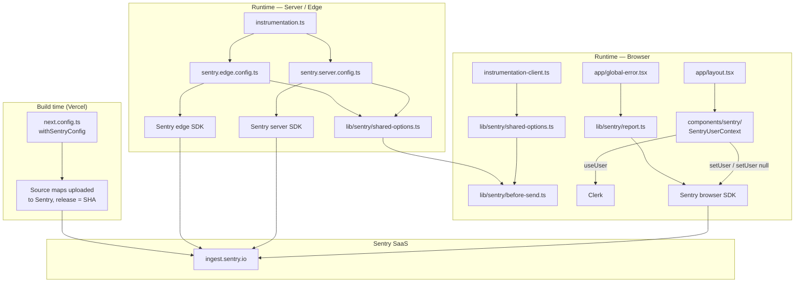
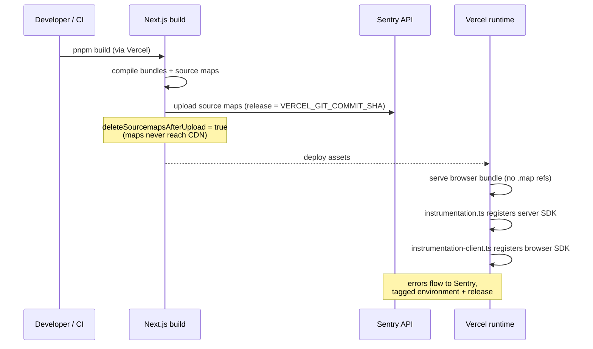

# Design Document

## Overview

Wire `@sentry/nextjs` into `apps/web` so that browser, React-render, and Next.js server-side / edge errors are captured by Sentry, with environment + release tagging, PII redaction, and source-map uploads at Vercel build time. The integration follows the Sentry-recommended file conventions for Next.js 15 App Router, plus a small `lib/sentry/` module that owns the redaction logic and the shared reporter used by error boundaries — keeping the testable surface area separate from SDK boilerplate.

No existing application code (Server Components, layouts, route handlers, middleware) is modified beyond two surgical additions: wrapping `next.config.ts` with `withSentryConfig`, and mounting one Clerk-aware client component inside the root layout. Documentation changes go to `.env.example` and `CLAUDE.md`.

## Steering Document Alignment

### Technical Standards (tech.md)

- **Frontend layer**: Sentry sits exclusively in the `apps/web` Next.js app — the "Frontend — Web" row in `tech.md`'s stack table. No change to the API, database, AI, or background-jobs layers.
- **"Web now, mobile later"**: Sentry config is local to `apps/web`. When the Expo app is added in Phase 4, it can install `@sentry/react-native` independently using the same redaction and user-scope conventions defined here.
- **Cost discipline**: only `errors` are sampled (100%); `tracesSampleRate`, replay, and profiling are deliberately omitted. Sentry's free tier (~5k events/month) is the design budget.
- **Security checklist alignment** (`tech.md` §12): `SENTRY_AUTH_TOKEN` is treated like the Anthropic key — server-side only, never `NEXT_PUBLIC_`. Input/output to third parties is sanitized (the `beforeSend` redactor).

### Project Structure (structure.md)

No `structure.md` is present in `.claude/steering/`. The design follows the de facto conventions visible in `apps/web`:

- Co-locate route-tree files under `apps/web/app/`
- Co-locate shared client/server utilities under `apps/web/lib/`
- Co-locate UI under `apps/web/components/`
- Tests live in `__tests__/` directories next to the code under test (matches `apps/web/lib/__tests__/`)

## Code Reuse Analysis

### Existing Components to Leverage

- **`apps/web/components/ui/button.tsx`** (`Button`): used in the `global-error.tsx` fallback so the error UI matches existing visual language. Variants `primary` and `default` already cover "retry" and "go home" affordances.
- **`apps/web/lib/cn.ts`** (`cn`): className composition for the fallback layout.
- **`@clerk/nextjs` `useUser()`**: read the signed-in Clerk user ID inside the new `SentryUserContext` client component — same hook used elsewhere in the shell.
- **`vitest` + `apps/web/vitest.config.ts`**: existing test runner; the new `before-send.test.ts` plugs into the existing config with no setup changes.

### Integration Points

- **`apps/web/next.config.ts`**: wrap the existing config object with `withSentryConfig(...)`. The current `transpilePackages` setting is preserved unchanged.
- **`apps/web/app/layout.tsx`**: mount a single `<SentryUserContext />` client component inside `<ClerkProvider>` so it has access to Clerk state. No other changes — `metadata`, fonts, `Providers` all untouched.
- **`apps/web/middleware.ts`**: no edit. The Edge runtime instrumentation hooks middleware via the Next.js `instrumentation` mechanism, not by wrapping the matcher.
- **`.env.example`**: append a new "Sentry — frontend error tracking" block alongside the existing Langfuse block.
- **`CLAUDE.md`**: add Sentry to the observability list. One-line scope statement: "frontend only — Lambda errors remain in CloudWatch."

## Architecture

The design uses a thin SDK-config layer (Sentry's own conventional files) plus a small custom module that owns the logic worth unit-testing.



**Design patterns used:**

- **Single source of truth for init options** (`lib/sentry/shared-options.ts`): the three SDK init files all call the same factory, so DSN/env/release/`beforeSend` are defined once.
- **Pure function for redaction** (`lib/sentry/before-send.ts`): the only logic that warrants tests is the redactor; it takes an event in, returns an event (or the original on internal failure). No SDK state required.
- **Boundary helper** (`lib/sentry/report.ts`): error boundaries call `reportBoundaryError(error, 'global' | 'segment')` — a thin wrapper around `Sentry.captureException` that adds a `boundary` tag. Centralizes capture behavior so adding new `error.tsx` segments later doesn't drift.
- **Vercel-env-driven config**: environment and release come from `VERCEL_ENV` and `VERCEL_GIT_COMMIT_SHA` — no hardcoded branches.

## Components and Interfaces

### Component 1: `lib/sentry/shared-options.ts`

- **Purpose:** Single factory returning the SDK init options common to browser, server, and edge runtimes.
- **Interfaces:**
  - `getSharedSentryOptions(): SharedSentryOptions` — returns `{ dsn, environment, release, sendDefaultPii: false, enabled, beforeSend }`.
  - Internal helpers: `resolveEnvironment()` (reads `VERCEL_ENV`; falls back to `'development'`); `resolveRelease()` (reads `VERCEL_GIT_COMMIT_SHA`; returns `undefined` if missing).
- **Dependencies:** `process.env` only. No Sentry SDK import (keeps it test-friendly and runtime-agnostic).
- **Reuses:** Nothing — new module.

### Component 2: `lib/sentry/before-send.ts`

- **Purpose:** PII-safe `beforeSend` hook. Walks event payloads and redacts learner-content fields; strips query-string values from `request.url` / `request.query_string`. Also strips query-string values from `breadcrumbs[].data.url` for `fetch` / `xhr` breadcrumbs (which carry request URLs that may include exercise IDs or tokens), while preserving the URL path so the API call shape stays debuggable. Navigation breadcrumbs are left untouched per Req 5.3. (Implements Req 5.)
- **Interfaces:**
  - `beforeSend(event: Sentry.ErrorEvent): Sentry.ErrorEvent | null` — never returns `null` for these rules (we still want to send, just redacted).
  - Internal helpers: `redactObject(value: unknown): unknown` (recursive, handles arrays and plain objects, leaves primitives alone); `redactUrlQuery(url: string): string`; `redactBreadcrumbUrl(breadcrumb): Breadcrumb` (only affects `category: 'fetch' | 'xhr'`).
  - Exported constant: `REDACTED_KEYS: ReadonlySet<string>` (lower-cased) — used by both the redactor and the tests so tests don't drift from the implementation.
- **Dependencies:** `@sentry/nextjs` types only (no runtime SDK imports — the function is pure).
- **Reuses:** Nothing.

### Component 3: `lib/sentry/__tests__/before-send.test.ts`

- **Purpose:** Vitest suite covering each redaction case — one test per `REDACTED_KEYS` entry, plus URL stripping, plus a non-redaction case. (Implements Req 5.5.)
- **Interfaces:** Vitest `describe`/`it`. Imports `beforeSend` + `REDACTED_KEYS` from the module under test.
- **Dependencies:** `vitest`.
- **Reuses:** Existing vitest config — no setup changes.

### Component 4: `lib/sentry/report.ts`

- **Purpose:** Single entry point used by `global-error.tsx` (and any future segment `error.tsx`) to report a render error. Adds a `boundary` tag for triage. (Implements Req 2.1 / 2.3 / 2.4.)
- **Interfaces:**
  - `reportBoundaryError(error: Error & { digest?: string }, boundary: 'global' | 'segment'): void`
- **Dependencies:** `@sentry/nextjs` (browser SDK — boundaries always run client-side).
- **Reuses:** Nothing.

### Component 5: `instrumentation-client.ts` (file at `apps/web/instrumentation-client.ts`)

- **Purpose:** Browser-side Sentry init. The Next.js 15.3+ convention (replaces the legacy `sentry.client.config.ts`). Picked up automatically by Next.js when present at the app root.
- **Interfaces:** Module side-effect — calls `Sentry.init(getSharedSentryOptions())`. Also exports `onRouterTransitionStart = Sentry.captureRouterTransitionStart` for breadcrumb continuity across App Router navigations.
- **Dependencies:** `@sentry/nextjs`, `lib/sentry/shared-options.ts`.
- **Reuses:** `getSharedSentryOptions`.

### Component 6: `instrumentation.ts` (file at `apps/web/instrumentation.ts`)

- **Purpose:** Next.js's server/edge instrumentation hook. Conditionally imports `sentry.server.config.ts` or `sentry.edge.config.ts` based on `process.env.NEXT_RUNTIME`. Also exports `onRequestError` (the Sentry-provided Next.js hook that captures Server Component / Server Action errors automatically).
- **Interfaces:**
  - `export async function register(): Promise<void>`
  - `export const onRequestError = Sentry.captureRequestError`
- **Dependencies:** `@sentry/nextjs`.
- **Reuses:** Nothing.

### Component 7: `sentry.server.config.ts` and `sentry.edge.config.ts`

- **Purpose:** Per-runtime init files imported from `instrumentation.ts`. Both call `Sentry.init(getSharedSentryOptions())`. Kept as two files (instead of one) because Sentry's CLI tooling and the Next.js framework integration expect them.
- **Interfaces:** Module side-effect — `Sentry.init(...)`.
- **Dependencies:** `@sentry/nextjs`, `lib/sentry/shared-options.ts`.
- **Reuses:** `getSharedSentryOptions`.

### Component 8: `app/global-error.tsx`

- **Purpose:** Next.js global error boundary. Required as a separate file by Next.js when the root layout throws. Calls `reportBoundaryError(error, 'global')` in a `useEffect`, then renders a minimal fallback using the existing `Button` component.
- **Interfaces:**
  - Default-export React component with signature `({ error, reset }: { error: Error & { digest?: string }; reset: () => void })`.
  - Must include its own `<html>` and `<body>` because it replaces the root layout when active (Next.js requirement).
- **Dependencies:** `react`, `lib/sentry/report.ts`, `components/ui/button.tsx`.
- **Reuses:** `Button` (variant `primary` for "Try again" → `reset()`, `default` for "Go to dashboard" → `href="/"`).

### Component 9: `components/sentry/sentry-user-context.tsx`

- **Purpose:** Client component, rendered inside `<ClerkProvider>`, that observes Clerk's auth state and updates Sentry's user scope. Renders nothing. (Implements Req 6.)
- **Interfaces:** Default-export `function SentryUserContext(): null`. Uses `useUser()` from `@clerk/nextjs`. The effect MUST gate on `isLoaded` and return early when it is `false` — otherwise Clerk's initial hydration tick would briefly call `Sentry.setUser(null)`, falsely attributing any error in that window to an anonymous user. Once `isLoaded` is `true`: if `user` exists, call `Sentry.setUser({ id: user.id })`; otherwise call `Sentry.setUser(null)`.
- **Dependencies:** `react`, `@clerk/nextjs`, `@sentry/nextjs`.
- **Reuses:** Existing `useUser` pattern.

### Component 10: `next.config.ts` (modification)

- **Purpose:** Wrap the existing exported config with `withSentryConfig` so source maps are uploaded at build time and the SDK is initialized correctly for App Router.
- **Interfaces:** `export default withSentryConfig(nextConfig, { org, project, authToken, silent: !process.env.CI, widenClientFileUpload: true, sourcemaps: { deleteSourcemapsAfterUpload: true }, release: { name: process.env.VERCEL_GIT_COMMIT_SHA }, disableLogger: true })`.
- **Notes:** The `release.name` value MUST be the same identifier returned by `resolveRelease()` in `shared-options.ts`. Both sides read `VERCEL_GIT_COMMIT_SHA`, so they cannot drift, but they must both be present — the runtime side associates events with the release; the build side associates source maps with the release. Without both, Sentry will fail to deminify stack traces.
- **Dependencies:** `@sentry/nextjs`.
- **Reuses:** The existing `nextConfig` object — appended to, never replaced.

### Component 11: `app/layout.tsx` (modification)

- **Purpose:** Mount `<SentryUserContext />` inside `<ClerkProvider>` so user scope tracking starts at first paint.
- **Interfaces:** No prop changes.
- **Reuses:** Existing ClerkProvider / Providers structure.

### Component 12: `.env.example` and `CLAUDE.md` (modifications)

- **Purpose:** Document the env contract. (Implements Req 9.) Also enforces Req 8.3 — the `.env.example` Sentry block MUST include a comment, modeled on the existing Langfuse block, instructing developers that local `NEXT_PUBLIC_SENTRY_DSN` MUST point at a dev Sentry project, never the production one. This is an env-config policy enforced socially via documentation (no runtime check is feasible since the SDK has no knowledge of which DSN is "the prod one").
- **Reuses:** Existing block formatting (mirrors Langfuse and Anthropic sections).

## Data Models

This integration sends events to Sentry; it does not create persistent data structures. Two object shapes are worth pinning:

### `SharedSentryOptions`

```
SharedSentryOptions
- dsn: string | undefined          // NEXT_PUBLIC_SENTRY_DSN; undefined disables SDK
- environment: 'production' | 'preview' | 'development'
- release: string | undefined      // VERCEL_GIT_COMMIT_SHA when present
- sendDefaultPii: false
- enabled: boolean                 // false when dsn is undefined
- beforeSend: (event: ErrorEvent) => ErrorEvent | null
```

### `RedactionPolicy` (constants in `before-send.ts`)

```
REDACTED_KEYS: ReadonlySet<string>  // lower-cased, exact-match
  = { 'answer', 'answers', 'useranswer',
      'response', 'submission', 'submissions',
      'transcript', 'passage',
      'usertext', 'writtentext', 'freewriting' }
REDACTED_VALUE: string = '[redacted]'
```

## Error Handling

### Error Scenarios

1. **DSN missing at build/runtime.**
   - **Handling:** `getSharedSentryOptions` returns `enabled: false` and `dsn: undefined`; `Sentry.init` short-circuits to a no-op. `withSentryConfig` source-map upload is also skipped when `SENTRY_AUTH_TOKEN` is missing.
   - **User Impact:** None — app behaves identically.

2. **`SENTRY_AUTH_TOKEN` missing during Vercel build.**
   - **Handling:** `withSentryConfig` logs a warning and skips source-map upload. Build succeeds. (Req 7.2.)
   - **User Impact:** None at runtime. In Sentry, stack traces will be minified for events from that deployment.

3. **`beforeSend` throws.**
   - **Handling:** Wrap the redactor body in a defensive try/catch — return the original event on failure so the user's debugging trail isn't lost. The SDK's own error handler also swallows throws, but explicit guards make the failure visible during local testing.
   - **User Impact:** None.

4. **Sentry ingest unreachable / rate-limited.**
   - **Handling:** Sentry SDK's internal queue + retry handles it; events drop silently when the queue fills. No app code intervention.
   - **User Impact:** None.

5. **Clerk user changes (sign-out → sign-in different account).**
   - **Handling:** `SentryUserContext` calls `Sentry.setUser(null)` on sign-out (so subsequent anonymous events are not falsely attributed) and `Sentry.setUser({ id })` on the next sign-in. Re-runs whenever `useUser`'s returned identity changes.
   - **User Impact:** None.

6. **Error thrown inside `global-error.tsx` itself.**
   - **Handling:** The boundary uses only `React`, the `Button` component, and the reporter. The reporter uses a try/catch internally. If the fallback fails to render, the browser shows its native error page — acceptable last resort.
   - **User Impact:** Worst-case generic browser error page; same as today without Sentry.

## Testing Strategy

### Unit Testing

- **`lib/sentry/__tests__/before-send.test.ts`** (must-have, per Req 5.5):
  - One test per entry in `REDACTED_KEYS` (asserts value is replaced with `[redacted]` when the key appears in `extra`, `contexts`, and `request.data`).
  - One test for case-insensitive matching (`USERANSWER`, `Answer`).
  - One test that benign keys (`responseTime`, `apiResponse`) are **not** redacted.
  - One test for URL stripping: `request.url` with `?foo=bar&baz=qux` → keys preserved, values gone.
  - One test that an event with no matching keys is returned unchanged.
  - One test that `beforeSend` returns the original event if its redactor throws (e.g. on a non-object event).
- **`lib/sentry/__tests__/shared-options.test.ts`**:
  - `resolveEnvironment` returns the right value for each `VERCEL_ENV` (`production`, `preview`, missing → `development`).
  - `resolveRelease` returns `undefined` when `VERCEL_GIT_COMMIT_SHA` is absent.

No SDK is mocked or imported in the test — the pure functions take and return plain data.

### Integration Testing

- Manual smoke after merge to a preview deploy: trigger a one-off `throw new Error('sentry-smoke')` from a hidden dev-only path (or use Sentry's "Send Test Event" button) to confirm the round trip (browser → ingest → inbox, with correct environment + release).
- No automated integration test is added — wiring a real Sentry transport into vitest would require mocking the SDK and would only re-verify SDK internals.

### End-to-End Testing

- Not added. The end-to-end behavior of "production error reaches Sentry" is only meaningfully verifiable against a real Sentry project, which is best done via Sentry's UI tooling once per release.

## Build / Deploy Sequence



## File Inventory (final set)

**New files (10):**

| Path | Purpose |
|---|---|
| `apps/web/instrumentation.ts` | Next register() hook, routes to server/edge config |
| `apps/web/instrumentation-client.ts` | Next 15.3+ browser init + router-transition hook |
| `apps/web/sentry.server.config.ts` | Server runtime `Sentry.init` |
| `apps/web/sentry.edge.config.ts` | Edge runtime `Sentry.init` |
| `apps/web/app/global-error.tsx` | Global error boundary + reporter call + fallback UI |
| `apps/web/lib/sentry/shared-options.ts` | Init options factory (env, release, dsn, beforeSend) |
| `apps/web/lib/sentry/before-send.ts` | PII redactor (pure function) |
| `apps/web/lib/sentry/report.ts` | `reportBoundaryError` helper for error boundaries |
| `apps/web/lib/sentry/__tests__/before-send.test.ts` | Vitest suite for redactor |
| `apps/web/lib/sentry/__tests__/shared-options.test.ts` | Vitest suite for env/release resolvers |
| `apps/web/components/sentry/sentry-user-context.tsx` | Clerk → Sentry user scope sync |

**Modified files (5):**

| Path | Change |
|---|---|
| `apps/web/next.config.ts` | Wrap with `withSentryConfig(...)` |
| `apps/web/app/layout.tsx` | Mount `<SentryUserContext />` inside `<ClerkProvider>` |
| `apps/web/package.json` | Add `@sentry/nextjs` dependency |
| `.env.example` | Append `NEXT_PUBLIC_SENTRY_DSN` and `SENTRY_AUTH_TOKEN` block |
| `CLAUDE.md` | Add Sentry row to observability description |

(`apps/web/middleware.ts` is not modified — Edge instrumentation is registered via the framework hook, not by editing middleware.)
