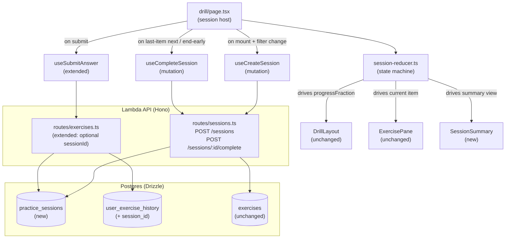

# Design Document

## Overview

Phase E wraps the existing single-exercise drill page in a session container. A session is a server-tracked entity holding a manifest of N pre-selected exercises (default 5) bound to one `(language, difficulty)` filter. Submitting items advances a top progress bar; the last item routes to a lightweight summary screen.

The design is deliberately additive:
- **Existing exercise renderers, evaluation flow, theory panel, and feedback shells are unchanged.** Phase E only inserts state above them.
- **One new DB table (`practice_sessions`) and one new column (`user_exercise_history.session_id`).** No data migrations of existing rows.
- **Two new API routes (`POST /sessions`, `POST /sessions/:id/complete`).** The submit route gains an optional `sessionId` body field.
- **One new client state machine (session reducer)** owning `(manifest, currentIndex, perItemSubmissionState)`.

The summary screen is intentionally minimal — Phase G later replaces it with the rich debrief view (per-item review tabs + skill deltas) without further server changes.

## Steering Document Alignment

### Technical Standards (`tech.md`)

- **Hono + Zod + Drizzle** for the new `/sessions` routes — same pattern as `routes/exercises.ts` and `routes/profiles.ts`.
- **Forward-only Drizzle migrations** (`packages/db/migrations/0003_*.sql`). The `session_id` column is nullable, so existing `user_exercise_history` rows remain valid (Req 5.2).
- **TanStack Query mutations** for `useCreateSession` / `useCompleteSession`. Existing `useExercise` / `useSubmitAnswer` are preserved for mobile-app reuse (Req 7.3).
- **Zod schemas live in `packages/api-client/src/schemas/`**, shared with the API via `packages/shared`.
- **Lambda monolith stays single-route-tree** — `/sessions` is registered in `infra/lambda/src/index.ts` alongside existing route modules.
- **No streak / XP** anywhere in the data model or API contract. The summary endpoint returns `correctCount`, `attemptedCount`, `skippedCount`, `durationSeconds` only (`CLAUDE.md` hard rule).

### Project Structure

- **Backend route module:** `infra/lambda/src/routes/sessions.ts` (peer of `exercises.ts`, `profiles.ts`).
- **DB schema module:** `packages/db/src/schema/sessions.ts` (peer of `progress.ts`).
- **Shared constant:** `CORRECT_THRESHOLD` exported from `@language-drill/shared` (justifies the `0.7` cutoff in Req 5.6 and aligns with the `solid` tier in `apps/web/lib/drill/verdict-tier.ts`).
- **Web route-private code:** stays under `apps/web/app/(dashboard)/drill/_components/`. New files: `session-reducer.ts`, `session-summary.tsx`. Page `page.tsx` is rewritten as a session host.
- **Web helper:** `apps/web/lib/drill/session-config.ts` exports `DEFAULT_EXERCISE_COUNT = 5` (Req NFR Usability).
- **API client:** new `packages/api-client/src/schemas/session.ts` and `packages/api-client/src/hooks/useSession.ts`.

## Code Reuse Analysis

### Existing Components to Leverage

- **`DrillLayout`** (`apps/web/app/(dashboard)/drill/_components/drill-layout.tsx`) — already accepts `progressFraction`. We just compute and pass a non-zero value.
- **`ExercisePane`, `ClozeExercise`, `TranslationExercise`, `VocabExercise`, `FeedbackShell`** — render the current item exactly as today; they receive one exercise + one submission state at a time.
- **`CoachRail`, `coachMessage()`** — same idle/evaluated branches per item.
- **`SubmissionErrorCard`** (currently inline in `page.tsx`) — promote to a shared component and extend with optional session-aware buttons (Req 6.1, 6.2).
- **`useLanguageProfiles`, `useActiveLanguage`** — drive the initial `(language, difficulty)` for session creation (Req 1.2).
- **`useSubmitAnswer`** — extended to thread an optional `sessionId` through the existing mutation. The hook signature stays backward-compatible (mobile app may continue passing no `sessionId`).
- **`createAuthenticatedFetch`** — used unchanged by the new session hooks.
- **`authMiddleware`** (`infra/lambda/src/middleware/auth.ts`) — applied to `/sessions/*` the same way it is applied to `/exercises/*`.
- **`db` client** (`infra/lambda/src/db.ts`) — single Drizzle client; new route imports it.

### Integration Points

- **`POST /exercises/:id/submit`** gains an optional `sessionId`. The route fetches the session, validates ownership and membership, then proceeds. On insert into `user_exercise_history` the route also writes `session_id`.
- **`user_exercise_history` index** — existing index `(userId, evaluatedAt)` (no direction; see `progress.ts:18-21`) is unrelated to session lookups. We add **one new index** `(sessionId)` to make the completion query (count rows by `sessionId`) O(N) where N = manifest size.
- **`usageEvents`** behavior is unchanged — still incremented per evaluation regardless of session context.
- **`activeLanguage` cookie / context** continues to drive the page's default filter; Phase E does not introduce its own persistence (the cookie is enough).

## Architecture



### Client state machine

Implemented in `session-reducer.ts` as a `useReducer` reducer. Per-item submission state (`SubmissionState` from `_components/types.ts`) is folded into the per-item slot of the manifest so navigation can render verdicts already shown for the current item.

```
SessionState =
  | { kind: 'idle' }                                    // before first POST /sessions
  | { kind: 'creating' }                                // POST /sessions in flight
  | { kind: 'createError', error: Error }
  | { kind: 'inSession', session, items, index, perItemSubmission, skippedCount }
  | { kind: 'completing' }                              // POST /sessions/:id/complete in flight
  | { kind: 'summary', summary: CompleteSessionResponse }

Actions:
  CREATE_REQUESTED → idle/createError → creating
  CREATE_SUCCEEDED { session, items } → inSession (index 0, perItemSubmission idle)
  CREATE_FAILED { error } → createError
  ITEM_SUBMITTING → inSession (perItemSubmission submitting)
  ITEM_EVALUATED { result, meta } → inSession (perItemSubmission evaluated)
  ITEM_ERROR { error } → inSession (perItemSubmission error)
  ITEM_NEXT → inSession (index+1, perItemSubmission idle)
              guards: index < count-1, perItemSubmission.kind === 'evaluated'
  ITEM_SKIP → inSession (index+1, perItemSubmission idle, skippedCount+1)
              guards: perItemSubmission.kind === 'error'
  COMPLETE_REQUESTED → completing
  COMPLETE_SUCCEEDED { summary } → summary
  COMPLETE_FAILED { error } → inSession (per-item submission unchanged; page shows complete-error card)
  RESET → idle    // used for both "another session" (from summary) and selector change.
                  // The page effect re-fires CREATE_REQUESTED on next render when state is idle and profiles are ready.
                  // Profile / activeLanguage changes while in `summary` also dispatch RESET — the user is bounced
                  // to a fresh session for the new filter rather than left on the prior summary.
```

Note: the existing `useSubmitAnswer.onSuccess` invalidates `['exercise']`. With sessions, the page no longer uses `useExercise`, so this invalidation is effectively a no-op for the new flow. We leave it intact for backward compatibility (mobile app may still depend on it via `useExercise`).

The reducer holds the **full ordered manifest** (array of `ExerciseResponse`); the page renders only `items[index]`. This is what enables the page initial-render NFR (≤ 100ms after `POST /sessions` resolves — no per-item fetch).

## Components and Interfaces

### Backend

#### `infra/lambda/src/routes/sessions.ts` (new)

- **Purpose:** Owns all `/sessions` routes; uses Drizzle to manipulate `practiceSessions` and to read manifests from `exercises`.
- **Interfaces:**
  - `POST /sessions` → body `CreateSessionRequest`, response `CreateSessionResponse`
  - `POST /sessions/:id/complete` → response `CompleteSessionResponse`
- **Dependencies:** `db`, `authMiddleware`, `practiceSessions` table, `exercises` table, `userExerciseHistory` table, `Language`/`CefrLevel` enums, `CORRECT_THRESHOLD`.
- **Reuses:** mounting pattern from `routes/exercises.ts`; `authMiddleware` exactly as registered there; `count()` aggregate from Drizzle (already used in `exercises.ts:142`).
- **Concurrency control on complete:** the completion endpoint MUST write atomically. Implementation pattern:
  ```ts
  const updated = await db.update(practiceSessions)
    .set({ completedAt: now, correctCount })
    .where(and(
      eq(practiceSessions.id, id),
      eq(practiceSessions.userId, userId),
      isNull(practiceSessions.completedAt),       // race-safe guard
    ))
    .returning({ id: practiceSessions.id });
  if (updated.length === 0) return c.json({ error, code: 'INVALID_SESSION' }, 400);
  ```
  This eliminates the read-then-write race the validator flagged: a second concurrent complete sees `completedAt IS NOT NULL` and the UPDATE matches zero rows.
- **`correctCount` / `attemptedCount` query:** computed in a single query before the UPDATE — `SELECT count(DISTINCT exercise_id) FILTER (WHERE score >= $threshold), count(DISTINCT exercise_id) FROM user_exercise_history WHERE session_id = $id`. Distinct because retry resubmissions write multiple history rows for one item.

#### `infra/lambda/src/routes/exercises.ts` (modify)

- **Purpose:** Extend `POST /exercises/:id/submit` to accept optional `sessionId`.
- **Interfaces (new bits only):**
  - `SubmitAnswerSchema` adds `sessionId: z.string().uuid().optional()`.
  - When `sessionId` is present, route validates: `practice_sessions.userId === c.get('userId')`, `completed_at IS NULL`, and `:id IN exercise_ids`. Failures return HTTP 400 `INVALID_SESSION` **before** the rate-limit check or the Claude call (Req 5.4).
  - `userExerciseHistory.insert` includes `sessionId` when valid.
- **Reuses:** existing rate-limit check, Claude call, history insert, usage-event insert.

#### `packages/db/src/schema/sessions.ts` (new)

```ts
export const practiceSessions = pgTable(
  'practice_sessions',
  {
    id: uuid('id').primaryKey().defaultRandom(),
    userId: text('user_id').references(() => users.id).notNull(),
    language: text('language').notNull(),
    difficulty: text('difficulty').notNull(),
    exerciseCount: smallint('exercise_count').notNull(),
    correctCount: smallint('correct_count').notNull().default(0),
    exerciseIds: jsonb('exercise_ids').$type<string[]>().notNull(),
    startedAt: timestamp('started_at', { withTimezone: true }).notNull().defaultNow(),
    completedAt: timestamp('completed_at', { withTimezone: true }),
  },
  (table) => ({
    userIdStartedAtIdx: index('practice_sessions_user_id_started_at_idx').on(
      table.userId,
      table.startedAt,
    ),
  }),
);
```

#### `packages/db/src/schema/progress.ts` (modify)

Add nullable `session_id` column with FK + `ON DELETE SET NULL` + index:

```ts
sessionId: uuid('session_id').references(() => practiceSessions.id, { onDelete: 'set null' }),
// ... in third-arg callback:
sessionIdIdx: index('user_exercise_history_session_id_idx').on(table.sessionId),
```

`ON DELETE SET NULL` keeps history rows readable for progress queries even if a session row is later purged. `practiceSessions` is imported from `./sessions` at the top of `progress.ts`; circular import is avoided because `sessions.ts` only imports `users`, not `progress`.

#### `packages/db/src/schema/index.ts` (modify)

Add `export { practiceSessions } from './sessions';`.

#### `packages/db/migrations/0003_*.sql` (new)

Generated by `drizzle-kit generate`. Hand-verifies to:
1. `CREATE TABLE IF NOT EXISTS practice_sessions (...)` per existing migration style (`0002_sweet_bucky.sql`), with FK on `user_id` wrapped in the `DO $$ ... EXCEPTION ... END $$` pattern.
2. `ALTER TABLE user_exercise_history ADD COLUMN session_id uuid` plus a `DO $$ ... ALTER TABLE ... ADD CONSTRAINT ... FOREIGN KEY (session_id) REFERENCES practice_sessions(id) ON DELETE SET NULL ... END $$;` block.
3. `CREATE INDEX IF NOT EXISTS` for both new indexes.

#### `packages/shared/src/index.ts` (modify)

Export `CORRECT_THRESHOLD = 0.7`. Used by both:
- `infra/lambda/src/routes/sessions.ts` (server-side `correctCount` computation)
- `apps/web/lib/drill/verdict-tier.ts` (replace the inline `0.7` literal in `clozeVerdict` etc. — safe drop-in since values match)

### API client

#### `packages/api-client/src/schemas/session.ts` (new)

```ts
export const CreateSessionRequestSchema = z.object({
  language: z.nativeEnum(Language),
  difficulty: z.nativeEnum(CefrLevel),
  exerciseCount: z.number().int().min(1).max(20),
});

export const CreateSessionResponseSchema = z.object({
  id: z.string().uuid(),
  exercises: z.array(ExerciseResponseSchema),
});

export const CompleteSessionResponseSchema = z.object({
  id: z.string().uuid(),
  exerciseCount: z.number().int(),
  correctCount: z.number().int(),
  attemptedCount: z.number().int(),
  skippedCount: z.number().int(),
  durationSeconds: z.number().int(),
});
```

#### `packages/api-client/src/hooks/useSession.ts` (new)

```ts
export function useCreateSession({ fetchFn }: { fetchFn: AuthenticatedFetch }) { /* mutation → POST /sessions */ }
export function useCompleteSession({ fetchFn }: { fetchFn: AuthenticatedFetch }) { /* mutation → POST /sessions/:id/complete */ }
```

#### `packages/api-client/src/hooks/useExercise.ts` (modify)

`SubmitAnswerParams` gains optional `sessionId`. The mutation body conditionally includes it. No breaking change for existing callers (the dev page may pass `undefined`).

### Web

#### `apps/web/app/(dashboard)/drill/_components/session-reducer.ts` (new)

- **Purpose:** Pure reducer + types for the state machine described above.
- **Exports:** `SessionState`, `SessionAction`, `sessionReducer`, `initialSessionState`, helper selectors `selectCurrentItem(state)`, `selectProgressFraction(state)`, `selectIsLastItem(state)`.
- **Dependencies:** none beyond TS types from `@language-drill/shared` and `@language-drill/api-client`.
- **Reuses:** `SubmissionState` and `SubmissionMeta` from `_components/types.ts`.
- **Tested in isolation** with Vitest.

#### `apps/web/app/(dashboard)/drill/_components/session-summary.tsx` (new)

- **Purpose:** Render the lightweight summary view (Req 4).
- **Props:** `{ summary: CompleteSessionResponse, onAnother: () => void, onDone: () => void }`.
- **Structure:** uses `Card`, `Button`, `Bar` primitives + existing tokens. Single congratulatory line via `coachMessage({ kind: 'sessionComplete', accuracy })` — extend the existing helper rather than introducing a parallel one.
- **Output:** progress bar at 1.0 (rendered by parent `DrillLayout`); summary card with "X of Y · Z%" line; CTAs "another session" / "done".

#### `apps/web/app/(dashboard)/drill/_components/submission-error-card.tsx` (new — extracted)

- **Purpose:** The current `SubmissionErrorCard` is a top-level function inline in `page.tsx` (lines 87–103). We extract it to its own module and extend it to support session-aware actions.
- **Props:** `{ error: Error, onRetry: () => void, onSkip?: () => void, onEndSession?: () => void }`.
- **Behavior:** Rate-limit (HTTP 429 / `RATE_LIMIT_EXCEEDED`) shows "end session early" iff `onEndSession` provided; non-rate-limit errors show "skip item" iff `onSkip` provided; otherwise behaves as today (just "try again").
- **Reuses:** `Card`, `Button`.

#### `apps/web/app/(dashboard)/drill/page.tsx` (rewrite)

Page is now a thin orchestrator:

1. Reads `activeLanguage`, profiles, fetchFn (unchanged).
2. Picks initial `(language, difficulty)` from profiles (unchanged Selectors UI).
3. Holds `useReducer(sessionReducer, initialSessionState)`.
4. On mount with profiles ready, dispatches `CREATE_REQUESTED` and calls `useCreateSession.mutate({ language, difficulty, exerciseCount: DEFAULT_EXERCISE_COUNT })`.
5. On selector change, dispatches `RESET` then re-creates.
6. On `state.kind === 'inSession'`, renders `ExercisePane` for `selectCurrentItem(state)` with the per-item submission state.
7. Submit handler routes to `useSubmitAnswer({ exerciseId, answer, sessionId: state.session.id })`.
8. "Next" handler dispatches `ITEM_NEXT`; on last item, dispatches `COMPLETE_REQUESTED` + calls `useCompleteSession`.
9. On `state.kind === 'summary'`, renders `<SessionSummary />`.

The page also continues to host the theory panel exactly as today (`openTopicId`, `triggerEl` state); on `ITEM_NEXT` the page resets these alongside the dispatch.

#### `apps/web/lib/drill/coach-messages.ts` (modify)

Add a `sessionComplete` branch returning a single short congratulatory line (e.g., "Nice work — solid session." or scaled by accuracy). Used only by `SessionSummary`.

#### `apps/web/lib/drill/session-config.ts` (new)

```ts
export const DEFAULT_EXERCISE_COUNT = 5;
```

## Data Models

### `practice_sessions`

```
- id: uuid, primary key, defaultRandom
- user_id: text, FK → users.id, not null
- language: text (Language enum), not null
- difficulty: text (CefrLevel enum), not null
- exercise_count: smallint, not null
- correct_count: smallint, not null, default 0
- exercise_ids: jsonb (string[] of exercise UUIDs), not null
- started_at: timestamptz, not null, default now()
- completed_at: timestamptz, nullable
- index: (user_id, started_at) — used for "your recent sessions" queries (future)
```

### `user_exercise_history` (modified)

```
- (existing columns unchanged)
+ session_id: uuid, FK → practice_sessions.id, nullable
+ index: (session_id) — used by completion endpoint to count correct rows by session
```

### Wire models (TypeScript types from Zod schemas)

```
CreateSessionRequest = { language: Language, difficulty: CefrLevel, exerciseCount: number }
CreateSessionResponse = { id: string, exercises: ExerciseResponse[] }
SubmitAnswerRequest = { answer: string, sessionId?: string }       // sessionId added
CompleteSessionResponse = { id, exerciseCount, correctCount, attemptedCount, skippedCount, durationSeconds }
```

## Error Handling

### Error Scenarios

1. **Pool too small for the requested filter (Req 1.6)**
   - **Detection:** server runs `SELECT id FROM exercises WHERE language = ? AND difficulty = ? ORDER BY random() LIMIT N` and checks length.
   - **Handling:** return HTTP 422 `{ error, code: 'INSUFFICIENT_EXERCISES', details: { available, requested } }`.
   - **User Impact:** the existing "no exercises available for X at Y" card renders. Selectors stay interactive so user can choose another difficulty.

2. **`POST /sessions` network/server failure (Req 6.4)**
   - **Detection:** mutation `onError`.
   - **Handling:** reducer transitions to `createError`; page shows error card with "retry" → re-dispatches `CREATE_REQUESTED`.
   - **User Impact:** no exercise pane rendered; clear "we couldn't start your session" message.

3. **Rate-limit during item submit (Req 6.1)**
   - **Detection:** `useSubmitAnswer` mutation rejects with `Error` whose message contains `429` or `rate limit`.
   - **Handling:** per-item submission state moves to `error`; `<SubmissionErrorCard>` renders with `onEndSession` wired up; clicking it dispatches `COMPLETE_REQUESTED` and routes to summary. The session completes normally on the server; the partial accuracy reflects only attempted items.
   - **User Impact:** can wrap up gracefully without losing prior items' history.

4. **Claude / 5xx during item submit (Req 6.2)**
   - **Detection:** mutation rejects with non-429 error.
   - **Handling:** per-item submission state moves to `error`; `<SubmissionErrorCard>` shows "try again" (re-runs `useSubmitAnswer`) and "skip item" (dispatches `ITEM_SKIP`, advances index).
   - **User Impact:** progress bar still advances on skip; summary later shows it as a skipped item.

5. **Invalid sessionId on submit (server-side, Req 5.4)**
   - **Detection:** server query returns no row, or `userId` mismatch, or `:id` not in `exercise_ids`, or `completed_at IS NOT NULL`.
   - **Handling:** HTTP 400 `INVALID_SESSION`. Should never happen via the UI (all values come from the manifest). Logged as a warning server-side. Client surfaces it via the same 5xx code path.
   - **User Impact:** "try again" / "skip item". Re-creating the session via selector changes is the natural escape.

6. **`POST /sessions/:id/complete` failure (server or network)**
   - **Detection:** mutation `onError`.
   - **Handling:** reducer stays in `inSession` (we don't move to `summary` until success); page shows a small error card on the verdict screen with a "retry" button that re-dispatches `COMPLETE_REQUESTED`.
   - **User Impact:** rare case; user can retry once or change selectors to start fresh.

7. **Already-completed session (Req 5.7)**
   - **Detection:** `completed_at IS NOT NULL` at `POST /sessions/:id/complete` time.
   - **Handling:** HTTP 400 `INVALID_SESSION`. The route does NOT recompute `correct_count`; idempotent in the sense of "no double-counting" but explicitly NOT idempotent in returning the prior summary (out of scope for v1; matches Req NFR Security).
   - **User Impact:** error card → retry usually fails; user clicks "another session".

## Testing Strategy

### Unit Testing

- **`session-reducer.ts`** — exhaustive tests for every action × state pairing, including invalid transitions (e.g., `ITEM_NEXT` while `submission.kind !== 'evaluated'` is a no-op). New file `apps/web/app/(dashboard)/drill/_components/__tests__/session-reducer.test.ts`.
- **`SessionSummary`** — render tests: zero-attempted edge case (accuracy `—`), all-correct, mixed, with/without skipped count visible. New file `__tests__/session-summary.test.tsx`.
- **`SubmissionErrorCard`** (extracted) — tests for rate-limit/skip/end-session button visibility based on which props are provided. New file `__tests__/submission-error-card.test.tsx`.
- **API schemas (`session.ts`)** — happy/sad parse tests, mirroring the existing `exercise.test.ts` pattern. New file `packages/api-client/src/schemas/session.test.ts`.
- **API hooks (`useSession.ts`)** — mocked-fetch tests asserting URL, method, body, and parsed response. New file `packages/api-client/src/hooks/useSession.test.ts`.
- **Server route (`sessions.ts`)** — Drizzle integration tests à la `routes/exercises.test.ts`: happy path POST/complete, ownership rejection, insufficient pool 422, double-complete 400. New file `infra/lambda/src/routes/sessions.test.ts`.
- **Modified submit route** — extend `routes/exercises.test.ts` with sessionId-bound cases: valid sessionId writes through, missing sessionId still works, foreign sessionId is rejected.

### Integration Testing

- **Page (`drill/page.test.tsx`)** — extend the existing test (currently focused on single-exercise mode) to cover:
  - Mount → mocked `POST /sessions` resolves → first item visible, progress 1/5.
  - Submit → "next" → second item visible, progress 2/5.
  - Last-item submit → "see results" → summary visible with mocked complete-response.
  - Selector change → session reset and new `POST /sessions`.
  - 429 mid-session → end-session-early flow → summary.
- **DB migration** — `pnpm db:migrate` against a fresh Neon branch as part of CI; verify both new tables/columns exist.

### End-to-End Testing

Out of scope for this phase (no E2E framework wired up in the repo). The page-level integration test plus the unit + route tests provide adequate coverage for v1.
