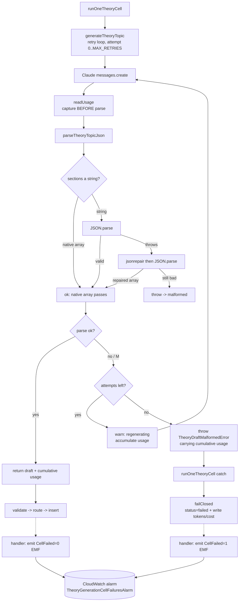

# Design Document

## Overview

The 2026-06-01 weekly theory sweep hard-failed 13 of 36 Turkish cells (36%) because the `submit_theory_topic` tool call returned `sections` as a **malformed** JSON string (unescaped inner double-quotes inside `text` values). The existing decode in `parseTheoryTopicJson` only recovers a *valid* stringified array, so these drafts fell through to `requireNonEmptyArray` and threw. The same run also under-counted cost by ~30% (failed cells wrote `NULL` tokens), produced **zero** alarm signal (the Lambda-`Errors` alarm can't see application-level failures the handler catches and returns from), let deterministically-broken cells re-enqueue weekly (backoff only counts `rejected`, not `failed`), and persisted validator chain-of-thought into `error_message`.

This design addresses all five requirements with **layered defenses** rather than one fix:

1. **Recovery pipeline** for a single returned draft — decode valid stringified JSON → **best-effort** tolerant JSON-repair → regenerate the cell → record `failed`. The repair recovers the simpler unescaped-quote stringifications for free (saving a Claude call); it is *not* relied on for the captured shape, which has multiple unescaped inner quotes that defeat general JSON-repair heuristics (empirically verified — see Component 1). The **regenerate retry is the guaranteed recovery** (temperature 0.4 makes the failure intermittent, so a re-roll usually parses). Source-side prompt hardening lowers the base rate.
2. **Token accounting on failure** — usage is captured immediately after the Claude call (before parsing), propagated through a typed error, summed across retries, and written to the audit row on the failure path.
3. **Application-level alarm** — the handler emits a `CellFailed` CloudWatch metric via Embedded Metric Format (EMF) over the existing `console.log` channel; a new CDK alarm watches it.
4. **Combined backoff** — the scheduler's suppression counter counts `rejected = true OR status = 'failed'` in one aggregate query.
5. **Concise validator reasons** — the validation prompt instructs one final reason per issue.

The work spans four packages: `packages/shared` (parser + repair), `packages/ai` (generator retry loop, prompts), `packages/db` (audit-row token write), `infra/lambda` (handler metric, scheduler backoff), and `infra/lib` (CDK alarm).

## Steering Document Alignment

### Technical Standards (tech.md)

- **Pre-generated content pool is the cost-control bet.** A 36% failure rate leaves Turkish learners an incomplete pool and burns unrecorded tokens. Req 1 restores completeness; Req 2 restores cost visibility — both directly serve the "Cost-controlled: pre-generate reusable content" constraint.
- **Observability boundaries (CLAUDE.md):** "Lambda API errors stay in CloudWatch; LLM traces in Langfuse." The `CellFailed` metric + alarm (Req 3) live in CloudWatch, the correct inbox for an application-level Lambda outcome. No Langfuse or Sentry surface is touched.
- **EMF over `PutMetricData`** honors the serverless/low-latency posture (§2 "minimal cold-start overhead", §7 hot-path cost control): a metric line on the existing stdout channel adds no blocking network round-trip.
- **Package policy (CLAUDE.md):** the one new dependency (`jsonrepair`) is actively maintained (release within the last 6 months), ISC-licensed (permissive, policy-compatible), zero-runtime-dependency, and free of known advisories — it satisfies the "actively maintained, dependency-light" bar.
- **Prompt-editing rule (CLAUDE.md):** both prompt edits bump their `*_PROMPT_VERSION` constants and the validation-prompt change is followed by the documented Langfuse `push-prompts` sync.

### Project Structure (structure.md)

No `structure.md` exists; the monorepo layout in CLAUDE.md/tech.md §4 governs. The change respects every existing boundary:

- Parsing/normalization lives in `packages/shared/src/theory.ts` (where the current decode already lives).
- Generator orchestration and prompts stay in `packages/ai/src/` (`theory-generate.ts`, `theory-prompts.ts`, `theory-validation-prompts.ts`).
- Per-cell DB orchestration stays in `packages/db/src/theory-generation/run-one-cell.ts`.
- Lambda handler + scheduler stay in `infra/lambda/src/theory-generation/`.
- CDK constructs stay in `infra/lib/constructs/`.
- Tests are co-located (`*.test.ts` beside each module), per the "add tests to the existing test file for that module" rule.

## Code Reuse Analysis

### Existing Components to Leverage

- **`parseTheoryTopicJson` (`packages/shared/src/theory.ts:314`)**: extended in place. The existing string-`sections` decode branch (`theory.ts:327-334`) is preserved verbatim (Req 1.1) and gains a `jsonrepair` fallback inside the same `catch`.
- **`ClaudeUsageBreakdown` / `ZERO_USAGE` / `addUsage` / `estimateCostUsd` (`packages/ai/src/cost-model.ts`)** and **`readUsage` (file-private in `theory-generate.ts:339`)**: reused unchanged to capture and sum per-attempt usage. `addUsage` already exists for exactly this "fold usage into a cell total" purpose.
- **`generateTheoryTopic` (`packages/ai/src/theory-generate.ts:356`)**: the Claude-call + parse body is wrapped in a bounded retry loop. The existing malformed-draft throw sites become a typed error.
- **`failClosed` (`packages/db/src/theory-generation/run-one-cell.ts:481`)**: the single failure-path writer — extended to persist token/cost columns (today it writes only `status`/`finishedAt`/`errorMessage`).
- **`log(...)` JSON helper** (present identically in `handler.ts`, `scheduler.ts`): reused for the new `warn` retry line and updated suppression line. EMF is emitted through the same `console.log(JSON.stringify(...))` channel.
- **`buildTheorySystemPrompt` / `buildTheoryValidationSystemPrompt` + `*_SYSTEM_PROMPT_TEMPLATE` byte-parity tests**: prompt edits go into the `*_TEMPLATE` constants so the existing byte-parity test blocks keep the Langfuse template and in-code builder in lock-step.
- **`TheoryGenerationErrorsAlarm` + construct pattern (`infra/lib/constructs/theory-generation-lambda.ts:151`)**: the new alarm mirrors its shape; the existing alarm is retained (Req 3.5).
- **Existing rejection-backoff aggregate query (`scheduler.ts:148-160`)**: extended from a `rejected = true` filter to a combined `rejected OR failed` filter with conditional aggregation — still one `SELECT ... GROUP BY cell_key`.

### Integration Points

- **`theory_generation_jobs` table** (`packages/db/src/schema/theory.ts:104`): no schema change. The failure path now writes the already-existing `input_tokens_used` / `output_tokens_used` / `cost_usd_estimate` columns (Req 2) and the scheduler reads `status` + `rejected` for the combined counter (Req 4). Index `theory_generation_jobs_cell_idx` (cell_key, started_at desc) backs the backoff query unchanged.
- **CloudWatch**: new custom metric namespace `LanguageDrill/TheoryGeneration`, metric `CellFailed`, dimension `env` — consumed by the new alarm.
- **Langfuse**: the `theory-validate-system-prompt` `production` label is re-synced post-merge via `pnpm push-prompts` (operational task, Req 5.3).
- **Anthropic Claude API**: retries issue additional `messages.create` calls on the same model/temperature; no new credentials.

## Architecture

The recovery pipeline is an explicit ordered sequence inside one cell. Repair is best-effort on the captured shape; regenerate is the robust intermittent-failure net; prompt hardening lowers the base rate at the source.



Source-side and scheduler-side defenses sit alongside this flow:

- **Prompt hardening (Req 1.5):** the generation system prompt instructs `sections` as a native array and quote-safe `text` — lowering how often the recovery pipeline is exercised at all.
- **Combined backoff (Req 4):** the weekly scheduler suppresses a cell once `rejected OR failed` rows reach the threshold in-window, so a deterministically-broken cell is bounded over time.

## Components and Interfaces

### Component 1 — `parseTheoryTopicJson` best-effort repair fallback (`packages/shared/src/theory.ts`)

- **Purpose:** recover the *recoverable subset* of malformed stringified `sections` (Req 1.1, 1.2) before the draft is treated as malformed — a cheap fast-path that, when it works, saves a Claude re-roll.
- **Empirical scope (verified):** `jsonrepair@3.x` repairs a stringified array with a **single** unescaped inner quote, but **throws** on the captured 2026-06-01 shape (multiple inner quotes adjacent to `(` `)` `/`, e.g. `"…"var" ("there is / exists") and "yok"…"`). Tested: the requirements-doc fragment → `Colon expected`; a realistic `"var" … "yok"` line → `Object key expected`; a single-inner-quote line → repaired. So repair is **best-effort**; the captured shape is recovered by the **regenerate retry** (Component 2), not here. This is the design decision the user approved over a custom schema-aware re-escaper (which risks silently corrupting learner-facing grammar text).
- **Change:** inside the existing `if (typeof normalized.sections === "string")` branch, keep the `JSON.parse` attempt; on `catch`, attempt `jsonrepair(normalized.sections)` then `JSON.parse` the repaired text. If the result is an array, adopt it; otherwise fall through to the existing `requireNonEmptyArray` error (which throws → the caller treats the draft as malformed → retry). The repair is a **pure, deterministic, in-process transform** (NFR Performance) — `jsonrepair` is a function of its input only, and the `try/catch` makes "can't repair" a clean fall-through, never an uncaught throw.
- **Interface:** signature unchanged — `parseTheoryTopicJson(input: unknown): TheoryTopicJson`. Existing callers untouched.
- **Dependencies:** `jsonrepair` (new dependency on `packages/shared`, which currently depends only on `zod`).
- **Reuses:** existing `requireNonEmptyArray`, `requireString`, block/section parsing.

```ts
// packages/shared/src/theory.ts — inside parseTheoryTopicJson
if (typeof normalized.sections === "string") {
  const decoded = decodeMaybeRepaired(normalized.sections);
  if (Array.isArray(decoded)) normalized.sections = decoded;
}
// ...
// Pure, deterministic. Valid JSON wins first (Req 1.1); jsonrepair is a
// best-effort fallback for simple unescaped-quote shapes (Req 1.2). When it
// can't repair (e.g. the multi-inner-quote 2026-06-01 shape), this returns
// undefined and the caller's requireNonEmptyArray throws (Req 1.7c2/d), which
// drives the regenerate retry — the guaranteed recovery path.
function decodeMaybeRepaired(raw: string): unknown {
  try {
    return JSON.parse(raw);
  } catch {
    try {
      return JSON.parse(jsonrepair(raw));
    } catch {
      return undefined;
    }
  }
}
```

### Component 2 — `generateTheoryTopic` retry loop + typed error (`packages/ai/src/theory-generate.ts`)

- **Purpose:** regenerate a cell on a malformed draft up to a bounded retry budget (Req 1.3, 1.4), capture usage before parsing, sum usage across attempts, and propagate usage on terminal failure (Req 2.1, 2.3).
- **Interface:**
  - `generateTheoryTopic(client, spec, opts?: { maxRetries?: number }): Promise<TheoryGenerateResult>` — new optional `opts.maxRetries` (default `THEORY_GENERATION_MAX_RETRIES`) makes the loop directly unit-testable.
  - `export const THEORY_GENERATION_MAX_RETRIES = 2` — up to 3 total Claude calls (Req 1.3). "Configurable" via the optional param; the constant is the default.
  - `export class TheoryDraftMalformedError extends Error { readonly tokenUsage: ClaudeUsageBreakdown }` — carries cumulative usage at the point of exhaustion (Req 2.1).
- **Behavior:**
  - Top guards (EN language, non-grammar kind) stay **before** the loop — programmer errors, not retryable, no usage.
  - Per attempt: `messages.create` → `readUsage(response)` **immediately** (Req 2.1, captured before parse) → accumulate into `cumulativeUsage` via `addUsage` → parse (tool-use present? right tool? `parseTheoryTopicJson`). On any malformed condition: if attempts remain, emit the `warn` line and continue; else throw `TheoryDraftMalformedError(message, cumulativeUsage)`.
  - On success: return `{ draft, tokenUsage: cumulativeUsage }`. `tokenUsage` is the **sum across all attempts** (Req 2.3 — what gets billed). `draft.metadata.*Tokens` reflect the winning attempt (it describes the draft that landed); a code comment states this split.
  - Retry `warn` line (Req 1.4), emitted via `console.log(JSON.stringify(...))`:
    `{ level: 'warn', cellKey, attempt, message: 'theory draft malformed — regenerating' }`.
    `cellKey` is derived locally from `spec` as `` `${language}:${cefrLevel}:${grammarPoint.key}`.toLowerCase() `` — byte-identical to `buildTheoryCellKey` output without importing `@language-drill/db` (which would be a circular dependency). A comment documents the duplication.
- **Dependencies:** `readUsage` (existing, file-private), `addUsage`, `ClaudeUsageBreakdown`.
- **Reuses:** existing tool-use extraction and malformed-throw messages; the loop wraps them.

### Component 3 — `runOneTheoryCell` failure-path token write (`packages/db/src/theory-generation/run-one-cell.ts`)

- **Purpose:** persist captured usage on the failure path (Req 2.2) instead of `ZERO_USAGE`.
- **Changes (two, both small):**
  1. The generator-throw `catch` (`run-one-cell.ts:213`) reads usage from the typed error: `const tokenUsage = err instanceof TheoryDraftMalformedError ? err.tokenUsage : ZERO_USAGE;` and passes it to `failClosed` (today it passes `ZERO_USAGE`).
  2. `failClosed` (`run-one-cell.ts:481`) computes `inputTokensUsed = inputTokens + cacheCreationInputTokens + cacheReadInputTokens` and `costUsd = estimateCostUsd(tokenUsage)`, and adds `inputTokensUsed`, `outputTokensUsed`, `costUsdEstimate` to the audit-row `.set({...})`. **Fail-open** (NFR Reliability): the token computation is pure and cannot throw; if it ever did, the row still records `status='failed'`. A `try/catch` around the accounting fields guards this.
- **Interface:** `failClosed` signature unchanged (it already receives `tokenUsage`). `TheoryCellResult` unchanged.
- **Reuses:** `estimateCostUsd`, `ClaudeUsageBreakdown`, existing UPDATE machinery. No retry logic here — the loop is entirely in Component 2 (per Req 1.7, the retry loop is covered by `theory-generate.test.ts`).

### Component 4 — `CellFailed` EMF metric (`infra/lambda/src/theory-generation/metrics.ts` + `handler.ts`)

- **Purpose:** emit an application-level failure metric CloudWatch can alarm on (Req 3.1–3.3) without a blocking round-trip.
- **New file `metrics.ts`:**
  ```ts
  const NAMESPACE = 'LanguageDrill/TheoryGeneration';
  const METRIC_NAME = 'CellFailed';
  // succeeded -> 0, failed -> 1, skipped-cost-cap -> no emit (deliberate budget stop, not a failure).
  export function emitCellOutcomeMetric(
    status: TheoryCellResult['status'],
    env: string,
  ): void {
    if (status === 'skipped-cost-cap') return;          // Req 3.1
    const value = status === 'failed' ? 1 : 0;          // Req 3.1 / 3.2
    console.log(JSON.stringify({
      _aws: {
        Timestamp: Date.now(),
        CloudWatchMetrics: [{
          Namespace: NAMESPACE,
          Dimensions: [['env']],
          Metrics: [{ Name: METRIC_NAME }],
        }],
      },
      env,
      [METRIC_NAME]: value,
    }));
  }
  ```
  EMF via stdout is auto-extracted into metrics by CloudWatch Logs — no `PutMetricData` call (Req 3.3, NFR Performance).
- **Handler wiring (`handler.ts`) — exact emit sites:** the handler's success branch (`handler.ts:268-276`) ends in `continue` and the terminal-failure branch (`:281-287`) falls into the `finally`, so the emit cannot be a single post-call site — it goes **inside each branch** on the `result` value:
  - success branch → `emitCellOutcomeMetric('succeeded', env)` (value 0),
  - terminal branch → `emitCellOutcomeMetric(result.status, env)` (value 1 for `'failed'`, no emit for `'skipped-cost-cap'`),
  where `env = process.env.LANGFUSE_ENV ?? 'dev'` (the value already used for `withLlmTrace`).
- **Boundary for the `runOneTheoryCell`-throws path (`handler.ts:253-265`):** that defensive `catch` is reached only when `runOneTheoryCell` *itself throws* (rare — `failClosed` swallows expected errors and returns a result). On that path `result` is undefined and the record is pushed to `batchItemFailures` for SQS redelivery, so **no `CellFailed` is emitted** — the eventual terminal result on redelivery emits it, and a persistently-throwing cell surfaces via the retained Lambda-`Errors` alarm. This is the intended observability boundary: terminal *outcomes* → `CellFailed` metric; unexpected *throws* → Lambda `Errors` alarm. Not emitting here also avoids double-counting across redeliveries.
- **`CellFailed=0` on every success is intended** (Req 3.2): it lets the alarm distinguish "no runs" from "all-passing" rather than relying on metric absence.
- **Reuses:** existing `console.log` channel and `LANGFUSE_ENV` env var; no new SDK import.

### Component 5 — `TheoryGenerationCellFailuresAlarm` (`infra/lib/constructs/theory-generation-lambda.ts`)

- **Purpose:** alarm on application-level cell failures, distinct from Lambda runtime errors (Req 3.4, 3.5).
- **Change:** add a public `cellFailuresAlarm` and construct it on a custom metric. The `env` dimension value is derived from the same expression already in the construct (`props.secretsPrefix === 'language-drill' ? 'prod' : 'dev'`) — **deliberately reusing `secretsPrefix` rather than the available `props.envName`** because `secretsPrefix` is the single source that also sets the Lambda's `LANGFUSE_ENV` env var (construct lines 125-126), which is exactly what the handler emits as the EMF `env` dimension. Reusing it guarantees the alarm's dimension and the runtime metric's dimension are byte-identical; a mismatch would leave the alarm watching a metric stream nothing ever writes to.
  ```ts
  const langfuseEnv = props.secretsPrefix === 'language-drill' ? 'prod' : 'dev';
  this.cellFailuresAlarm = new cloudwatch.Alarm(this, 'TheoryGenerationCellFailuresAlarm', {
    metric: new cloudwatch.Metric({
      namespace: 'LanguageDrill/TheoryGeneration',
      metricName: 'CellFailed',
      dimensionsMap: { env: langfuseEnv },
      period: Duration.days(1),
      statistic: cloudwatch.Stats.SUM,
    }),
    threshold: 5,
    evaluationPeriods: 1,
    comparisonOperator: cloudwatch.ComparisonOperator.GREATER_THAN_OR_EQUAL_TO_THRESHOLD, // >= 5 (Req 3.4)
    treatMissingData: cloudwatch.TreatMissingData.NOT_BREACHING,
    alarmDescription:
      'Phase 4 (theory): >= 5 theory cells failed at the APPLICATION level in one day ' +
      '(malformed/unrecoverable drafts), distinct from the Lambda runtime Errors alarm.',
  });
  ```
- **Retained:** `errorsAlarm` (`TheoryGenerationErrorsAlarm`) is unchanged (Req 3.5).
- **Reuses:** the existing alarm-construction idiom in the same file.

### Component 6 — Combined backoff counter (`infra/lambda/src/theory-generation/scheduler.ts`)

- **Purpose:** count `rejected = true OR status = 'failed'` toward suppression in one aggregate query (Req 4.1–4.4).
- **Change:** the rejection-count query becomes a combined-unproductive query with conditional aggregation, returning both counts in one round-trip:
  ```ts
  const counts = await db
    .select({
      cellKey: theoryGenerationJobs.cellKey,
      unproductive: sql<number>`COUNT(*)::int`,
      rejections: sql<number>`COUNT(*) FILTER (WHERE ${theoryGenerationJobs.rejected} = true)::int`,
    })
    .from(theoryGenerationJobs)
    .where(and(
      or(
        eq(theoryGenerationJobs.rejected, true),
        eq(theoryGenerationJobs.status, 'failed'),
      ),
      gte(theoryGenerationJobs.startedAt, windowStart),
    ))
    .groupBy(theoryGenerationJobs.cellKey);
  ```
  Still a **single aggregate SELECT** over `theory_generation_jobs_cell_idx`, no per-cell queries (Req 4.3). The `WHERE` selects unproductive rows; `rejections` is a `FILTER`ed sub-count of those.
- **Suppression:** a cell is suppressed when `unproductive >= THRESHOLD` (Req 4.2).
- **Log line (Req 4.4):** the suppression `warn` line adds `recentUnproductiveAttempts: <unproductive>` and **retains** `recentRejections: <rejections>` (rejection-only sub-count, so existing operator alerting keyed on `recentRejections` doesn't break). The `message` becomes `'theory cell suppressed by unproductive-attempt backoff'`.
- **Constant rename (Req 4.5, optional — chosen):** rename `THEORY_REJECTION_BACKOFF_THRESHOLD` → `THEORY_BACKOFF_THRESHOLD` and `THEORY_REJECTION_BACKOFF_WINDOW_DAYS` → `THEORY_BACKOFF_WINDOW_DAYS` to reflect the combined meaning. **Default values unchanged** (`THRESHOLD = 3`, `WINDOW_DAYS = 14`). These are module-private, so no external reference breaks.
- **Reuses:** existing window computation, `chunk`/SQS batching, `log` helper. `or` is added to the existing `drizzle-orm` import.

### Component 7 — Generation prompt hardening (`packages/ai/src/theory-prompts.ts`)

- **Purpose:** reduce malformed stringification at the source (Req 1.5, 1.6).
- **Change:** extend the `## Output format` block of `THEORY_SYSTEM_PROMPT_TEMPLATE` with an explicit instruction: return `sections` as a **native JSON array (never a JSON string)**, and inside `text` values **avoid raw double-quotes — prefer guillemets «…» or typographic quotes "…"** (escape any literal `"`). Bump `THEORY_GENERATION_PROMPT_VERSION` to `theory-generate@2026-06-02` (Req 1.6, CLAUDE.md rule).
- **Byte parity:** the edit lands in the `*_TEMPLATE` constant so the existing `THEORY_SYSTEM_PROMPT_TEMPLATE byte parity` test continues to pin builder/template equivalence. No new vars introduced (`computeTheoryPromptVars` unchanged).

### Component 8 — Validation prompt concise reasons (`packages/ai/src/theory-validation-prompts.ts`)

- **Purpose:** one concise final reason per `flaggedReasons` entry, no chain-of-thought (Req 5.1, 5.2).
- **Change:** amend the `flaggedReasons` dimension description in `THEORY_VALIDATION_SYSTEM_PROMPT_TEMPLATE` (line ~125) to: "Emit **one concise final reason per issue**. State only the conclusion — no step-by-step reasoning, self-correction, or hedging (never 'wait, let me reconsider…')." Bump `THEORY_VALIDATION_PROMPT_VERSION` to `theory-validate@2026-06-02` (Req 5.2).
- **Operational (Req 5.3):** after merge, run `pnpm push-prompts` for `theory-validate-system-prompt` in dev then prod per the CLAUDE.md "Prompt Editing" runbook — tracked as a task, not code.

## Data Models

No schema migration. The `theory_generation_jobs` columns written on the failure path already exist:

```
theory_generation_jobs  (packages/db/src/schema/theory.ts — UNCHANGED)
- input_tokens_used:   integer       # now written on status='failed' (Req 2.2), was NULL
- output_tokens_used:  integer       # now written on status='failed'
- cost_usd_estimate:   numeric(10,4) # now written on status='failed'
- status:              text          # read by scheduler combined counter (Req 4.1): 'failed' counts
- rejected:            boolean        # read by scheduler combined counter: true counts
```

New transient (non-persisted) type:

```
TheoryDraftMalformedError  (packages/ai/src/theory-generate.ts)
- message:    string                 # the existing "Theory draft malformed: ..." text
- tokenUsage: ClaudeUsageBreakdown   # cumulative across all attempts for the cell (Req 2.1, 2.3)
```

CloudWatch EMF record (emitted, not stored):

```
{ _aws: { Timestamp, CloudWatchMetrics: [{ Namespace: 'LanguageDrill/TheoryGeneration',
  Dimensions: [['env']], Metrics: [{ Name: 'CellFailed' }] }] }, env, CellFailed: 0|1 }
```

## Error Handling

### Error Scenarios

1. **Stringified `sections` with unescaped inner quotes**
   - **Handling (simple/repairable subset):** `JSON.parse` throws → `jsonrepair` repairs → re-parse → native array adopted on the first attempt (no extra Claude call).
   - **Handling (the captured 2026-06-01 multi-quote shape):** `JSON.parse` throws → `jsonrepair` also throws → `decodeMaybeRepaired` returns `undefined` → `requireNonEmptyArray` throws → `TheoryDraftMalformedError` → the cell **regenerates** (≤ `MAX_RETRIES`); a temperature-0.4 re-roll typically returns a clean native array. If still failing after the budget, `status='failed'` with summed tokens recorded.
   - **User impact:** cell succeeds on the first or a later attempt → theory page appears in the pool; the previously-lost third of pages is recovered.

2. **Unrecoverable garbage string (neither valid nor repairable)**
   - **Handling:** `decodeMaybeRepaired` returns `undefined`, `requireNonEmptyArray` throws a clear `Invalid sections: ...` error (Req 1.7d) → wrapped as `TheoryDraftMalformedError` → retried → eventually `failClosed` with accumulated tokens.
   - **User impact:** cell recorded `failed` (no infinite retry, NFR Reliability); cost is visible; backoff bounds re-attempts.

3. **Retry budget exhausted**
   - **Handling:** `generateTheoryTopic` throws `TheoryDraftMalformedError` carrying summed usage; `runOneTheoryCell` `failClosed` writes `status='failed'` + summed tokens/cost (Req 1.9, 2.3).
   - **User impact:** handler emits `CellFailed=1`; ≥5 such in a day fires the alarm same-day.

4. **Usage extraction edge (fail-open)**
   - **Handling:** token computation in `failClosed` is pure; wrapped defensively so any throw still leaves `status='failed'` recorded (NFR Reliability — accounting never fails a generation).
   - **User impact:** none beyond a possibly-zero token figure in the rare degenerate case.

5. **Non-malformed generator throw (e.g. transient API/network error)**
   - **Handling:** not a `TheoryDraftMalformedError`; not retried by this loop (the loop targets the malformed path, Req 1.3). `runOneTheoryCell` `failClosed` with `ZERO_USAGE` (no usage breakdown available) — unchanged from today. SQS redelivery / existing layers handle transients.
   - **User impact:** unchanged from current behavior.

6. **`skipped-cost-cap` outcome**
   - **Handling:** a deliberate budget stop — `emitCellOutcomeMetric` emits **no** `CellFailed` line (Req 3.1); not counted as failure by the alarm.
   - **User impact:** no false alarm on an intentional budget stop.

## Testing Strategy

### Unit Testing

- **`packages/shared/src/theory.test.ts`** (Req 1.7 a–d): (a) native `sections` array passes unchanged; (b) valid stringified `sections` decoded; (c) malformed stringified `sections` from the **repairable subset** (a single unescaped inner quote) is recovered by the best-effort repair, and the repair output is stable across repeated calls (deterministic, Req 1.2); (c2) the **captured 2026-06-01 multi-quote shape** (which `jsonrepair` cannot fix) falls through to a clear `Invalid sections: ...` throw — proving the parser hands it to the retry path rather than silently mangling it; (d) unrecoverable garbage string still throws a clear error. Use a faithful reproduction of the captured shape as a fixture for (c2).
- **`packages/ai/src/theory-generate.test.ts`** (Req 1.7, 2.5): retry loop — (i) a stub returning the **captured multi-quote shape then a valid draft** succeeds on the later attempt and returns **summed** usage (this is the requirement's guaranteed-recovery-of-the-captured-shape case, exercised at the pipeline level since repair can't fix it); (ii) an all-malformed stub exhausts after `maxRetries` and throws `TheoryDraftMalformedError` with **non-zero** `tokenUsage`; (iii) one `warn` retry line per retry (capture `console.log`, assert the `{level:'warn', cellKey, attempt, message}` shape); (iv) top-guard errors (EN/non-grammar) still throw before any call (no usage).
- **`packages/ai/src/theory-prompts.test.ts`** (Req 1.8): rendered generation system prompt contains the native-array / quote-escaping instruction (string-presence); `THEORY_GENERATION_PROMPT_VERSION === 'theory-generate@2026-06-02'`; byte-parity test still passes.
- **`packages/ai/src/theory-validation-prompts.test.ts`** (Req 5.4): rendered validation prompt contains the concise-reason instruction; `THEORY_VALIDATION_PROMPT_VERSION === 'theory-validate@2026-06-02'`; byte-parity test still passes.
- **`packages/db/src/theory-generation/run-one-cell.test.ts`** (Req 2.5): a malformed-draft failure records non-zero `input_tokens_used` and `cost_usd_estimate` on the audit row (asserted against the mocked `db.update().set(...)` payload), not `ZERO_USAGE`.
- **`infra/lambda/src/theory-generation/handler.test.ts`** (Req 3.6): `CellFailed=1` EMF line emitted on a `'failed'` result; `CellFailed=0` on `'succeeded'`; **no** `CellFailed` line on `'skipped-cost-cap'`; the EMF line carries the `_aws` envelope, namespace `LanguageDrill/TheoryGeneration`, and `env` dimension.
- **`infra/lib/constructs/theory-generation-lambda.test.ts`** (Req 3.6): `Template.fromStack(...)` asserts `TheoryGenerationCellFailuresAlarm` exists with `MetricName: 'CellFailed'`, `Namespace: 'LanguageDrill/TheoryGeneration'`, `Threshold: 5`, `ComparisonOperator: GreaterThanOrEqualToThreshold`, `TreatMissingData: notBreaching`; and that the original `TheoryGenerationErrorsAlarm` still exists (Req 3.5).
- **`infra/lambda/src/theory-generation/scheduler.test.ts`** (Req 4.6): (a) 2 failures + 0 rejections passes; (b) 3 failures + 0 rejections suppressed; (c) 2 failures + 1 rejection suppressed (combined counting); (d) failures older than the window don't count. Assert the suppression `warn` line carries both `recentUnproductiveAttempts` and `recentRejections`, and that the count query still runs exactly once per sweep (single aggregate SELECT, Req 4.3).

### Integration Testing

- Not required by the requirements; the audit-row write is covered by the `run-one-cell.test.ts` mocked-`db` assertion, and the CDK alarm by the `assertions.Template` synth test. No new live-DB or live-Claude integration test is added (the malformed payload is reproduced as a fixture, not a network call).

### End-to-End Testing

- None. This spec touches background generation, observability, and prompts — there is no user-facing web surface. Validation of the real fix is the **operational re-enqueue** of the 13 historical failed cells (out of scope as code; the final task triggers it via the existing CLI/SQS path) and watching the new `CellFailed` metric on the next sweep.
