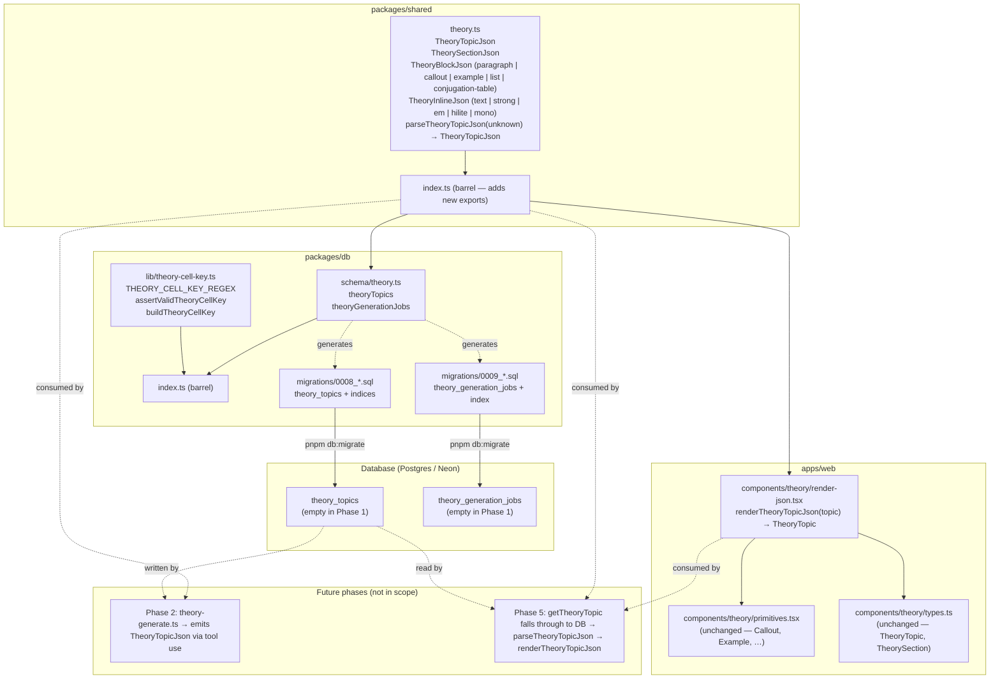
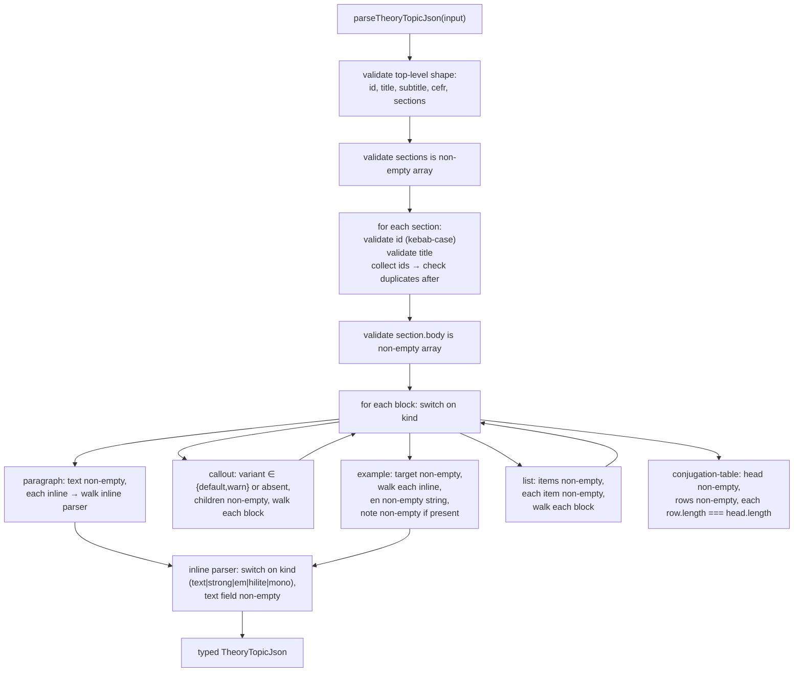

# Design Document

## Overview

This design implements **Phase 1 — Schema, output type, renderer** from `docs/theory-generation-plan.md` against the requirements in `requirements.md`. The phase produces three sets of artifacts:

1. **A pure-data type taxonomy + runtime parser** in `packages/shared/src/theory.ts`. The taxonomy (`TheoryTopicJson`, `TheorySectionJson`, `TheoryBlockJson`, `TheoryInlineJson`) is the JSON-serializable mirror of the runtime `TheoryTopic` shape that the Theory Panel already renders. The parser (`parseTheoryTopicJson`) validates `unknown` input against the taxonomy with field-level error messages — same shape as `parseGeneratedClozeDraft` in `packages/ai/src/generate.ts`.
2. **A pure renderer** in `apps/web/components/theory/render-json.tsx`. `renderTheoryTopicJson(topic) → TheoryTopic` walks the JSON tree and produces JSX through the existing primitives in `apps/web/components/theory/primitives.tsx`. No new primitives, no new CSS classes, no new panel surface.
3. **Two empty-table migrations + Drizzle schema + a cell-key helper.** `theory_topics` (with a unique partial pool-lookup index and a panel-lookup index) and `theory_generation_jobs` (the audit table mirror of `generation_jobs`). The schema sits next to the existing tables in `packages/db/src/schema/`; the cell-key helper sits next to `cell-key.ts`.

What this phase deliberately does **not** ship: the generator (Phase 2 — `packages/ai/src/theory-generate.ts`), the validator (Phase 3 — `packages/ai/src/theory-validate.ts`), the per-cell orchestrator (Phase 2 — `packages/db/src/theory-generation/run-one-cell.ts`), the CLI (Phase 2), Lambda + scheduler (Phase 4), or any panel registry change (Phase 5). The architecture is shaped so each later phase is purely additive: the parser is the boundary the generator emits into; the renderer is the boundary Phase 5's read path consumes from; the schema is the boundary Phases 2/4/5 all write/read against.

The structured-JSON output decision (plan §3) is operationalized here. Once committed, generating freeform TSX is no longer an option — the generator must call a tool whose schema matches `TheoryTopicJson`, the parser is the gate, the DB column is `JSONB`, and the renderer is the only path back to the panel. This phase pins that decision.

## Steering Document Alignment

### Technical Standards (`.claude/steering/tech.md`)

- **Drizzle + Postgres + `JSONB` for variant payloads** (`tech.md` §"Database"). The `theory_topics.content_json` column is `jsonb('content_json').$type<TheoryTopicJson>().notNull()` — Drizzle's `$type<T>()` lets the schema carry the typed payload through Drizzle's inference without a downstream cast. Mirrors the way `exercises.contentJson` already carries `ExerciseContent` (`packages/db/src/schema/exercises.ts`). No new column types are introduced.
- **Forward-only migrations** (`tech.md` §5, CLAUDE.md §"CI/CD"). Phase 1 adds two migrations (`0008`, `0009`). They `CREATE TABLE` and `CREATE INDEX` against new tables — no `ALTER` against existing tables, no data backfill. The Drizzle journal handles re-run idempotency; the SQL itself doesn't use `IF NOT EXISTS` (matches migrations `0001`–`0007`).
- **Anthropic Claude API + tool use + `cache_control: ephemeral`** (`tech.md` §"AI / GenAI"). Phase 1 ships no Claude calls. The taxonomy + parser pin the **tool-input shape** Phase 2 will register (the tool's `input_schema` is generated mechanically from `TheoryTopicJson`'s shape). Same gating pattern as `evaluate.ts` and `generate.ts`.
- **Shared types via `packages/shared`** (`tech.md` §"Monorepo Structure"). All taxonomy types live in `@language-drill/shared` so `packages/ai` (Phase 2 generator), `packages/db` (Phase 2 schema typing), and `apps/web` (renderer) all import without forming a cycle. The runtime `TheoryTopic` (which carries `React.ReactNode`) stays in `apps/web/components/theory/types.ts` — only `apps/web` ever needs the React-bearing type.
- **Cost model parity** (`tech.md` §7). `theory_generation_jobs` reuses the column shape of `generation_jobs` (UUID PK, `cell_key`, `status`, `trigger`, `started_at`/`finished_at`, token + cost columns, `error_message`). Phase 5's admin dashboard can union over both tables for a "total $ spent on AI content" view without per-table query branches.

### Project Structure (no `structure.md`; conventions verified against existing packages)

- **Package boundaries.**
  - `packages/shared` owns the JSON taxonomy and the parser (zero React, zero DB).
  - `packages/db` owns the migrations, Drizzle schema, and cell-key helper (Drizzle-typed reads/writes; mirror of how `exercises.ts` + `generation.ts` live there).
  - `apps/web` owns the renderer (uses React + the existing primitives).
  - No new cross-package edges. The renderer in `apps/web` already depends on `@language-drill/shared`; the schema in `packages/db` already depends on `@language-drill/shared` for `Language` / `CefrLevel`.
- **Tests next to the module.** `packages/shared/src/theory.test.ts` next to `theory.ts`. `apps/web/components/theory/__tests__/render-json.test.tsx` next to the existing `theory-panel.test.tsx`. `packages/db/src/schema/theory.test.ts` next to the schema. `packages/db/src/lib/theory-cell-key.test.ts` next to the helper. No orphan test directories — matches the convention used everywhere else in the repo (`generate.test.ts` next to `generate.ts`, `cell-key.test.ts` next to `cell-key.ts`).
- **Fixture location.** `packages/db/scripts/__fixtures__/theory-json/` holds the calibration JSON files, co-located with the existing `__fixtures__/claude-generation/` and `__fixtures__/claude-validation/` directories. They live under `packages/db/scripts/` (not under `apps/web/`) because Phase 2's CLI is the next consumer; the renderer test reads them through a relative import.
- **Migration numbering.** Migrations `0008_*.sql` and `0009_*.sql` follow Drizzle's slug-suffixed pattern (`0007_aromatic_harry_osborn.sql` is the most recent). Slugs are auto-generated by `pnpm db:generate` — Phase 1 commits whatever Drizzle produces.

## Code Reuse Analysis

### Existing components to leverage

- **`TheoryTopic` / `TheorySection` runtime types** (`apps/web/components/theory/types.ts`). The JSON taxonomy is field-compatible with these — same field names (`id`, `title`, `subtitle`, `cefr`, `sections[].id`, `sections[].title`), only `body` differs (`React.ReactNode` in the runtime type, `TheoryBlockJson[]` in the JSON type). The renderer's job is exactly to bridge the two.
- **All five existing primitives** (`apps/web/components/theory/primitives.tsx`). `Callout` (with `variant: 'default' | 'warn'`), `Example` + `Example.ES` + `Example.EN` + `Example.Note`, `TheoryList`, `ConjugationTable`, `Hilite`, `Mono`. The renderer composes JSX from these — no new primitives are created. The taxonomy's variants are designed around exactly what these primitives can render.
- **All existing CSS classes** in `apps/web/app/globals.css` (`callout`, `callout.warn`, `example`, `example-es`, `example-en`, `example-note`, `theory-list`, `theory-table`, `hilite`, `t-mono`). The renderer uses primitives that wrap these classes; no new classes are needed (Req 9.1).
- **`generationJobs` schema** (`packages/db/src/schema/generation.ts`). `theoryGenerationJobs` is a near-copy with three differences: (a) the cardinality columns `producedCount`/`approvedCount`/etc. collapse to three booleans (`approved`/`flagged`/`rejected`) because theory is one page per cell, not 50 drafts per cell; (b) the `requestedCount` column drops because count is always 1; (c) the cell-key format drops the `<type>` segment.
- **`assertValidCellKey` + `buildCellKey` + `CELL_KEY_REGEX`** (`packages/db/src/lib/cell-key.ts`). `assertValidTheoryCellKey` + `buildTheoryCellKey` + `THEORY_CELL_KEY_REGEX` mirror the structure exactly. Lowercased input convention is preserved (the existing helper lowercases for the canonical key); the regex matches `^(es|de|tr):(a1|a2|b1|b2):[a-z]{2}-[a-z0-9]+-[a-z0-9-]+$`.
- **`requireString` / `optionalString` / `requireStringArray` parser pattern** (`packages/ai/src/generate.ts:274-330`). The error format `Invalid <field>: must be <expected>, got <JSON.stringify(value)>` is the convention. The parser in `theory.ts` builds its own equivalent (it can't import from `packages/ai` — that would reverse the dependency direction). The functions are tiny (~10 LOC each) and re-implementing them here keeps `packages/shared` standalone.
- **`deterministicUuid` helper** (`packages/shared/src/deterministic-uuid.ts`, already promoted). Phase 2's generator will derive `id = deterministicUuid([language, grammarPointKey, batchSeed].join('|'))` here. Phase 1 doesn't call it but the column type (`UUID PRIMARY KEY` with no DB-side default) is shaped to accept whatever the helper produces.
- **`Language` / `CefrLevel` / `LearningLanguage` enums** (`packages/shared/src/index.ts`, `packages/shared/src/onboarding.ts`). The taxonomy and the schema both reference these directly — no per-phase narrowing.
- **Drizzle's `pgTable` + `index` + column helpers** (`drizzle-orm/pg-core`). Same import surface used by `generation.ts` and `exercises.ts`.
- **Migration pattern from `0004_sharp_quentin_quire.sql`** (an additive migration that creates two indices, one of which is the partial `exercises_pool_lookup_idx` — the exact partial-index syntax Phase 1's `theory_topics_pool_lookup_idx` reuses). Drizzle generated it from the schema; same path is followed here.

### Integration points

- **Theory Panel runtime types and registry** (`apps/web/components/theory/types.ts`, `apps/web/content/theory/index.ts`). The renderer's output type **is** the existing runtime `TheoryTopic`. Phase 5 will modify `getTheoryTopic` to fall through to a DB lookup that pipes the row through `renderTheoryTopicJson`; Phase 1 doesn't touch the registry but the renderer's signature is shaped to drop in.
- **Theory Panel scroll-spy** (`apps/web/components/theory/use-scroll-spy.ts`). The hook depends on `<section id={s.id}>` markup wrapping each section body — that wrapping is `TheoryContent`'s job (`apps/web/components/theory/theory-content.tsx`), not the renderer's. The renderer produces section bodies as JSX trees only (Req 3.12); the panel's existing wrapping picks up the section ids unchanged. No panel changes ship in Phase 1.
- **Drizzle migration journal** (`packages/db/migrations/meta/_journal.json`). Both migrations are added by `pnpm db:generate` after editing the schema; the journal entry is the canonical idempotency mechanism. The reviewer must commit the journal change alongside the SQL files.
- **`packages/db` package barrel** (`packages/db/src/index.ts`). Adds re-exports for `theoryTopics`, `theoryGenerationJobs`, `assertValidTheoryCellKey`, `buildTheoryCellKey`, `THEORY_CELL_KEY_REGEX` — same convention used for `exercises`, `generationJobs`, `assertValidCellKey`, `buildCellKey`.
- **`packages/shared` package barrel** (`packages/shared/src/index.ts`). Adds re-exports for `TheoryTopicJson`, `TheorySectionJson`, `TheoryBlockJson`, `TheoryInlineJson`, `parseTheoryTopicJson`. No deep imports anywhere in the codebase.

### Why the parser lives in `packages/shared`, not `packages/ai`

Two natural homes: `packages/shared` (where the type lives) or `packages/ai` (where the generator's parsers live — `parseGeneratedClozeDraft`, etc.). The design picks `shared` because:

1. **Cycle avoidance.** Phase 5's panel-side fallthrough needs to validate JSON it reads from the DB. If the parser lived in `packages/ai`, `apps/web` would have to import `@language-drill/ai`, dragging the Anthropic SDK + cost model + prompt builders into the web bundle. The web bundle has no business with any of that.
2. **The parser is pure-data validation.** Unlike `parseGeneratedClozeDraft` which is co-located with the generator that produces the input it parses, `parseTheoryTopicJson` validates `JSONB` payloads from the DB just as much as it validates Claude tool-use input. It belongs at the type's home.
3. **Symmetry with the rendering side.** The renderer is in `apps/web`. The parser being in `shared` (consumed by both `packages/ai` for generation and `apps/web` for read-validation) gives a clean division: shared owns the contract; the two ends (generation, rendering) own the per-side logic.

## Architecture



The dependency graph has exactly two cross-package edges: `packages/db → packages/shared` (already present, for `Language` / `CefrLevel`) and `apps/web → packages/shared` (already present). No new edges. `packages/ai` is untouched in Phase 1.

### Parser walk order (Mermaid, for clarity)



The parser is a single recursive walk. Every error throws with a `path` prefix like `sections[2].body[1].rows[3]` so the caller can find the offending field without re-parsing.

## Components and Interfaces

### Component 1 — `TheoryTopicJson` taxonomy (`packages/shared/src/theory.ts`)

- **Purpose:** The pure-data, JSON-serializable mirror of the runtime `TheoryTopic`. Owns the closed enum of block + inline variants.
- **Interfaces (TS):**
  ```ts
  export type TheoryTopicJson = {
    id: string;
    title: string;
    subtitle: string;
    cefr: string;
    sections: TheorySectionJson[];
  };

  export type TheorySectionJson = {
    id: string;
    title: string;
    body: TheoryBlockJson[];
  };

  export type TheoryBlockJson =
    | { kind: 'paragraph'; text: TheoryInlineJson[] }
    | { kind: 'callout'; variant?: 'default' | 'warn'; children: TheoryBlockJson[] }
    | { kind: 'example'; target: TheoryInlineJson[]; en: string; note?: TheoryInlineJson[] }
    | { kind: 'list'; items: TheoryBlockJson[][] }
    | { kind: 'conjugation-table'; head: string[]; rows: string[][] };

  // Wrapper-shape inline taxonomy: `text` is the leaf carrying a string; the
  // four emphasis variants wrap a `children` array of further inline nodes so
  // nested emphasis (the prototype's <em>"…<strong>be</strong>…"</em> in
  // subjunctive.tsx lines 28–36) round-trips losslessly.
  export type TheoryInlineJson =
    | { kind: 'text'; text: string }
    | { kind: 'strong'; children: TheoryInlineJson[] }
    | { kind: 'em'; children: TheoryInlineJson[] }
    | { kind: 'hilite'; children: TheoryInlineJson[] }
    | { kind: 'mono'; children: TheoryInlineJson[] };
  ```
- **Dependencies:** None — this file imports nothing from runtime, only types.
- **Reuses:** Field naming (`id`, `title`, `subtitle`, `cefr`) mirrors `apps/web/components/theory/types.ts`.

### Component 2 — `parseTheoryTopicJson` (`packages/shared/src/theory.ts`)

- **Purpose:** Validate `unknown` input against `TheoryTopicJson` with field-level error messages. Phase 2's generator parses Claude tool-use output through this; Phase 5's read path will parse `JSONB` through this.
- **Interface:**
  ```ts
  export function parseTheoryTopicJson(input: unknown): TheoryTopicJson;
  ```
- **Internal helpers** (private to the file):
  ```ts
  function isObject(value: unknown): value is Record<string, unknown>;
  function requireString(raw: Record<string, unknown>, field: string, path: string): string;
  function requireArray<T>(raw: Record<string, unknown>, field: string, path: string): unknown[];
  function requireNonEmptyArray<T>(arr: unknown[], path: string): unknown[];
  function parseSection(raw: unknown, path: string): TheorySectionJson;
  function parseBlock(raw: unknown, path: string): TheoryBlockJson;
  function parseInline(raw: unknown, path: string): TheoryInlineJson;
  ```
- **Path-prefixed errors.** Every helper takes a `path` parameter and throws messages like `Invalid sections[2].body[1].rows[3]: must have the same length as head (5), got 4`. The top-level call seeds `path = ''`.
- **Section-id collision detection.** Walks `sections` once, collects ids in a `Map<id, firstSeenIndex>`. On a duplicate, throws naming both indices.
- **Dependencies:** None outside the file.
- **Reuses:** Error format mirrors `parseGeneratedClozeDraft` (`packages/ai/src/generate.ts:337-373`) but the helpers are re-implemented locally to keep `packages/shared` standalone.

### Component 3 — `renderTheoryTopicJson` (`apps/web/components/theory/render-json.tsx`)

- **Purpose:** Walk a parsed `TheoryTopicJson` and produce a runtime `TheoryTopic` with JSX section bodies. Pure function, no hooks, no effects.
- **Interface:**
  ```ts
  export function renderTheoryTopicJson(topic: TheoryTopicJson): TheoryTopic;
  ```
- **Internal helpers:**
  ```ts
  function renderSection(section: TheorySectionJson): TheorySection;
  function renderBlock(block: TheoryBlockJson, key: number): React.ReactNode;
  function renderInline(inline: TheoryInlineJson, key: number): React.ReactNode;
  ```
- **Exhaustive switch invariant.** The switch in `renderBlock` and `renderInline` covers every variant; the default arm is `const _exhaustive: never = block.kind; throw new Error('Unknown block kind: ' + _exhaustive)`. Adding a variant in a future phase fails compilation here unless the switch is updated.
- **Key derivation.** Every JSX child in an array gets `key={index}`. Stable across renders because the source arrays are immutable per render.
- **Dependencies:** `TheoryTopicJson` from `@language-drill/shared`; `Callout`, `Example`, `Hilite`, `Mono`, `TheoryList`, `ConjugationTable` from `apps/web/components/theory/primitives.tsx`; `TheoryTopic`, `TheorySection` from `apps/web/components/theory/types.ts`.
- **Reuses:** All primitives — no new ones created.

### Component 4 — `theory_topics` schema (`packages/db/src/schema/theory.ts`) + migration

- **Purpose:** Storage table for generated theory pages.
- **Drizzle definition (sketch):**
  ```ts
  export const theoryTopics = pgTable(
    'theory_topics',
    {
      id: uuid('id').primaryKey(),
      language: text('language').notNull(),
      grammarPointKey: text('grammar_point_key').notNull(),
      topicId: text('topic_id').notNull(),
      cefrLevel: text('cefr_level').notNull(),
      contentJson: jsonb('content_json').$type<TheoryTopicJson>().notNull(),
      generationSource: text('generation_source').notNull().default('manual'),
      modelId: text('model_id'),
      qualityScore: real('quality_score'),
      reviewStatus: text('review_status').notNull().default('auto-approved'),
      flaggedReasons: jsonb('flagged_reasons'),
      generatedAt: timestamp('generated_at', { withTimezone: true }),
      createdAt: timestamp('created_at', { withTimezone: true }).notNull().defaultNow(),
      updatedAt: timestamp('updated_at', { withTimezone: true }).notNull().defaultNow(),
    },
    (table) => ({
      poolLookupIdx: uniqueIndex('theory_topics_pool_lookup_idx')
        .on(table.language, table.grammarPointKey)
        .where(sql`${table.reviewStatus} IN ('auto-approved', 'manual-approved')`),
      panelIdx: index('theory_topics_panel_idx')
        .on(table.language, table.topicId)
        .where(sql`${table.reviewStatus} IN ('auto-approved', 'manual-approved')`),
    }),
  );
  ```
- **CHECK constraints.** The installed Drizzle version (0.45.2, per `packages/db/package.json`) supports `check()` in the table-options callback. Round-1 levels (`A1|A2|B1|B2`), languages (`ES|DE|TR`), `generation_source` enum, and `review_status` enum are expressed as `check()`s. The migration SQL is authoritative.
- **Why `id UUID` with no `defaultRandom()`.** Phase 2 derives the id deterministically from `(language, grammarPointKey, batchSeed)` — same convention as `generationJobs.id`. The DB SHALL NOT generate ids.
- **Why `content_json` is `notNull()` even for the manual-source override.** The taxonomy is the source of truth for stored topics; a row with no content is meaningless. The hand-authored TSX files in `apps/web/content/theory/es/` are NOT stored in this table (resolved decision #11).
- **Dependencies:** `TheoryTopicJson` from `@language-drill/shared` for the `$type<...>()` annotation.
- **Reuses:** Column patterns from `exercises` (`packages/db/src/schema/exercises.ts`) and `generationJobs` (`packages/db/src/schema/generation.ts`).

### Component 5 — `theory_generation_jobs` schema (`packages/db/src/schema/theory.ts`) + migration

- **Purpose:** Per-batch audit trail. Phase 2's CLI is the first writer.
- **Drizzle definition (sketch):**
  ```ts
  export const theoryGenerationJobs = pgTable(
    'theory_generation_jobs',
    {
      id: uuid('id').primaryKey(),
      cellKey: text('cell_key').notNull(), // <lang>:<level>:<grammar_point_key>
      status: text('status').notNull(),    // queued | running | succeeded | failed
      trigger: text('trigger').notNull(),  // cli | scheduled | admin
      startedAt: timestamp('started_at', { withTimezone: true }).notNull().defaultNow(),
      finishedAt: timestamp('finished_at', { withTimezone: true }),
      inputTokensUsed: integer('input_tokens_used'),
      outputTokensUsed: integer('output_tokens_used'),
      costUsdEstimate: numeric('cost_usd_estimate', { precision: 10, scale: 4 }),
      approved: boolean('approved'),
      flagged: boolean('flagged'),
      rejected: boolean('rejected'),
      errorMessage: text('error_message'),
    },
    (table) => ({
      cellIdx: index('theory_generation_jobs_cell_idx').on(table.cellKey, table.startedAt.desc()),
    }),
  );
  ```
- **Why three booleans instead of integer counts.** Theory cardinality is exactly 1 per cell; an integer count would always be 0 or 1. The booleans express the terminal state of a job's single attempt without inviting confusion. Phase 5's dashboard projects this onto the `generation_jobs` shape via `CASE WHEN approved THEN 1 ELSE 0 END` etc.
- **Reuses:** Column shape mirrors `generationJobs`.

### Component 6 — `assertValidTheoryCellKey` helper (`packages/db/src/lib/theory-cell-key.ts`)

- **Purpose:** Single source of truth for the `theory_generation_jobs.cell_key` format. First caller is Phase 2's CLI.
- **Interface:**
  ```ts
  export const THEORY_CELL_KEY_REGEX = /^(es|de|tr):(a1|a2|b1|b2):[a-z]{2}-[a-z0-9]+-[a-z0-9-]+$/;

  export function assertValidTheoryCellKey(cellKey: string): void;

  export function buildTheoryCellKey(parts: {
    language: string;
    cefrLevel: string;
    grammarPointKey: string;
  }): string;
  ```
- **Lowercasing convention.** The existing `buildCellKey` lowercases its inputs before joining (matching `CELL_KEY_REGEX`'s lowercase alternation). `buildTheoryCellKey` preserves this behavior so callers can pass the upper-case enum literals (`Language.ES`, `CefrLevel.B1`) without normalizing first.
- **Defense-in-depth.** `buildTheoryCellKey` calls `assertValidTheoryCellKey` on its own output so a regex drift in either function is caught at the call site.
- **Reuses:** Structure of `cell-key.ts` line-for-line.

### Component 7 — Test fixtures (`packages/db/scripts/__fixtures__/theory-json/`)

- **Purpose:** Calibration corpus for Phase 1 tests AND seed material Phase 3's validator prompts will be tuned against.
- **Files:**
  - `subjunctive.json` — equivalent of `apps/web/content/theory/es/subjunctive.tsx`. Six sections, every block variant represented at least once. Hand-authored from the TSX file's content.
  - `minimal.json` — smallest valid topic: one section with one paragraph containing one inline `text` node. Tests the parser's "no false positives on legal-but-trivial" path.
- **Dependencies:** None at runtime — they're loaded via `JSON.parse(fs.readFileSync(...))` in tests.

## Data Models

### `TheoryTopicJson` (definitive)

See Component 1 for the TS declaration. Field-by-field rationale:

| Field | Type | Why |
|---|---|---|
| `id` | `string` | Mirror of `TheoryTopic.id`. Derived from `grammarPoint.key` in Phase 2 (`b1-present-subjunctive`); free-form here. |
| `title` | `string` | Display string; localized (e.g. `'el subjuntivo'`). |
| `subtitle` | `string` | One-line gloss. |
| `cefr` | `string` (free text) | Mirror of `TheoryTopic.cefr`. Free text because it's a band string (`'B1–B2'`), not a single CEFR enum value. |
| `sections` | `TheorySectionJson[]` (non-empty) | Ordered; rendered TOC + content area in this order. |

| `TheoryBlockJson` variant | Why this shape |
|---|---|
| `paragraph { text: TheoryInlineJson[] }` | Inline-only content; the prototype's `<p>` always carries inline-only mixed content. |
| `callout { variant?, children: TheoryBlockJson[] }` | Block-level container; the prototype's callouts can contain paragraphs, lists, or other callouts. `variant` defaults to `'default'` (matches the primitive's prop default). |
| `example { target, en, note? }` | The prototype's `<Example>` always has a target line + EN translation; `Note` is optional. `target` is inline so the line can carry `<Hilite>`; `en` is plain string because the prototype's `<Example.EN>` is always plain text; `note` is `TheoryInlineJson[]` because the prototype's `<Example.Note>` carries `<em>verb-name</em>` (e.g. `subjunctive.tsx` line 247: `subjunctive of <em>tener</em>`). |
| `list { items: TheoryBlockJson[][] }` | Each item is an array of blocks (the prototype's `pitfalls` items contain mixed inline content that's most naturally a paragraph). The double array is the price of supporting items that are more than a single inline run. |
| `conjugation-table { head, rows }` | First column is the row label by convention. Both arrays of strings — the table cells are always plain text in the prototype (no inline `<Hilite>` inside cells). |

| `TheoryInlineJson` variant | Why |
|---|---|
| `text { text: string }` | Leaf — plain text run. The only inline variant carrying a string. |
| `strong { children: TheoryInlineJson[] }` | Wrapper — maps to `<strong>{children.map(renderInline)}</strong>`. |
| `em { children: TheoryInlineJson[] }` | Wrapper — maps to `<em>{...}</em>`. |
| `hilite { children: TheoryInlineJson[] }` | Wrapper — maps to `<Hilite>{...}</Hilite>` → `<span class="hilite">…</span>`. |
| `mono { children: TheoryInlineJson[] }` | Wrapper — maps to `<Mono>{...}</Mono>` → `<span class="t-mono">…</span>`. |

The wrapper-vs-leaf split is deliberate. The four emphasis variants take `children: TheoryInlineJson[]` (recursive) so nested emphasis like the prototype's `<em>"i suggest he <strong>be</strong> here"</em>` (`subjunctive.tsx` lines 28–36) round-trips losslessly:

```json
{ "kind": "em", "children": [
  { "kind": "text", "text": "\"i suggest he " },
  { "kind": "strong", "children": [{ "kind": "text", "text": "be" }] },
  { "kind": "text", "text": " here\"" }
]}
```

A flat-string variant (`{ kind: 'em'; text: string }`) would either reject this case or force a lossy flattening to a sequence of sibling spans — losing the semantic that "be" is bold *inside* an italic phrase. The wrapper shape costs three extra JSON tokens per emphasis run; that's acceptable.

### `theory_topics` row

Per Requirement 4. Verbatim mirror in Drizzle types as Component 4. Notable derived properties:

- **Pool-lookup uniqueness:** `(language, grammar_point_key) WHERE review_status IN ('auto-approved', 'manual-approved')` — at most one approved row per cell.
- **Panel-lookup index:** `(language, topic_id) WHERE …` — Phase 5 reads here.
- **Variability of `topic_id` vs `grammar_point_key`:** `topic_id` strips the language prefix (per resolved decision #10, `b1-present-subjunctive`); `grammar_point_key` keeps it (`es-b1-present-subjunctive`). One row carries both.

### `theory_generation_jobs` row

Per Requirement 5. Three asymmetries vs `generation_jobs`:

| `generation_jobs` | `theory_generation_jobs` | Why |
|---|---|---|
| `requested_count INT NOT NULL` | (omitted) | Theory is always count 1 |
| `produced_count`, `approved_count`, `flagged_count`, `rejected_count INT` | `approved`, `flagged`, `rejected BOOLEAN` | Cardinality 1 per cell |
| `cell_key = <lang>:<level>:<type>:<grammar_point_key>` | `cell_key = <lang>:<level>:<grammar_point_key>` | No type segment — theory has no per-type fan-out |

## Error Handling

### Parser-rejection conditions (one per Req 2.2–2.11)

Every parser-thrown error has a defined message format. The implementer reads this table to know what string `expect(() => …).toThrow(...)` should match.

| # | Req | Condition | Error message format |
|---|---|---|---|
| 1 | 2.2 | Missing required field on the topic, section, block, or inline node | `Invalid <path>.<field>: must be present, got undefined` |
| 2 | 2.2 | Top-level input is not an object | `Invalid topic: must be an object, got <typeof>` |
| 3 | 2.3 | `sections` array is empty | `Invalid sections: must be a non-empty array, got []` |
| 4 | 2.4 | Section `body` array is empty | `Invalid sections[<i>].body: must be a non-empty array, got []` |
| 5 | 2.5 | `paragraph.text` empty array, OR inline-wrapper `children` empty array, OR inline `text` leaf carrying empty string | `Invalid sections[<i>].body[<j>].text: must be a non-empty array, got []` (paragraph) / `Invalid sections[<i>].body[<j>].text[<k>].children: must be a non-empty array, got []` (wrapper) / `Invalid sections[<i>].body[<j>].text[<k>].text: must be a non-empty string, got ""` (leaf) |
| 6a | 2.6 | `example.target` array is empty | `Invalid sections[<i>].body[<j>].target: must be a non-empty array, got []` |
| 6b | 2.6 | `example.en` is empty string | `Invalid sections[<i>].body[<j>].en: must be a non-empty string, got ""` |
| 6c | 2.6 | `example.note` is present but empty array | `Invalid sections[<i>].body[<j>].note: must be a non-empty array when present, got []` |
| 7a | 2.7 | `list.items` is empty | `Invalid sections[<i>].body[<j>].items: must be a non-empty array, got []` |
| 7b | 2.7 | A list item is empty | `Invalid sections[<i>].body[<j>].items[<k>]: must be a non-empty array, got []` |
| 8a | 2.8 | `conjugation-table.head` is empty | `Invalid sections[<i>].body[<j>].head: must be a non-empty array, got []` |
| 8b | 2.8 | `conjugation-table.rows` is empty | `Invalid sections[<i>].body[<j>].rows: must be a non-empty array, got []` |
| 8c | 2.8 | Row width mismatch | `Invalid sections[<i>].body[<j>].rows[<k>]: must have length <head.length> (header columns), got <row.length>` |
| 9a | 2.9 | Unknown block `kind` | `Invalid sections[<i>].body[<j>].kind: unknown block kind, got "<kind>"` |
| 9b | 2.9 | Unknown inline `kind` | `Invalid sections[<i>].body[<j>].text[<k>].kind: unknown inline kind, got "<kind>"` |
| 10 | 2.10 | Section id is not non-empty kebab-case | `Invalid sections[<i>].id: must match /^[a-z][a-z0-9-]*$/, got "<id>"` |
| 11 | 2.11 | Duplicate section ids | `Invalid sections[<j>].id: duplicates sections[<i>].id (both are "<id>") — section ids must be unique within a topic` |

Path expressions use `[<index>]` for arrays and `.<field>` for object members; the format matches `parseGeneratedClozeDraft`'s convention in `packages/ai/src/generate.ts:280`.

### Other error scenarios

1. **Renderer encounters an unknown `kind`** (impossible if TypeScript compiles; defense for runtime data drift via stale `JSONB` blobs from before a future taxonomy migration).
   - **Handling:** Exhaustive `never` switch throws `Unknown block kind: <kind>` (or inline equivalent). Phase 5's panel wraps `<TheoryContent>` in an error boundary that catches and shows the FR-7 empty state from the theory-panel spec.
   - **User Impact:** Panel renders the empty state instead of crashing the page.

2. **Drizzle migration generator (`pnpm db:generate`) produces SQL that doesn't match the expected shape.**
   - **Handling:** Workflow concern. The author runs `pnpm db:generate`, inspects the generated SQL against the requirements, and re-runs if Drizzle produced unexpected output. The committed migration file is the source of truth.
   - **User Impact:** None in production — dev-time correction loop only.

3. **Insert attempts a second `auto-approved` row for the same `(language, grammar_point_key)`.**
   - **Handling:** Unique partial index `theory_topics_pool_lookup_idx` rejects with a constraint violation. Phase 2's CLI uses `INSERT ... ON CONFLICT DO NOTHING` so the second insert is a silent no-op rather than an error.
   - **User Impact:** None — the operator's "this cell already has a topic" intent is naturally expressed.

4. **Operator manually inserts a row via `psql` for verification.**
   - **Handling:** Every NOT NULL column must be supplied (`id`, `language`, `grammar_point_key`, `topic_id`, `cefr_level`, `content_json`). Manual inserts are documented in the task verify step with a SQL snippet so the verification is reproducible.
   - **User Impact:** Verification flow surfaces any column-default drift early.

## Testing Strategy

### Unit testing

| File | What it covers |
|---|---|
| `packages/shared/src/theory.test.ts` | (a) Happy path: `parseTheoryTopicJson(subjunctiveJson)` returns a value structurally equal to the input; (b) every parser-rejection condition from Req 2.2–2.11 — one test per condition; (c) type narrowing: `const t: TheoryTopicJson = parseTheoryTopicJson(input)` compiles without cast; (d) error paths include the field path (`sections[2].body[1].rows[3]`) — assert via `expect(() => …).toThrow(/sections\[2\]\.body\[1\]\.rows\[3\]/)` |
| `packages/db/src/lib/theory-cell-key.test.ts` | Valid-case round-trip, every input class from `cell-key.test.ts`'s exercise tests adapted, plus the negative case asserting an exercise cell key is rejected |
| `packages/db/src/schema/theory.test.ts` | (Skipped without `TEST_DATABASE_URL`) Asserts `theoryTopics` and `theoryGenerationJobs` table columns + nullability + check constraints match the migration. Mirror of Phase 1's spec for exercise gen which had the same shape. |

### Integration testing

| File | What it covers |
|---|---|
| `apps/web/components/theory/__tests__/render-json.test.tsx` | (a) Render the `subjunctive.json` fixture through `renderTheoryTopicJson` then `render(<>{topic.sections[i].body}</>)` for every section — assert no React error; (b) Targeted DOM assertions: `<Callout variant="warn">` produces `<div class="callout warn">`, `<Example>` includes/omits Note correctly, table cell counts; (c) Calibration test: assert known anchors in the rendered output (`screen.getByText(/WEIRDO/)`, `screen.getByText(/opposite vowel/)`) match what the hand-authored `subjunctive.tsx` produces. |

### What we are NOT testing in Phase 1

- **End-to-end through the panel.** Phase 5 owns the integration where `TheoryPanel` renders a DB-stored topic. Phase 1's renderer test stops at "rendered output's text content matches the hand-authored equivalent."
- **`pnpm db:migrate` against production.** Production migrations are CI-driven (`.github/workflows/deploy.yml`); Phase 1's verification is `pnpm db:migrate` against the dev Neon branch.
- **Renderer XSS testing.** The taxonomy is a closed enum carrying only `string` payloads through React (which auto-escapes); there is no `dangerouslySetInnerHTML`. No XSS surface to test.

### Manually verified at PR time

- **Migration applied to dev Neon branch.** Run `pnpm db:migrate` and verify `\d theory_topics` shows both indices, attempted second-insert violates the unique partial index, attempted insert with `review_status='rejected'` succeeds.
- **No new CSS classes introduced.** Visual inspection of `git diff apps/web/app/globals.css` should show no changes.
- **Drizzle journal updated.** `git status` should include `packages/db/migrations/meta/_journal.json` alongside the new SQL files.
