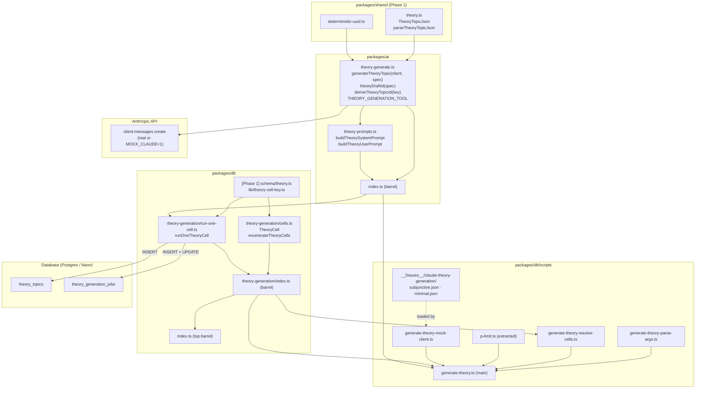
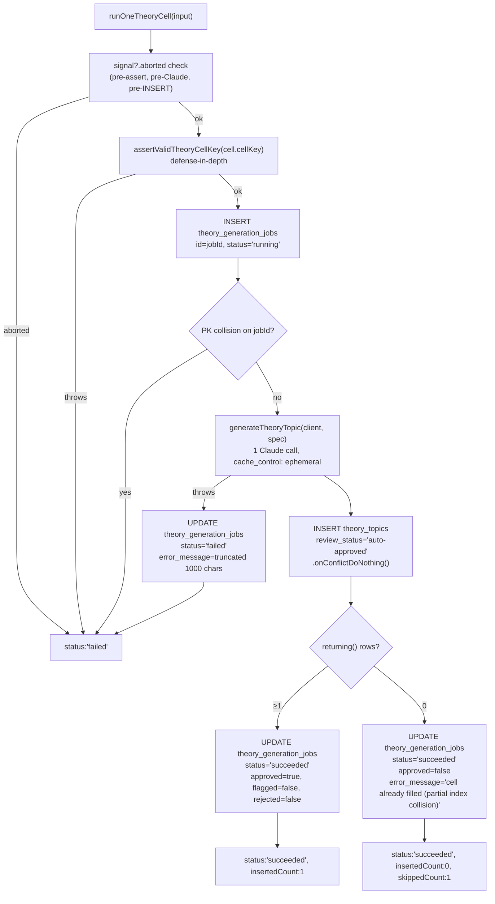

# Design Document

## Overview

This design implements **Phase 2 — Generator core + CLI** from `docs/theory-generation-plan.md` against the requirements in `requirements.md`. The phase produces four sets of artifacts:

1. **Generator core + tool schema + prompts** in `packages/ai`. `generateTheoryTopic(client, spec)` performs one Claude call with `tool_choice: { type: 'tool', name: 'submit_theory_topic' }`, parses the response through Phase 1's `parseTheoryTopicJson`, and returns a `TheoryDraft` + `ClaudeUsageBreakdown`. Lives at `packages/ai/src/theory-generate.ts` and `theory-prompts.ts`. Re-exported via the package barrel.
2. **Per-cell orchestrator + cell enumeration** in `packages/db/src/theory-generation/`. `runOneTheoryCell(input)` is the testable unit both the CLI and Phase 4's Lambda will call. `enumerateTheoryCells(curriculum)` is the canonical cell builder both the CLI and Phase 4's scheduler will call.
3. **CLI driver** at `packages/db/scripts/generate-theory.ts` plus its pure helpers (`generate-theory-parse-args.ts`, `generate-theory-resolve-cells.ts`, `generate-theory-mock-client.ts`). Mirrors the exercise CLI's surface byte-identically minus the four collapsed dimensions (`--type`, `--count`, in-batch dedup, validator counts).
4. **Shared `pLimit` helper** lifted out of `generate-exercises.ts` into `packages/db/scripts/p-limit.ts` so both CLIs reference one implementation. The exercise CLI updates its import; behavior is unchanged.

What this phase deliberately does **not** ship: the validator (Phase 3), the per-cell retry / dedup loop (collapsed; theory cardinality is exactly 1 page per cell), the panel registry fallthrough (Phase 5), the generation Lambda + scheduler (Phase 4), the `--queue` flag (Phase 4), the review CLI (Phase 3). The architecture is shaped so each later phase is purely additive: Phase 3 drops the validator call between `generateTheoryTopic` and the `theory_topics` INSERT (or before it; see Component 4); Phase 4 wraps `runOneTheoryCell` in a Lambda handler and an EventBridge-driven scheduler; Phase 5 reads through `parseTheoryTopicJson → renderTheoryTopicJson`.

The deterministic-ID + ON-CONFLICT-DO-NOTHING contract from Phase 1's schema is operationalized here. Once committed, re-runs of the CLI on a cell that already has an approved row are a silent no-op — the partial unique index `theory_topics_pool_lookup_idx` is the dedup mechanism at the data layer; the generator does not maintain its own dedup state.

## Steering Document Alignment

### Technical Standards (`.claude/steering/tech.md`)

- **Anthropic Claude API + tool use + `cache_control: ephemeral`** (`tech.md` §"AI / GenAI"). `generateTheoryTopic` follows the exact pattern `evaluate.ts` and `generateBatch` established: `client.messages.create` with a single cached system block, `tool_choice` forced-call against a strict `input_schema`. Phase 2 ships no new pattern — it ships a second instance of the existing pattern, tailored to the theory output shape.
- **`claude-sonnet-4-5` for generation** (`tech.md` §"AI / GenAI" — note that `tech.md` names `claude-sonnet-4-6` as the project-wide LLM; the divergence is intentional for round 1, matching the exercise generator's resolved decision #1). `THEORY_GENERATION_MODEL` is an alias of `GENERATION_MODEL` from `packages/ai/src/generate.ts:47` — same constant under a sibling name. Pinned via cross-file equality test in `theory-generate.test.ts` (Req 8.3): bumping one generator without the other fails CI.
- **Forward-only migrations** (`tech.md` §5). Phase 2 ships zero migrations — all schema work was done in Phase 1 (migrations 0008 + 0009). The CLI writes to existing tables only.
- **Prompt caching** (`tech.md` §"AI / GenAI"). The system prompt carries `cache_control: { type: 'ephemeral' }`. NFR Performance notes the realistic cache-hit window: cells differ in the curriculum fields injected into the system prompt, so cache hits materialize across same-cell retries (Phase 4 path) more than across distinct cells in a single multi-cell run. The design accepts this; Phase 2's cost numbers are computed without optimistic cache-hit credit on the dry-run path (Req 6.7).
- **Drizzle + Postgres** (`tech.md` §"Database"). `runOneTheoryCell` writes via the typed `theoryTopics` and `theoryGenerationJobs` table objects from `@language-drill/db`. The `contentJson` column is already typed `$type<TheoryTopicJson>()` from Phase 1, so the INSERT carries through with zero casts.
- **Cost model parity** (`tech.md` §7). Phase 2 imports `addUsage`, `estimateCostUsd`, `ZERO_USAGE`, and `SONNET_4_5_PRICING` from `@language-drill/ai/cost-model.ts` wholesale. No per-side duplication. Bumping the model's price changes both generators in one PR.
- **Monorepo structure** (`tech.md` §"Monorepo Structure"). New files land in the existing package layout: `packages/ai/src/theory-*.ts` for the generator + prompts (mirror of `generate.ts`, `generation-prompts.ts`); `packages/db/src/theory-generation/` for the orchestrator + cells (mirror of `packages/db/src/generation/`); `packages/db/scripts/generate-theory*.ts` for the CLI (mirror of `generate-exercises*.ts`). A reader who's navigated the exercise generator will find the theory generator at structurally analogous paths.
- **Tests next to the module they test** (`CLAUDE.md` §Testing). Every new module ships its `.test.ts` next to it. No orphan test directories.

### Project Structure (no `structure.md`; conventions verified against existing packages)

- **Package boundaries.**
  - `packages/ai` owns the generator core, the prompt builders, and the tool schema. No DB access, no scripts.
  - `packages/db` owns the orchestrator (`run-one-cell.ts`), the cell enumerator (`cells.ts`), and the CLI script (`scripts/generate-theory.ts`).
  - `apps/web` is untouched in Phase 2 (Phase 5 will add the registry fallthrough).
  - No new cross-package edges. `packages/ai` already depends on `@language-drill/shared`; `packages/db` already depends on `@language-drill/ai` and `@language-drill/shared`.
- **Pure helpers in scripts/.** Following the exercise CLI's split: `generate-theory-parse-args.ts` and `generate-theory-resolve-cells.ts` are pure (no I/O), making the CLI's main path testable from unit tests that compose them without spawning a subprocess. Matches `generate-exercises-parse-args.ts` and `generate-exercises-resolve-cells.ts`.
- **Mock client co-located with the CLI.** `generate-theory-mock-client.ts` is a `MOCK_CLAUDE=1`-only path used by the CLI integration test. Sits next to `generate-exercises-mock-client.ts`, which it does NOT import — the two mocks have different dispatch tables and different fixture shapes (theory has no per-type fan-out).
- **Fixture location.** `packages/db/scripts/__fixtures__/claude-theory-generation/` mirrors `__fixtures__/claude-generation/` (exercise side). The directory holds JSON files the mock client cycles through. Per Requirement 7.2, the fixtures MAY structurally re-use Phase 1's `__fixtures__/theory-json/{subjunctive,minimal}.json` — but the directory ITSELF must exist at the Phase 2 path so readers searching for `claude-theory-generation` find it. The design picks the simpler path: copy the two fixture files at Task time and accept the (~5KB each) duplication; a re-export module would just add indirection without saving disk.
- **Shared `pLimit`.** Today `pLimit` is defined inline in `generate-exercises.ts:108-135` and re-exported. The validator flagged this as ambiguous between "copy" and "extract." This design picks **extract**: move the function to `packages/db/scripts/p-limit.ts`, update `generate-exercises.ts` to import from there, and import the same module from `generate-theory.ts`. The refactor is two-line: one removed function declaration, one added import. Existing tests pass unchanged because the workspace package's exported name is unchanged.

## Code Reuse Analysis

### Existing components to leverage

- **`parseTheoryTopicJson`** (`packages/shared/src/theory.ts:314` — Phase 1). The single parser entry point. `generateTheoryTopic` calls it directly on `response.content[...].input` and re-throws with a `Theory draft malformed: <parser message>` prefix. Path-prefixed error messages from the parser surface verbatim (per Req 1.5).
- **`TheoryTopicJson` + sub-types** (Phase 1). The static type for `TheoryDraft.contentJson`. Imported from `@language-drill/shared`.
- **`theoryTopics`, `theoryGenerationJobs`** (`packages/db/src/schema/theory.ts` — Phase 1). The Drizzle table objects `runOneTheoryCell` writes through. `theoryTopics.contentJson` is already typed `$type<TheoryTopicJson>()` so the INSERT shape is compile-time checked.
- **`buildTheoryCellKey` + `assertValidTheoryCellKey`** (`packages/db/src/lib/theory-cell-key.ts` — Phase 1). Called by `enumerateTheoryCells` to construct the cell key; called by `runOneTheoryCell` as a defense-in-depth check. The helpers are tested at the cell-key level; Phase 2 doesn't re-test the regex itself, only that callers use it.
- **`GENERATION_MODEL`** (`packages/ai/src/generate.ts:47`). Re-exported as `THEORY_GENERATION_MODEL`. Pinned equal via the model-pin test (Req 8.3).
- **`addUsage`, `estimateCostUsd`, `ZERO_USAGE`, `SONNET_4_5_PRICING`** (`packages/ai/src/cost-model.ts`). Wholesale imports; no per-side duplication.
- **`createClaudeClient`** (`packages/ai/src/index.ts:89`). The CLI calls this for the real Claude client; `MOCK_CLAUDE=1` substitutes `createTheoryMockClient`.
- **`deterministicUuid`** (`packages/shared/src/deterministic-uuid.ts`). `theoryDraftId` is one line: `deterministicUuid([language, grammarPointKey, batchSeed].join('|'))`.
- **`ALL_CURRICULA`, `GrammarPoint`, `CurriculumCefrLevel`** (`@language-drill/db` barrel; underlying types in `@language-drill/shared` after the Phase 4 cycle break). Consumed by `enumerateTheoryCells`, the prompt builders, and the CLI's resolver.
- **`Language`, `LearningLanguage`, `LANGUAGE_NAMES`** (`@language-drill/shared`). Used by the prompt builder (`LANGUAGE_NAMES[lang]` for the role declaration) and by the parse-args helper (language validation).
- **`pLimit`** (currently inline in `generate-exercises.ts:108-135`; extracted in Task 11 to `packages/db/scripts/p-limit.ts`). Same implementation used by both CLIs after the extraction.
- **`requireEnv`** (`packages/db/src/lib/env.ts`, re-exported via the package barrel). The CLI calls `requireEnv('ANTHROPIC_API_KEY')` and `requireEnv('DATABASE_URL')` — same convention as the exercise CLI's `env-helpers.ts`.
- **`createDb`** (`packages/db/src/client.ts`, re-exported via the package barrel). The CLI's DB client constructor.
- **`collectRawFlags`, `requireString`** (`packages/db/scripts/parse-args-common.ts`). The pure-helper module shared with the exercise CLI's parse-args. `parseTheoryGenerateArgs` reuses both.
- **`ROUND_1_CEFR_LEVELS`** (`packages/db/src/generation/cells.ts:26`). Re-exported as `THEORY_ROUND_1_CEFR_LEVELS` from `packages/db/src/theory-generation/cells.ts` so the two generators share level scope.
- **Exercise generator orchestration shape** (`packages/db/src/generation/run-one-cell.ts`). `runOneTheoryCell` is a structural slim-down of `runOneCell`: opening audit row, generator call, INSERT-on-conflict-do-nothing, closing audit row, cell-isolated try/catch, optional `AbortSignal`. Differences are spelled out in Component 4.

### Why the generator core lives in `packages/ai`, not `packages/db`

The same boundary the exercise generator already established: `packages/ai` owns "anything that talks to Claude" (tool schemas, prompts, parsers, `client.messages.create` invocations). `packages/db` owns "anything that talks to Postgres" (Drizzle table objects, audit-row management, the orchestrator that composes the two). The orchestrator imports from `packages/ai` AND `packages/db`; the inverse is forbidden. Phase 2 follows this without modification.

`runOneTheoryCell` lives in `packages/db/src/theory-generation/` (not `scripts/`) because both the CLI script AND Phase 4's Lambda will import it — `packages/db/src/` is the importable surface; `packages/db/scripts/` is the script-only surface. Same boundary `runOneCell` already established.

### Integration points

- **`@language-drill/ai` package barrel** (`packages/ai/src/index.ts`). Adds re-exports for the new generator's public surface: `generateTheoryTopic`, the `TheoryGenerationSpec` / `TheoryDraft` / `TheoryGenerateResult` types, the `theoryDraftId` / `deriveTheoryTopicId` helpers, the `THEORY_TOOL_NAME` / `THEORY_GENERATION_MODEL` / `THEORY_GENERATION_TEMPERATURE` / `THEORY_GENERATION_MAX_TOKENS` constants, the `THEORY_GENERATION_TOOL` tool schema, and the `buildTheorySystemPrompt` / `buildTheoryUserPrompt` builders + their `TheoryPromptInputs` type.
- **`@language-drill/db` package barrel** (`packages/db/src/index.ts`). Appends `export * from './theory-generation';` after the existing `export * from './generation';` line so callers can `import { runOneTheoryCell, enumerateTheoryCells, type TheoryCell } from '@language-drill/db'`.
- **`packages/db/package.json` + `package.json`** (`scripts`). The new `generate:theory` workspace script (`packages/db/package.json`) maps to `npx tsx scripts/generate-theory.ts`; the new top-level script (`package.json`) maps to `dotenv -e .env -- pnpm --filter @language-drill/db generate:theory` — identical pattern to the existing `generate:exercises` line.
- **Existing `pLimit` consumer** (`generate-exercises.ts:108-135`). The function declaration is removed; an `import { pLimit } from './p-limit'` replaces it. The exercise CLI tests that call `pLimit` directly update their import path. This is a pure refactor — no behavior change.
- **CLI `parse-args-common.ts`** (`packages/db/scripts/parse-args-common.ts`). Theory parser imports `collectRawFlags` and `requireString` from this helper; same pattern as the exercise parse-args.

## Architecture



The dependency graph has no new cross-package edges: `packages/db → packages/ai` (already present); `packages/db/scripts → packages/ai` (already present); `packages/ai → packages/shared` (already present). All new arrows are intra-package or hit existing inter-package edges.

### Per-cell control flow (`runOneTheoryCell`)



The diagram makes one structural detail explicit: the audit-row OPEN happens BEFORE the Claude call. A PK collision (re-fire of the same `jobId`) is caught there and the function returns without making the Claude call — the idempotency guarantee in Req 4.4.

### Why Phase 2 inserts as `auto-approved` and Phase 3 changes that

Phase 2 has no validator. Every successfully parsed draft goes straight to `review_status: 'auto-approved'`. Phase 3 will introduce `validateTheoryDraft` + `routeTheoryValidationResult` (per plan §4.3); the route's outputs are `'auto-approved' | 'flagged' | 'rejected'`. Phase 3's `runOneTheoryCell` change is local: insert one validator call between the generator call and the `theory_topics` INSERT, then route the returned `reviewStatus` into the INSERT instead of hard-coding `'auto-approved'`. The `quality_score` column (already provisioned in Phase 1) starts taking values then.

For Phase 2 this means a small but important honest caveat in `runOneTheoryCell`: a draft that passes `parseTheoryTopicJson` but doesn't actually contain the five required sections (the prompt asks for them, but neither the parser nor the schema enforces them by name) will still land as `auto-approved`. The mitigation is the prompt itself — Claude reliably produces the named sections at temperature 0.4 — and the Phase 3 validator's `sectionsIncomplete` dimension. We accept this gap for Phase 2 because the alternative (a fragile name-matching check inside the generator) couples the generator to the prompt's hardcoded section names and would have to be removed in Phase 3 anyway.

## Components and Interfaces

### Component 1 — `generateTheoryTopic` (`packages/ai/src/theory-generate.ts`)

- **Purpose:** Single Claude call → parsed `TheoryDraft` + token usage. The only function in `packages/ai` that talks to Claude on theory's behalf.
- **Public interface (TS):**
  ```ts
  export const THEORY_TOOL_NAME = 'submit_theory_topic' as const;
  export const THEORY_GENERATION_MODEL = GENERATION_MODEL; // pinned via test
  export const THEORY_GENERATION_TEMPERATURE = 0.4 as const;
  export const THEORY_GENERATION_MAX_TOKENS = 8192 as const;

  export const THEORY_GENERATION_TOOL: Anthropic.Tool = { /* see Component 2 */ };

  export type TheoryGenerationSpec = {
    language: Exclude<Language, Language.EN>;
    cefrLevel: CurriculumCefrLevel;
    grammarPoint: GrammarPoint;
    batchSeed: string;
  };

  export type TheoryDraft = {
    id: string;          // deterministicUuid([language, grammarPointKey, batchSeed].join('|'))
    topicId: string;     // grammarPoint.key.replace(/^[a-z]{2}-/, '')
    contentJson: TheoryTopicJson;
    metadata: {
      grammarPointKey: string;
      modelId: string;
      inputTokens: number;
      outputTokens: number;
      cacheCreationInputTokens: number;
      cacheReadInputTokens: number;
    };
  };

  export type TheoryGenerateResult = {
    draft: TheoryDraft;
    tokenUsage: ClaudeUsageBreakdown;
  };

  export function theoryDraftId(spec: TheoryGenerationSpec): string;
  export function deriveTheoryTopicId(grammarPointKey: string): string;
  export async function generateTheoryTopic(
    client: Anthropic,
    spec: TheoryGenerationSpec,
  ): Promise<TheoryGenerateResult>;
  ```
- **Internal control flow (sketch):**
  ```ts
  export async function generateTheoryTopic(client, spec) {
    if ((spec.language as Language) === Language.EN) throw new Error(/* … Req 1.8 */);
    if (spec.grammarPoint.kind !== 'grammar') throw new Error(/* … Req 1.7 */);

    const systemText = buildTheorySystemPrompt(spec);
    const userText = buildTheoryUserPrompt(spec);

    const response = await client.messages.create({
      model: GENERATION_MODEL,
      max_tokens: THEORY_GENERATION_MAX_TOKENS,
      system: [{ type: 'text', text: systemText, cache_control: { type: 'ephemeral' } }],
      messages: [{ role: 'user', content: userText }],
      tools: [THEORY_GENERATION_TOOL],
      tool_choice: { type: 'tool', name: THEORY_TOOL_NAME },
      temperature: THEORY_GENERATION_TEMPERATURE,
    });

    const toolUseBlock = response.content.find(b => b.type === 'tool_use');
    if (!toolUseBlock) throw new Error(`Theory draft malformed: no tool_use block returned (stop_reason=${response.stop_reason})`);
    if (toolUseBlock.name !== THEORY_TOOL_NAME) throw new Error(/* … */);

    let contentJson: TheoryTopicJson;
    try {
      contentJson = parseTheoryTopicJson(toolUseBlock.input);
    } catch (err) {
      throw new Error(`Theory draft malformed: ${err instanceof Error ? err.message : String(err)}`);
    }

    const usage = readUsage(response);   // mirror of generate.ts:495-503
    return {
      draft: {
        id: theoryDraftId(spec),
        topicId: deriveTheoryTopicId(spec.grammarPoint.key),
        contentJson,
        metadata: {
          grammarPointKey: spec.grammarPoint.key,
          modelId: GENERATION_MODEL,
          inputTokens: usage.inputTokens + usage.cacheCreationInputTokens + usage.cacheReadInputTokens,
          outputTokens: usage.outputTokens,
          cacheCreationInputTokens: usage.cacheCreationInputTokens,
          cacheReadInputTokens: usage.cacheReadInputTokens,
        },
      },
      tokenUsage: usage,
    };
  }
  ```
- **Note on `inputTokens` definition.** The metadata field is the **total billable input** (non-cached + cache-write + cache-read), matching `ExerciseDraft.metadata.inputTokens` in `generate.ts:606-609`. The `tokenUsage` return value is the unfolded `ClaudeUsageBreakdown` — same convention as `generateBatch` so the caller can fold it via `addUsage`.
- **Dependencies:** `Anthropic` SDK type; `GENERATION_MODEL`, `ClaudeUsageBreakdown` from `./cost-model`/`./generate`; `parseTheoryTopicJson`, `TheoryTopicJson`, `deterministicUuid`, `Language`, `GrammarPoint`, `CurriculumCefrLevel` from `@language-drill/shared`; `buildTheorySystemPrompt`, `buildTheoryUserPrompt` from `./theory-prompts`.
- **Reuses:** `readUsage` helper pattern from `generate.ts:495-503` — re-implemented locally because the exercise's `readUsage` is file-private. Two ~10-line functions; the duplication is acceptable (the exercise function isn't on the public surface).

### Component 2 — `THEORY_GENERATION_TOOL` (`packages/ai/src/theory-generate.ts`)

- **Purpose:** The JSON Schema Claude validates its tool output against. Mirrors `TheoryTopicJson` field-for-field with `required`/`minItems`/discriminated `oneOf`s.
- **Schema sketch (using `$defs` for the recursive inline taxonomy):**
  ```ts
  export const THEORY_GENERATION_TOOL: Anthropic.Tool = {
    name: THEORY_TOOL_NAME,
    description: 'Submit a complete grammar theory topic for the configured grammar point. Use the exact section structure named in the system prompt.',
    input_schema: {
      type: 'object',
      properties: {
        id: { type: 'string' },
        title: { type: 'string' },
        subtitle: { type: 'string' },
        cefr: { type: 'string' },
        sections: {
          type: 'array',
          minItems: 1,
          items: { $ref: '#/$defs/section' },
        },
      },
      required: ['id', 'title', 'subtitle', 'cefr', 'sections'],
      $defs: {
        section: {
          type: 'object',
          properties: {
            id: { type: 'string' },
            title: { type: 'string' },
            body: { type: 'array', minItems: 1, items: { $ref: '#/$defs/block' } },
          },
          required: ['id', 'title', 'body'],
        },
        block: {
          oneOf: [
            { $ref: '#/$defs/blockParagraph' },
            { $ref: '#/$defs/blockCallout' },
            { $ref: '#/$defs/blockExample' },
            { $ref: '#/$defs/blockList' },
            { $ref: '#/$defs/blockConjugationTable' },
          ],
        },
        blockParagraph: {
          type: 'object',
          properties: {
            kind: { const: 'paragraph' },
            text: { type: 'array', minItems: 1, items: { $ref: '#/$defs/inline' } },
          },
          required: ['kind', 'text'],
        },
        blockCallout: {
          type: 'object',
          properties: {
            kind: { const: 'callout' },
            variant: { enum: ['default', 'warn'] }, // optional
            children: { type: 'array', minItems: 1, items: { $ref: '#/$defs/block' } },
          },
          required: ['kind', 'children'],
        },
        blockExample: {
          type: 'object',
          properties: {
            kind: { const: 'example' },
            target: { type: 'array', minItems: 1, items: { $ref: '#/$defs/inline' } },
            en: { type: 'string', minLength: 1 },
            note: { type: 'array', minItems: 1, items: { $ref: '#/$defs/inline' } }, // optional
          },
          required: ['kind', 'target', 'en'],
        },
        blockList: {
          type: 'object',
          properties: {
            kind: { const: 'list' },
            items: {
              type: 'array',
              minItems: 1,
              items: { type: 'array', minItems: 1, items: { $ref: '#/$defs/block' } },
            },
          },
          required: ['kind', 'items'],
        },
        blockConjugationTable: {
          type: 'object',
          properties: {
            kind: { const: 'conjugation-table' },
            head: { type: 'array', minItems: 1, items: { type: 'string' } },
            rows: {
              type: 'array',
              minItems: 1,
              items: { type: 'array', items: { type: 'string' } },
            },
          },
          required: ['kind', 'head', 'rows'],
        },
        inline: {
          oneOf: [
            { $ref: '#/$defs/inlineText' },
            { $ref: '#/$defs/inlineStrong' },
            { $ref: '#/$defs/inlineEm' },
            { $ref: '#/$defs/inlineHilite' },
            { $ref: '#/$defs/inlineMono' },
          ],
        },
        inlineText: {
          type: 'object',
          properties: {
            kind: { const: 'text' },
            text: { type: 'string', minLength: 1 },
          },
          required: ['kind', 'text'],
        },
        // strong/em/hilite/mono each repeat the wrapper shape with a different `kind` const.
        // Repetition is the design choice — DRY-ing via a shared $def would require referencing
        // the `kind` value externally, which JSON Schema doesn't express cleanly.
        inlineStrong: {
          type: 'object',
          properties: {
            kind: { const: 'strong' },
            children: { type: 'array', minItems: 1, items: { $ref: '#/$defs/inline' } },
          },
          required: ['kind', 'children'],
        },
        inlineEm: { /* same shape with kind: 'em' */ },
        inlineHilite: { /* same shape with kind: 'hilite' */ },
        inlineMono: { /* same shape with kind: 'mono' */ },
      },
    },
  };
  ```
- **Why `$defs` is required.** The taxonomy is recursive in two places: `blockCallout.children: TheoryBlockJson[]` recurses into block; `inlineStrong.children: TheoryInlineJson[]` recurses into inline. The Anthropic SDK's `Anthropic.Tool['input_schema']` accepts JSON Schema with `$defs` and `$ref` per JSON Schema 2020-12 conventions — same as a typical OpenAPI schema body. The schema does NOT need to satisfy the very strictest of validators; it needs to communicate the shape to Claude.
- **Schema-shape test** (Req 8.2) walks Phase 1's `subjunctive.json` fixture against the schema's `required` arrays + the `oneOf` arms for blocks/inlines, asserting that every field the fixture uses is declared. No new dependency (no `ajv`); a hand-written walk is sufficient.
- **Width-mismatch on tables.** The schema cannot express "every row has the same length as head"; this is enforced by `parseTheoryTopicJson` (Phase 1 Req 2.8) and the generator's re-throw surfaces the path-prefixed error. The schema is the prompt-time hint; the parser is the gate.
- **Dependencies:** `Anthropic` SDK type.
- **Reuses:** None directly — the schema is bespoke to the theory shape. Pattern reuses the discriminated-oneOf approach implicit in the exercise tools (each tool has its own per-type schema; theory has a richer single schema).

### Component 3 — `buildTheorySystemPrompt` / `buildTheoryUserPrompt` (`packages/ai/src/theory-prompts.ts`)

- **Purpose:** Pure functions producing deterministic strings. The system prompt is the cached block; the user prompt is the per-call input. No I/O, no side effects.
- **Public interface:**
  ```ts
  export type TheoryPromptInputs = {
    language: Exclude<Language, Language.EN>;
    cefrLevel: CurriculumCefrLevel;
    grammarPoint: GrammarPoint;
  };

  export function buildTheorySystemPrompt(inputs: TheoryPromptInputs): string;
  export function buildTheoryUserPrompt(inputs: TheoryPromptInputs): string;
  ```
- **System prompt layout (deterministic):**
  ```
  You are an expert author of grammar reference material for {{LANGUAGE_NAMES[language]}} learners at CEFR {{cefrLevel}}. Your job is to produce one complete theory page that explains exactly one grammar point: {{grammarPoint.name}}.

  ## Grammar point context

  {{grammarPoint.description}}

  ## Positive examples (use these — verbatim or paraphrased — in your "examples in context" section)

  - {{grammarPoint.examplesPositive[0]}}
  - {{grammarPoint.examplesPositive[1]}}
  - …

  ## Common learner errors (address each in your "common pitfalls" section)

  - {{grammarPoint.commonErrors[0]}}
  - …

  ## Required sections (in this order)

  1. what is it? — a single paragraph defining the concept
  2. when to use it — bullets or short paragraphs covering the trigger conditions
  3. formation — how the form is built (use a conjugation-table block when applicable)
  4. examples in context — at least three example blocks, each with a target line + English + a one-line note where useful
  5. common pitfalls — a list block addressing every entry in commonErrors

  ## Voice

  Editorial. Concise. Lowercase headings. Treat the reader as an adult. No padding, no encouragement, no emojis.

  ## Output format

  Call the {{THEORY_TOOL_NAME}} tool exactly once with the structured topic. Each section.body is an array of typed blocks (paragraph, callout, example, list, conjugation-table). Inline emphasis goes through the inline-node union (text, strong, em, hilite, mono) — do not use raw HTML or markdown.
  ```
- **User prompt:** `"Produce the theory page for {{grammarPoint.name}} ({{grammarPoint.key}}) at CEFR {{cefrLevel}}."`
- **Determinism.** Two calls with the same inputs MUST produce byte-identical strings (Req 2.3). The implementation uses simple string concatenation; no `Date.now()`, no `Math.random()`, no array sorting based on iteration order. The unit test calls twice and asserts equality.
- **Why `LANGUAGE_NAMES[language]` instead of `language`.** Claude is more reliable with the spelled-out name ("Spanish learners at CEFR B1") than the ISO code. The exercise generator does the same — see `generation-prompts.ts:85`.
- **Dependencies:** `Language`, `LANGUAGE_NAMES`, `CurriculumCefrLevel`, `GrammarPoint` from `@language-drill/shared`. `THEORY_TOOL_NAME` from `./theory-generate` (avoids a hardcoded string).
- **Note on import cycle.** `theory-generate.ts` imports `buildTheorySystemPrompt` from `./theory-prompts`; `theory-prompts.ts` imports `THEORY_TOOL_NAME` from `./theory-generate`. The cycle is identical in shape to the existing `generate.ts ↔ generation-prompts.ts` cycle (`generation-prompts.ts:21-25` documents the same situation). ESM resolves it correctly because neither side dereferences the other at module init — both are functions/constants used at call time.
- **Reuses:** Naming + structure mirror `buildGenerationSystemPrompt` (`packages/ai/src/generation-prompts.ts:78-119`). The "no padding, no encouragement, no emojis" voice line is theory-specific.

### Component 4 — `runOneTheoryCell` (`packages/db/src/theory-generation/run-one-cell.ts`)

- **Purpose:** Per-cell orchestrator. Opens audit row → calls generator → INSERTs `theory_topics` → closes audit row. Cell-isolated try/catch. The unit Phase 2's CLI iterates over and Phase 4's Lambda handler invokes.
- **Public interface:**
  ```ts
  export type RunOneTheoryCellInput = {
    db: Db;
    client: Anthropic;
    cell: TheoryCell;
    args: { batchSeed: string; maxCostUsd: number };
    jobId: string;
    trigger: 'cli' | 'scheduled' | 'admin';
    signal?: AbortSignal;
  };

  export type TheoryCellResult = {
    cell: TheoryCell;
    jobId: string;
    status: 'succeeded' | 'failed' | 'skipped-cost-cap';
    insertedCount: 0 | 1;
    skippedCount: 0 | 1;
    tokenUsage: ClaudeUsageBreakdown;
    costUsd: number;
    durationMs: number;
    errorMessage?: string;
  };

  export async function runOneTheoryCell(input: RunOneTheoryCellInput): Promise<TheoryCellResult>;
  ```
- **Control flow** (per the per-cell flow diagram in §Architecture):
  1. Check `signal?.aborted` → return `failClosed` with `errorMessage: 'Aborted by user (SIGINT)'`. No audit row yet — the precheck is before the OPEN.
  2. `assertValidTheoryCellKey(cell.cellKey)` — defense-in-depth. Throws → return `failClosed`, no audit row.
  3. INSERT `theory_generation_jobs` `{ id: jobId, cellKey, status: 'running', trigger }`. Catch a PK collision (unique constraint on `id`) and translate it to `failClosed` with `errorMessage: 'Audit row id collision (job already ran)'`. NO Claude call on this path — protects Phase 4's deterministic `jobId` scheduler.
  4. Build the `TheoryGenerationSpec` from `cell` + `args.batchSeed`. Check `signal?.aborted` again before calling Claude.
  5. `await generateTheoryTopic(client, spec)`. If it throws, fold any already-paid usage (none in practice — the function throws before returning usage on a parse failure, but the catch site keeps the accumulator at `ZERO_USAGE` for fail paths to be safe) and call `failClosed` with the thrown message truncated to 1000 chars.
  6. Fold `tokenUsage` into the cell's running total. Check `signal?.aborted`.
  7. INSERT `theory_topics` with `.onConflictDoNothing().returning({ id })`.
     - Empty `returning()` → dedup-skip path: `insertedCount = 0, skippedCount = 1`. Call audit-close with `approved: false, error_message: 'cell already filled (partial index collision)'`. Return `status: 'succeeded'`.
     - Non-empty → success path: `insertedCount = 1, skippedCount = 0`. Call audit-close with `approved: true`. Return `status: 'succeeded'`.
  8. `costUsd = estimateCostUsd(tokenUsage)`. Audit-close UPDATE writes `inputTokensUsed = inputTokens + cacheCreationInputTokens + cacheReadInputTokens`, `outputTokensUsed`, `costUsdEstimate: cost.toFixed(4)`, `finishedAt: new Date()`, `status: 'succeeded' | 'failed'`, `approved: bool, flagged: false, rejected: false, errorMessage?`.
- **`failClosed` helper.** Internal, mirror of `run-one-cell.ts:501-537`. Takes `(cell, jobId, tokenUsage, durationMs, errorMessage, auditRowExists, db)` and UPDATEs (or skips) the audit row with `status='failed'`. Returns a `TheoryCellResult` with `status: 'failed'` and the same `tokenUsage`/`costUsd`/`durationMs` populated so the CLI's summary line is accurate even on failure.
- **`SIGINT` semantics.** The generator's `generateTheoryTopic` does NOT accept a signal directly (Anthropic SDK calls in flight cannot be cooperatively canceled without using a fetch override). `runOneTheoryCell` checks `signal?.aborted` at three checkpoints: pre-assert, pre-Claude, pre-INSERT. A SIGINT received during the Claude call is detected AFTER the call resolves — the result is then thrown away and the cell is reported as failed. The exercise orchestrator has the same property (`run-one-cell.ts:194, 383, 399`).
- **Dependencies:** `Anthropic` SDK type; `generateTheoryTopic`, `GENERATION_MODEL`, `estimateCostUsd`, `ZERO_USAGE`, `type ClaudeUsageBreakdown` from `@language-drill/ai`; `Db`, `theoryTopics`, `theoryGenerationJobs`, `assertValidTheoryCellKey` from `@language-drill/db` (via the package's own internal imports — `../client`, `../schema/index`, `../lib/theory-cell-key`); `TheoryCell` from `./cells` (sibling file).
- **Reuses:** Structural mirror of `runOneCell` (`packages/db/src/generation/run-one-cell.ts:316-495`). What's dropped: the skill-topic precheck (theory rows aren't tagged into `exercise_tags`; no FK to satisfy); the per-ordinal loop; the `validateAndInsertWithRetry` helper; the `firstAttemptDeduped`/`dedupGivenUp` accounting; the per-draft validator call (Phase 3 will reintroduce one validator call per cell, before the INSERT). What's kept: the audit-row OPEN/CLOSE pattern, the SIGINT bridging, the `failClosed` shape, the cell-isolated try/catch, the message-truncation constant (1000 chars).

### Component 5 — `enumerateTheoryCells` + `TheoryCell` (`packages/db/src/theory-generation/cells.ts`)

- **Purpose:** Pure cell builder. The single canonical source the CLI and Phase 4's scheduler both consume.
- **Public interface:**
  ```ts
  export type TheoryCell = {
    language: LearningLanguage;
    cefrLevel: CurriculumCefrLevel;
    grammarPoint: GrammarPoint;
    cellKey: string;
  };

  export const THEORY_ROUND_1_CEFR_LEVELS = ROUND_1_CEFR_LEVELS;
  // re-export of the exercise generator's existing constant — same A1–B2 scope

  export function enumerateTheoryCells(curriculum: readonly GrammarPoint[]): TheoryCell[];
  ```
- **Implementation sketch:**
  ```ts
  export function enumerateTheoryCells(curriculum: readonly GrammarPoint[]): TheoryCell[] {
    const cells: TheoryCell[] = [];
    for (const entry of curriculum) {
      if (entry.kind !== 'grammar') continue;
      const cellKey = buildTheoryCellKey({
        language: entry.language,
        cefrLevel: entry.cefrLevel,
        grammarPointKey: entry.key,
      });
      // buildTheoryCellKey already calls assertValidTheoryCellKey on its output;
      // we don't double-call here.
      cells.push({
        language: entry.language,
        cefrLevel: entry.cefrLevel,
        grammarPoint: entry,
        cellKey,
      });
    }
    return cells;
  }
  ```
- **Dependencies:** `LearningLanguage` from `@language-drill/shared`; `CurriculumCefrLevel`, `GrammarPoint` from `@language-drill/db` (via the curriculum module — same path the existing `enumerateCurriculumCells` uses); `buildTheoryCellKey` from `../lib/theory-cell-key`; `ROUND_1_CEFR_LEVELS` from `../generation/cells`.
- **Reuses:** Structural mirror of `enumerateCurriculumCells` (`packages/db/src/generation/cells.ts:74-97`). What's dropped: the per-`exerciseType` fan-out, the kind→types compatibility table, the `exerciseType` field on the cell. What's added: the `kind !== 'grammar'` skip (silent — vocab umbrellas are filtered, not errored).

### Component 6 — `parseTheoryGenerateArgs` (`packages/db/scripts/generate-theory-parse-args.ts`)

- **Purpose:** Pure CLI argument parser. Argv → typed `ParsedTheoryArgs`. Testable from unit without spawning a subprocess.
- **Public interface:**
  ```ts
  export type ParsedTheoryArgs = {
    lang: LearningLanguage;
    level: CurriculumCefrLevel | 'all';
    grammarPoint: string | null;
    batchSeed: string;
    maxCostUsd: number;
    concurrency: number;
    dryRun: boolean;
    allowProd: boolean;
  };

  export function parseTheoryGenerateArgs(argv: readonly string[]): ParsedTheoryArgs;
  ```
- **Constants (file-local):**
  ```ts
  const LEARNING_LANGUAGES = new Set(['ES', 'DE', 'TR']);
  const CURRICULUM_LEVELS = new Set(['A1', 'A2', 'B1', 'B2']);
  const DEFAULT_BATCH_SEED = 'theory-v1';
  const DEFAULT_MAX_COST_USD = 1.0;       // per plan §5
  const DEFAULT_CONCURRENCY = 1;
  const MIN_CONCURRENCY = 1;
  const MAX_CONCURRENCY = 5;
  ```
- **Help text** is a fixed string. Includes every flag, range, default, env-var requirement, and one example invocation. `--help` exits 0 before any other parsing.
- **Reuses:** `collectRawFlags`, `requireString` from `./parse-args-common`. The level parser, max-cost parser, concurrency parser, allow-prod warning helpers are byte-identical to the exercise CLI's equivalents — the design accepts a small amount of helper duplication (each helper is ~10–15 LOC) rather than extracting a generic helper that papers over the differences between the two CLIs.

### Component 7 — `resolveTheoryCells` (`packages/db/scripts/generate-theory-resolve-cells.ts`)

- **Purpose:** Pure cell resolver. Argv-parsed args + curriculum → cells to run.
- **Public interface:**
  ```ts
  export function resolveTheoryCells(
    args: ParsedTheoryArgs,
    curriculum: readonly GrammarPoint[],
  ): TheoryCell[];
  ```
- **Branches:**
  1. `args.grammarPoint !== null`: validate the single-grammar-point path. Find the entry; reject if missing, if language mismatches, if level mismatches (when `args.level !== 'all'`), or if `kind === 'vocab'`. Then return `[universe.find(c => c.grammarPoint.key === args.grammarPoint)]`.
  2. `args.grammarPoint === null`: slice the universe by `language` (always) and `cefrLevel` (when `args.level !== 'all'`). Throw if zero cells match.
- **Reuses:** Structural mirror of `resolveCells` (`packages/db/scripts/generate-exercises-resolve-cells.ts:46-112`). What's dropped: the `--type` cross-product, the `compatibleTypes` helper.

### Component 8 — `createTheoryMockClient` (`packages/db/scripts/generate-theory-mock-client.ts`)

- **Purpose:** `MOCK_CLAUDE=1` substitute for the real Anthropic client. Loads fixtures from disk, dispatches on `tool_choice.name`, returns synthetic `Anthropic.Message` objects.
- **Public interface:**
  ```ts
  export function createTheoryMockClient(): Anthropic;
  ```
- **Dispatch:**
  - For `name === THEORY_TOOL_NAME`: cycle fixtures from `__fixtures__/claude-theory-generation/` by ordinal-mod-length.
  - For any other tool name: throw `Error('createTheoryMockClient: unexpected tool name <name>')`. Phase 3's validator will extend this dispatch table; until then, no other tool is reachable.
- **Token-usage modeling:** First call returns `{ input_tokens: 3000, cache_creation_input_tokens: 0, cache_read_input_tokens: 0, output_tokens: 2500 }`; subsequent calls return `{ input_tokens: 100, cache_creation_input_tokens: 0, cache_read_input_tokens: 2900, output_tokens: 2500 }`. The values are per the cost-model semantics (cost-model.ts:13): cache write is billed at 125% of base, cache read at 10%.
- **Failure-path support:** Optional `MOCK_THEORY_FIXTURES_DIR` env var points at an alternate directory. Used by Test 8.5d to feed a malformed fixture that fails `parseTheoryTopicJson`.
- **Dependencies:** `Anthropic` SDK type; `THEORY_TOOL_NAME` from `@language-drill/ai`; `readFileSync`, `fileURLToPath` from `node:fs` / `node:url`.
- **Reuses:** Structural mirror of `generate-exercises-mock-client.ts`. What's dropped: the per-`ExerciseType` fixture map, the validator branch (Phase 3 will add it), the `parseValidationThrowOrdinal` hook.

### Component 9 — CLI `main` (`packages/db/scripts/generate-theory.ts`)

- **Purpose:** Top-level orchestrator. Same shape as `generate-exercises.ts:262-408` minus the `--queue` branch.
- **Control flow:**
  1. `parseTheoryGenerateArgs(argv)`.
  2. Prod guard: if `NODE_ENV=production && !args.allowProd`, print refusal, exit 1.
  3. Bridge SIGINT → `AbortController`.
  4. `resolveTheoryCells(args, ALL_CURRICULA)`.
  5. If `args.dryRun`: print one line per cell with empirical token estimates (~5000 input, ~3000 output, ~$0.05 per cell), total cost, exit 0.
  6. Construct `client` (real or mock based on `MOCK_CLAUDE` env), `db = createDb(requireEnv('DATABASE_URL'))`.
  7. `limit = pLimit(args.concurrency)`. `totalCostUsd = 0`.
  8. For each cell: `limit(() => runWithCostCap(cell))`. The wrapper checks `signal.aborted` → return cost-cap-skip; checks `totalCostUsd >= args.maxCostUsd` → return cost-cap-skip; otherwise calls `runOneTheoryCell` with `jobId: randomUUID()`, `trigger: 'cli'`, `signal`. Accumulates result's `costUsd` into `totalCostUsd`.
  9. `printTheorySummary(results, totalCostUsd, Date.now() - startedAt)`.
  10. Exit 1 if any `status === 'failed'` OR `totalCostUsd > args.maxCostUsd` OR `signal.aborted`. Else exit 0.
- **`printTheorySummary` (file-local):** Mirror of `printSummary` (`generate-exercises.ts:203-256`) with the validation-breakdown columns dropped. Per-cell format: `[<lang> <level> <grammar-point-key>] <inserted>/<total> inserted (<skipped> skipped) — <input> input (<cached> cached) / <output> output tokens — $<cost> — <duration> — <status>`. Failed cells append the first 80 chars of `errorMessage`. Totals block: cells (succeeded/failed/skipped), topics inserted, total input/output/cached tokens, estimated cost, total runtime.
- **Direct-run guard:** `if (process.argv[1] === fileURLToPath(import.meta.url)) main().catch(...)`. Same pattern as `generate-exercises.ts:414-420` so tests can `import { main }` without re-execing.

### Component 10 — `pLimit` extraction (`packages/db/scripts/p-limit.ts`)

- **Purpose:** Move the existing inline `pLimit` from `generate-exercises.ts` into a sibling helper file so both CLIs reference one implementation.
- **Public interface (unchanged from the current inline declaration):**
  ```ts
  export type LimitFn = <T>(fn: () => Promise<T>) => Promise<T>;
  export function pLimit(concurrency: number): LimitFn;
  ```
- **Migration steps:**
  1. Copy the inline `pLimit` declaration (`generate-exercises.ts:108-135`) verbatim into `packages/db/scripts/p-limit.ts`.
  2. Delete the inline declaration in `generate-exercises.ts`.
  3. Add `import { pLimit, type LimitFn } from './p-limit'` to `generate-exercises.ts`.
  4. Update any test file that imports `pLimit` from `./generate-exercises` to import from `./p-limit` (likely `generate-exercises.test.ts`).
- **No behavior change.** This is a pure refactor — same function body, same exported name.

## Data Models

### `TheoryGenerationSpec` (Component 1)

Input to `generateTheoryTopic`. All fields are typed-narrow at the boundary; runtime checks are defense-in-depth.

| Field | Type | Why |
|---|---|---|
| `language` | `Exclude<Language, Language.EN>` | EN rejected at the type level AND at runtime (Req 1.8) |
| `cefrLevel` | `CurriculumCefrLevel` (`A1\|A2\|B1\|B2`) | Round-1 scope (Req 5.4) |
| `grammarPoint` | `GrammarPoint` (kind: `'grammar'` required at runtime per Req 1.7) | The curriculum entry verbatim — drives prompt + topic-id derivation |
| `batchSeed` | `string` | Defaults to `'theory-v1'` from the CLI; bumping it does NOT produce a duplicate row (partial unique index keys on `(language, grammarPointKey)` only) |

### `TheoryDraft` (Component 1)

| Field | Type | Why |
|---|---|---|
| `id` | `string` (UUID) | Deterministic from spec; same spec → same UUID across processes |
| `topicId` | `string` (kebab-case) | Panel-facing slug — `b1-present-subjunctive` from `es-b1-present-subjunctive` |
| `contentJson` | `TheoryTopicJson` (Phase 1) | The parser-validated payload |
| `metadata.grammarPointKey` | `string` | Echo of `spec.grammarPoint.key` — keeps the audit trail self-contained |
| `metadata.modelId` | `string` | Always `=== GENERATION_MODEL` for Phase 2 drafts |
| `metadata.inputTokens` | `number` | **Total** billable input (non-cached + write + read) — matches `ExerciseDraft.metadata.inputTokens` |
| `metadata.outputTokens` | `number` | Direct from response.usage |
| `metadata.cacheCreationInputTokens` | `number` | For separate cost accounting on the audit row |
| `metadata.cacheReadInputTokens` | `number` | Same |

### `TheoryCell` (Component 5)

| Field | Type | Why |
|---|---|---|
| `language` | `LearningLanguage` (`ES\|DE\|TR`) | From the curriculum entry |
| `cefrLevel` | `CurriculumCefrLevel` | From the curriculum entry |
| `grammarPoint` | `GrammarPoint` | Verbatim — keeps prompts and downstream calls reading from one source |
| `cellKey` | `string` (`<lang>:<level>:<key>` lowercased) | From `buildTheoryCellKey`; matches `theory_generation_jobs.cell_key` exactly |

Notably absent: `exerciseType` (theory has no per-type fan-out), `count` (always 1), `topicDomain` (no domain-aware generation in Phase 2).

### `ParsedTheoryArgs` (Component 6)

| Field | Type | Default | Range |
|---|---|---|---|
| `lang` | `LearningLanguage` | (required) | `ES\|DE\|TR` |
| `level` | `CurriculumCefrLevel \| 'all'` | `'all'` | `A1\|A2\|B1\|B2\|all` |
| `grammarPoint` | `string \| null` | `null` | curriculum keys |
| `batchSeed` | `string` | `'theory-v1'` | any string |
| `maxCostUsd` | `number` | `1.0` | `> 0` |
| `concurrency` | `number` | `1` | `[1, 5]` |
| `dryRun` | `boolean` | `false` | — |
| `allowProd` | `boolean` | `false` | — |

### `TheoryCellResult` (Component 4)

Returned by `runOneTheoryCell`; consumed by the CLI summary printer.

| Field | Type | Notes |
|---|---|---|
| `cell` | `TheoryCell` | Echoed back so the summary printer is one-shot |
| `jobId` | `string` | Caller-supplied; used to grep `theory_generation_jobs` for forensics |
| `status` | `'succeeded' \| 'failed' \| 'skipped-cost-cap'` | The three terminal states |
| `insertedCount` | `0 \| 1` | Literal-typed — theory is 0-or-1 per cell |
| `skippedCount` | `0 \| 1` | 1 when `.onConflictDoNothing()` returned empty (cell was already filled) |
| `tokenUsage` | `ClaudeUsageBreakdown` | Always populated; `ZERO_USAGE` on paths that didn't call Claude |
| `costUsd` | `number` | `estimateCostUsd(tokenUsage)` |
| `durationMs` | `number` | Wall-clock from `Date.now() - startedAt` |
| `errorMessage?` | `string` | Set on failure paths + on the dedup-skip path (forensic) |

Notably absent: `validatedCount`, `flaggedCount`, `rejectedCount`, `dedupGivenUpCount`, `inBatchDuplicateCount`. Each of those was a Phase-3-of-exercises addition driven by the validator + retry loop; theory's Phase 2 has neither.

### Database writes

**`theory_topics`** (per Req 4.6):
```sql
INSERT INTO theory_topics (
  id, language, grammar_point_key, topic_id, cefr_level, content_json,
  generation_source, model_id, review_status, quality_score, flagged_reasons,
  generated_at
) VALUES (
  '<deterministic UUID>', 'ES', 'es-b1-present-subjunctive', 'b1-present-subjunctive', 'B1',
  '<TheoryTopicJson>'::jsonb,
  'claude-realtime', 'claude-sonnet-4-5', 'auto-approved', NULL, NULL,
  '<now>'
)
ON CONFLICT DO NOTHING
RETURNING id;
```

`created_at` and `updated_at` use DEFAULT `now()` from Phase 1's schema.

**`theory_generation_jobs`** open (per Req 4.4):
```sql
INSERT INTO theory_generation_jobs (id, cell_key, status, trigger)
VALUES ('<jobId>', 'es:b1:es-b1-present-subjunctive', 'running', 'cli');
```

PK is `id`; a re-fire of the same `jobId` collides and the CATCH path inside `runOneTheoryCell` reports the collision as failure.

**`theory_generation_jobs`** close on success (per Req 4.7):
```sql
UPDATE theory_generation_jobs SET
  status = 'succeeded',
  finished_at = '<now>',
  input_tokens_used = <total billable input>,
  output_tokens_used = <output>,
  cost_usd_estimate = <cost.toFixed(4)>,
  approved = <true on insert, false on skip>,
  flagged = false,
  rejected = false,
  error_message = <NULL on insert, 'cell already filled (partial index collision)' on skip>
WHERE id = '<jobId>';
```

**`theory_generation_jobs`** close on failure:
```sql
UPDATE theory_generation_jobs SET
  status = 'failed',
  finished_at = '<now>',
  error_message = '<truncated to 1000 chars>'
WHERE id = '<jobId>';
```

## Error Handling

### Error scenarios

1. **`spec.language === Language.EN`** (Req 1.8).
   - **Handling:** `generateTheoryTopic` throws at function top, before any Claude call. The static type narrows EN out, so this is reachable only via a cast or a `--lang en` CLI invocation (which `parseTheoryGenerateArgs` rejects earlier).
   - **User impact:** CLI prints the parse-args message, exit 1. Direct SDK callers get a clear error.

2. **`spec.grammarPoint.kind !== 'grammar'`** (Req 1.7).
   - **Handling:** `generateTheoryTopic` throws at function top, before any Claude call. CLI's `resolveTheoryCells` rejects vocab umbrellas earlier (Req 6.4).
   - **User impact:** No row written, no cost incurred.

3. **No `tool_use` block in Claude's response** (Req 1.4).
   - **Handling:** `generateTheoryTopic` throws `Theory draft malformed: no tool_use block returned (stop_reason=<…>)`. `runOneTheoryCell` catches and converts to `status: 'failed'` with the error message in `error_message`.
   - **User impact:** Summary line shows `failed (Theory draft malformed: no tool_use block ...)`. The cell still consumed tokens (Claude returned but used max_tokens), so `tokenUsage`/`costUsd` reflect the cost paid — but only if Claude's response shape is captured. On the typical malformed-response path, the SDK has already returned `response.usage`, so the orchestrator can record the cost; if the call itself failed, `tokenUsage` stays at `ZERO_USAGE`.

4. **Wrong tool name on the returned block** (Req 1.4). Same as #3 but with the `expected/got` message.

5. **`parseTheoryTopicJson` throws on the tool input** (Req 1.5).
   - **Handling:** `generateTheoryTopic` re-throws with `Theory draft malformed: <parser message>`. The parser's path-prefixed message (e.g. `Invalid sections[2].body[1].rows[3]: must have length 4 (header columns), got 3`) surfaces verbatim. `runOneTheoryCell` catches and writes to audit's `error_message` truncated to 1000 chars. **Note:** because the throw happens AFTER the Claude call resolved, the orchestrator captures the response's `usage` from a local accumulator before the throw — the cost paid for the failed call IS recorded on the audit row.
   - **User impact:** Summary line shows the head of the error message including the field path so the operator can locate the offending field in Claude's output.

6. **Audit-row ID collision (Phase 4 protection)** (Req 4.4).
   - **Handling:** INSERT into `theory_generation_jobs` fails with PK violation. `runOneTheoryCell` catches and returns `status: 'failed'`, `errorMessage: 'Audit row id collision (job already ran)'`, NO Claude call.
   - **User impact:** Re-fired job is a true no-op; no duplicate spend.

7. **Partial unique index collision on `theory_topics` (cell already filled)** (Req 4.6).
   - **Handling:** `.onConflictDoNothing().returning({ id })` returns empty array. `runOneTheoryCell` writes `insertedCount = 0, skippedCount = 1`, closes audit row with `approved: false, error_message: 'cell already filled (partial index collision)'`. Returns `status: 'succeeded'`.
   - **User impact:** Operator sees `0/1 inserted (1 skipped)` on the per-cell line. Total run cost is still charged for the Claude call (the call happened; only the INSERT was rejected). Operators using `--dry-run` first avoid this charge.

8. **`SIGINT` during the Claude call** (Req 4.8).
   - **Handling:** Anthropic SDK call is not cooperatively cancelable. The signal is checked at three points: pre-assert, pre-Claude, pre-INSERT. A SIGINT during the Claude call resolves the call normally, then the pre-INSERT check throws `Aborted by user (SIGINT)`. The cell is reported as failed; the audit row's `error_message` carries the same string.
   - **User impact:** CLI prints the per-cell failure line, exit 1 at the end. The committed cost (the resolved Claude call) is reflected in the cell's `tokenUsage`.

9. **`--max-cost-usd` exceeded mid-run** (Req 6.9).
   - **Handling:** Cells dispatched AFTER the cap is crossed return `status: 'skipped-cost-cap'` without a Claude call or audit row. Cells in flight when the cap is crossed run to completion. The CLI exits 1 if `totalCostUsd > args.maxCostUsd` at end.
   - **User impact:** Operator sees skipped cells in the summary; total cost may be slightly above the cap (by the cost of in-flight cells, which are bounded by the per-cell estimate of ~$0.05).

10. **`ANTHROPIC_API_KEY` or `DATABASE_URL` missing on a non-mock, non-dry-run invocation** (NFR Security).
    - **Handling:** `requireEnv` throws at startup. CLI exit 1 with `Missing required env: <NAME>`.
    - **User impact:** Clear startup error.

11. **`NODE_ENV=production` without `--allow-prod`** (Req 6.13).
    - **Handling:** Top-of-main check prints the refusal message and exits 1. No DB or Claude call.
    - **User impact:** Operator must opt in explicitly; Phase 4's Lambda is the supported prod path.

12. **Claude SDK network or timeout failure during `client.messages.create`**.
    - **Handling:** The SDK throws. `runOneTheoryCell` catches and converts to `failClosed`. Token usage on this path is `ZERO_USAGE` (the call never resolved successfully).
    - **User impact:** Summary line shows the SDK error message head. The CLI invocation picks a fresh `randomUUID()` per cell, so a re-run gets a new `jobId` and a fresh attempt — the Phase 4 deterministic-jobId scenario is the only path where re-runs collide.

### Path-prefixed error messages

Phase 1's `parseTheoryTopicJson` produces messages like:

```
Invalid sections[2].body[1].rows[3]: must have length 4 (header columns), got 3
```

`generateTheoryTopic` re-throws this verbatim, prefixed:

```
Theory draft malformed: Invalid sections[2].body[1].rows[3]: must have length 4 (header columns), got 3
```

`runOneTheoryCell` truncates to 1000 chars and writes to `theory_generation_jobs.error_message`. The CLI's summary printer shows the first 80 chars, which preserves enough of the path for a human to navigate to the offending block in the Claude response.

## Testing Strategy

### Unit testing

| File | What it covers | Skip-if |
|---|---|---|
| `packages/ai/src/theory-generate.test.ts` | Req 1 + Req 3 acceptance criteria — happy path with stub client, every reject path (EN, vocab, no tool_use, wrong tool name, parser failure), `theoryDraftId` determinism (100-iter property), `theoryDraftId` distinct-input (different `batchSeed`), `deriveTheoryTopicId` round-trip + malformed-input reject, the model-pin test (Req 8.3) `expect(THEORY_GENERATION_MODEL).toBe(GENERATION_MODEL)`, the schema-shape test (Req 8.2) walking Phase 1's `subjunctive.json` against `THEORY_GENERATION_TOOL.input_schema`. | none |
| `packages/ai/src/theory-prompts.test.ts` | Req 2.3–2.6 — deterministic output, presence of every `description` / `examplesPositive[i]` / `commonErrors[i]` from a real curriculum entry, presence of the five required section names IN ORDER, presence of the voice and output-format blocks. | none |
| `packages/db/src/theory-generation/cells.test.ts` | Req 5 — `ALL_CURRICULA` produces N cells where N = grammar-kind count; vocab umbrellas are silently dropped; every cell's `cellKey` passes `assertValidTheoryCellKey`; synthetic 2-grammar + 2-vocab input produces 2 cells. | none |
| `packages/db/scripts/generate-theory-parse-args.test.ts` | Req 6.2–6.6 — default values; EN reject; missing required flag; invalid level; invalid concurrency; invalid max-cost; `--allow-prod` warning when not in production. | none |
| `packages/db/scripts/generate-theory-resolve-cells.test.ts` | Req 6.4–6.6 — `--lang es` alone, `--lang es --level B1`, single grammar-point happy path, vocab-umbrella reject, mismatch rejects, empty-result throw. | none |

### Integration testing

| File | What it covers | Skip-if |
|---|---|---|
| `packages/db/src/theory-generation/run-one-cell.test.ts` | Req 4 — happy path, dedup-skip path, audit-row-ID collision path, Claude-failure path (malformed fixture), pre-Claude SIGINT path. Each path asserts: (a) `TheoryCellResult` fields per the spec; (b) the audit row's terminal columns; (c) for the happy path, the `theory_topics` row exists with the expected columns. | `!process.env.TEST_DATABASE_URL` |
| `packages/db/scripts/generate-theory.test.ts` | Req 6 — end-to-end: invoke `main(['--lang','es','--level','B1','--grammar-point','<real key>'])` with `MOCK_CLAUDE=1` and a `TEST_DATABASE_URL` Neon branch. Assert stdout contains the per-cell line and totals block, exit 0, `theory_topics` has the row, `theory_generation_jobs` has the audit row. Then invoke again with the same args, assert the skip path. | `!process.env.TEST_DATABASE_URL` |

### What we are NOT testing in Phase 2

- **Real Claude calls.** All Claude-touching tests use stubs (unit) or the `MOCK_CLAUDE=1` mock client (integration). The exercise generator's tests have the same property.
- **Phase 5's panel read path.** Phase 5 will add tests that pipe a `theory_topics` row through `parseTheoryTopicJson → renderTheoryTopicJson` end-to-end. Phase 2 stops at "the row is in the table."
- **Production-environment behavior.** `--allow-prod` is tested at the parse-args level only (the warning emission). The actual prod guard's `process.exit(1)` is not unit-tested; it would require process-exit mocking that adds more friction than it prevents bugs.

### Manually verified at PR time

- **Single-cell happy path against real Claude.** Run `pnpm generate:theory --lang es --grammar-point <real ES B1 grammar key> --dry-run` first to confirm cells + cost; then run without `--dry-run` and verify (a) the per-cell summary line, (b) `SELECT * FROM theory_topics WHERE grammar_point_key = '<key>'` returns the new row, (c) the `content_json` payload parses through Phase 1's renderer test fixture pattern (eyeball comparison against a hand-authored topic of the same grammar point is the gold standard — voice drift is the most likely failure mode per plan §2.2).
- **Dedup-skip path.** Re-run the same command immediately; verify `0/1 inserted (1 skipped)` on the per-cell line and a second audit row in `theory_generation_jobs`.
- **No new CSS classes / no `apps/web/` diff.** Phase 2 ships zero web changes. `git diff apps/web/` should be empty.
