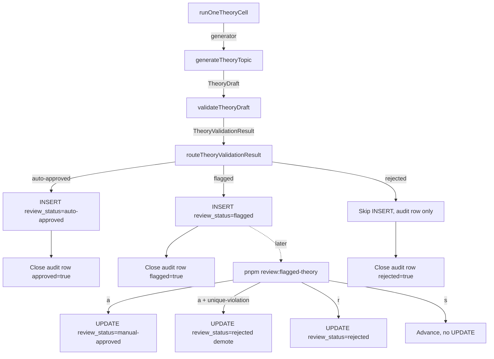
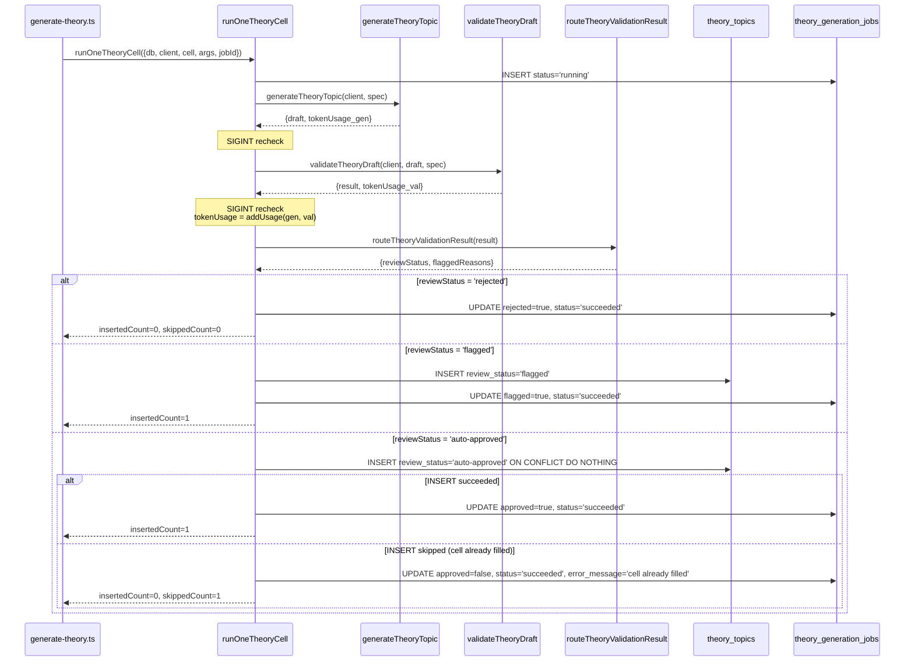

# Design Document — theory-generation-phase-3

## Overview

Phase 3 closes the quality loop for theory generation by inserting a Claude-driven validator pass and a human reviewer queue between the generator (Phase 2) and the panel renderer (Phase 5). The work is intentionally modeled as a near-verbatim mirror of the exercise-side equivalents (`validate.ts`, `validation-prompts.ts`, `routing.ts`, `review-flagged.ts`) so that the two pipelines stay structurally identical and a single operator can run both without context switching.

The design is dominated by **what to mirror** (six files, six mirrors) and a small number of **deliberate deltas** from the exercise pipeline: theory has a stricter routing policy (factual errors are a hard reject), a smaller validation surface (no `ambiguous`, no `grammarPointMatch`; replaced by `factualErrors`, `sectionsIncomplete`, `examplesUseGrammarPoint`), and one fewer review key (`[e]dit` is intentionally deferred). The orchestrator (`runOneTheoryCell`) gains a single new step — `validateTheoryDraft` → `routeTheoryValidationResult` → branched INSERT — but its existing audit-row, SIGINT, dedup, and failClosed scaffolding is preserved as-is.

No new infrastructure. No CDK changes. No new env vars. No new tables (Phase 1 already shipped `theory_topics.review_status` + `quality_score` + `flagged_reasons` + `theory_generation_jobs.{approved,flagged,rejected}` for exactly this).

## Steering Document Alignment

### Technical Standards (tech.md)

- **AI / GenAI section** (§2): the validator uses `claude-sonnet-4-5` (the same `GENERATION_MODEL` constant the generator and the exercise validator already pin) with Anthropic prompt caching via `cache_control: ephemeral` on the system block. Matches the documented "Prompt caching" line item.
- **Backend API section** (§2): the router is a pure TypeScript module under `packages/db/src/`, matching the "shared schema definitions" pattern. The review CLI lives next to the existing `pnpm review:flagged` script under `packages/db/scripts/`.
- **Content & AI Strategy** (§7): validator is the quality-control complement to the pre-generation cost-control strategy already in place. Same model, same auth, same Secrets Manager wiring.
- **Security checklist** (§12): the CLI inherits the existing `--allow-prod` production guard from `review-flagged.ts`. `DATABASE_URL` is read from `.env` (via the `dotenv -e .env` wrapper in the root `package.json` script). No new secrets, no new IAM, no new CORS surface.
- **No new dependencies.** Phase 3 uses only modules already on the dependency manifest: `@anthropic-ai/sdk`, `drizzle-orm`, `node:readline` — all currently imported elsewhere in `packages/ai` and `packages/db`.

### Project Structure (structure.md / monorepo conventions)

The file layout mirrors the existing exercise pipeline exactly so that an operator who knows where the exercise files live can predict every Phase 3 path:

| Concern | Exercise (existing) | Theory (Phase 3) |
|---|---|---|
| Validator core | `packages/ai/src/validate.ts` | `packages/ai/src/theory-validate.ts` |
| Validator prompts | `packages/ai/src/validation-prompts.ts` | `packages/ai/src/theory-validation-prompts.ts` |
| Router | `packages/db/src/generation/routing.ts` | `packages/db/src/theory-generation/routing.ts` |
| Per-cell orchestrator | `packages/db/src/generation/run-one-cell.ts` | `packages/db/src/theory-generation/run-one-cell.ts` *(modify, not create)* |
| Review CLI | `packages/db/scripts/review-flagged.ts` + `-parse-args.ts` | `packages/db/scripts/review-flagged-theory.ts` + `-parse-args.ts` |
| Plain-text renderer | n/a (exercises render via `JSON.stringify`) | `packages/db/scripts/theory-json-to-text.ts` *(new helper)* |
| `pnpm` script alias | `review:flagged` in root `package.json` | add `review:flagged-theory` |
| Tests (Vitest, co-located) | `*.test.ts` next to each module | same convention |

## Code Reuse Analysis

### Existing Components to Leverage

- **`packages/ai/src/cost-model.ts`** — `ClaudeUsageBreakdown`, `ZERO_USAGE`, `addUsage`, `estimateCostUsd`, `SONNET_4_5_PRICING`. Reused verbatim by the validator for token accounting and by the orchestrator for combining generator + validator usage. Zero new exports.
- **`packages/ai/src/generate.ts`** — `GENERATION_MODEL` constant. The validator imports it and asserts equality in its test file so the two paths cannot drift onto different model ids. Already aliased by `theory-generate.ts` as `THEORY_GENERATION_MODEL`.
- **`packages/ai/src/prompts.ts`** — `CEFR_LEVEL_DESCRIPTORS`. The validator prompt re-uses the same bullet list the exercise validator uses, so a reviewer reading both prompts side-by-side sees identical level definitions.
- **`packages/ai/src/theory-prompts.ts`** — `TheoryPromptInputs` type. The validator's `spec` → prompt-inputs mapping is the same shape as the generator's, so the prompt builder can pull from the same input struct.
- **`packages/db/src/generation/routing.ts`** — `ReviewStatus` union (`'auto-approved' | 'flagged' | 'rejected' | 'manual-approved'`). Re-exported / re-used so theory and exercise routing share the same string literals. **No new union.**
- **`packages/db/src/theory-generation/run-one-cell.ts`** — the existing Phase 2 orchestrator. Phase 3 inserts a new step between "generator returned" and "INSERT row" without altering: audit-row open/close, SIGINT precheck/recheck pattern, `.onConflictDoNothing()` dedup branch, `failClosed` helper.
- **`packages/db/scripts/review-flagged.ts`** — `createKeystrokeReader`, `isUniqueViolation`, the TTY-vs-Readable split, the `try/finally { reader.close() }` teardown, the `--allow-prod` guard. **The keystroke reader is exported and reused via import**, not duplicated; this is a meaningful structural decision (see Component 5 below).
- **`packages/db/scripts/parse-args-common.ts`** — `collectRawFlags`, `requireString`. Re-used by the new theory-review parse-args module.
- **`packages/db/scripts/env-helpers.ts`** — `requireEnv`. Re-used for `DATABASE_URL` resolution.

### Integration Points

- **`theory_topics` table** (Phase 1, already shipped) — the writer side already supports `review_status IN ('auto-approved', 'flagged', 'rejected', 'manual-approved')`, `quality_score real`, `flagged_reasons jsonb`. No migration. The unique partial index on `(language, grammar_point_key) WHERE review_status IN ('auto-approved', 'manual-approved')` already exists — Phase 3's reviewer demote path (Req 5.3) is exactly the case that index was designed for.
- **`theory_generation_jobs` table** (Phase 1) — the `approved`, `flagged`, `rejected` boolean columns already exist; Phase 2 writes `approved=true, flagged=false, rejected=false` always. Phase 3 starts populating the other two combinations.
- **Phase 5 panel registry** (future work) — Phase 5's `getTheoryTopic` SELECT predicate (`review_status IN ('auto-approved', 'manual-approved')`) is what makes flagged/rejected rows invisible to learners. Phase 3 produces those rows; Phase 5 already promises to hide them. No coordination needed.

## Architecture



**Five-stage pipeline per cell:**

1. **Generator** (Phase 2, unchanged) → produces a `TheoryDraft` or throws.
2. **Validator** (new) → second Claude call grades the draft against six dimensions; returns a `TheoryValidationResult` or throws.
3. **Router** (new) → pure function maps the result to `(reviewStatus, flaggedReasons)`.
4. **Writer** (Phase 2's INSERT, modified) → routes the row to one of three terminal states.
5. **Audit closer** (Phase 2's `failClosed`/UPDATE, modified) → records the routing decision in `theory_generation_jobs.{approved,flagged,rejected}`.

Stages 2–3 are additive; stages 1, 4, 5 are existing code with branches added.

**Asynchronous human path** (independent of the synchronous pipeline above):

The `review-flagged-theory` CLI reads `theory_topics WHERE review_status = 'flagged'` and walks rows one at a time. Each terminal keystroke (`a`/`r`) issues an UPDATE guarded by `AND review_status = 'flagged'` so a concurrent write (another reviewer, a future Lambda) cannot cause a lost update. The CLI's only path back to the generator is implicit: a reviewer who rejects a row leaves the cell unfilled, so the next scheduled run (Phase 4) re-generates it.

## Components and Interfaces

### Component 1 — `packages/ai/src/theory-validate.ts`

- **Purpose:** Single Claude call that grades one `TheoryDraft` and returns a structured `TheoryValidationResult`. Pure with respect to inputs.
- **Public exports:**
  - `THEORY_VALIDATION_MODEL` (`'claude-sonnet-4-5'`, aliased to `GENERATION_MODEL` for cross-file equality assertion)
  - `THEORY_VALIDATION_MAX_TOKENS` (`1024`)
  - `THEORY_VALIDATION_TEMPERATURE` (`0.0` — deterministic reviewer)
  - `THEORY_VALIDATION_TOOL_NAME` (`'submit_theory_validation_result'`)
  - `THEORY_VALIDATION_TOOL: Anthropic.Tool` — six required properties (see Data Models below)
  - `TheoryValidationResult` (type)
  - `ValidateTheoryDraftResult` (`{ result: TheoryValidationResult, tokenUsage: ClaudeUsageBreakdown }`)
  - `parseTheoryValidationResult(input: unknown): TheoryValidationResult` — field-level error format identical to `parseValidationResult`
  - `validateTheoryDraft(client: Anthropic, draft: TheoryDraft, spec: TheoryGenerationSpec): Promise<ValidateTheoryDraftResult>`
- **Dependencies:** `@anthropic-ai/sdk`; `./cost-model` (`ClaudeUsageBreakdown`); `./generate` (`GENERATION_MODEL`); `./theory-generate` (`TheoryDraft`, `TheoryGenerationSpec`); `./theory-validation-prompts` (the two prompt builders).
- **Reuses:** Structural mirror of `packages/ai/src/validate.ts` — same `messages.create` call shape, same `cache_control: { type: 'ephemeral' }` on the system block, same `tool_choice` form, same `readUsage` helper (re-declared locally per Phase-2's "self-contained module" convention to avoid a circular import).
- **Required `packages/ai/src/index.ts` updates:** the index module re-exports every public surface of the package; Phase 3 adds re-exports for `THEORY_VALIDATION_MODEL`, `THEORY_VALIDATION_MAX_TOKENS`, `THEORY_VALIDATION_TEMPERATURE`, `THEORY_VALIDATION_TOOL_NAME`, `THEORY_VALIDATION_TOOL`, `TheoryValidationResult`, `ValidateTheoryDraftResult`, `parseTheoryValidationResult`, `validateTheoryDraft`, plus `THEORY_VALIDATION_THRESHOLDS` from `theory-validation-thresholds.ts`. Without this step, the `packages/db` orchestrator's `import { … } from '@language-drill/ai'` fails to resolve at typecheck time.

### Component 2 — `packages/ai/src/theory-validation-prompts.ts`

- **Purpose:** Build the validator's system and user prompts. Two pure functions; the system prompt is `spec`-only (cache-friendly), the user prompt is `(draft, spec)`-derived.
- **Public exports:**
  - `THEORY_VALIDATION_SYSTEM_PROMPT_TEMPLATE` (raw string with `{{placeholders}}` — exposed for structural test assertions)
  - `buildTheoryValidationSystemPrompt(spec: TheoryGenerationSpec): string`
  - `buildTheoryValidationUserPrompt(draft: TheoryDraft, spec: TheoryGenerationSpec): string`
- **Dependencies:** `@language-drill/shared` (`CefrLevel`, `Language`); `./prompts` (`CEFR_LEVEL_DESCRIPTORS`); `../routing` is **not** imported directly — to avoid a `packages/ai → packages/db` dependency reversal, the threshold values are imported from a new constants module (see Component 3's note on shared thresholds).
- **System prompt content (in order):**
  1. Role line: *"You are a strict reviewer of language reference material for adult learners. The page is for CEFR `{{cefrLevel}}` `{{language}}`."*
  2. Grammar-point context (`name`, `description`, `examplesPositive`, `commonErrors`)
  3. CEFR level descriptor bullet block (reused verbatim from `validation-prompts.ts`)
  4. The six required theory sections in the order the generator produces them (`what-is-it`, `when-to-use`, `formation`, `examples`, `pitfalls`)
  5. **Routing implication block** — restates the thresholds from Component 3 by interpolating `THEORY_VALIDATION_THRESHOLDS.flagQualityFloor` / `approveQualityFloor` (per Req 2.5, so a future tuning round propagates automatically)
  6. Per-dimension scoring rubric (one bullet per tool field)
  7. Closing directive: *"You MUST use the submit_theory_validation_result tool. Do not return plain text."*
- **User prompt:** *"Validate the following theory page for `{{grammarPoint.key}}` at CEFR `{{cefrLevel}}`:\n\n```json\n{{JSON.stringify(draft.contentJson, null, 2)}}\n```"*
- **Reuses:** Same builder pattern as `validation-prompts.ts`; same `CEFR_LEVEL_DESCRIPTORS` bullet renderer.

**Note on thresholds-import direction (and an intentional improvement over the exercise side).** The router (Component 3) lives in `packages/db/src/`; the prompt builder lives in `packages/ai/src/`. To avoid the forbidden `packages/ai → packages/db` import direction, the threshold constants are co-located with the validator at `packages/ai/src/theory-validation-thresholds.ts` (a 5-line module exporting a frozen `THEORY_VALIDATION_THRESHOLDS` object) and **re-exported** by the router so downstream consumers can pick whichever package they're already in.

This is an *intentional improvement over the exercise pipeline*, not a mirror. The existing `packages/ai/src/validation-prompts.ts` hard-codes the `0.5` / `0.7` literals as plain English in its routing-implication block (see `validation-prompts.ts:50–56`), so the exercise pipeline duplicates the constants. Phase 3 introduces the shared-constant pattern for theory because Req 2.5 explicitly mandates interpolation; a future cleanup could backport this pattern to the exercise validator, but that's out of scope for Phase 3.

Requirements.md Req 2.5 references the constants by their canonical-source path (`packages/db/src/theory-generation/routing.ts`); the design's actual source-of-truth is the co-located `packages/ai/src/theory-validation-thresholds.ts`. These resolve to the same numeric values via the router's re-export, but a task-writer should know to import *from the AI-side module* when editing prompt builder code (no `packages/ai → packages/db` cycle) and *from the router* when editing orchestrator code (the router is already a `packages/db` neighbor).

### Component 3 — `packages/db/src/theory-generation/routing.ts`

- **Purpose:** Pure deterministic mapping `TheoryValidationResult` → `(reviewStatus, flaggedReasons)`. No I/O.
- **Public exports:**
  - `THEORY_VALIDATION_THRESHOLDS` (re-export from `@language-drill/ai`'s `theory-validation-thresholds`; frozen object with `approveQualityFloor: 0.7`, `flagQualityFloor: 0.5`)
  - `TheoryReviewStatus` (type alias derived as `Exclude<ReviewStatus, 'manual-approved'>` from `packages/db/src/generation/routing.ts` — single source of truth for the four-value union; the router output narrows to the three values it can actually return, preserving the JSDoc invariant that `'manual-approved'` is set only by the CLI's UPDATE path)
  - `TheoryRoutingDecision` (`{ reviewStatus: TheoryReviewStatus, flaggedReasons: string[] }`)
  - `routeTheoryValidationResult(result: TheoryValidationResult): TheoryRoutingDecision`
- **Dependencies:** `@language-drill/ai` (`TheoryValidationResult`, `THEORY_VALIDATION_THRESHOLDS`). No DB imports; no Anthropic SDK; no I/O.
- **Routing logic (see Data Models for the decision table):**
  - Reject branches (checked in order): `factualErrors.length > 0` → reject; else `culturalIssues.length > 0` → reject; else `qualityScore < 0.5` → reject with `['low quality score (<0.5)', ...result.flaggedReasons]`.
  - Auto-approve branch: `qualityScore >= 0.7 && !levelMismatch && sectionsIncomplete.length === 0 && examplesUseGrammarPoint`.
  - Flag branch: everything else. Reasons accumulate in fixed order: `'low quality score (<0.7)'` (if 0.5 ≤ score < 0.7), `'level mismatch'`, `'incomplete section: <name>'` for each section, `'examples off-target'`, then `...result.flaggedReasons`.
- **Reuses:** Structural mirror of `packages/db/src/generation/routing.ts`. Uses the same `Object.freeze` pattern for thresholds, the same accumulating reasons-list pass, the same JSDoc invariant about `'manual-approved'` never being returned.

### Component 4 — `packages/db/src/theory-generation/run-one-cell.ts` *(modify)*

- **Purpose:** Per-cell orchestrator. Phase 3 inserts validator + router between the existing generator call and the existing INSERT.
- **Public surface (unchanged):** `runOneTheoryCell(input: RunOneTheoryCellInput): Promise<TheoryCellResult>`.
- **Surgical changes:**
  1. After `generateTheoryTopic` returns (existing code), add SIGINT recheck (existing pattern), then `await validateTheoryDraft(client, draft, spec)`. On throw → `failClosed` carrying the generator's tokenUsage (we already paid for those tokens; the validator hadn't started so its usage is `ZERO_USAGE`).
  2. After validator returns, accumulate `tokenUsage = addUsage(generatorUsage, validatorUsage)` and add another SIGINT recheck.
  3. Compute `const decision = routeTheoryValidationResult(result)`.
  4. **Branch on `decision.reviewStatus`:**
     - `'rejected'` → skip INSERT entirely. UPDATE the audit row with `status='succeeded'`, `approved=false`, `flagged=false`, `rejected=true`, `quality_score=result.qualityScore`, write the accumulated tokenUsage. Return `TheoryCellResult` with `status: 'succeeded'`, `insertedCount: 0`, `skippedCount: 0`. *(Distinct from a dedup skip: `skippedCount` stays 0; the rejected boolean on the audit row carries the routing information.)*
     - `'flagged'` → INSERT with `review_status='flagged'`, `quality_score=result.qualityScore`, `flagged_reasons=decision.flaggedReasons`. UPDATE audit row with `approved=false, flagged=true, rejected=false`. Return `insertedCount: 1`. The partial unique index does NOT fire on flagged rows because it's predicated on `review_status IN ('auto-approved', 'manual-approved')`.
     - `'auto-approved'` → INSERT with `review_status='auto-approved'`, `quality_score=result.qualityScore`, `flagged_reasons=null`. UPDATE audit row with `approved=true, flagged=false, rejected=false`. The existing `.onConflictDoNothing()` branch still handles the dedup-skip case (Phase 2's "cell already filled" path).
- **Dependencies (new):** `validateTheoryDraft` from `@language-drill/ai`; `routeTheoryValidationResult` from `./routing`.
- **Reuses:** Every existing scaffolding piece — `failClosed`, `assertValidTheoryCellKey`, audit row open/close, SIGINT recheck pattern, `.onConflictDoNothing()` dedup, `ERROR_MESSAGE_MAX_LENGTH` truncation.

**Cost-cap deferral.** Phase 2's `RunOneTheoryCellInput.args` already carries a `maxCostUsd` field and `TheoryCellResult.status` already includes `'skipped-cost-cap'`, but **no enforcement check is currently wired in `run-one-cell.ts`**. Phase 3 does **not** add the cost-cap check either — none of Requirements 1–6 mandate it, and adding it now would mix scope. The field and the status variant remain reserved for Phase 4 (the SQS Lambda + scheduler), where the cap-per-Lambda-invocation semantic actually matters. Existing tests that pass `maxCostUsd: Number.POSITIVE_INFINITY` (or any other value) continue to behave as no-ops.

### Component 5 — `packages/db/scripts/review-flagged-theory.ts` + `-parse-args.ts`

- **Purpose:** Interactive CLI to walk the flagged-theory queue. Single keystrokes advance: `a` approve, `r` reject, `s` skip, `q` quit.
- **Public exports (from `review-flagged-theory.ts`):**
  - `FlaggedTheoryRow` (type; subset of `theory_topics` columns + a denormalized `contentJson: TheoryTopicJson | null`)
  - `selectFlaggedTheoryRows(db, args): Promise<FlaggedTheoryRow[]>`
  - `countFlaggedTheory(db, args): Promise<number>`
  - `renderTheoryRow(row, stdout): void`
  - `tryApproveTheory(db, row): Promise<'approved' | 'demoted'>` (demote-on-unique-violation path)
  - `rejectTheoryRow(db, row): Promise<void>`
  - `printTheoryReviewSummary(counts, totalReviewed, remaining): void`
  - `main(argv?, stdinSource?): Promise<void>`
- **Public exports (from `review-flagged-theory-parse-args.ts`):**
  - `TheoryReviewArgs` (`{ lang, level, grammarPoint, limit, allowProd }` — no `type` field; theory has no per-type fan-out)
  - `parseTheoryReviewArgs(argv): TheoryReviewArgs`
- **Slice predicate:** `review_status = 'flagged' AND language = $lang [AND cefr_level = $level] [AND grammar_point_key = $gp]`, ordered by `generated_at ASC`, limited by `$limit` (default 25, range [1, 200]).
- **Rendering** (`renderTheoryRow`):
  - Header: `─── {idPrefix}... ───  {lang} {level} {grammarPointKey}  qualityScore={score.toFixed(2)}`
  - Body: invoke `theoryTopicJsonToText(row.contentJson)` (Component 6) → multi-line indented plain text.
  - Footer: `Flagged reasons:` + bulleted `flaggedReasons` array (or `(none recorded)`).
- **Reuses (imports from `review-flagged.ts` — single source of truth, no duplication):**
  - `createKeystrokeReader` — full TTY/Readable abstraction, raw-mode handling, Ctrl-C exit-130 path. **Imported, not duplicated.** A re-export shim lives in `review-flagged-theory.ts` for test convenience.
  - `isUniqueViolation` — same SQLSTATE-23505 detection helper; imported.
  - `KeystrokeReader` type — imported.
  - `parse-args-common.ts` (`collectRawFlags`, `requireString`) — for the parse-args sibling module.
  - `env-helpers.ts` (`requireEnv`) — for `DATABASE_URL`.
- **Re-implemented (theory-specific, different table/columns):**
  - `selectFlaggedTheoryRows`, `countFlaggedTheory`, `flaggedTheorySlicePredicate` (theory's WHERE clause uses `cefr_level` not `difficulty` and has no `type`) — written from scratch but follow the exercise-side shape line-for-line.
  - `FlaggedTheoryRow` type — distinct column subset (see Data Models).
  - `renderTheoryRow` — calls `theoryTopicJsonToText` (Component 6) instead of `JSON.stringify`; otherwise structurally identical.
  - `tryApproveTheory`, `rejectTheoryRow` — same UPDATE shape, target the `theory_topics` table.
- **Counts + summary printer — extended, not re-imported:**
  - `TheoryReviewCounts` extends `{ approved, rejected, skipped }` with a new `demoted: number` field (the exercise CLI rolls demotes into `rejected` per its requirement; theory tracks them separately so the summary line surfaces the unique-violation count for operators).
  - `printTheoryReviewSummary` is a new function (different summary string with the `demoted` count) — *not* a wrapper over `printReviewSummary` because the count shape differs. Could be refactored to a shared printer in a future cleanup if a third reviewer ever ships.
- **`main()` is re-implemented, not imported.** The exercise CLI's `main()` references the exercise table and the exercise summary printer; the theory `main()` mirrors its structure (production guard → DB connect → select rows → empty-slice early exit → keystroke loop → finally close-reader → summary print) but with theory-specific dependencies wired in.
- **`pnpm` script wiring:** Root `package.json` gains a `"review:flagged-theory": "dotenv -e .env -- pnpm --filter @language-drill/db review:flagged-theory"` line; the `@language-drill/db` package's own `package.json` gains `"review:flagged-theory": "tsx scripts/review-flagged-theory.ts"`. Mirrors the existing `review:flagged` wiring exactly.

### Component 6 — `packages/db/scripts/theory-json-to-text.ts`

- **Purpose:** Render a `TheoryTopicJson` as multi-line plain text for the terminal. CLI-side only — no React, no styling, no shared with the web renderer.
- **Public exports:**
  - `theoryTopicJsonToText(topic: TheoryTopicJson): string`
- **Layout:**
  - Title on its own line (no surrounding markup)
  - Subtitle in italics-style (preceded by `> `) on the next line
  - Blank line
  - For each section: `## {sectionTitle}` on its own line, then the rendered `body` (blocks below), blank line
  - For each block: paragraph → joined inline text wrapped to 80 cols (`wordWrap` helper); list → bulleted lines indented two spaces; callout → block indented two spaces with `! ` prefix; example → `  • target: {target}\n    en:     {en}\n    note:   {note}` indented four spaces; conjugation-table → ASCII grid via simple column padding.
  - Inline emphasis is dropped (no terminal styling — the goal is grep-ability, not rendering fidelity).
- **Dependencies:** `@language-drill/shared` (`TheoryTopicJson`, `TheoryBlockJson`, `TheoryInlineJson`).
- **Reuses:** Nothing — the exercise CLI dumps raw JSON via `JSON.stringify(row.contentJson, null, 2)`, which is unreadable for theory's deep tree.
- **Why a separate file:** Component 5 stays focused on DB + interactive loop; the renderer is a pure function with its own test surface. Plain-text-rendering edge cases (mixed inline kinds inside a paragraph, nested callouts, empty section bodies — already rejected at parse time per Phase 2's strict parser) get a dedicated test file rather than polluting the CLI's tests.

## Data Models

### `TheoryValidationResult`

```ts
export type TheoryValidationResult = {
  /** 0..1 inclusive. */
  qualityScore: number;
  /**
   * Factually wrong claims (grammar rules, conjugations, etc.). Non-empty
   * is a HARD REJECT — stricter than the exercise validator. A wrong rule
   * in a theory page is the canonical reference for that grammar point.
   */
  factualErrors: string[];
  /** Vocabulary or concepts above/below the spec's CEFR level. */
  levelMismatch: boolean;
  /**
   * Names of required sections (what-is-it, when-to-use, formation,
   * examples, pitfalls) that are missing or thin. Empty array when
   * the page covers all sections adequately.
   */
  sectionsIncomplete: string[];
  /** Do the examples actually demonstrate the target grammar point? */
  examplesUseGrammarPoint: boolean;
  /** Stereotyping, sensitive content, exclusion. Non-empty → REJECT. */
  culturalIssues: string[];
  /** Free-text hints the reviewer wants to see. Surface verbatim in CLI. */
  flaggedReasons: string[];
};
```

### `TheoryRoutingDecision` and routing-decision table

```ts
export type TheoryReviewStatus = 'auto-approved' | 'flagged' | 'rejected';

export type TheoryRoutingDecision = {
  reviewStatus: TheoryReviewStatus;
  flaggedReasons: string[];
};
```

Decision table (top-to-bottom; first match wins):

| Condition | reviewStatus | flaggedReasons |
|---|---|---|
| `factualErrors.length > 0` | `'rejected'` | `[...factualErrors]` |
| `culturalIssues.length > 0` | `'rejected'` | `[...culturalIssues]` |
| `qualityScore < 0.5` | `'rejected'` | `['low quality score (<0.5)', ...flaggedReasons]` |
| `qualityScore >= 0.7 && !levelMismatch && sectionsIncomplete.length === 0 && examplesUseGrammarPoint` | `'auto-approved'` | `[]` |
| *(else)* | `'flagged'` | *(accumulating list, ordered)* |

Flagged reasons-list order (only entries whose condition holds are appended):
1. `'low quality score (<0.7)'` — if `0.5 <= qualityScore < 0.7`
2. `'level mismatch'` — if `levelMismatch`
3. `'incomplete section: <name>'` — one per entry in `sectionsIncomplete`
4. `'examples off-target'` — if `!examplesUseGrammarPoint`
5. `...result.flaggedReasons` (verbatim)

### `TheoryReviewArgs`

```ts
export type TheoryReviewArgs = {
  lang: LearningLanguage;                                  // ES | DE | TR (EN rejected)
  level: CurriculumCefrLevel | null;                       // A1 | A2 | B1 | B2 | null
  grammarPoint: string | null;                             // free-text key
  limit: number;                                           // [1, 200], default 25
  allowProd: boolean;                                      // gates NODE_ENV=production
};
```

Distinct from `ReviewArgs` (exercise CLI): no `type` field, and `level` is `CurriculumCefrLevel` (A1–B2) not `CefrLevel` (A1–C2) because theory's curriculum stops at B2 — see `packages/shared/src/curriculum-types.ts` (`CurriculumCefrLevel` type) and plan §1.2 (round-1 scope = A1–B2 × ES/DE/TR).

### `FlaggedTheoryRow`

```ts
export type FlaggedTheoryRow = {
  id: string;
  language: string | null;
  cefrLevel: string | null;
  grammarPointKey: string | null;
  topicId: string | null;
  contentJson: TheoryTopicJson | null;                     // narrowed from jsonb
  qualityScore: number | null;
  flaggedReasons: string[] | null;
  generatedAt: Date | null;
};
```

The `jsonb`-typed `contentJson` column is `unknown` at the Drizzle layer; the CLI narrows via a parse step before `renderTheoryRow` (using `parseTheoryTopicJson` from `@language-drill/shared`, which Phase 1 ships). A parse failure surfaces as "render error: <message>" with a `[s]kip / [q]uit`-only prompt — the row remains flagged so a downstream operator can investigate.

## Error Handling

### Error Scenarios

1. **Validator: Claude returns no tool_use block.**
   - **Handling:** `validateTheoryDraft` throws `Error("Validator did not return a tool use block. Stop reason: ${response.stop_reason}. Content types: ${types.join(', ')}")`. `runOneTheoryCell`'s try/catch wraps the call and routes to `failClosed` with the generator's tokenUsage preserved.
   - **User impact:** Operator sees the cell as `failed` in the CLI summary with the truncated error message; re-running the cell (same `jobId` derivation) re-triggers a fresh validator call.

2. **Validator: tool input fails schema parse.**
   - **Handling:** `parseTheoryValidationResult` throws `Error("Invalid <field>: must be <expected>, got <JSON.stringify(value)>")`. Same `failClosed` path as Scenario 1.
   - **User impact:** Same as 1; the field-level message in `theory_generation_jobs.error_message` tells the operator which dimension Claude got wrong.

3. **Router: unexpected enum value.**
   - **Handling:** Cannot happen — the input type is a typed `TheoryValidationResult`. TypeScript prevents it at compile time. A test asserts every branch of the decision table is reachable and exhaustive.
   - **User impact:** None.

4. **Orchestrator: SIGINT after generator, before validator.**
   - **Handling:** SIGINT recheck immediately after generation and before validator call returns `failClosed` with `tokenUsage = generatorUsage` (we already paid; record it honestly). The validator call is never made.
   - **User impact:** CLI exits cleanly; cell marked `failed` with message `'Aborted by user (SIGINT)'`; re-run is a no-op for already-completed cells in the batch.

5. **Orchestrator: SIGINT during validator call.**
   - **Handling:** The `signal?.aborted` recheck immediately after the validator's `await` returns triggers `failClosed` with `tokenUsage = addUsage(generatorUsage, validatorUsage)`.
   - **User impact:** Same as 4 but with the validator's spend recorded.

6. **CLI: unique-violation on `[a]pprove`.**
   - **Handling:** `tryApproveTheory` catches SQLSTATE 23505 from the partial unique index and issues a second UPDATE setting `review_status='rejected'`. Returns `'demoted'`; the CLI prints a one-line warning (`↓ demoted {id} (another approved row already in cell)`).
   - **User impact:** Reviewer sees the row demoted and the queue advances. The pre-existing approved row stays untouched.

7. **CLI: `contentJson` JSON shape is broken.**
   - **Handling:** `parseTheoryTopicJson` throws inside `renderTheoryRow`; the CLI catches and renders `"(content render error: <truncated message>)"` instead of the topic body. The keystroke prompt restricts to `[s]kip / [q]uit / [r]eject` (no approve — approving a row whose content can't be parsed would corrupt the registry). The `flaggedReasons` block still renders so the reviewer sees what the validator found.
   - **User impact:** Reviewer can reject or skip; corruption cannot be promoted to approved.

8. **CLI: concurrent write demotes/clears the row mid-keystroke.**
   - **Handling:** Every UPDATE carries `AND review_status = 'flagged'`. A concurrent change (another reviewer, future Lambda) makes the UPDATE match zero rows; the CLI surfaces this as `"(no-op: row state changed concurrently)"` and advances without incrementing any count.
   - **User impact:** Reviewer is informed; no lost-update bug.

9. **CLI: `--lang en` passed.**
   - **Handling:** `parseTheoryReviewArgs` throws `Error("--lang en is not a learning language. Use es | de | tr.")` before any DB connection.
   - **User impact:** Process exits 1 with the message printed to stderr.

10. **CLI: `NODE_ENV=production && !--allow-prod`.**
    - **Handling:** Same guard as `review-flagged.ts`. CLI prints `"Refusing to run in production. Pass --allow-prod or use the Phase 5 admin UI."` and exits 1 before any DB connection.
    - **User impact:** Production protection.

11. **Deploy-order precondition: Phase 1 schema not applied.**
    - **Handling:** Not a runtime concern but a deploy-order one: Phase 3 assumes the Phase 1 migration (`0008_theory_topics.sql`) is already applied to whichever Neon branch the operator targets. If it isn't, the orchestrator's `INSERT INTO theory_topics` raises `relation "theory_topics" does not exist`, which surfaces in `theory_generation_jobs.error_message` (or fails Drizzle's audit-row INSERT first if `theory_generation_jobs` is also missing).
    - **User impact:** Operator sees a clear missing-table error and runs `pnpm db:migrate` before retrying. Documented in the implementation tasks' pre-flight checklist; no code change in Phase 3 since the Phase 2 generator already faces this same precondition.

## Testing Strategy

### Unit Testing

| File under test | Test file | Coverage focus |
|---|---|---|
| `theory-validate.ts` | `theory-validate.test.ts` | parseTheoryValidationResult happy path + field-level error messages; validateTheoryDraft with a mocked `Anthropic` whose `messages.create` returns canned `tool_use` shapes; cross-file model-id equality assertion (`THEORY_VALIDATION_MODEL === GENERATION_MODEL`) |
| `theory-validation-prompts.ts` | `theory-validation-prompts.test.ts` | byte-identical output for equal specs; threshold values appear in the routing-implication block (interpolated, not hard-typed — assert by substituting threshold constants and checking the substring); ordered section list present; **cross-check** test: the rendered prompt contains the literal `THEORY_VALIDATION_THRESHOLDS.flagQualityFloor.toString()` and `…approveQualityFloor.toString()` substrings, so a typo in either side breaks the build |
| `theory-validation-thresholds.ts` | covered by `routing.test.ts` | the 5-line module's assertion: `Object.freeze` is intact (a write throws in strict mode) AND `flagQualityFloor < approveQualityFloor` invariant holds |
| `routing.ts` (theory) | `routing.test.ts` (`packages/db/src/theory-generation/`) | every decision-table row reachable; reasons-list order; pure (no mock framework needed); `'manual-approved'` never returned property test |
| `run-one-cell.ts` (theory, modified) | `run-one-cell.test.ts` (existing file, extended) | new cases: validator-throws path keeps generator tokenUsage; auto-approve path INSERTs with `review_status='auto-approved'`; flagged path INSERTs with `review_status='flagged'`; rejected path skips INSERT and writes `rejected=true` audit row; SIGINT after generator before validator |
| `review-flagged-theory-parse-args.ts` | `review-flagged-theory-parse-args.test.ts` | required `--lang`, EN rejection, level/grammar-point/limit validation, `--help` exits 0, `--allow-prod` warning |
| `review-flagged-theory.ts` | `review-flagged-theory.test.ts` | unit: `tryApproveTheory` happy/demote/unrelated-error paths; `rejectTheoryRow` UPDATE shape; `printTheoryReviewSummary` formatting; integration: mocked stdin via `createKeystrokeReader(Readable)` + a real Neon dev branch, walking 3-row fixture through approve/reject/skip |
| `theory-json-to-text.ts` | `theory-json-to-text.test.ts` | one test per block kind; nested callouts; long paragraphs (word-wrap at 80 cols); the three hand-authored ES fixtures from `apps/web/content/theory/es/` round-trip into something grep-able |

### Integration Testing

- **DB integration tests** (DB-touching) run against the Neon dev branch the existing tests already use. Same `DATABASE_URL` setup, same Drizzle migration state.
- **`run-one-cell.test.ts`** drives a mocked Anthropic client that returns canned generator + validator responses, asserts the DB state after each branch (`theory_topics` row presence + `review_status`, `theory_generation_jobs` row's terminal booleans).
- **`review-flagged-theory.test.ts`** seeds three flagged rows via raw INSERT, then drives the CLI via a Readable stdin, asserting the final row states after each keystroke.

### End-to-End Testing

- **MOCK_CLAUDE=1 path:** `pnpm generate:theory --lang es --grammar-point es-b1-present-subjunctive --batch-seed test` produces an `auto-approved` row when the mock fixture passes the validator's mocked response, a `flagged` row when the mock returns `qualityScore=0.6`, and skips INSERT for a mocked `factualErrors: ['...']`. The mock client (extended from Phase 2's `generate-theory-mock-client.ts`) dispatches by `tool_choice.name` — `THEORY_TOOL_NAME` → cycle generation fixtures; `THEORY_VALIDATION_TOOL_NAME` → cycle validation fixtures.
- **Live-Claude E2E** is out of scope for the test suite (the project's `MOCK_CLAUDE=1` convention forbids live calls in CI). A manual `pnpm generate:theory --lang es --level B1` smoke test against the dev Neon branch + a real `ANTHROPIC_API_KEY` is in the task list as a verification step before merging Phase 3.
- **Review CLI smoke test:** `pnpm review:flagged-theory --lang es --limit 5` against the dev Neon branch with a hand-seeded flagged row verifies the TTY path (raw mode, single keystroke, summary print). Documented in the task list, not automated.

## Component Interaction Diagram


