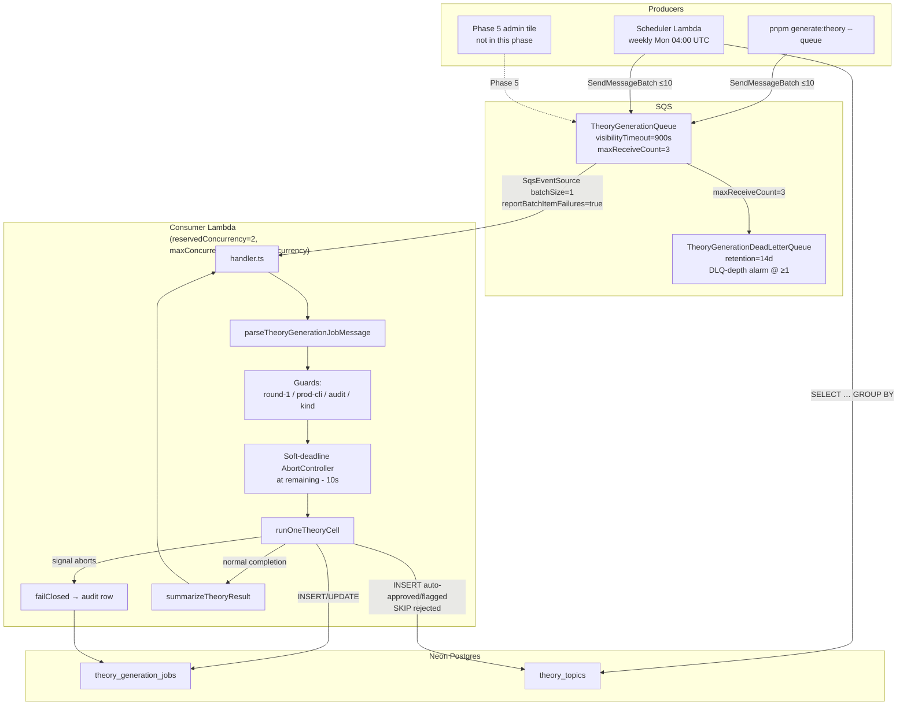

# Design Document — theory-generation-phase-4

## Overview

Phase 4 productionizes the dev-CLI theory generator from Phase 3 by adding three AWS pieces and one CLI affordance, all of which are structural mirrors of the exercise-generation Phase 4 (`infra/lambda/src/generation/`, `infra/lib/constructs/generation-*.ts`) shipped 2026-05-12. The mirror is intentional and load-bearing: every operational pattern that paid off in the exercise-side incident response (900 s timeout, `maxConcurrency: reservedConcurrency`, soft-deadline AbortSignal) ships in theory from day 1 instead of being re-discovered.

The Phase 4 surface area:

1. **Consumer Lambda** (`infra/lambda/src/theory-generation/handler.ts`) — SQS event-source handler; one record per invocation; dispatches to `runOneTheoryCell` with a soft-deadline `AbortSignal`.
2. **Scheduler Lambda** (`infra/lambda/src/theory-generation/scheduler.ts`) — EventBridge-cron-triggered (weekly Mondays 04:00 UTC); enumerates curriculum, diffs against `theory_topics`, posts under-target cells to SQS with deterministic `jobId`.
3. **Message contract + parser** (`infra/lambda/src/theory-generation/job-message.ts`) — typed `TheoryGenerationJobMessage`, field-level parse errors, `checkTheoryAuditRowState` for at-least-once idempotency.
4. **CDK constructs** (`infra/lib/constructs/theory-generation-{queue,lambda}.ts`, `theory-scheduler-lambda.ts`) — SQS + DLQ + alarms; consumer Lambda with reserved-concurrency 2 and `maxConcurrency: reservedConcurrency`; scheduler Lambda with optional EventBridge rule.
5. **CLI `--queue` flag** (`packages/db/scripts/generate-theory-queue.ts` + edits to `generate-theory{,-parse-args}.ts`) — operator-facing path to dispatch one SQS message per resolved cell instead of running the generator in-process.
6. **Stack wiring** (`infra/lib/stack.ts`) — three lines of construct instantiation alongside the existing exercise-side constructs; one new `CfnOutput` (`TheoryGenerationQueueUrl`).

A Phase 4-only deploy is invisible to learners — `getTheoryTopic` still reads only the static TSX registry until Phase 5 wires the DB fallback.

## Steering Document Alignment

### Technical Standards (tech.md)

- **§3 Infrastructure** — adds an SQS queue + DLQ, a consumer Lambda, and an EventBridge cron rule. Same shape as the exercise-generation block already in the stack.
- **§5 CI/CD** — every change ships via the existing `cdk deploy` workflow. No new IaC patterns; the new constructs follow the exact same `infra/lib/constructs/*.ts` + co-located `*.test.ts` layout.
- **§7 Content & AI Strategy** — explicitly commits to "background Lambda… cron-triggered" pre-generation. Phase 4 is the cron's theory implementation.
- **§12 Security Checklist** — secrets continue to flow from AWS Secrets Manager via the existing `secretsPrefix` convention. No new secrets, no new IAM surface for existing resources.
- **AWS SDK v3, Hono, Drizzle, Vitest** — no new third-party deps. `@aws-sdk/client-sqs` and `aws-cdk-lib` are already on the dependency closure.

### Project Structure (structure.md)

`structure.md` does not exist in this repo (verified by `ls .claude/steering/` → only `product.md` + `tech.md`). Project organization is followed empirically:

- Lambda code in `infra/lambda/src/theory-generation/` parallels `infra/lambda/src/generation/`.
- CDK constructs in `infra/lib/constructs/theory-*.ts` parallel `generation-*.ts`.
- DB helpers (no new schema in Phase 4) live in `packages/db/src/theory-generation/` (already exists from Phase 2).
- CLI script code in `packages/db/scripts/generate-theory{,-queue,-parse-args}.ts` mirrors `generate-exercises{,-queue,-parse-args}.ts`.
- Tests are co-located (`*.test.ts` next to module) per `CLAUDE.md` §Testing.

## Code Reuse Analysis

### Existing Components to Leverage

- **`runOneTheoryCell`** (`packages/db/src/theory-generation/run-one-cell.ts`) — Phase 3's per-cell orchestrator. The Lambda invokes it verbatim. The orchestrator already accepts `signal?: AbortSignal` and threads it through generator + validator with `failClosed` finalization on abort — the soft-deadline pattern (Req 2a.2) is a thin shell over this existing contract.
- **`enumerateTheoryCells` + `THEORY_ROUND_1_CEFR_LEVELS`** (`packages/db/src/theory-generation/cells.ts`) — the scheduler's curriculum walk. Vocab umbrellas are silently filtered (already implemented). `THEORY_ROUND_1_CEFR_LEVELS` aliases `ROUND_1_CEFR_LEVELS` from the exercise side, so both pipelines share a single source of truth for round-1 scope.
- **`theoryGenerationJobs` + `theoryTopics`** (`packages/db/src/schema/theory.ts`) — audit row + content table. Phase 1 schema, unchanged.
- **`buildTheoryCellKey` + `assertValidTheoryCellKey`** (`packages/db/src/lib/theory-cell-key.ts`) — cell-key construction and regex validation for the scheduler's deterministic-`jobId` derivation.
- **`getGrammarPoint(key)`** (`packages/db/src/curriculum/`) — curriculum lookup the consumer Lambda uses to resolve `spec.grammarPointKey` → `GrammarPoint`.
- **`createDb`, `createClaudeClient`, `requireEnv`, `deterministicUuid`, `chunk`, `ALL_CURRICULA`** — module-level utilities already exported from `@language-drill/db` and `@language-drill/ai`. The exercise Lambdas import the same set.
- **Phase 3 Lambda construct (`infra/lib/constructs/generation-lambda.ts`)** — the structural mirror. Theory's construct copies its bundling config (esbuild aliases for `@language-drill/{shared,db,ai}`), Lambda runtime (NODEJS_20_X), memory (1024 MB), timeout (900 s), and event-source shape (`batchSize: 1`, `reportBatchItemFailures: true`, `maxConcurrency: reservedConcurrency`). The deltas are: reserved concurrency 2 (not 3), no validator-pool env var, no additional CDK outputs beyond the queue URL.
- **Phase 3 SQS queue construct (`infra/lib/constructs/generation-queue.ts`)** — visibility timeout 900 s, DLQ retention 14 days, `maxReceiveCount: 3`, DLQ-depth CloudWatch alarm at ≥ 1 message in 5 min. Theory's queue copies this verbatim.
- **Phase 3 scheduler construct (`infra/lib/constructs/scheduler-lambda.ts`)** — the always-create-Lambda + optional-EventBridge-rule pattern. Theory's mirror flips the cron from daily (`cron({ minute: '0', hour: '4' })`) to weekly (`cron({ minute: '0', hour: '4', weekDay: 'MON' })`).

### Integration Points

- **AWS Secrets Manager** — both new Lambdas read `${secretsPrefix}/DATABASE_URL`. The consumer Lambda also reads `${secretsPrefix}/ANTHROPIC_API_KEY`. No new secrets are introduced — the prefix and secret names are inherited from the existing exercise-side wiring.
- **Existing `enableScheduledJobs` stack prop** — already gates the exercise scheduler's EventBridge rule. Theory's scheduler reuses the same flag (Req 7.5). Dev = false (no recurring spend); prod = true.
- **Anthropic API key** — shared with exercise generation + live evaluator. Theory's reserved-concurrency = 2 keeps the total cell-level parallelism at 5 (2 theory + 3 exercise) under the Sonnet 4.6 org-tier rate-limit ceiling.
- **Neon DB (`theory_topics`, `theory_generation_jobs`)** — read by both Lambdas; written by `runOneTheoryCell` (consumer) via the audit row + content INSERT. No new tables, no new migrations.
- **`packages/db` → `@language-drill/db`** — the Lambdas already pull in this barrel package; the new exports (`enumerateTheoryCells`, `runOneTheoryCell`, `theoryGenerationJobs`) are already shipped by Phases 1–3.

## Architecture

The Phase 4 runtime data-flow has three producers (CLI `--queue`, scheduler Lambda, future admin route) feeding one SQS queue, which fans out to the consumer Lambda under reserved concurrency 2:



Three control-flow invariants the diagram encodes:

1. **Producers all write through the queue.** No producer touches `theory_topics` directly — that's `runOneTheoryCell`'s responsibility only.
2. **`maxConcurrency` is parameterized off `reservedConcurrency` on the event-source mapping.** Prevents the PR #76 phantom-DLQ failure mode (24/34 in production on 2026-05-12).
3. **The soft-deadline timer arms before the orchestrator runs and clears in `finally`.** Prevents both the PR #79 zombie-row failure mode (audit row never finalized when AWS hard-kills the runtime) and timer leak across invocations in the same Lambda container.

## Components and Interfaces

### Component 1: `TheoryGenerationJobMessage` contract + parser

- **Purpose:** Typed SQS message shape shared between producers (CLI `--queue`, scheduler, future admin) and the consumer Lambda; field-level parse errors land in CloudWatch verbatim for operator debugging.
- **File:** `infra/lambda/src/theory-generation/job-message.ts` (consumer-side canonical) + `packages/db/scripts/generate-theory-queue.ts` (producer-side mirror — see note below).
- **Public surface:**
  - `type TheoryGenerationJobMessage = { jobId: string; trigger: 'cli' | 'scheduled' | 'admin'; spec: { language: LearningLanguage; cefrLevel: CurriculumCefrLevel; grammarPointKey: string; batchSeed: string }; maxCostUsd: number }`
  - `parseTheoryGenerationJobMessage(input: unknown): TheoryGenerationJobMessage` — throws `Error` with field name on every shape violation. Enforced field-level invariants (mirrored from Req 1): `language ∈ {ES, DE, TR}` (EN rejected), `cefrLevel ∈ {A1..C2}` (round-1 narrowing happens in the handler, not the parser), non-empty `grammarPointKey`, `batchSeed` length in `[1, 100]`, `maxCostUsd` in exclusive `(0, 100)`.
  - `type TheoryAuditRowState = { status: 'absent' } | { status: 'in-progress' } | { status: 'completed'; jobStatus: 'succeeded' | 'failed' }`
  - `checkTheoryAuditRowState(db: Db, jobId: string): Promise<TheoryAuditRowState>`
- **Dependencies:** `@language-drill/db` (`theoryGenerationJobs`, `Db`, `CurriculumCefrLevel`), `@language-drill/shared` (`Language`).
- **Reuses:** Structural mirror of `infra/lambda/src/generation/job-message.ts:119` (`parseGenerationJobMessage`) + `:194` (`checkAuditRowState`). The internal `requireNonEmptyString` / `requireUnion` / `requireIntegerInRange` helpers are copied verbatim — re-declaring them keeps the theory module self-contained and avoids reaching into the exercise module's internals.

**Producer/consumer type-duplication.** The exercise pipeline keeps a second copy of the message type in `packages/db/scripts/generate-exercises-queue.ts` because `packages/db` cannot import from `infra/lambda` (the cycle would point the wrong direction — `infra/lambda` already imports `@language-drill/db`). The same constraint applies to theory: the producer-side `TheoryGenerationJobMessage` literal in `generate-theory-queue.ts` is a deliberate copy. A round-trip test (Task list, later) feeds messages produced by the CLI helper through the Lambda parser to assert the two stay aligned.

### Component 2: Consumer Lambda handler (`handler.ts`)

- **Purpose:** SQS event-source handler; one record per invocation (`batchSize: 1`); applies guards before invoking `runOneTheoryCell`; soft-finalizes the audit row before AWS hard-kills the runtime.
- **File:** `infra/lambda/src/theory-generation/handler.ts`.
- **Public surface:** `export async function handler(event: SQSEvent, context: Context): Promise<SQSBatchResponse>`.
- **Internal flow** (per record, in its own try/catch):
  1. `parseTheoryGenerationJobMessage(JSON.parse(record.body))` — parse failure → `error`-level log + push `messageId` to `batchItemFailures` + continue.
  2. Round-1 narrowing: reject `cefrLevel ∈ {C1, C2}` with `warn`-level log + push.
  3. Production trigger guard: reject `trigger === 'cli' && ENV_NAME === 'production'` with `warn`-level log + push.
  4. `checkTheoryAuditRowState(db, jobId)`:
     - `'completed'` → `info`-level log + silent ack
     - `'in-progress'` → `warn`-level log + push (defer)
     - `'absent'` → proceed
  5. `getGrammarPoint(spec.grammarPointKey)` → throw if `undefined` (caught by outer catch).
  6. `if (grammarPoint.kind !== 'grammar')` → `warn`-level log + push.
  7. Construct `cell: TheoryCell` via `buildTheoryCellKey`.
  8. **Soft-deadline setup:**
     ```ts
     const controller = new AbortController();
     const remainingMs = context.getRemainingTimeInMillis();
     const softDeadlineMs = Math.max(
       remainingMs - SOFT_DEADLINE_SAFETY_MARGIN_MS,
       1, // never set a negative timeout
     );
     const timer = setTimeout(() => controller.abort(), softDeadlineMs);
     try { … } finally { clearTimeout(timer); }
     ```
  9. `runOneTheoryCell({ db, client, cell, args: { batchSeed, maxCostUsd }, jobId, trigger, signal: controller.signal })` — wrapped in try/catch. Throw → `error`-level log + push. Normal return → dispatch on `result.status` (succeeded → `info` + silent ack; failed → `warn` + silent ack).
- **Dependencies:** `@language-drill/db` (`createDb`, `getGrammarPoint`, `runOneTheoryCell`, `buildTheoryCellKey`, `THEORY_ROUND_1_CEFR_LEVELS`, `theoryGenerationJobs`, `requireEnv`), `@language-drill/ai` (`createClaudeClient`), `aws-lambda` (types only), `./job-message`, `./log`.
- **Reuses:** Structural mirror of `infra/lambda/src/generation/handler.ts`. The cold-start singletons (`const db = createDb(requireEnv('DATABASE_URL'))`, `const client = createClaudeClient(requireEnv('ANTHROPIC_API_KEY'))`) match the exercise side line-for-line.

**Constants:**
```ts
const SOFT_DEADLINE_SAFETY_MARGIN_MS = 10_000; // 10 s — PR #79 fix
```

### Component 3: Scheduler Lambda (`scheduler.ts`)

- **Purpose:** EventBridge-cron-invoked Lambda that walks the curriculum, diffs against `theory_topics`, and posts SQS messages for every under-target cell. Weekly Monday 04:00 UTC; deterministic `jobId` collapses same-week re-fires.
- **File:** `infra/lambda/src/theory-generation/scheduler.ts`.
- **Public surface:** `export async function handler(): Promise<void>` (EventBridge has no useful event payload).
- **Internal flow:**
  1. `const batchSeed = \`theory-scheduled-${todayUtc}\`` where `todayUtc = new Date().toISOString().slice(0, 10)`.
  2. `const allCells = enumerateTheoryCells(ALL_CURRICULA)` — vocab umbrellas filtered.
  3. Single SQL query (no aggregate needed — see below):
     ```ts
     const approved = await db
       .select({
         language: theoryTopics.language,
         grammarPointKey: theoryTopics.grammarPointKey,
       })
       .from(theoryTopics)
       .where(inArray(theoryTopics.reviewStatus, ['auto-approved', 'manual-approved']));
     ```
     Theory cells are 0-or-1 — a `COUNT(*) … GROUP BY` is unnecessary; the partial unique index `theory_topics_pool_lookup_idx` already guarantees ≤ 1 approved row per `(language, grammar_point_key)`, so the SELECT returns exactly the rows the diff cares about. The WHERE matches the partial index's predicate so the scan is index-only.
  4. `const approvedSet = new Set(approved.map(r => \`${r.language}|${r.grammarPointKey}\`))`.
  5. In-memory diff:
     ```ts
     const undersized: TheoryCell[] = [];
     for (const cell of allCells) {
       if (!THEORY_ROUND_1_CEFR_LEVELS.includes(cell.cefrLevel)) continue;
       const lookup = `${cell.language}|${cell.grammarPoint.key}`;
       if (!approvedSet.has(lookup)) undersized.push(cell);
     }
     ```
  6. Early exit if empty: `info`-level `"Pool at target — no jobs enqueued"`, no `SQSClient.send` call.
  7. Slow-query guard: log `warn` if the SELECT exceeded `SLOW_QUERY_WARNING_MS = 30_000`.
  8. Build `TheoryGenerationJobMessage[]` with `jobId = deterministicUuid([cell.cellKey, batchSeed].join('|'))` and `maxCostUsd = SCHEDULER_PER_CELL_COST_CAP_USD = 0.25`.
  9. Post in batches of ≤ 10 via `SendMessageBatchCommand`; log `info` per batch with `{ batchSize, jobIds: [...] }`.
  10. Final `info` log: `{ enqueued: messages.length, durationMs: Date.now() - startedAt }`.
- **Dependencies:** `@language-drill/db` (`createDb`, `enumerateTheoryCells`, `theoryTopics`, `THEORY_ROUND_1_CEFR_LEVELS`, `ALL_CURRICULA`, `deterministicUuid`, `chunk`, `requireEnv`), `@aws-sdk/client-sqs` (`SQSClient`, `SendMessageBatchCommand`), `drizzle-orm` (`inArray`).
- **Reuses:** Structural mirror of `infra/lambda/src/generation/scheduler.ts`. Deltas from the exercise side:
  - Cell shape (no `exerciseType` / `difficulty` columns to GROUP BY)
  - Theory cells are 0-or-1, not 0-or-N — `MIN_PER_CELL` / `TARGET_PER_CELL` constants do not apply; the diff is set membership, not threshold comparison
  - No `buildTheoryCellKeyFromRow` needed (theory's `language` / `grammar_point_key` are `.notNull()` — no nullable-column sentinel logic from the exercise side)
  - Cost cap default $0.25/cell (theory averages ~$0.07/cell per `docs/theory-generation-plan.md` §5)

### Component 4: Logging helpers (`log.ts`)

- **Purpose:** Lightweight structured-log shapes shared across `handler.ts` and `scheduler.ts`.
- **File:** `infra/lambda/src/theory-generation/log.ts`.
- **Public surface:**
  - `errMessage(err: unknown): string` — extracts a string from an `unknown` thrown value.
  - `summarizeTheoryResult(r: TheoryCellResult): { inserted: number; approved: number; flagged: number; rejected: number; durationMs: number }`.
- **Dependencies:** `@language-drill/db` (`TheoryCellResult`).
- **Reuses:** Structural mirror of `infra/lambda/src/generation/log.ts`. The summarizer adapts to the 0-or-1 cell model:
  ```ts
  return {
    inserted: r.insertedCount,                                    // 0 | 1
    approved: r.insertedCount === 1 && r.flaggedCount === 0 ? 1 : 0,
    flagged: r.flaggedCount,                                       // 0 | 1
    rejected: r.rejectedCount,                                     // 0 | 1
    durationMs: r.durationMs,
  };
  ```
  Compare to the exercise side, which does `approved = insertedCount - flagged` (because the exercise side can insert up to N drafts per cell).

### Component 5: CLI `--queue` path

- **Purpose:** Operator-facing affordance for dispatching SQS messages from the developer's laptop — same `--lang` / `--level` / `--grammar-point` flags + `--queue`.
- **Files:**
  - `packages/db/scripts/generate-theory-queue.ts` (new) — pure SQS-posting helper.
  - `packages/db/scripts/generate-theory-parse-args.ts` (modify) — accept the `--queue` boolean.
  - `packages/db/scripts/generate-theory.ts` (modify) — branch on `args.queue`.
- **Public surface (queue helper):**
  ```ts
  export type TheoryGenerationJobMessage = { ... };
  export type PostTheoryCellsToQueueArgs = {
    cells: readonly TheoryCell[];
    batchSeed: string;
    maxCostUsd: number;
    allowProd: boolean;
    dryRun: boolean;
  };
  export type PostedTheoryJob = { cellKey: string; jobId: string; messageId?: string };
  export async function postTheoryCellsToQueue(
    sqs: SQSClient,
    queueUrl: string,
    args: PostTheoryCellsToQueueArgs,
  ): Promise<PostedTheoryJob[]>;
  ```
- **Internal flow:** mirrors `postCellsToQueue` in `generate-exercises-queue.ts`:
  1. Cap-check: if `args.cells.length > MAX_CLI_CELLS_PER_INVOCATION` (default 100), throw with the "scheduler is the right tool" hint.
  2. Prod-substring guard: if `!args.allowProd && !queueUrl.includes('-dev-')`, throw.
  3. Build messages with `randomUUID()` for `jobId` (CLI is the "fresh jobs every time" path; the scheduler is the deterministic-on-purpose path).
  4. `--dry-run` branch: print would-be messages to stdout and return without calling SQS.
  5. Post in batches of ≤ 10 via `SendMessageBatchCommand`; print one line per posted message.
- **CLI wiring (in `generate-theory.ts`):**
  ```ts
  if (args.queue) {
    const queueUrl = requireEnv('THEORY_GENERATION_QUEUE_URL');
    const sqs = new SQSClient({});
    const cells = resolveTheoryCells(ALL_CURRICULA, args);
    await postTheoryCellsToQueue(sqs, queueUrl, {
      cells,
      batchSeed: args.batchSeed,
      maxCostUsd: args.maxCostUsd,
      allowProd: args.allowProd,
      dryRun: args.dryRun,
    });
    process.exit(0);
  }
  ```
  The in-process branch (`runOneTheoryCell` per cell, current Phase 2 behavior) is the `else` arm and is unchanged.
- **Dependencies:** `@aws-sdk/client-sqs`, `@language-drill/db` (`TheoryCell`, `chunk`).
- **Reuses:** `generate-exercises-queue.ts` line-for-line minus `exerciseType` / `topicDomain` / `count`.

### Component 6: CDK constructs

Three new construct files, plus four lines of stack edits.

**`infra/lib/constructs/theory-generation-queue.ts`** — SQS queue + DLQ + CloudWatch alarm.
- **Public surface:** `TheoryGenerationQueueConstruct extends Construct` with `readonly queue: sqs.Queue`, `readonly deadLetterQueue: sqs.Queue`, `readonly dlqDepthAlarm: cloudwatch.Alarm`.
- **Settings:** `visibilityTimeout: Duration.seconds(900)` (matches Lambda timeout), `maxReceiveCount: 3`, DLQ `retentionPeriod: Duration.days(14)`, alarm threshold ≥ 1 message in 5-min MAX statistic, no alarm action (operator-visible in console + Insights only).
- **Reuses:** `infra/lib/constructs/generation-queue.ts` byte-for-byte with renamed identifiers.

**`infra/lib/constructs/theory-generation-lambda.ts`** — SQS-consumer Lambda.
- **Public surface:** `TheoryGenerationLambdaConstruct extends Construct` with `readonly handler: lambda.NodejsFunction`, `readonly errorsAlarm: cloudwatch.Alarm`.
- **Props:**
  ```ts
  interface TheoryGenerationLambdaConstructProps {
    queue: sqs.IQueue;
    secretsPrefix: string;
    envName: 'prod' | 'dev';
    reservedConcurrency: number; // theory always passes 2
    additionalEnv?: Record<string, string>;
  }
  ```
- **Settings:** Runtime NODEJS_20_X, timeout 900 s, memory 1024 MB, reservedConcurrency from props (2 in both stacks), event-source `batchSize: 1`, `reportBatchItemFailures: true`, **`maxConcurrency: props.reservedConcurrency`** (PR #76 fix — load-bearing).
- **Bundling:** minify + sourceMap + esbuild aliases for `@language-drill/{shared,db,ai}` to `packages/{shared,db,ai}/src/index.ts` (same as exercise Lambda).
- **Secrets:** `${secretsPrefix}/DATABASE_URL` + `${secretsPrefix}/ANTHROPIC_API_KEY`, both granted read access.
- **Alarm:** Errors metric > 5 per day → console-visible alarm (no action).
- **Reuses:** `infra/lib/constructs/generation-lambda.ts` with three renamed identifiers + the entry path swap.

**`infra/lib/constructs/theory-scheduler-lambda.ts`** — EventBridge-cron Lambda.
- **Public surface:** `TheorySchedulerLambdaConstruct extends Construct` with `readonly handler: lambda.NodejsFunction`, `readonly rule?: events.Rule`.
- **Props:**
  ```ts
  interface TheorySchedulerLambdaConstructProps {
    queue: sqs.IQueue;
    secretsPrefix: string;
    enableScheduledJobs: boolean;
    scheduleExpression?: events.Schedule;
    additionalEnv?: Record<string, string>;
  }
  ```
- **Settings:** Runtime NODEJS_20_X, timeout 60 s, memory 512 MB.
- **Default schedule:** `events.Schedule.cron({ minute: '0', hour: '4', weekDay: 'MON' })` — weekly Monday 04:00 UTC. Distinct from exercise scheduler's daily cadence (Req 7.6).
- **Env:** `DATABASE_URL` (from Secrets Manager) + `THEORY_GENERATION_QUEUE_URL` (from `props.queue.queueUrl`).
- **IAM:** `sqs:SendMessages` on the theory queue.
- **Lambda always created** (so dev can invoke manually); EventBridge rule gated on `enableScheduledJobs` (true in prod, false in dev). Same gating contract as the exercise scheduler.
- **Reuses:** `infra/lib/constructs/scheduler-lambda.ts` with three renamed identifiers + the entry path swap + the cron-expression override.

**`infra/lib/stack.ts`** modifications (three constructs + one CfnOutput):
```ts
const theoryQueue = new TheoryGenerationQueueConstruct(
  this,
  "TheoryGenerationQueue",
);
new TheoryGenerationLambdaConstruct(this, "TheoryGenerationLambdaWrap", {
  queue: theoryQueue.queue,
  secretsPrefix: props.secretsPrefix,
  envName: props.envName,
  reservedConcurrency: 2,
});
new TheorySchedulerLambdaConstruct(this, "TheorySchedulerLambdaWrap", {
  queue: theoryQueue.queue,
  secretsPrefix: props.secretsPrefix,
  enableScheduledJobs: props.enableScheduledJobs,
});
new CfnOutput(this, "TheoryGenerationQueueUrl", {
  value: theoryQueue.queue.queueUrl,
  description:
    "SQS queue URL for theory generation (Phase 4). Set THEORY_GENERATION_QUEUE_URL to this for `pnpm generate:theory --queue`.",
});
```

## Data Models

### Model 1: `TheoryGenerationJobMessage`

The single SQS message body. Producer and consumer copies must stay identical (round-trip test in tasks):

```
- jobId: string                       // UUID; both audit-row id and SQS idempotency key
- trigger: 'cli' | 'scheduled' | 'admin'
- spec:
    - language: 'ES' | 'DE' | 'TR'    // LearningLanguage; EN rejected at parse
    - cefrLevel: 'A1' | 'A2' | 'B1' | 'B2' | 'C1' | 'C2'
                                       // parser accepts C1/C2 for forward-compat;
                                       // handler narrows to round-1
    - grammarPointKey: string          // curriculum entry key
    - batchSeed: string                // ≤ 100 chars, non-empty
- maxCostUsd: number                   // exclusive range (0, 100)
```

Compare to `GenerationJobMessage`: **no `exerciseType`, no `count`, no `topicDomain`** — theory produces one page per cell, no per-type fan-out (plan §3 "What does NOT transfer cleanly", items 1 + 4).

### Model 2: `TheoryAuditRowState`

Audit-row state machine for the at-least-once idempotency check:

```
- 'absent'         → first delivery; proceed to runOneTheoryCell
- 'in-progress'    → prior delivery still running OR crashed mid-cell; defer
- 'completed':
    - jobStatus: 'succeeded' | 'failed'   // silently ack; redelivery is a no-op
```

The forward-compat mapping is `'queued'` → `'in-progress'`. Phase 3's `runOneTheoryCell` opens the row directly with `'running'`; there is no `'queued'` state in production yet, but the helper accepts it for symmetry with the exercise side.

### Model 3: `TheoryCellResult` (existing, from Phase 3)

`runOneTheoryCell` returns:
```
- cell: TheoryCell
- jobId: string
- status: 'succeeded' | 'failed' | 'skipped-cost-cap'
- insertedCount: 0 | 1
- flaggedCount: 0 | 1
- rejectedCount: 0 | 1
- tokenUsage: ClaudeUsageBreakdown
- costUsd: number
- durationMs: number
- errorMessage?: string
```

Phase 4 does not modify this shape. `summarizeTheoryResult` projects it into the structured log line.

## Error Handling

### Error Scenarios

1. **Malformed SQS message body** (record body fails `parseTheoryGenerationJobMessage`).
   - **Handling:** Log `error`-level with truncated body (≤ 500 chars), push `messageId` to `batchItemFailures`, continue with next record.
   - **User Impact:** None directly; operator sees `failed to parse SQS message` in CloudWatch and can inspect the body to find the producer bug.

2. **Round-1-out-of-scope CEFR level** (parser accepted `C1`/`C2`; handler narrows).
   - **Handling:** `warn`-level log + push to `batchItemFailures`. The DLQ catches it after 3 cycles; the producer is the bug.
   - **User Impact:** None — C1/C2 isn't in the round-1 curriculum yet.

3. **Production trigger guard** (`trigger === 'cli' && ENV_NAME === 'production'`).
   - **Handling:** `warn`-level log + push. Operator's local CLI shouldn't be hitting prod SQS; the CLI's substring-guard is the primary contract, this is defense-in-depth.
   - **User Impact:** None — the message goes back to SQS, eventually DLQs, operator notices.

4. **Audit row in `'in-progress'` state.**
   - **Handling:** `warn`-level log + push to `batchItemFailures`. SQS redelivers after the visibility timeout; if a sibling Lambda is still working the cell, the redelivered message also defers.
   - **User Impact:** None — at most one Lambda processes any cell at a time.

5. **Audit row in `'completed'` state.**
   - **Handling:** `info`-level log + silent ack. Phase 3's `INSERT … ON CONFLICT DO NOTHING` on `theory_generation_jobs` makes the re-run a no-op anyway.
   - **User Impact:** None — the cell is already filled.

6. **Curriculum lookup miss** (`getGrammarPoint(spec.grammarPointKey)` returns `undefined`).
   - **Handling:** Throw inside the per-record try-block → outer catch logs `error`-level + pushes `messageId`. After 3 deliveries the message DLQs. Operator inspects: most likely cause is a producer using a stale grammarPointKey or a curriculum module renamed without coordinating producers.
   - **User Impact:** None directly; flagged in CloudWatch Insights via `level = 'error'` filter.

7. **Curriculum entry isn't `kind === 'grammar'`.**
   - **Handling:** `warn`-level log + push. A vocab umbrella shouldn't reach this point (scheduler + CLI both filter), but defense-in-depth catches a hand-crafted SQS message that bypasses the producer-side filter.
   - **User Impact:** None.

8. **Soft-deadline AbortController fires mid-cell.** (PR #79 — theory ships ahead of exercises.)
   - **Handling:** `runOneTheoryCell` returns `status: 'failed'` with `errorMessage: 'Aborted by user (SIGINT)'`; the audit row carries `status='failed'`, `finished_at=now()`, partial token usage, the truncated error. Handler logs `warn`-level + silent ack. Next scheduler firing produces the same `jobId` and the idempotency guard short-circuits redelivery.
   - **User Impact:** None; no zombie 'running' rows.

9. **`runOneTheoryCell` throws an unexpected error** (network, DB, parser bug).
   - **Handling:** Outer try-catch logs `error`-level + pushes `messageId` to `batchItemFailures`. SQS redelivers; the audit row's prior state (likely `'running'` if the throw happened mid-cell) defers the redelivery until the visibility timeout — at which point the soft-deadline pattern from the prior delivery's `finally` block should have finalized the row. If not, the redelivery re-enters the throw path and after 3 attempts lands in the DLQ.
   - **User Impact:** None on the user-facing path; operator sees the DLQ-depth alarm fire.

10. **SQS `SendMessageBatch` from the scheduler returns partial failures** (`response.Failed` non-empty).
    - **Handling:** Log `error`-level with the failed entries' `Id`s + `Code`s. Successful entries are logged at `info`-level individually. The scheduler does not retry partial failures inline — the next weekly cron run will re-enumerate and re-post the cells that still have no approved row.
    - **User Impact:** A cell might be delayed by up to one week if its first scheduler post failed. Acceptable for batch refill.

## Testing Strategy

### Unit Testing

Co-located `*.test.ts` files for every new module. The four Lambda-side tests mirror their exercise-side equivalents byte-for-byte minus theory deltas:

- **`infra/lambda/src/theory-generation/job-message.test.ts`** — `parseTheoryGenerationJobMessage` happy path + every field-level error message + `checkTheoryAuditRowState` for all three state-machine values. Pattern: mock `@language-drill/db` so the only DB stub needed is `theoryGenerationJobs` table object's `id` + `status` columns.

- **`infra/lambda/src/theory-generation/handler.test.ts`** — every routing branch (parse fail, C1/C2 narrowing, prod-cli, audit-in-progress, audit-completed, curriculum miss, kind-not-grammar, `runOneTheoryCell` throw, succeeded, failed). **Plus four new tests for the soft-deadline AbortController:**
  - `mockContext.getRemainingTimeInMillis` returns 30 000 → soft deadline armed at 20 000 ms (30 000 − 10 000) → `setTimeout` spy called with 20 000.
  - `mockRunOneTheoryCell` resolves quickly (Promise resolves before the timer fires) → `clearTimeout` called, `controller.signal.aborted === false`.
  - `mockRunOneTheoryCell` hangs past the soft deadline → `controller.signal.aborted === true` mid-call, the mock orchestrator observes the signal and returns `status: 'failed'` with the `'Aborted by user (SIGINT)'` message; handler logs `warn`-level + silent ack.
  - `mockRunOneTheoryCell` throws → `clearTimeout` still called in the `finally` (timer leak prevention).
  Mock layout pattern matches `infra/lambda/src/generation/handler.test.ts` (vi.mock factories, `importOriginal` for everything except the side-effect-bearing functions).

- **`infra/lambda/src/theory-generation/scheduler.test.ts`** — curriculum enumeration → SQL aggregate → in-memory diff → `SendMessageBatchCommand` invariants. Pattern: hoisted mocks for `@aws-sdk/client-sqs` capturing the `Entries[]` payload + partial-stub of `@language-drill/db` (only `createDb` + `requireEnv` replaced; `enumerateTheoryCells`, `chunk`, `deterministicUuid`, `THEORY_ROUND_1_CEFR_LEVELS`, `ALL_CURRICULA`, `theoryTopics` stay real via `importOriginal`). Slow-query test uses a `Date.now` spy with offset bump.

- **`infra/lambda/src/theory-generation/log.test.ts`** — `errMessage` for `Error` / non-`Error` thrown values + `summarizeTheoryResult` for the four `(insertedCount, flaggedCount, rejectedCount)` combinations (0/0/0, 1/0/0, 1/1/0, 0/0/1).

- **`packages/db/scripts/generate-theory-queue.test.ts`** — `postTheoryCellsToQueue` with a mocked `SQSClient`: happy path (≤ 10 messages → one batch), > 10 messages → multiple batches, dry-run (no SQS calls), prod-substring guard (queue URL without `-dev-` throws unless `--allow-prod`), oversized-invocation cap (> 100 cells throws).

- **Type-alignment round-trip test (in `generate-theory-queue.test.ts`):**
  ```ts
  import { parseTheoryGenerationJobMessage } from '../../infra/lambda/src/theory-generation/job-message';
  // Build a message via the producer-side helper; round-trip it through the
  // consumer-side parser. Any drift between the two type declarations fails.
  ```
  Note: this test file lives in `packages/db/scripts/` but imports from `infra/lambda/src/`. This is a one-way test-only edge — the runtime modules in `packages/db` never import from `infra/lambda`.

### Integration Testing

CDK construct tests via `aws-cdk-lib/assertions`:

- **`infra/lib/constructs/theory-generation-queue.test.ts`** — CFN snapshot includes the queue with `VisibilityTimeout: 900`, the DLQ with `MessageRetentionPeriod: 1209600` (14 days), `RedrivePolicy.maxReceiveCount: 3`, and the alarm at `Threshold: 1, EvaluationPeriods: 1`.
- **`infra/lib/constructs/theory-generation-lambda.test.ts`** — CFN snapshot includes `ReservedConcurrentExecutions: 2`, the SQS event-source mapping with `BatchSize: 1`, `FunctionResponseTypes: ['ReportBatchItemFailures']`, and **`ScalingConfig.MaximumConcurrency: 2`** (PR #76 fix). Also asserts the secret-grant IAM statements include both `DATABASE_URL` and `ANTHROPIC_API_KEY`.
- **`infra/lib/constructs/theory-scheduler-lambda.test.ts`** — two cases: `enableScheduledJobs: true` → CFN includes the `AWS::Events::Rule` with the weekly Monday cron expression; `enableScheduledJobs: false` → no `Events::Rule` resource.

### End-to-End Testing

Manual smoke test against the dev stack (post-`cdk deploy`), documented in the task list:

1. Set `THEORY_GENERATION_QUEUE_URL` from the new `TheoryGenerationQueueUrl` CfnOutput.
2. `pnpm generate:theory --lang es --grammar-point es-b1-present-subjunctive --queue` — expect one SQS message posted.
3. CloudWatch Insights query: `fields @timestamp, jobId, level, message | filter level in ['info','warn','error'] | sort @timestamp desc | limit 20` — expect within ~30 s a `cell succeeded` line with `inserted: 1`.
4. SELECT against the dev Neon branch: `SELECT review_status, generated_at FROM theory_topics WHERE grammar_point_key = 'es-b1-present-subjunctive'` — expect one new row.
5. Manually invoke the scheduler Lambda from the AWS console (test event: `{}`). Expect `info`-level `Pool at target — no jobs enqueued` if all ES grammar points already have rows, OR a batch of `info`-level `SendMessageBatch sent` lines followed by consumer-Lambda invocations.

The pre-push gate (`pnpm lint && pnpm typecheck && pnpm test`) must be green before the deploy is even attempted.
