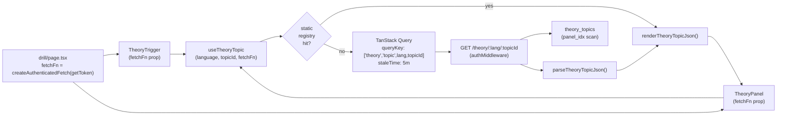
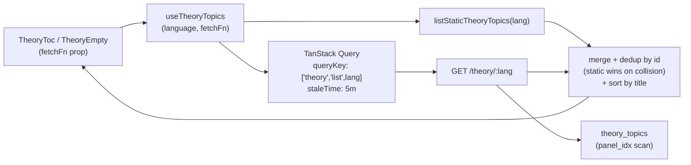
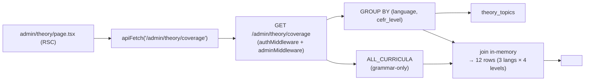

# Design Document — theory-generation-phase-5

## Overview

Phase 5 plumbs DB-stored theory topics from `theory_topics` (a table populated by Phases 2–4) into the Theory Panel UI. Today the panel resolves only the three hand-authored ES TSX files in `apps/web/content/theory/es/`; everything Claude has generated since Phase 2 is invisible. Phase 5 closes that gap with four small additions (two read-only Lambda routes, two React Query hooks, one admin page, one admin route) plus a structural rename of the existing static registry.

Two key design calls shape the rest of the doc:

1. **Reuse the existing parser, don't redefine the schema.** `packages/shared/src/theory.ts` already exports `parseTheoryTopicJson(input: unknown): TheoryTopicJson` (lines 314–360) — a hand-written runtime validator that drives Phase 2's generator output check. We use it as the single source of truth on both server and client; no new Zod schema for the topic body. Zod gets used only for the small response envelopes (`{ topics: [...] }`, `{ rows: [...] }`) where there's no equivalent runtime parser today. This refines the original requirements (Req 2) — we keep one source-of-truth, not two.

2. **The hook is "static-first, DB-fallback" not "always DB".** `useTheoryTopic` checks the in-memory `theoryRegistry` (the existing exports, after rename) before firing a `useQuery`. Hand-authored ES topics return synchronously and never hit the network. DB-backed topics drive a normal TanStack Query lifecycle. This preserves the editorial-override path (resolved decision #11 from the plan) and means the three live ES topics keep their < 50 ms cold-render time.

Phase 5 ships no caching layer (Upstash deferred). The `theory_topics_panel_idx` partial index makes the single-topic lookup an index-only scan over a table of ≤ 240 rows at full coverage; TanStack Query's `staleTime: 5 * 60 * 1000` covers in-tab repeat opens. If a future production smoke shows the route as a hot spot, Upstash gets layered on top via the already-wired secrets (`infra/lib/constructs/lambda.ts:41-47`).

## Steering Document Alignment

### Technical Standards (tech.md)

- **Pre-generated content via DB** (§7) — Phase 5 is the read-half of the model `tech.md` already commits to: Claude generates into `theory_topics`, the panel reads from `theory_topics`. No new content strategy is introduced.
- **Separate Lambda API, not Next.js routes** (§2 / "Why not Next.js API routes?") — both new theory endpoints live in `infra/lambda/src/routes/theory.ts`, served via the existing Hono + API Gateway path. The mobile app gets them for free once it ships.
- **Hono router pattern** — `theory.use('/theory/*', authMiddleware)` and the `c.json(...)` response shape match `routes/exercises.ts` byte-for-byte. No new middleware introduced.
- **Zod at boundaries** (§2 Validation row) — the response envelopes are zod-validated on both server (before responding) and client (after parsing). The topic body uses the equivalent hand-written `parseTheoryTopicJson` already in `packages/shared`.
- **Drizzle, no raw SQL** — both new queries use Drizzle's `db.select().from(theoryTopics).where(...)` API; the only `sql` template usage is for the `content_json->>'title'` JSON-path extraction in the list query, mirroring the pattern in `routes/admin.ts:64-66`.
- **No new third-party services** — Upstash secrets stay unused in this phase; the design carries an explicit hook for a follow-up cache layer without touching the route's contract.

### Project Structure (structure.md)

The repository convention is "tests next to source." Phase 5 follows that:

```
infra/lambda/src/
├── routes/
│   ├── theory.ts                 (NEW)
│   ├── theory.test.ts            (NEW)
│   └── admin.ts                  (extend with /admin/theory/coverage)
│       admin.test.ts             (extend with one new case)
packages/api-client/src/
├── schemas/
│   ├── theory.ts                 (NEW — envelopes only; topic re-exports shared)
│   └── theory.test.ts            (NEW)
└── index.ts                      (extend exports — schemas + re-export of
                                    parseTheoryTopicJson from @language-drill/shared)
apps/web/
├── lib/hooks/                    (NEW directory — first web-local hooks)
│   ├── use-theory-topic.ts       (NEW)
│   ├── use-theory-topic.test.ts  (NEW)
│   ├── use-theory-topics.ts      (NEW)
│   └── use-theory-topics.test.ts (NEW)
├── content/theory/
│   └── index.ts                  (rename: getTheoryTopic → getStaticTheoryTopic,
│                                                listTheoryTopics → listStaticTheoryTopics)
├── components/theory/
│   ├── theory-panel.tsx          (consume useTheoryTopic, accept fetchFn prop)
│   ├── theory-trigger.tsx        (consume useTheoryTopic, accept fetchFn prop)
│   ├── theory-toc.tsx            (consume useTheoryTopics)
│   └── theory-empty.tsx          (consume useTheoryTopics)
├── lib/
│   └── theory-topic-map.ts       (call renamed getStaticTheoryTopic, stay sync)
└── app/(dashboard)/
    ├── admin/theory/
    │   ├── page.tsx              (NEW)
    │   ├── page.test.tsx         (NEW)
    │   └── _components/
    │       └── coverage-table.tsx  (NEW, optional — inline if simple)
    └── drill/page.tsx            (pass fetchFn down to TheoryTrigger/TheoryPanel)
```

The `(dashboard)/admin/theory/` directory mirrors `(dashboard)/admin/generation/`. The `_components/` folder is the existing pattern for page-scoped client components (`admin/generation/_components/pool-coverage-table.tsx` line 9 of `admin/generation/page.tsx`).

## Code Reuse Analysis

### Existing Components to Leverage

- **`parseTheoryTopicJson(input: unknown): TheoryTopicJson`** (`packages/shared/src/theory.ts:314-360`) — used unchanged on the server to validate `content_json` before sending, and on the client to validate after receiving. Throws with `Invalid <field>: ...` messages that already match Phase 2's audit-row format. This is the single biggest reuse — it replaces the "build a new Zod schema" approach from the original plan.
- **`renderTheoryTopicJson(topic: TheoryTopicJson): TheoryTopic`** (`apps/web/components/theory/render-json.tsx:29`) — used unchanged by `useTheoryTopic` to turn parsed JSON into the JSX-bearing runtime `TheoryTopic` shape the panel already consumes.
- **`createAuthenticatedFetch(getToken)` / `AuthenticatedFetch`** (`packages/api-client/src/fetchClient.ts:6-54`) — the existing hook contract; `useTheoryTopic` and `useTheoryTopics` accept a `fetchFn: AuthenticatedFetch` prop the same way every other hook does. The drill page already constructs it once via `useMemo(() => createAuthenticatedFetch(getToken), [getToken])` (`apps/web/app/(dashboard)/drill/page.tsx:106`).
- **`authMiddleware`** (`infra/lambda/src/middleware/auth.ts`) — applied to `/theory/*` exactly as it's applied to `/exercises/*` in `routes/exercises.ts:44`.
- **`adminMiddleware`** (`infra/lambda/src/middleware/admin.ts`) — applied to the new `/admin/theory/coverage` route via the existing `admin.use('/admin/*', authMiddleware, adminMiddleware)` line in `routes/admin.ts:34`. No new middleware to plumb.
- **`apiFetch(path)` server helper** (`apps/web/lib/api-server.ts:9-32`) — used by the new admin page RSC, same way `admin/generation/page.tsx:31-34` uses it.
- **Drizzle `theoryTopics` schema** (`packages/db/src/schema/theory.ts:34-84`) — the route queries it via `db.select().from(theoryTopics)`. The two partial indexes (`pool_lookup_idx`, `panel_idx`) are the perf substrate; design choices below pick the right one per query.
- **`ALL_CURRICULA` + `enumerateCurriculumCells`** (`packages/db/src/curriculum/index.ts`) — used by the coverage route to compute the denominator (curriculum size per `(language, level)`).
- **TanStack Query** (`apps/web/app/providers.tsx:3-20`) — `QueryClientProvider` is already mounted at the root; the new hooks are drop-in.

### Integration Points

- **Theory Panel consumer chain.** `drill/page.tsx` renders `<TheoryTrigger>` and conditionally `<TheoryPanel>`. Both gain a `fetchFn` prop. Inside, those components pass `fetchFn` to the hook. The panel's render-tree below the trigger (`TheoryToc`, `TheoryContent`, `TheoryEmpty`) doesn't need `fetchFn` because:
  - `TheoryToc` and `TheoryEmpty` use `useTheoryTopics` themselves (they need the *list*, not a single topic), so they each take a `fetchFn` prop too.
  - `TheoryContent` renders the already-fetched `topic`; no further fetches.
- **`theory-topic-map.ts`** (`apps/web/lib/theory-topic-map.ts:20`) — `topicIdForHint(hint, language)` is called in the drill page's sync render path. It only needs to know whether a topic *could* exist for the slug, not whether the DB row resolves. It stays sync by calling `getStaticTheoryTopic` (the renamed function). If the static lookup misses, `topicIdForHint` returns `null` and the trigger doesn't render — the panel never opens for a slug that doesn't have at least a static entry. **This is a deliberate scope choice for Phase 5**: DB-only topics aren't reachable from the drill page's "open theory" trigger yet. They *are* reachable from the panel's "other topics" jump list (`TheoryToc` / `TheoryEmpty`), which uses the merged list. A learner can navigate into a DB-only topic by opening any static topic first, then jumping. This is documented in the panel's docstring and is a follow-up to revisit once DE/TR actually have generated content.
- **Admin nav.** The existing `admin/layout.tsx:1-21` is a single auth-gate wrapper with no shared nav UI. Phase 5 doesn't add nav links — the operator reaches `/admin/theory` by typing the URL. A nav header is a separate, low-priority follow-up.

## Architecture

### Request flow — single topic



### Request flow — topic list (for TOC / empty state)



### Admin coverage flow



## Components and Interfaces

### Component 1 — `routes/theory.ts` (Lambda route module)

- **Purpose:** Two read-only authenticated endpoints serving approved `theory_topics` rows to the web client.
- **Mount point:** `app.route('/', theory)` added to `infra/lambda/src/index.ts` after the existing `app.route('/', exercises)` block.
- **Interfaces:**
  - `GET /theory/:lang` → `{ topics: Array<{ id: string; title: string; cefr: string }> }`
  - `GET /theory/:lang/:topicId` → `TheoryTopicJson` (the raw JSON body, no envelope) | 404 | 500
- **Middleware:** `theory.use('/theory/*', authMiddleware)` — verbatim copy of the exercises pattern at `routes/exercises.ts:44`.
- **Parameter validation:**
  - `:lang` validated against the literal set `['ES', 'DE', 'TR']` (a tiny zod `z.enum(['ES','DE','TR'])` defined inline at the top of the file).
  - `:topicId` validated against the regex `/^[a-z0-9-]+$/` (defined as a module-level constant).
- **Reuses:** `parseTheoryTopicJson` (single-topic content-shape check), `theoryTopics` Drizzle schema, `db` connection singleton (`infra/lambda/src/db.ts`), `authMiddleware`.
- **Index reliance:**
  - Single-topic query uses `(language, topic_id)` + `review_status IN (...)` → matches `theory_topics_panel_idx` predicate exactly.
  - List query uses `(language)` + `review_status IN (...)` + sort on `content_json->>'title'` → the `panel_idx` still covers the WHERE; the sort is a sort step on the small result set (≤ 60 rows per language). No new index needed.

### Component 2 — `routes/admin.ts` extension

- **Purpose:** One new endpoint serving the admin coverage tile.
- **Interface:** `GET /admin/theory/coverage` → `{ rows: Array<{ language: 'ES'|'DE'|'TR'; level: 'A1'|'A2'|'B1'|'B2'; approved: number; flagged: number; total: number }> }`
- **Middleware:** Inherits `admin.use('/admin/*', authMiddleware, adminMiddleware)` from `routes/admin.ts:34` — no new line.
- **Implementation:** Single SQL aggregate over `theory_topics` (`GROUP BY language, cefr_level` with two `COUNT(*) FILTER` columns), joined in-memory against `enumerateCurriculumCells(ALL_CURRICULA).filter(c => c.kind === 'grammar')`. Output is 12 rows always (3 langs × 4 levels) — even when both counts are zero.
- **Reuses:** `ALL_CURRICULA`, `enumerateCurriculumCells`, `db`, `adminMiddleware`.

### Component 3 — `packages/api-client/src/schemas/theory.ts`

- **Purpose:** Zod envelopes for the two list-style responses. The topic body uses `parseTheoryTopicJson` from `@language-drill/shared` — no Zod redefinition.
- **Exports:**
  ```ts
  // Envelope for GET /theory/:lang
  export const TheoryListItemSchema = z.object({
    id: z.string(),
    title: z.string(),
    cefr: z.string(),
  });
  export const TheoryListResponseSchema = z.object({
    topics: z.array(TheoryListItemSchema),
  });
  export type TheoryListResponse = z.infer<typeof TheoryListResponseSchema>;
  export type TheoryListItem = z.infer<typeof TheoryListItemSchema>;

  // Envelope for GET /admin/theory/coverage
  export const TheoryCoverageRowSchema = z.object({
    language: z.enum(['ES', 'DE', 'TR']),
    level: z.enum(['A1', 'A2', 'B1', 'B2']),
    approved: z.number().int().nonnegative(),
    flagged: z.number().int().nonnegative(),
    total: z.number().int().nonnegative(),
  });
  export const TheoryCoverageResponseSchema = z.object({
    rows: z.array(TheoryCoverageRowSchema),
  });
  export type TheoryCoverageRow = z.infer<typeof TheoryCoverageRowSchema>;
  export type TheoryCoverageResponse = z.infer<typeof TheoryCoverageResponseSchema>;
  ```
- **Note on the single-topic shape:** No `TheoryTopicJsonSchema`. The client calls `parseTheoryTopicJson(await res.json())` directly. This is a deliberate refinement of Req 2 in the requirements doc — keeping one parser instead of two avoids the long-term maintenance burden of keeping a Zod schema in sync with the hand-written taxonomy. Imports come from `@language-drill/shared`.
- **Re-exports** from `packages/api-client/src/index.ts`: `TheoryListResponseSchema`, `TheoryCoverageResponseSchema`, the inferred types, plus a re-export of `parseTheoryTopicJson` and the topic types from `@language-drill/shared` (the api-client is the natural import root for web-side code).

### Component 4 — `useTheoryTopic` hook

- **Purpose:** Return one rendered `TheoryTopic`, static-first, DB-fallback.
- **File:** `packages/api-client/src/hooks/useTheoryTopic.ts`
- **Interface:**
  ```ts
  export type UseTheoryTopicParams = {
    language: LearningLanguage;
    topicId: string;
    fetchFn: AuthenticatedFetch;
    /** Optional override of the static registry lookup — used in tests. */
    getStaticTopic?: (language: LearningLanguage, id: string) => TheoryTopic | null;
    /** Optional override of the JSON renderer — used in tests. */
    renderTopic?: (json: TheoryTopicJson) => TheoryTopic;
  };
  export type UseTheoryTopicResult = {
    topic: TheoryTopic | null;
    isLoading: boolean;
    isError: boolean;
    error: Error | null;
  };
  export function useTheoryTopic(params: UseTheoryTopicParams): UseTheoryTopicResult;
  ```
- **Reuses:** `useQuery` from `@tanstack/react-query`, `parseTheoryTopicJson` and the `TheoryTopic` runtime type, `renderTheoryTopicJson`, `AuthenticatedFetch`.
- **Algorithm:**
  ```ts
  const staticTopic = (params.getStaticTopic ?? getStaticTheoryTopic)(language, topicId);
  const dbQuery = useQuery<TheoryTopic, Error>({
    queryKey: ['theory', 'topic', language, topicId],
    queryFn: async () => {
      const res = await fetchFn(`/theory/${language}/${encodeURIComponent(topicId)}`);
      const json = await res.json();
      const parsed = parseTheoryTopicJson(json);  // throws on schema violations
      return (params.renderTopic ?? renderTheoryTopicJson)(parsed);
    },
    enabled: staticTopic === null,
    staleTime: 5 * 60 * 1000,
    retry: (failureCount, error) => {
      // 404 = no row, don't retry. 4xx = client error, don't retry. 5xx = retry once.
      const status = (error as { status?: number }).status;
      if (status && status < 500) return false;
      return failureCount < 1;
    },
  });
  if (staticTopic) return { topic: staticTopic, isLoading: false, isError: false, error: null };
  // 404 path: createAuthenticatedFetch throws on non-OK. We catch the 404 here.
  if (dbQuery.error && (dbQuery.error as { status?: number }).status === 404) {
    return { topic: null, isLoading: false, isError: false, error: null };
  }
  return { topic: dbQuery.data ?? null, isLoading: dbQuery.isLoading, isError: dbQuery.isError, error: dbQuery.error };
  ```
- **Why the dependency-injection escape hatches (`getStaticTopic`, `renderTopic`)?** `packages/api-client` cannot import from `apps/web/components/theory/render-json.tsx` (it'd flip the dependency direction). The hook accepts the static-lookup function and the renderer as optional props, with sensible defaults provided by `apps/web` at the call site. The drill page can pass `{ getStaticTopic: getStaticTheoryTopic, renderTopic: renderTheoryTopicJson }`, OR — to keep the contract simple — the hook lives in `apps/web/lib/use-theory-topic.ts` instead of `packages/api-client`. **Resolution: keep it in `apps/web/lib/hooks/use-theory-topic.ts`.** It's a web-specific concern (the static registry and renderer are both web-only) and there's no current mobile consumer. Updating Req 4's file path is a one-line correction we'll capture in tasks.

  Updated layout:
  ```
  apps/web/lib/hooks/
  ├── use-theory-topic.ts          (NEW)
  ├── use-theory-topic.test.ts     (NEW)
  ├── use-theory-topics.ts         (NEW)
  └── use-theory-topics.test.ts    (NEW)
  ```
  The hooks import `parseTheoryTopicJson` from `@language-drill/shared`, the schemas from `@language-drill/api-client`, the static registry from `../../content/theory`, and the renderer from `../../components/theory/render-json`.

### Component 5 — `useTheoryTopics` hook

- **Purpose:** Return the merged static + DB list of `{ id, title, cefr }` items for a language.
- **File:** `apps/web/lib/hooks/use-theory-topics.ts`
- **Interface:**
  ```ts
  export type UseTheoryTopicsParams = {
    language: LearningLanguage;
    fetchFn: AuthenticatedFetch;
  };
  export type UseTheoryTopicsResult = {
    topics: Array<{ id: string; title: string; cefr: string }>;
    isLoading: boolean;
    isError: boolean;
    error: Error | null;
  };
  export function useTheoryTopics(params: UseTheoryTopicsParams): UseTheoryTopicsResult;
  ```
- **Algorithm:**
  ```ts
  const staticTopics = listStaticTheoryTopics(language);  // sync, in-memory
  const dbQuery = useQuery({
    queryKey: ['theory', 'list', language],
    queryFn: async () => {
      const res = await fetchFn(`/theory/${language}`);
      const json = await res.json();
      return TheoryListResponseSchema.parse(json).topics;
    },
    staleTime: 5 * 60 * 1000,
  });

  const dbTopics = dbQuery.data ?? [];
  const seen = new Set(staticTopics.map((t) => t.id));
  const merged = [
    ...staticTopics,
    ...dbTopics.filter((t) => !seen.has(t.id)),  // static wins
  ];
  merged.sort((a, b) => a.title.localeCompare(b.title));

  return {
    topics: merged,
    isLoading: dbQuery.isLoading,
    isError: dbQuery.isError,
    error: dbQuery.error,
  };
  ```
- **Reuses:** `useQuery`, `TheoryListResponseSchema`, `listStaticTheoryTopics` (renamed), `AuthenticatedFetch`.

### Component 6 — `apps/web/content/theory/index.ts` rename

- **Purpose:** Make the static registry's role explicit.
- **Changes:**
  - `getTheoryTopic` → `getStaticTheoryTopic` (same signature, same behavior).
  - `listTheoryTopics` → `listStaticTheoryTopics` (same signature, same behavior).
  - `theoryRegistry` keeps its name.
  - `TheoryTopicId` keeps its name.
  - Add a top-of-file docstring: *"Static theory registry. Hand-authored TSX topics take precedence over DB-stored rows; for DB-backed access use useTheoryTopic / useTheoryTopics from apps/web/lib/hooks/."*
- **Callers to update:** 5 call sites — `theory-panel.tsx:7`, `theory-trigger.tsx:5`, `theory-toc.tsx:2`, `theory-empty.tsx:2`, `theory-topic-map.ts:2`.

### Component 7 — Panel consumer refactor

- **`theory-panel.tsx`:**
  - Add `fetchFn: AuthenticatedFetch` to `TheoryPanelProps`.
  - Replace the sync `getTheoryTopic(language, internalTopicId)` call at line 36 with `const { topic, isLoading, isError } = useTheoryTopic({ language, topicId: internalTopicId, fetchFn })`.
  - The body of the component (everything that depends on `topic`) already handles `topic === null` via the `<TheoryEmpty>` branch at line 144. Add two new branches:
    - `isLoading && !topic` → render `<div className="theory-loading"><span className="t-small">loading theory…</span></div>`.
    - `isError && !topic` → render `<div className="theory-error"><span className="t-small">couldn't load theory — try again</span></div>`.
  - No new CSS rules. Both new branches reuse `t-small` from `apps/web/app/globals.css` (the same typography utility `TheoryEmpty` uses today).
- **`theory-trigger.tsx`:**
  - Add `fetchFn: AuthenticatedFetch` to `TheoryTriggerProps`.
  - Replace the sync call at line 21 with the hook.
  - On `isLoading || !topic`, return `null` (preserve "no flash of broken pill" — Req 6.5).
- **`theory-toc.tsx`:**
  - Add `fetchFn: AuthenticatedFetch` to `TheoryTocProps`.
  - Replace `listTheoryTopics(language)` at line 24 with `useTheoryTopics({ language, fetchFn }).topics`.
- **`theory-empty.tsx`:**
  - Same change as `theory-toc.tsx`: add `fetchFn` prop, use the hook.
- **`drill/page.tsx`:**
  - Pass `fetchFn` (already constructed at line 106) down to `<TheoryTrigger>` (line 321) and `<TheoryPanel>` (line 368).
  - `TheoryPanel` then passes `fetchFn` down to its children (`TheoryToc`, `TheoryEmpty`). One extra prop on each.

### Component 8 — Admin coverage page

- **File:** `apps/web/app/(dashboard)/admin/theory/page.tsx`
- **Purpose:** RSC that renders the coverage table.
- **Implementation pattern:** verbatim mirror of `admin/generation/page.tsx` (lines 1–127) — `apiFetch` + `safeParse` + per-section panel result rendering — with these differences:
  - One API call instead of two (`apiFetch('/admin/theory/coverage')`).
  - One section instead of four (no cost / jobs / approval-rate panels — those are exercise-specific).
  - The table is 4 columns wide (A1, A2, B1, B2) × 3 rows (ES, DE, TR), not the per-cell list from the exercise pool.
- **Server-only RSC.** No client component needed unless the table grows interactivity (sortable headers, etc.) — the simplest version is pure SSR. Initial implementation: inline `<table>` in `page.tsx`; if the markup exceeds ~50 lines, lift it to `_components/coverage-table.tsx` as a server component.
- **Reuses:** `apiFetch`, `redirect`, `TheoryCoverageResponseSchema`, the existing admin layout's auth gate.

## Data Models

### Wire format — single topic

The single-topic endpoint returns `TheoryTopicJson` (the same shape Phase 1 defines in `packages/shared/src/theory.ts`):

```
TheoryTopicJson:
- id: string                              (kebab-case slug, equals topic_id column)
- title: string                           (e.g. "the present subjunctive")
- subtitle: string                        (e.g. "wishes, doubt, emotion")
- cefr: string                            (e.g. "B1–B2")
- sections: TheorySectionJson[]           (≥1, parser-enforced)
  TheorySectionJson:
  - id: string                            (kebab-case, unique within topic)
  - title: string                         (≥1 char)
  - body: TheoryBlockJson[]               (≥1, parser-enforced; discriminated union over kind ∈
                                           {paragraph, callout, example, list, conjugation-table})
```

### Wire format — topic list

```
TheoryListResponse:
- topics: TheoryListItem[]
  TheoryListItem:
  - id: string                            (matches the topic_id of a row in theory_topics
                                           OR the static registry key)
  - title: string                         (extracted from content_json->>'title' for DB rows,
                                           or the runtime `topic.title` for static)
  - cefr: string                          (same source)
```

### Wire format — admin coverage

```
TheoryCoverageResponse:
- rows: TheoryCoverageRow[]               (exactly 12 rows: 3 langs × 4 levels)
  TheoryCoverageRow:
  - language: 'ES' | 'DE' | 'TR'
  - level: 'A1' | 'A2' | 'B1' | 'B2'
  - approved: integer ≥ 0                 (rows with review_status ∈ {auto-approved, manual-approved})
  - flagged: integer ≥ 0                  (rows with review_status = 'flagged')
  - total: integer ≥ 0                    (curriculum grammar-points at (language, level))
```

### Read queries (SQL conceptually)

```sql
-- /theory/:lang/:topicId
SELECT content_json
FROM theory_topics
WHERE language = $1
  AND topic_id  = $2
  AND review_status IN ('auto-approved', 'manual-approved')
ORDER BY generated_at DESC NULLS LAST
LIMIT 1;
-- Uses theory_topics_panel_idx (partial, predicate matches).

-- /theory/:lang
SELECT
  topic_id                          AS id,
  content_json->>'title'            AS title,
  content_json->>'cefr'             AS cefr
FROM theory_topics
WHERE language = $1
  AND review_status IN ('auto-approved', 'manual-approved')
  AND content_json->>'title' IS NOT NULL
  AND content_json->>'cefr'  IS NOT NULL
ORDER BY content_json->>'title' ASC;
-- Uses theory_topics_panel_idx for WHERE; sort step is in-memory over ≤60 rows.

-- /admin/theory/coverage  (DB side; in-memory join with curriculum after)
SELECT
  language,
  cefr_level                                                            AS level,
  COUNT(*) FILTER (WHERE review_status IN ('auto-approved','manual-approved'))::int AS approved,
  COUNT(*) FILTER (WHERE review_status = 'flagged')::int                AS flagged
FROM theory_topics
GROUP BY language, cefr_level;
-- Sequential scan, but theory_topics has ≤240 rows at full coverage — trivial cost.
```

## Error Handling

### Error Scenarios

1. **Invalid `:lang` parameter** (e.g. `EN`, `FR`, lowercase, garbage).
   - **Handling:** Zod `safeParse` against `z.enum(['ES','DE','TR'])` at the top of each handler. Failure returns `400 {error: 'Invalid language', code: 'VALIDATION_ERROR', details: parsed.error.flatten()}`.
   - **User Impact:** None — the web client only sends valid languages from a closed enum. This is a defense-in-depth case.

2. **Invalid `:topicId` pattern** (e.g. `../etc/passwd`, `subjunctive; DROP TABLE`).
   - **Handling:** Regex test `/^[a-z0-9-]+$/` before any DB call. Failure returns `400 {error: 'Invalid topicId', code: 'VALIDATION_ERROR'}`.
   - **User Impact:** None — IDs from the registry are pre-validated. Defense-in-depth.

3. **No row for `(language, topicId)`** (DE topic not yet generated, or stale URL).
   - **Handling:** Single-topic route returns `404 {error: 'Topic not found', code: 'TOPIC_NOT_FOUND'}`. The hook catches the 404 from `createAuthenticatedFetch`'s error path and returns `{topic: null, isError: false}`.
   - **User Impact:** Panel renders `<TheoryEmpty>` — the existing "no theory written yet" state.

4. **Flagged-only rows for the cell.**
   - **Handling:** Partial index predicate (`review_status IN ('auto-approved','manual-approved')`) excludes them automatically. Same as case 3 from the panel's perspective.
   - **User Impact:** Same as case 3 — flagged rows are invisible until an operator approves via `pnpm review:flagged-theory`.

5. **Corrupt `content_json` row** (e.g. a row that violates the parser, even though the partial unique index allowed it — e.g. a malformed migration backfill).
   - **Single-topic route:** `parseTheoryTopicJson` throws; the handler catches, logs `error`-level with the row id and the parse-error message, returns `500 {error: 'Internal error', code: 'INTERNAL_ERROR'}` (never leaks the parse message to the client). The hook surfaces `isError: true`.
   - **List route:** Row drops out of the response via the `content_json->>'title' IS NOT NULL AND content_json->>'cefr' IS NOT NULL` SQL filter. No 500. A separate code-path log emits a `warn` carrying the dropped row's id for operator visibility (executed in JS after the SELECT, by re-checking the resulting list length against an unfiltered `COUNT(*)` — or simpler: a single `SELECT COUNT(*) FILTER (WHERE content_json->>'title' IS NULL)` warn-log query when the SELECT returns fewer rows than the count).
   - **User Impact:** Single-topic case shows the error fallback. List case silently omits the broken topic — the panel's TOC won't link to it.

6. **DB connection failure.**
   - **Handling:** Drizzle throws; outer try/catch logs `error`-level, returns `500 {error: 'Internal error', code: 'INTERNAL_ERROR'}`.
   - **User Impact:** Panel shows the error fallback. The three static ES topics still render because the hook short-circuits before the DB call.

7. **Anthropic / generator failure during a future regenerate** — N/A in Phase 5 (no regenerate endpoint).

8. **Cache poisoning / race between approve and read** — N/A in Phase 5 (no cache layer).

9. **JWT verification failure / non-admin hits `/admin/theory/coverage`.**
   - **Handling:** `authMiddleware` returns 401, `adminMiddleware` returns 403. Same shape as `/admin/pool-status`.
   - **User Impact:** Admin RSC redirects to `/` per `admin/generation/page.tsx:36-38`.

10. **`encodeURIComponent` on `topicId`.** The hook URL-encodes the topic id (`useTheoryTopic.queryFn`), defending against the unlikely case of a topic id ever containing characters the regex would allow but URL parsers would mangle.

## Testing Strategy

### Unit Testing

- **`packages/api-client/src/schemas/theory.test.ts`** — round-trip every envelope shape through `safeParse`; explicit failure cases (missing required field, wrong type for `approved`, etc.). ~10 cases, < 50 lines.
- **`apps/web/lib/hooks/use-theory-topic.test.ts`** — uses `renderHook` from `@testing-library/react` plus a stubbed `fetchFn`. Cases:
  - Static hit → returns `{topic: <static>, isLoading: false}` synchronously, no `fetchFn` call.
  - Static miss + 200 → returns the rendered topic; one `fetchFn` call.
  - Static miss + 404 → returns `{topic: null, isError: false}`.
  - Static miss + 500 → returns `{topic: null, isError: true, error}`.
  - Static miss + 200 with corrupt JSON → `parseTheoryTopicJson` throws → `isError: true`.
  - `staleTime` honored — second render with same params doesn't call `fetchFn` again (re-render within window). Tested via React Query's `queryClient.getQueryData` or by asserting `fetchFn.mock.calls.length === 1` after two renders.
- **`apps/web/lib/hooks/use-theory-topics.test.ts`** — similar shape:
  - Static only when DB returns `{topics: []}` → merged list is the static list.
  - DB only when static is empty for the language (DE/TR) → merged list = DB list.
  - Collision: static and DB both have `id: 'subjunctive'` → static wins (assert the merged item's `title` is the static title).
  - Sort by title — assertion on the resulting array order.
  - DB error → returns `{topics: staticOnly, isError: true}`.

### Integration Testing

- **`infra/lambda/src/routes/theory.test.ts`** — Hono test app with a seeded `theory_topics` row in the test DB (uses the existing test-DB harness from `routes/exercises.test.ts`). Cases:
  - Valid `(ES, present-subjunctive)` with seeded row → 200 + body validates against `parseTheoryTopicJson`.
  - Valid request, no row → 404.
  - Valid request, flagged-only row → 404.
  - Invalid `:lang = 'EN'` → 400.
  - Invalid `:topicId = '../etc/passwd'` → 400.
  - Corrupt seeded row (manually inserted JSON missing `title`) → single-topic returns 500; list filters it out and warns.
  - Multiple rows somehow exist for the same `(language, topicId)` — verify `ORDER BY generated_at DESC NULLS LAST LIMIT 1` returns the freshest. Seed two rows with different `generated_at` timestamps.
- **`infra/lambda/src/routes/admin.test.ts`** — extend with one case for `/admin/theory/coverage`:
  - Seed two approved ES rows at level B1, one flagged ES row at B2. Assert response: `ES/A1 = {approved:0,flagged:0,total:N}`, `ES/B1 = {approved:2,flagged:0,total:N}`, `ES/B2 = {approved:0,flagged:1,total:N}`, all DE/TR rows = `{approved:0,flagged:0,total:N}` where N matches the current curriculum count for that cell.
  - Non-admin user → 403.
- **`apps/web/app/(dashboard)/admin/theory/page.test.tsx`** — RSC render test using `renderToString` (mirroring whatever pattern the project uses for other admin pages; if no existing pattern, use `@testing-library/react` server-component test via the `next/jest` config). Stub `apiFetch` with three payloads:
  - Full coverage payload (12 rows, mix of values) → assert table renders 12 cells with correct counts.
  - Zero-curriculum cells (`total: 0`) → assert cell renders `—`.
  - `approved > 0 AND flagged > 0` → assert `+N flagged` annotation renders.

### End-to-End Testing

- **Manual smoke test** (run before PR review, documented in tasks):
  1. On the dev Neon branch, ensure at least one approved row exists in `theory_topics` for ES. If not, run `pnpm generate:theory --lang es --grammar-point es-b1-present-subjunctive` against the dev branch.
  2. Run `pnpm dev` and open the drill page for ES at B1.
  3. Click a theory trigger for a topic that has a DB row. Confirm:
     - The panel opens and the content renders.
     - The TOC shows both static (subjunctive, preterite-imperfect, conditional) and the new DB-backed topic.
     - Clicking "other topic" navigates between them without error.
  4. Confirm the three hand-authored topics still render verbatim (no regressions on the static path).
  5. Navigate to `/admin/theory`. Confirm:
     - 12-cell table renders.
     - ES/B1 shows `1/N` (where N is the curriculum count).
     - DE rows all show `0/N` or `—`.
  6. Insert a flagged row manually (`UPDATE theory_topics SET review_status = 'flagged' WHERE id = ...`) and reload `/admin/theory`. Confirm the `+1 flagged` annotation appears.
- **No automated Playwright/Cypress test in Phase 5.** Manual smoke is the bar; project doesn't currently run browser-level E2E for new features.
