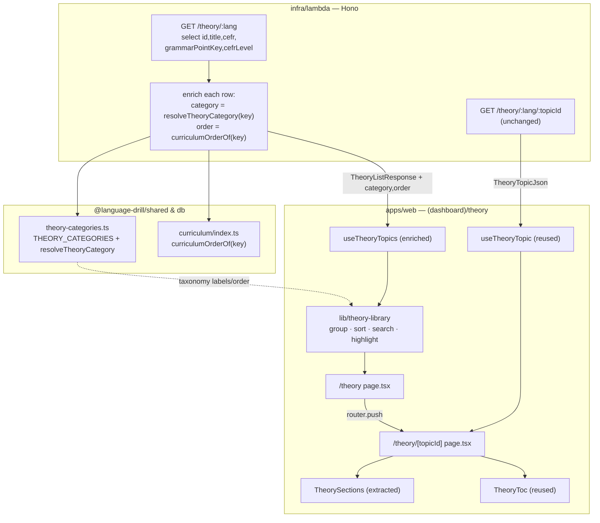
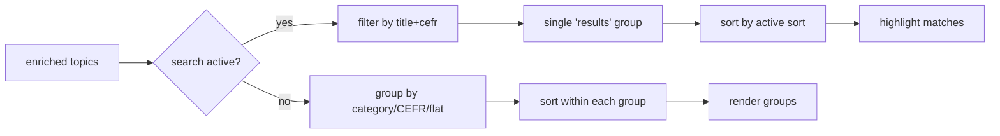

# Design Document

## Overview

The Theory Library adds two routes under the existing `(dashboard)` shell:

- **`/theory`** — an index that lists every approved theory topic for the learner's active language, with client-side grouping (category / CEFR / flat), sorting (curriculum / A→Z), and search.
- **`/theory/[topicId]`** — a deep-linkable detail page that renders one topic's full content (sections + table-of-contents), reusing the renderers that today power the in-drill `TheoryPanel`.

The feature is **read-only** and content-additive: it introduces no new content model and no new authoring path. It consumes the same generated `TheoryTopicJson` already stored in `theory_topics.content_json`, served by the existing authenticated theory endpoints. The only backend change is **additive enrichment** of the existing list endpoint (`GET /theory/:lang`) with two new fields — `category` and `order` — so the index can group and sort without shipping curriculum data to the browser. The in-drill `TheoryTrigger`/`TheoryPanel` flow is untouched.

Three concerns drive the design:

1. **Maximize reuse.** Topic rendering (`renderTheoryTopicJson`), the section/TOC components (`TheoryToc`, the section list inside `TheoryContent`), the scroll-spy (`useScrollSpy`), the fetch hooks (`useTheoryTopic`, `useTheoryTopics`), the not-found fallback (`TheoryEmpty`), and the active-language + authenticated-fetch plumbing all already exist. The new code is mostly orchestration + layout + a category taxonomy.
2. **Single source for category & order.** Both derive from the curriculum (`GrammarPoint`), resolved **server-side** from each topic's `grammarPointKey`, so the client never imports curriculum data.
3. **Protect the working in-drill flow.** The list-endpoint contract change is purely additive; the section renderer is extracted (not rewritten) so `TheoryPanel` keeps rendering identically.

## Steering Document Alignment

### Technical Standards (tech.md)

- **Separate Lambda (Hono) API.** The list/detail data stays behind the existing per-route JWT-authorized theory router (`infra/lambda/src/routes/theory.ts`); no new Next.js API route, no new unauthenticated surface.
- **Shared Zod types in `@language-drill/api-client`.** The enriched list item is described by extending `TheoryListItemSchema`; the web consumes it through the existing TanStack Query hook layer (`createAuthenticatedFetch(getToken)` + `useQuery`), matching the progress/dashboard pages.
- **Drizzle/Neon, read path only.** No migration. The list query gains two more selected columns (`grammarPointKey`, `cefrLevel`); enrichment is pure in-process computation against curriculum data already bundled in `@language-drill/db`.
- **Design tokens + shell.** Pages render inside the existing `AppShell` (provided by `(dashboard)/layout.tsx`) and use design-system tokens / primitives (`Chip`, `Button`, `cn`, `useIsMobile`) — no ad-hoc colors.
- **Prompt/version constants:** none touched — this feature does not change any `*_SYSTEM_PROMPT` or curriculum grammar entries (the category map is a new sidecar module, not an edit to existing grammar points, so no `CURRICULUM_VERSION_*` bump is required).

### Project Structure (structure.md)

- **Backend route enrichment** stays in `infra/lambda/src/routes/theory.ts`.
- **Curriculum-anchored category taxonomy** lives in `@language-drill/shared` next to the existing `curriculum-types.ts` (the dependency-safe home importable by lambda, db, and web alike); the curriculum-order helper lives with the curriculum data in `packages/db/src/curriculum/index.ts`.
- **Web pages** follow the established `(dashboard)/<route>/page.tsx` + co-located `_components/` + `_lib/` convention used by `progress/`.
- **Shared theory components** stay in `apps/web/components/theory/`; new pure list logic lives in `apps/web/lib/theory-library/`.

## Code Reuse Analysis

### Existing Components to Leverage

- **`renderTheoryTopicJson` + `parseTheoryTopicJson`** (`components/theory/render-json.tsx`, `@language-drill/shared`): unchanged — the detail page gets a fully rendered `TheoryTopic` straight from `useTheoryTopic`.
- **`useTheoryTopic` / `useTheoryTopics`** (`apps/web/lib/hooks/`): the detail page reuses `useTheoryTopic` verbatim (incl. its 404→null and static-first behavior). `useTheoryTopics` is **extended** to carry the new `category`/`order` fields through to the index.
- **`TheoryToc`** (`components/theory/theory-toc.tsx`): reused as-is on the detail page. Its `onSwitchTopic(topicId)` callback — which the panel wires to internal state — is wired on the page to `router.push('/theory/' + topicId)`. Its desktop-rail / mobile-strip behavior already satisfies Requirements 7.3–7.4.
- **Section renderer + error boundary** (inside `components/theory/theory-content.tsx`): **extracted** into a new `TheorySections` component so both the panel and the detail page share the exact section markup, error boundary, and `TheoryEmpty` fallback.
- **`useScrollSpy`** (`lib/hooks/use-scroll-spy.ts`): reused by the detail page for active-section tracking; the page replicates the panel's `handleJump` (`scrollIntoView` via `CSS.escape`).
- **`TheoryEmpty`** (`components/theory/theory-empty.tsx`): reused for the detail not-found state (Requirement 6.5); its other-topics links are wired to router navigation.
- **`Chip`, `Button`, `cn`, `useIsMobile`** (`components/ui/*`, `lib/`): for chrome, CEFR chips, responsive branching.
- **`useActiveLanguage`** + **`createAuthenticatedFetch(getToken)`**: language + fetch plumbing, identical to the progress page.
- **`NavItem` / `NAV_DESTINATIONS` / `isActive`** (`components/shell/`): nav entry and active-route highlighting (Requirement 1) come free once the destination is added.

### Integration Points

- **`GET /theory/:lang`** (existing): extended response — adds `category` + `order` per item. Backward compatible (additive). Still filters to approved statuses and skips corrupt rows.
- **`GET /theory/:lang/:topicId`** (existing): consumed unchanged by the detail page through `useTheoryTopic`.
- **`theory_topics` table** (`packages/db/src/schema/theory.ts`): read-only; the list query additionally selects `grammarPointKey` and `cefrLevel`.
- **Curriculum data** (`packages/db/src/curriculum/{es,de,tr}.ts` + `index.ts`): source of curriculum order and the keys the category map is anchored to.
- **`(dashboard)/layout.tsx` + `ActiveLanguageProvider` + `AppShell`**: both pages render as children of this layout; no layout change beyond the nav destination.

## Architecture

The data flow splits cleanly into a server enrichment step and a client presentation step. Category/order are resolved once on the server; the client only groups/sorts/filters already-enriched items.



**Grouping/sort/search precedence on the index** (Requirement 3/4/5):



## Components and Interfaces

### Component 1 — Theory category taxonomy (`packages/shared/src/theory-categories.ts`, new)

- **Purpose:** Single, curriculum-anchored source for a topic's category id, label, and display order (Requirement 8).
- **Interfaces:**
  ```ts
  export type TheoryCategoryId =
    | 'tenses' | 'moods' | 'pairs' | 'morphology' | 'cases'
    | 'syntax' | 'pronouns' | 'articles' | 'orthography' | 'other';
  // `cases` + `morphology` were added beyond the Spanish-centric prototype set
  // so the predominantly-Turkish live curriculum (case suffixes, personal
  // suffixes) groups meaningfully instead of collapsing into `other`
  // (Requirement 8.4 — language-agnostic taxonomy).

  export type TheoryCategory = Readonly<{
    id: TheoryCategoryId;
    label: string;   // e.g. 'verb tenses'
    order: number;   // stable display order; 'other' is last
  }>;

  export const THEORY_CATEGORIES: readonly TheoryCategory[];
  export const FALLBACK_CATEGORY_ID: TheoryCategoryId; // 'other'

  // grammarPointKey -> category id; unmapped keys (and undefined) -> 'other'.
  export function resolveTheoryCategory(grammarPointKey: string | null | undefined): TheoryCategoryId;
  export function getTheoryCategory(id: TheoryCategoryId): TheoryCategory;
  ```
- **Dependencies:** none (pure data + lookup). The internal `Record<grammarPointKey, TheoryCategoryId>` map is keyed by curriculum keys (e.g. `es-b1-present-subjunctive`).
- **Reuses:** mirrors the `THEORY_CATEGORIES` shape from the prototype (`.claude/specs/theory-library/prototypes/desktop-theory-index.jsx`), adapted to be language-agnostic and keyed off `grammarPointKey`. Re-exported from `packages/shared/src/index.ts`.

### Component 2 — Curriculum order helper (`packages/db/src/curriculum/index.ts`, extend)

- **Purpose:** Give each grammar point a stable curriculum sequence number for the "curriculum" sort (Requirement 4.2).
- **Interfaces:**
  ```ts
  // Position of `key` within its language's curriculum array (0-based).
  // Returns undefined for unknown keys; callers sort undefined last.
  export function curriculumOrderOf(key: string): number | undefined;
  ```
- **Dependencies:** the existing per-language curriculum arrays (`esCurriculum`, `deCurriculum`, `trCurriculum`).
- **Reuses:** built from a module-scope `Map<key, index>` analogous to the existing `GRAMMAR_POINT_INDEX`.

### Component 3 — Enriched list endpoint (`infra/lambda/src/routes/theory.ts`, extend `GET /theory/:lang`)

- **Purpose:** Return per-topic `category` + `order` so the client groups/sorts without curriculum data (Requirements 3.7, 4.2; NFR performance).
- **Interfaces:** unchanged route shape; the select adds `grammarPointKey` and `cefrLevel`, and the response items become `{ id, title, cefr, category, order }`.
  - `category = resolveTheoryCategory(grammarPointKey)` (from `@language-drill/shared`).
  - `order = curriculumOrderOf(grammarPointKey) ?? null` (from `@language-drill/db`).
- **Dependencies:** `resolveTheoryCategory`, `curriculumOrderOf`.
- **Reuses:** existing approved-status filter, corrupt-row skip (`title`/`cefr` NOT NULL guards), and warn-log counting — all retained verbatim.

### Component 4 — api-client list schema (`packages/api-client/src/schemas/theory.ts`, extend)

- **Purpose:** Type the enriched list item.
- **Interfaces:**
  ```ts
  export const TheoryListItemSchema = z.object({
    id: z.string(),
    title: z.string(),
    cefr: z.string(),
    category: z.string().default('other'),  // tolerant of older payloads
    order: z.number().nullable().default(null),
  });
  ```
- **Reuses:** existing `TheoryListResponseSchema` wrapper; `.default()` keeps it backward compatible if an old server omits the fields (NFR reliability — additive contract).

### Component 5 — `useTheoryTopics` extension (`apps/web/lib/hooks/use-theory-topics.ts`)

- **Purpose:** Surface `category` + `order` to the index while preserving the static-merge behavior.
- **Interfaces:** result item becomes `{ id, title, cefr, category: TheoryCategoryId, order: number | null }`. Static (editorial-override) topics — which carry no curriculum key — default to `category: 'other'`, `order: null` (documented limitation; static topics are ES-only and rare).
- **Dependencies:** the extended `TheoryListItemSchema`.
- **Reuses:** existing query key `['theory','list',language]`, 5-min stale time, static+DB dedupe/merge.
- **Call-site impact (additive, safe):** `UseTheoryTopicsResult.topics` widens with two fields. Besides the index, this hook is consumed internally by `TheoryToc` and `TheoryEmpty` for their "other topics" lists; both read only `id`/`title`, so the widening is non-breaking — but the implementer should expect three call sites, not one.

### Component 6 — Theory library list logic (`apps/web/lib/theory-library/`, new)

- **Purpose:** Pure, unit-testable grouping/sort/search (Requirements 3–5). No React, no fetching.
- **Interfaces:**
  ```ts
  export type GroupBy = 'category' | 'level' | 'none';
  export type SortBy  = 'curriculum' | 'alpha';
  export type LibraryTopic = { id: string; title: string; cefr: string; category: TheoryCategoryId; order: number | null };
  export type TopicGroup  = { id: string; label: string; topics: LibraryTopic[] };

  export function filterTopics(topics: LibraryTopic[], query: string): LibraryTopic[]; // title + cefr, case-insensitive
  export function sortTopics(topics: LibraryTopic[], sortBy: SortBy): LibraryTopic[];   // curriculum (order asc, undefined last by title) | alpha (localeCompare)
  export function groupTopics(topics: LibraryTopic[], groupBy: GroupBy, sortBy: SortBy, query: string): TopicGroup[];
  export function highlightMatch(title: string, query: string): { before: string; match: string; after: string } | null;
  ```
- **Behavior:** when `query` non-empty → one `results` group sorted by `sortBy`; else group by category (taxonomy order, `other` last, empty groups dropped) / CEFR (A1..C2, empties dropped) / flat. Each group carries its count.
- **Reuses:** `THEORY_CATEGORIES` order + labels; CEFR ordering constant.

### Component 7 — `TheorySections` (`apps/web/components/theory/theory-sections.tsx`, extracted)

- **Purpose:** Shared section list + render-error boundary + `TheoryEmpty` fallback, used by both the panel and the detail page (so the panel's behavior is preserved by composition, not duplication).
- **Interfaces:** `{ topic: TheoryTopic; language; onSwitchTopic: (id) => void }`. `TheorySections` renders **only** the error-boundary-wrapped `<section>` list (no scroll container, no footer, no spacer).
- **Dependencies:** `TheoryEmpty`.
- **Reuses:** the exact `theory-section` / `theory-section-title` / `theory-content` markup and `TheoryErrorBoundary` currently inside `theory-content.tsx`. `TheoryContent` is refactored to render `<div ref={scrollRef} className="theory-scroll"> <TheorySections/> {80px spacer} {existing "back to drill →" footer} </div>` — i.e. the `scrollRef`/`theory-scroll` wrapper, spacer, and `onClose` footer **stay in `TheoryContent`**, so the panel's DOM output is unchanged. The detail page (Component 10) supplies its **own** `theory-scroll` wrapper around `<TheorySections/>`.

### Component 8 — Theory index page (`apps/web/app/(dashboard)/theory/page.tsx`, new, client)

- **Purpose:** Orchestrate the index (Requirements 2–5, 7.1–7.2).
- **Interfaces:** default-exported page component (no props).
- **Behavior:** `activeLanguage` from context; `fetchFn = useMemo(() => createAuthenticatedFetch(getToken), [getToken])`; `useTheoryTopics({ language, fetchFn })`; local state `search/groupBy/sortBy`; derives groups via `lib/theory-library`. Renders header (title + total count), search box, group/sort controls, and the grouped list — branching layout on `useIsMobile()`. Handles loading / error+retry / empty-language states.
- **Dependencies:** `useActiveLanguage`, `useAuth`, `createAuthenticatedFetch`, `useTheoryTopics`, `useIsMobile`, index `_components/*`.
- **Reuses:** progress-page page structure as the template.

### Component 9 — Index sub-components (`apps/web/app/(dashboard)/theory/_components/`, new)

- **`theory-library-header.tsx`** — title + topic count + intro line.
- **`theory-search-box.tsx`** — input + clear button + ⌘K focus (skips when a text input is already focused; `preventDefault`) (Requirement 5.6) + desktop ⌘K hint chip.
- **`theory-controls.tsx`** — group-by + sort segmented controls (desktop) / horizontal chip strips (mobile) (Requirement 7).
- **`theory-topic-row.tsx`** — one topic: title (+ search highlight via `highlightMatch`), CEFR chip, `→` affordance; `Link`/button to `/theory/[topicId]`.
- **`theory-group.tsx`** — group header (label + count) + rows; desktop = card-framed list, mobile = collapsible accordion (default-open largest two groups, per prototype).
- **`theory-list-states.tsx`** — loading, error+retry, empty-language, and no-search-results states.
- **Reuses:** `Chip`, `Button`, `cn`, tokens; the in-repo prototype copies `.claude/specs/theory-library/prototypes/mobile-theory-index.jsx` (mobile) and `desktop-theory-index.jsx` (desktop) as visual references (the committed `design_handoff` bundle contains only the in-drill panel `theory.jsx`; the library index/detail layout is otherwise net-new design work).
- **Styling convention:** follow the existing theory surface — index/group/row/control styles land as a new `.theory-library-*` block in `apps/web/app/globals.css` (mirroring the existing `.theory-*` class block), with any mobile rules in a `@media (max-width: 760px)` block that mirrors `MOBILE_MAX_WIDTH` (per `lib/responsive.ts`). No ad-hoc inline colors/spacing — only token-backed values, satisfying the tech.md "no ad-hoc colors/spacing" rule. Tailwind utilities are acceptable for layout where the surrounding pages already use them, but color/spacing must resolve to tokens.

### Component 10 — Theory detail page (`apps/web/app/(dashboard)/theory/[topicId]/page.tsx` + `_components/theory-detail.tsx`, new, client)

- **Purpose:** Full-page topic detail (Requirement 6, 7.3–7.4).
- **Interfaces:** page reads `topicId` from route params (decoded), renders `<TheoryDetail topicId language fetchFn />`.
- **Behavior (`TheoryDetail`):** `useTheoryTopic({ language, topicId, fetchFn })`; `useScrollSpy(sectionIds, scrollRef)`; header (back-to-library link, `theory · reference` eyebrow, title `h1`, CEFR `Chip`, subtitle); body = `TheoryToc` (with `onSwitchTopic = (id) => router.push('/theory/' + id)`) + a `theory-scroll` wrapper around `<TheorySections/>`; footer CTA → back to `/theory`. Loading / error / not-found(`TheoryEmpty` with router-wired other-topics) states. Topic-change resets `scrollRef.current.scrollTop` (mirrors panel).
- **Scroll-spy root (implementation trap — must hold):** `useScrollSpy` uses `scrollRef.current` as the IntersectionObserver `root` with `rootMargin -20%/-60%`, which only behaves correctly when that element is the actual scroll container. Therefore `TheoryDetail` MUST wrap the sections in an `overflow-y:auto` container carrying the existing `.theory-scroll` class (globals.css) and pass that element as `scrollRef` — the page body itself must NOT be the scroller for the content column. No change to `useScrollSpy` is required.
- **Dependencies:** `useTheoryTopic`, `useScrollSpy`, `TheoryToc`, `TheorySections`, `TheoryEmpty`, `next/navigation` router, `Chip`, `Link`.
- **Reuses:** panel's scroll-spy + jump logic; renders without the modal portal/focus-trap/scroll-lock (those are dialog-specific and intentionally omitted on a full page).

### Component 11 — Navigation entry (`apps/web/components/shell/nav-items.tsx` + `nav-icons.tsx`, extend)

- **Purpose:** Add the "theory" destination (Requirement 1).
- **Interfaces:** insert `{ href: '/theory', label: 'theory', icon: <TheoryIcon /> }` into `NAV_DESTINATIONS` **after `/read`, before `/progress`**; add a `TheoryIcon` (book/grid glyph matching `SHARED_PROPS`).
- **Reuses:** `NavItem` + `isActive` already light up `/theory` and `/theory/[id]` (the `startsWith` rule handles the nested detail route) in both the desktop rail and mobile tab bar — no further change.

## Data Models

### Enriched list item (wire format, `GET /theory/:lang`)
```
TheoryListItem
- id:       string          // topicId slug, e.g. "subjunctive"
- title:    string          // from content_json.title
- cefr:     string          // from content_json.cefr, e.g. "B1–B2"
- category: string          // TheoryCategoryId; 'other' fallback
- order:    number | null   // curriculum position; null when unknown
```

### TheoryCategory (taxonomy, `@language-drill/shared`)
```
TheoryCategory
- id:    TheoryCategoryId   // 'tenses' | 'moods' | 'pairs' | 'morphology' | 'cases' | 'syntax' | 'pronouns' | 'articles' | 'orthography' | 'other'
- label: string            // display label for the group header
- order: number            // stable group ordering; 'other' last
```

### LibraryTopic / TopicGroup (client view model, `apps/web/lib/theory-library`)
```
LibraryTopic = TheoryListItem with category narrowed to TheoryCategoryId
TopicGroup
- id:     string            // category id | CEFR level | 'all' | 'results'
- label:  string
- topics: LibraryTopic[]    // already sorted
```

The topic **detail** model is the existing `TheoryTopic` (`{ id, title, subtitle, cefr, sections[] }`) — unchanged.

## Error Handling

### Error Scenarios

1. **List fetch fails (5xx / network).**
   - **Handling:** `useTheoryTopics` surfaces `isError`; the index renders `theory-list-states` error variant with a retry button (refetch).
   - **User Impact:** "couldn't load theory — try again" with a working retry; rest of shell intact.

2. **Active language has zero approved topics.**
   - **Handling:** list resolves to `[]`; index renders the empty-language state.
   - **User Impact:** explicit "no topics yet for {language}" message, not a blank page (Requirement 2.4).

3. **Search yields no matches.**
   - **Handling:** `groupTopics` returns no groups; index renders the no-results state with a clear-search action (Requirement 5.4).
   - **User Impact:** "no topics match '…'" + one-tap clear.

4. **Detail topic missing / unapproved / 404.**
   - **Handling:** `useTheoryTopic` maps 404 → `topic: null` (no error); the detail page renders `TheoryEmpty` with router-wired other-topic links and a back-to-library path (Requirements 6.5, 6.8; covers the language-switch case 6.8).
   - **User Impact:** "no theory written yet for '…'" with alternatives — never a crash.

5. **Detail content render error (malformed section JSON).**
   - **Handling:** the shared `TheorySections` error boundary catches it and shows `TheoryEmpty`; the page header + footer (outside the boundary) remain usable.
   - **User Impact:** graceful fallback instead of a white screen (NFR reliability).

6. **Corrupt list row (missing title/cefr).**
   - **Handling:** unchanged server behavior — filtered at SQL, counted via `console.warn`; enrichment runs only over surviving rows.
   - **User Impact:** none; the bad topic is silently omitted, others render.

7. **Unmapped `grammarPointKey` (or null) on a topic.**
   - **Handling:** `resolveTheoryCategory` returns `'other'`; `curriculumOrderOf` returns `undefined` → `order: null` → sorted last by title.
   - **User Impact:** topic still appears, in the "other" group / end of curriculum order.

## Testing Strategy

### Unit Testing
- **`theory-categories.ts`** (`packages/shared`): every key in the internal map resolves to a `TheoryCategoryId` present in `THEORY_CATEGORIES`; unmapped and `null`/`undefined` keys → `'other'`; `THEORY_CATEGORIES` orders are unique and `'other'` is last (Requirement 8 / NFR maintainability).
- **`curriculumOrderOf`** (`packages/db`): returns 0-based position for known keys, `undefined` for unknown; stable across the per-language arrays.
- **Enriched `GET /theory/:lang`** (`infra/lambda`): adds correct `category`/`order`; still skips corrupt rows and warn-logs the drop count; approved-status filter intact.
- **`lib/theory-library`** (`apps/web`): `filterTopics` (title+cefr, case-insensitive), `sortTopics` (curriculum with nulls-last-by-title; alpha localeCompare), `groupTopics` (category order + `other` last + empty-group drop; CEFR A1..C2 order; flat; search→single results group sorted by active sort), `highlightMatch` (substring split + no-match null).
- **`TheoryListItemSchema`** (`packages/api-client`): parses enriched payloads and defaults `category`/`order` when absent (back-compat).
- **`useTheoryTopics`** (`apps/web`): static topics default to `other`/`null`; DB topics carry through enrichment; dedupe preserved.

### Integration Testing
- **Detail page states**: render `TheoryDetail` against fetch mocks for success (sections + TOC + scroll-spy active id), 404 (TheoryEmpty + router-wired links), error, and other-topic switch → `router.push` to the new slug (Requirements 6.2–6.7).
- **Index orchestration**: with a mocked enriched list, assert group/sort/search controls drive the rendered groups, header total count is language-total (not filtered), and the empty/error/no-results branches render (Requirements 2–5).
- **Nav**: `NAV_DESTINATIONS` includes `/theory` in the read→progress slot; `isActive` lights it for `/theory` and `/theory/x`.
- **Panel regression**: `TheoryPanel` still renders identical section markup after the `TheorySections` extraction (existing `theory-panel`/`theory-content` tests stay green).

### End-to-End Testing (Playwright, `authenticated` project)
- Happy path (Requirement NFR testing): from any page, click the "theory" nav item → land on `/theory` → topics list visible → open a topic → land on `/theory/[topicId]` with sections + TOC → use back-to-library → return to `/theory`. One spec in `apps/web/e2e/`, authenticated project.
