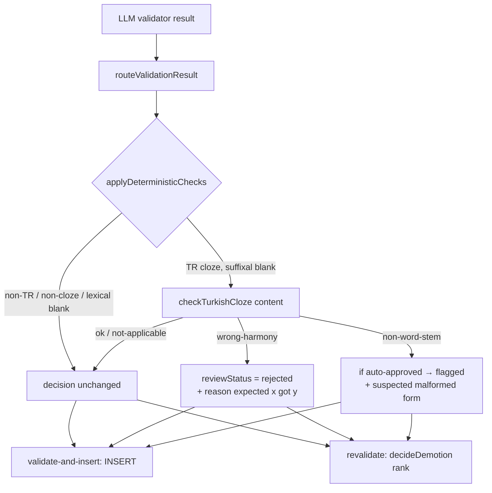
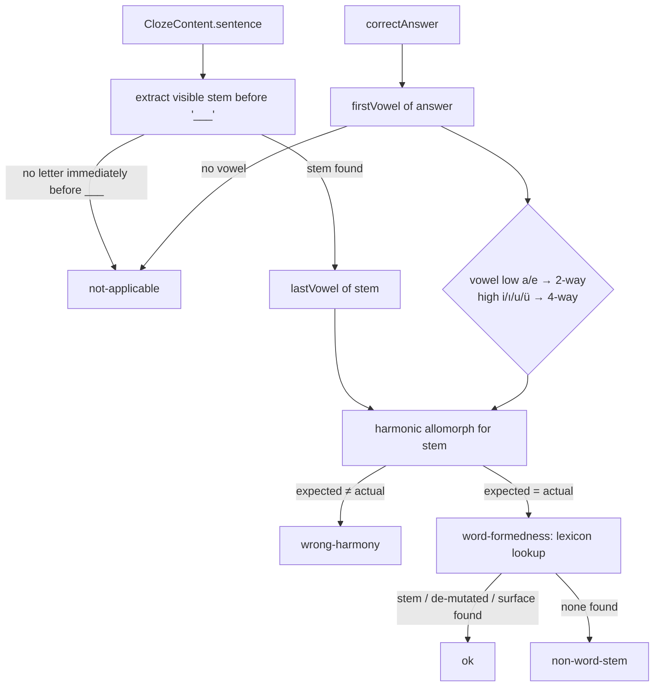

# Design Document

## Overview

This feature adds a **pure, non-LLM deterministic gate** for Turkish cloze exercises that runs immediately after the LLM validator's routing decision, plus two supporting changes: grounding the runtime evaluator's prompt with the explicit Turkish vowel inventory, and upgrading the pinned Claude models to the current generation.

The deterministic gate exists because Turkish vowel harmony and suffix-allomorph selection are **closed-class, algorithmic rules** — they can be computed exactly from a small vowel table, so delegating them to a probabilistic model at generation, validation, and evaluation time (three independent failure surfaces) is the root cause of the `domat___ / ler → domatler` defect. The gate is a single source of truth shared by the live generation path and the revalidation CLI, so the two cannot diverge.

The three change clusters:

1. **Turkish checker** (`packages/ai/src/turkish-harmony.ts`, new) — a pure function `checkTurkishCloze(content)` returning a discriminated verdict (`ok` / `not-applicable` / `wrong-harmony` / `non-word-stem`). Reuses the already-bundled `loadFrequency(Language.TR)` lexicon for word-formedness.
2. **Routing combiner** (`packages/db/src/generation/deterministic-checks.ts`, new) — `applyDeterministicChecks(decision, content, language)` maps the verdict onto the existing `RoutingDecision`, wired into both `validate-and-insert.ts` and `revalidate-cloze-pool.ts`.
3. **Evaluator grounding + model bump** — edit `EVALUATION_SYSTEM_PROMPT`, bump its version, and change five model constants from `claude-sonnet-4-5` to `claude-sonnet-4-6`.

## Steering Document Alignment

### Technical Standards (tech.md)
- **Monorepo layering (tech.md §4).** The pure linguistic checker lives in `packages/ai` (the lowest layer that already owns the frequency lexicon and the validator); `packages/db` depends on `packages/ai`, never the reverse, so placing the checker in `ai` and the `RoutingDecision`-aware combiner in `db` respects the existing dependency direction with no cycle.
- **AI surface (tech.md §2 / §7).** tech.md already names `claude-sonnet-4-6` as the LLM and "Answer evaluation: Claude (sonnet)". R5 closes the code/doc drift rather than introducing a new choice. No new model provider, no new SDK surface.
- **Pre-generated pool quality (tech.md §7).** The gate protects the shared pool ("Content is tagged, indexed, and served to any user") — a malformed exercise corrupts every user's mastery signal, so a deterministic guard at insert time is the cheapest correct place.
- **Cost control (tech.md §1, §7).** The deterministic check adds zero Claude calls; it is in-process computation plus an O(1) lookup against a `Set`/map already resident in the bundle.

### Project Structure (structure.md)
No `structure.md` steering file exists; the repo's conventions are taken from `CLAUDE.md` + tech.md §4 and the surrounding code:
- New pure modules sit beside their peers (`turkish-harmony.ts` next to `validate.ts`/`generation-prompts.ts`; `deterministic-checks.ts` next to `routing.ts`), each re-exported from the package `index.ts`.
- Tests are colocated (`turkish-harmony.test.ts`, `deterministic-checks.test.ts`) and added to existing files where a module is merely edited (model-constant assertions, prompt tests), never orphaned — per CLAUDE.md "Testing".
- Prompt edits bump the matching `*_PROMPT_VERSION` in the same commit — per CLAUDE.md "Prompt Editing".

## Code Reuse Analysis

### Existing Components to Leverage
- **`loadFrequency(Language.TR)` (`packages/ai/src/frequency/index.ts`)**: O(1) `lookup(form)` against `tr.json`, already inlined into the `@language-drill/ai` bundle for the annotate Lambda. Reused verbatim for the R2 word-formedness check — no second lexicon copy. Verified membership: `domates`/`kitap`/`evler`/`ev` present; `domat`/`kitab` absent. The frequency build (`build-frequency.ts:69`) keys forms with plain `.toLowerCase()`, so lookups MUST use plain `.toLowerCase()` (not Turkish-locale) for key parity.
- **`routeValidationResult` + `RoutingDecision`/`ReviewStatus` (`packages/db/src/generation/routing.ts`)**: the deterministic combiner takes the routing decision as input and returns a (possibly downgraded) `RoutingDecision` of the same type — no new routing vocabulary.
- **`ClozeContent` + `isClozeContent` (`packages/shared/src/index.ts`)**: the checker's input type and the narrowing guard the revalidator already uses.
- **`Language` / `LearningLanguage` enum (`@language-drill/shared`)**: gate keys off `language === Language.TR`.
- **`decideDemotion` (`packages/db/scripts/revalidate-cloze-pool.ts:321`)**: already calls `routeValidationResult(result)` internally and feeds the existing demote-only rank logic + `applyDemotion` writer. Its **signature must widen** from `(currentStatus, result)` to `(currentStatus, result, content, language)` because `content`/`language` are not in its current scope (they live only at the `main()` call site, line 541, as `recon.draft.contentJson` and `row.language`). The combiner is then applied inside `decideDemotion` on the `routed` value, and the call site at line 541 passes the two new args — see Integration Points. No new DB I/O.
- **`getPromptOrFallback` (`packages/ai/src/prompts-registry.ts`)**: the evaluator prompt edit (R4) flows through the existing Langfuse-or-fallback resolver unchanged; only the fallback string and version constant change.

### Integration Points
- **`validateAndInsertWithRetry` (`packages/db/src/generation/validate-and-insert.ts:208`)**: `const decision = routeValidationResult(result)` becomes `const decision = applyDeterministicChecks(routeValidationResult(result), currentDraft.contentJson, opts.cell.language)`. Everything downstream (rejected early-return at :211, INSERT with `reviewStatus`/`flaggedReasons` at :266) is unchanged.
- **`decideDemotion` (`revalidate-cloze-pool.ts:321`/:332 + call site :541)**: widen the signature to `decideDemotion(currentStatus, result, content: ExerciseContent, language: LearningLanguage)`; inside it, `const routed = applyDeterministicChecks(routeValidationResult(result), content, language)` replaces the bare `routeValidationResult(result)` at :332. The call site at :541 becomes `decideDemotion(row.reviewStatus as ReviewStatus, result, recon.draft.contentJson, row.language)` — both values are in scope there. The existing rank comparison then demotes as today. This keeps R3.1's single-source-of-truth: the *same* `applyDeterministicChecks` is the only place the verdict→routing precedence lives, called by both the live path and the revalidator.
- **`packages/ai/src/index.ts`**: add `checkTurkishCloze` + verdict types to the barrel export so `packages/db` can import from `@language-drill/ai`.

## Architecture

The gate is a thin, pure post-processor on the existing validator routing. It never replaces the LLM validator; it can only **downgrade** (auto-approved → flagged, or → rejected), never upgrade.



`checkTurkishCloze` internals:



## Components and Interfaces

### Component 1 — Turkish vowel-harmony + word-formedness checker
- **File:** `packages/ai/src/turkish-harmony.ts` (new)
- **Purpose:** Pure determination of whether a Turkish cloze's blanked suffix is the correct harmonic allomorph for its visible stem, and whether the visible stem is a real lexeme.
- **Interfaces (exported):**
  - `checkTurkishCloze(content: ClozeContent): DeterministicVerdict` — the single entry point.
  - `lastVowel(word: string): TurkishVowel | null` and `firstVowel(word: string): TurkishVowel | null` — pure helpers (exported for unit tests).
  - `harmonize(stemLastVowel: TurkishVowel, paradigm: '2-way' | '4-way'): TurkishVowel` — the allomorph table.
  - `extractSuffixalStem(sentence: string): string | null` — returns the trailing letter-run immediately before `___`, or `null` when the char before `___` is whitespace/start (lexical blank) or there is no `___`.
  - `VOWELS` — frozen classification table: front `{e,i,ö,ü}`, back `{a,ı,o,u}`, rounded `{o,ö,u,ü}`, unrounded `{a,e,ı,i}`.
- **Dependencies:** `loadFrequency` (same package), `ClozeContent`/`Language` (`@language-drill/shared`).
- **Reuses:** `packages/ai/src/frequency/index.ts` lexicon for word-formedness.
- **Key logic:**
  - **Stem/answer extraction.** `extractSuffixalStem` finds the last `/[\p{L}]+/u` run before `___`. If the immediately preceding character is not a Unicode letter → return `null` → verdict `not-applicable` (R1.1/R2.5 adjacency rule — lexical blanks are out of scope).
  - **Paradigm inference (no enumeration of suffix lists).** Take the **first vowel** of `correctAnswer` (the vowel that harmonizes with the stem's last vowel — Turkish buffers are consonants `y`/`n`/`s`/`ş`, so the first vowel is the harmonizing one even after a buffer, e.g. `araba`+`-(y)I` → answer `yı`, first vowel `ı`). If it is a low vowel (`a`/`e`) the suffix is 2-way; if high (`i`/`ı`/`u`/`ü`) it is 4-way; if the answer has no vowel → `not-applicable`. This sidesteps consonant-assimilation complexity (locative `-DA` voicing) by checking only the harmonizing vowel.
  - **Invariant-suffix denylist (closes the only false-rejection path).** Before running the harmony comparison, skip the harmony veto (treat as `not-applicable` for harmony, still run word-formedness) when `correctAnswer` matches a known **non-harmonic** suffix surface — `-ken`, `-leyin`, `-gil`, `-mtrak`, `-(I)mtırak` (frozen `e` after a back-vowel stem is correct Turkish: `okurken`, `akşamleyin`). Without this, `oku`+`-ken` → answer first vowel `e` → 2-way → expects back `a` → false `wrong-harmony` → wrongful **rejection**. The denylist is a small frozen `Set` of suffix surfaces matched against the (plain-lowercased) `correctAnswer`.
  - **Allomorph computation.** 2-way: front→`e`, back→`a`. 4-way: (back,unrounded)→`ı`, (back,rounded)→`u`, (front,unrounded)→`i`, (front,rounded)→`ü`. Compare expected harmonized vowel to the answer's first vowel; mismatch → `wrong-harmony` (carries expected/actual). Worked example: `domat` last vowel `a` (back) + answer first vowel `e` (low→2-way) → expected `a`, actual `e` → **wrong-harmony**.
  - **Word-formedness (only when harmony passes/N-A but blank is suffixal).** Lower-case (plain `.toLowerCase()`) the visible stem and look up three candidates in `loadFrequency(Language.TR)`: (a) the bare stem, (b) the stem with final-consonant de-mutation (`b→p`, `c→ç`, `d→t`, `ğ→k`) for accusative/possessive stems like `kitab→kitap`, (c) the full reconstructed surface `stem+correctAnswer` (catches inflected forms stored directly — the lexicon contains surfaces like `evler`, `kitabı`, `geliyor`). The reconstruction is **naive concatenation** — it does not model vowel elision (`başla`+`-Iyor`→`başlıyor`), so a few elision/irregular forms can miss all three candidates; this is *safe by construction* because `non-word-stem` routes to **flagged**, never rejected (R2.4). If none resolve → `non-word-stem` (carries the reconstructed form).

### Component 2 — Deterministic routing combiner
- **File:** `packages/db/src/generation/deterministic-checks.ts` (new)
- **Purpose:** Map a `DeterministicVerdict` onto a `RoutingDecision`, applying the R3 precedence. Single source of truth for both call sites.
- **Interfaces (exported):**
  - `applyDeterministicChecks(decision: RoutingDecision, content: ExerciseContent, language: LearningLanguage): RoutingDecision`
- **Dependencies:** `checkTurkishCloze` + verdict type (`@language-drill/ai`), `RoutingDecision`/`ReviewStatus` (`./routing`), `isClozeContent`/`Language` (`@language-drill/shared`).
- **Reuses:** existing `RoutingDecision` shape; no new status vocabulary.
- **Key logic:**
  - Pass-through (`return decision`) when `language !== TR`, `!isClozeContent(content)`, or the verdict is `ok` / `not-applicable`.
  - `wrong-harmony` → `{ reviewStatus: 'rejected', flaggedReasons: ['wrong vowel-harmony allomorph (deterministic): expected <x>, got <y>', ...decision.flaggedReasons] }` regardless of LLM `qualityScore` (R3.2). The deterministic reason is **prepended** (it is the dominant cause); the LLM reasons follow.
  - `non-word-stem` → **append** `'suspected malformed surface form (deterministic): <form>'`; if `decision.reviewStatus === 'auto-approved'` downgrade to `'flagged'`; if already `flagged`/`rejected`, keep status but still surface the reason (R3.3). Never upgrades.
  - **Reason-ordering is intentional** (prepend for the rejecting `wrong-harmony`, append for the advisory `non-word-stem`); `deterministic-checks.test.ts` asserts this ordering explicitly so it cannot drift.

### Component 3 — Evaluator prompt grounding
- **File:** `packages/ai/src/prompts.ts` (edit)
- **Purpose:** Stop the runtime evaluator fabricating vowel classifications.
- **Interfaces:** none changed; edits the `EVALUATION_SYSTEM_PROMPT` string (TR note) and bumps `EVALUATION_SYSTEM_PROMPT_VERSION` to `evaluate@2026-05-24`.
- **Reuses:** `getPromptOrFallback` resolution path (unchanged).
- **Key logic:** the TR bullet gains the explicit inventory (front `e i ö ü`; back `a ı o u`; rounded `o ö u ü`; unrounded `a e ı i`), the "last vowel governs the suffix" rule, and the borrowed-word note (`domates`). The vowel table text is taken from the same canonical source as Component 1's `VOWELS` (cited in a code comment) so the two cannot drift.

### Component 4 — Model constant upgrade
- **Files (literal swap):** only `generate.ts:46` (`GENERATION_MODEL`), `validate.ts:39` (`VALIDATION_MODEL`), and `evaluate.ts:224` (`MODEL`) hold a literal `claude-sonnet-4-5`. `THEORY_GENERATION_MODEL` (`theory-generate.ts`) and `THEORY_VALIDATION_MODEL` (`theory-validate.ts`) are **aliases of `GENERATION_MODEL`**, so they update automatically — no literal edit there.
- **Files (assertion updates only):** `generate.test.ts`, `validate.test.ts`, `evaluate.test.ts`, `theory-generate.test.ts`, `theory-validate.test.ts`, `observability.test.ts` — these contain literal `claude-sonnet-4-5` assertions that must change to `claude-sonnet-4-6`.
- **Purpose:** Pin generation/validation/evaluation to `claude-sonnet-4-6`.
- **Key logic:** swap the three literals; `annotate.ts` `MODEL`/`STREAM_MODEL` are verified to remain `claude-haiku-4-5-20251001` (no change, R5.3). The single-source-of-truth invariant (gen = val = eval) is preserved and re-asserted. Note: the cost-model constant `SONNET_4_5_PRICING` (`cost-model.ts`) is a pricing table keyed by tier, not a model id; the model bump does not require renaming it (4.5/4.6 Sonnet share the pricing tier), so it is out of scope unless a test asserts otherwise.

## Data Models

### DeterministicVerdict (discriminated union, `packages/ai/src/turkish-harmony.ts`)
```
type DeterministicVerdict =
  | { kind: 'ok' }                                            // checked, passes
  | { kind: 'not-applicable' }                                // non-suffixal blank / no vowel / non-TR caller
  | { kind: 'wrong-harmony'; expected: string; actual: string; stem: string }
  | { kind: 'non-word-stem'; reconstructed: string; stem: string }
```

### TurkishVowel + VOWELS table (`packages/ai/src/turkish-harmony.ts`)
```
type TurkishVowel = 'a' | 'e' | 'ı' | 'i' | 'o' | 'ö' | 'u' | 'ü'
VOWELS = {
  front:     Set('e','i','ö','ü'),
  back:      Set('a','ı','o','u'),
  rounded:   Set('o','ö','u','ü'),
  unrounded: Set('a','e','ı','i'),
}
```

### RoutingDecision (existing, unchanged — `packages/db/src/generation/routing.ts`)
```
RoutingDecision = { reviewStatus: 'auto-approved'|'flagged'|'rejected'|'manual-approved'; flaggedReasons: string[] }
```
No schema/migration changes; `exercises.review_status` and `flagged_reasons` already carry every value used.

## Error Handling

### Error Scenarios
1. **Malformed / empty `correctAnswer` or unparseable stem.**
   - **Handling:** every internal failure path in `checkTurkishCloze` returns `{ kind: 'not-applicable' }`; the function is wrapped so a thrown error is caught and also degrades to `not-applicable`. `applyDeterministicChecks` then returns the LLM decision unchanged.
   - **User Impact:** none — the draft routes exactly as the LLM validator decided, never aborting the per-ordinal loop (protects PR #177's R5 batch-survival invariant).
2. **Lexicon coverage gap (valid stem not in `tr.json`).**
   - **Handling:** `non-word-stem` routes to **flagged**, not rejected (R2.4) — a human reviewer confirms rather than the exercise being silently hidden.
   - **User Impact:** at worst a valid exercise waits in the review queue; never wrongly removed.
3. **Turkish dotted/dotless-i casing mismatch on lexicon lookup.**
   - **Handling:** lookups use the same plain `.toLowerCase()` the frequency build used (`build-frequency.ts:69`), guaranteeing key parity; vowel classification reads raw stored characters (`ı`/`i` are distinct codepoints, casing-independent for lowercase stems).
   - **User Impact:** none.
4. **False-positive `wrong-harmony` on an invariant/non-harmonic suffix.**
   - **Handling:** the known non-harmonic suffixes (`-ken`, `-leyin`, `-gil`, `-mtrak`/`-(I)mtırak`) are matched against `correctAnswer` by the invariant-suffix denylist and skip the harmony veto (Component 1). Any other rare derivational exception is residual risk; the check otherwise fires only on a clear front/back vowel mismatch, and temperature-0 generation keeps the offending population small.
   - **User Impact:** with the denylist, the only hard-reject path is a genuine harmony error; any residual false positive is caught by mandatory `revalidate:cloze --dry-run` review before `--apply`.

## Testing Strategy

### Unit Testing
- **`packages/ai/src/turkish-harmony.test.ts` (new):**
  - Vowel helpers: `lastVowel`/`firstVowel` across all eight vowels incl. `ı`/`i`/`ö`/`ü`; words with no vowel → `null`.
  - `harmonize`: all four 4-way combinations and both 2-way cases.
  - `extractSuffixalStem`: `"...domat___..."` → `domat`; `"...sekiz ___ var"` (space before) → `null`; missing `___` → `null`.
  - `checkTurkishCloze` end-to-end: the motivating defect `domat___ / ler` → `wrong-harmony` (expected `a`/`lar`, actual `e`/`ler`); the corrected `domates___ / ler` → `ok`; `kitab___ / ı` (accusative, de-mutation) → `ok`; `ev___ / ler` → `ok`; a genuinely correct back-vowel plural `okul___ / lar` → `ok`; a buffer-consonant answer `araba___ / yı` → `ok` (first vowel `ı`, harmonic); a fabricated non-word `xyzq___ / ler` → `non-word-stem`; an invariant-suffix case `oku___ / rken` (or `akşam___ / leyin`) → **not** `wrong-harmony` (denylist); non-suffixal lexical blank → `not-applicable`; consonant-only answer → `not-applicable`. Uses the real `tr.json` (no mock) to pin lexicon behavior.
  - Defensive: empty `correctAnswer`, `sentence` without `___` → `not-applicable`, never throws.
- **`packages/db/src/generation/deterministic-checks.test.ts` (new):**
  - `applyDeterministicChecks` mapping: `wrong-harmony` forces `rejected` even when input was `auto-approved` with high score; `non-word-stem` downgrades `auto-approved`→`flagged` and leaves `rejected` as `rejected`; reason strings present and ordered; non-TR / non-cloze / lexical-blank → identity (returns the same decision contents).
- **Model constants:** update assertions in `generate.test.ts`, `validate.test.ts`, `evaluate.test.ts`, `theory-generate.test.ts`, `theory-validate.test.ts`, `observability.test.ts` to `claude-sonnet-4-6`; keep/strengthen the gen=val=eval equality assertion.
- **Evaluator prompt:** update `prompts.ts`-related assertions and the prompt-registry/byte-parity tests for the new `EVALUATION_SYSTEM_PROMPT` text + version; assert the TR inventory substring and the version equals `evaluate@2026-05-24`.

### Integration Testing
- **`validate-and-insert` path:** extend `packages/db/src/generation/validate-and-insert.test.ts` — a TR cloze draft the mock LLM auto-approves but which is `wrong-harmony` ends with `terminalStatus = 'rejected'`; a `non-word-stem` auto-approve ends `inserted-flagged` with the deterministic reason persisted; token-usage accounting is unchanged (no extra Claude calls).
- **Revalidator demotion:** extend `packages/db/scripts/revalidate-cloze-pool.test.ts` — an existing `auto-approved` row matching the `domatler` pattern yields `decideDemotion → demote → rejected`; a `non-word-stem` row demotes to `flagged`; a clean row is `no-change`. Mirrors PR #177's R3.C.8 demotion-pinning tests.

### End-to-End Testing
- No UI/E2E surface changes. Manual verification per the implementation tasks: `pnpm revalidate:cloze --language TR --dry-run` (inspect the demotion summary for the known offenders across A1+A2) before `--apply`; spot-submit an answer to a TR vowel-harmony exercise and confirm the evaluator feedback names vowel classes correctly (R4).
