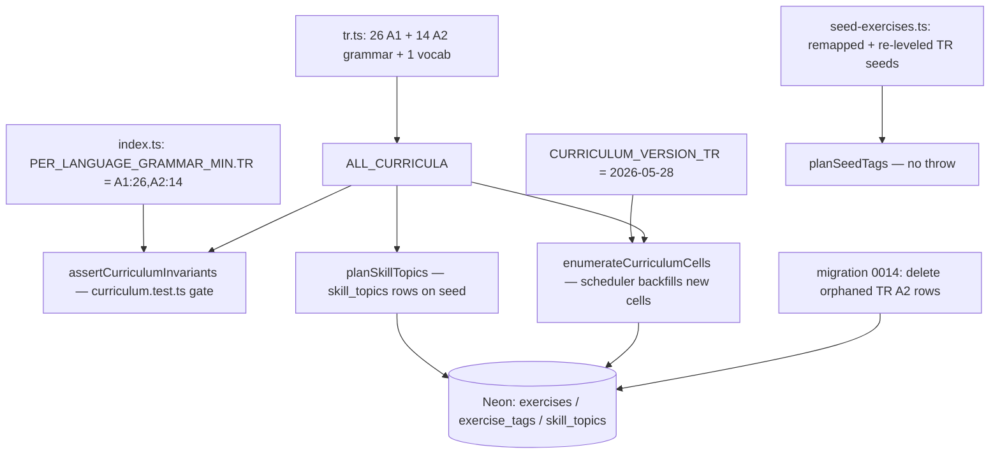

# Design Document

## Overview

This change rewrites the Turkish curriculum in `packages/db/src/curriculum/tr.ts` to full **Yedi İklim A1+A2 parity**: 26 A1 grammar points + 14 A2 grammar points + the unchanged `tr-a2-everyday-vocab` vocab umbrella (41 entries total, up from 10). It is a **data/content change** to a frozen TypeScript array, plus the four coupled artifacts that array drives:

1. `packages/db/src/curriculum/index.ts` — `PER_LANGUAGE_GRAMMAR_MIN.TR` minimums and `CURRICULUM_VERSION_TR` consumers.
2. `packages/db/src/curriculum/curriculum.test.ts` — per-language count assertions.
3. `packages/db/scripts/seed-exercises.ts` — `SEED_KEY_TO_GRAMMAR_POINT` + the three TR seed rows (re-keyed/re-leveled to A1).
4. `packages/db/src/lib/deterministic-uuid.test.ts` — the seed-key sample list (cosmetic sync after seed-key rename).

Because a grammar point's CEFR level is encoded in its key (invariant: key infix must equal `cefrLevel`), relocating the four noun cases, definite past, future, genitive, comparatives, and the question particle to A1 means **renaming five live keys**. A forward-only migration `0014_*.sql` deletes the orphaned production rows (exercises, exercise_tags, skill_topics) tied to the five old A2 keys so the generation scheduler cleanly repopulates the new A1 cells.

No runtime/application code changes: the scheduler, evaluator, and retrieval consume the curriculum through the same `getGrammarPoint` / `enumerateCurriculumCells` / `assertCurriculumInvariants` interfaces, which are unchanged.

## Steering Document Alignment

### Technical Standards (tech.md)

- **Drizzle, forward-only migrations** (`tech.md` §5 "DB migrations are forward-only; reviewed in PR"): the cleanup is a hand-written SQL file added to `packages/db/migrations/` + a `meta/_journal.json` entry, applied by `scripts/migrate.ts` (the project's `drizzle-orm/neon-serverless` runner, not `drizzle-kit migrate`).
- **Pre-generated content pool** (`tech.md` §7): the new A1/A2 cells are backfilled asynchronously by the EventBridge-scheduled generation Lambda, which enumerates cells from `ALL_CURRICULA`; no synchronous content generation is added here.
- **Schema-as-code / TypeScript-first**: curriculum entries stay typed `GrammarPoint[]`; the invariant gate in `curriculum.test.ts` keeps the shipped array valid.

### Project Structure (structure.md)

No `structure.md` exists in `.claude/steering/`. The change follows the conventions observed in the package: per-language curriculum modules under `packages/db/src/curriculum/`, numbered SQL migrations under `packages/db/migrations/`, and the `*_VERSION` bump-in-same-commit convention documented in the `tr.ts` header and CLAUDE.md.

## Code Reuse Analysis

### Existing Components to Leverage

- **`GrammarPoint` type (`@language-drill/shared`)**: every new entry uses the existing shape (`key`, `kind`, `name`, `description`, `cefrLevel`, `language`, `examplesPositive`, `examplesNegative`, `commonErrors`, optional `prerequisiteKeys`, optional `targetOverride`). No type changes.
- **`assertCurriculumInvariants` (`index.ts`)**: the existing 10 invariants validate all 40 new/relocated entries unchanged — no new validation code; the test that calls it (`curriculum.test.ts`) is the gate.
- **`planSeedTags` / `planSkillTopics` (`seed-exercises.ts`)**: unchanged functions; only their data inputs (the mapping + seed rows) change.
- **`deterministicUuid` (`@language-drill/shared`)**: used to compute the orphaned `skill_topics` IDs the migration deletes; the IDs are precomputed and embedded as literals in the SQL (the migration is plain SQL and cannot call JS).
- **`scripts/migrate.ts`**: the existing migration runner applies `0014` with no changes.
- **`enumerateCurriculumCells` / `resolveCellTarget` (`cell-targets.ts`)**: the scheduler auto-discovers the new A1/A2 cells from the curriculum; `CELL_TARGET_DEFAULTS` already has A1/A2 entries, so the new cells get sensible targets with no edit.

### Integration Points

- **Generation scheduler (`infra/lambda/src/generation/scheduler.ts`)**: reads `ALL_CURRICULA` → the `CURRICULUM_VERSION_TR` bump clears any "saturated-dedup"/"low-yield" suppression on TR cells, so renamed/added cells are (re)generated.
- **`exercises.grammar_point_key` (text), `exercise_tags`, `skill_topics`**: the migration's deletion targets; FK is `exercise_tags → exercises` and `exercise_tags → skill_topics`, so tags are deleted first.

## Architecture



**Edit ordering (matters for the invariant gate):** all `tr.ts` entries and their `prerequisiteKeys` must be internally consistent in a single edit — `assertCurriculumInvariants` rejects dangling/cross-language prerequisites, so a half-renamed file fails. The file is rewritten as one coherent array, then `index.ts`/test/seed/migration follow.

## Components and Interfaces

### Component 1 — `packages/db/src/curriculum/tr.ts` (curriculum array)

- **Purpose:** hold the 41 entries (26 A1 grammar, 14 A2 grammar, 1 A2 vocab) in level order.
- **Interfaces:** default export `trCurriculum: readonly GrammarPoint[]`; named `CURRICULUM_VERSION_TR`.
- **Changes:**
  - Destructure `const { A1, A2 } = CefrLevel;` (already present; B1/B2 stay absent from the destructure).
  - Bump `CURRICULUM_VERSION_TR = '2026-05-28'`.
  - Rewrite the A1 section to the 26 entries; rewrite the A2 section to the 14 entries (see Data Models for the full key + prerequisite list).
  - Prune the disabled `/* … */` B1/B2 block: **remove** `tr-b1-mis-evidential`, `tr-b1-aorist`, `tr-b1-future`, `tr-b2-converbs` (relocated); **narrow** `tr-b2-relative-clause-participles` to non-subject `-DIK`/`-(y)AcAK` only and `tr-b2-noun-clauses-ma-dik` to `-DIK`/`-(y)AcAK` noun clauses only (the `-(y)An` and `-mA/-mAk/-Iş` parts move to A2). Keep `tr-b1-conditionals-sa`, `tr-b1-keske-optative`, `tr-b1-causal-conjunctions` (nominalized `-DIğI için`), `tr-b2-passive-with-nominalization`, `tr-b2-causative-reciprocal`.
  - **Fix stale prerequisites inside the surviving commented entries** so a future B1/B2 re-enable doesn't resurface dangling references to the renamed keys: `tr-b1-keske-optative`'s `prerequisiteKeys` `tr-a2-dili-past` → `tr-a1-dili-past`; `tr-b2-relative-clause-participles`'s `prerequisiteKeys` `tr-a2-genitive-possessive` → `tr-a1-genitive-possessive`. (These are inside `/* */` so they don't affect the invariant gate today, but are corrected per Requirement 16.)
  - Rewrite the "TEMPORARILY REDUCED" header comment to describe the new state (A1+A2 complete; B1/B2 still disabled; restore note no longer references future/aorist/-mIş at B1).
- **Reuses:** `GrammarPoint`, `CefrLevel`, `Language` from `@language-drill/shared`.

### Component 2 — `packages/db/src/curriculum/index.ts` (minimums)

- **Purpose:** enforce per-language floors.
- **Change:** `PER_LANGUAGE_GRAMMAR_MIN.TR = { A1: 26, A2: 14, B1: 0, B2: 0 }`. Update the "TEMPORARILY REDUCED" comment to note TR is now full-A1/A2. ES/DE entries untouched.

### Component 3 — `packages/db/src/curriculum/curriculum.test.ts` (counts)

- **Purpose:** fail the build if TR counts drift.
- **Change:** in the "Turkish meets minimums" test, assert `grammar.A1` ≥ 26, `grammar.A2` ≥ 14, `B1` = 0, `B2` = 0, `vocab` = 1; update the test title/comment. No other test changes (the generic invariant / `getGrammarPoint` / cross-language tests still pass; `getGrammarPoint('es-b1-present-subjunctive')` is unaffected).

### Component 4 — `packages/db/scripts/seed-exercises.ts` (seed mapping + rows)

- **Purpose:** keep `planSeedTags` resolving and seed levels coherent.
- **Changes:**
  - Seed rows: `tr-cloze-a2-1` → key `tr-cloze-a1-1`, `difficulty: 'A1'`; `tr-translation-a2-1` → key `tr-translation-a1-1`, `difficulty: 'A1'`; `tr-vocab-a2-1` unchanged (still A2, vocab umbrella). Exercise bodies (cloze on definite past, translation on questions) are already A1-appropriate content under the new placement.
  - `SEED_KEY_TO_GRAMMAR_POINT`: `'tr-cloze-a1-1': 'tr-a1-dili-past'`, `'tr-translation-a1-1': 'tr-a1-questions'`, `'tr-vocab-a2-1': 'tr-a2-everyday-vocab'` (unchanged). The commented B1/B2 TR lines stay commented; none reference a relocated point, so they need no edit.
- **Reuses:** `planSeedTags`, `planSkillTopics`, `deterministicUuid` unchanged.

### Component 5 — `packages/db/src/lib/deterministic-uuid.test.ts` (seed-key sample)

- **Purpose:** assert `deterministicUuid` uniqueness over the 36-key sample.
- **Change (cosmetic):** rename `tr-cloze-a2-1` → `tr-cloze-a1-1` and `tr-translation-a2-1` → `tr-translation-a1-1` in the sample list so it mirrors the catalogue; `tr-vocab-a2-1` unchanged. The test only checks set size = 36, so it passes either way, but the list is kept truthful.

### Component 6 — `packages/db/migrations/0014_tr_a1_realign_cleanup.sql` + journal

- **Purpose:** remove production rows orphaned by the five key renames so the scheduler repopulates A1 cells and stale A2 rows aren't served.
- **Interface:** plain SQL applied by `scripts/migrate.ts`; a new object appended to `packages/db/migrations/meta/_journal.json` (`idx: 14`, `version: "7"`, `tag: "0014_tr_a1_realign_cleanup"`, `breakpoints: true`, fresh `when` epoch-ms).
- **Reuses:** existing migration runner; no schema change (data-only DELETEs).

## Data Models

### `GrammarPoint` (unchanged shape)

```
key: string                 // ^(es|de|tr)-(a1|a2|b1|b2)-[a-z0-9-]+$, globally unique
kind: 'grammar' | 'vocab'
name: string
description: string         // <= 200 chars
cefrLevel: 'A1'|'A2'|'B1'|'B2'   // must equal key infix
language: 'ES'|'DE'|'TR'    // must equal key prefix
examplesPositive: string[]  // >= 2
examplesNegative: string[]  // >= 1, each starts with '*'
commonErrors: string[]      // >= 1
prerequisiteKeys?: string[] // each resolves to a same-language key
targetOverride?: number
```

### Target A1 (26) — key → prerequisites

| # | Key | Prerequisites |
|---|---|---|
| 1 | tr-a1-vowel-harmony | — |
| 2 | tr-a1-personal-suffixes | — |
| 3 | tr-a1-plural-suffix | tr-a1-vowel-harmony |
| 4 | tr-a1-locative | tr-a1-vowel-harmony |
| 5 | tr-a1-demonstratives | — |
| 6 | tr-a1-questions | tr-a1-personal-suffixes |
| 7 | tr-a1-degil | tr-a1-personal-suffixes |
| 8 | tr-a1-var-yok | tr-a1-possessive-suffixes |
| 9 | tr-a1-numbers-ordinals | tr-a1-vowel-harmony |
| 10 | tr-a1-personal-pronouns | — |
| 11 | tr-a1-accusative-definite-object | tr-a1-vowel-harmony |
| 12 | tr-a1-ablative-dative | tr-a1-vowel-harmony, tr-a1-locative |
| 13 | tr-a1-genitive-possessive | tr-a1-vowel-harmony, tr-a1-possessive-suffixes |
| 14 | tr-a1-present-continuous | tr-a1-vowel-harmony |
| 15 | tr-a1-negation | tr-a1-present-continuous |
| 16 | tr-a1-dili-past | tr-a1-vowel-harmony |
| 17 | tr-a1-future | tr-a1-vowel-harmony |
| 18 | tr-a1-imperative | tr-a1-vowel-harmony |
| 19 | tr-a1-possessive-suffixes | tr-a1-vowel-harmony |
| 20 | tr-a1-instrumental-ile | tr-a1-vowel-harmony |
| 21 | tr-a1-postpositions-once-sonra | tr-a1-ablative-dative |
| 22 | tr-a1-dan-a-kadar | tr-a1-ablative-dative |
| 23 | tr-a1-ki-relativizer | tr-a1-locative |
| 24 | tr-a1-gore-bence | tr-a1-ablative-dative |
| 25 | tr-a1-beri-dir | tr-a1-ablative-dative |
| 26 | tr-a1-comparative-superlative | tr-a1-ablative-dative |

> Ordering note: the invariant resolves prerequisites by membership, not array position, so `tr-a1-var-yok` (8) and `tr-a1-genitive-possessive` (13) may reference `tr-a1-possessive-suffixes` (19) even though it appears later. Keeping prerequisites earlier where practical aids readability.

### Target A2 (14) — key → prerequisites

| # | Key | Prerequisites |
|---|---|---|
| 1 | tr-a2-mis-evidential | tr-a1-dili-past |
| 2 | tr-a2-aorist | tr-a1-vowel-harmony |
| 3 | tr-a2-ability-necessity | tr-a1-present-continuous |
| 4 | tr-a2-converbs | tr-a1-present-continuous |
| 5 | tr-a2-converb-temporal | tr-a1-dili-past |
| 6 | tr-a2-nominalization | tr-a1-possessive-suffixes |
| 7 | tr-a2-relative-an | tr-a1-present-continuous |
| 8 | tr-a2-gibi-kadar | — |
| 9 | tr-a2-correlative-conjunctions | — |
| 10 | tr-a2-causal-connectors | — |
| 11 | tr-a2-ca-suffix | tr-a1-vowel-harmony |
| 12 | tr-a2-pekistirme | — |
| 13 | tr-a2-purpose-icin-uzere | tr-a1-future |
| 14 | tr-a2-reported-speech | tr-a1-dili-past |

### Vocab (1, unchanged)

`tr-a2-everyday-vocab` (`kind: 'vocab'`, A2).

### Migration 0014 — orphaned-row deletion (data-only, TR-scoped)

Precomputed `skill_topics.id = deterministicUuid('skill-topic:' + oldKey)` for the five renamed keys:

| Old key | skill_topics.id |
|---|---|
| tr-a2-dili-past | `17ade3fa-dfeb-599e-9428-2592026723ff` |
| tr-a2-accusative-definite-object | `3189b08c-5ea5-50d8-9771-ec24bf237a19` |
| tr-a2-ablative-dative | `cedcac61-873d-53cf-baf9-b043b9cb133a` |
| tr-a2-genitive-possessive | `a4233fbd-a492-54e7-b0c0-560b64a674da` |
| tr-a2-question-formation | `ee6600c5-0719-5705-bf59-a419f44d20b4` |

SQL (deletions ordered to respect `exercise_tags` FKs — tags before parents):

```sql
-- 0014_tr_a1_realign_cleanup.sql
-- Remove rows orphaned by relocating 5 TR grammar points A2 -> A1 (key renames).
-- Forward-only, data-only, scoped to language='TR'. ES/DE untouched.

-- 1. exercise_tags pointing at the orphaned skill_topics (seed + generated tags)
DELETE FROM exercise_tags
WHERE skill_topic_id IN (
  '17ade3fa-dfeb-599e-9428-2592026723ff',
  '3189b08c-5ea5-50d8-9771-ec24bf237a19',
  'cedcac61-873d-53cf-baf9-b043b9cb133a',
  'a4233fbd-a492-54e7-b0c0-560b64a674da',
  'ee6600c5-0719-5705-bf59-a419f44d20b4'
);
--> statement-breakpoint
-- 2. exercise_tags for the orphaned exercises (belt-and-suspenders)
DELETE FROM exercise_tags
WHERE exercise_id IN (
  SELECT id FROM exercises
  WHERE language = 'TR'
    AND grammar_point_key IN (
      'tr-a2-dili-past','tr-a2-accusative-definite-object',
      'tr-a2-ablative-dative','tr-a2-genitive-possessive','tr-a2-question-formation'
    )
);
--> statement-breakpoint
-- 3. the orphaned exercises themselves
DELETE FROM exercises
WHERE language = 'TR'
  AND grammar_point_key IN (
    'tr-a2-dili-past','tr-a2-accusative-definite-object',
    'tr-a2-ablative-dative','tr-a2-genitive-possessive','tr-a2-question-formation'
  );
--> statement-breakpoint
-- 4. the orphaned skill_topics (explicit IDs so tr-a2-everyday-vocab survives)
DELETE FROM skill_topics
WHERE id IN (
  '17ade3fa-dfeb-599e-9428-2592026723ff',
  '3189b08c-5ea5-50d8-9771-ec24bf237a19',
  'cedcac61-873d-53cf-baf9-b043b9cb133a',
  'a4233fbd-a492-54e7-b0c0-560b64a674da',
  'ee6600c5-0719-5705-bf59-a419f44d20b4'
);
```

> The `--> statement-breakpoint` delimiters match the repo's existing multi-statement migrations (0001–0009) and how `drizzle`'s `readMigrationFiles` splits files (`breakpoints: true`).

> `generation_jobs` rows for the old A2 cells are left as-is (historical records); the scheduler keys by cell and the old cells simply stop being enumerated, while the `CURRICULUM_VERSION_TR` bump unblocks the new A1 cells. No `generation_jobs` deletion is needed.

## Error Handling

### Error Scenarios

1. **Dangling / cross-language prerequisite in `tr.ts`**
   - Handling: `assertCurriculumInvariants` throws; `curriculum.test.ts` fails the build.
   - Mitigation: every `prerequisiteKeys` value in the Data Models tables is a `tr-a1-*` key present in the same array.

2. **Count drift (A1 ≠ 26 or A2 ≠ 14)**
   - Handling: the minimum check in `assertCurriculumInvariants` (if below `PER_LANGUAGE_GRAMMAR_MIN`) or the count assertion in `curriculum.test.ts` fails.
   - User impact: red CI; caught before merge.

3. **Seed mapping points at a stale key**
   - Handling: `planSeedTags` throws "maps to unknown curriculum key"; `seed-exercises.test.ts` / `pnpm db:seed:exercises` fails fast.
   - Mitigation: mapping updated in lockstep with the renames.

4. **Migration FK violation (deleting a parent before its tags)**
   - Handling: Postgres raises an FK error and the migration aborts (transactional).
   - Mitigation: ordered tags → exercises → skill_topics as above.

5. **Migration run twice**
   - Handling: idempotent — the `DELETE`s match nothing on re-run; `_journal.json` prevents re-application anyway.

6. **Description > 200 chars on a new entry**
   - Handling: invariant #8 throws in tests.
   - Mitigation: keep each `description` terse (existing entries average ~140 chars).

## Testing Strategy

### Unit Testing

- **`curriculum.test.ts`** (primary gate): `assertCurriculumInvariants()` must not throw over the shipped array (validates all 40 keys: format, uniqueness, level/prefix match, ≥2 positive / ≥1 starred negative / ≥1 commonError, ≤200-char description, in-language prerequisites); updated TR count assertions (A1≥26, A2≥14, B1=0, B2=0, vocab=1).
- **`seed-exercises.test.ts`**: `planSeedTags(SEED_EXERCISES, SEED_KEY_TO_GRAMMAR_POINT, ALL_CURRICULA)` resolves without throwing for the re-keyed TR seeds; any TR-specific resolution assertions updated to the new keys/levels.
- **`deterministic-uuid.test.ts`**: still asserts 36 unique UUIDs after the sample-list rename.
- Run via `pnpm --filter @language-drill/db test` and the root `pnpm test`.

### Integration Testing

- **`pnpm lint` + `pnpm typecheck` + `pnpm test`** from repo root, zero failures (CLAUDE.md Pre-Push Checks). Typecheck confirms the enlarged array still satisfies `readonly GrammarPoint[]`.
- **Migration apply (manual, against a Neon branch):** `pnpm --filter @language-drill/db db:migrate` applies `0014` cleanly; a follow-up `pnpm db:seed:exercises` upserts the new A1 `skill_topics` and re-leveled seed rows idempotently. Verified on the ephemeral PR Neon branch by CI before prod.

### End-to-End Testing

- None required — no UI or API surface changes. Post-merge, the generation scheduler backfills the new A1/A2 cells over subsequent runs (asynchronous; not gated by this PR). Spot-check after deploy: the `exercises` pool gains rows under the new `tr-a1-*` / `tr-a2-*` keys and contains no rows under the five old A2 keys.
