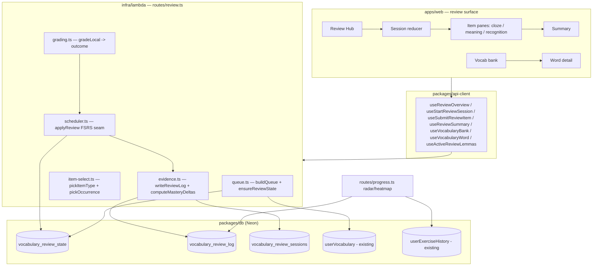

# Design Document

## Overview

Vocabulary Review (Part 2, Phase 1) adds a spaced-repetition practice loop over the deep
cards saved by Part 1. It introduces an **FSRS scheduler** (`ts-fsrs`), a **per-lemma review
card** model that pools the existing per-surface `userVocabulary` rows as **occurrences**, a
**per-language queue builder**, a one-item-at-a-time **session** across three locally-graded
item types (cloze-in-context, meaning→production, recognition), an **end-of-session summary**,
and a **vocabulary bank / word detail** browse surface. Review results are persisted as
**evidence rows** that the existing progress radar reads, so reviews move the learner's skill
map without a parallel scoring system.

The design deliberately mirrors the existing **drill session** (reducer-driven UI, queue
fetched up-front, per-item submit → graded feedback → next) and the existing **progress
aggregation** (weighted-evidence radar). All new server logic is pure and unit-testable behind
a single `applyReview(card, rating)` scheduler seam, so the Phase 2 "use it" Claude-graded item
type can plug in without touching the scheduler or the data model.

Scope boundary (Phase 1): **no LLM calls** — every in-scope item type grades locally and free.
"Use it"/Claude grading, listening (Polly), speaking (Transcribe), and the leech *rescue*
intervention are out of scope; only the seams and the leech *state* are built here.

## Steering Document Alignment

### Technical Standards (tech.md)

- **Separate Lambda API (Hono), not Next.js routes** — all review endpoints are Hono routes in
  `infra/lambda/src/routes`, registered like the existing `read`/`exercises`/`progress` routers
  and authenticated by the existing Clerk JWT middleware (`c.get('userId')`).
- **Neon + Drizzle, forward-only migrations** — the new `vocabulary_review_state`,
  `vocabulary_review_log`, and `vocabulary_review_sessions` tables and their indexes are added
  to `packages/db/src/schema` with a single new `NNNN_*.sql` migration (next is `0015`).
- **Zod everywhere, shared contracts** — request/response and card/occurrence shapes are Zod
  schemas in `packages/api-client/src/schemas` + `packages/shared`, validated on both ends, as
  the read/exercise features already do.
- **TanStack Query + authenticated fetch** — web consumes the API through `packages/api-client`
  hooks built on `createAuthenticatedFetch`, mirroring `useSubmitAnswer`/`useReadEntries`.
- **CEFR is the single spine; no XP/streaks** — review evidence feeds the existing CEFR-weighted
  radar; no surface renders a streak/XP/point/lesson count.
- **FSRS, not SM-2** — per CLAUDE.md, the scheduler uses `ts-fsrs` `stability`+`difficulty`. The
  declared-but-unused `spaced_repetition_cards` (SM-2) table is left untouched; we do **not**
  extend it.
- **Latest stable packages** — `ts-fsrs` is added at its latest stable version (actively
  maintained, MIT, frequent releases).

### Project Structure (structure.md)

No `structure.md` steering file exists; the monorepo conventions in `CLAUDE.md` / `tech.md` are
authoritative and are followed:

- `packages/db` — schema + migration.
- `packages/shared` — canonical review domain types/Zod (card, occurrence, item, outcome,
  scheduler/mastery deltas).
- `packages/api-client` — `schemas/review.ts` + `hooks/useReview*.ts`, re-exported from the
  barrel `index.ts`.
- `infra/lambda/src/routes/review.ts` — the router; `infra/lambda/src/lib/review/*` — pure
  server logic (scheduler, grading, queue, item selection, evidence).
- `apps/web/app/(dashboard)/review/*` — hub, session, bank, detail pages with co-located
  `_components`/`_state`, mirroring `drill/` and `read/`.

## Code Reuse Analysis

### Existing Components to Leverage

- **Drill session reducer** (`apps/web/app/(dashboard)/drill/_components/session-reducer.ts`):
  the `idle → creating → inSession → completing` state machine, per-item submission states, and
  `selectProgressFraction`/`selectCurrentItem` selectors are copied/adapted into a
  `review-session-reducer.ts` (items fetched up-front, per-item submit, burndown).
- **Drill UI shell** (`drill/_components/exercise-pane.tsx`, `feedback-shell.tsx`): the
  split-layout + coach-rail + feedback pattern is the template for the review session pane and
  per-item-type renderers.
- **Progress aggregation** (`infra/lambda/src/lib/progress-aggregation.ts`): `ContributingRow`,
  `difficultyWeight`, `recencyWeight`, `aggregateAxisMastery`, `axisForExerciseType` are reused
  unchanged; we extend the radar/heatmap queries to UNION review-log rows mapped into
  `ContributingRow`.
- **Auth + rate-limit patterns** (`routes/exercises.ts`, `middleware/auth.ts`,
  `usage_events`): same `userId` scoping; no metering needed in Phase 1 (local grading is free)
  but the pattern is the seam for Phase 2 metered grading.
- **api-client conventions** (`fetchClient.ts`, `hooks/useExercise.ts`, `hooks/useSession.ts`):
  the `useMutation`/`useQuery` + Zod-parse + cache-invalidation shape is copied for review hooks.
- **Active language** (`components/shell/active-language-provider.tsx`,
  `lib/active-language.ts`): the hub/session/bank all read `useActiveLanguage()`; queues are
  per-language.
- **Shell nav** (`components/shell/nav-items.tsx`, `nav.tsx`, `mobile-tab-bar.tsx`): add a
  `review` destination with a due-count badge.
- **UI primitives** (`apps/web/components/ui/*` + `globals.css` tokens) and the **accent picker**
  for meaning→production input.
- **Saved deep card** (`userVocabulary.card`, `packages/shared` `DeepCard`, `Morphology`): the
  source of occurrence sentences, morphology, and grammar points.

### Integration Points

- **`userVocabulary` (read-only here)**: grouped by `(userId, language, lemma)` to build review
  cards and occurrences. Its surface-form unique key is preserved — this feature never writes to
  it except via the bank's delete action (which removes the vocabulary row); known/suspend/reset
  set state in the new table.
- **Progress radar/heatmap** (`routes/progress.ts`): extended to include review evidence so the
  radar moves.
- **Reading surface** (`apps/web/app/(dashboard)/read/_components/annotated-view.tsx`): reads the
  new "active review lemmas" query to add the distinct under-review highlight.
- **`readEntry`** (`readEntries`): the "review the words from this passage" filter selects
  `userVocabulary` rows where `sourceReadEntryId = entryId`.

## Architecture

The feature is three pure server modules (scheduler, grading, queue/selection) behind a thin
Hono router, persisted in three new tables, consumed by a reducer-driven web surface and shared
api-client hooks. The scheduler is the single point all ratings flow through.



Per-item request flow (the hot path, all local):

```mermaid
sequenceDiagram
    participant U as Learner
    participant W as Web (reducer)
    participant R as POST /review/items/:stateId/submit
    participant G as grading.ts
    participant S as scheduler.ts (applyReview)
    participant E as evidence.ts
    U->>W: type answer, Enter
    W->>R: { sessionId, itemType, surface, answer, hintsUsed }
    R->>G: gradeLocal(itemType, expected, answer, hintsUsed)
    G-->>R: outcome (correct|partial|incorrect)
    R->>S: applyReview(card, ratingFromOutcome(outcome))
    S-->>R: updated FSRS state (stability, difficulty, dueAt, state)
    R->>E: writeReviewLog(...) + computeMasteryDeltas(...)
    E-->>R: { schedulerDelta, masteryDelta[] }
    R-->>W: graded result + deltas (no LLM, no metering)
    W->>U: inline feedback + "what moved"; advance on Enter
```

## Components and Interfaces

### Component 1 — FSRS scheduler (`infra/lambda/src/lib/review/scheduler.ts`)

- **Purpose:** Wrap `ts-fsrs` behind the project's own card shape; the single seam every rating
  flows through.
- **Interfaces:**
  - `FSRS_PARAMS` — one shared constant (request retention, maximum interval, weights) so tuning
    is swappable.
  - `initCard(now): FsrsState` — new-card state.
  - `applyReview(state: FsrsState, rating: FsrsRating, now: Date): { next: FsrsState; delta: SchedulerDelta }`
    — runs `ts-fsrs`, returns the next persisted state plus a before→after delta (interval,
    stability, difficulty, lifecycle state).
  - `ratingFromOutcome(outcome, opts): FsrsRating` — maps `correct→Good|Easy`, `partial→Hard`,
    `incorrect→Again`, honoring hint caps; this is the ONLY place outcome→rating lives, so a
    Phase 2 `ratingFromEvalScore(score)` can sit beside it and feed the same `applyReview`.
  - `deriveLifecycleState(state, lapses): VocabReviewState` — maps FSRS state + lapse count to
    `new|learning|mature|leech` (leech at ≥ 3 consecutive lapses; mature at stability ≥ 7d).
- **Dependencies:** `ts-fsrs`.
- **Reuses:** nothing existing (new); pure + unit-tested.

### Component 2 — Local grading (`infra/lambda/src/lib/review/grading.ts`)

- **Purpose:** Decide `correct | partial | incorrect` for the three local item types, with no LLM.
- **Interfaces:**
  - `normalize(input, language): string` — lowercase, trim, collapse whitespace; language-aware.
  - `gradeCloze(answer, expectedSurface, language): Outcome` — exact match on the inflected
    surface; accent/diacritic-only mismatch → `partial`.
  - `gradeMeaning(answer, acceptedForms, language, hintsUsed): Outcome` — match against lemma +
    accepted inflected forms; hint-assisted-correct → `partial`.
  - `gradeRecognition(selectedKey, correctKey): Outcome` — exact (warm-up).
- **Dependencies:** none.
- **Reuses:** the same answer-normalization intent the exercise evaluator uses; pure + tested.

### Component 3 — Queue builder & card assembly (`infra/lambda/src/lib/review/queue.ts`)

- **Purpose:** Turn `(user, language, filter)` into a per-language ordered queue of review items.
- **Interfaces:**
  - `ensureReviewState(db, userId, language): Promise<void>` — lazily create `new`
    `vocabulary_review_state` rows for any `userVocabulary` lemma lacking one (decouples from
    Part 1's save path; idempotent on the unique key).
  - `assembleCards(db, userId, language, lemmas?): Promise<ReviewCard[]>` — group `userVocabulary`
    rows by `(userId, language, lemma)` into cards with pooled `occurrences[]`, joined to their
    `vocabulary_review_state`.
  - `buildQueue(db, userId, language, filter): Promise<{ items: ReviewItem[]; breakdown: QueueBreakdown }>`
    — select due + capped-new (default 5/day, counted from `vocabulary_review_log`) + leech cards
    (excluding `suspended`/`known`), apply `filter` (`all | new | leech | { readEntryId } | { grammarPoint }`),
    cap to the session ceiling (default 20, most-overdue first), and call item selection per card.
  - `overview(db, userId, language): Promise<HubOverview>` — counts, item-type mix, est. length,
    next-due preview for the hub (no session created).
- **Dependencies:** Components 1 & 4; Drizzle.
- **Reuses:** `userVocabulary`, `readEntries`; index `(userId, language, dueAt)`.

### Component 4 — Item-type & occurrence selection (`infra/lambda/src/lib/review/item-select.ts`)

- **Purpose:** Pure policy mapping a card's maturity to an item type and a tested occurrence.
- **Interfaces:**
  - `pickItemType(card, sessionSeed): ReviewItemType` — `new`/low-stability → recognition or
    cloze; `learning` → cloze (if an occurrence has a usable sentence) else meaning; `mature`
    (stability ≥ 7d) → meaning→production (Phase 1 production type); vary across the session.
    Phrase/idiom cards exclude morphology-dependent cloze (reduced set: recognition + meaning).
  - `pickOccurrence(card): Occurrence | null` — choose an occurrence (least-recently-tested /
    seeded-random); `null` when none has a usable sentence → caller falls back to a
    context-independent type.
- **Dependencies:** none. **Reuses:** the saved `card` jsonb (morphology, grammar points).

### Component 5 — Evidence & mastery movement (`infra/lambda/src/lib/review/evidence.ts`)

- **Purpose:** Persist each graded review and compute the "what moved" deltas, feeding the
  existing radar.
- **Interfaces:**
  - `writeReviewLog(db, row): Promise<void>` — insert one `vocabulary_review_log` row
    (`itemType`, `surface`, `outcome`, `rating`, `cefrBand`, `grammarPoints[]`, `sessionId`).
  - `computeMasteryDeltas(db, userId, language, excludeLogIds, now): Promise<MasteryDelta[]>` —
    "impact on current mastery" of a set of just-written evidence rows, parameterized by which log
    rows to exclude for the baseline. **Per-item** feedback (Req 9.4) passes the single just-written
    row id; the **session summary** (Req 11.2) passes all of the session's row ids. For each grammar
    label in the affected rows, compute the radar's **`currentMastery`** value (the same
    recency-weighted-over-90-day-window `aggregateAxisMastery` formula) twice: `from` = over that
    label's `vocabulary_review_log` rows **excluding** the given ids, `to` = over all rows
    **including** them. This is a
    real, evidence-sourced before→after that uses the radar's own `currentMastery` math — it is
    deliberately **not** the radar card's 30-day-ago `previousMastery` snapshot (that is a
    separate metric the radar computes for its own up/down arrow); the summary measures "what this
    session moved", which is the intent of Requirements 9.4 / 11.2. A first-ever review of a label
    therefore shows movement from its no-evidence baseline, by design. Grammar-point identity is
    the occurrence's own normalized label (e.g. "ablative case"); these labels are **display-only**
    in the session/summary "what moved" line and are NOT consumed by the heatmap grid (which groups
    by `topicHint`), so no canonical-key reconciliation is needed in Phase 1 (it is a future
    enhancement). The radar's **grammar axis** consumes only the aggregate score (below), not these
    labels, so there is no label/cell mismatch.
  - `reviewContributingRows(db, userId, language, sinceDays = 90): Promise<ContributingRow[]>` —
    map review-log rows into the radar's `ContributingRow` shape, defaulting to the **same 90-day
    window** the radar query uses so UNIONed rows are not filtered inconsistently. `score` from
    outcome (`correct=1, partial=0.5, incorrect=0`), `difficulty` from `cefrBand` (fallback B1),
    `evaluatedAt=reviewedAt`. Because `aggregateRadar` buckets each row into **exactly one** axis,
    a graded review emits **two** rows when it carries grammar points: one with
    `type = 'vocab_review_vocab'` (→ vocabulary axis) and one with `type = 'vocab_review_grammar'`
    (→ grammar axis); reviews without grammar points emit only the vocabulary row. These two new
    `type` sentinels MUST be added to `axisForExerciseType` (see Component 6) or they fall through
    its `default → null` branch and are silently dropped.
- **Dependencies:** Drizzle; the progress-aggregation helpers (reused).
- **Reuses:** `progress-aggregation.ts` weighting; `vocabulary_review_log`.

### Component 6 — Progress aggregation extension (`infra/lambda/src/routes/progress.ts` + `lib/progress-aggregation.ts`)

- **Purpose:** Make the existing radar reflect reviews.
- **Interfaces:** the radar handler additionally fetches `evidence.reviewContributingRows(...)`
  (90-day window) and concatenates them with the exercise-history `ContributingRow[]` before
  bucketing. The weighting functions (`difficultyWeight`, `recencyWeight`, `aggregateAxisMastery`)
  and the six-axis taxonomy are **unchanged**. The one required change to `progress-aggregation.ts`
  is extending **`axisForExerciseType`** to map the two new review `type` sentinels
  (`'vocab_review_vocab' → 'vocabulary'`, `'vocab_review_grammar' → 'grammar'`); without this,
  the UNIONed rows hit the existing `default → null` branch and are dropped. `previousMastery`
  continues to use its existing 30-day-ago window unchanged (the review rows simply join the same
  windowed buckets). The heatmap is left as-is in Phase 1 (it groups by exercise `topicHint`, which
  review rows don't carry); review evidence therefore moves the **radar axes**, not the heatmap
  grid — consistent with "no parallel scoring system".
- **Dependencies:** Component 5. **Reuses:** all existing aggregation logic.

### Component 7 — Review router (`infra/lambda/src/routes/review.ts`)

- **Purpose:** HTTP surface; thin orchestration over Components 1–5; registered in `index.ts`.
- **Interfaces (all Clerk-authed, `userId`-scoped, Zod-validated):**
  - `GET  /review/overview?language=` → `HubOverview` (hub counts/mix/next-due).
  - `POST /review/sessions` `{ language, filter? }` → `{ sessionId, items: ReviewItem[] }`
    (creates a `vocabulary_review_sessions` row; runs `ensureReviewState` + `buildQueue`).
  - `POST /review/items/:stateId/submit` `{ sessionId, itemType, surface?, answer, hintsUsed }`
    → `ReviewItemResult` (`outcome`, `correctAnswer`, `schedulerDelta`, `masteryDelta[]`). Grades
    locally, `applyReview`, writes evidence; **no metering**.
  - `GET  /review/sessions/:id/summary` → `ReviewSummary` (clean/partial/missed, promoted/lapsed,
    new-card count, per-item recap, grammar deltas, next-due).
  - `GET  /review/bank?language=&status=&q=` → paginated bank rows (one per lemma).
  - `GET  /review/words/:stateId` → `WordDetail` (deep-card snapshot + occurrences + FSRS stats +
    history + grammar points).
  - `PATCH /review/words/:stateId` `{ action: 'suspend'|'unsuspend'|'mark_known'|'reset' }` →
    updated state. `DELETE /review/words/:stateId` → removes the underlying `userVocabulary`
    rows + state.
  - `GET  /review/active-lemmas?language=` → `{ lemmas: string[]; surfaces: string[] }` for the
    Reading highlight. Review state is **lemma-keyed** but the Reading annotations are
    **surface-keyed** (`FlaggedMap` / `spanAnnotations` carry a `lemma` field per
    `packages/shared` deep card). The Reading view marks a word as under-review when its
    annotation's `lemma` ∈ `lemmas` (primary match); the returned `surfaces` (each active card's
    occurrence surfaces, normalized lowercase) is a fallback for annotations lacking a resolved
    `lemma`. Both arrays are deduped and language-scoped.
- **Dependencies:** Components 1–5; auth middleware; Drizzle.

### Component 8 — api-client (`packages/api-client/src/schemas/review.ts` + `hooks/useReview*.ts`)

- **Purpose:** Typed, validated client surface.
- **Interfaces:** `useReviewOverview` (query), `useStartReviewSession` (mutation),
  `useSubmitReviewItem` (mutation), `useReviewSummary` (query), `useVocabularyBank` (query),
  `useVocabularyWord` (query), `useUpdateVocabularyWord`/`useDeleteVocabularyWord` (mutations),
  `useActiveReviewLemmas` (query). Each parses responses with the `schemas/review.ts` Zod types;
  mutations invalidate `['review','overview',lang]`, `['review','bank',lang]`,
  `['review','word',stateId]`, and `['review','active-lemmas',lang]`.
- **Reuses:** `createAuthenticatedFetch`, existing hook conventions.

### Component 9 — Web surface (`apps/web/app/(dashboard)/review/*`)

- **Purpose:** Hub, session, summary, bank, detail — desktop + mobile per the prototypes in
  `docs/design/vocabulary-review-prototype/`.
- **Interfaces / pages:**
  - `review/page.tsx` — Hub (`hub.jsx`/`mw-hub.jsx`): breakdown, mix, start, subsets, empty state.
  - `review/session/page.tsx` — reducer-driven session; `_components/` item panes
    (`ClozeItem`, `MeaningItem`, `RecognitionItem`) + `ReviewFeedback` (scheduler/mastery delta).
  - `review/summary/[sessionId]/page.tsx` — Summary (`summary.jsx`/`mw-summary.jsx`).
  - `review/bank/page.tsx` + `review/bank/[stateId]/page.tsx` — Bank + Word detail
    (`bank.jsx`/`detail.jsx`).
  - `_state/review-session-reducer.ts` — adapted from the drill reducer.
- **Reuses:** drill reducer/shell, UI primitives, accent picker, `useActiveLanguage`, shell nav
  (+ due-count badge), progress deep-link.

## Data Models

### vocabulary_review_state (new — one row per logical lemma card)

```
- id: uuid (pk, default random)
- userId: text (FK users.id, cascade delete, not null)
- language: text $type<LearningLanguage> (not null)
- lemma: text (not null)
- fsrsCardJson: jsonb $type<FsrsCard>   // full ts-fsrs Card, source of truth for round-trip
- stability: real (not null)            // denormalized from card, for queries/UI
- difficulty: real (not null)           // denormalized
- reps: integer (not null, default 0)
- lapses: integer (not null, default 0)
- state: text $type<'new'|'learning'|'mature'|'leech'|'suspended'|'known'> (not null, default 'new')
- lastReviewedAt: timestamptz (nullable)
- dueAt: timestamptz (not null)
- createdAt: timestamptz (not null, default now)
Constraints/indexes:
- UNIQUE (userId, language, lemma)
- INDEX (userId, language, dueAt)       // queue build
- INDEX (userId, language, state)       // bank filters / leech surfacing
```

### vocabulary_review_log (new — evidence; one row per graded item)

```
- id: uuid (pk)
- userId: text (FK users.id, not null)
- language: text $type<LearningLanguage> (not null)
- reviewStateId: uuid (FK vocabulary_review_state.id, cascade delete, not null)
- sessionId: uuid (FK vocabulary_review_sessions.id, set null, nullable)
- lemma: text (not null)
- itemType: text $type<'cloze'|'meaning'|'recognition'> (not null)
- surface: text (nullable)              // occurrence tested
- outcome: text $type<'correct'|'partial'|'incorrect'> (not null)
- rating: smallint (not null)           // 1..4
- cefrBand: text $type<CefrLevel> (nullable)
- grammarPoints: jsonb $type<string[]> (not null, default [])
- reviewedAt: timestamptz (not null, default now)
Indexes:
- INDEX (userId, language, reviewedAt)  // radar union + grammar deltas
- INDEX (reviewStateId, reviewedAt)     // word-detail history
```

### vocabulary_review_sessions (new — lightweight, mirrors practiceSessions)

```
- id: uuid (pk)
- userId: text (FK users.id, not null)
- language: text $type<LearningLanguage> (not null)
- filter: jsonb (nullable)              // the queue filter used
- itemCount: smallint (not null)
- startedAt: timestamptz (not null, default now)
- completedAt: timestamptz (nullable)
Index: (userId, startedAt)
```

### Shared domain types (packages/shared, Zod) — illustrative

```
- Occurrence { surface, sentence, translation?, source?, contextualSense, whyThisForm?, morphology?, grammarPoints[] }
- ReviewCard { stateId, lemma, language, gloss, pos, cefr, freqRank?, isPhrase, occurrences[], fsrs: FsrsStateView }
- ReviewItemType = 'cloze' | 'meaning' | 'recognition'
- ReviewItem { stateId, itemType, lemma, prompt fields per type, occurrence? }
- ReviewOutcome = 'correct' | 'partial' | 'incorrect'
- SchedulerDelta { intervalFrom, intervalTo, stabilityFrom, stabilityTo, stateFrom, stateTo }
- MasteryDelta { grammarPoint, from, to }   // 0..1, recency-weighted from the log
- QueueBreakdown { due, new, leech, total, mix: Record<ReviewItemType, number> }
- ReviewItemResult { outcome, correctAnswer, schedulerDelta, masteryDelta[] }
- ReviewSummary { duration?, total, correct, partial, missed, promoted[], lapsed[], newCards, items[], grammarDeltas[], nextDueAt }
```

Existing `userVocabulary` and `userExerciseHistory` are **unchanged**; `spaced_repetition_cards`
is left untouched.

## Error Handling

### Error Scenarios

1. **Submit references a card the user doesn't own / unknown `stateId`.**
   - Handling: 404/403; no scheduler mutation, no log row.
   - User Impact: item errors out; session can retry/skip (reducer `ITEM_ERROR`).

2. **Malformed/partial saved data** (missing `card` jsonb, occurrence without a sentence).
   - Handling: `assembleCards` degrades the card (drops unusable occurrences);
     `pickItemType`/`pickOccurrence` fall back to a context-independent type (meaning/recognition)
     rather than emit a broken cloze. Never throws the session.
   - User Impact: the word still appears, graded by a simpler item type.

3. **Empty queue for the language.**
   - Handling: `overview`/`buildQueue` return zero items + next-due; hub renders the "all caught
     up" empty state (no start button).
   - User Impact: explicit "nothing due", upcoming preview, secondary CTAs.

4. **Grade of a partial/accent-only mismatch.**
   - Handling: `grading.ts` returns `partial` → `Hard`; treated as a non-lapse rep.
   - User Impact: "close" feedback; card still advances modestly.

5. **Concurrent submits / double submit of the same item.**
   - Handling: the reducer only allows submit from `idle`; the server applies `applyReview` from
     the current persisted state, so a duplicate produces a second (harmless) rep. Optionally
     guarded with the `sessionId`+`stateId` last-write.
   - User Impact: none visible.

6. **Mid-session exit / crash.**
   - Handling: each item's scheduler state + log row is committed at submit time; the session row
     is left `completedAt = null`. No replay needed.
   - User Impact: completed reviews persist; the queue rebuilds next time.

7. **DB/validation errors on write.**
   - Handling: Zod rejects bad input before any write (400); DB errors surface as 500 and abort
     that item only (CloudWatch per the observability boundary — Lambda errors are not in Sentry).
   - User Impact: that item errors; rest of session unaffected.

## Testing Strategy

### Unit Testing

- **scheduler.ts**: `applyReview` transitions across the full lifecycle (new→learning→mature;
  repeated `Again`→leech at 3 lapses; `ratingFromOutcome` incl. hint caps). Deterministic with an
  injected `now`. **This is the highest-value test surface.**
- **grading.ts**: cloze exact vs. accent-only-partial vs. wrong; meaning against lemma + accepted
  forms; hint-assisted → partial; per-language normalization (TR/ES/DE).
- **item-select.ts**: maturity→type mapping; phrase cards exclude morphology cloze; occurrence
  fallback when no usable sentence.
- **evidence.ts**: `reviewContributingRows` mapping (outcome→score, cefr fallback, axis routing);
  `computeMasteryDeltas` before/after is monotonic and bounded [0,1].
- **queue.ts**: per-language isolation; new-intake cap counting from the log; session ceiling +
  ordering; `readEntryId`/`new`/`leech` filters; `ensureReviewState` idempotency.
- Add to each module's existing/new test file (per the repo's "add to the module's test file"
  rule); use Vitest.

### Integration Testing

- **Review router** against an ephemeral Neon branch: `POST /review/sessions` →
  `POST /review/items/:id/submit` (each item type) → `GET /review/sessions/:id/summary`, asserting
  scheduler state persisted, log rows written, deltas returned, and no `usage_events` rows created
  (local grading is free).
- **Progress integration**: submit reviews, then `GET /progress/radar` reflects movement on the
  vocabulary (and grammar) axes via the UNION.
- **Bank actions**: suspend/mark-known/reset/delete change queue inclusion and bank filters.
- **Auth scoping**: another user's `stateId` is never readable/mutable.

### End-to-End Testing (Playwright, `apps/web/e2e`, authenticated project)

- Hub shows per-language due counts and starts a session; switching language rebuilds counts and
  never blends languages.
- A full session: cloze + meaning + recognition items, immediate feedback with "what moved",
  keyboard advance, burndown decreasing, lands on the summary (no streak/XP anywhere).
- "Review the words from this passage" from a `readEntry` builds a passage-scoped session.
- Bank: search/status filter, open a word detail (occurrences + FSRS stats + history), suspend a
  word and confirm it leaves the queue.
- Reading surface renders the distinct under-review highlight for an active lemma.
