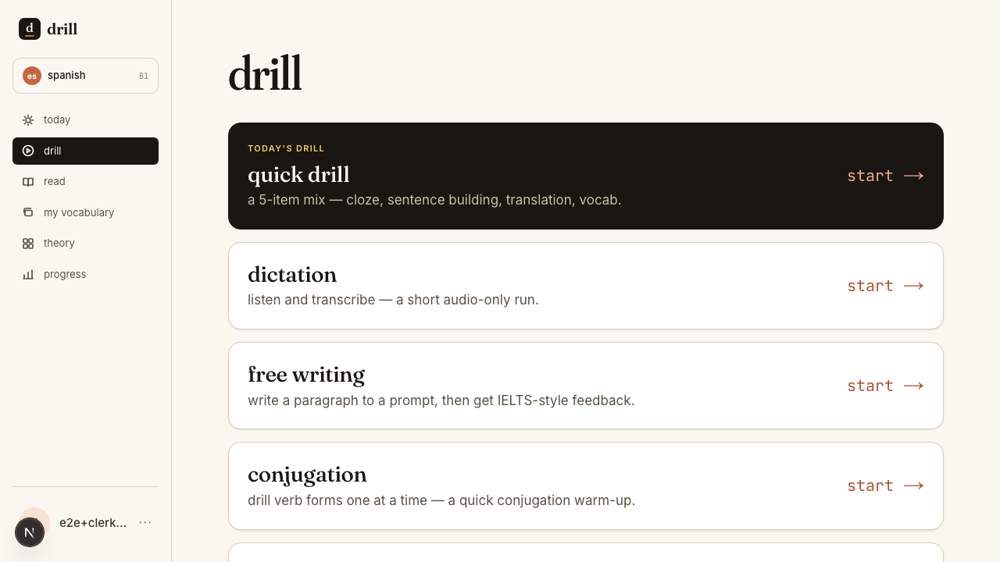
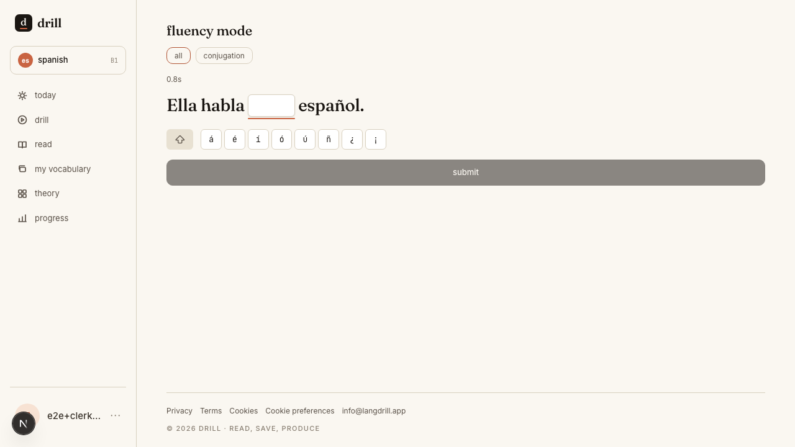
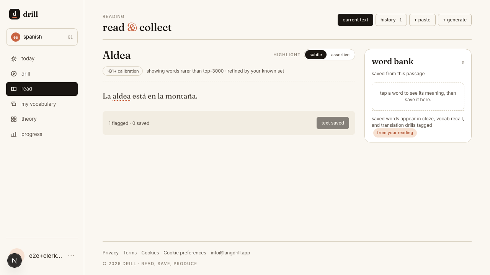

# Language Drill

**AI-powered production practice for the intermediate-language plateau — _what you do between italki sessions._**

Language Drill is a serverless language-learning app for learners past A2 who've
outgrown Duolingo but can't yet speak fluently. Instead of multiple-choice
recognition, it forces **written production** and grades free-form answers with
Claude against a psychometric, CEFR-anchored mastery model. Exercises are
**pre-generated offline into a shared pool** by a background AI pipeline — so
per-user cost stays low while quality stays high.

Built solo as a portfolio project, but architected to scale to real users without
a rewrite. Currently supports English, Spanish, Turkish, and German at varying
levels.

🔗 **Live:** [langdrill.app](https://langdrill.app) · 📐 **Design & decisions:** [`CLAUDE.md`](./CLAUDE.md) · 🗺️ **Code tour:** [`docs/codebase-tour.md`](./docs/codebase-tour.md)



---

## Why it's built this way

The interesting problems here aren't the CRUD — they're **operating a
non-deterministic AI system as a product**: keeping generated content correct,
diverse, and cheap, and turning "the LLM said so" into a trustworthy progress
signal. A few of the stories the codebase and `docs/` tell:

- **An AI content factory with honest unit economics.** Content is pre-generated
  into a reusable pool (~$170 one-time seed, ~$40/qtr steady state) rather than
  per-user, using prompt caching (~80% input savings) and the Anthropic Batch API
  (50% off). Cost is a first-class product parameter, dollar-capped at every
  batch. → [`docs/exercise-generation-plan.md`](./docs/exercise-generation-plan.md)

- **A rejection rate that was lying.** A 70% generation-reject rate turned out to
  be two unrelated failures collapsed into one bucket — duplicate collisions vs.
  genuine quality failures. Adding a `rejection_reason_counts` field made the
  invisible visible, and revealed a *format* bug (partial-word cloze blanks break
  on Turkish consonant mutation), not a prompt bug.
  → [`docs/exercise-generation-quality-findings.md`](./docs/exercise-generation-quality-findings.md)

- **Distributional quality the QC stations couldn't see.** An audit found the
  generator had silently collapsed each grammar point onto its easiest surface
  form (Turkish tenses 100% third-person singular) — overstating mastery credit.
  Diversity is a property of a *set*, invisible to a generator or validator that
  only sees one draft; the fix was a measurement-first coverage controller.
  → [`docs/pool-diversity-audit.md`](./docs/pool-diversity-audit.md) ·
  [`docs/pool-coverage-controller.md`](./docs/pool-coverage-controller.md)

- **Two eval gates for two AI surfaces.** `pnpm eval` gates the answer-**evaluation**
  prompt; `pnpm eval:gen` gates the **generation** prompt. The metric that matters
  is `signFlips` — items where a prompt change flips the routing decision across
  the 0.5 boundary — which average-quality scores hide entirely.
  → [`docs/llm-observability.md`](./docs/llm-observability.md)

- **Human-in-the-loop at scale.** All 40 Turkish A1/A2 grammar points were audited
  against an authoritative reference grammar via a 36-agent fan-out — one agent per
  point — with every proposal editor-vetted. The value was in the *rejection list*.

- **A progress model borrowed from psychometrics.** CEFR is modelled as a
  probability distribution with confidence ("65% B1 ± half a level, based on 47
  exercises"), updated Bayesian-style — harder items give stronger signal,
  recency-weighted, with Ebbinghaus decay. Exam readiness (DELE/IELTS/Goethe/YDS)
  is *derived*, never targeted. Deliberately **no streaks, no XP, no gamification.**
  → [`docs/progress-tracking.md`](./docs/progress-tracking.md)

More writeups — including honest self-critique of the product's gaps — are indexed
in [`docs/`](./docs).

| Live production exercise | Read & collect vocabulary |
| --- | --- |
|  |  |

---

## Architecture

Three runtimes share one Postgres database (Neon) and one AI library
(`packages/ai`). Expensive AI work is pre-generated offline into a shared pool;
per-user AI work (evaluating an answer, annotating reading) happens at request
time and is metered per user per day.

```
┌─────────────────┐   Clerk JWT    ┌──────────────────────────────┐
│  Next.js web    │ ─────────────► │  Main API Lambda (Hono)      │
│  (Vercel)       │                │  behind API Gateway          │──┐
│  apps/web       │   SSE stream   ├──────────────────────────────┤  │
│                 │ ─────────────► │  Annotate-stream Lambda      │  │
└─────────────────┘  Function URL  │  (own JWT check, streams)    │  │
                                   └──────────────────────────────┘  │
                                                                     ▼
┌──────────────────────────────────────────────┐            ┌─────────────┐
│  Background generation (no user in the loop) │            │  Neon       │
│  EventBridge cron → scheduler Lambda → SQS   │ ─────────► │  Postgres   │
│  → generation Lambda (Claude generates +     │            │  (Drizzle)  │
│    validates exercises into the pool)        │            └─────────────┘
└──────────────────────────────────────────────┘
        all three runtimes call Claude via packages/ai
        (prompts live in Langfuse; repo holds fallbacks)
```

### Tech stack

| Layer | Choice |
| --- | --- |
| Web frontend | Next.js (App Router) + TypeScript, on Vercel |
| Backend API | AWS Lambda + API Gateway v2, [Hono](https://hono.dev) |
| Infrastructure | AWS CDK (TypeScript) — no console click-ops |
| Database | Neon (serverless Postgres) + Drizzle ORM |
| Auth | Clerk (passwordless + Google OAuth) |
| LLM | Anthropic Claude, with prompt caching + Batch API |
| Prompt ops | Langfuse (prompt registry, tracing, evals) |
| TTS / STT | AWS Polly / Transcribe |
| Cache / rate limiting | Upstash Redis |
| Monorepo | pnpm workspaces + Turborepo |

Full rationale for each choice: [`docs/tech.md`](./docs/tech.md).

### Repo layout

```
apps/web            — Next.js (App Router) frontend
apps/mobile         — Expo / React Native (later)
packages/shared     — Cross-package types and enums
packages/db         — Drizzle schema, migrations, seed scripts
packages/ai         — Claude client, prompt templates, evaluation engine
packages/api-client — Zod schemas + React Query hooks shared by web/mobile
infra/lambda        — Hono API (AWS Lambda) + background generation + local dev server
infra/              — AWS CDK stack
```

---

## Running locally

**Prerequisites:** Node.js 22+, pnpm 9+, and a `.env` at the repo root (copy
[`.env.example`](./.env.example)) with at least:

- `DATABASE_URL` — Neon Postgres connection string
- `ANTHROPIC_API_KEY` — for answer evaluation
- `NEXT_PUBLIC_CLERK_PUBLISHABLE_KEY`, `CLERK_SECRET_KEY` — used by the web app
  (not required by the local API)

**First-time setup:**

```bash
pnpm install
pnpm db:migrate            # create tables in your Neon database
pnpm db:seed:exercises     # seed the exercise pool (36 idempotent exercises)
pnpm dev                   # API :3001 + streaming Lambda :3002 + web :3000
```

| Command | What it does |
| --- | --- |
| `pnpm dev` | API + streaming-annotate Lambda + web, colored output |
| `pnpm dev:api` | Local Lambda API only, loads `.env` automatically |
| `pnpm dev:web` | Next.js only, points `NEXT_PUBLIC_API_URL` at `localhost:3001` |
| `pnpm db:migrate` | Run Drizzle migrations |
| `pnpm db:studio` | Browse the DB in Drizzle Studio |

**Local dev conventions:**

- **Auth is bypassed locally.** The API dev server (`infra/lambda/src/dev.ts`)
  skips the Clerk JWT check and treats every request as `dev_user_001`
  (auto-created on startup; override with `DEV_USER_ID`).
- **Web points at the local API automatically.** `pnpm dev:web` sets
  `NEXT_PUBLIC_API_URL=http://localhost:3001`, overriding `apps/web/.env`.
- **Answer submission calls Claude for real.** Set `ANTHROPIC_API_KEY` or
  `POST /exercises/:id/submit` returns 502. Browsing exercises works without it.

### Checks

```bash
pnpm lint        # ESLint across all packages
pnpm typecheck   # tsc --noEmit across all packages
pnpm test        # Vitest across all packages
```

---

## Documentation

The `docs/` tree is a deliberate part of the portfolio — design docs, runbooks,
experiments, and honest audits of the product's own gaps. Good entry points:

- [`docs/codebase-tour.md`](./docs/codebase-tour.md) — a guided map of the code
- [`docs/progress-tracking.md`](./docs/progress-tracking.md) — the mastery model
- [`docs/product.md`](./docs/product.md) — positioning and competitive landscape
- [`docs/llm-observability.md`](./docs/llm-observability.md) — the AI quality flywheel
- [`CLAUDE.md`](./CLAUDE.md) — the operational reference (also the AI-agent guide)

---

## License

[MIT](./LICENSE) © Ivan Nikola
