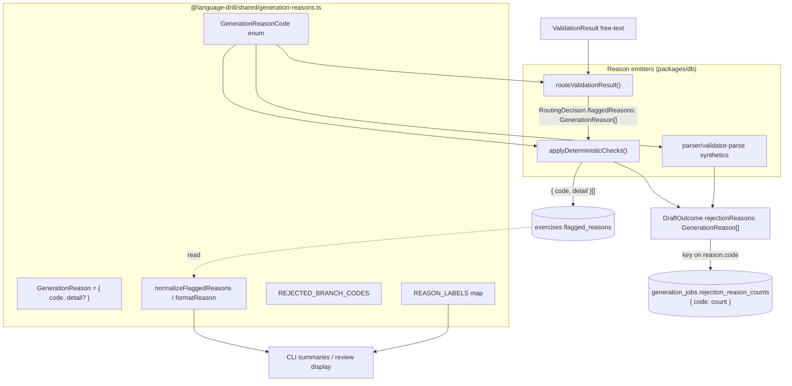

# Design Document

## Overview

The generation pipeline records *why* a draft was rejected or flagged as flat
`string[]` arrays that mix three incompatible string kinds (canonical tags,
free-form model prose, value-interpolated deterministic strings). Because
`run-one-cell.ts` uses each string directly as a frequency-map key, the
`generation_jobs.rejection_reason_counts` analytics column has unbounded
cardinality and is unusable for `GROUP BY reason`.

This design introduces a **canonical reason-code enum** in `@language-drill/shared`
and threads reasons through the post-LLM routing layer as structured
`{ code, detail? }` objects (`GenerationReason`). The enum-constrained `code`
becomes the analytics key (bounded cardinality); the free-form `detail` carries
the prose / interpolated values for human review. Both affected DB columns are
already `jsonb`, so **no schema migration is required** — the change is purely
in the TypeScript shape written to and read from those columns.

The change is internal to the generation pipeline. No user-facing behavior, API
response, or web UI changes (`flagged_reasons` / `rejection_reason_counts` are
admin/operator-only and not exposed in any `packages/api-client` schema).

**Scope boundary.** This spec covers the **exercise**-generation pipeline only —
the files named in the tech-debt item. The parallel **theory**-generation
pipeline (`packages/db/src/theory-generation/routing.ts`, its `run-one-cell.ts`,
and the `theory.flagged_reasons` column) has its own string-based reasons and is
**out of scope** here; the "single source of truth" claims below mean *for the
exercise pipeline*. Migrating theory-generation onto the same enum is a sensible
follow-up but is intentionally not attempted in this change. The new
`GenerationReason` types are placed in `@language-drill/shared` so that
follow-up can reuse them without a second move.

## Steering Document Alignment

### Technical Standards (tech.md)

- **Shared types live in `packages/shared`** (tech.md §4 Monorepo Structure:
  "Common types, utils, constants"). The new `GenerationReasonCode` enum and
  `GenerationReason` type belong there because three different packages
  (`packages/db` generation orchestration, the revalidation CLI, and future
  dashboard code) need them. This mirrors how `Language`, `CefrLevel`,
  `ExerciseType`, and `ExerciseContent` already live in shared.
- **Single source of truth for routing** (tech.md §7 pre-generated content as
  the cost-control backbone): the canonical enum makes the reason vocabulary a
  documented, testable contract, restoring the migration-`0012` analytics signal
  that gates the planned validator→generator repair loop.
- **No new Claude calls / DB round-trips** — the reshape is pure plumbing on the
  already-executed post-LLM path, consistent with the cost-controlled posture.

### Project Structure (structure.md)

- New file: `packages/shared/src/generation-reasons.ts`, re-exported from
  `packages/shared/src/index.ts` following the existing
  `export * from "./<module>"` convention (extensionless, matching every other
  re-export in that barrel — we deliberately keep the existing convention rather
  than introduce `.js` extensions, which is a separate tracked tech-debt item).
- Edits stay within the already-listed scope files; tests live alongside their
  modules (`*.test.ts` siblings), per the repo's co-located test convention
  (CLAUDE.md Testing: "Add tests to the existing test file for that module").

## Code Reuse Analysis

### Existing Components to Leverage

- **`routeValidationResult()` (`routing.ts:72`)**: the single place LLM verdicts
  become reasons. We change its `flaggedReasons` element type from `string` to
  `GenerationReason`; the branch structure and ordering logic are untouched.
- **`applyDeterministicChecks()` (`deterministic-checks.ts:39`)**: already the
  single precedence point for deterministic verdicts. We move the interpolated
  values from the string body into `detail`.
- **`DraftOutcome.rejectionReasons` (`validate-and-insert.ts:161`)**: already the
  channel carrying rejected-ordinal reasons up to `runOneCell`. Type changes
  `string[]` → `GenerationReason[]`.
- **`run-one-cell.ts:553` fold loop**: already iterates reasons into the
  frequency map. We change the key expression from `reason` to `reason.code`.
- **`exercises.flagged_reasons` / `generation_jobs.rejection_reason_counts`**:
  both already `jsonb` (`schema/exercises.ts:29`, `schema/generation.ts:59`).
  No migration; only the `$type<>` annotations and the values written change.
- **`decideDemotion()` / `applyDemotion()` (`revalidate-cloze-pool.ts:323,398`)**:
  already re-route through `routeValidationResult` + `applyDeterministicChecks`,
  so they inherit the new `GenerationReason[]` shape automatically; the write at
  `:408` persists the new shape with no extra logic.

### Integration Points

- **`@language-drill/shared` barrel**: new exports consumed by `packages/db`
  (generation + revalidation CLI). All three consumers already depend on shared,
  so no new package edge is introduced.
- **DB jsonb columns**: write the new shape; reads go through a back-compat
  normalizer so pre-migration `string[]` rows never throw.
- **CloudWatch structured log (`infra/lambda/src/generation/log.ts:53`)**: emits
  `rejectionReasonCounts` verbatim — now code-keyed, so log lines and the admin
  approval-rate query are unaffected (the admin query reads count columns, not
  this map).

## Architecture

The reason vocabulary is centralized in shared; every emitter references it; the
frequency map keys on `code`; the per-exercise column keeps `{ code, detail }`.



## Components and Interfaces

### Component 1 — `generation-reasons.ts` (new, `packages/shared/src/`)

- **Purpose:** Canonical reason vocabulary + structured reason type + display/
  back-compat helpers. Single source of truth (Req 1).
- **Interfaces:**
  - `GenerationReasonCode` — a TypeScript `enum` (matching the existing
    `Language` / `CefrLevel` / `ExerciseType` taxonomy convention in
    `shared/src/index.ts`), members:
    - Reject-branch: `LowQualityReject` `'low-quality-reject'`,
      `ContextSpoilsAnswer` `'context-spoils-answer'`,
      `CulturalIssue` `'cultural-issue'`,
      `VowelHarmonyAllomorph` `'vowel-harmony-allomorph'` (deterministic reject),
      `ParserFailure` `'parser-failure'`,
      `ValidatorParseFailure` `'validator-parse-failure'`.
    - Flag-branch: `LowQualityFlag` `'low-quality-flag'`, `Ambiguous`
      `'ambiguous'`, `LevelMismatch` `'level-mismatch'`,
      `GrammarPointMismatch` `'grammar-point-mismatch'`,
      `MalformedSurfaceForm` `'malformed-surface-form'` (deterministic flag),
      `ValidatorNote` `'validator-note'`.
    - Read-only legacy bucket: `LegacyUncoded` `'legacy-uncoded'` — produced
      ONLY by `normalizeFlaggedReasons` when reading a pre-migration `string[]`
      row; never emitted by any routing path. Documented as non-writable.
  - `type GenerationReason = { code: GenerationReasonCode; detail?: string }` —
    `detail` omitted (not empty-string) when a code carries no prose/value.
  - `REASON_LABELS: Record<GenerationReasonCode, string>` — human label per code
    (Req 1.4 / NFR usability), e.g. `'low-quality-reject' → "Low quality score
    (<0.5)"`.
  - `REJECTED_BRANCH_CODES: readonly GenerationReasonCode[]` — the subset
    reachable when a draft terminates `rejected` (the only codes that can key
    `rejection_reason_counts`). Backs the Req 5.3 enumeration test.
  - `normalizeFlaggedReasons(raw: unknown): GenerationReason[]` — total function:
    accepts `GenerationReason[]` (pass-through), legacy `string[]` (wrap each as
    `{ code: LegacyUncoded, detail: str }`), `null`/`undefined`/malformed (→ `[]`).
    Never throws (Req 4.3).
  - `formatReason(r: GenerationReason): string` — `label` plus `": " + detail`
    when `detail` present. For display in CLI summaries.
- **Dependencies:** none (leaf module).
- **Reuses:** the TypeScript `enum` convention already used for `Language` /
  `CefrLevel` / `ExerciseType` in `shared/src/index.ts`; no new deps.

### Component 2 — `routing.ts` (`packages/db/src/generation/`)

- **Purpose:** Map `ValidationResult` → `RoutingDecision`, now with structured
  reasons (Req 2.1, 2.2).
- **Interfaces:** `RoutingDecision.flaggedReasons` changes `string[]` →
  `GenerationReason[]`. Field name retained to minimize churn across consumers
  and tests. Branch reasons become:
  - Reject: `{ code: LowQualityReject }`, `{ code: ContextSpoilsAnswer }`, then
    `culturalIssues.map(issue => ({ code: CulturalIssue, detail: issue }))`.
  - Flag: `{ code: LowQualityFlag }`, `{ code: Ambiguous }`,
    `{ code: LevelMismatch }`, `{ code: GrammarPointMismatch }`, then
    `flaggedReasons.map(r => ({ code: ValidatorNote, detail: r }))`.
- **Ordering:** identical push order preserved (Req 2.5).
- **Dependencies:** `@language-drill/ai` (`ValidationResult`),
  `@language-drill/shared` (new types).
- **Reuses:** existing threshold constants + branch structure unchanged.

### Component 3 — `deterministic-checks.ts` (`packages/db/src/generation/`)

- **Purpose:** Downgrade routing decision on deterministic Turkish verdicts, now
  putting interpolated values in `detail` (Req 2.3).
- **Interfaces:**
  - `wrong-harmony` → prepend
    `{ code: VowelHarmonyAllomorph, detail: \`expected ${expected}, got ${actual}\` }`.
  - `non-word-stem` → append
    `{ code: MalformedSurfaceForm, detail: verdict.reconstructed }`; same
    `auto-approved → flagged` downgrade.
- **Dependencies:** `@language-drill/ai` (`checkTurkishCloze`),
  `@language-drill/shared`.
- **Reuses:** existing precedence/downgrade logic unchanged.

### Component 4 — `validate-and-insert.ts` (`packages/db/src/generation/`)

- **Purpose:** Produce terminal outcomes and persist `flagged_reasons`
  (Req 2.4, 4.1).
- **Interfaces:**
  - `DraftOutcome.rejectionReasons`: `string[]` → `GenerationReason[]`.
  - Replace the exported string constants `PARSER_FAILURE_REASON` /
    `VALIDATOR_PARSE_FAILURE_REASON` with reason objects:
    `[{ code: ParserFailure }]` / `[{ code: ValidatorParseFailure }]` at the
    three synthetic rejected-branch returns (the `validatorParseFailedOutcome`
    return `~:195`, and the parser-failure-at-final returns `~:361`, `~:500`)
    and the genuine-veto return (`~:382`, which forwards
    `decision.flaggedReasons`).
  - Insert write (`:440`): persist `decision.flaggedReasons`
    (`GenerationReason[]`) directly when non-empty, else `null` (Req 4.2). The
    column is `jsonb`; values serialize as `{ code, detail? }[]`.
- **Dependencies:** `@language-drill/shared`.
- **Reuses:** outcome-builder structure unchanged; only reason payloads reshape.

### Component 5 — `run-one-cell.ts` (`packages/db/src/generation/`)

- **Purpose:** Fold rejected-ordinal reasons into the frequency map keyed on
  `code` (Req 3).
- **Interfaces:** fold loop (`:553`) becomes
  `for (const reason of outcome.rejectionReasons ?? []) { counts[reason.code] = (counts[reason.code] ?? 0) + 1; }`.
  Persistence (`:611`) and `null`-when-empty semantics unchanged (Req 3.3).
- **Dependencies:** `@language-drill/shared` (type only — keys are
  `GenerationReasonCode` strings).
- **Reuses:** existing accumulation/persistence path.

### Component 6 — Read-side back-compat (`revalidate-cloze-pool.ts`, display)

- **Purpose:** Tolerate legacy `string[]` rows and render reasons without loss
  (Req 4.3).
- **Interfaces:**
  - `DemotionAction.demote.reasons`: `string[]` → `GenerationReason[]`;
    `applyDemotion` (`:408`) writes the new shape unchanged.
  - Summary printers (`revalidate-cloze-pool.ts:452`,
    `generate-exercises.ts:229`) render via `formatReason` /
    `normalizeFlaggedReasons` so both shapes display correctly.
- **Dependencies:** `@language-drill/shared` helpers.
- **Reuses:** existing summary scaffolding.

## Data Models

### GenerationReason (new — `@language-drill/shared`)

```
GenerationReasonCode: union of kebab-case string literals (see Component 1)
GenerationReason:
  - code:   GenerationReasonCode   // enum-constrained — the analytics key
  - detail?: string                // free-form prose / interpolated value; omitted when none
```

### RoutingDecision (changed — `packages/db/src/generation/routing.ts`)

```
RoutingDecision:
  - reviewStatus:   ReviewStatus            // unchanged
  - flaggedReasons: GenerationReason[]      // was string[]
```

### exercises.flagged_reasons (column — no migration)

```
jsonb, nullable
  - new writes:  GenerationReason[]  e.g. [{ code: "ambiguous" },
                                           { code: "cultural-issue", detail: "…prose…" }]
  - legacy rows: string[]            (read through normalizeFlaggedReasons → wrapped as legacy-uncoded)
  - $type annotation added (column is currently un-typed jsonb) as
    GenerationReason[]; readers MUST normalize for legacy rows.
```

### generation_jobs.rejection_reason_counts (column — no migration)

```
jsonb, nullable, $type<Record<string, number>>  (kept loose to read legacy rows)
  - new writes: keys ∈ REJECTED_BRANCH_CODES, e.g. { "low-quality-reject": 5,
                                                      "context-spoils-answer": 2 }
  - null when the cell rejected nothing (unchanged)
```

## Error Handling

### Error Scenarios

1. **Reading a pre-migration `string[]` `flagged_reasons` row.**
   - **Handling:** `normalizeFlaggedReasons` wraps each string as
     `{ code: LegacyUncoded, detail: str }`; never throws.
   - **User Impact:** Operator sees the original prose under a "legacy" label;
     no crash, no data loss.

2. **Validator emits empty/whitespace prose for `cultural-issue` /
   `validator-note`.**
   - **Handling:** the prose is still placed in `detail` verbatim (byte-equiv,
     Req 4.4). `detail` is only omitted when the source has no prose at all
     (the predicate-only codes). No trimming/normalization that could drop info.
   - **User Impact:** none — matches today's behavior of storing whatever the
     validator returned.

3. **Two reasons share a `code` on one rejected ordinal (e.g. two cultural
   issues).**
   - **Handling:** per-exercise `flagged_reasons` preserves both entries
     (duplicates retained, byte-equivalent to today). The frequency map sums:
     `cultural-issue += 2` (Req 3.4).
   - **User Impact:** reviewer sees both prose entries; analytics counts both.

4. **An unknown/future `code` appears in a stored row (e.g. code later
   renamed).**
   - **Handling:** `normalizeFlaggedReasons` keeps the object as-is (code is a
     string); `formatReason` falls back to the raw code when no label exists.
     No throw.
   - **User Impact:** raw code shown instead of a friendly label; degrades
     gracefully.

## Testing Strategy

### Unit Testing

- **`generation-reasons.test.ts` (new):** `normalizeFlaggedReasons` over
  `string[]`, `GenerationReason[]`, `null`, malformed input; `formatReason`
  with/without detail and unknown-code fallback; `REJECTED_BRANCH_CODES` ⊆
  enum; every code has a `REASON_LABELS` entry.
- **`routing.test.ts`:** update existing assertions to the `{ code, detail }`
  shape; pin each reject/flag branch → expected codes in documented order;
  assert `culturalIssues` prose lands in `detail` under `cultural-issue` and
  validator `flaggedReasons` under `validator-note`.
- **`deterministic-checks.test.ts`:** assert `vowel-harmony-allomorph` /
  `malformed-surface-form` codes with interpolated values in `detail` (never in
  the code), and prepend/append ordering + downgrade preserved.
- **`validate-and-insert.test.ts`:** synthetic outcomes carry `{ code:
  parser-failure }` / `{ code: validator-parse-failure }`; insert persists
  `{ code, detail }[]` to `flagged_reasons` and `null` when empty.
- **`run-one-cell.test.ts`:** (Req 5.1) assert every `rejection_reason_counts`
  key is a member of `GenerationReasonCode` (primary set-membership check) AND
  contains no colon or sentence-length string (secondary guard); dedup-given-up
  still contributes nothing; `null` when no rejections; same-code-different-
  detail collapses to one summed bucket (Req 3.4).
- **`revalidate-cloze-pool.test.ts`:** `decideDemotion` returns
  `GenerationReason[]` reasons; `applyDemotion` writes the new shape.

### Integration Testing

- **Aggregation contract (Req 5.2):** a test (or documented manual query)
  asserting `SELECT reason, SUM(...) FROM generation_jobs, LATERAL
  jsonb_each_text(rejection_reason_counts) GROUP BY reason` over post-fix rows
  returns only `REJECTED_BRANCH_CODES` members. Covered at the unit level by the
  enumeration test driving each reject path → its code; the SQL form is recorded
  in the spec as the operator verification.

### End-to-End Testing

- Not applicable — no user-facing surface changes; `flagged_reasons` /
  `rejection_reason_counts` are not exposed in any API response or web view
  (verified: absent from `packages/api-client` schemas). The pre-push gate
  (`pnpm lint && pnpm typecheck && pnpm test`) is the acceptance gate.

## Security

No new trust boundary is introduced. The change does not touch authentication,
authorization, request parsing, or any user-supplied input path. Validator prose
remains untrusted free text exactly as today — it now lands in a `detail` field
instead of a bare array element, with no change to how/where it is rendered
(admin/operator-only, never sent to end users). `normalizeFlaggedReasons` is a
total, throw-free function, so a malformed stored row cannot crash a reader.

## Migration / Compatibility Notes

- **No Drizzle migration.** Both columns are already `jsonb`; only the
  application-level shape and `$type<>` annotations change. Forward-only
  migration policy (tech.md §5) is respected trivially (no SQL).
- **No backfill.** Historical rows stay as written (tech-debt decision). Old
  `flagged_reasons` `string[]` rows are read through `normalizeFlaggedReasons`;
  old `rejection_reason_counts` rows keep their free-form keys and are simply
  not re-aggregated.
- **No forced prompt-version bump.** The validator tool schema/prompt
  (`validate.ts`, `validation-prompts.ts`) keep emitting free text;
  canonicalization happens in the consuming routing layer. `VALIDATION_PROMPT_VERSION`
  is therefore NOT bumped and no Langfuse re-sync is triggered by this change
  (CLAUDE.md prompt-editing rule only applies when a `*_SYSTEM_PROMPT` body is
  edited — it is not).
