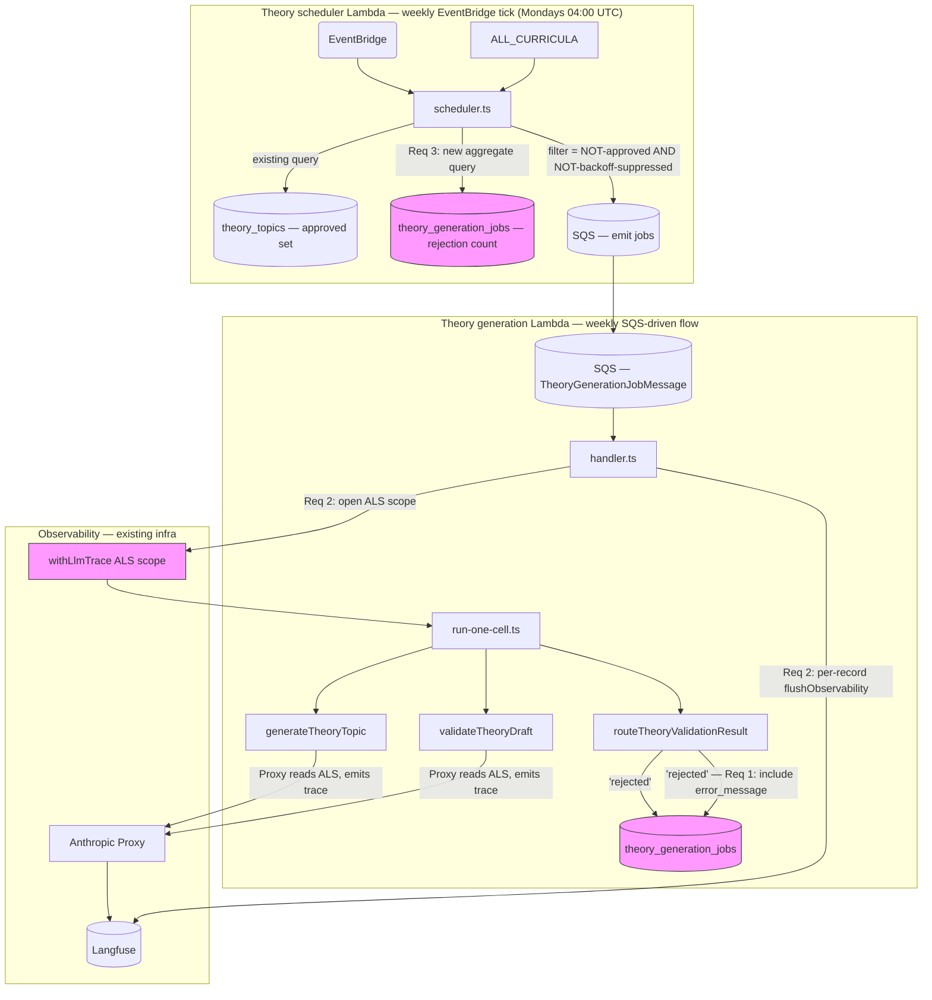

# Design Document

## Overview

Three orthogonal, low-coupling changes that close the observability and resilience gaps in the theory-generation pipeline surfaced by PR #176. The design is deliberately mechanical: each change has a one-to-one analog in the exercise-generation pipeline (which already ships with all three guarantees), so the implementation is "mirror what `packages/db/src/generation/` and `infra/lambda/src/generation/` already do." No new abstractions, no new modules — three small edits to existing files plus tests.

The change set covers three slices:

- **Audit-trail completeness (Req 1)** — `theory_generation_jobs.error_message` carries the rejection rationale.
- **Langfuse instrumentation (Req 2)** — the theory handler opens an ALS scope before dispatching `runOneTheoryCell` so the existing Anthropic Proxy emits traces for both `generate-theory` and `validate-theory` Claude calls.
- **Scheduler backoff (Req 3)** — `enqueueMissingTheoryCells` adds a second exclusion filter keyed on recent rejection density, with structured per-cell logging.

## Steering Document Alignment

### Technical Standards (tech.md)

- **Observability layer is centralized.** `packages/ai/src/observability.ts` is the only integration point with Langfuse; the design adds no new Langfuse SDK calls — it just opens an ALS frame so the existing Proxy can read it. Matches `tech.md` §"AI-heavy" cost-control posture.
- **Audit rows are source-of-truth for terminal verdicts.** `theory_generation_jobs.error_message` is already on the schema (`packages/db/src/schema/theory.ts:121`) and already populated for the `'failed'` (parser-throw) branch via `failClosed`. Req 1 just extends usage to the `'rejected'` branch — no schema changes.
- **In-code constants over env vars** (per the scope decision). Threshold tuning is a code edit + redeploy, same as `SLOW_QUERY_WARNING_MS` already in `scheduler.ts:52`.

### Project Structure (structure.md)

There's no `.claude/steering/structure.md` in this repo (verified — directory contains only `product.md` and `tech.md`). The implicit conventions encoded in the existing pipeline are:

- Per-Lambda handler files live at `infra/lambda/src/{surface}/handler.ts`.
- Per-Lambda orchestration logic lives at `packages/db/src/{surface}/run-one-cell.ts`.
- Schedulers live at `infra/lambda/src/{surface}/scheduler.ts`.
- Tests are co-located (`*.test.ts` next to the source file).

The design follows these conventions strictly — no new directories, no new packages.

## Code Reuse Analysis

This spec is almost entirely about extending existing code paths to cover the theory surface that was previously skipped. The exercise-generation surface is the reference implementation.

### Existing Components to Leverage

- **`withLlmTrace` / `flushObservability`** (`packages/ai/src/observability.ts:160-168, 902-920`) — the ALS-scope opener and per-record drain. Both are already imported by the exercise handler at `infra/lambda/src/generation/handler.ts:33-35`. Theory handler imports both, opens the scope around `runOneTheoryCell`, drains in the per-record `finally`.
- **`TOOL_NAME_TO_FEATURE` map** (`observability.ts:130-139`) — already maps `submit_theory_topic` → `generate-theory` and `submit_theory_validation_result` → `validate-theory`. The Proxy at `observability.ts:771-786` reads the outgoing `tools[0].name` and uses this map to disambiguate the per-call feature tag. **No change needed** to the map; the wiring just needs to actually invoke it.
- **`THEORY_GENERATION_PROMPT_VERSION`** (`packages/ai/src/theory-prompts.ts:50`) — already exported, already updated by PR #176 to `theory-generate@2026-05-23`. Becomes the `promptVersion` field on the ALS frame.
- **`run-one-cell.ts`'s `'rejected'` branch UPDATE statement** (`packages/db/src/theory-generation/run-one-cell.ts:301-313`) — add one column to its `.set({...})` payload. No structural change.
- **Drizzle aggregate query pattern** (`scheduler.ts:97-105`) — the existing approval-set query is exactly the shape the rejection-count query mirrors. Same `db.select().from(theoryGenerationJobs).where(...)` skeleton, different filter and projection.
- **Existing `theory_generation_jobs_cell_idx`** (`packages/db/src/schema/theory.ts:124-127`) — composite index on `(cell_key, started_at DESC)` is exactly what the rejection-count query needs. **No DDL change.**
- **`SLOW_QUERY_WARNING_MS`** (`scheduler.ts:52`) — the existing 30-second threshold reused for the new query's slow-path log. No new constant.
- **Structured `log({...})` helper** (`scheduler.ts` module-local) — the convention for CloudWatch JSON lines. Backoff-exclusion log uses the same shape.

### Integration Points

- **`infra/lambda/src/theory-generation/handler.ts`** — handler entrypoint. The single `runOneTheoryCell(...)` call (somewhere around line 175-220 — to be confirmed during implementation) gets wrapped in `withLlmTrace(...)`. The per-record `finally` adds `flushObservability()`.
- **`packages/db/src/theory-generation/run-one-cell.ts`** — orchestration. The `'rejected'` branch's UPDATE statement adds one column. Tests in `run-one-cell.test.ts` add two assertions.
- **`infra/lambda/src/theory-generation/scheduler.ts`** — enqueue loop. One additional Drizzle query before the existing approval-set query (or piggybacked alongside it via `Promise.all`), one new constants block, one new exclusion filter, one new log line. Tests in `scheduler.test.ts` add five cases.
- **`packages/db/src/schema/theory.ts`** — **no change**. All three requirements operate within the existing schema.

## Architecture

The design has three independent slices. They share no runtime state, can be implemented and merged in any order, and only need to ship together for the rollout-verification check (Req 2 rollout note) to be meaningful.



Pink nodes mark the touched surfaces. Everything else is unchanged.

## Components and Interfaces

### Component 1 — Audit-row UPDATE in `run-one-cell.ts`'s `'rejected'` branch

- **Purpose:** Persist `decision.flaggedReasons` to `theory_generation_jobs.error_message` so the rejection rationale is readable from the DB without rerunning a probe.
- **Interfaces:** No new public API. The existing `runOneTheoryCell(args)` function's behavior changes only in the `'rejected'` branch — the function signature, the return shape (`TheoryCellResult`), and the call sites are unchanged.
- **Dependencies:** Drizzle ORM (already imported), `theoryGenerationJobs` schema (already imported), `eq` operator (already imported), `decision.flaggedReasons` (already in scope from `routeTheoryValidationResult(validationResult)` earlier in the function).
- **Reuses:** The exact `.update(theoryGenerationJobs).set({...}).where(eq(theoryGenerationJobs.id, jobId))` UPDATE pattern already used three times in this file (`'rejected'`, `'flagged'`, `'auto-approved'` branches, plus `failClosed`).
- **Implementation sketch:**

  ```ts
  // packages/db/src/theory-generation/run-one-cell.ts, line ~301
  case 'rejected': {
    // Reuse the existing module-local ERROR_MESSAGE_MAX_LENGTH constant
    // (defined at line 65, applied by failClosed at line 484). flaggedReasons
    // can include a `'low quality score (<0.5)'` prefix plus raw validator
    // strings — long compound messages must be truncated, not silently
    // overflow Postgres' text column or get clipped at read time.
    const rawMessage =
      decision.flaggedReasons.length > 0
        ? decision.flaggedReasons.join('; ')
        : 'rejected (no reasons reported)';
    const errorMessage = rawMessage.slice(0, ERROR_MESSAGE_MAX_LENGTH);
    await db
      .update(theoryGenerationJobs)
      .set({
        status: 'succeeded',
        finishedAt: new Date(),
        approved: false,
        flagged: false,
        rejected: true,
        errorMessage,                       // ← new
        inputTokensUsed,
        outputTokensUsed: tokenUsage.outputTokens,
        costUsdEstimate: costUsd.toFixed(4),
      })
      .where(eq(theoryGenerationJobs.id, jobId));
    return { ... };  // unchanged
  }
  ```

- **Pre-existing `errorMessage` writes preserved as-is:**
  - `failClosed` (line 484) — terminal-failure path, already truncates via `ERROR_MESSAGE_MAX_LENGTH`. Unchanged.
  - `'auto-approved'` dedup-skip path (line 400) — writes `'cell already filled (partial index collision)'` when the partial unique index rejects the INSERT. Unrelated to this spec; unchanged. The test list below qualifies this.

### Component 2 — `withLlmTrace` scope around `runOneTheoryCell` in `theory-generation/handler.ts`

- **Purpose:** Open the ALS frame that the existing Anthropic Proxy reads at the start of every `messages.create` call. Once the frame is open, both the `generate` and `validate` Claude calls inside `runOneTheoryCell` get Langfuse traces tagged with the cell-level metadata.
- **Interfaces:** No new public API. The handler entrypoint signature (`handler(event, context)`) is unchanged.
- **Dependencies:** `withLlmTrace`, `flushObservability` from `@language-drill/ai` (already exported, used by the exercise handler).
- **Reuses:** The exact ALS-context shape from `infra/lambda/src/generation/handler.ts:222-249`. The only field differences are `feature: 'generate-theory'` instead of `'generate'`, and `exerciseType: 'theory'` (per the `LlmTraceContext.exerciseType` union which already accepts `'theory'` literally — see `observability.ts:69`).
- **Implementation sketch:**

  ```ts
  // infra/lambda/src/theory-generation/handler.ts — inside the per-record try
  try {
    result = await withLlmTrace(
      {
        feature: 'generate-theory',
        env: (process.env.LANGFUSE_ENV ?? 'dev') as 'prod' | 'dev',
        promptVersion: THEORY_GENERATION_PROMPT_VERSION,
        requestId: record.messageId,
        jobId: parsed.jobId,
        cellKey: cell.cellKey,
        language: parsed.spec.language,
        cefrLevel: parsed.spec.cefrLevel,
        exerciseType: 'theory',
      },
      () => runOneTheoryCell({ db, client, cell, ... }),
    );
  } catch (err) {
    // existing error path — unchanged
  } finally {
    clearTimeout(timer);
    await flushObservability();  // ← new
  }
  ```

  The `THEORY_GENERATION_PROMPT_VERSION` import comes from `@language-drill/ai`.

- **Why no separate scope for the validate call:** the Anthropic Proxy uses `resolveFeature(request, ctx)` to pick the feature tag per call by inspecting `request.tools[0].name`. `submit_theory_validation_result` is already mapped to `'validate-theory'` in `TOOL_NAME_TO_FEATURE`. So one outer ALS scope produces both `generate-theory` and `validate-theory` traces automatically.

### Component 3 — CDK: wire Langfuse secrets into the theory generation Lambda

- **Purpose:** Component 2's ALS-scope wiring is a no-op at runtime unless the theory Lambda has `LANGFUSE_PUBLIC_KEY` / `LANGFUSE_SECRET_KEY` / `LANGFUSE_ENV` in its environment — `getLangfuse()` returns null when those are unset (`observability.ts:269-277`) and the Proxy silently passes through without emitting traces. The theory Lambda construct at `infra/lib/constructs/theory-generation-lambda.ts` currently wires only `ENV_NAME`, `DATABASE_URL`, `ANTHROPIC_API_KEY` (lines 99-108). The exercise generation Lambda construct at `infra/lib/constructs/generation-lambda.ts` already imports both Langfuse secrets, grants read, and populates the env vars (lines 60-65, 105-115) — this Component is a literal copy of that pattern.
- **Interfaces:** No new public CDK construct surface. `TheoryGenerationLambdaProps` keeps the same shape (it already inherits the `secretsPrefix` and `envName` it needs from the parent stack).
- **Dependencies:** `aws-cdk-lib/aws-secretsmanager`'s `Secret.fromSecretNameV2` (already imported in `theory-generation-lambda.ts` for the other secrets), the existing `language-drill/LANGFUSE_PUBLIC_KEY` and `language-drill/LANGFUSE_SECRET_KEY` Secrets Manager entries in both dev and prod (documented in CLAUDE.md §Required secrets — already in place because the exercise Lambda has been using them since Phase 1 Langfuse shipped).
- **Reuses:** The full secret-import + grant-read + env-wire pattern from `infra/lib/constructs/generation-lambda.ts`.
- **Implementation sketch:**

  ```ts
  // infra/lib/constructs/theory-generation-lambda.ts

  const langfusePublicKey = secretsmanager.Secret.fromSecretNameV2(
    this, 'TheoryLangfusePublicKey',
    `${props.secretsPrefix}/LANGFUSE_PUBLIC_KEY`,
  );
  const langfuseSecretKey = secretsmanager.Secret.fromSecretNameV2(
    this, 'TheoryLangfuseSecretKey',
    `${props.secretsPrefix}/LANGFUSE_SECRET_KEY`,
  );

  this.handler = new lambda.Function(this, 'Handler', {
    // ... existing config ...
    environment: {
      ENV_NAME: props.envName,
      DATABASE_URL: databaseUrl.secretValue.unsafeUnwrap(),
      ANTHROPIC_API_KEY: anthropicApiKey.secretValue.unsafeUnwrap(),
      LANGFUSE_PUBLIC_KEY: langfusePublicKey.secretValue.unsafeUnwrap(),
      LANGFUSE_SECRET_KEY: langfuseSecretKey.secretValue.unsafeUnwrap(),
      LANGFUSE_ENV: props.envName === 'production' ? 'prod' : 'dev',
    },
  });

  databaseUrl.grantRead(this.handler);
  anthropicApiKey.grantRead(this.handler);
  langfusePublicKey.grantRead(this.handler);  // ← new
  langfuseSecretKey.grantRead(this.handler);  // ← new
  ```

  The `LANGFUSE_ENV` env-var conversion `'production' → 'prod'` matches the exercise-side `generation-lambda.ts:115` convention so dashboards filter both surfaces uniformly.

### Component 4 — Rejection-count filter in `enqueueMissingTheoryCells`

- **Purpose:** Stop the scheduler from re-enqueueing a cell that has accumulated `THEORY_REJECTION_BACKOFF_THRESHOLD` (3) rejections in the last `THEORY_REJECTION_BACKOFF_WINDOW_DAYS` (14) days, so a deterministically-failing cell becomes a bounded one-time cost rather than a recurring weekly annuity.
- **Interfaces:** No new public API. `enqueueMissingTheoryCells(db, queueUrl, today)` keeps the same signature.
- **Dependencies:** Drizzle ORM (already imported), `theoryGenerationJobs` schema (needs to be imported alongside the existing `theoryTopics` import), `and`/`eq`/`gte`/`sql` operators from drizzle-orm.
- **Reuses:** Same query-shape pattern as the existing approval-set query; same `SLOW_QUERY_WARNING_MS` slow-path log; same structured `log({...})` helper for the per-exclusion warning.
- **Two key-spaces, both correct:** The existing approved-set is keyed by `${language}|${grammarPointKey}` (no CEFR level — see `scheduler.ts:118-120, 134`) because a `theory_topics` row's uniqueness is `(language, grammarPointKey)`. The new suppression-set is keyed by `cellKey` (which includes CEFR via `buildTheoryCellKey({language, cefrLevel, grammarPointKey})`) because `theory_generation_jobs.cell_key` already embeds CEFR — and an A1 cell's rejections shouldn't suppress its B1 sibling. **Do not "harmonize" these two key shapes** — they look similar but represent different facts.
- **Implementation sketch:**

  ```ts
  // infra/lambda/src/theory-generation/scheduler.ts

  const THEORY_REJECTION_BACKOFF_THRESHOLD = 3;
  const THEORY_REJECTION_BACKOFF_WINDOW_DAYS = 14;

  // Inside enqueueMissingTheoryCells, after the existing approval-set query:
  const windowStart = new Date(
    Date.now() - THEORY_REJECTION_BACKOFF_WINDOW_DAYS * 86_400_000,
  );

  const rejectionQueryStartedAt = Date.now();
  const rejectionCounts = await db
    .select({
      cellKey: theoryGenerationJobs.cellKey,
      count: sql<number>`COUNT(*)::int`,
    })
    .from(theoryGenerationJobs)
    .where(
      and(
        eq(theoryGenerationJobs.rejected, true),
        gte(theoryGenerationJobs.startedAt, windowStart),
      ),
    )
    .groupBy(theoryGenerationJobs.cellKey);
  const rejectionQueryDurationMs = Date.now() - rejectionQueryStartedAt;

  if (rejectionQueryDurationMs > SLOW_QUERY_WARNING_MS) {
    log({
      level: 'warn',
      durationMs: rejectionQueryDurationMs,
      message: 'rejection-count query exceeded slow-query threshold',
    });
  }

  const suppressedCells = new Set<string>();
  for (const row of rejectionCounts) {
    if (row.count >= THEORY_REJECTION_BACKOFF_THRESHOLD) {
      suppressedCells.add(row.cellKey);
    }
  }

  // Existing diff loop, extended:
  for (const cell of allCells) {
    if (!(THEORY_ROUND_1_CEFR_LEVELS as readonly string[]).includes(cell.cefrLevel)) continue;
    const lookup = `${cell.language}|${cell.grammarPoint.key}`;
    if (approvedSet.has(lookup)) continue;
    if (suppressedCells.has(cell.cellKey)) {
      const recentRejections =
        rejectionCounts.find((r) => r.cellKey === cell.cellKey)?.count ?? 0;
      log({
        level: 'warn',
        cellKey: cell.cellKey,
        recentRejections,
        backoffWindowDays: THEORY_REJECTION_BACKOFF_WINDOW_DAYS,
        message: 'theory cell suppressed by rejection backoff',
      });
      continue;
    }
    undersized.push(cell);
  }
  ```

  The two queries (approval set, rejection count) can be parallelized with `Promise.all` if a future performance pass needs it; the initial implementation runs them sequentially to match the existing code shape.

## Data Models

No schema changes. All three requirements operate against existing columns:

```
theory_generation_jobs (unchanged)
- id: uuid (PK)
- cell_key: text             ← read by Req 3 aggregate query
- status: text
- trigger: text
- started_at: timestamptz    ← read by Req 3 window predicate
- finished_at: timestamptz
- input_tokens_used: int
- output_tokens_used: int
- cost_usd_estimate: numeric(10,4)
- approved: boolean
- flagged: boolean
- rejected: boolean          ← read by Req 3 aggregate query
- error_message: text        ← Req 1 starts writing this on rejected verdicts
  └─ indexed by theory_generation_jobs_cell_idx (cell_key, started_at DESC)
```

The composite index `theory_generation_jobs_cell_idx` is sufficient for the new query because the predicate `(rejected = true AND started_at >= $1)` followed by `GROUP BY cell_key` benefits from the existing column order. Verified via the Drizzle schema definition at `packages/db/src/schema/theory.ts:123-127`.

### In-code constants (new)

```
THEORY_REJECTION_BACKOFF_THRESHOLD: number = 3
THEORY_REJECTION_BACKOFF_WINDOW_DAYS: number = 14
```

Both live in `infra/lambda/src/theory-generation/scheduler.ts` next to the existing `SLOW_QUERY_WARNING_MS`. Exported only if a test file needs them.

## Error Handling

### Error Scenarios

1. **Langfuse outage during a theory cell-job (Req 2)**
   - **Handling:** `withLlmTrace` is a thin ALS wrapper; the Anthropic Proxy's per-trace `try/catch` in `observability.ts:582-585` already swallows Langfuse SDK errors and warns once. `flushObservability` has its own race-with-timeout (`observability.ts:902-920`).
   - **User Impact:** None. Cell generation completes; the trace for that cell may be missing from Langfuse but the audit row and `theory_topics` write are unaffected.

2. **`decision.flaggedReasons` is unexpectedly empty (Req 1)**
   - **Handling:** Component 1's fallback string `'rejected (no reasons reported)'` ensures the column is never NULL when `rejected=true`. A unit test pins this.
   - **User Impact:** Operator sees the sentinel string instead of a NULL; trips the eyes that "something else is wrong with the router."

3. **Rejection-count query exceeds `SLOW_QUERY_WARNING_MS` (Req 3)**
   - **Handling:** Structured warn log, same shape as the existing approval-set slow-path. Query continues to completion — no fallback or short-circuit (single point of failure for the daily sweep is intentional, mirrors current behavior).
   - **User Impact:** Operator sees the warning in CloudWatch; the daily sweep still produces a correct enqueue set.

4. **Backoff filter blacklists a cell that's only failing transiently (Req 3)**
   - **Handling:** The 14-day rolling window is self-healing — the oldest rejection ages out, the cell drops back below threshold, the next sweep re-enqueues it.
   - **User Impact:** A genuinely-transient cell gets a 14-day timeout, then auto-resumes. For deterministically-failing cells, an operator must (a) fix the prompt/validator, then (b) wait for the window to age out, or (c) manually delete one of the rejected `theory_generation_jobs` rows to force re-entry. (c) is undocumented but available; the runbook will pick this up if it becomes a frequent operation.

5. **Two concurrent scheduler invocations (Req 3 — defensive only)**
   - **Handling:** EventBridge is configured to fire the theory scheduler **weekly** (`cron(0 4 ? * MON *)` per `infra/lib/constructs/theory-scheduler-lambda.ts:99-110`); overlap is essentially impossible. If it happened, both invocations would compute the same backoff-suppression set against the same `theory_generation_jobs` snapshot — duplicate SQS messages would be idempotency-deduped at the consumer by the existing `checkTheoryAuditRowState` guard.
   - **User Impact:** None.
   - **Cadence note:** The weekly cadence (not daily, contra the bug-fix doc framing) means a stuck cell's actual cost trajectory before this spec was ~$0.085/week ≈ $4.4/year per stuck cell, not $0.085/day. Req 3 still bounds it correctly; the worst-case annuity number cited in `verification.md` was the per-attempt cost, not the deployed cadence cost.

## Testing Strategy

### Unit Testing

- **`packages/db/src/theory-generation/run-one-cell.test.ts`** — add four cases:
  - "persists `error_message` joined from `decision.flaggedReasons`" — assert the UPDATE call's `errorMessage` field equals `reasons.join('; ')`.
  - "writes the empty-reasons sentinel when `flaggedReasons` is `[]`" — assert the UPDATE call's `errorMessage` is `'rejected (no reasons reported)'`.
  - "truncates `error_message` to `ERROR_MESSAGE_MAX_LENGTH` when joined reasons exceed 1000 chars" — feed a `flaggedReasons` array whose `.join('; ')` is > 1000 chars, assert the persisted value is exactly 1000 chars.
  - "does NOT introduce new `errorMessage` writes on the `'flagged'` or `'auto-approved'`-INSERT branches" — assert the flagged-branch UPDATE has `errorMessage: undefined`, and the auto-approved-INSERT path has `errorMessage: undefined`. **Important:** the existing `'auto-approved'` dedup-skip sub-path (`run-one-cell.ts:400`) DOES write `'cell already filled (partial index collision)'`; that pre-existing test case stays green and is unrelated to this spec.

- **`infra/lambda/src/theory-generation/handler.test.ts`** — add one case:
  - "wraps `runOneTheoryCell` in `withLlmTrace` with the expected context shape" — mock `withLlmTrace` (or use `getCurrentLlmTraceContext` inside a stub `runOneTheoryCell`) and assert the frame carries `feature: 'generate-theory'`, `promptVersion: THEORY_GENERATION_PROMPT_VERSION`, `cellKey`, `language`, `cefrLevel`, `jobId`, `requestId`. The existing exercise-handler test at `infra/lambda/src/generation/handler.test.ts` has the same pattern to copy.
  - "calls `flushObservability` in the per-record finally" — assert via spy that the call happens once per SQS record.

- **`infra/lib/constructs/theory-generation-lambda.test.ts`** — add one case (Component 3 CDK delta):
  - "Lambda environment includes `LANGFUSE_PUBLIC_KEY`, `LANGFUSE_SECRET_KEY`, `LANGFUSE_ENV`" — mirror the assertion shape from `generation-lambda.test.ts:68-69` (which already pins this exact env-var presence for the exercise generation Lambda).

- **`infra/lambda/src/theory-generation/scheduler.test.ts`** — add five cases (Req 3 AC 8):
  - (a) cell with 0 rejections: passes filter.
  - (b) cell with 2 rejections in window: passes filter.
  - (c) cell with 3 rejections in window: excluded + warn log emitted.
  - (d) cell with 3 rejections but oldest is 15 days old (only 2 in window): passes filter.
  - (e) two excluded cells: warn log emitted exactly twice (one per cell), not once or three times.
  - Plus a spy-on-Drizzle assertion that the rejection-count query is invoked exactly once per sweep (Req 3 AC 5).

### Integration Testing

- **End-to-end audit-row + Langfuse trace path** is covered by the existing `run-one-cell.test.ts` + `handler.test.ts` test fixtures. No new integration test scaffolding needed — the unit tests above bring the theory surface up to parity with the exercise surface's existing coverage.

- **Backoff query against real Postgres** — the existing `scheduler.test.ts` uses a real Neon test branch (per `db:test:setup` flow). The new five cases run in the same harness; the cell-key index is real, so query plans match production. No mocking of DB at this layer.

### End-to-End Testing

- **Manual rollout smoke check (Req 2 Rollout Verification subsection):** after merge + deploy:
  1. **Precondition** — verify the Langfuse env vars are actually set on the deployed theory Lambda:
     ```bash
     aws lambda get-function-configuration \
       --function-name <stack>-TheoryGenerationLambda<id> \
       --query 'Environment.Variables.LANGFUSE_PUBLIC_KEY' \
       --output text
     ```
     Expect a non-empty value. An empty value means Component 3's CDK delta didn't ship; without it the trace check below will silently fail with no actionable signal.
  2. **Trigger** — wait for the Monday 04:00 UTC EventBridge tick OR manually invoke the scheduler via the existing CLI (`packages/db/scripts/generate-theory.ts`), then wait for the SQS jobs to drain.
  3. **Verify** — query production Langfuse for `name=generate-theory` AND `tags:env:prod` over the past 24 hours. Expect a non-zero count.

- **No automated E2E** — the theory pipeline is weekly-cron-driven and SQS-backed; CDK-deployment-driven E2E is out of scope for this spec. The unit + integration coverage above is the same shape and depth as what the exercise surface ships with.
