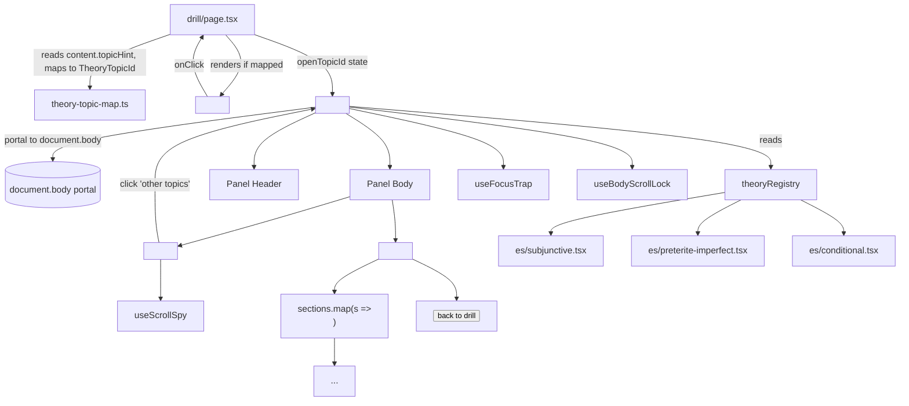

# Theory Panel — Design

## Overview

A client-only, slide-over reference panel that shows grammar theory inside the drill page. The panel is opened by a small `theory · {topic}` trigger pill on the drill page, displays a 240px scroll-spy TOC plus sectioned content, and is closed via `Esc`, backdrop click, the `×` button, or the sticky `back to drill →` CTA.

All content is shipped as TypeScript modules under `apps/web/content/theory/{language}/{topic-id}.tsx`, statically imported into a typed registry. There are no backend changes in v1: no DB, no API, no env vars, no new packages. Topic association on exercises is handled with an additive optional `topicHint?: string` field on `ExerciseContent`, populated in seed data, mapped client-side to a closed enum of theory topic IDs.

The design follows the prototype at `docs/design-archive/design_handoff_language_drill/prototypes/web/hifi/theory.jsx` and the spec at `docs/design-archive/design_handoff_language_drill/SCREENS.md §5`, adapted to our stack (Next.js App Router client component, Tailwind v4 CSS-first theming, existing `apps/web/components/ui/*` library, no new deps). The mobile bottom-sheet variant is explicitly out of scope (web-only roadmap).

---

## Steering Document Alignment

### Technical Standards (`.claude/steering/tech.md`)
- **Frontend stack:** Next.js + Tailwind v4 + TanStack Query (no new state library — local React state is sufficient).
- **Forms / validation:** N/A — this feature reads no user input beyond keyboard events.
- **No new dependencies:** scroll-spy is a hand-rolled `IntersectionObserver`; the slide-over uses `createPortal` from React DOM (no `@radix-ui/react-dialog` etc.). Focus trap is implemented with a tiny in-tree helper (~30 LOC) rather than `focus-trap-react`.
- **Cost-controlled / serverless-first:** v1 has zero serverless and AI cost — content is build-time static.

### Project Structure (`CLAUDE.md` monorepo layout)
- All new code lives under `apps/web/`. `packages/shared` gets one additive optional field on existing types (`topicHint?: string`). `packages/api-client` is unchanged. No `packages/db`, `packages/ai`, or `infra/` changes.
- Tests sit alongside the modules they test, matching the existing pattern (`apps/web/components/theory/__tests__/`, `apps/web/lib/__tests__/`, `apps/web/content/theory/__tests__/`).

### Project guide (`CLAUDE.md`)
- **Pre-push checks:** every task's verification step ends with `pnpm lint && pnpm typecheck && pnpm test` from repo root.
- **Latest stable packages:** N/A — no new deps.
- **No streaks/XP/gamification:** the panel does not track "theory views" or unlock anything. Reading is a tool, not progress.

---

## Code Reuse Analysis

### Existing components and styles to leverage

- **Design tokens (`apps/web/app/globals.css`):** all colors, spacing, radii, shadows, type scale (`t-display-l`, `t-display-m`, `t-micro`, `t-small`, `t-mono`, `.hilite`) are reused as-is. Theory-specific styles (`.theory-overlay`, `.theory-panel`, `.theory-toc`, `.theory-section-title`, `.theory-table`, `.callout`, `.callout.warn`, `.example`, `.theory-list`) are *additions* to the same `globals.css` `@layer components`/utility section — no token changes.
- **`Button` (`apps/web/components/ui/button.tsx`):** used for the sticky `back to drill →` CTA (`primary` variant, `sm` size).
- **`Chip` (`apps/web/components/ui/chip.tsx`):** used for the CEFR band shown next to the topic title in the panel header.
- **`cn` helper (`apps/web/lib/cn.ts`):** standard class-name composition.
- **`ActiveLanguageProvider` (`apps/web/components/shell/active-language-provider.tsx`):** the panel reads the active learning language from the existing context, not a new one. Closing on language change (FR-8.6) is implemented by wrapping the panel state in a `useEffect` that watches the context value.
- **Test pattern (`apps/web/components/ui/__tests__/*.test.tsx`):** Vitest + React Testing Library, no `@testing-library/user-event` v14 chord — match the simpler `fireEvent` style used in existing tests.

### Reused concepts (not copied code)

- **Portal pattern:** matches the prototype's `ReactDOM.createPortal(..., document.body)`. We use `createPortal` from `react-dom`; no other portals exist in the app yet, so this is the first one. The pattern is simple enough that we don't introduce a shared `<Portal />` component yet.
- **`IntersectionObserver` scroll-spy:** copied conceptually from the prototype. Wrapped in a `useScrollSpy(sectionIds, scrollRef)` hook for testability.

### Integration points

- **Drill page (`apps/web/app/(dashboard)/drill/page.tsx`):** mounts the trigger pill and the panel; owns the `openTopicId: TheoryTopicId | null` state.
- **`ExerciseContent` types (`packages/shared/src/index.ts`):** extended with `topicHint?: string` on each variant (additive, optional — no migration needed).
- **No DB or API touchpoints in v1.** When tags ship later, the lookup function in `theory-topic-map.ts` swaps its input from `content.topicHint` to `exercise.tags`; the rest of the panel is unaffected.

---

## Architecture

### Module map

```
apps/web/
├── app/(dashboard)/drill/page.tsx            ← edited: mounts trigger + panel
│
├── components/theory/
│   ├── types.ts                              ← TheoryTopic, TheorySection, TheoryTopicId
│   ├── primitives.tsx                        ← <Callout>, <Example>, <Table>, <List>, <Hilite>, <Mono>
│   ├── theory-trigger.tsx                    ← the dashed-border pill on the drill page
│   ├── theory-panel.tsx                      ← the slide-over (portal, header, body, footer)
│   ├── theory-toc.tsx                        ← left-rail with scroll-spy + "other topics"
│   ├── theory-content.tsx                    ← right-side scroll area, sections + sticky CTA
│   ├── theory-empty.tsx                      ← empty/error state (FR-7, FR-Reliability)
│   ├── use-scroll-spy.ts                     ← IntersectionObserver hook
│   ├── use-focus-trap.ts                     ← tiny focus-trap hook (~30 LOC)
│   ├── use-body-scroll-lock.ts               ← locks <html>/<body> overflow while open
│   └── __tests__/
│       ├── theory-panel.test.tsx
│       ├── theory-toc.test.tsx
│       ├── theory-trigger.test.tsx
│       ├── use-scroll-spy.test.ts
│       └── use-focus-trap.test.ts
│
├── content/theory/
│   ├── index.ts                              ← theoryRegistry, getTheoryTopic, listTheoryTopics
│   ├── es/
│   │   ├── subjunctive.tsx                   ← full topic
│   │   ├── preterite-imperfect.tsx           ← full topic
│   │   └── conditional.tsx                   ← stub topic
│   ├── de/                                   ← empty in v1
│   ├── tr/                                   ← empty in v1
│   └── __tests__/
│       └── registry.test.tsx                 ← every registered topic renders without throwing
│
├── lib/
│   ├── theory-topic-map.ts                   ← string → TheoryTopicId
│   └── __tests__/theory-topic-map.test.ts
│
└── app/globals.css                           ← edited: add theory-* component styles

packages/shared/src/index.ts                   ← edited: optional topicHint?: string on each ExerciseContent variant
```

### Component graph



### State machine

The panel is a pure function of two pieces of drill-page state:

```
type DrillPanelState = {
  openTopicId: TheoryTopicId | null;   // null = closed
  triggerEl: HTMLElement | null;        // captured on open, used for focus-return on close
};
```

Transitions:

| Event | Effect |
|---|---|
| User clicks trigger pill | `setOpenTopicId(mappedId)`, `triggerEl ← e.currentTarget` |
| User clicks "other topics" item inside panel | `setOpenTopicId(otherId)` (no close); panel resets scroll + active section (see below) |
| User presses Esc / clicks backdrop / `×` / `back to drill` | `setOpenTopicId(null)` → `triggerEl?.focus()` |
| Active language changes (`ActiveLanguageProvider`) | `setOpenTopicId(null)` (FR-8.6) |

The panel itself is **uncontrolled internally**: every time `openTopicId` changes from `null → X` or from `X → Y`, the panel resets scroll to the top and the active section to `sections[0].id` (FR-8.5).

**Where the language-change effect lives:** in `drill/page.tsx` (the owner of `openTopicId`), not inside `<TheoryPanel>`. The drill page already subscribes to `ActiveLanguageProvider`; a single `useEffect(() => setOpenTopicId(null), [activeLanguage])` is the simplest implementation and keeps `<TheoryPanel>` agnostic of the app shell.

---

## Components and Interfaces

### `TheoryTrigger` — `apps/web/components/theory/theory-trigger.tsx`

```tsx
type TheoryTriggerProps = {
  topicId: TheoryTopicId;     // already non-null — caller decides whether to render
  language: LearningLanguage;
  onOpen: (topicId: TheoryTopicId, triggerEl: HTMLElement) => void;
};
```

- **Purpose:** the dashed-border pill near the drill prompt. Renders `theory · {title}` where the title is read from the registry.
- **Behavior:** `Enter`/`Space` activate; `aria-haspopup="dialog"`; sends its DOM element back to the parent on click so focus can return on close.
- **Reuses:** `cn` helper, design tokens via Tailwind classes.

### `TheoryPanel` — `apps/web/components/theory/theory-panel.tsx`

```tsx
type TheoryPanelProps = {
  topicId: TheoryTopicId;
  language: LearningLanguage;
  triggerEl: HTMLElement | null;     // for focus return; tolerated null
  onClose: () => void;
};
```

- **Purpose:** the slide-over container. Responsible for portal, backdrop, header, body composition (TOC + content), focus trap, scroll lock, Esc handler, language-change subscription.
- **Internal state:** `activeSectionId: string` (sourced from `useScrollSpy`, with `setActiveSectionId` exposed to `TheoryToc` for click-to-jump).
- **Render path:** `createPortal(<div role="dialog" aria-modal …>…</div>, document.body)`.
- **Reuses:** `Chip`, `Button`, design tokens. `<TheoryEmpty>` if `getTheoryTopic` returns `null`.

### `TheoryToc` — `apps/web/components/theory/theory-toc.tsx`

```tsx
type TheoryTocProps = {
  topic: TheoryTopic;
  activeSectionId: string;
  onJump: (sectionId: string) => void;        // smooth-scroll to section
  language: LearningLanguage;
  onSwitchTopic: (topicId: TheoryTopicId) => void;
};
```

- **Purpose:** 240px sidebar with section list (with `aria-current="true"` on active) and "other topics" list.
- **Behavior:** `onJump` triggers the parent's smooth-scroll. `onSwitchTopic` triggers the panel's topic swap.
- **Reuses:** `listTheoryTopics(language)` from registry.

### `TheoryContent` — `apps/web/components/theory/theory-content.tsx`

```tsx
type TheoryContentProps = {
  topic: TheoryTopic;
  scrollRef: React.RefObject<HTMLDivElement>;
  onClose: () => void;
};
```

- **Purpose:** scrollable right column. Renders each `section` wrapped in `<section id={s.id}>` so the scroll-spy hook can observe them. Sticky footer with the `back to drill →` `Button`.
- **Reuses:** `Button` for footer CTA.

### `TheoryEmpty` — `apps/web/components/theory/theory-empty.tsx`

```tsx
type TheoryEmptyProps = {
  attemptedTopicId: TheoryTopicId | string;
  language: LearningLanguage;
  onSwitchTopic: (topicId: TheoryTopicId) => void;
};
```

- **Purpose:** empty state (FR-7). Used by `TheoryPanel` when the registry lookup fails *and* by an internal `<ErrorBoundary>` (Reliability NFR) if a topic file throws at render time.

### Hooks

#### `useScrollSpy(sectionIds: string[], scrollRef: RefObject<HTMLElement>): string`
- Single `IntersectionObserver` rooted at the scrollable container.
- `rootMargin: '-20% 0px -60% 0px'` (matches prototype — section becomes "active" when its top reaches 20% from the top of the viewport).
- Returns the currently-active section id (defaults to `sectionIds[0]` until the observer fires).
- **Shared ref contract:** `<TheoryPanel>` creates a single `useRef<HTMLDivElement>(null)` and passes it to *both* `useScrollSpy` (as the observer root) *and* `<TheoryContent scrollRef={…}>` (as the rendered scroll container). The hook reads `scrollRef.current` lazily so render order doesn't matter.

##### Test infrastructure note
jsdom does not implement `IntersectionObserver`. The repo's `apps/web/vitest.setup.ts` (or equivalent setup file) SHALL mock it globally:

```ts
class MockIntersectionObserver {
  observe = vi.fn();
  unobserve = vi.fn();
  disconnect = vi.fn();
  takeRecords = () => [];
  constructor(_cb: IntersectionObserverCallback) {}
}
vi.stubGlobal('IntersectionObserver', MockIntersectionObserver);
```

The `use-scroll-spy.test.ts` then exercises the hook by capturing the constructor callback and synthesizing entries — no real intersection events needed.

#### `useFocusTrap(active: boolean, containerRef: RefObject<HTMLElement>): void`
- Adds a single `keydown` listener for `Tab`/`Shift+Tab`. On Tab from the last focusable element, focus wraps to the first; on Shift+Tab from the first, wraps to the last. Element discovery uses a static selector list (`a, button, input, [tabindex]:not([tabindex="-1"])`).
- **Limitation (acceptable for v1):** the selector intentionally omits `select`, `textarea`, and `[contenteditable]`. The theory panel never renders any of these — it's a read-only reference. If a future panel variant adds form fields, widen the selector then.
- Auto-focuses the close button on activation; on deactivation the parent restores focus to `triggerEl`.

#### `useBodyScrollLock(active: boolean): void`
- On `active = true`: stores `document.body.style.overflow`, sets it to `hidden`, plus `document.documentElement.style.overflow` for iOS Safari.
- On `active = false`: restores both. Cleans up on unmount.
- Naive (single-instance) — fine since only one panel can be open at a time.

### Content registry

**Type ownership note (avoid circular imports):**
- `types.ts` owns the *value-independent* types: `TheoryTopic`, `TheorySection`. These can be imported anywhere — content files, primitives, the panel — without referencing the registry value.
- `content/theory/index.ts` owns `TheoryTopicId` (derived from `keyof typeof theoryRegistry.X`). It is re-exported from this single location and imported wherever needed (`theory-topic-map.ts`, `theory-trigger.tsx`, `theory-panel.tsx`).
- Content files import only `TheoryTopic`/`TheorySection` from `types.ts` — never `TheoryTopicId` — so the registry and topic files never form a cycle.

#### `apps/web/content/theory/index.ts`

```tsx
import type { TheoryTopic } from '@/components/theory/types';
import { Language } from '@language-drill/shared';
import subjunctive from './es/subjunctive';
import preteriteImperfect from './es/preterite-imperfect';
import conditional from './es/conditional';

type LearningLanguage = Exclude<Language, Language.EN>;

export const theoryRegistry = {
  ES: {
    subjunctive,
    'preterite-imperfect': preteriteImperfect,
    conditional,
  },
  DE: {},
  TR: {},
} as const satisfies Record<LearningLanguage, Record<string, TheoryTopic>>;

// Single source of truth for the closed enum of topic IDs across all languages.
export type TheoryTopicId =
  | keyof typeof theoryRegistry.ES
  | keyof typeof theoryRegistry.DE
  | keyof typeof theoryRegistry.TR;
// In v1: 'subjunctive' | 'preterite-imperfect' | 'conditional' | never | never
// → resolves to: 'subjunctive' | 'preterite-imperfect' | 'conditional'

export function getTheoryTopic(
  language: LearningLanguage,
  topicId: string,
): TheoryTopic | null {
  const langMap = theoryRegistry[language] as Record<string, TheoryTopic>;
  return langMap[topicId] ?? null;
}

export function listTheoryTopics(
  language: LearningLanguage,
): Array<Pick<TheoryTopic, 'id' | 'title' | 'cefr'>> {
  const langMap = theoryRegistry[language] as Record<string, TheoryTopic>;
  return Object.values(langMap)
    .map((t) => ({ id: t.id, title: t.title, cefr: t.cefr }))
    .sort((a, b) => a.title.localeCompare(b.title));   // FR-5.4 sort order
}
```

`as const satisfies` keeps the literal-string narrowing (so `TheoryTopicId` is a string-literal union) while still type-checking the shape.

### `theory-topic-map.ts` — `apps/web/lib/theory-topic-map.ts`

```ts
const HINT_TO_TOPIC: Record<string, TheoryTopicId> = {
  // exact matches on content.topicHint values written by seed authors
  'subjunctive': 'subjunctive',
  'present-subjunctive': 'subjunctive',
  'preterite-vs-imperfect': 'preterite-imperfect',
  'pret-imp': 'preterite-imperfect',
  'conditional': 'conditional',
  // unmapped values fall through to null
};

export function topicIdForHint(
  hint: string | undefined,
  language: LearningLanguage,
): TheoryTopicId | null {
  if (!hint) return null;
  const id = HINT_TO_TOPIC[hint];
  if (!id) return null;
  // Guard: only return if the topic actually exists for this language
  return getTheoryTopic(language, id) ? id : null;
}
```

Two-stage check — string-map then registry existence — is what makes this tolerant of cross-language gaps (e.g., if `subjunctive` exists for ES but not DE, a German exercise tagged `subjunctive` returns `null`, not a broken trigger).

---

## Data Models

### `TheoryTopic` (definitive)

```ts
type TheoryTopic = {
  id: string;            // kebab-case, equal to the registry key
  title: string;         // e.g. "el subjuntivo"
  subtitle: string;      // gloss line
  cefr: string;          // free text band, e.g. "B1–B2" — not the CefrLevel enum (could be a range)
  sections: TheorySection[];
};

type TheorySection = {
  id: string;            // unique within topic; used as DOM anchor for scroll-spy
  title: string;         // shown in TOC + as section heading
  body: React.ReactNode; // composed from primitives
};
```

### `topicHint?: string` on `ExerciseContent`

Additive change to `packages/shared/src/index.ts`:

```ts
export type ClozeContent = {
  type: ExerciseType.CLOZE;
  instructions: string;
  sentence: string;
  correctAnswer: string;
  options?: string[];
  context?: string;
  topicHint?: string;   // ← new, optional
};
// same one-line addition on TranslationContent and VocabRecallContent
```

- **Why on the content type and not on `Exercise` / `ExerciseResponse`:** the API and DB layers already pass `contentJson` through verbatim. Keeping the field inside the JSON blob means **no Zod schema, lambda, or DB migration changes** — exactly what the requirements say. When proper `exercise_tags` ship later, this field is deprecated in favor of a typed `tags` array on the response, and `theory-topic-map.ts` becomes the single point of truth for the swap.
- **Validation:** `topicHint` is unconstrained free text from the seed-author's perspective. The mapping in `theory-topic-map.ts` is the gate — unknown values produce `null` and no trigger renders.

### Registry types

```ts
type RegistryShape = Record<LearningLanguage, Record<string, TheoryTopic>>;
type TheoryTopicId = keyof typeof theoryRegistry.ES
                   | keyof typeof theoryRegistry.DE
                   | keyof typeof theoryRegistry.TR;
// In v1 this evaluates to: 'subjunctive' | 'preterite-imperfect' | 'conditional' | never | never
```

The `keyof typeof` pattern automatically widens `TheoryTopicId` when a new content file is registered — no separate enum to keep in sync.

---

## Styling

All panel styles are added to `apps/web/app/globals.css` using the existing token system. No new files, no CSS-in-JS, no `style={{...}}` blobs in components beyond what the prototype showed (`width: min(960px, 92vw)` is one inline width that's clearer than a token). New class names:

```css
/* Slide-over container */
.theory-overlay { /* fixed inset, backdrop blur, flex flex-end */ }
.theory-panel   { /* aside; max-w 960px; bg paper; box-shadow var(--shadow-3) */ }
.theory-header  { /* paper-2 bottom border, padding */ }
.theory-close   { /* circular ghost button */ }

.theory-body    { /* flex row, flex 1 */ }
.theory-toc     { /* w-240, paper-2 bg, padding, overflow-y auto */ }
.theory-toc ul button.active { /* accent left-border, paper-3 fill, ink text */ }
.theory-other   { /* dashed top rule, padding-top */ }
.theory-otherbtn{ /* full-width left-aligned ghost */ }

.theory-scroll  { /* flex 1, overflow-y auto, smooth scroll */ }
.theory-section { /* py 24, dashed bottom rule */ }
.theory-section-title { /* font-display, 24px, ink */ }

/* Section primitives (rendered via <Callout>, <Example>, <Table>, etc.) */
.callout        { /* amber bg, accent left-border, body padding */ }
.callout.warn   { /* accent-soft bg, accent border */ }
.example        { /* dashed border, padding */ }
.example-es     { /* font-display 18px */ }
.example-en     { /* italic, ink-soft */ }
.example-note   { /* ink-mute, dashed top rule */ }
.theory-list    { /* list-disc, ml-1, py 0.5 */ }
.theory-table   { /* borders, paper-2 thead, JetBrains Mono cells */ }
.theory-footer-cta { /* sticky bottom 0, paper fade gradient above */ }

/* Reduced motion */
@media (prefers-reduced-motion: reduce) {
  .theory-panel { transition: none; }
  .theory-scroll { scroll-behavior: auto; }
}
```

`.hilite` and `.t-mono` already exist in `globals.css` — primitives reuse them via `<Hilite>` and `<Mono>` wrapper components for consistent class application.

---

## Error Handling

### Scenario 1 — `topicHint` doesn't exist on the content
- **Source:** legacy seed exercises shipped before this phase, or any cloze whose author didn't add a hint.
- **Handling:** `topicIdForHint(undefined, …)` returns `null` → `<TheoryTrigger>` is not rendered (FR-1.2).
- **User impact:** no trigger pill on that exercise. Silent — no error surface, no console warning.

### Scenario 2 — `topicHint` is set but unmapped
- **Source:** content author writes `'past-subjunctive'` but the map only knows `'subjunctive'`.
- **Handling:** same as Scenario 1 — returns `null`, no trigger.
- **User impact:** silent. **Dev affordance:** a `process.env.NODE_ENV === 'development'`-gated `console.warn('Unmapped topic hint: "past-subjunctive". Add to theory-topic-map.ts or registry.')` so authors get feedback during local dev. Not surfaced in production.

### Scenario 3 — Topic file throws at render time
- **Source:** typo in a `<Callout>`, missing import, runtime JSX error.
- **Handling:** `<TheoryPanel>` wraps `<TheoryContent>` in a small in-tree `<TheoryErrorBoundary>` that, on error, renders `<TheoryEmpty attemptedTopicId={topicId}>` plus (in dev only) the error message.
- **User impact:** the panel still opens, the user sees "no theory written yet for {topic}", and the drill page itself does not crash. This satisfies the Reliability NFR.

### Scenario 4 — Panel opened on a language with no content
- **Source:** dev override (`?theory=...` query) for DE/TR in v1.
- **Handling:** `getTheoryTopic('DE', anything)` returns `null` → `<TheoryEmpty>` renders. `listTheoryTopics('DE')` returns `[]` → empty state has no "try one of these" links and instead reads "no theory written yet for German — coming soon."
- **User impact:** clean empty state, never an error.

### Scenario 5 — User opens panel, then navigates within the dashboard (e.g. via the app shell to `/progress`)
- **Source:** a Next.js client navigation while the panel is open.
- **Handling:** the panel is mounted under the drill page; on unmount of the drill page, `useEffect` cleanup releases scroll lock, removes the Esc listener, and restores focus is a no-op (the trigger is gone).
- **User impact:** clean — no scroll lock leaking onto the next page.

---

## Testing Strategy

### Unit testing

| File | What it covers |
|---|---|
| `apps/web/content/theory/__tests__/registry.test.tsx` | every entry in `theoryRegistry.ES` renders with `render(<>{topic.sections[i].body}</>)` without throwing; titles/subtitles/cefr present; section IDs unique within each topic |
| `apps/web/lib/__tests__/theory-topic-map.test.ts` | known hints map correctly; unknown returns null; cross-language gaps return null; undefined returns null |
| `apps/web/components/theory/__tests__/theory-trigger.test.tsx` | renders title from registry; click invokes `onOpen` with the topic id and the trigger element; Enter/Space activate; `aria-haspopup="dialog"` set |
| `apps/web/components/theory/__tests__/theory-toc.test.tsx` | section list rendered in order; active item gets `aria-current="true"`; click-on-section calls `onJump`; "other topics" list omits current topic; click-on-other calls `onSwitchTopic`; hidden when only one topic exists |
| `apps/web/components/theory/__tests__/theory-panel.test.tsx` | opens via portal to `document.body`; `role="dialog"`, `aria-modal="true"`, `aria-labelledby` ↔ topic title; Esc closes; backdrop click closes; `×` closes; "back to drill" closes; topic swap from inside resets scroll/active section; renders empty state when registry returns null |
| `apps/web/components/theory/__tests__/use-scroll-spy.test.ts` | observer fires for the most-visible section; mock `IntersectionObserver` since jsdom doesn't ship it |
| `apps/web/components/theory/__tests__/use-focus-trap.test.ts` | Tab from last → first; Shift+Tab from first → last; auto-focuses the close button on activation |

### Integration testing

| File | What it covers |
|---|---|
| `apps/web/app/(dashboard)/drill/page.test.tsx` (extend) | trigger pill renders when `content.topicHint` maps; no pill when `topicHint` missing or unmapped; clicking pill opens panel; panel close returns focus to pill; switching language closes panel |

### What we are NOT testing in this spec
- Visual regression (no Playwright/screenshot setup in the repo yet).
- Real-browser keyboard focus behavior (jsdom is sufficient for our acceptance criteria).

### Manually verified at PR time (not in CI)
- **`prefers-reduced-motion` (FR-9.7):** verified by inspecting the `@media (prefers-reduced-motion: reduce)` block in `globals.css`. CSS-only behavior.
- **First-paint <100ms (Performance NFR):** justified by architecture — content is statically imported, no network round-trip, no Suspense boundary. PR description includes a one-line confirmation; no perf marker code added.
- **Bundle budget <50KB gzipped (Performance NFR):** verified by reading the `next build` route output for `/drill` before/after the PR; budget noted in the PR description. No `size-limit` dependency added.

### Why no E2E
The repo doesn't have an E2E framework set up. Adding one is an entire separate concern; the acceptance criteria here are all unit-testable.

---

## Implementation order (for tasks.md)

The phases below are sketched here only to make the tasks.md breakdown obvious. The actual atomic tasks live in `tasks.md`.

1. **Foundation:** types, primitives, registry skeleton, topic map (no rendering yet).
2. **First topic:** ship `subjunctive.tsx` so we can render *something* end-to-end during development.
3. **Panel UI:** TheoryPanel + TheoryToc + TheoryContent + TheoryEmpty + hooks.
4. **Drill integration:** TheoryTrigger + drill page wiring + `topicHint` field on shared types + seed-data update for one cloze (optional task — only if a seed exercise needs the field for manual smoke-testing).
5. **Remaining content:** `preterite-imperfect.tsx` + `conditional.tsx` (stub).
6. **Tests + a11y polish:** focus trap test, scroll-spy test, drill page test extension.
7. **Styles:** `globals.css` additions for `.theory-*`, `.callout`, `.example`, `.theory-table`, `.theory-list`.
8. **Verify:** `pnpm lint && pnpm typecheck && pnpm test` from repo root; `next build` to confirm bundle budget.
